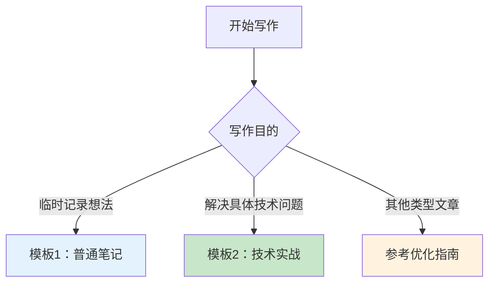
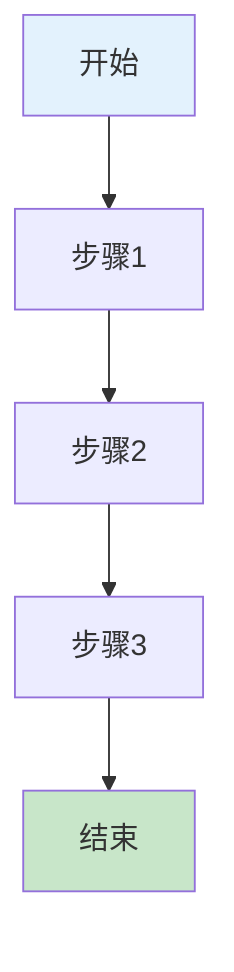
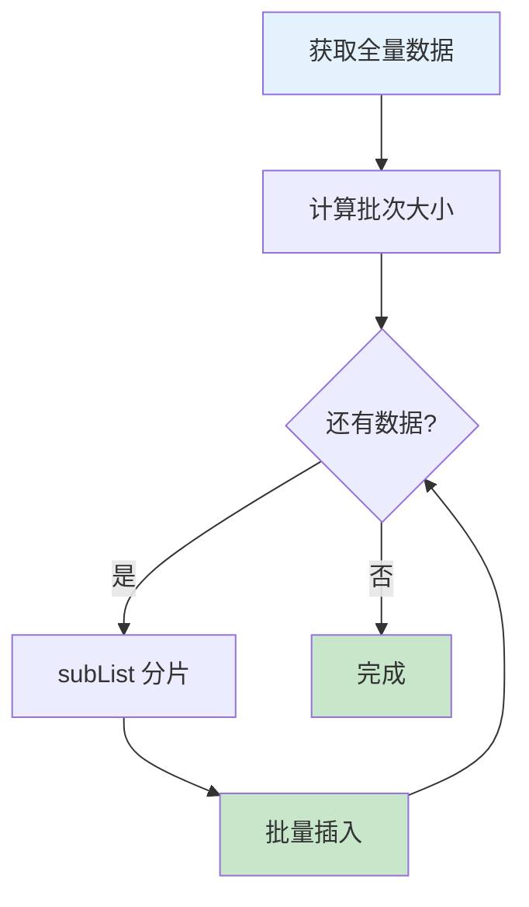

## Markdown 文章模板集合

> 🎯 **一句话定位**：针对不同场景的即用型文章模板，提升写作效率和质量
> 💡 **核心理念**：好的结构是内容成功的一半

## 📋 目录

- [模板使用指南](#模板使用指南)

- [模板1：普通笔记（轻量级）](#模板1普通笔记轻量级)

- [模板2：问题-方法型技术实战（完整级）](#模板2问题方法型技术实战完整级)

- [与现有文档的关系](#与现有文档的关系)

---

## 模板使用指南

### 如何选择模板



### 模板等级说明

| 等级 | 适用场景 | 模板 | 时间投入 |
|------|----------|------|----------:|
| 📝 轻量级 | 快速记录想法、临时笔记 | 模板1 | 5-15 分钟 |
| 💻 完整级 | 解决问题的技术实战 | 模板2 | 1-3 小时 |
| 📚 专业级 | 深度技术文章 | 优化指南 | 3+ 小时 |

### 使用原则

1. **灵活调整**：模板是起点，不是终点

2. **按需选择**：不必包含所有章节

3. **渐进完善**：轻量笔记可后续升级为完整文章

4. **保持一致**：同类型文章使用相同结构

---

## 模板1：普通笔记（轻量级）

### 适用场景

- 💡 临时记录想法和灵感

- 📚 学习笔记和阅读记录

- 🗣️ 会议纪要和讨论记录

- 🎯 待办事项和行动清单

### 必备元素清单

- [ ] 一句话核心观点

- [ ] 关键要点列表

- [ ] 可行动项（如果有）

### 可选章节模板

根据实际需求选择以下章节：

| 章节 | 适用场景 | 使用频率 |
|------|----------|----------:|
| 💭 背景/触发点 | 记录为什么有这个想法 | ⭐⭐⭐ |
| 🔑 核心洞察 | 最重要的发现/结论 | ⭐⭐⭐⭐⭐ |
| 📊 要点清单 | 分条列出的关键点 | ⭐⭐⭐⭐⭐ |
| 🔗 相关资源 | 参考链接/相关阅读 | ⭐⭐⭐ |
| ❓ 待思考问题 | 未解的疑问 | ⭐⭐ |
| ✅ 行动项 | 接下来要做什么 | ⭐⭐⭐⭐ |
| 🏷️ 标签 | 分类标记 | ⭐⭐⭐⭐ |

### 最小示例

```markdown
---
layout: post
title: 文章标题
date: YYYY-MM-DD HH:mm:ss +0800
categories: [分类]
tags: [标签1, 标签2]
toc: false
---

## 💭 [标题]

> 💡 核心观点：一句话总结

### 🔑 关键洞察
- 要点1
- 要点2
- 要点3

### ✅ 行动项

- [ ] 待办1

- [ ] 待办2
```

### 完整示例

```markdown
---
layout: post
title: 关于5W1H框架的思考
date: 2025-01-12 10:00:00 +0800
categories: [mindset]
tags: [5W1H, 思维框架, 笔记]
toc: false
---

## 💭 关于5W1H框架的思考

> 💡 核心观点：5W1H不是简单的6个问题，而是一个思维闭环系统

### 💭 背景/触发点

今天在写技术文章时，发现总是遗漏一些关键要素。回想起5W1H框架，决定重新审视它的价值。

### 🔑 核心洞察

- 5W1H应该分层使用：战略层（What/Why）→ 用户层（Who/Where）→ 执行层（When/How）

- 每个要素相互关联，改变一个需要重新审视整体

- 它是迭代工具，不是一次性填完就忘的检查清单

### 📊 要点清单

- **战略层**：先定方向，方向错了做得再快也没用

- **用户层**：再看资源，有什么资源做什么事

- **执行层**：最后谈落地，有了方向和资源才能规划执行

### 🔗 相关资源

- [5W1H思维框架完整文章](./2025-04-24-5w1h-ai-knowledge-base-methodology.md)

### ❓ 待思考问题

- 如何在敏捷开发中应用5W1H而不降低效率？

- 5W1H与OKR、PDCA等方法论如何配合？

### ✅ 行动项

- [x] 整理5W1H框架要点

- [ ] 在下一个项目中尝试应用

- [ ] 总结实际使用体验
```

---

## 模板2：问题-方法型技术实战（完整级）

### 适用场景

- 🎯 解决具体技术问题的实战文章
- 💻 "基于X实现Y"类型的技术方案
- ⚡ 性能优化和问题排查记录
- 🚀 生产环境实践经验总结

**典型标题格式**：

- `Java 分批处理实战：基于 subList 实现数据分片入库`

- `解决 Redis 缓存穿透问题：布隆过滤器实战指南`

- `MySQL 慢查询优化：从 3 秒到 50 毫秒的优化之路`

### 必备元素清单

- [ ] 问题背景（为什么要解决）

- [ ] 方案对比（为什么选这个方案）

- [ ] 核心实现（完整可运行代码）

- [ ] 生产实践要点（坑点/边界/监控）

### 标准章节模板

```markdown
---
layout: post
title: [问题]：基于[方法]的[目标]
date: YYYY-MM-DD HH:mm:ss +0800
categories: [tech, 子分类]
tags: [技术栈, 关键词1, 关键词2]
description: 解决[具体问题]的完整技术方案，包括方案对比、代码实现、性能分析和生产实践要点
toc: true
---

## 📋 问题背景

### 业务场景
[描述具体的业务场景和需求]

### 痛点分析
[当前存在的问题或限制]

### 目标
[要达成的具体目标，最好可量化]

---

## 🔍 方案对比

### 方案调研

| 方案 | 核心思路 | 优点 | 缺点 | 适用场景 |
|------|----------|------|------|----------|
| 方案A | ... | ... | ... | ... |
| 方案B | ... | ... | ... | ... |
| 方案C | ... | ... | ... | ... |

### 选择理由
[说明为什么选择当前方案，考虑因素：性能、成本、复杂度、团队能力等]

---

## 💡 核心实现

### 3.1 实现思路



### 3.2 完整代码

```language
// 完整可运行的代码示例
// 包含注释说明关键逻辑

public class Solution {
    // 实现
}
```

### 3.3 关键点说明

- **关键点1**：说明

- **关键点2**：说明

- **关键点3**：说明

---

## ⚡ 性能分析（可选）

### 测试环境

- 硬件配置

- 软件版本

- 数据规模

### 性能数据

| 指标 | 优化前 | 优化后 | 提升 |
|------|--------|--------|------|
| 耗时 | ... | ... | ... |
| 内存 | ... | ... | ... |
| QPS | ... | ... | ... |

### 优化建议
[进一步优化的方向]

---

## 🚧 生产实践

### 边界条件
- [ ] 边界条件1：说明
- [ ] 边界条件2：说明
- [ ] 边界条件3：说明

### 常见坑点

1. **坑点1**
   - **现象**：...
   - **原因**：...
   - **解决**：...

2. **坑点2**
   - **现象**：...
   - **原因**：...
   - **解决**：...

### 监控指标
- 监控指标1：说明 + 告警阈值
- 监控指标2：说明 + 告警阈值

### 最佳实践

- 实践建议1

- 实践建议2

---

## 📚 延伸阅读

### 相关方案
- [同类问题的其他方案](链接)

### 深入学习
- [官方文档](链接)
- [源码分析](链接)

---

## ✨ 总结

### 核心要点

1. 要点1

2. 要点2

3. 要点3

### 适用场景
[总结什么情况下推荐使用此方案]

### 注意事项
[使用时需要特别注意的地方]
```

### 完整示例

```markdown
---
layout: post
title: Java 分批处理实战：基于 subList 实现数据分片入库
date: 2025-01-12 14:00:00 +0800
categories: [tech, java]
tags: [Java, 分批处理, subList, 性能优化]
description: 解决大批量数据入库导致的内存溢出和性能问题，使用 subList 实现数据分片，包含完整代码实现和性能对比
toc: true
---

## 📋 问题背景

### 业务场景
定时任务需要从第三方接口获取约10万条用户数据，并批量插入到本地数据库。

### 痛点分析
- **内存溢出**：一次性加载10万条数据导致OOM
- **性能差**：单条插入耗时约2小时
- **连接超时**：长时间占用数据库连接

### 目标
- 内存占用稳定在500MB以内
- 入库时间缩短到30分钟以内
- 无连接超时问题

---

## 🔍 方案对比

### 方案调研

| 方案 | 核心思路 | 优点 | 缺点 | 适用场景 |
|------|----------|------|------|----------|
| 单条插入 | 逐条插入 | 简单 | 性能差 | 数据量<100 |
| 原生批量插入 | `INSERT INTO ... VALUES (...),(...)` | 性能好 | SQL长度限制 | 数据量<1000 |
| 分批 + subList | 分批处理 + 批量插入 | 平衡性能和内存 | 需要处理边界 | 数据量 > 1000 |
| 流式处理 | Stream + JDBC 批处理 | 内存最优 | 代码复杂 | 超大数据量 |

### 选择理由
选择**分批 + subList**方案：

- 数据量10万条，正好在分批处理的舒适区

- 代码简单易懂，团队维护成本低

- 性能满足要求，内存可控

---

## 💡 核心实现

### 3.1 实现思路



### 3.2 完整代码

```java
import java.util.ArrayList;
import java.util.List;

public class BatchInserter {

    private static final int BATCH_SIZE = 1000;

    public void batchInsert(List<User> allUsers) {
        if (allUsers == null || allUsers.isEmpty()) {
            return;
        }

        int total = allUsers.size();
        for (int i = 0; i < total; i += BATCH_SIZE) {
            int end = Math.min(i + BATCH_SIZE, total);

            // 使用 subList 进行分片
            List<User> batch = allUsers.subList(i, end);

            // 批量插入
            insertBatch(batch);

            // 日志输出进度
            System.out.printf("进度: %d/%d (%.1f%%)%n",
                end, total, (end * 100.0 / total));
        }
    }

    private void insertBatch(List<User> batch) {
        // JDBC批量插入实现
        String sql = "INSERT INTO users (id, name, email) VALUES (?, ?, ?)";

        try (Connection conn = dataSource.getConnection();
             PreparedStatement ps = conn.prepareStatement(sql)) {

            for (User user : batch) {
                ps.setLong(1, user.getId());
                ps.setString(2, user.getName());
                ps.setString(3, user.getEmail());
                ps.addBatch();
            }

            ps.executeBatch();
        } catch (SQLException e) {
            throw new RuntimeException("批量插入失败", e);
        }
    }
}
```

### 3.3 关键点说明

- **subList 不复制数据**：返回的是原 List 的视图，不会产生内存开销
- **批次大小选择**：1000条/批是经验值，可根据实际情况调整
- **进度监控**：每批插入后输出进度，便于监控长任务

---

## ⚡ 性能分析

### 测试环境

- CPU: 4核

- 内存: 4GB

- 数据量: 10万条

- 数据库: MySQL 8.0

### 性能数据

| 指标 | 单条插入 | 分批插入 | 提升 |
|------|----------|----------|------|
| 耗时 | 7200秒 | 1800秒 | 75% |
| 内存峰值 | 2.1GB | 480MB | 77% |
| 连接占用 | 1个/2小时 | 1个/30分钟 | - |

### 优化建议

- 批次大小可根据数据大小动态调整（500-2000）

- 可考虑多线程并行处理不同批次

- 对于超大数据量（>100万），建议使用流式处理

---

## 🚧 生产实践

### 边界条件
- [ ] **空列表**：需要做空判断
- [ ] **批次边界**：使用`Math.min`处理最后一批
- [ ] **事务控制**：每批独立事务，失败不影响其他批次

### 常见坑点

1. **subList 修改问题**
   - **现象**：修改 subList 影响原 List
   - **原因**：subList 是视图，不是副本
   - **解决**：如需独立操作，使用`new ArrayList<>(subList)`

2. **大事务超时**
   - **现象**：批次过多导致事务超时
   - **原因**：整个操作在一个事务中
   - **解决**：每批独立事务

3. **内存泄漏**
   - **现象**：长时间运行后内存增长
   - **原因**：持有 subList 引用导致原 List 无法 GC
   - **解决**：及时释放批次引用

### 监控指标

- 每批处理耗时（P50/P95/P99）

- 批次失败率

- 内存使用趋势

- 数据库连接池使用率

### 最佳实践

- 批次大小根据记录大小动态调整（500-2000）

- 每批独立事务，失败可重试

- 添加详细日志，便于排查问题

- 考虑添加限流，避免影响其他业务

---

## 📚 延伸阅读

### 相关方案

- [JDBC批量插入最佳实践](https://example.com)

- [Java Stream 流式处理指南](https://example.com)

### 深入学习

- [ArrayList.subList源码分析](https://example.com)

- [MySQL 批量插入性能优化](https://example.com)

---

## ✨ 总结

### 核心要点

1. 使用 `subList` 进行数据分片，内存开销小

2. 批量插入比单条插入性能提升75%

3. 每批独立事务，失败可重试

### 适用场景

- 数据量1000-100万条

- 对内存有严格要求

- 需要进度监控的长任务

### 注意事项

- subList 是视图，不是副本

- 及时释放批次引用避免内存泄漏

- 批次大小需根据实际情况调整
```

---

## 与现有文档的关系

### 文档体系

```text
Markdown 文档体系
│
├─ 📐 格式规范
│   └─ markdown-format-check.md
│       └─ Front Matter、Markdownlint、代码格式
│
├─ 📝 内容优化
│   └─ markdown-optimization-guide.md
│       └─ 通用优化原则、可视化、类型优化
│
└─ 📋 快速模板（本文档）
    ├─ 模板1：普通笔记（轻量级）
    └─ 模板2：问题-方法型技术实战（完整级）
```

### 使用建议

| 你的需求 | 使用文档 |
|----------|----------|
| 检查格式是否符合规范 | markdown-format-check.md |
| 深度优化现有文章 | markdown-optimization-guide.md |
| **快速创建新文章** | **本文档（markdown-templates.md）** |
| 学习不同类型文章写法 | markdown-optimization-guide.md |

### 文档升级路径

```text
普通笔记（模板1）
    ↓ 需要完善内容
问题-方法型实战（模板2）
    ↓ 需要深度优化
参考优化指南 → 专业级文章
```

---

## 💬 常见问题（FAQ）

### Q1: 什么时候使用模板1（普通笔记）？

**A:** 在以下场景使用：

- 💡 快速记录灵感和想法

- 📚 临时学习笔记

- 🗣️ 会议纪要

- ⏰ 时间有限，先记录后完善

### Q2: 什么时候使用模板2（技术实战）？

**A:** 在以下场景使用：

- 🎯 解决具体技术问题

- 💻 "基于X实现Y"类型文章

- ⚡ 性能优化实战

- 🚀 生产环境实践经验

### Q3: 模板中的所有章节都必须写吗？

**A:** 不是：

- **必备元素**：建议都包含

- **可选章节**：根据实际需要选择

- **原则**：宁可少写，不要凑数

### Q4: 轻量笔记可以升级为完整文章吗？

**A:** 可以，这是推荐的工作流：

1. 用模板1快速记录想法

2. 积累一定内容后，用模板2重构

3. 参考 optimization-guide.md 深度优化

### Q5: 如何决定使用哪个模板？

**A:** 问自己以下问题：

- 是临时记录还是正式文章？ → 临时用模板1

- 是否包含代码实现？ → 是用模板2

- 是否面向他人分享？ → 是用模板2

- 时间是否充裕？ → 否用模板1，后续升级

---

## ✨ 总结

本文档提供了两个即用型文章模板：

1. **模板1：普通笔记（轻量级）**

   - 快速记录想法和灵感

   - 5-15分钟完成

   - 可选章节，灵活组合

2. **模板2：问题-方法型技术实战（完整级）**

   - 解决具体技术问题的完整方案

   - 1-3小时完成

   - 包含问题、方案对比、实现、实践

### 行动建议

1. **收藏本文档**，需要时快速查阅

2. **复制模板代码**，根据实际情况调整

3. **先完成，再完美**，轻量笔记可后续升级

4. **保持一致性**，同类型文章使用相同结构

---

## 更新记录

- 2025-01-12：初始版本，包含普通笔记模板和问题-方法型技术实战模板
