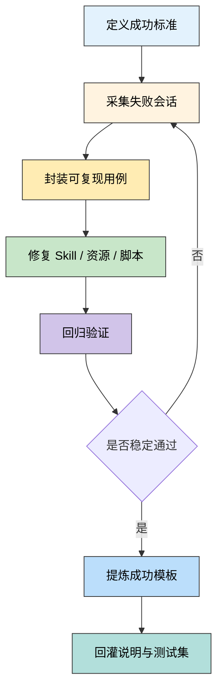

# Skill 测试闭环设计：失败复现与成功模板沉淀

本文档给出一套适合 Skill / Agent 的测试闭环，核心目标不是
"测一次通过"，而是把生产和迭代中的失败持续转化为：

- 可复现的失败样本
- 可验证的回归用例
- 可复用的成功模板

这套设计参考了 Google 在 Agent Evaluation 相关资料中的几个
共同原则：不要只看最终答案，要看 trajectory；要把真实失败
沉淀为 golden dataset；要把评估融入持续迭代，而不是等到
最后才做一次验收。

## 文档定位

- 角色：Skill / Agent 测试流程设计规范
- 适用对象：Skill 作者、Agent 工作流维护者、评测设计者
- 核心问题：如何把 Agent 的失败变成下一次必测、
  可复现、可沉淀的资产

## 这套流程解决什么问题

传统提示词调试最大的问题，不是"修不修得好"，而是：

- 失败没有被完整记录，下一次无法复现
- 修复只停留在口头经验，没有变成结构化说明
- 新增能力越来越多，但没有回归集，旧问题反复出现

因此，这套流程的设计目标是三句话：

1. 失败要抓得住
2. 修复要证得明
3. 成功要沉得下

## 核心理念

### 1. 不只评估结果，也评估过程

Agent 可能"答对了，但做错了"。例如最终输出看起来正确，
但中间读错文件、漏掉强制规则、调用了不该调用的工具。

所以测试对象至少有两层：

| 层级 | 关注点 | 典型问题 |
|------|------|------|
| 最终结果 | 输出是否满足目标 | 格式错、答案错、缺字段 |
| 执行过程 | 路径是否合理、稳定、可解释 | 漏读关键文件、错误选工具、步骤顺序错 |

### 2. 失败必须先变成可回放资产

如果一个错误只能靠人回忆"上次好像是这样坏的"，
这个错误就没有真正进入工程系统。

要把失败转成最小可回放单元，至少保留：

- 用户输入
- 运行时上下文
- 相关文件快照
- Agent 输出
- 期望输出
- 根因分析

### 3. 修复后必须决定"沉淀到哪一层"

不是每个修复都该直接写进 `SKILL.md`。
要根据稳定性和复用频率决定沉淀位置：

| 修复类型 | 该沉淀到哪里 |
|------|------|
| 高频、强约束规则 | `SKILL.md` 主流程 |
| 中频案例、成功示范 | `references/success-patterns.md` |
| 失败排查经验 | `references/failure-patterns.md` |
| 可确定执行的重复操作 | `scripts/` |
| 仅一次性的临时备注 | 不沉淀，留在 issue / PR 讨论 |

## 闭环总览



## 一套推荐的资产结构

建议每个重要 Skill 都有自己的最小测试资产目录：

```text
skill-name/
├── SKILL.md
├── references/
│   ├── success-patterns.md
│   └── failure-patterns.md
├── scripts/
│   ├── replay_case.sh
│   └── verify_case.sh
└── tests/
    ├── cases/
    │   ├── smoke/
    │   ├── regressions/
    │   └── edge/
    ├── failures/
    │   └── 2026-04-07-example-case/
    │       ├── input.md
    │       ├── context.md
    │       ├── expected.md
    │       ├── actual.md
    │       └── analysis.md
    └── manifest.md
```

其中四类资产各自解决不同问题：

| 资产 | 作用 | 何时更新 |
|------|------|------|
| `tests/cases/` | 稳定回归集 | 新能力或新缺陷进入长期维护时 |
| `tests/failures/` | 原始失败证据包 | 每次出现值得复盘的失败时 |
| `references/success-patterns.md` | 成功模板库 | 修复被验证稳定后 |
| `SKILL.md` | 强制执行规则 | 确认是高频、必须遵守的流程约束后 |

## 五段式测试流程

### 1. 先定义成功契约

先不要着急测。先回答下面四个问题：

| 问题 | 示例 |
|------|------|
| 这个 Skill 的任务边界是什么 | 只优化 Markdown 文档，不负责发布 |
| 什么叫成功 | 输出符合格式规范，并补齐更新记录表 |
| 什么叫失败 | 漏读强制规则、生成列表格式、修改错文件 |
| 哪些是必须过程 | 读取指定规范、保留原文件名、追加更新记录 |

建议把成功契约写成一个简短 Rubric：

```markdown
## Success Rubric

- R1: 必须读取 `format-rules.md`
- R2: 不得重命名目标文件
- R3: 更新记录必须使用表格格式
- R4: 输出 Markdownlint 可通过
- R5: 如果规则冲突，必须以单一权威来源为准
```

这个 Rubric 后面会同时用于：

- 人工评审
- LLM-as-Judge
- 程序化检查

### 2. 采集失败会话

每次 Agent 出错，不要立刻只改提示词。先做失败采集。

建议固定采集六类信息：

| 信息 | 说明 |
|------|------|
| 触发请求 | 用户原始输入，不做美化 |
| 输入上下文 | Agent 读了哪些文件，缺了哪些文件 |
| 环境信息 | 模型、工具、分支、时间、关键参数 |
| 实际输出 | Agent 最终输出和中间关键步骤 |
| 期望输出 | 理想行为或正确示例 |
| 根因假设 | 为什么会错，先写假设再验证 |

### 失败采集的最低标准

只要不满足下面任一项，这次失败就不算"可复现"：

- 能独立复现，不依赖提单人口头补充
- 能区分 expected 和 actual
- 能定位到最小输入样本
- 能说明错误属于规则缺失、规则冲突、资源缺失、
  工具异常或模型判断偏差中的哪一类

### 3. 把失败封装成回放用例

这一步是关键分水岭。很多团队会复盘，但不会封装，
于是经验无法积累。

建议把每个重要失败都转成一个 `failure bundle`，
然后再决定是否升级为长期回归 case。

### 失败案例模板

```markdown
# Failure Case: <case-id>

## 触发请求
<原始用户请求>

## 测试目标
<这次本来想验证什么>

## 输入上下文
- 技能版本：
- 模型版本：
- 必读文件：
- 实际读取文件：

## Expected
<正确行为说明或正确输出片段>

## Actual
<错误行为说明或错误输出片段>

## Trajectory 摘要
1. 读取了什么
2. 跳过了什么
3. 做了什么错误决策

## 根因分析
- 类型：规则缺失 / 规则冲突 / 模板污染 /
  工具异常 / 评估缺失
- 根因：

## 修复方案
- 修复点 1：
- 修复点 2：

## 回归结论
- 是否加入回归集：
- 是否沉淀为成功模板：
```

### 哪些失败要升级成回归集

满足任一条件就建议升级：

- 已在真实任务中出现两次及以上
- 会导致错误输出被用户直接采纳
- 修复涉及 `SKILL.md` 主流程变更
- 修复涉及模板、参考文档或脚本的权威性调整
- 这个错误一旦复发，排查成本很高

### 4. 修复后做双重验证

修复不是"这次看起来好了"就结束。至少做两类验证：

| 验证类型 | 目的 |
|------|------|
| Case Replay | 证明这次失败真的被修掉了 |
| Regression Sweep | 证明修复没有破坏旧能力 |

建议固定成两个问题：

1. 原失败能否稳定复现为成功
2. 相关旧案例是否仍全部通过

如果只能回答第一个，不能回答第二个，
那就不是完整修复，而是局部补丁。

### 5. 通过后沉淀成功模板

这是你最关心的一步：修完之后，
怎么把成功做法放入说明。

建议不要把整段失败历史直接塞进 `SKILL.md`，
而是提炼成"可触发、可复用、可解释"的成功模板。

### 成功模板最小结构

````markdown
## 成功模板：<pattern-name>

### 适用场景
<什么请求出现时使用>

### 必须读取
- <文件 1>
- <文件 2>

### 正确做法
1. <步骤 1>
2. <步骤 2>
3. <步骤 3>

### 正确输出示例
```markdown
<输出片段>
```

### 常见误区
- <容易犯的错>

### 为什么这次会成功
- <成功关键点>
````

### 成功模板写入规则

| 情况 | 写入位置 |
|------|------|
| 所有会话都必须遵守 | `SKILL.md` |
| 某类高频任务的成功示范 | `references/success-patterns.md` |
| 需要长篇解释的失败转正案例 | `references/failure-patterns.md` |

一个实用标准是：

- 写进 `SKILL.md` 的，应该是"强制规则"
- 写进 `success-patterns.md` 的，应该是"正确示范"
- 写进 `failure-patterns.md` 的，应该是"为什么以前会错"

## 从持续反馈到持续测试

为了真正做到持续反馈，建议把反馈拆成三层：

| 层级 | 来源 | 输出物 |
|------|------|------|
| 开发期反馈 | 作者自测、同伴评审 | smoke cases |
| 试运行反馈 | 小范围真实任务 | failures bundle |
| 生产反馈 | 用户真实请求与负反馈 | regression + golden cases |

这三层之间的转换规则是：

1. 开发期发现的问题，优先补流程和脚本
2. 试运行发现的问题，优先补回放 case
3. 生产中重复出现的问题，必须升级为 golden case

## 推荐的评估分层

把每次 Skill 测试拆成三层，会比单一"人工看看还行"
稳很多：

| 层级 | 方法 | 检查内容 |
|------|------|------|
| L1 | 程序化检查 | 文件格式、字段、结构、硬规则 |
| L2 | Rubric / LLM Judge | 是否读了对的资料、路径是否合理 |
| L3 | 人工抽检 | 真实可用性、风格、边界情况 |

不要让 LLM Judge 单独做裁判。
更推荐的顺序是：

1. 先用人工定义 Rubric
2. 再让 LLM 按 Rubric 扩展评测
3. 最后用程序化校验兜底硬规则

## 一个适合写进团队规范的准入门槛

当一个 Skill 要进入"可发布"状态时，至少满足：

- 有 3 个以上 smoke cases
- 有 1 个以上真实失败转回归 case
- 有明确 success rubric
- 有一份 `success-patterns.md`
- 有一条从失败升级为模板的真实案例

如果缺最后一条，说明这个 Skill 还没有真正经过闭环验证。

## 典型案例：把失败修复沉淀成成功模板

下面用一个非常贴近你当前仓库的例子说明。

### 场景

用户要求 Agent 修改既有文章，并补充"更新记录"。

### 失败现象

Agent 输出了列表：

```markdown
- 2026-04-07：补充说明
```

但仓库规范要求的是表格：

```markdown
## 更新记录

| 版本 | 日期 | 说明 |
|------|------|------|
| v1.1 | 2026-04-07 | 补充说明 |
```

### 根因

不是 Agent "忘了"，
而是规则分散在多处，且存在冲突或未强制加载。

### 正确修复方式

| 修复动作 | 目的 |
|------|------|
| 在 `SKILL.md` 写入必须读取的权威规范 | 消除漏读 |
| 删除重复且冲突的旧描述 | 消除多源冲突 |
| 将这个失败做成 regression case | 防止未来复发 |
| 在 `success-patterns.md` 加入正确示例 | 给 Agent 明确正例 |

### 最终沉淀出的成功模板

````markdown
## 成功模板：追加更新记录表

### 适用场景
修改已有文章且需要补充更新记录时。

### 必须读取
- AGENTS.md
- format-rules.md

### 正确做法
1. 保持原文件名不变
2. 在文末定位 `## 更新记录`
3. 以表格形式追加新版本行

### 正确输出示例
```markdown
| v1.2 | 2026-04-07 | 补充测试流程说明 |
```

### 常见误区
- 使用列表代替表格
- 修改原始发布日期
- 新建文件替代原文件
````

这就是"失败修复后把成功模板放入说明"的标准动作。

## 一页式执行清单

每次 Skill 迭代时，按这张清单走：

- [ ] 先写 success rubric
- [ ] 记录原始请求与上下文
- [ ] 保存 expected / actual
- [ ] 写 failure bundle
- [ ] 将失败缩成最小可回放 case
- [ ] 修复 Skill / references / scripts
- [ ] 回放旧失败 case
- [ ] 扫描相关回归集
- [ ] 提炼成功模板
- [ ] 决定写入 `SKILL.md` 还是 `success-patterns.md`

## 最推荐的落地顺序

如果你现在就要开始搭建这一套，不要一次性做很大。
建议按下面顺序推进：

1. 先建立 `success rubric`
2. 再建立 `failures/` 与 `cases/regressions/`
3. 接着补一份 `success-patterns.md`
4. 最后再考虑自动化 replay / verify 脚本

这样能最快让你的 Skill 从"靠经验调"变成"有资产沉淀"。

## 参考资料

- Google Cloud 关于 agent evaluation 的方法论文档
- Google Cloud 关于 Vertex AI agent evaluation 的官方说明
- Google Cloud 关于 agent tracing 的官方说明

---

## 更新记录

| 版本 | 日期 | 说明 |
|------|------|------|
| v1.0 | 2026-04-07 | 初始版本，新增 Skill 测试闭环与成功模板沉淀方法 |
| v1.1 | 2026-04-07 | 去掉文件名日期前缀，统一 `source/docs` 命名规范 |
