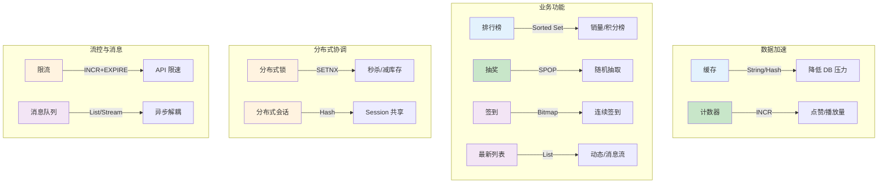

> 🎯 **一句话定位**：从零搭建 Redis 环境到落地 10 大业务场景的一站式实战手册
> 💡 **核心理念**：Redis 不只是缓存，它是解决高并发、分布式协调、实时计算等问题的瑞士军刀

---

## 📖 3分钟速览版

<details>
<summary><strong>📊 点击展开核心概念和快速参考</strong></summary>

### 🔌 Redis 10 大业务场景全景图



### 📋 常用命令速查

| 操作 | 命令 | 说明 |
|------|------|------|
| 启动服务 | `redis-server` | 前台启动 |
| 后台启动 | `redis-server --daemonize yes` | 守护进程模式 |
| 连接客户端 | `redis-cli` | 默认 127.0.0.1:6379 |
| 认证 | `AUTH <password>` | 有密码时需要 |
| 设置缓存 | `SET key value EX 60` | 60 秒过期 |
| 自增计数 | `INCR key` | 原子自增 |
| 排行榜加分 | `ZADD rank 100 user1` | 添加/更新分数 |
| 分布式锁 | `SET lock val NX EX 10` | 不存在时设置，10 秒过期 |
| 队列写入 | `LPUSH queue msg` | 左侧入队 |
| 队列消费 | `RPOP queue` | 右侧出队 |

### 🎯 业务场景选择指南

| 场景 | 推荐数据结构 | 核心命令 | 复杂度 |
|------|-------------|---------|--------|
| 缓存 | String / Hash | GET/SET/HGETALL | 低 |
| 排行榜 | Sorted Set | ZADD/ZREVRANGE | 中 |
| 计数器 | String / Hash | INCR/HINCRBY | 低 |
| 限流 | String | INCR + EXPIRE | 低 |
| 分布式会话 | Hash | HSET/HGETALL | 中 |
| 分布式锁 | String | SET NX EX | 中 |
| 消息队列 | List / Stream | LPUSH/RPOP/XADD | 高 |
| 抽奖 | Set | SADD/SPOP | 低 |
| 签到 | Bitmap | SETBIT/BITCOUNT | 中 |
| 最新列表 | List | LPUSH/LRANGE | 低 |

</details>

---

## 🧠 深度剖析版

## 1. Redis 安装

### 1.1 macOS 安装（Homebrew）

如果未安装 Homebrew，先执行以下命令：

```shell
/bin/bash -c "$(curl -fsSL https://gitee.com/cunkai/HomebrewCN/raw/master/Homebrew.sh)"
```

安装 Redis：

```shell
brew install redis@6.2.6  # @后可指定版本
```

启动 / 停止 / 重启服务：

```shell
# 启动 Redis 服务
brew services start redis

# 停止 Redis 服务
brew services stop redis

# 重启 Redis 服务
brew services restart redis
```

设置开机启动：

```shell
ln -sfv /usr/local/opt/redis/*.plist ~/Library/LaunchAgents
```

卸载 Redis：

```shell
brew uninstall redis
rm ~/Library/LaunchAgents/homebrew.mxcl.redis.plist
```

### 1.2 Linux 安装（apt / yum）

**Ubuntu / Debian：**

```shell
# 更新包索引并安装
sudo apt update
sudo apt install redis-server -y

# 启动并设置开机自启
sudo systemctl start redis-server
sudo systemctl enable redis-server

# 检查运行状态
sudo systemctl status redis-server
```

**CentOS / RHEL：**

```shell
# 安装 EPEL 仓库（CentOS 7）
sudo yum install epel-release -y
sudo yum install redis -y

# 启动并设置开机自启
sudo systemctl start redis
sudo systemctl enable redis

# 检查运行状态
sudo systemctl status redis
```

验证安装成功：

```shell
redis-cli ping
# 输出：PONG
```

### 1.3 Docker 安装

**快速启动（适合开发测试）：**

```shell
# 拉取官方镜像并启动
docker run -d \
  --name redis \
  -p 6379:6379 \
  redis:7-alpine

# 验证
docker exec -it redis redis-cli ping
# 输出：PONG
```

**生产环境推荐配置：**

```shell
# 带密码和持久化的启动方式
docker run -d \
  --name redis \
  -p 6379:6379 \
  -v /data/redis/data:/data \
  -v /data/redis/conf/redis.conf:/etc/redis/redis.conf \
  --restart always \
  redis:7-alpine redis-server /etc/redis/redis.conf
```

**使用 Docker Compose：**

```yaml
# docker-compose.yml
version: '3.8'
services:
  redis:
    image: redis:7-alpine
    container_name: redis
    ports:
      - "6379:6379"
    volumes:
      - redis_data:/data
      - ./redis.conf:/etc/redis/redis.conf
    command: redis-server /etc/redis/redis.conf
    restart: always

volumes:
  redis_data:
```

```shell
docker compose up -d
```

## 2. Redis 常用命令

### 2.1 服务管理

```shell
# 使用配置文件启动 redis-server
redis-server /usr/local/etc/redis.conf

# 连接命令行客户端
redis-cli

# 连接远程 Redis
redis-cli -h 192.168.1.100 -p 6379 -a your_password

# 优雅关闭（会触发持久化）
redis-cli shutdown
```

### 2.2 常用数据操作

```shell
# ---- String ----
SET name "Redis"
GET name                    # "Redis"
SET counter 0
INCR counter                # 1
INCRBY counter 10           # 11

# ---- Hash ----
HSET user:1 name "Tom" age 25
HGET user:1 name            # "Tom"
HGETALL user:1              # "name" "Tom" "age" "25"
HINCRBY user:1 age 1        # 26

# ---- List ----
LPUSH queue "task1" "task2"
RPOP queue                  # "task1"
LRANGE queue 0 -1           # 查看全部

# ---- Set ----
SADD lottery "user1" "user2" "user3"
SPOP lottery 1              # 随机弹出 1 个

# ---- Sorted Set ----
ZADD rank 100 "player1" 200 "player2"
ZREVRANGE rank 0 9 WITHSCORES  # Top 10

# ---- Bitmap ----
SETBIT sign:user1:202302 16 1  # 第 17 天签到
BITCOUNT sign:user1:202302     # 统计签到天数
```

## 3. Redis 配置详解

### 3.1 配置文件位置

| 安装方式 | 配置文件路径 |
|---------|-------------|
| macOS Homebrew | `/usr/local/etc/redis.conf` |
| Ubuntu apt | `/etc/redis/redis.conf` |
| CentOS yum | `/etc/redis.conf` |
| Docker | 挂载自定义 `redis.conf` |

### 3.2 关键配置项

```text
# 绑定地址（生产环境不要用 0.0.0.0）
bind 127.0.0.1

# 端口
port 6379

# 是否以守护进程运行（Docker 中设为 no）
daemonize yes

# 设置密码（强烈建议设置）
requirepass your_strong_password

# 最大内存限制（推荐物理内存的 70-80%）
maxmemory 2gb

# 内存淘汰策略
# allkeys-lru: 所有 key 中淘汰最近最少使用的（推荐缓存场景）
# volatile-lru: 仅淘汰设置了过期时间的 key
# noeviction: 不淘汰，内存满时写入报错
maxmemory-policy allkeys-lru

# 持久化 - RDB 快照
save 900 1        # 900 秒内至少 1 次修改则快照
save 300 10       # 300 秒内至少 10 次修改则快照
save 60 10000     # 60 秒内至少 10000 次修改则快照

# 持久化 - AOF 日志
appendonly yes
appendfsync everysec  # 每秒同步（推荐）

# 慢查询日志
slowlog-log-slower-than 10000  # 超过 10ms 记录
slowlog-max-len 128            # 最多保留 128 条

# 客户端最大连接数
maxclients 10000

# 客户端空闲超时（秒，0 表示不超时）
timeout 300
```

### 3.3 配置验证

```shell
# 进入 redis-cli 后查看配置
CONFIG GET maxmemory
CONFIG GET requirepass

# 运行时动态修改配置（重启后失效）
CONFIG SET maxmemory 4gb
CONFIG SET maxmemory-policy allkeys-lru

# 将运行时配置写入配置文件持久化
CONFIG REWRITE
```

## 4. SpringBoot 整合 Redis

### 4.1 添加依赖

```xml
<dependency>
   <groupId>org.springframework.boot</groupId>
   <artifactId>spring-boot-starter-data-redis</artifactId>
</dependency>
<!-- 连接池（推荐） -->
<dependency>
   <groupId>org.apache.commons</groupId>
   <artifactId>commons-pool2</artifactId>
</dependency>
```

### 4.2 application.yml 配置

```yaml
spring:
  redis:
    host: 127.0.0.1
    port: 6379
    password:           # 有密码时填写
    timeout: 20000
    lettuce:
      pool:
        max-active: 8   # 最大连接数
        max-idle: 8     # 最大空闲连接
        min-idle: 2     # 最小空闲连接
        max-wait: -1ms  # 等待连接的最大阻塞时间（-1 表示无限制）
```

### 4.3 Redis 配置类

```java
@Configuration
public class RedisConfig {

    @Bean
    public RedisTemplate<String, Object> redisTemplate(
            RedisConnectionFactory connectionFactory) {
        RedisTemplate<String, Object> template = new RedisTemplate<>();
        template.setConnectionFactory(connectionFactory);

        // Key 使用 String 序列化
        template.setKeySerializer(new StringRedisSerializer());
        template.setHashKeySerializer(new StringRedisSerializer());

        // Value 使用 JSON 序列化
        Jackson2JsonRedisSerializer<Object> jsonSerializer =
                new Jackson2JsonRedisSerializer<>(Object.class);
        ObjectMapper om = new ObjectMapper();
        om.activateDefaultTyping(
                om.getPolymorphicTypeValidator(),
                ObjectMapper.DefaultTyping.NON_FINAL);
        jsonSerializer.setObjectMapper(om);

        template.setValueSerializer(jsonSerializer);
        template.setHashValueSerializer(jsonSerializer);
        template.afterPropertiesSet();
        return template;
    }
}
```

### 4.4 RedisTemplate 常用操作

```java
@Service
public class RedisService {

    @Autowired
    private RedisTemplate<String, Object> redisTemplate;

    // ---- String 操作 ----

    /** 设置缓存（带过期时间） */
    public void set(String key, Object value, long timeout, TimeUnit unit) {
        redisTemplate.opsForValue().set(key, value, timeout, unit);
    }

    /** 获取缓存 */
    public Object get(String key) {
        return redisTemplate.opsForValue().get(key);
    }

    /** 自增（计数器） */
    public Long increment(String key) {
        return redisTemplate.opsForValue().increment(key);
    }

    // ---- Hash 操作 ----

    /** 设置 Hash 字段 */
    public void hSet(String key, String field, Object value) {
        redisTemplate.opsForHash().put(key, field, value);
    }

    /** 获取 Hash 全部字段 */
    public Map<Object, Object> hGetAll(String key) {
        return redisTemplate.opsForHash().entries(key);
    }

    /** Hash 字段自增 */
    public Long hIncr(String key, String field, long delta) {
        return redisTemplate.opsForHash().increment(key, field, delta);
    }

    // ---- Sorted Set 操作 ----

    /** 添加排行榜分数 */
    public Boolean zAdd(String key, Object value, double score) {
        return redisTemplate.opsForZSet().add(key, value, score);
    }

    /** 获取排行榜 Top N */
    public Set<Object> zRevRange(String key, long start, long end) {
        return redisTemplate.opsForZSet().reverseRange(key, start, end);
    }

    // ---- 通用操作 ----

    /** 设置过期时间 */
    public Boolean expire(String key, long timeout, TimeUnit unit) {
        return redisTemplate.expire(key, timeout, unit);
    }

    /** 删除 key */
    public Boolean delete(String key) {
        return redisTemplate.delete(key);
    }

    /** 判断 key 是否存在 */
    public Boolean hasKey(String key) {
        return redisTemplate.hasKey(key);
    }
}
```

## 5. Redis 10 大业务场景实战

### 5.1 缓存

缓存是 Redis 最经典的使用场景，将热点数据存入 Redis 以降低数据库压力。

**要点：**

- 不同对象的 key 不能重复，推荐 `类名:主键` 格式
- 选择合适的序列化方式，减少内存占用
- 缓存内容需与数据库保持一致（缓存更新策略）

```java
// 缓存读取模式（Cache-Aside）
public User getUser(Long userId) {
    String key = "user:" + userId;

    // 1. 先查缓存
    User user = (User) redisTemplate.opsForValue().get(key);
    if (user != null) {
        return user;
    }

    // 2. 缓存未命中，查数据库
    user = userMapper.selectById(userId);
    if (user != null) {
        // 3. 写入缓存，设置过期时间（防止缓存雪崩加随机值）
        int expire = 3600 + new Random().nextInt(600);
        redisTemplate.opsForValue().set(key, user, expire, TimeUnit.SECONDS);
    }
    return user;
}
```

### 5.2 排行榜

利用 Sorted Set 天然的排序能力实现各类排行榜，如销量榜、积分榜。

```shell
# 添加用户分数
ZADD daily_rank 500 "user:1001"
ZADD daily_rank 800 "user:1002"
ZADD daily_rank 650 "user:1003"

# 获取 Top 10（降序）
ZREVRANGE daily_rank 0 9 WITHSCORES

# 增加用户分数
ZINCRBY daily_rank 50 "user:1001"

# 查询用户排名（从 0 开始）
ZREVRANK daily_rank "user:1001"

# 查询用户分数
ZSCORE daily_rank "user:1001"
```

```java
// SpringBoot 排行榜示例
public List<RankItem> getTopN(String rankKey, int n) {
    Set<ZSetOperations.TypedTuple<Object>> tuples =
            redisTemplate.opsForZSet().reverseRangeWithScores(rankKey, 0, n - 1);
    List<RankItem> result = new ArrayList<>();
    int rank = 1;
    for (ZSetOperations.TypedTuple<Object> tuple : tuples) {
        result.add(new RankItem(rank++, tuple.getValue().toString(),
                tuple.getScore()));
    }
    return result;
}
```

### 5.3 计数器

Redis 的 INCR 命令天然具有原子性，非常适合点赞、阅读数、播放量等计数场景。先写入 Redis 再定时同步数据库，充分发挥高读写特性。

```shell
# 文章阅读量自增
INCR article:view:10001

# 获取阅读量
GET article:view:10001
```

**微博动态四维计数（Hash 方案）：**

```shell
# 初始化微博计数
HSET weibo:20001 like_number 0 comment_number 0 forward_number 0 view_number 0

# 点赞 +1
HINCRBY weibo:20001 like_number 1

# 浏览 +1
HINCRBY weibo:20001 view_number 1

# 获取全部计数
HGETALL weibo:20001
```

**每日注册用户计数：**

```shell
# 设置当天计数器，0 点过期
SET daily_register:20230217 0
EXPIREAT daily_register:20230217 1676649600  # 当天 24:00 的时间戳

# 每次注册 +1
INCR daily_register:20230217
```

### 5.4 限流

以访问者的 IP 或用户 ID 作为 key，每次访问计数加一，超出阈值则拒绝请求。

```shell
# 简单限流：每分钟最多 100 次请求
# 假设 key 为 rate:ip:192.168.1.1
INCR rate:ip:192.168.1.1
EXPIRE rate:ip:192.168.1.1 60  # 首次设置 60 秒过期
```

```java
// SpringBoot 简单限流示例
public boolean isAllowed(String clientId, int maxRequests, int windowSeconds) {
    String key = "rate:" + clientId;
    Long count = redisTemplate.opsForValue().increment(key);
    if (count == 1) {
        // 首次请求，设置过期时间
        redisTemplate.expire(key, windowSeconds, TimeUnit.SECONDS);
    }
    return count <= maxRequests;
}
```

### 5.5 分布式会话

集群模式下，应用较少时可使用容器自带的 Session 复制功能；应用增多时，搭建以 Redis 为中心的 Session 服务，Session 不再由容器管理。

**Spring Session + Redis 方案：**

```xml
<dependency>
    <groupId>org.springframework.session</groupId>
    <artifactId>spring-session-data-redis</artifactId>
</dependency>
```

```yaml
spring:
  session:
    store-type: redis
    timeout: 1800  # Session 超时时间（秒）
```

```java
// 启用 Redis Session
@EnableRedisHttpSession(maxInactiveIntervalInSeconds = 1800)
@Configuration
public class SessionConfig {
}
```

配置完成后，HttpSession 自动存储在 Redis 中，多个应用实例共享同一份 Session 数据。

### 5.6 分布式锁

对同一资源的并发访问（全局 ID 生成、减库存、秒杀等场景），利用 Redis 的 SETNX 功能实现互斥锁。

**SET 命令参数说明：**

- `EX`：设置键的过期时间（单位为秒）
- `PX`：设置键的过期时间（单位为毫秒）
- `NX`：只在键不存在时，才对键进行设置操作
- `XX`：只在键已经存在时，才对键进行设置操作

**Redis 命令方式：**

```shell
# 加锁（NX 保证互斥，EX 防止死锁）
SET lock_key unique_value NX EX 10

# 释放锁（Lua 脚本保证原子性，只释放自己持有的锁）
EVAL "if redis.call('get',KEYS[1]) == ARGV[1] then return redis.call('del',KEYS[1]) else return 0 end" 1 lock_key unique_value
```

**生产环境推荐使用 Redisson：**

```java
// Redisson 分布式锁示例
@Autowired
private RedissonClient redissonClient;

public void deductStock(String productId) {
    RLock lock = redissonClient.getLock("lock:stock:" + productId);
    try {
        // 尝试加锁：等待 5 秒，锁自动释放时间 10 秒
        if (lock.tryLock(5, 10, TimeUnit.SECONDS)) {
            // 执行减库存逻辑
            int stock = getStock(productId);
            if (stock > 0) {
                updateStock(productId, stock - 1);
            }
        }
    } catch (InterruptedException e) {
        Thread.currentThread().interrupt();
    } finally {
        if (lock.isHeldByCurrentThread()) {
            lock.unlock();
        }
    }
}
```

### 5.7 消息队列

Redis List 是双向链表，生产者 LPUSH 消息，消费者 RPOP 消费。需要优先级可使用 Sorted Set，需要持久化和消费组可使用 Stream（Redis 5.0+）。

```shell
# ---- List 简单队列 ----

# 生产者：推送消息
LPUSH task_queue "task:order:1001"
LPUSH task_queue "task:order:1002"

# 消费者：阻塞式消费（推荐，避免空轮询）
BRPOP task_queue 30  # 阻塞等待 30 秒

# ---- Stream 消息队列（推荐） ----

# 生产者
XADD mystream * action "order" orderId "1001"

# 创建消费组
XGROUP CREATE mystream mygroup 0

# 消费者读取
XREADGROUP GROUP mygroup consumer1 COUNT 1 BLOCK 2000 STREAMS mystream >

# 确认消费
XACK mystream mygroup 1675000000000-0
```

### 5.8 抽奖

Redis Set 的 SPOP 命令可以随机移除并返回一个或多个元素，天然适合抽奖场景。

```shell
# 添加参与抽奖的用户
SADD lottery:2023 "user:1001" "user:1002" "user:1003" "user:1004" "user:1005"

# 抽取 1 名中奖者（移除式，不可重复中奖）
SPOP lottery:2023 1

# 抽取 3 名中奖者
SPOP lottery:2023 3

# 如果允许重复中奖，使用 SRANDMEMBER（不移除）
SRANDMEMBER lottery:2023 3
```

### 5.9 签到

利用 Bitmap 实现签到功能，每个用户每月仅需 4 字节即可记录整月签到状态，极其节省内存。

```shell
# 用户 1001 在 2023 年 2 月第 17 天签到（offset 从 0 开始，第 17 天 = offset 16）
SETBIT sign:1001:202302 16 1

# 查看第 17 天是否签到
GETBIT sign:1001:202302 16
# 输出：1

# 统计 2 月签到总天数
BITCOUNT sign:1001:202302
# 输出：签到天数

# 获取 2 月首次签到日期
BITPOS sign:1001:202302 1
# 输出：首次签到的 offset
```

### 5.10 显示最新的项目列表

利用 List 的 LPUSH 和 LRANGE 实现，新数据始终在列表头部，适合"最新动态"类场景。

```shell
# 新消息入列表头部
LPUSH timeline:user1001 "post:5001"
LPUSH timeline:user1001 "post:5002"
LPUSH timeline:user1001 "post:5003"

# 获取最新 10 条
LRANGE timeline:user1001 0 9

# 只保留最新 100 条（裁剪列表）
LTRIM timeline:user1001 0 99
```

```java
// SpringBoot 最新列表示例
public void addToTimeline(String userId, String postId) {
    String key = "timeline:" + userId;
    redisTemplate.opsForList().leftPush(key, postId);
    // 只保留最新 100 条
    redisTemplate.opsForList().trim(key, 0, 99);
}

public List<Object> getTimeline(String userId, int page, int size) {
    String key = "timeline:" + userId;
    long start = (long) page * size;
    long end = start + size - 1;
    return redisTemplate.opsForList().range(key, start, end);
}
```

## 💬 常见问题（FAQ）

### Q1: Redis 为什么这么快？

**A:** Redis 的高性能主要来自三个方面：

1. **纯内存操作**：数据存储在内存中，读写速度极快
2. **单线程模型**：避免了多线程上下文切换和锁竞争的开销
3. **IO 多路复用**：使用 epoll/kqueue 等机制，单线程即可处理大量并发连接

官方基准：单实例 QPS 可达 10 万+。

### Q2: 缓存穿透、缓存击穿、缓存雪崩怎么解决？

**A:**

| 问题 | 症状 | 解决方案 |
|------|------|---------|
| **缓存穿透** | 大量请求查询不存在的 key，直接打到 DB | 布隆过滤器 / 缓存空值（短过期时间） |
| **缓存击穿** | 热点 key 过期瞬间，大量请求涌入 DB | 互斥锁（SETNX） / 热点 key 永不过期 |
| **缓存雪崩** | 大量 key 同时过期，DB 压力骤增 | 过期时间加随机值 / 多级缓存 / 限流降级 |

### Q3: Redis 持久化选 RDB 还是 AOF？

**A:** 根据场景选择：

- **RDB**：定时快照，恢复速度快，但可能丢失最后一次快照后的数据。适合灾难恢复和备份
- **AOF**：记录每条写命令，数据更安全（最多丢失 1 秒数据），但文件较大。适合数据安全要求高的场景
- **推荐**：两者同时开启。Redis 重启时优先用 AOF 恢复（数据更完整）

### Q4: Redis 内存满了怎么办？

**A:** 配置 `maxmemory` 和淘汰策略：

1. 先确认是否有不合理的大 key：`redis-cli --bigkeys`
2. 设置合理的 `maxmemory` 值（物理内存的 70-80%）
3. 选择合适的淘汰策略：
   - 纯缓存场景：`allkeys-lru`（淘汰最近最少使用的 key）
   - 缓存 + 持久化混合：`volatile-lru`（只淘汰设置了过期时间的 key）
   - 不允许丢数据：`noeviction`（写入直接报错）

### Q5: 什么时候不该用 Redis？

**A:** 以下场景 Redis 并非最佳选择：

1. **数据量超过内存**：Redis 是内存数据库，数据量远大于可用内存时成本过高
2. **复杂查询**：需要 JOIN、聚合等复杂 SQL 操作，关系型数据库更合适
3. **强事务需求**：Redis 事务不支持回滚，对事务一致性要求极高的场景应使用 RDBMS
4. **冷数据存储**：访问频率极低的数据放 Redis 浪费内存资源
5. **大 Value 场景**：单个 value 超过 10KB 时性能下降明显，超过 1MB 应考虑其他方案

## ✨ 总结

### 核心要点

1. **安装灵活**：Homebrew（macOS）、apt/yum（Linux）、Docker 三种方式覆盖主流环境
2. **配置关键项**：`maxmemory`、`requirepass`、`maxmemory-policy` 是生产环境必须关注的配置
3. **SpringBoot 整合**：RedisTemplate 提供了完整的数据操作 API，配合 JSON 序列化提升可读性
4. **场景丰富**：10 大业务场景覆盖缓存、分布式协调、实时计算等核心需求

### 行动建议

- **入门阶段**：先掌握安装配置和 5 种基础数据结构的 CRUD 命令
- **项目实战**：从缓存场景切入，逐步引入分布式锁、限流等高级用法
- **生产部署**：务必设置密码、配置持久化策略、限制最大内存，并做好监控

---

## 更新记录

- 2023-02-17：初始版本
- 2026-03-11：优化文档结构，扩充安装方式和场景示例，添加 FAQ
