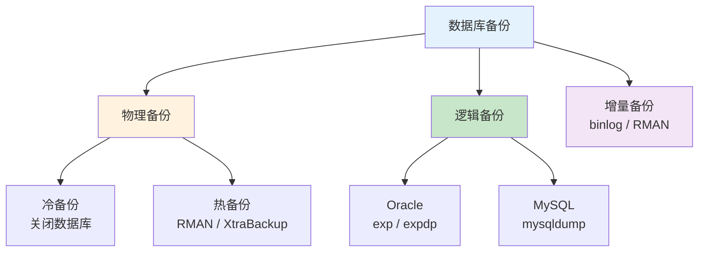

> 🎯 **一句话定位**：一站式掌握 Oracle 与 MySQL 的备份恢复方法，从概念到命令，拿来即用
> 💡 **核心理念**：备份不是可选项而是必选项——理解分类体系、选对工具、定期验证，才能在灾难来临时从容应对

---

## 📖 3分钟速览版

<details>
<summary><strong>📊 点击展开核心概念与速查表</strong></summary>

### 备份分类全景图



### Oracle vs MySQL 备份方式对比

| 对比维度 | Oracle | MySQL |
|---------|--------|-------|
| 传统逻辑导出 | `exp` / `imp`（客户端工具） | `mysqldump`（客户端工具） |
| 数据泵导出 | `expdp` / `impdp`（服务端工具） | — |
| 物理热备 | RMAN | Percona XtraBackup |
| 增量备份 | RMAN 增量备份 | binlog + mysqlbinlog |
| 空表导出 | `expdp`（10g+ 推荐） | `mysqldump`（默认支持） |
| 跨用户导入 | `remap_schema` 参数 | 手动修改 SQL 文件 |
| 并行加速 | `PARALLEL` 参数 | `--single-transaction` + 多线程 |

### 命令速查表

| 操作 | Oracle（expdp/impdp） | MySQL（mysqldump） |
|------|----------------------|-------------------|
| 全库导出 | `expdp sys/pwd@orcl full=y dumpfile=full.dmp directory=dir` | `mysqldump -u root -p --all-databases > full.sql` |
| 按用户/库导出 | `expdp user/pwd schemas=user dumpfile=u.dmp directory=dir` | `mysqldump -u root -p --database dbname > db.sql` |
| 按表导出 | `expdp user/pwd tables=t1,t2 dumpfile=t.dmp directory=dir` | `mysqldump -u root -p dbname t1 t2 > t.sql` |
| 全库导入 | `impdp user/pwd full=y dumpfile=full.dmp directory=dir` | `mysql -u root -p < full.sql` |
| 导入到其他用户 | `impdp B/pwd remap_schema=A:B dumpfile=a.dmp directory=dir` | 修改 SQL 文件中的 `USE` 语句 |

</details>

---

## 🧠 深度剖析版

## 1. 备份基础概念

### 1.1 什么是备份

备份就是把数据库复制到转储设备的过程。转储设备是指用于放置数据库副本的磁带或磁盘。通常也将存放于转储设备中的数据库的副本称为原数据库的备份或转储。简单来说，备份就是一份数据副本。

### 1.2 备份分类

#### 按物理与逻辑角度分类

从物理与逻辑的角度，备份可以分为**物理备份**和**逻辑备份**：

- **物理备份**：对数据库操作系统的物理文件（数据文件、控制文件和日志文件）的备份
  - **冷备份（脱机备份）**：在关闭数据库的时候进行
  - **热备份（联机备份）**：以归档日志的方式对运行中的数据库进行备份，可使用 Oracle 的 RMAN 或操作系统命令
- **逻辑备份**：对数据库逻辑组件（如表和存储过程等数据库对象）的备份。常用手段包括传统的 EXP、数据泵（EXPDP）、数据库闪回技术等

#### 按备份策略分类

- **完全备份**：每次对数据库进行完整备份，恢复时无需依赖其他信息即可实现 100% 的数据恢复，恢复时间最短且操作最方便
- **增量备份**：只备份上次完全备份或增量备份后被修改的文件。优点是备份数据量小、时间短；缺点是恢复时需要依赖以前的备份记录，出问题的风险较大
- **差异备份**：备份自上次完全备份之后被修改过的文件。恢复时只需要最后一次完整备份和最后一次差异备份；缺点是每次备份需要的时间较长

### 1.3 什么是恢复

恢复就是在发生故障后，利用已备份的数据文件或控制文件，重新建立一个完整的数据库。

## 2. Oracle 备份与恢复

### 2.1 Oracle 恢复分类

- **实例恢复**：当 Oracle 实例出现失败后，Oracle 自动进行的恢复
- **介质恢复**：当存放数据库的介质出现故障时所做的恢复，分为：
  - **完全恢复**：将数据库恢复到失败时的状态，通过装载数据库备份并应用全部重做日志
  - **不完全恢复**：将数据库恢复到失败前某一时刻的状态，通过装载数据库备份并应用部分重做日志。恢复后必须用 `resetlogs` 选项重设联机重做日志

### 2.2 exp/imp 与 expdp/impdp 的区别

| 对比项 | exp / imp | expdp / impdp |
|-------|-----------|---------------|
| 运行位置 | 客户端或服务端均可 | 仅服务端 |
| 文件互通 | 仅适用于 exp 导出的文件 | 仅适用于 expdp 导出的文件 |
| 空表导出 | 10g 以上通常无法导出空表 | 可以正常导出空表 |
| 推荐场景 | 旧版本兼容 | 10g 及以上版本首选 |

### 2.3 exp 导出 / imp 导入

```bash
# 切换到 Oracle 用户
su - oracle

# exp 导出指定表
# 语法：exp 用户名/密码 file=文件路径 tables=表1,表2
exp smtdp/12345 file=/home/oracle/data/temp.dmp \
  tables=table_name_01,table_name_02

# imp 导入
# 语法：imp 用户名/密码 file=文件路径 full=y ignore=y
imp smtdp/12345 file=/home/oracle/data/temp.dmp

# 设置目录所有者为 oinstall 用户组的 Oracle 用户
chown -R oracle:oinstall temp.dmp
```

### 2.4 expdp / impdp 操作步骤

#### 前置准备

**第一步：创建备份目录**

```bash
su oracle
mkdir /home/oracle/oracle_bak
```

**第二步：以管理员身份登录 sqlplus**

```sql
sqlplus /nolog
conn sys/oracle as sysdba
```

**第三步：创建逻辑目录**

```sql
create directory data_dir as '/home/oracle/oracle_bak';
```

**第四步：查看管理员目录是否存在**

```sql
select * from dba_directories;
```

**第五步：授予指定用户操作权限**

```sql
grant read,write on directory data_dir to C##BAK_TEST_USER;
```

#### 导出数据

```bash
# 1. 全量导出数据库
expdp sys/oracle@orcl dumpfile=expdp.dmp directory=data_dir \
  full=y logfile=expdp.log

# 2. 按用户导出
expdp user/passwd@orcl schemas=user dumpfile=expdp.dmp \
  directory=data_dir logfile=expdp.log

# 3. 按表空间导出
expdp sys/passwd@orcl tablespace=tbs1,tbs2 dumpfile=expdp.dmp \
  directory=data_dir logfile=expdp.log

# 4. 导出指定表
expdp user/passwd@orcl tables=table1,table2 dumpfile=expdp.dmp \
  directory=data_dir logfile=expdp.log

# 5. 按查询条件导出
expdp user/passwd@orcl tables=table1='where number=1234' \
  dumpfile=expdp.dmp directory=data_dir logfile=expdp.log
```

#### 导入数据

> 首先需要将导入的文件存放在目标数据库服务器上。

```bash
# 1. 全量导入数据库
impdp user/passwd directory=data_dir dumpfile=expdp.dmp full=y

# 2. 同名用户导入
impdp A/passwd schemas=A directory=data_dir \
  dumpfile=expdp.dmp logfile=impdp.log

# 3. 跨用户导入表（从 A 用户导入到 B 用户）
impdp B/passwd tables=A.table1,A.table2 remap_schema=A:B \
  directory=data_dir dumpfile=expdp.dmp logfile=impdp.log

# 4. 跨表空间 + 跨用户导入
impdp A/passwd remap_tablespace=TBS01:A_TBS,TBS02:A_TBS,TBS03:A_TBS \
  remap_schema=B:A FULL=Y transform=oid:n \
  directory=data_dir dumpfile=expdp.dmp logfile=impdp.log

# 5. 导入表空间
impdp sys/passwd tablespaces=tbs1 directory=data_dir \
  dumpfile=expdp.dmp logfile=impdp.log

# 6. 追加数据（处理已存在的表）
impdp sys/passwd directory=data_dir dumpfile=expdp.dmp \
  schemas=system table_exists_action=replace logfile=impdp.log
# table_exists_action 可选值：SKIP, APPEND, REPLACE, TRUNCATE
```

### 2.5 并行操作

可以通过 `PARALLEL` 参数使用多个线程来加速导入导出作业：

```bash
# 使用 4 个并行线程导出
expdp user/passwd@orcl schemas=user dumpfile=expdp_%U.dmp \
  directory=data_dir parallel=4 logfile=expdp.log
```

> 注意：使用并行时，`dumpfile` 建议加上 `%U` 通配符，自动生成多个文件。

## 3. MySQL 备份与恢复

### 3.1 mysqldump 逻辑备份

使用 `mysqldump` 工具来备份 MySQL 数据库，该工具可以生成 SQL 脚本文件。

**优点**：简单易用，可以跨平台和存储引擎，可以部分备份和恢复。

**缺点**：速度慢，占用空间大，可能影响数据库性能。

```bash
# 备份指定数据库
mysqldump -u 用户名 -p 密码 --database ytt > ytt.sql

# 备份所有数据库
mysqldump -u root -p --all-databases > all_databases.sql

# 恢复数据库（方式一）
mysql -u 用户名 -p 密码 < ytt.sql

# 恢复数据库（方式二：在 mysql 命令行中执行）
mysql -u 用户名 -p 密码
source ytt.sql
```

### 3.2 Percona XtraBackup 物理备份

MySQL 有一个开源的物理热备工具叫做 **Percona XtraBackup**。它可以在不锁表的情况下备份 InnoDB、XtraDB 和 MyISAM 存储引擎的表，并且支持增量同步。

**优点**：速度快，占用空间小，不影响数据库性能。

**缺点**：恢复复杂，需要关闭数据库服务，可能导致数据不一致。

```bash
# 全量备份
innobackupex --user=用户名 --password=密码 --databases="ytt" /backup

# 恢复步骤
# 1. 停止 MySQL 服务
# 2. 应用日志
innobackupex --apply-log /backup/2023-02-27_00-00-00
# 3. 拷贝数据文件
cp -r /backup/2023-02-27_00-00-00/* /var/lib/mysql
# 4. 修改文件权限
chown -R mysql:mysql /var/lib/mysql
# 5. 启动 MySQL 服务
```

> 注意：在恢复之前，需要停止 MySQL 服务，并确保数据目录为空。

### 3.3 基于 binlog 的增量备份

全备份是指备份数据库中的所有数据。增量备份是指备份上次全备份或增量备份后发生变化的数据，需要开启 binlog 日志功能。

**第一步：开启 binlog**

```ini
# 在 my.cnf 中配置
[mysqld]
log-bin=/var/lib/mysql/mysql-bin
expire-logs-days=7
max_binlog_size=100M
```

**第二步：设置定时备份任务**

```bash
# crontab 定时任务：每天凌晨 0 点全备份
0 0 * * * mysqldump -u root -p password \
  --all-databases > /backup/full_$(date +\%Y\%m\%d).sql

# 每小时增量备份
0 * * * * mysqlbinlog --read-from-remote-server --host=localhost \
  --user=root --password=password --stop-never-slave-server-id=10 \
  mysql-bin.000001 > /backup/incremental_$(date +\%Y\%m\%d\%H).sql
```

**第三步：恢复数据**

```bash
# 恢复最近一次的全备份文件
mysql -u root -p password < /backup/full_20230227.sql

# 恢复之后产生的所有增量备份文件
mysqlbinlog /backup/incremental_202302270*.sql \
  | mysql -u root -p password
```

## 💬 常见问题（FAQ）

### Q1: expdp 和 exp 应该选哪个？

**A:** 如果你的 Oracle 版本在 10g 及以上，优先使用 `expdp`/`impdp`。它们是服务端工具，性能更好，支持并行操作，并且可以正常导出空表。`exp`/`imp` 主要用于旧版本兼容或跨版本迁移。需要注意的是两者导出的文件格式不互通——`imp` 无法导入 `expdp` 导出的文件，反之亦然。

### Q2: mysqldump 备份大数据库很慢怎么办？

**A:** 对于大型数据库，有几个优化方向：

1. 使用 `--single-transaction` 参数避免锁表（仅 InnoDB）
2. 使用 `--quick` 参数逐行读取，减少内存占用
3. 考虑改用 Percona XtraBackup 进行物理热备，速度远快于逻辑备份
4. 使用 `mydumper`（第三方多线程备份工具）实现并行导出

### Q3: Oracle 跨用户导入数据时需要注意什么？

**A:** 跨用户导入时需要关注以下几点：

1. 使用 `remap_schema=源用户:目标用户` 参数进行用户映射
2. 如果表空间不同，还需要使用 `remap_tablespace=源表空间:目标表空间`
3. 目标用户需要有足够的权限和配额
4. 如果存在同名表，通过 `table_exists_action` 参数控制行为（SKIP / APPEND / REPLACE / TRUNCATE）

### Q4: 备份文件应该保留多久？

**A:** 建议根据业务重要程度制定保留策略：

- **全量备份**：至少保留最近 7 天，关键业务保留 30 天
- **增量备份**：保留到下一次全量备份完成后
- **binlog 日志**：通过 `expire-logs-days` 控制自动清理周期，建议设置 7-14 天
- 定期将备份文件归档到异地存储（如对象存储、磁带库），防止本地灾难导致备份与数据同时丢失

### Q5: 如何验证备份文件是否可用？

**A:** 备份验证是备份策略中最容易被忽视但极其重要的环节：

1. **定期恢复测试**：在测试环境中定期执行恢复操作，确认备份文件完整可用
2. **Oracle**：使用 `impdp` 的 `SQLFILE` 参数生成 DDL 脚本而不实际导入，检查文件是否损坏
3. **MySQL**：使用 `mysqlcheck` 或在测试库中执行 `source backup.sql` 验证
4. **自动化**：将恢复验证纳入定时任务，定期自动验证并发送报告

## ✨ 总结

### 核心要点

1. **备份分类**：物理备份（冷/热）与逻辑备份各有适用场景，完全/增量/差异备份各有优劣
2. **Oracle 推荐方案**：10g 及以上版本优先使用 `expdp`/`impdp`，支持并行、空表导出、跨用户映射
3. **MySQL 推荐方案**：小型数据库用 `mysqldump`，大型数据库用 Percona XtraBackup，配合 binlog 实现增量备份
4. **备份策略**：全量 + 增量组合使用，定期验证备份可用性

### 🎯 行动建议

1. **立即执行**：检查当前数据库是否有定期备份任务，没有则立刻配置
2. **本周完成**：制定备份保留策略，配置自动清理过期备份
3. **本月完成**：搭建备份恢复验证流程，在测试环境定期执行恢复演练
4. **持续改进**：根据数据量增长调整备份策略（如从全量备份迁移到全量 + 增量模式）

---

## 更新记录

- 2023-03-02：初始版本
- 2026-03-11：优化文档结构，添加速查版、对比分析和 FAQ
