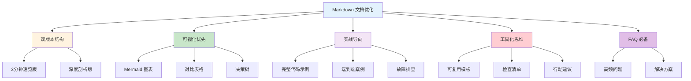
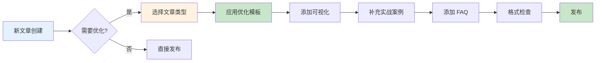
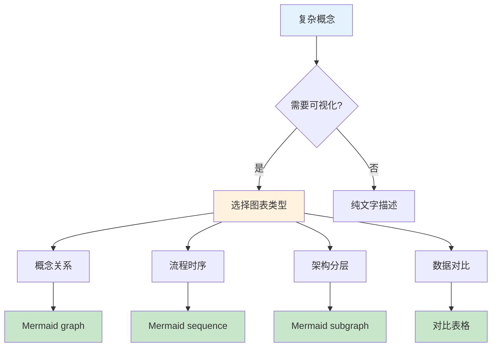
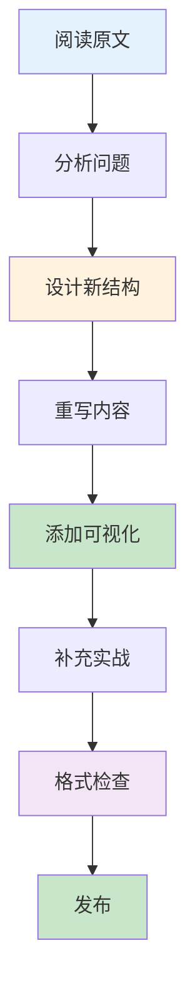

# Markdown 文档优化指南

> 🎯 **一句话定位**：系统化的文档优化方法论，将普通文章提升为专业级技术文档

> 💡 **核心理念**：优秀的文档 = 清晰的结构 + 可视化表达 + 实战案例 + 工具化思维

---

## 📖 3分钟速览版

<details>
<summary><strong>📊 点击展开核心概念</strong></summary>

### 🔌 核心概念



### 💎 为什么需要优化？

| 维度 | 未优化 | 已优化 |
|------|--------|--------|
| **可读性** | ❌ 大段文字，难以理解 | ✅ 结构化，易于扫描 |
| **实用性** | ❌ 理论为主，缺少案例 | ✅ 实战案例，可直接使用 |
| **可视化** | ❌ 纯文字描述 | ✅ 图表辅助理解 |
| **工具化** | ❌ 需要手动整理 | ✅ 提供模板和清单 |
| **用户体验** | ❌ 信息过载 | ✅ 双版本，按需阅读 |

### 🎯 适用场景



</details>

---

## 🧠 深度剖析版

## 1. 核心原则

### 1.1 双版本结构

所有文章应包含两个版本：

#### 📖 速览版特点

- 使用 `<details>` 折叠区域
- 包含核心概念图（Mermaid）
- 快速理解的价值主张
- 对比表格和决策树
- 适合忙碌的读者快速了解

#### 🧠 深度版特点

- 完整的详细内容
- 循序渐进的讲解
- 实战案例和代码
- FAQ 和延伸阅读
- 适合深入学习

### 1.2 可视化优先



**可视化原则**：

- 每个复杂概念配一个 Mermaid 图表
- 使用彩色节点提升可读性
- 优先使用 Mermaid 而非外部图片
- 图表应有清晰的标题和说明

### 1.3 实战导向

**实战导向的要素**：

- ✅ 代码必须完整可运行
- ✅ 包含端到端的演示
- ✅ 提供真实场景的案例
- ✅ 添加故障排查指南
- ✅ 提供预期输出或结果

### 1.4 工具化思维

**工具化思维的表现**：

- 提供可复用的模板
- 添加检查清单（checkbox 格式）
- 包含决策树和对比表
- 给出具体行动建议

### 1.5 FAQ 必备

**FAQ 要求**：

- 至少 5 个高频问题
- 每个问题包含：症状、原因、解决方案
- 覆盖常见误区和陷阱

---

## 2. 文档结构标准

### 2.1 开头钩子

所有文档应以以下格式开头：

```markdown
> 🎯 **一句话定位**：用一句话说明文章价值

> 💡 **核心理念**：文章的核心洞察或观点

---
```

### 2.2 章节结构

```markdown
## 主标题（emoji 前缀）

### 副标题（emoji 前缀）

#### 小标题

#### 细节标题
```

### 2.3 完整文档结构模板

```markdown
---

> 🎯 **一句话定位**：简洁有力的价值主张

> 💡 **核心理念**：文章的核心洞察

---

## 📖 3分钟速览版

<details>
<summary><strong>📊 点击展开核心概念</strong></summary>

### 🔌 核心概念
[Mermaid 概念图]

### 💎 为什么需要？
[对比表格]

### 🎯 适用场景
[决策树]

</details>

---

## 🧠 深度剖析版

## 1. 核心概念
### 1.1 定义
[概念说明]
### 1.2 架构
[Mermaid 架构图]

## 2. 对比分析
### 2.1 方案对比
[对比表格]
### 2.2 选择建议
[决策树]

## 3. 实战指南
### 3.1 快速开始
[分步骤教程]
### 3.2 进阶实践
[深入内容]

## 4. 最佳实践
### 4.1 安全
[安全配置]
### 4.2 监控
[监控配置]
### 4.3 性能
[优化技巧]

## 5. 故障排查
### 5.1 常见问题
[问题1、2、3]

## 6. 实战案例
### 案例：XXX
[完整案例]

## 7. 工具与资源
### ✅ 检查清单
<details>
<summary><strong>📋 开发检查清单</strong></summary>

- [ ] 检查项1
- [ ] 检查项2
</details>

### 📚 推荐资源
[资源表格]

## 💬 常见问题（FAQ）

### Q1: 问题?
**A:** 答案

## ✨ 总结
[总结与行动建议]

---
*📅 最后更新：YYYY-MM-DD | 👤 作者：MamimiJa Nai*
```

---

## 3. 可视化规范

### 3.1 Mermaid 图表类型

| 图表类型 | 使用场景 | 示例 |
|---------|---------|------|
| `graph TD/LR` | 流程、概念关系 | 架构图、数据流 |
| `sequenceDiagram` | 时序交互 | API 调用流程 |
| `graph TD` + `subgraph` | 分层架构 | 三层架构 |
| `pie` | 占比分布 | 技术栈占比 |
| `gantt` | 时间线 | 项目计划 |

### 3.2 颜色方案


**颜色使用指南**：

- 🔵 蓝色（#e3f2fd）：主要概念、核心内容
- 🟠 橙色（#fff3e0）：警告、注意事项
- 🟢 绿色（#c8e6c9）：成功、正确做法
- 🔴 红色（#ffcdd2）：错误、问题
- 🟣 紫色（#f3e5f5）：高级、进阶内容

### 3.3 ASCII 艺术

对于简单的结构，可以使用 ASCII 艺术：

```text
┌─────────────────────────┐
│     标题框               │
├─────────────────────────┤
│ 内容1                   │
│ 内容2                   │
└─────────────────────────┘

📋 决策树：
├─ 选项1
│  └─ 子选项
└─ 选项2
```

---

## 4. 不同类型文章的优化重点

### 4.1 mindset（思维方法论）

**特点**：抽象、需要框架化

**优化重点**：

- 强调思维框架和模型
- 添加可落地的模板
- 包含实战应用案例
- FAQ 聚焦使用场景和误区

**必备元素**：

- ✅ 概念可视化（Mermaid）
- ✅ 实践模板（可复制）
- ✅ 检查清单
- ✅ 对比分析（表格）

**示例结构**：

```markdown
## 1. 思维框架
### 1.1 核心模型
[Mermaid 模型图]
### 1.2 应用场景
[场景对比表]

## 2. 实践模板
### 2.1 模板1
[可复制模板]
### 2.2 模板2
[可复制模板]

## 3. 实战案例
### 案例：XXX
[完整案例]
```

### 4.2 tech（技术文章）

**特点**：具体、需要可执行

**优化重点**：

- 提供完整可运行的代码
- 包含架构图和流程图
- 添加故障排查指南
- 性能分析和优化建议

**必备元素**：

- ✅ 环境准备
- ✅ 分步教程
- ✅ 完整代码示例
- ✅ 运行结果验证
- ✅ 常见问题解决

**示例结构**：

```markdown
## 1. 技术概述
### 1.1 架构图
[Mermaid 架构图]
### 1.2 核心概念
[概念说明]

## 2. 快速开始
### 2.1 环境准备
[环境配置]
### 2.2 安装步骤
[分步教程]

## 3. 实战示例
### 3.1 基础示例
[完整代码]
### 3.2 进阶示例
[完整代码]

## 4. 故障排查
### 4.1 常见问题
[问题列表]
```

### 4.3 tools（工具使用）

**特点**：实用、需要对比

**优化重点**：

- 5W1H 分析工具
- 与竞品对比
- 快速开始教程
- 高级技巧和最佳实践

**必备元素**：

- ✅ 工具定位（What/Why）
- ✅ 竞品对比表
- ✅ 快速上手
- ✅ 进阶技巧

**示例结构**：

```markdown
## 1. 工具概述
### 1.1 5W1H 分析
[What/Why/When/Where/Who/How]
### 1.2 竞品对比
[对比表格]

## 2. 快速上手
### 2.1 安装配置
[安装步骤]
### 2.2 基础使用
[使用示例]

## 3. 进阶技巧
### 3.1 高级功能
[功能说明]
### 3.2 最佳实践
[实践建议]
```

### 4.4 gaming（游戏研究）

**特点**：主观、体验式

**优化重点**：

- 游戏体验记录
- 机制分析
- 截图/视频（如需要）
- 个人评分和建议

**必备元素**：

- ✅ 游戏基本信息
- ✅ 体验记录
- ✅ 优缺点分析
- ✅ 推荐指数

### 4.5 anime（番剧观后感）

**特点**：感性、个人化

**优化重点**：

- 剧情简介（无剧透）
- 角色分析
- 制作质量评价
- 个人观感和推荐

**必备元素**：

- ✅ 作品信息
- ✅ 观看指南
- ✅ 亮点分析
- ✅ 推荐指数

---

## 5. 优化步骤

### 5.1 7步优化流程



**详细步骤**：

1. **阅读原文**：理解当前内容和问题
2. **分析问题**：识别格式、结构、内容的不足
3. **设计新结构**：规划双版本和章节
4. **重写内容**：按照标准重写
5. **添加可视化**：插入 Mermaid 图表
6. **补充实战**：添加案例、代码、FAQ
7. **格式检查**：确保 Markdown 格式正确

### 5.2 优化检查清单

<details>
<summary><strong>📋 文档优化检查清单</strong></summary>

#### 结构检查

- [ ] 包含开头钩子（一句话定位 + 核心理念）
- [ ] 包含 3分钟速览版（折叠区域）
- [ ] 包含深度剖析版（完整内容）
- [ ] 章节层级清晰（## → ### → ####）
- [ ] 每个主要章节有 emoji 前缀

#### 可视化检查

- [ ] 复杂概念配有 Mermaid 图表
- [ ] 图表使用彩色节点
- [ ] 对比信息使用表格
- [ ] 决策流程使用决策树或流程图

#### 实战检查

- [ ] 代码示例完整可运行
- [ ] 包含端到端案例
- [ ] 提供故障排查指南
- [ ] 包含预期输出或结果

#### 工具化检查

- [ ] 提供可复用模板
- [ ] 包含检查清单（checkbox）
- [ ] 包含决策树或对比表
- [ ] 给出具体行动建议

#### FAQ 检查

- [ ] 至少 5 个高频问题
- [ ] 每个问题包含解决方案
- [ ] 覆盖常见误区和陷阱

#### 格式检查

- [ ] 所有标题前后都有空行
- [ ] 所有列表前后都有空行
- [ ] 代码块有语言标识
- [ ] 表格对齐正确
- [ ] 分隔线前后都有空行

</details>

---

## 6. 快速命令

### 6.1 使用优化 Skill

```bash
# 快速优化
/optimize-doc path/to/article.md

# 指定类型
/optimize-doc path/to/article.md --type tech

# 完整重写
/optimize-doc path/to/article.md --level complete

# 指定受众
/optimize-doc path/to/article.md --audience beginner

# 指定语言
/optimize-doc path/to/article.md --language zh

# 组合使用
/optimize-doc path/to/article.md --type tech --level rewrite --audience intermediate
```

### 6.2 Skill 参数说明

| 参数 | 说明 | 可选值 |
|------|------|--------|
| `file` | 要优化的文件路径 | 必填 |
| `type` | 文章类型 | mindset/tech/tools/gaming/anime |
| `level` | 优化级别 | quick（快速）/rewrite（重写）/complete（完整） |
| `language` | 输出语言 | zh（中文）/en（英文）/bilingual（双语） |
| `audience` | 目标受众 | beginner（初学者）/intermediate（中级）/expert（专家） |

---

## 7. 工具与资源

### 📚 推荐资源

| 资源 | 说明 | 链接 |
|------|------|------|
| Mermaid 文档 | Mermaid 图表语法 | [mermaid.js.org](https://mermaid.js.org) |
| Markdown 指南 | Markdown 语法指南 | [markdownguide.org](https://www.markdownguide.org) |
| Hexo 文档 | Hexo 博客框架文档 | [hexo.io](https://hexo.io) |

### 🔗 相关文档

- [Markdown 格式检查指南](./2025-01-09-markdown-format-check.md) - 格式检查标准
- [5W1H 思维模式](../mindset/2025-04-24-5w1h-ai-knowledge-base-methodology.md) - 方法论示例
- [MCP 模型上下文协议](../tech/ai/2025-04-24-mcp-model-context-protocol.md) - 技术文章示例

### 📝 Skill 定义

本文档基于 Claude Skill `optimize-doc` 的定义，该 Skill 位于：

`~/.claude/skills/optimize-doc/SKILL.md`

---

## 💬 常见问题（FAQ）

### Q1: 什么时候需要添加 3分钟速览版？

**A:** 当文章满足以下条件时，建议添加 3分钟速览版：

1. 文章长度超过 1000 字
2. 包含复杂概念或流程
3. 目标受众包括忙碌的读者
4. 需要快速传达核心价值

**示例**：技术教程、方法论文章、工具使用指南等。

### Q2: Mermaid 图表什么时候使用？

**A:** 在以下场景使用 Mermaid 图表：

1. **概念关系**：展示概念之间的关联
2. **流程时序**：展示步骤或时间顺序
3. **架构分层**：展示系统或结构层次
4. **数据对比**：使用表格更合适
5. **决策流程**：展示选择路径

**原则**：能用图表表达的，就不要用纯文字。

### Q3: 如何确定文章类型？

**A:** 根据文章内容特点选择类型：

- **mindset**：思维方法、框架、方法论
- **tech**：技术实现、代码示例、架构设计
- **tools**：工具使用、软件介绍、配置指南
- **gaming**：游戏体验、机制分析
- **anime**：番剧观感、角色分析

如果不确定，选择最接近的类型，或使用 `tech` 作为默认类型。

### Q4: FAQ 应该包含哪些问题？

**A:** FAQ 应该覆盖：

1. **高频问题**：读者最常遇到的问题
2. **常见误区**：容易出错的地方
3. **进阶问题**：深入使用时的疑问
4. **故障排查**：常见错误和解决方案
5. **最佳实践**：使用建议和注意事项

**建议**：至少 5 个问题，每个问题提供清晰的答案和示例。

### Q5: 如何平衡速览版和深度版的内容？

**A:** 遵循以下原则：

- **速览版**：核心概念、关键对比、快速决策
- **深度版**：详细说明、完整代码、深入分析

**比例建议**：速览版占全文 10-20%，深度版占 80-90%。

### Q6: 代码示例需要多完整？

**A:** 代码示例应该：

1. **完整可运行**：能够直接复制运行
2. **包含注释**：关键逻辑有注释说明
3. **提供输出**：展示预期运行结果
4. **说明依赖**：明确外部依赖和版本

**示例**：

```java
// ✅ 好的示例
public class Example {
    public static void main(String[] args) {
        System.out.println("Hello, World!");
    }
}

// 输出：
// Hello, World!
```

### Q7: 如何选择合适的 emoji？

**A:** 使用 emoji 的原则：

1. **一致性**：同类内容使用相同 emoji
2. **适度**：不过度使用，保持专业
3. **清晰**：emoji 能增强理解，不造成混淆

**常用 emoji**：

- 📖 文档、阅读
- 🔌 核心、连接
- 💎 价值、优势
- 🎯 目标、适用
- ✅ 检查、完成
- 📋 清单、列表
- 💬 问题、讨论
- ✨ 总结、亮点

---

## ✨ 总结

本文档提供了完整的 Markdown 文档优化方法论，包括：

1. **核心原则**：双版本结构、可视化优先、实战导向、工具化思维、FAQ 必备
2. **结构标准**：开头钩子、章节结构、完整模板
3. **可视化规范**：Mermaid 图表类型、颜色方案、ASCII 艺术
4. **类型优化**：针对不同文章类型的优化重点
5. **优化流程**：7步优化流程和检查清单
6. **工具资源**：快速命令和相关资源

### 🎯 行动建议

1. **新文章创建时**：使用本文档的模板和检查清单
2. **优化现有文章**：按照 7步优化流程逐步改进
3. **团队协作**：统一使用本文档作为优化标准
4. **持续改进**：根据实际使用情况更新优化标准

---

## 更新记录

最后更新：2025-01-09 | 作者：MamimiJa Nai
