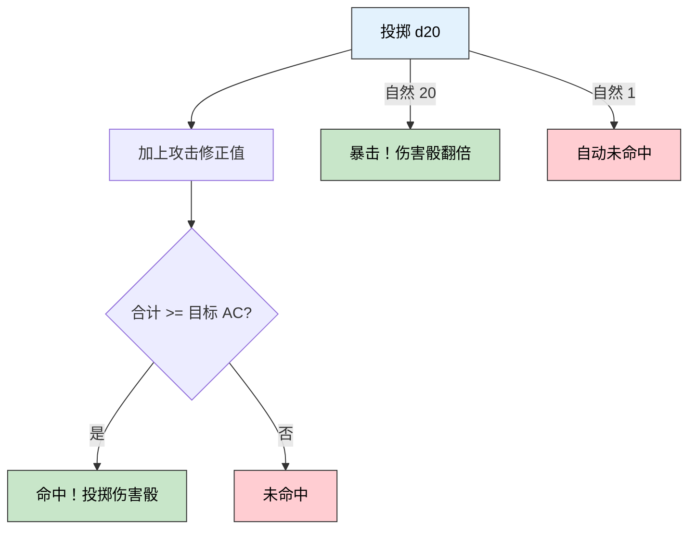
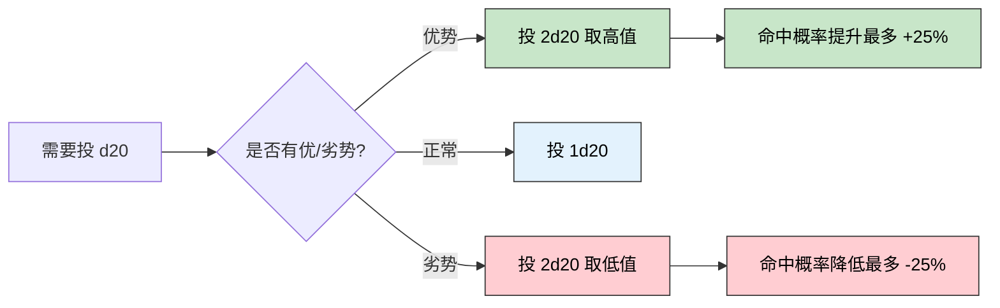
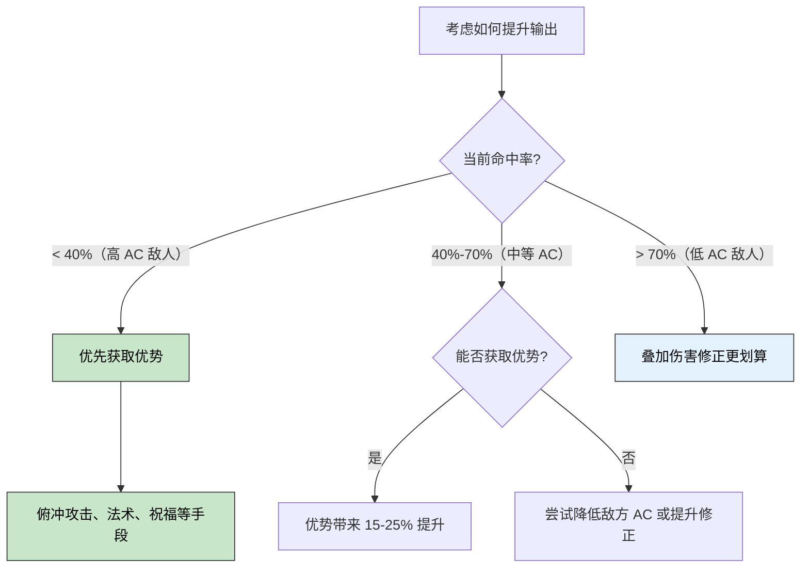

> 🎯 **一句话定位**：把 BG3 里"感觉运气不好"的直觉，变成有数据支撑的概率认知——用 Python 算清楚每一次骰子背后的真实胜率。
>
> 💡 **核心理念**：DnD 的 d20 骰子系统不是纯随机赌博，而是一个参数可控的概率模型。理解了 AC、DC、修正值、优势/劣势的数学本质，你的战术决策就从"赌脸"变成了"算牌"。

---

<details>
<summary>📋 3 分钟速览版（点击展开）</summary>

### 攻击判定流程




### 命中概率速查表

| 攻击修正 | AC 12 | AC 14 | AC 16 | AC 18 | AC 20 |
|---------|-------|-------|-------|-------|-------|
| +0 | 45% | 35% | 25% | 15% | 5% |
| +3 | 60% | 50% | 40% | 30% | 20% |
| +5 | 70% | 60% | 50% | 40% | 30% |
| +8 | 85% | 75% | 65% | 55% | 45% |

### 核心结论

- 优势投掷平均等效 **+3.325** 点修正，命中率 35%-65% 时价值最大
- AC 每提升 1 点，对方命中率降低 **5%**（无上限）
- 豁免修正 +0 面对 DC 15 的控制法术，失败率高达 **70%**

</details>

---

## DnD 骰子系统基础

### d20 核心机制

博得之门 3 完整复刻了 DnD 5e 的核心判定机制：每次攻击、豁免或技能检定都通过投掷一枚 20 面骰（d20）来决定。

基本判定公式：

```text
d20 投掷值 + 修正值 >= 目标阈值 → 成功
```

其中：

- **攻击检定**：修正值 = 能力修正 + 熟练加值；目标阈值 = 敌方 AC（护甲等级）
- **技能/能力检定**：修正值 = 对应能力修正（+ 熟练加值）；目标阈值 = GM 设定的 DC
- **豁免检定**：修正值 = 对应属性的豁免修正；目标阈值 = 法术 DC

### BG3 三种核心检定

| 检定类型 | 触发场景 | 公式 |
|---------|---------|------|
| 攻击命中 | 近战/远程攻击 | d20 + 攻击修正 >= 目标 AC |
| 豁免检定 | 法术控制、陷阱、毒素 | d20 + 豁免修正 >= 法术 DC |
| 技能检定 | 对话说服、开锁、感知 | d20 + 技能修正 >= DC |

### 优势与劣势

优势（Advantage）和劣势（Disadvantage）是改变概率分布的最强机制：

- **优势**：同时投两枚 d20，取**较高值**
- **劣势**：同时投两枚 d20，取**较低值**
- **两者相消**：同时拥有优势和劣势时效果互相抵消，退回单骰投掷

### 自然 1 与自然 20

BG3 的实现规则（与桌游 RAW 略有不同）：

- **自然 20**：攻击检定自动命中并触发暴击；豁免检定自动成功
- **自然 1**：攻击检定自动未命中；豁免检定自动失败（桌游 RAW 不一定如此）
- **暴击阈值可以更低**：部分 BG3 装备（如地脉迷城匕首）可将暴击触发值降至 19，即 d20 投出 19 或 20 均触发暴击，暴击率从 5% 提升至 10%

---

## 概率数学基础

### 单次 d20 的均匀分布

d20 是标准均匀分布，每个值（1-20）出现概率均为 5%。投出 >= k 的概率：

```text
P(d20 >= k) = (21 - k) / 20
```

例如，需要投出 >= 11 才能命中（攻击修正 +5，对面 AC 16）：

```text
需要值 k = 16 - 5 = 11
P(>=11) = (21 - 11) / 20 = 10 / 20 = 50%
```

### 优势/劣势的概率公式

设"需要投出 >= k 才成功"，三种情况的公式如下：

- **正常**：`P = (21 - k) / 20`
- **优势**：`P = 1 - ((k - 1) / 20)²`（两次都失败的概率取补集）
- **劣势**：`P = ((21 - k) / 20)²`（两次都成功才算成功）

优势相较正常的提升量在 k = 11 时最大（+25%），在 k 接近 2 或 20 时趋近于 0。

### 正常、优势、劣势概率对比




---

## Python 模拟实战

以下代码使用 numpy 和 pandas 进行蒙特卡洛模拟，安装依赖后可直接运行：

```bash
pip install numpy pandas
```

### 基础攻击命中模拟

```python
import numpy as np
import pandas as pd

def simulate_attacks(
    n: int, attack_modifier: int, target_ac: int, crit_threshold: int = 20
) -> pd.DataFrame:
    """蒙特卡洛模拟 n 次攻击，返回逐次结果 DataFrame

    crit_threshold: 暴击触发阈值，默认 20；地脉迷城匕首等装备可降至 19
    """
    rolls = np.random.randint(1, 21, size=n)
    df = pd.DataFrame({
        'd20': rolls,
        'total': rolls + attack_modifier,
        'ac': target_ac,
    })
    # 达到暴击阈值自动命中，自然 1 自动未命中
    df['crit'] = df['d20'] >= crit_threshold
    df['hit'] = (df['total'] >= target_ac) | df['crit']
    df.loc[df['d20'] == 1, 'hit'] = False
    return df

# 示例：+5 攻击修正 vs AC 16，模拟 10 万次
results = simulate_attacks(100_000, attack_modifier=5, target_ac=16)
print(f"命中率: {results['hit'].mean():.1%}")   # 理论值: 50%
print(f"暴击率: {results['crit'].mean():.1%}")  # 理论值: 5%

# 装备地脉迷城匕首（暴击阈值降至 19）
results_19 = simulate_attacks(100_000, attack_modifier=5, target_ac=16, crit_threshold=19)
print(f"暴击率（阈值 19）: {results_19['crit'].mean():.1%}")  # 理论值: 10%
```

### 优势/劣势对比模拟

```python
def compare_advantage(n: int, modifier: int, ac: int) -> dict:
    """对比正常/优势/劣势三种情况下的命中率"""
    r1 = np.random.randint(1, 21, size=n)
    r2 = np.random.randint(1, 21, size=n)

    normal = r1
    advantage = np.maximum(r1, r2)      # 取高值
    disadvantage = np.minimum(r1, r2)   # 取低值

    def hit_rate(rolls: np.ndarray) -> float:
        hits = ((rolls + modifier) >= ac) | (rolls == 20)
        hits = hits.copy()
        hits[rolls == 1] = False
        return float(hits.mean())

    return {
        '正常': f"{hit_rate(normal):.1%}",
        '优势': f"{hit_rate(advantage):.1%}",
        '劣势': f"{hit_rate(disadvantage):.1%}",
    }

# 示例：+5 修正 vs AC 16
print(compare_advantage(100_000, modifier=5, ac=16))
# 输出示例：{'正常': '50.0%', '优势': '75.0%', '劣势': '25.0%'}
```

### 生成命中概率速查表

```python
def build_hit_table() -> pd.DataFrame:
    """生成攻击修正 × 目标 AC 的命中概率矩阵（精确计算，无需模拟）"""
    rows = []
    for mod in range(0, 11):
        for ac in range(10, 21):
            k = ac - mod  # 需要投出的最低 d20 值
            if k <= 1:
                prob = 0.95   # 只有自然 1 才 miss
            elif k >= 21:
                prob = 0.05   # 只有自然 20 才 hit
            else:
                prob = (21 - k) / 20
            rows.append({'修正': f"+{mod}", 'AC': ac, '命中率': prob})

    df = pd.DataFrame(rows)
    pivot = df.pivot(index='修正', columns='AC', values='命中率')
    return pivot.map(lambda x: f"{x:.0%}")

print(build_hit_table().to_string())
```

### 豁免检定失败率模拟

```python
def saving_throw_fail_rate(spell_dc: int, save_modifier: int, n: int = 100_000) -> float:
    """模拟目标豁免失败（即控制法术生效）的概率，使用 BG3 规则"""
    rolls = np.random.randint(1, 21, size=n)
    totals = rolls + save_modifier
    # BG3 规则：自然 20 总是豁免成功，自然 1 总是豁免失败
    failed = (totals < spell_dc).copy()
    failed[rolls == 20] = False  # nat20 强制成功
    failed[rolls == 1] = True    # nat1 强制失败
    return float(failed.mean())

# 多目标对比：Hold Person (DC 15) 对不同敌人的效果
targets = [
    ("精英地精（WIS +0）", 0),
    ("普通人类士兵（WIS +1）", 1),
    ("法师（WIS +3）", 3),
    ("圣骑士（WIS +5）", 5),
]
for name, mod in targets:
    r = saving_throw_fail_rate(spell_dc=15, save_modifier=mod)
    print(f"{name}: 控制生效 {r:.1%}")
# 理论输出：70% / 65% / 55% / 45%
```

---

## BG3 实战场景分析

### 场景一：1 级战士 vs 地精群

- **角色**：战士，攻击修正 +5（力量修正 +3，熟练加值 +2）
- **目标**：地精，AC 15

```text
理论命中率 = (21 - (15 - 5)) / 20 = 11 / 20 = 55%
开启优势后 = 1 - (9/20)² = 1 - 0.2025 ≈ 79.75%
```

对低 AC 敌人，优势将命中率从 55% 提升到 80%，相当于额外增加了 45% 的相对输出期望。

### 场景二：5 级法师放 Hold Person

- **法术 DC**：15（8 + 熟练 +3 + 智力修正 +4）
- **目标**：人类士兵，WIS 豁免修正 +1

```text
控制生效概率 ≈ (15 - 1 - 1) / 20 = 13/20 = 65%（加 nat1 惩罚后约 70%）
```

选择 WIS 较低的目标时，控制法术的期望收益远高于同等环位的直接伤害。

### 场景三：Boss 战中的优势价值

当敌方 AC 为 20（Boss 级），己方攻击修正仅 +5 时：

| 状态 | 命中率 | 相对正常 |
|------|-------|---------|
| 劣势 | 9% | -21pp |
| 正常 | 30% | — |
| 优势 | 51% | +21pp |

面对高 AC Boss，优势的绝对提升量（+21pp）与低 AC 场景相似，但相对收益接近**翻倍期望输出**，远超低 AC 时的相对价值。

---

## 战术决策指南

### 优势的选择时机




### 关键战术原则

**优势 vs 伤害加成的选择**：

- 命中率 < 50% 时，优势收益通常大于叠加伤害修正
- 命中率 > 70% 时，祝福（Bless）/ 狂怒等伤害加成更高效
- 优势对暴击率有隐性加成：5% 提升至约 9.75%，对触发额外效果的职业影响显著

**控制法术的目标优先级**：

用 `saving_throw_fail_rate()` 在战前估算控制成功率，选择豁免修正最低的敌人。控制生效概率 >= 60% 且目标威胁度高时，控制的期望价值通常优于直接输出。

**优势不叠加**：

即使有三个来源提供优势，效果等同于一个。在已有优势的情况下，应将行动资源投入其他增益，如浓度 buff、场地控制或额外攻击。

---

## FAQ

**Q：我总是 Miss，游戏是不是在作弊？**

A：这是确认偏误。当命中率为 50% 时，连续 Miss 3 次的概率是 12.5%，每 8 场战斗必然出现一次。蒙特卡洛模拟的价值就在于：跑 10 万次之后，它不会说谎。

**Q：优势到底等效多少点修正？**

A：平均等效 +3.325 点，但非线性。需要投 10-12 时，优势约带来 25% 提升；需要投 2 或 19 时，提升接近 0。最值钱的区间是需要投 8-14（对应命中率 35%-65%）。

**Q：AC 堆到多少才有意义？**

A：AC 每提升 1 点，对方命中率绝对降低 5%，没有上限。从 AC 14 升到 AC 16，对面命中率从 55% 降到 45%，相对减伤约 18%。从 AC 18 升到 AC 20，相对减伤反而接近 33%——高 AC 段的边际防御价值更高，不是递减而是递增。

**Q：控制法术 vs 直接伤害怎么选？**

A：核心变量是控制生效概率和目标威胁度。控制生效 >= 65% 时，等效于该目标至少"退出战斗"一回合，通常比单回合直接伤害价值更高。若目标豁免修正极高（如圣骑士 WIS +5 对 DC 15），成功率只有约 45%，此时直接伤害往往更稳。

**Q：BG3 的骰子规则和桌游 DnD 5e 完全一样吗？**

A：不完全一样。标准 RAW 5e 中，普通豁免检定并不强制"自然 1 = 自动失败"，但 BG3 选择了这个强化规则，使控制法术的稳定性略低于桌游。本文所有模拟均遵循 BG3 实际规则。

---

## 总结

### 核心要点

1. d20 均匀分布，命中率 = (21 - 需求值) / 20，所有概率均可精确计算
2. 优势在命中率 35%-65% 区间价值最大，约等效 +3 至 +5 点修正
3. 蒙特卡洛模拟的结果与理论公式高度吻合，可用来验证或推翻直觉判断

### 这套框架的迁移性

相同的分析方法也适用于：

- **XCOM 系列**：百分制命中率，换个参数即可复用
- **桌游 DnD / Pathfinder**：调整 nat1/nat20 规则后直接套用
- **其他骰子 TRPG**：修改骰型（d6、d8、d12）和修正规则即可

### 后续方向

- 加入伤害期望计算：命中率 × 平均伤害骰 × 暴击倍率（已有完整实现，见 [BaldursGate3-DamageCalc](https://github.com/leahana/BaldursGate3-DamageCalc)）
- 模拟多回合连续攻击的累积概率分布
- 对比不同职业/专长在各 AC 段的 DPS 期望曲线

> 📦 **延伸工具**：本文聚焦命中概率与豁免分析。如果你还想计算**期望伤害**（含祝福骰、暴击翻倍、神射手 -5/+10 等复杂表达式），可以直接使用 [BaldursGate3-DamageCalc](https://github.com/leahana/BaldursGate3-DamageCalc)，输入攻击/伤害表达式即可运行。

---

## 更新记录

| 版本 | 日期 | 说明 |
|------|------|------|
| v1.0 | 2026-03-24 | 初始版本 |
| v1.1 | 2026-03-24 | 补充暴击阈值可配置说明，更新 simulate_attacks 支持 crit_threshold 参数；添加仓库联动引用 |
| v1.2 | 2026-04-15 | 为三张流程图追加 Chiikawa 风格插图（m2c-pipeline 生成） |
