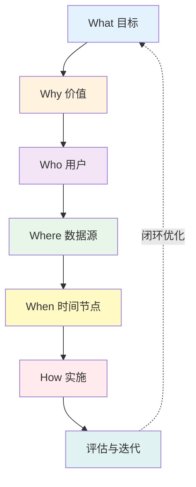
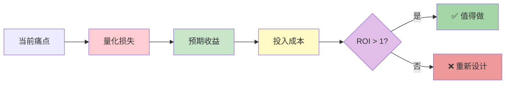
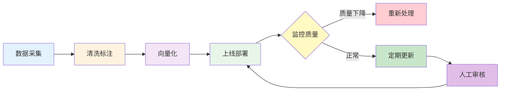
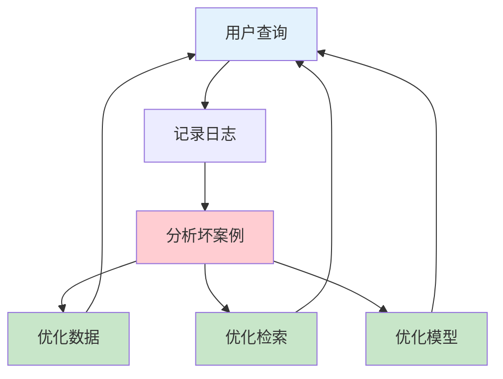

> 🎯 **一句话定位**：将混沌想法转化为可执行系统的**认知操作系统**

> 💡 **核心理念**：5W1H 不是6个独立的问题，而是一个**思维闭环系统**，每个W都与其他W相互关联、相互制约。

---

## 📖 3分钟速览版

<details>
<summary><strong>📊 点击展开核心框架</strong></summary>



**核心价值**：
- 🎯 **战略层**：What + Why = 方向正确
- 👥 **用户层**：Who + Where = 需求明确
- ⏰ **执行层**：When + How = 落地可行

</details>

---

## 🧠 深度剖析版

## 5W1H 思维框架解析

### 🎯 What：目标定义（战略层）

> **核心问题**：我们到底要构建什么？

#### 思考框架

| 维度 | 问题 | 输出物 |
|------|------|--------|
| 🎯 **功能定位** | 解决什么问题？ | 问题陈述 |
| 📏 **范围边界** | 包含什么？不包含什么？ | 范围清单 |
| ✅ **成功标准** | 如何衡量成功？ | KPI指标 |

#### 📋 目标定义模板

```text
┌─────────────────────────────────────────────┐
│ 🎯 知识库目标定义工作单                       │
├─────────────────────────────────────────────┤
│ 核心功能：_________________________________ │
│ （例如：智能问答系统）                       │
│                                             │
│ 覆盖领域：_________________________________ │
│ （例如：技术文档、产品手册、FAQ）            │
│                                             │
│ ❌ 明确排除：_____________________________ │
│ （例如：实时数据、用户隐私数据）             │
│                                             │
│ ✅ 成功标准：_____________________________ │
│ （例如：准确率>85%，响应<3秒）               │
└─────────────────────────────────────────────┘
```

#### ⚠️ 常见误区

| ❌ 错误做法 | ✅ 正确做法 |
|-----------|-----------|
| "做一个AI知识库" | "构建一个技术文档问答系统，覆盖Java/Python/前端" |
| "越全越好" | "先做MVP，验证核心价值后再扩展" |
| "模仿竞品" | "基于自身痛点定义目标" |

---

### 💡 Why：价值验证（战略层）

> **核心问题**：为什么需要这个知识库？值得投入吗？

#### 价值分析框架



#### ROI 计算器

```text
📊 价值计算公式：

ROI = (时间节省 × 人力成本) - 构建成本 - 运维成本

示例分析：
┌────────────────────────────────────────┐
│ 🏢 场景：200人公司内部知识库            │
├────────────────────────────────────────┤
│ 📈 收益：                               │
│   - 每人每天节省检索时间 15分钟          │
│   - 年节省时间：200 × 15min × 250天     │
│   - = 12,500小时 = 6.25人年             │
│   - 价值：6.25 × ¥50万 = ¥312万/年      │
│                                         │
│ 💰 成本：                               │
│   - 构建成本：2人月 = ¥8万              │
│   - 年运维成本：¥5万                    │
│   - API费用：¥2万/年                    │
│   - 总成本：¥15万/年                    │
│                                         │
│ 🎯 ROI：(312 - 15) / 15 = 1980%        │
│    ✅ 强烈推荐！                        │
└────────────────────────────────────────┘
```

---

### 👥 Who：角色与用户（用户层）

> **核心问题**：谁在使用？他们需要什么？

#### 用户画像矩阵

| 用户类型 | 典型场景 | 核心需求 | 交互偏好 |
|---------|---------|---------|---------|
| 👨‍💻 **技术人员** | 查API文档、错误排查 | 精确代码示例 | API调用、代码高亮 |
| 👩‍💼 **产品经理** | 查业务规则、流程图 | 业务逻辑说明 | 自然语言、流程图 |
| 👨‍🎓 **新员工** | 入职培训、快速上手 | 系统性知识 | 渐进式引导 |
| 👤 **外部客户** | 查产品使用手册 | 简单易懂 | FAQ、视频教程 |

#### 🎭 用户画像模板

```text
👤 核心用户画像：

姓名：张三（技术新人）
背景：刚入职3个月的前端工程师
场景：
  - 遇到问题："这个API怎么调用？"
  - 现状：问老员工怕打扰，查文档找不到
  - 痛点：搜索"用户接口"返回100个结果，不知道哪个对

需求：
  - ✅ 快速定位（30秒内）
  - ✅ 可复制代码示例
  - ✅ 看到实际调用效果

拒绝：
  - ❌ 长篇大论的理论
  - ❌ 过期文档
  - ❌ 需要翻很多页
```

---

### 📍 Where：数据来源（资源层）

> **核心问题**：知识从哪来？质量如何？

#### 数据源评估矩阵

| 数据类型 | 典型载体 | 处理难度 | 价值密度 | 推荐工具 |
|---------|---------|:--------:|:--------:|---------|
| 🔹 **结构化** | 数据库/API | ⭐ | ⭐⭐⭐⭐⭐ | SQL、REST API |
| 🔸 **半结构化** | Markdown/JSON | ⭐⭐ | ⭐⭐⭐⭐ | 正则、解析器 |
| 📄 **文档** | Word/PDF | ⭐⭐⭐ | ⭐⭐⭐ | PyPDF2、Unstructured |
| 🌐 **网页** | HTML/Wiki | ⭐⭐⭐⭐ | ⭐⭐ | BeautifulSoup、Scrapy |
| 🖼️ **多模态** | 图片/视频 | ⭐⭐⭐⭐⭐ | ⭐⭐⭐ | OCR、Whisper |

#### 🗂️ 数据源清单模板

```text
┌─────────────────────────────────────────────┐
│ 📚 知识来源清单                              │
├─────────────────────────────────────────────┤
│ 🔹 高价值结构化数据：                        │
│   □ Confluence 知识库（500篇）              │
│   □ Jira 工单记录（2000条）                 │
│   □ API 文档（Swagger）                     │
│                                             │
│ 🔸 中等价值文档：                            │
│   □ 产品手册（Word/PDF）                    │
│   □ 培训PPT（50个）                         │
│   □ 会议纪要（100份）                       │
│                                             │
│ ⚠️  低价值需筛选：                          │
│   □ 聊天记录（需脱敏）                      │
│   □ 邮件归档（需筛选）                      │
│                                             │
│ 🚫 明确排除：                                │
│   ☑ 用户隐私数据                            │
│   ☑ 机密代码                                │
│   ☑ 过期文档（>3年未更新）                  │
└─────────────────────────────────────────────┘
```

---

### ⏰ When：时间与节奏（执行层）

> **核心问题**：何时开始？何时更新？频率如何？

#### 数据生命周期管理



#### ⏱️ 更新频率决策树

```text
📅 更新频率选择指南：

├─ 🔥 实时数据（分钟级）
│  └─ 场景：新闻、股票、监控日志
│     └─ 技术：流式更新、WebSocket
│
├─ 📊 每日更新
│  └─ 场景：日报、工单系统
│     └─ 技术：定时任务 Cron
│
├─ 📆 每周更新
│  └─ 场景：周报、会议纪要
│     └─ 技术：批量处理
│
└─ 📚 季度更新
   └─ 场景：产品手册、培训材料
      └─ 技术：人工审核 + 批量导入
```

---

### 🚀 How：实施路径（执行层）

> **核心问题**：具体怎么做？技术选型？

#### 技术栈对比表

| 方案 | 适用场景 | 开发周期 | 月成本 | 灵活性 |
|------|---------|:-------:|:------:|:------:|
| **No-code**<br>Dify/Flowise | 快速验证 | 🚀 1周 | 💰 $50 | ⭐⭐ |
| **Low-code**<br>LangClimb/Flowise | 中小规模 | 🚀 2-4周 | 💰💰 $200 | ⭐⭐⭐ |
| **Full-code**<br>LangChain/LlamaIndex | 高定制 | 🚀🚀 2-3月 | 💰💰💰 $1000+ | ⭐⭐⭐⭐⭐ |

#### 🛠️ 实施路线图

```text
阶段1️⃣：MVP验证（第1-2周）
┌─────────────────────────────────────┐
│ 目标：验证核心价值                   │
│ 范围：单一文档类型，50-100篇         │
│ 技术：Dify + OpenAI                 │
│ 投入：1人周 + $100                  │
│                                     │
│ ✅ 产出：                             │
│   - 可用的Demo                       │
│   - 准确率基准测试                   │
│   - 用户反馈收集                     │
└─────────────────────────────────────┘

阶段2️⃣：规模扩展（第3-6周）
┌─────────────────────────────────────┐
│ 目标：扩大规模，优化体验             │
│ 范围：多文档类型，1000+篇            │
│ 技术：LangChain + 向量库            │
│ 投入：4人周 + $1000                 │
│                                     │
│ ✅ 产出：                             │
│   - 生产环境部署                     │
│   - 用户SOP文档                     │
│   - 监控告警系统                     │
└─────────────────────────────────────┘

阶段3️⃣：持续优化（第7周+）
┌─────────────────────────────────────┐
│ 目标：智能化运营                     │
│ 范围：全量文档，自动更新             │
│ 技术：微调模型 + RAG优化            │
│ 投入：2人周/月 + $500/月           │
│                                     │
│ ✅ 产出：                             │
│   - A/B测试框架                     │
│   - 数据飞轮（越用越好）             │
│   - 多模态支持                       │
└─────────────────────────────────────┘
```

---

## 🛠️ 实战工具箱

### ✅ 5W1H 完整性检查清单

<details>
<summary><strong>📋 点击展开检查清单</strong></summary>

#### What 检查
- [ ] 能用一句话说清楚目标吗？
- [ ] 明确了包含和排除的范围吗？
- [ ] 有可量化的成功标准吗？

#### Why 检查
- [ ] 计算了预期的 ROI 吗？
- [ ] 明确了当前痛点是什么吗？
- [ ] 确认了不做会有什么损失吗？

#### Who 检查
- [ ] 有清晰的用户画像吗？
- [ ] 了解了用户的真实场景吗？
- [ ] 确认了用户的使用习惯吗？

#### Where 检查
- [ ] 列出了所有数据源吗？
- [ ] 评估了数据质量和处理难度吗？
- [ ] 确认了数据获取的合法性吗？

#### When 检查
- [ ] 制定了数据更新策略吗？
- [ ] 明确了关键里程碑时间吗？
- [ ] 预留了缓冲时间吗？

#### How 检查
- [ ] 选择了合适的技术栈吗？
- [ ] 制定了详细的实施计划吗？
- [ ] 准备了应急预案吗？

</details>

---

### 🎯 场景决策树

#### 场景1：小团队快速验证

```text
团队规模：1-5人
时间要求：1-2周上线
技术能力：有限

🎯 推荐方案：
├─ 工具：Dify / FastGPT
├─ 模型：GPT-3.5 / DeepSeek
├─ 向量库：自带（无需自建）
├─ 部署：云服务 / 本地Docker
└─ 成本：$50-100/月

⚡ 预期效果：
├─ 上线时间：7天
├─ 准确率：75-85%
└─ 维护成本：低
```

#### 场景2：企业级生产环境

```text
团队规模：10+人
时间要求：2-3个月
技术能力：强

🎯 推荐方案：
├─ 框架：LangChain / LlamaIndex
├─ 模型：GPT-4 / 自微调模型
├─ 向量库：Milvus / Pinecone
├─ 部署：Kubernetes + GPU
└─ 成本：$2000-5000/月

⚡ 预期效果：
├─ 上线时间：60天
├─ 准确率：90-95%
└─ 维护成本：中等
```

---

### 📊 成本计算器

#### 小型知识库（1万文档）

| 项目 | 成本 | 说明 |
|------|------|------|
| 💻 开发 | ¥80,000 | 2人月 |
| 🖥️ 服务器 | ¥500/月 | 4核8G × 2 |
| 🤖 API调用 | ¥500/月 | 100万tokens/月 |
| 🧪 向量存储 | ¥200/月 | 10GB |
| 📊 **首年总成本** | **¥92,400** | |
| 📈 **后续年度** | **¥14,400/年** | 不含开发 |

---

## 🎓 实战案例

### 案例：构建科技公司内部知识库

#### 📋 项目背景

```text
公司规模：200人
行业：SaaS软件
痛点：
  - 新员工上手慢（平均2周）
  - 技术文档分散（Confluence、Git、网盘）
  - 重复问题多（技术支持每日处理50+相同问题）

目标：
  - 新员工上手时间缩短到3天
  - 技术支持工作量减少50%
```

#### 🎯 5W1H 分析

```text
✅ What：
   - 技术文档智能问答系统
   - 覆盖：API文档、故障排查、最佳实践
   - 不包括：代码逻辑、私密信息

✅ Why：
   - 年节省成本：6.25人年 × ¥50万 = ¥312万
   - 投入成本：¥15万/年
   - ROI：1980%

✅ Who：
   - 主要用户：技术新人、产品经理、技术支持
   - 次要用户：销售、客户成功

✅ Where：
   - 高价值：Confluence（500篇）、API文档（Swagger）
   - 中价值：故障案例（100篇）、最佳实践（200篇）
   - 数据总量：约1000篇文档

✅ When：
   - 采集：每周五批量更新
   - 审核：技术负责人人工审核
   - 发布：每周一凌晨

✅ How：
   - 阶段1（2周）：Dify + 100篇文档 MVP
   - 阶段2（1月）：LangChain + 1000篇文档
   - 阶段3（持续）：多模态 + 个性化推荐
```

#### 📊 实施效果

| 指标 | 实施前 | 实施后 | 提升 |
|------|--------|--------|------|
| 新员工上手时间 | 10天 | 3天 | ⬇️ 70% |
| 重复问题处理 | 50个/天 | 15个/天 | ⬇️ 70% |
| 文档查找时间 | 15分钟 | 2分钟 | ⬇️ 87% |
| 用户满意度 | N/A | 4.5/5 | - |

---

## 💬 常见问题（FAQ）

### Q1：5W1H 的顺序可以调换吗？

**A：** 可以灵活调整，但建议保持这个顺序：

```text
战略层 → 用户层 → 执行层
What → Why → Who → Where → When → How

原因：
1. What/Why 确定方向（方向错了，做得再快也没用）
2. Who/Where 明确资源（有什么资源就做什么事）
3. When/How 落地执行（有了方向和资源才能规划执行）
```

### Q2：小型团队有必要做5W1H分析吗？

**A：** 更有必要！

```text
小团队资源有限，每一步都不能错：

❌ 不做分析：直接开干
   → 3周后发现方向不对
   → 浪费3周 + 挫败感

✅ 先做分析：花2小时做5W1H
   → 发现价值不够，调整方向
   → 节省3周 + 避免弯路

ROI：2小时换3周，血赚！
```

### Q3：数据量小（<100篇）还需要用RAG吗？

**A：** 分情况：

```text
📊 决策树：

文档量 < 50篇
└─ 🎯 推荐：直接塞给LLM（Prompt工程）
   成本：几乎为0
   效果：可能更好（LLM能记住）

文档量 50-500篇
└─ 🎯 推荐：简单向量库 + 重排序
   工具：ChromaDB / FAISS
   成本：$10-50/月

文档量 > 500篇
└─ 🎯 推荐：完整RAG + 混合检索
   工具：Milvus + Elasticsearch
   成本：$100-500/月
```

### Q4：如何评估知识库的效果？

**A：** 建立多维度评估体系：

```text
📊 客观数据指标：
├─ 准确率：答案正确的比例（目标>85%）
├─ 响应时间：平均回答耗时（目标<3秒）
├─ 使用率：DAU、查询次数
└─ 成功率：用户找到答案的比例（不跳转人工）

👥 主观用户指标：
├─ 满意度评分（1-5星）
├─ NPS净推荐值
└─ 用户反馈分析

💰 业务价值指标：
├─ 人力节省：减少的工时
├─ 效率提升：任务完成时间缩短
└─ ROI：(收益 - 成本) / 成本
```

### Q5：知识库上线后如何持续优化？

**A：** 建立"数据飞轮"：



**具体做法**：
1. **每周Review坏案例**：哪些问题答错了？为什么？
2. **每月更新数据**：新增文档、过时文档归档
3. **每季度A/B测试**：尝试新模型、新策略
4. **每半年大版本**：根据用户反馈重构

---

## 📚 延伸阅读

### 相关方法论

- 🎯 **OKR目标管理法**：What 的好搭档
- 🔄 **PDCA循环**：How 的实施框架
- 📊 **MECE原则**：What/Why 的分析工具
- 👥 **用户画像**：Who 的详细方法论
- 🗓️ **甘特图**：When 的可视化工具

### 推荐资源

| 类型 | 资源 | 链接 |
|------|------|------|
| 📖 书籍 | 《思考，快与慢》 | 认知思维 |
| 📖 书籍 | 《金字塔原理》 | 结构化表达 |
| 🎓 课程 | Coursera - Design Thinking | 创新方法论 |
| 🛠️ 工具 | Dify 官方文档 | https://docs.dify.ai |
| 🛠️ 工具 | LangChain 文档 | https://python.langchain.com |

---

## ✨ 总结

> 🎯 **5W1H 的本质**：不是填空题，而是**认知框架**

```text
它能帮你：
├─ 从混沌中找到秩序
├─ 从想法走到落地
├─ 从个人达成共识
└─ 从失败中学习迭代

但它不是：
├─ ❌ 一次性填完就忘了
├─ ❌ 形式主义的文档
└─ ❌ 替代思考的拐杖
```

**最后建议**：
1. 📝 打印检查清单，贴在工位
2. 🔄 每个项目前花30分钟过一遍
3. 💬 团队分享时用5W1H讲故事
4. 📊 复盘时回到5W1H找问题

---

*💻 用 Markdown 记录，🧠 用 5W1H 思考，🚀 用行动改变世界*

*📅 最后更新：2025-04-24 | 👤 作者：MamimiJa Nai*
