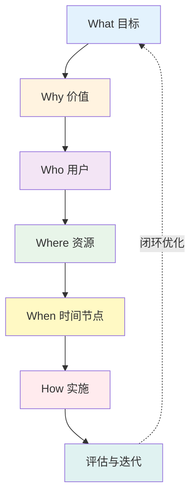
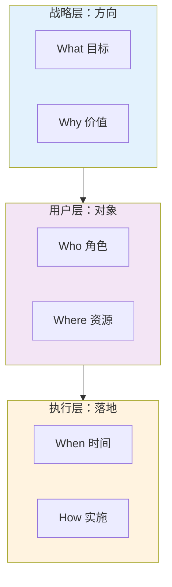
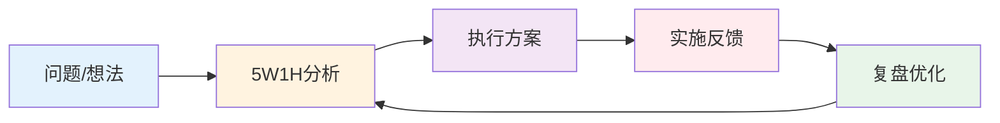
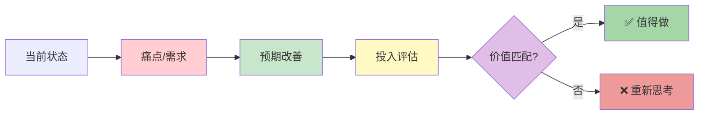

> 🎯 **一句话定位**：将混沌想法转化为清晰方案的**通用思维操作系统**
> 💡 **核心理念**：5W1H 首先是一种**个人思维方式的认知工具**，帮助我们系统化思考问题。
> 其次，当需要评估投入产出时，可以结合商业价值考量。它不是 6 个独立的问题，
> 而是一个**思维闭环系统**，每个要素都与其他要素相互关联、相互制约，
> 共同构建完整的解决方案。本文中的 AI 知识库案例仅作为演示，展示如何将框架应用于具体场景。

---

## 📖 3 分钟速览版

<details>
<summary>**📊 点击展开核心框架**</summary>



**核心价值**：

- 🎯 **战略层**：What + Why = 方向正确
- 👥 **用户层**：Who + Where = 需求明确
- ⏰ **执行层**：When + How = 落地可行

**适用场景**：

| 场域        | 应用案例                     |
| ----------- | ---------------------------- |
| 🚀 产品开发 | 功能规划、需求分析、产品定位 |
| 💼 项目管理 | 项目立项、资源调配、风险控制 |
| 📚 内容创作 | 文章规划、课程设计、知识体系 |
| 🎓 学习成长 | 技能提升、职业规划、目标达成 |
| 🏢 企业运营 | 流程优化、问题诊断、决策分析 |
| 🔧 问题解决 | 故障排查、根因分析、方案设计 |

</details>

---

## 🧠 框架深度解析

### 框架总览：5W1H 是什么

**5W1H** 是一个**通用的系统化思维框架**，通过六个维度的问题帮助我们全面分析问题、制定方案。它不是简单的填空题，而是一个**认知操作系统**。

> 💡 **重要说明**：
>
> 1. **首先是思维认知**：5W1H 首先是一种个人思维方式的认知工具，帮助我们理清思路、明确方向。
> 2. **其次是价值考量**：当需要评估投入产出时，可以结合商业价值或个人价值进行考量。
> 3. **框架的通用性**：框架本身是通用的，可以应用于任何领域和场景。本文后续的案例（如 AI 知识库构建）只是展示如何将框架应用到具体场景的演示，而非框架本身的一部分。框架是工具，应用是场景，两者是"框架→应用"的关系。

#### 三层架构



**设计逻辑**：

1. **先定方向**（战略层）：方向错了，做得再快也没用
2. **再看对象**（用户层）：有什么资源、服务谁
3. **后谈落地**（执行层）：有了方向和资源才能规划执行

#### 思维闭环



---

### 🎯 What：目标定义（战略层）

> **核心问题**：我们到底要做什么？

#### 思考框架

| 维度            | 引导问题               | 输出物     |
| --------------- | ---------------------- | ---------- |
| 🎯 **功能定位** | 解决什么问题？         | 问题陈述   |
| 📏 **范围边界** | 包含什么？不包含什么？ | 范围清单   |
| ✅ **成功标准** | 如何衡量成功？         | 成功标准   |

#### 📋 通用目标定义模板

```text
┌─────────────────────────────────────────────┐
│ 🎯 项目目标定义工作单                         │
├─────────────────────────────────────────────┤
│ 核心功能：_________________________________ │
│                                             │
│ 覆盖范围：_________________________________ │
│                                             │
│ ❌ 明确排除：_____________________________ │
│                                             │
│ ✅ 成功标准：_____________________________ │
└─────────────────────────────────────────────┘
```

#### ⚠️ 常见误区

| ❌ 错误做法       | ✅ 正确做法                                       |
| ----------------- | ------------------------------------------------- |
| "做一个 XXX 系统" | "构建一个 XXX 系统，解决 YYY 问题，服务 ZZZ 人群" |
| "越全越好"        | "先做 MVP，验证核心价值后再扩展"                  |
| "模仿竞品"        | "基于自身痛点定义目标"                            |

---

### 💡 Why：价值验证（战略层）

> **核心问题**：为什么需要这个？对我有什么价值？

#### 价值思考框架



#### 💭 价值评估维度

```text
个人价值维度：
├─ 时间价值：能节省多少时间？时间可以用来做什么？
├─ 能力提升：能学到什么？能提升哪些技能？
├─ 情感满足：能带来成就感、满足感吗？
└─ 长期影响：对未来的发展有什么帮助？

（可选）商业价值维度（需要时考虑）：
├─ 时间成本：投入的时间成本
├─ 金钱成本：需要花费的金钱
└─ 机会成本：做这件事的机会成本是什么？

决策原则：
├─ 优先考虑个人价值和长期影响
├─ 商业价值作为辅助判断（如涉及团队/公司项目）
└─ 价值不匹配时，重新思考目标或方案
```

---

### 👥 Who：角色与用户（用户层）

> **核心问题**：谁在使用？谁在执行？各自需要什么？

#### 角色分析矩阵

| 角色类型        | 典型场景           | 核心需求     | 关注点       |
| --------------- | ------------------ | ------------ | ------------ |
| 🎯 **主要用户** | 主要使用者         | 核心功能体验 | 效率、体验   |
| 👥 **次要用户** | 偶尔使用者         | 简单易用     | 易用性       |
| 🔧 **执行者**   | 自己或团队成员     | 实现可行性   | 可操作性     |
| 💡 **影响者**   | 需要获得支持的人   | 价值可见     | 价值展示     |

> 💡 **个人场景**：如果是个人项目，主要用户和执行者可能都是自己，需要平衡"想要什么"和"能做到什么"。

#### 🎭 用户画像模板

```text
👤 核心用户画像：

姓名：[角色名]
背景：[基本描述]
场景：
  - 遇到问题："_________________"
  - 现状："_________________"
  - 痛点："_________________"

需求：
  - ✅ 必须满足："_________________"
  - 💡 期待体验："_________________"

拒绝：
  - ❌ 不能接受："_________________"
```

---

### 📍 Where：资源来源（用户层）

> **核心问题**：资源从哪来？质量如何？

#### 资源评估矩阵

| 资源类型        | 特征           |  获取难度  |  价值密度  | 推荐获取方式           |
| --------------- | -------------- | :--------: | :--------: | ---------------------- |
| 🔹 **现有资源** | 已有资源可复用 |     ⭐     | ⭐⭐⭐⭐⭐ | 盘点已有、充分利用     |
| 🔸 **外部资源** | 需获取或学习   |    ⭐⭐    |  ⭐⭐⭐⭐  | 开源方案、在线课程     |
| 📄 **内容数据** | 需整理加工     |   ⭐⭐⭐   |   ⭐⭐⭐   | 文档整理、知识梳理     |
| 👥 **人力支持** | 需协调或学习   |  ⭐⭐⭐⭐  | ⭐⭐⭐⭐⭐ | 寻求帮助、自主学习     |
| ⏰ **时间资源** | 需合理安排     | ⭐⭐⭐⭐⭐ | ⭐⭐⭐⭐⭐ | 时间规划、优先级管理   |

> 💡 **个人场景**：对于个人项目，时间是最宝贵的资源。优先利用现有资源，合理规划时间投入。

#### 🗂️ 资源清单模板

```text
┌─────────────────────────────────────────────┐
│ 📚 资源来源清单                              │
├─────────────────────────────────────────────┤
│ 🔹 高价值易获取：                            │
│   □ ___________________________________     │
│   □ ___________________________________     │
│                                             │
│ 🔸 中等价值需处理：                          │
│   □ ___________________________________     │
│   □ ___________________________________     │
│                                             │
│ ⚠️  低价值需筛选：                          │
│   □ ___________________________________     │
│                                             │
│ 🚫 明确排除：                                │
│   ☑ ___________________________________     │
│   ☑ ___________________________________     │
└─────────────────────────────────────────────┘
```

---

### ⏰ When：时间与节奏（执行层）

> **核心问题**：何时开始？何时更新？频率如何？

#### 时间规划决策树

```text
📅 更新频率选择指南：

├─ 🔥 实时（分钟级）
│  └─ 场景：监控、报警、即时通讯
│
├─ 📊 每日/周
│  └─ 场景：报表、日志、进度追踪
│
├─ 📆 每月/季度
│  └─ 场景：复盘、规划、大版本更新
│
└─ 📚 按需/年度
   └─ 场景：手册、文档、长期规划
```

#### ⏱️ 里程碑规划模板

```text
┌─────────────────────────────────────────────┐
│ 🗓️ 关键时间节点                              │
├─────────────────────────────────────────────┤
│ 阶段1：__________________________________   │
│   时间：______ 至 ______                    │
│   产出：__________________________________   │
│                                             │
│ 阶段2：__________________________________   │
│   时间：______ 至 ______                    │
│   产出：__________________________________   │
│                                             │
│ 阶段3：__________________________________   │
│   时间：______ 至 ______                    │
│   产出：__________________________________   │
└─────────────────────────────────────────────┘
```

---

### 🚀 How：实施路径（执行层）

> **核心问题**：具体怎么做？技术/方法选型？

#### 实施方案对比表

| 方案类型     | 适用场景             | 启动速度 |   灵活性   | 学习成本   |
| ------------ | -------------------- | :------: | :--------: | :--------: |
| **现成方案** | 快速验证、非核心需求 |  🚀🚀🚀  |    ⭐⭐    |     ⭐     |
| **定制方案** | 核心需求、个性化     |    🚀    |  ⭐⭐⭐⭐  |   ⭐⭐⭐   |
| **自研方案** | 深度理解、完全掌控   |    🐢    | ⭐⭐⭐⭐⭐ | ⭐⭐⭐⭐⭐ |

> 💡 **选择原则**：优先选择能快速验证价值的方案，根据实际需求和学习目标调整。

#### 🛠️ 实施路线图模板

```text
阶段1️⃣：MVP验证
┌─────────────────────────────────────┐
│ 目标：验证核心价值                   │
│ 范围：最小可行方案                   │
│ 方案：_____________________          │
│ 投入：_____________________          │
│                                     │
│ ✅ 产出：                             │
│   - ___________________________________ │
│   - ___________________________________ │
└─────────────────────────────────────┘

阶段2️⃣：规模扩展
┌─────────────────────────────────────┐
│ 目标：扩大规模，优化体验             │
│ 范围：_____________________          │
│ 方案：_____________________          │
│ 投入：_____________________          │
│                                     │
│ ✅ 产出：                             │
│   - ___________________________________ │
│   - ___________________________________ │
└─────────────────────────────────────┘

阶段3️⃣：持续优化
┌─────────────────────────────────────┐
│ 目标：智能化运营                     │
│ 范围：_____________________          │
│ 方案：_____________________          │
│ 投入：_____________________          │
│                                     │
│ ✅ 产出：                             │
│   - ___________________________________ │
│   - ___________________________________ │
└─────────────────────────────────────┘
```

---

## 🛠️ 通用工具箱

### ✅ 5W1H 完整性检查清单

<details>
<summary>**📋 点击展开检查清单**</summary>

#### What 检查

- [ ] 能用一句话说清楚目标吗？
- [ ] 明确了包含和排除的范围吗？
- [ ] 有明确的成功标准吗？（可量化或可感知）

#### Why 检查

- [ ] 明确了当前状态和痛点是什么吗？
- [ ] 理解了为什么需要做这件事吗？
- [ ] 评估了个人价值或（如需要）商业价值吗？

#### Who 检查

- [ ] 有清晰的用户/角色画像吗？
- [ ] 了解了用户/角色的真实需求吗？
- [ ] 确认了不同角色之间的协作关系吗？

#### Where 检查

- [ ] 列出了所有可用资源吗？
- [ ] 评估了资源质量和获取难度吗？
- [ ] 确认了资源获取的合法性/可行性吗？

#### When 检查

- [ ] 制定了实施节奏策略吗？
- [ ] 明确了关键里程碑时间吗？
- [ ] 预留了缓冲和迭代时间吗？

#### How 检查

- [ ] 选择了合适的实施方案吗？
- [ ] 制定了详细的执行计划吗？
- [ ] 准备了应急预案和替代方案吗？

</details>

---

## 🎯 实战案例演示

> 📌 **说明**：以下案例展示如何将 5W1H 通用框架应用到不同场景。每个案例都是"框架→应用"的演示，帮助理解框架的通用性和灵活性。

### 案例一：AI 知识库构建（演示案例）

#### 📋 项目背景

```text
公司规模：200人
行业：SaaS软件
痛点：
  - 新员工上手慢（平均2周）
  - 技术文档分散（Confluence、Git、网盘）
  - 重复问题多（技术支持每日处理50+相同问题）

目标：
  - 新员工上手时间缩短到3天
  - 技术支持工作量减少50%
```

#### 🎯 5W1H 分析（AI 知识库场景）

```text
✅ What：
   - 技术文档智能问答系统
   - 覆盖：API文档、故障排查、最佳实践
   - 不包括：代码逻辑、私密信息

✅ Why：
   - 痛点：新员工上手慢、文档分散、重复问题多
   - 价值：提升效率、节省时间、改善体验
   - （商业场景）投入产出：年节省成本约¥312万，投入¥15万/年

✅ Who：
   - 主要用户：技术新人、产品经理、技术支持
   - 次要用户：销售、客户成功

✅ Where：
   - 高价值：Confluence（500篇）、API文档（Swagger）
   - 中价值：故障案例（100篇）、最佳实践（200篇）
   - 数据总量：约1000篇文档

✅ When：
   - 采集：每周五批量更新
   - 审核：技术负责人人工审核
   - 发布：每周一凌晨

✅ How：
   - 阶段1（2周）：Dify + 100篇文档 MVP
   - 阶段2（1月）：LangChain + 1000篇文档
   - 阶段3（持续）：多模态 + 个性化推荐
```

#### 📊 实施效果

| 指标           | 实施前   | 实施后   | 提升   |
| -------------- | -------- | -------- | ------ |
| 新员工上手时间 | 10 天    | 3 天     | ⬇️ 70% |
| 重复问题处理   | 50 个/天 | 15 个/天 | ⬇️ 70% |
| 文档查找时间   | 15 分钟  | 2 分钟   | ⬇️ 87% |
| 用户满意度     | N/A      | 4.5/5    | -      |

---

### 案例二：产品功能开发（演示案例）

#### 📋 需求背景

某 SaaS 产品计划开发"智能报表推荐"功能。

#### 🎯 5W1H 分析（产品功能场景）

```text
✅ What：
   - 基于用户行为自动推荐个性化报表
   - 范围：覆盖80%常用场景
   - 排除：实时数据报表、自定义SQL

✅ Why：
   - 痛点：用户找不到合适的报表模板，使用效率低
   - 价值：提升用户体验，提高报表使用率
   - （商业场景）额外收益：可能提高用户留存率

✅ Who：
   - 终端用户：业务分析师、管理者
   - 决策者：产品负责人、数据团队

✅ Where：
   - 数据源：用户行为日志、报表使用数据
   - 算法资源：协同过滤、内容推荐

✅ When：
   - Q1：数据收集与算法设计
   - Q2：MVP上线测试
   - Q3：全量发布

✅ How：
   - 技术方案：Python + scikit-learn
   - 实施策略：A/B测试小流量验证
```

---

### 案例三：个人技能提升计划（演示案例）

#### 📋 自我分析

工作 3 年的前端工程师，希望提升技术深度。

#### 🎯 5W1H 分析（个人成长场景）

```text
✅ What：
   - 掌握React源码架构
   - 具备性能优化实战能力
   - 边界：不包括后端、运维

✅ Why：
   - 当前瓶颈：只能做应用层开发
   - 职业目标：晋升技术专家
   - 市场价值：薪资提升30%

✅ Who：
   - 学习者：自己
   - 辅助者：导师、技术社区
   - 验证者：实际工作项目

✅ Where：
   - 学习资源：官方文档、源码、优质课程
   - 实践平台：公司项目、开源贡献

✅ When：
   - 每日：1小时学习
   - 每周：输出1篇总结
   - 每季度：完成1个深度项目

✅ How：
   - 第1月：阅读源码，绘制架构图
   - 第2-3月：实现简易版框架
   - 第4-6月：性能优化实战
```

---

## 💬 常见问题（FAQ）

### Q1：5W1H 的顺序可以调换吗？

**A：** 可以灵活调整，但建议保持这个顺序：

```text
战略层 → 用户层 → 执行层
What → Why → Who → Where → When → How

原因：
1. What/Why 确定方向（方向错了，做得再快也没用）
2. Who/Where 明确资源（有什么资源就做什么事）
3. When/How 落地执行（有了方向和资源才能规划执行）
```

### Q2：小型团队/个人有必要做 5W1H 分析吗？

**A：** 更有必要！

```text
小团队/个人资源有限，每一步都不能错：

❌ 不做分析：直接开干
   → 3周后发现方向不对
   → 浪费3周 + 挫败感

✅ 先做分析：花2小时做5W1H
   → 发现价值不够，调整方向
   → 节省3周 + 避免弯路

价值：2小时投入换来3周时间节省，非常值得！
```

### Q3：5W1H 和其他方法论如何配合？

**A：** 5W1H 是基础框架，可以与其他方法组合：

| 阶段     | 5W1H | 配合方法             |
| -------- | ---- | -------------------- |
| 目标设定 | What | OKR、SMART           |
| 问题分析 | Why  | 5Why、根因分析       |
| 用户研究 | Who  | 用户画像、同理心地图 |
| 方案执行 | How  | PDCA、敏捷开发       |

### Q4：5W1H 分析需要多详细？

**A：** 根据项目规模调整：

```text
🔬 小项目（<1周人天）：
   └─ 每项30分钟，总共3小时即可

📊 中项目（1-4周人天）：
   └─ 每项1-2小时，总共1天

🏢 大项目（>1月人月）：
   └─ 每项深度分析，可能几天到几周
```

### Q5：如何避免 5W1H 流于形式？

**A：** 三个关键点：

1. **真实思考**：不是填空，是真实的探索
2. **持续迭代**：随着信息增加，不断修正
3. **团队共识**：不是个人文档，是团队对齐

---

## 📚 延伸阅读

### 相关方法论

- 🎯 **OKR 目标管理法**：What 的好搭档
- 🔄 **PDCA 循环**：How 的实施框架
- 📊 **MECE 原则**：What/Why 的分析工具
- 👥 **用户画像**：Who 的详细方法论
- 🗓️ **甘特图**：When 的可视化工具
- 🔍 **5Why 分析法**：Why 的深入工具

### 推荐资源

| 类型    | 资源                       | 说明         |
| ------- | -------------------------- | ------------ |
| 📖 书籍 | 《思考，快与慢》           | 认知思维基础 |
| 📖 书籍 | 《金字塔原理》             | 结构化表达   |
| 🎓 课程 | Coursera - Design Thinking | 创新方法论   |
| 🛠️ 工具 | Miro、Notion               | 协作分析工具 |

---

## ✨ 总结

> 🎯 **5W1H 的本质**：不是填空题，而是**通用认知框架**

```text
框架特性：
├─ ✅ 通用性：适用于任何领域和场景
├─ ✅ 系统性：六个维度相互关联形成闭环
├─ ✅ 灵活性：可根据具体场景调整应用方式
└─ ✅ 可复用：一次掌握，终身受用

它能帮你：
├─ 从混沌中找到秩序
├─ 从想法走到落地
├─ 从个人达成共识
└─ 从失败中学习迭代

但它不是：
├─ ❌ 一次性填完就忘了
├─ ❌ 形式主义的文档
├─ ❌ 替代思考的拐杖
└─ ❌ 特定领域的专用工具（它是通用框架）
```

> 💡 **核心要点**：5W1H 是**通用思维框架**，本文中的案例（AI 知识库、产品功能、个人成长）
> 只是展示框架应用的演示。框架是工具，应用是场景，记住"框架→应用"的关系，
> 你就能将 5W1H 应用到任何你需要的地方。

**最后建议**：

1. 📝 打印检查清单，贴在工位
2. 🔄 每个项目前花 30 分钟过一遍
3. 💬 团队分享时用 5W1H 讲故事
4. 📊 复盘时回到 5W1H 找问题

---

### 结语

💻 用 Markdown 记录，🧠 用 5W1H 思考，🚀 用行动改变世界

📅 最后更新：2025-04-24 | 👤 作者：MamimiJa Nai

---

## 更新记录

- 2025-04-24：初始版本
- 2025-01-12：重构文档结构，将 AI 知识库特定内容通用化，强调 5W1H 作为通用思维框架的定位，增加多个实战案例演示
