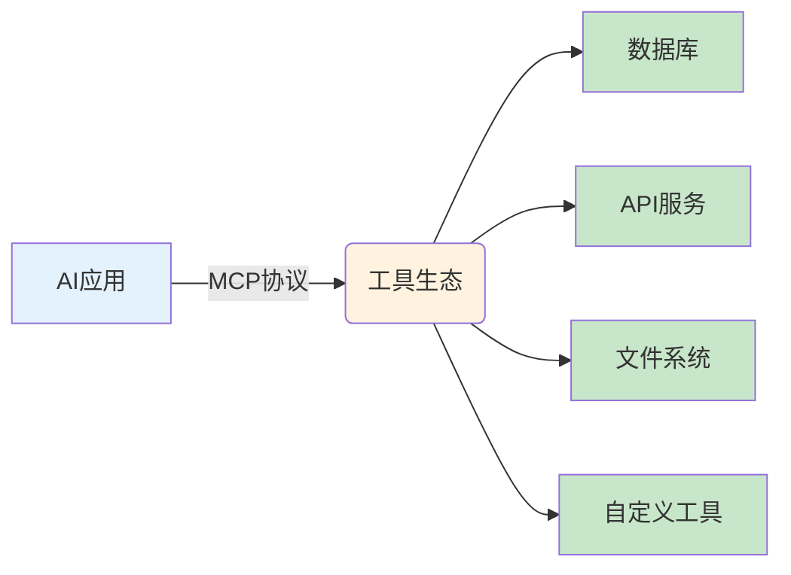
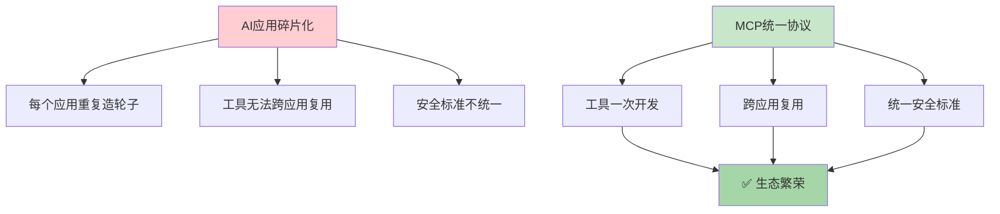
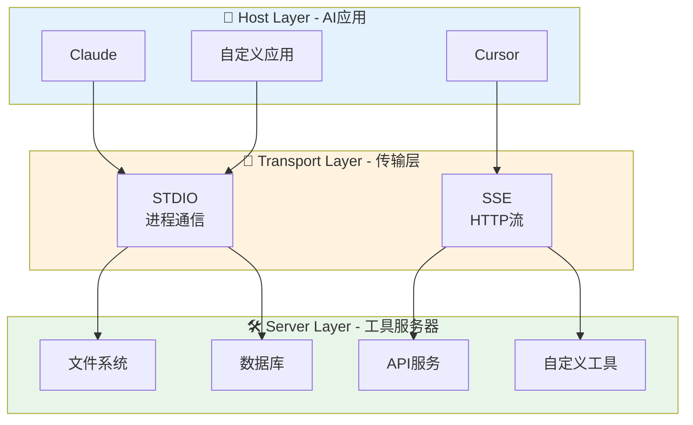
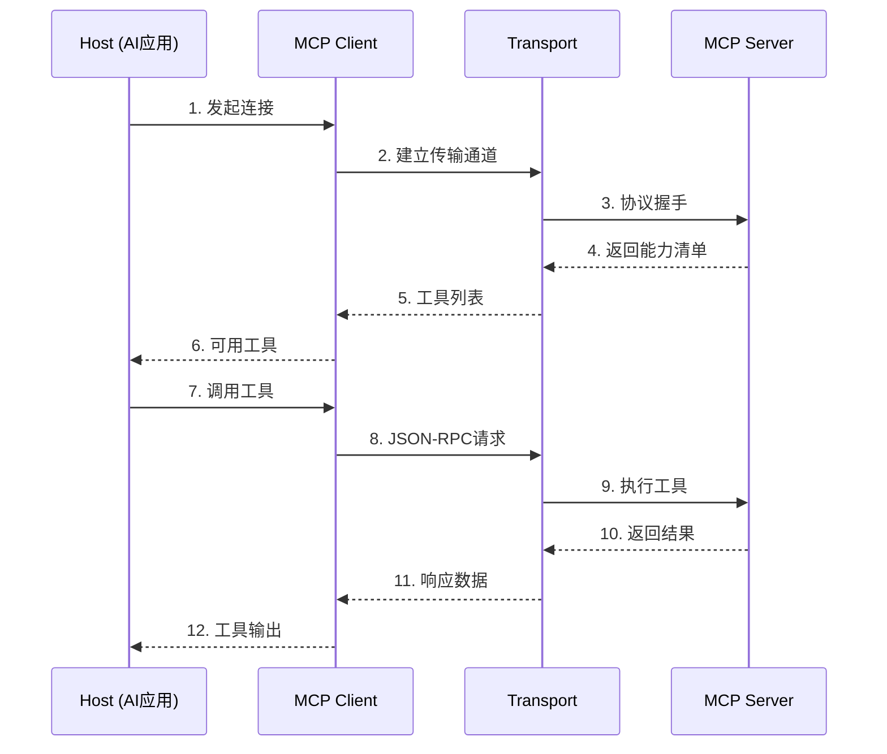
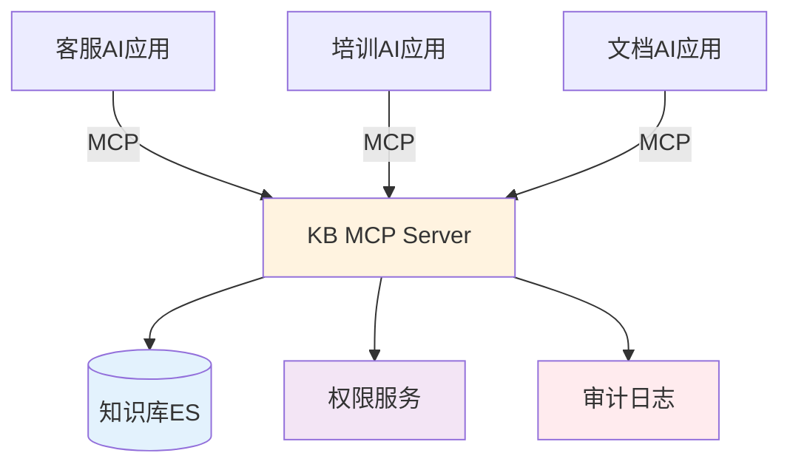

> 🎯 **一句话定位**：让 AI 应用像 USB 设备一样即插即用的**通用协议标准**
>
> 💡 **核心价值**：解决 AI 工具生态的"巴别塔"问题——每个 AI 应用都说不同的语言，MCP 让它们统一说"普通话"。

---

## 📖 3分钟速览版

### 🔌 MCP 是什么？



<details>
<summary><strong>📊 点击展开更多内容</strong></summary>

**通俗类比**：
- 🔌 **MCP** = USB Type-C（统一接口标准）
- 🛠️ **AI Tools** = 外设（鼠标、键盘、硬盘）
- 🤖 **LLM Apps** = 电脑（即插即用）

### 💎 为什么需要 MCP？

| 问题 | 没有 MCP | 有 MCP |
|------|---------|--------|
| 🔌 **接口混乱** | 每个工具自定义接口 | 统一标准接口 |
| 🔄 **重复开发** | 每个应用重复实现工具 | 一次开发，到处使用 |
| 🛡️ **安全风险** | 各自实现安全机制 | 统一安全标准 |
| 📈 **生态割裂** | 工具无法跨应用使用 | 工具市场共享 |

### 🎯 适用场景

```text
✅ 推荐：
├─ 需要集成多个外部工具的 AI 应用
├─ 需要让工具在多个 AI 应用间复用
├─ 需要统一的安全和管理机制
└─ 企业级 AI 应用部署

❌ 不推荐：
├─ 单一简单工具（直接 function call 更快）
├─ 一次性脚本（MCP 有学习成本）
└─ 极低延迟要求（MCP 有通信开销）
```

</details>

---

## 🧠 深度剖析版

## 1. MCP 协议深度解析

### 🎯 1.1 核心概念

**MCP（Model Context Protocol）** 是 Anthropic 于 2024 年 11 月开源的 AI 应用互操作协议。

#### 设计哲学



#### 类比理解

| 层次 | 传统方式 | MCP 方式 | 好处 |
|------|---------|---------|------|
| **接口** | 各自为政 | 统一标准 | 🔌 即插即用 |
| **实现** | 重复开发 | 一次编写 | ⚡️ 提升效率 |
| **生态** | 孤岛效应 | 共享市场 | 📈 规模效应 |
| **类比** | 充电线乱象 | USB Type-C | 🎯 用户体验 |

---

### 🏗️ 1.2 架构设计

#### 三层架构



#### 核心组件

| 组件 | 职责 | 类比 |
|------|------|------|
| **Host（宿主）** | AI 应用，消费工具 | 电脑 |
| **Client（客户端）** | 从 Server 获取工具 | 驱动程序 |
| **Server（服务器）** | 提供工具和资源 | USB 设备 |
| **Transport（传输）** | 通信管道 | USB 线缆 |

---

### 🔄 1.3 工作流程



#### 关键步骤说明

1. **初始化（Initialize）**：协商协议版本、能力
2. **发现（Discover）**：Server 暴露可用工具/资源列表
3. **调用（Invoke）**：Client 通过 JSON-RPC 调用工具
4. **响应（Response）**：Server 返回结果或错误

---

## 2. MCP vs 其他方案

### 📊 2.1 方案对比

| 维度 | MCP | LangChain Tools | OpenAI Function Call | 自定义 API |
|------|-----|-----------------|---------------------|-----------|
| **标准化** | ✅ 开放标准 | ⚠️ 框架特定 | ⚠️ 厂商特定 | ❌ 各自为政 |
| **跨平台** | ✅ 全平台 | ⚠️ Python/JS | ❌ 仅 OpenAI | ❌ 自定义 |
| **工具复用** | ✅ 跨应用 | ❌ 框架内 | ❌ 单模型 | ❌ 单应用 |
| **学习曲线** | ⚠️ 中等 | ✅ 低 | ✅ 低 | ❌ 高 |
| **生态成熟度** | 🟡 早期 | 🟢 成熟 | 🟢 成熟 | 🔵 取决于你 |

### 🎯 2.2 选择建议

```text
📋 决策树：

需要跨应用复用工具？
├─ 是 → 🎯 使用 MCP
│
└─ 否 → 只用单一框架？
    ├─ LangChain → 用 LangChain Tools
    ├─ OpenAI → 用 Function Call
    └─ 都不是 → 考虑自研（学习成本高）
```

---

## 3. Spring AI MCP 实战

### 🎯 3.1 为什么选择 Spring AI？

```text
✅ Spring AI 优势：
├─ 🇨🇳 国内开发者友好（中文文档完善）
├─ 🏢 企业级特性（配置管理、安全、监控）
├─ 🔌 Spring 生态集成（Boot、Security）
└─ 📊 生产就绪（可观测性、健康检查）

⚠️ 注意：
└─ MCP 支持处于 Milestone 阶段（1.0.0-M6）
```

### 🛠️ 3.2 快速开始

#### Step 1: 项目初始化

```bash
# 使用 Spring Initializr 创建项目
curl https://start.spring.io/starter.zip \
  -d dependencies=web \
  -d type=maven-project \
  -d language=java \
  -d bootVersion=3.3.0 \
  -d groupId=com.example \
  -d artifactId=mcp-demo \
  -o mcp-demo.zip

unzip mcp-demo.zip
cd mcp-demo
```

#### Step 2: 添加依赖

```xml
<!-- pom.xml -->
<dependencies>
    <!-- Spring Web -->
    <dependency>
        <groupId>org.springframework.boot</groupId>
        <artifactId>spring-boot-starter-web</artifactId>
    </dependency>

    <!-- Spring AI MCP Server -->
    <dependency>
        <groupId>org.springframework.ai</groupId>
        <artifactId>spring-ai-mcp-server-spring-boot-starter</artifactId>
        <version>1.0.0-M6</version>
    </dependency>
</dependencies>

<!-- 添加 Spring Milestone 仓库 -->
<repositories>
    <repository>
        <id>spring-milestones</id>
        <name>Spring Milestones</name>
        <url>https://repo.spring.io/milestone</url>
        <snapshots>
            <enabled>false</enabled>
        </snapshots>
    </repository>
</repositories>
```

#### Step 3: 实现工具服务

```java
package com.example.mcp.service;

import org.springframework.ai.mcp.server.tool.Tool;
import org.springframework.stereotype.Service;

/**
 * MCP 工具服务示例
 *
 * @author MamimiJa Nai
 */
@Service
public class WeatherService {

    /**
     * 获取指定城市的天气信息
     *
     * @param city 城市名称
     * @return 天气描述
     */
    @Tool(
        name = "get_weather",
        description = "获取指定城市的当前天气信息，包括温度、天气状况和湿度"
    )
    public String getWeather(String city) {
        // 实际项目中应该调用真实天气 API
        return String.format(
            "🌍 %s 的天气：晴天，温度 22°C，湿度 45%%",
            city
        );
    }

    /**
     * 获取城市列表
     *
     * @return 支持的城市列表
     */
    @Tool(
        name = "list_cities",
        description = "获取所有支持天气查询的城市列表"
    )
    public String listCities() {
        return """
            📍 支持的城市：
            - 北京
            - 上海
            - 广州
            - 深圳
            - 杭州
            """;
    }
}
```

#### Step 4: 配置 MCP Server

```java
package com.example.mcp.config;

import com.example.mcp.service.WeatherService;
import org.springframework.ai.mcp.server.ToolCallbackProvider;
import org.springframework.ai.mcp.server.config.McpServerProperties;
import org.springframework.context.annotation.Bean;
import org.springframework.context.annotation.Configuration;

/**
 * MCP 服务器配置
 *
 * @author MamimiJa Nai
 */
@Configuration
public class McpServerConfig {

    /**
     * 注册工具回调提供者
     */
    @Bean
    public ToolCallbackProvider toolCallbackProvider(
            WeatherService weatherService,
            McpServerProperties properties) {

        return ToolCallbackProvider.builder()
            .toolObjects(weatherService)  // 注册工具服务
            .serverProperties(properties)  // MCP 服务器属性
            .build();
    }
}
```

#### Step 5: application.yml 配置

```yaml
spring:
  application:
    name: weather-mcp-server

  ai:
    mcp:
      server:
        # 是否启用 MCP 服务器
        enabled: true

        # 服务器名称
        name: ${spring.application.name}

        # 服务器版本
        version: 1.0.0

        # 执行模式：SYNC（同步）或 ASYNC（异步）
        type: SYNC

        # 传输模式：stdio（标准输入输出）或 sse（HTTP流）
        mode: stdio

        # 日志级别
        log-level: info

# 日志配置（调试时建议开启 DEBUG）
logging:
  level:
    org.springframework.ai.mcp: DEBUG
```

#### Step 6: 打包与运行

```bash
# 打包
mvn clean package -DskipTests

# 运行（stdio 模式）
java -jar target/mcp-demo-0.0.1-SNAPSHOT.jar

# 或者在 IDE 中直接运行主类
```

---

### 🎮 3.3 客户端连接测试

#### 方法一：Cherry Studio（推荐）

**Cherry Studio** 是一款开源的 AI 客户端，支持 MCP 协议，界面友好。

<details>
<summary><strong>📋 Cherry Studio 配置步骤</strong></summary>

##### 1. 安装 Cherry Studio

访问 [GitHub Releases](https://github.com/CherryHQ/cherry-studio/releases) 下载对应系统版本。

##### 2. 配置 MCP 服务器

- 打开 Cherry Studio
- 进入 **设置** → **MCP 服务器**
- 点击 **添加本地服务器**

##### 3. 配置参数

| 参数 | 值 | 说明 |
|------|-----|------|
| 名称 | `weather-mcp-server` | 服务器标识 |
| 命令 | `java -jar /absolute/path/to/mcp-demo.jar` | 完整绝对路径 |
| 类型 | `stdio` | 标准输入输出模式 |

> ⚠️ **注意**：JAR 包路径必须使用**绝对路径**，相对路径可能导致启动失败。

##### 4. 测试工具调用

1. 新建对话
2. 选择支持 MCP 的模型（带🔧扳手图标）
3. 输入测试提示词：
   ```
   帮我查一下北京的天气
   ```
4. 观察模型是否调用 `get_weather` 工具

##### 5. 验证结果

成功的输出示例：
```text
🌍 北京的天气：晴天，温度 22°C，湿度 45%
```

</details>

#### 方法二：Claude Desktop

**Claude Desktop** 是 Anthropic 官方桌面客户端，原生支持 MCP。

##### 配置文件位置

| 操作系统 | 配置文件路径 |
|---------|-------------|
| macOS | `~/Library/Application Support/Claude/claude_desktop_config.json` |
| Windows | `%APPDATA%\Claude\claude_desktop_config.json` |
| Linux | `~/.config/Claude/claude_desktop_config.json` |

##### 配置内容

```json
{
  "mcpServers": {
    "weather-server": {
      "command": "java",
      "args": [
        "-jar",
        "/absolute/path/to/mcp-demo-0.0.1-SNAPSHOT.jar"
      ]
    }
  }
}
```

##### 验证步骤

1. 保存配置文件
2. 重启 Claude Desktop
3. 在对话中输入：`查询上海的天气`
4. 查看是否正确调用工具

#### 方法三：命令行调试

使用 `stdio` 模式直接调试：

```bash
# 启动 MCP 服务器
java -jar target/mcp-demo-0.0.1-SNAPSHOT.jar

# 发送初始化请求（JSON-RPC 格式）
echo '{"jsonrpc":"2.0","id":1,"method":"initialize","params":{"capabilities":{},"clientInfo":{"name":"test","version":"1.0"}}}' | java -jar target/mcp-demo-0.0.1-SNAPSHOT.jar
```

#### 测试检查清单

```text
✅ 测试验证清单：

基础功能
├─ [ ] MCP 服务器正常启动
├─ [ ] 工具列表正确返回（tools/list）
├─ [ ] 单个工具调用成功（tools/call）
└─ [ ] 错误处理正常工作

客户端集成
├─ [ ] Cherry Studio 连接成功
├─ [ ] Claude Desktop 连接成功
└─ [ ] 工具调用链路完整

异常场景
├─ [ ] 无效参数返回明确错误
├─ [ ] 服务重启后自动重连
└─ [ ] 日志输出可追踪问题
```

---

### 🚀 3.4 进阶：SSE 模式部署

#### 修改配置

```yaml
spring:
  ai:
    mcp:
      server:
        mode: sse  # 改为 SSE 模式
        port: 8081  # SSE 服务端口
```

#### 健康检查端点

```bash
# 检查 MCP 服务器状态
curl http://localhost:8081/actuator/health

# 预期响应
{
  "status": "UP"
}
```

#### 客户端连接配置

```json
{
  "mcpServers": {
    "weather-server": {
      "url": "http://localhost:8081/mcp/sse"
    }
  }
}
```

---

## 4. 生产环境最佳实践

### 🔒 4.1 安全配置

```java
@Configuration
public class McpSecurityConfig {

    /**
     * 配置工具访问权限
     */
    @Bean
    public ToolCallbackProvider secureToolProvider(
            WeatherService weatherService) {

        return ToolCallbackProvider.builder()
            .toolObjects(weatherService)
            // 添加访问控制
            .accessControl((tool, principal) -> {
                // 只允许特定角色访问
                return principal.hasRole("AI_USER");
            })
            .build();
    }
}
```

### 📊 4.2 监控与可观测性

```yaml
# application.yml
management:
  endpoints:
    web:
      exposure:
        include: health,metrics,prometheus
  metrics:
    export:
      prometheus:
        enabled: true

# 自定义指标
spring:
  ai:
    mcp:
      server:
        metrics:
          enabled: true
```

**监控指标**：
- `mcp.tool.invocation.count` - 工具调用次数
- `mcp.tool.execution.time` - 工具执行时间
- `mcp.error.count` - 错误次数

### ⚡ 4.3 性能优化

```java
@Service
public class OptimizedWeatherService {

    @Tool(name = "get_weather_fast")
    @Cacheable(value = "weather", key = "#city")  // 添加缓存
    public String getWeather(String city) {
        // 实现逻辑
    }

    @Tool(name = "get_weather_batch")
    public Map<String, String> getWeatherBatch(List<String> cities) {
        // 批量处理，减少调用次数
        return cities.stream()
            .collect(Collectors.toMap(
                city -> city,
                this::getWeather
            ));
    }
}
```

---

## 5. 故障排查指南

### 🔧 5.1 常见问题

#### 问题1：工具未被发现

```text
❌ 症状：客户端无法看到工具列表

🔍 可能原因：
├─ @Tool 注解未添加
├─ ToolCallbackProvider 未正确配置
├─ Service 未被 Spring 扫描到
└─ 依赖版本冲突

✅ 解决方案：
1. 检查 @Tool 注解的 name 和 description
2. 确认 @Bean 配置正确
3. 添加 @ComponentScan 扫描包
4. 统一 Spring AI 版本
```

#### 问题2：Stdio 模式无响应

```text
❌ 症状：启动后客户端连接超时

🔍 可能原因：
├─ Java 进程未启动
├─ 日志输出到 stderr 而非 stdout
└─ 缓冲区未刷新

✅ 解决方案：
1. 使用 `java -jar` 而非 IDE 运行
2. 检查日志级别是否为 DEBUG
3. 添加 System.out.flush()
```

#### 问题3：SSE 模式连接断开

```text
❌ 症状：连接频繁断开重连

🔍 可能原因：
├─ 超时时间过短
├─ Nginx 代理配置问题
└─ 网络不稳定

✅ 解决方案：
spring:
  ai:
    mcp:
      server:
        sse:
          heartbeat: 30s  # 心跳间隔
          timeout: 60s    # 超时时间
```

---

## 6. 实战案例

### 🏢 案例：企业级知识库 MCP Server

#### 需求背景

```text
📋 场景：
├─ 企业有多个 AI 应用（客服、培训、文档）
├─ 需要统一的文档查询工具
└─ 要求：安全、可控、可审计

🎯 目标：
├─ 一次开发，多应用复用
├─ 统一权限管理
└─ 完整的审计日志
```

#### 实现方案

```java
@Service
public class KnowledgeBaseService {

    @Tool(
        name = "search_docs",
        description = "在企业知识库中搜索相关文档"
    )
    @PreAuthorize("hasRole('EMPLOYEE')")  # 权限控制
    @AuditLog  # 审计日志
    public List<Document> searchDocuments(
        @ToolParam(description = "搜索关键词") String query,
        @ToolParam(description = "最大结果数", defaultValue = "5") int limit
    ) {
        // 1. 参数验证
        validateQuery(query);

        // 2. 调用搜索服务
        List<Document> results = searchService.search(query, limit);

        // 3. 过滤敏感信息
        return filterSensitiveInfo(results);
    }

    @Tool(name = "get_doc_summary")
    public String getDocumentSummary(
        @ToolParam(description = "文档ID") String docId
    ) {
        // 实现逻辑
    }
}
```

#### 部署架构



#### 效果对比

| 指标 | 改进前 | 改进后 | 提升 |
|------|--------|--------|------|
| 开发时间 | 3周/应用 | 1周（一次） | ⬇️ 67% |
| 维护成本 | 高 | 低 | ⬇️ 80% |
| 工具复用 | 0% | 100% | ∞ |
| 安全审计 | 分散 | 统一 | ✅ |

---

## 7. 工具与资源

### ✅ MCP 检查清单

<details>
<summary><strong>📋 开发前检查清单</strong></summary>

#### 需求确认
- [ ] 确认需要跨应用复用工具
- [ ] 确认工具可以标准化描述
- [ ] 评估 MCP 学习成本可接受

#### 技术选型
- [ ] 选择传输模式（stdio / SSE）
- [ ] 选择 AI 框架（Spring AI / LangChain）
- [ ] 确认客户端支持（Claude / 自研）

#### 开发准备
- [ ] 搭建 Spring Boot 项目
- [ ] 添加 Spring AI MCP 依赖
- [ ] 配置 IDE 运行环境

#### 测试验证
- [ ] 编写工具单元测试
- [ ] 使用客户端连接测试
- [ ] 验证工具调用流程

#### 部署上线
- [ ] 配置生产环境参数
- [ ] 设置监控告警
- [ ] 准备回滚方案

</details>

---

### 📚 推荐资源

| 类型 | 名称 | 链接 |
|------|------|------|
| 📖 官方文档 | MCP 官方规范 | https://modelcontextprotocol.io |
| 📖 官方文档 | Spring AI 文档 | https://docs.spring.io/spring-ai |
| 🛠️ 工具 | Cherry Studio | https://github.com/CherryHQ/cherry-studio |
| 🛠️ 工具 | Claude Desktop | https://claude.ai/download |
| 💬 社区 | MCP Discord | https://discord.gg/mcp |
| 📺 视频 | MCP 入门教程 | YouTube 搜索 "MCP tutorial" |

---

## 💬 常见问题（FAQ）

### Q1: MCP 和 LangChain Tools 有什么本质区别？

**A：** 核心区别在于**跨框架复用**：

```text
LangChain Tools：
└─ 只能在 LangChain 生态内使用
   └─ 切换到其他框架需要重写

MCP：
└─ 协议级别标准化
   └─ 一次开发，所有框架可用
      ├─ Claude Desktop
      ├─ 自研应用
      └─ 未来任何支持 MCP 的应用
```

### Q2: MCP 的性能开销大吗？

**A：** 有一定开销，但通常可接受：

```text
📊 性能对比：

直接调用：         ~1ms
LangChain Tools：  ~5ms
MCP (stdio)：      ~10-20ms
MCP (SSE)：        ~20-50ms

💡 建议：
├─ 高频工具：考虑缓存或批量处理
├─ 低频工具：MCP 开销可忽略
└─ 极低延迟要求：避免使用 MCP
```

### Q3: 如何调试 MCP 工具？

**A：** 三步调试法：

```text
1️⃣ 启用 DEBUG 日志
   logging.level.org.springframework.ai.mcp: DEBUG

2️⃣ 使用 MCP Inspector
   npx @modelcontextprotocol/inspector

3️⃣ 添加自定义日志
   @Tool(name = "test")
   public String test() {
       log.info("Tool called!");
       return "ok";
   }
```

### Q4: MCP 支持流式响应吗？

**A：** 目前有限支持：

```text
✅ 支持：
├─ 资源流式读取
└─ 通知流式发送

⚠️ 限制：
└─ 工具调用本身是请求-响应模式

💡 替代方案：
└─ 工具返回流ID，客户端再通过资源接口读取
```

### Q5: 企业内网可以部署 MCP 吗？

**A：** 完全可以，而且推荐：

```text
✅ 内网部署优势：
├─ 数据不出内网
├─ 延迟更低
└─ 可控性更强

📋 部署方案：
├─ HTTP 内网代理
├─ VPN + stdio
└─ 私有 MCP Hub
```

---

## ✨ 总结

### 🎯 MCP 的价值

```text
🌟 核心价值：
├─ 📈 生态繁荣：工具共享市场
├─ ⚡️ 提升效率：避免重复造轮子
├─ 🔒 安全标准：统一的安全机制
└─ 🌍 跨平台：语言和框架无关

⚠️ 注意：
├─ 有学习成本
├─ 有性能开销
└─ 生态还在早期
```

### 🚀 下一步行动

```text
📝 学习路径：
1. ⏱️ 30分钟：阅读官方文档
2. 🛠️ 2小时：完成 Hello World
3. 🏢 1天：实现真实工具
4. 🚀 1周：部署生产环境

💻 推荐实践：
├─ 从简单工具开始（天气、搜索）
├─ 先用 stdio 模式（更简单）
├─ 充分测试后再上生产
└─ 关注官方社区更新
```

---

*💻 用 MCP 连接 AI 世界，🔌 让工具像 USB 一样即插即用*

*📅 最后更新：2025-04-24 | 👤 作者：MamimiJa Nai | 🏷️ 技术栈：Spring AI 1.0.0-M6*
