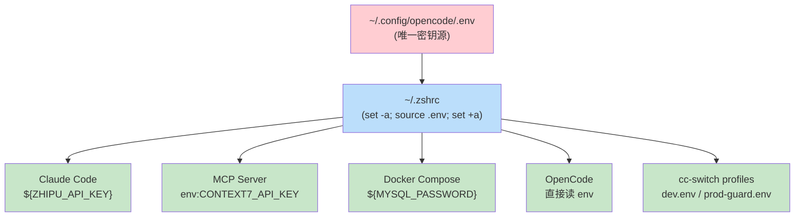
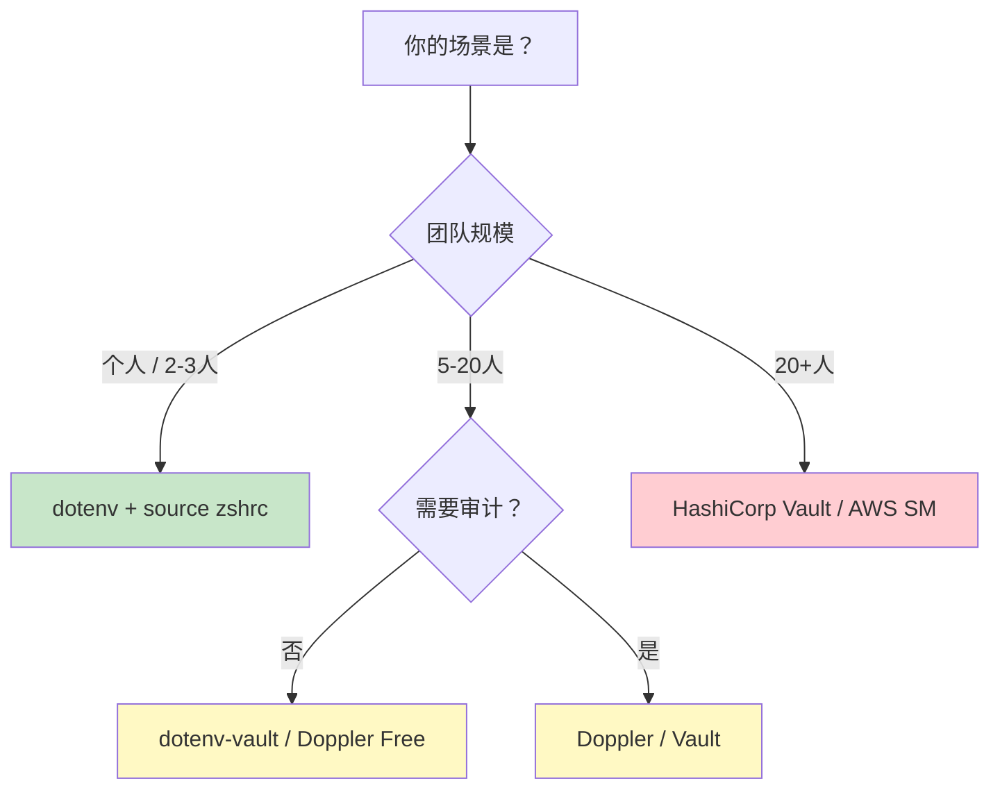
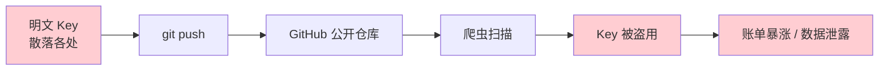
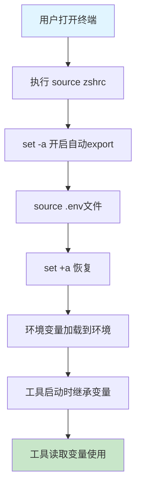
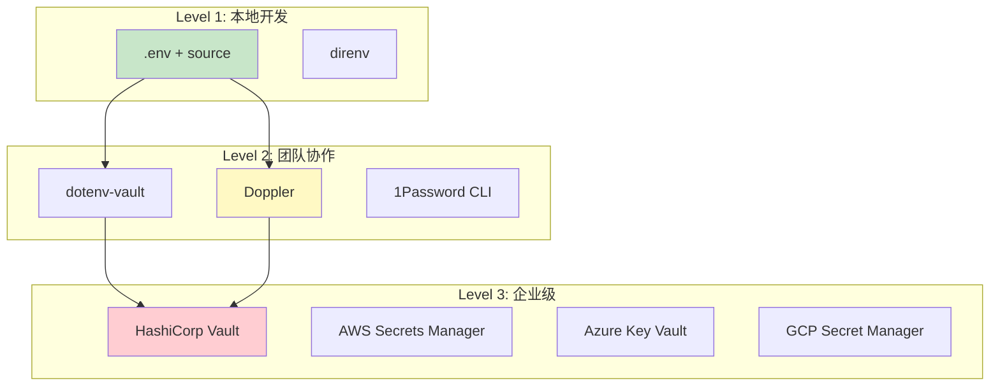

> **一句话定位**：用一套 `.env + source ~/.zshrc` 的模式，统一管理 Claude Code、OpenCode、Docker、MCP Server 等所有 AI 工具的 API Key，告别明文硬编码。

> **核心理念**：密钥是基础设施，不是代码——一切 secret 只应存在于一个地方，一切消费者只应通过环境变量读取。


---

## 3分钟速览版

<details>
<summary><strong>点击展开核心概念</strong></summary>

### 核心架构



### 方案对比速查

| 方案 | 适用场景 | 复杂度 | 团队协作 | 审计能力 |
|-----|---------|--------|---------|---------|
| `.env` + `source` | 个人开发者 / 本地开发 | 低 | 低 | 低 |
| dotenv-vault | 小团队、跨设备同步 | 中 | 中 | 中 |
| Doppler | 中型团队、多环境 | 中 | 高 | 高 |
| HashiCorp Vault | 企业级、合规要求 | 高 | 高 | 高 |
| AWS Secrets Manager | AWS 生态、生产环境 | 中 | 高 | 高 |

### 决策树



</details>

---

## 深度剖析版

## 1. 问题：AI 工具的密钥散落各处

### 1.1 典型的混乱现状

当你同时使用 Claude Code、OpenCode、Cursor、MCP Server、Docker 等工具时，API Key 往往散落在：

- `~/.zshrc` 中 `export API_KEY="sk-xxx"` 明文导出
- `settings.json` 中硬编码 token
- `docker-compose.yml` 中直接写密码
- MCP 配置文件中嵌入 bearer token
- 项目 `.env` 文件被不小心提交到 Git

### 1.2 这很危险



根据 [OpenAI 官方安全指南](https://help.openai.com/en/articles/5112595-best-practices-for-api-key-safety)，被泄露的 API Key 可导致：

- 未授权调用消耗你的配额
- 意外的高额账单
- 数据被第三方访问

### 1.3 我们需要什么

我们需要一个「一个密钥源 + 多个消费者」的架构：所有 Key 存在一个 `.env` 文件中，所有工具通过环境变量读取。

## 2. 架构设计：.env + source ~/.zshrc

### 2.1 文件布局

```text
~/.config/opencode/.env              # 唯一密钥源（全局）
~/.zshrc                             # 自动加载器
~/.claude/settings.glm.json          # Claude Code 配置（引用 env）
~/WorkSpace/ai-config/
  ├── .env.example                   # 公开模板（提交到 Git）
  ├── .gitignore                     # 保护 .env 不被提交
  ├── profiles/
  │   ├── dev.env                    # cc-switch 开发模式
  │   └── prod-guard.env             # cc-switch 生产模式
  └── mcp/
      └── context7/
          ├── server.env             # MCP 元数据（env:VAR_NAME）
          └── codex.toml             # Codex 配置
~/WorkSpace/docker-data/             # Docker 数据卷（独立管理）
```

### 2.2 加载机制



关键代码（`~/.zshrc` 中）：

```bash
# ========== 全局 .env 加载 ==========
if [[ -f ~/.config/opencode/.env ]]; then
  set -a          # 自动 export 后续所有赋值
  source ~/.config/opencode/.env
  set +a          # 恢复默认行为
fi

# 项目级 .env 覆盖（可选）
if [[ -f .opencode/.env ]]; then
  set -a
  source .opencode/.env
  set +a
fi
```

`set -a` 是核心技巧——它让 `source` 加载的所有变量自动变成环境变量（等价于每行前加 `export`），从而被所有子进程继承。

## 3. 实战：各工具如何接入

### 3.1 .env 文件规范

```bash
# ~/.config/opencode/.env
# ==============================================
# 统一密钥管理 - 所有 AI 工具 API Keys
# ==============================================
# 警告: 此文件包含敏感信息，请勿提交到版本控制

# ---- AI 供应商 ----
ZHIPU_API_KEY=<your-zhipu-key>
DEEPSEEK_API_KEY=<your-deepseek-key>
MOONSHOT_API_KEY=<your-moonshot-key>
OPENROUTER_API_KEY=<your-openrouter-key>
GOOGLE_API_KEY=<your-google-key>
KIMI_API_KEY=<your-kimi-key>
MINIMAX_API_KEY=<your-minimax-key>

# ---- MCP 服务 ----
CONTEXT7_API_KEY=<your-context7-key>
GITHUB_PERSONAL_ACCESS_TOKEN=<your-github-pat>

# ---- 基础设施 ----
DISPATCH_MYSQL_HOST=127.0.0.1
DISPATCH_MYSQL_PORT=3306
DISPATCH_MYSQL_USER=readonly_user
DISPATCH_MYSQL_PASSWORD=<your-mysql-password>
DISPATCH_REDIS_HOST=127.0.0.1
DISPATCH_REDIS_PORT=6379
DISPATCH_REDIS_PASSWORD=<your-redis-password>
```

### 3.2 Claude Code (cc-switch)

之前的做法是明文硬编码：

```json
{
  "env": {
    "ANTHROPIC_AUTH_TOKEN": "your-plaintext-token-here"
  }
}
```

改进后使用环境变量引用：

```json
{
  "env": {
    "ANTHROPIC_AUTH_TOKEN": "${ZHIPU_API_KEY}",
    "ANTHROPIC_BASE_URL": "https://open.bigmodel.cn/api/anthropic",
    "ANTHROPIC_DEFAULT_HAIKU_MODEL": "glm-4.7",
    "ANTHROPIC_DEFAULT_SONNET_MODEL": "glm-5",
    "ANTHROPIC_DEFAULT_OPUS_MODEL": "glm-5"
  }
}
```

cc-switch 的 `profiles/` 目录存储的是行为策略（model tier、sandbox、approval 等），不存储密钥：

```bash
# profiles/dev.env - 仅包含行为配置，无密钥
PROFILE_NAME=dev
MODE=fast
MODEL_TIER=fast
SANDBOX=workspace-write
APPROVAL=on-request
MCP_READ_POLICY=allow
MCP_WRITE_POLICY=deny
```

### 3.3 MCP Server

MCP 服务使用 `env:VAR_NAME` 语法引用环境变量：

```bash
# ai-config/mcp/context7/server.env
SERVER_ID=context7
MCP_URL=https://mcp.context7.com/mcp
BEARER_TOKEN_ENV_VAR=CONTEXT7_API_KEY     # 指向环境变量名
AUTH_SOURCE=env:CONTEXT7_API_KEY          # 标准化引用格式
```

```toml
# ai-config/mcp/context7/codex.toml
[mcp_servers.context7]
url = "https://mcp.context7.com/mcp"
bearer_token_env_var = "CONTEXT7_API_KEY"  # 运行时从 env 读取
```

根据 [Claude Code 官方文档](https://support.claude.com/en/articles/12304248-managing-api-key-environment-variables-in-claude-code)，`.mcp.json` 也支持 `${VAR}` 和 `${VAR:-default}` 语法。

### 3.4 Docker

Docker Compose 原生支持 `.env` 文件。数据卷独立存放在 `docker-data/`：

```yaml
# docker-compose.yml
services:
  mysql:
    image: mysql:8.0.33
    environment:
      MYSQL_ROOT_PASSWORD: ${DISPATCH_MYSQL_PASSWORD}
      MYSQL_DATABASE: ${DISPATCH_MYSQL_DATABASE}
    volumes:
      - ~/WorkSpace/docker-data/mysql80331el8:/var/lib/mysql
    ports:
      - "${DISPATCH_MYSQL_PORT}:3306"

  redis:
    image: redis:7-alpine
    command: redis-server --requirepass ${DISPATCH_REDIS_PASSWORD}
    ports:
      - "${DISPATCH_REDIS_PORT}:6379"
```

Docker Compose 会按优先级读取：

1. Shell 环境变量（已通过 `source ~/.zshrc` 加载）
2. 项目目录下的 `.env` 文件
3. `docker-compose.yml` 中的 `default` 值

### 3.5 OpenCode

OpenCode 直接读取 shell 环境变量，无需额外配置：

```bash
# ~/.zshrc 中已通过 set -a; source .env; set +a 导出
# OpenCode 启动时自动继承以下变量：
echo $ZHIPU_API_KEY     # AI 供应商 Key
echo $CONTEXT7_API_KEY  # MCP Key
echo $DEEPSEEK_API_KEY  # DeepSeek Key
```

## 4. 安全加固

### 4.1 文件权限

```bash
# .env 文件只允许本用户读写
chmod 600 ~/.config/opencode/.env

# 验证权限
ls -la ~/.config/opencode/.env
# -rw-------  1 user  staff  1234  Mar  4 12:00 .env
```

### 4.2 Git 防泄露

`.gitignore`（必须配置）：

```gitignore
# 环境变量 - 敏感信息
.env
.env.local
.env.*.local
.opencode/.env
```

Git pre-commit hook（推荐）：

```bash
#!/bin/sh
# .git/hooks/pre-commit
# 扫描即将提交的文件中是否包含疑似 API Key

if git diff --cached --name-only | xargs grep -lE \
  "sk-[a-zA-Z0-9]{20,}|ctx7sk-|github_pat_|AIzaSy" 2>/dev/null; then
  echo "ERROR: 检测到疑似 API Key，请检查后重新提交"
  exit 1
fi
```

### 4.3 定期审计

```bash
# 扫描工作目录中的明文密钥
grep -r "sk-\|ctx7sk-\|AIzaSy\|github_pat_" ~/WorkSpace \
  --include="*.json" --include="*.yaml" --include="*.yml" \
  --include="*.toml" --include="*.sh" --include="*.zsh" \
  --exclude-dir=node_modules --exclude-dir=.git

# 应该返回空（除了 .env.example 中的占位符）
```

### 4.4 安全检查清单

- [ ] `.env` 文件权限为 `600`
- [ ] `.gitignore` 包含 `.env`
- [ ] `~/.zshrc` 中无明文 Key
- [ ] `settings.json` 中无明文 Token
- [ ] `docker-compose.yml` 中使用 `${VAR}` 而非明文
- [ ] MCP 配置使用 `env:VAR_NAME`
- [ ] Git pre-commit hook 已启用
- [ ] 定期运行密钥扫描

## 5. 其他方案对比

### 5.1 方案全景



### 5.2 详细对比

| 维度 | .env + source | direnv | dotenv-vault | Doppler | HashiCorp Vault |
|-----|:---:|:---:|:---:|:---:|:---:|
| 安装成本 | 零 | 低 | 低 | 中 | 高 |
| 学习曲线 | 零 | 低 | 低 | 中 | 高 |
| 多环境支持 | 手动 | 自动 | 内建 | 内建 | 内建 |
| 加密存储 | 否 | 否 | 是 | 是 | 是 |
| 访问控制 | 文件权限 | 文件权限 | 团队角色 | RBAC | 策略引擎 |
| 审计日志 | 否 | 否 | 基础 | 完整 | 完整 |
| 密钥轮换 | 手动 | 手动 | 手动 | 自动 | 自动 |
| 价格 | 免费 | 免费 | 免费/付费 | 免费/付费 | 开源/企业版 |
| 适用场景 | 个人开发 | 多项目 | 小团队 | 中型团队 | 企业合规 |

### 5.3 进阶方案简介

#### direnv：按目录自动加载环境变量

适合多项目切换的场景。

```bash
# 安装
brew install direnv

# 在项目目录创建 .envrc
echo 'dotenv' > .envrc
direnv allow

# 进入目录自动加载，离开自动卸载
```

#### Doppler：云端密钥管理

零代码侵入，自动注入环境变量。

```bash
# 安装
brew install dopplerhq/cli/doppler

# 登录并配置
doppler login
doppler setup

# 运行命令时自动注入密钥
doppler run -- claude
doppler run -- docker compose up
```

#### dotenv-vault：加密同步 .env

安全同步到多台设备。

```bash
# 安装
npx dotenv-vault new

# 加密并推送
npx dotenv-vault push

# 在其他设备拉取
npx dotenv-vault pull
```

## 6. 故障排查

### 问题 1：环境变量未加载

症状：工具报错 "API key not set" 或 `echo $VAR` 为空。

排查步骤：

```bash
# 1. 检查 .env 文件是否存在
ls -la ~/.config/opencode/.env

# 2. 手动加载
source ~/.zshrc

# 3. 验证变量
printenv | grep -E "CONTEXT7|ZHIPU|DEEPSEEK"

# 4. 如果仍为空，检查 .env 语法（不能有空格在等号两侧）
# 错误：KEY = value
# 正确：KEY=value
```

### 问题 2：Claude Code 未使用环境变量

症状：`settings.glm.json` 中写了 `${VAR}` 但工具仍报认证失败。

原因：Claude Code 的 `env` 字段中 `${VAR}` 展开依赖 shell 环境。

解决方案：

```bash
# 确认 Claude Code 是从终端启动的（继承了 env）
# 如果从 GUI 启动，环境变量可能未加载

# 验证：在 Claude Code 中运行
# /status 查看当前认证方式
```

### 问题 3：Docker Compose 变量未替换

症状：MySQL 密码为 `${DISPATCH_MYSQL_PASSWORD}` 字面量。

原因：Docker Compose 在非 shell 环境下可能无法读取 zshrc 导出的变量。

解决方案：

```bash
# 方案 1：在项目目录放一个 .env（Docker Compose 自动读取）
cp ~/.config/opencode/.env .env

# 方案 2：显式传递 env_file（在 docker-compose.yml 中配置）
# services:
#   mysql:
#     env_file:
#       - ~/.config/opencode/.env
```

### 问题 4：Key 已提交到 Git

症状：发现 Git 历史中包含明文密钥。

紧急处理步骤：

```bash
# 1. 立即在供应商后台轮换/撤销该 Key

# 2. 从 Git 历史中移除（谨慎操作）
git filter-branch --tree-filter 'rm -f .env' HEAD

# 3. 强制推送（需要确认）
git push --force-with-lease

# 4. 通知团队成员 rebase
```

## 7. 完整实战案例

### 案例：从零配置 AI 开发环境

目标：配置一台新 Mac，让 Claude Code、OpenCode、Docker、MCP 全部使用统一的 `.env` 管理。

#### Step 1 - 创建 .env 文件

```bash
mkdir -p ~/.config/opencode
cat > ~/.config/opencode/.env << 'EOF'
# AI 供应商
ZHIPU_API_KEY=your-zhipu-key
DEEPSEEK_API_KEY=your-deepseek-key
CONTEXT7_API_KEY=your-context7-key
GITHUB_PERSONAL_ACCESS_TOKEN=your-github-pat

# 基础设施
DISPATCH_MYSQL_PASSWORD=your-mysql-password
DISPATCH_REDIS_PASSWORD=your-redis-password
EOF

chmod 600 ~/.config/opencode/.env
```

#### Step 2 - 配置 zshrc 加载

```bash
cat >> ~/.zshrc << 'ZSHRC'

# ========== 统一密钥加载 ==========
if [[ -f ~/.config/opencode/.env ]]; then
  set -a
  source ~/.config/opencode/.env
  set +a
fi
ZSHRC

source ~/.zshrc
```

#### Step 3 - 配置 Claude Code

在 `settings.glm.json` 中使用 `${ZHIPU_API_KEY}` 引用。在 `settings.official.json` 中使用 `${ANTHROPIC_API_KEY}` 引用。cc-switch 会自动根据 profile 切换。

#### Step 4 - 配置 MCP Server

```bash
# ai-config/mcp/context7/server.env
AUTH_SOURCE=env:CONTEXT7_API_KEY
```

在 `.mcp.json` 中使用：

```json
{
  "headers": {
    "Authorization": "Bearer ${CONTEXT7_API_KEY}"
  }
}
```

#### Step 5 - 启动 Docker

```bash
# Docker Compose 自动从 shell env 读取变量
docker compose up -d
```

#### Step 6 - 验证

```bash
# 验证所有变量已加载
echo "ZHIPU: ${ZHIPU_API_KEY:0:10}..."
echo "CONTEXT7: ${CONTEXT7_API_KEY:0:10}..."
echo "MYSQL_PWD: ${DISPATCH_MYSQL_PASSWORD:0:5}..."

# 验证 Docker
docker compose exec mysql mysql -u root -p$DISPATCH_MYSQL_PASSWORD -e "SELECT 1"
```

## 8. FAQ

### Q1: 为什么选 `~/.config/opencode/.env` 而不是 `~/.env`？

遵循 XDG Base Directory 规范，将应用配置放在 `~/.config/` 下。同时 OpenCode 原生支持这个路径，减少额外配置。

### Q2: `set -a` 和逐行 `export` 有什么区别？

功能上等价。`set -a` 的优势是：`.env` 文件无需每行写 `export`，保持与 Docker Compose、direnv 等工具兼容的标准格式。

### Q3: 多个 AI 工具会不会有环境变量冲突？

会。例如 `ANTHROPIC_API_KEY` 可能被 Claude Code 和 Cursor 同时读取。解决方案有三种：

- 使用供应商特定前缀（如 `ZHIPU_API_KEY`）
- 在工具配置中显式映射（如 `"ANTHROPIC_AUTH_TOKEN": "${ZHIPU_API_KEY}"`）
- 用 cc-switch profiles 按场景切换

### Q4: 生产环境也用 .env 文件吗？

不建议。`.env` 适合本地开发。生产环境应使用加密的密钥管理服务：

- 容器化部署：Kubernetes Secrets + RBAC
- 云平台：AWS Secrets Manager / Azure Key Vault / GCP Secret Manager
- 自建：HashiCorp Vault

参考 [Doppler 的分析](https://www.doppler.com/blog/why-syncing-env-files-doesnt-scale-for-secrets-management)：`.env` 文件在跨环境同步、审计、权限控制方面存在天然局限。

### Q5: 如何安全地在多台设备间同步密钥？

推荐方案如下：

| 方案 | 适用场景 |
|-----|---------|
| [dotenv-vault](https://github.com/dotenv-org/dotenv-vault) | 加密后同步 `.env`，轻量 |
| [Doppler](https://www.doppler.com/) | 云端管理，CLI 注入 |
| 1Password CLI (`op`) | 个人密码管理器集成 |
| 手动 `scp` + 加密 | 极简需求 |

### Q6: Key 泄露了怎么办？

四步紧急处理流程：

1. 立即轮换：在供应商后台生成新 Key，撤销旧 Key
2. 清理 Git：使用 `git filter-branch` 或 [BFG Repo-Cleaner](https://rtyley.github.io/bfg-repo-cleaner/)
3. 审计影响：检查供应商的用量日志
4. 加强防护：部署 [Gitleaks](https://github.com/gitleaks/gitleaks) 或 [TruffleHog](https://github.com/trufflesecurity/trufflehog) 扫描

### Q7: cc-switch 的 profiles 和 .env 是什么关系？

分工明确：

- `.env` 存储密钥（WHAT credentials）
- `profiles/*.env` 存储行为策略（HOW to behave）——模型选择、权限级别、审批策略等

两者通过环境变量统一注入，但关注点完全不同。

## 9. 总结

### 核心要点

1. 单一密钥源：所有 API Key 只存在于 `~/.config/opencode/.env`，所有工具通过环境变量消费
2. 零侵入加载：`set -a; source .env; set +a` 三行代码实现全局注入，无需修改任何工具代码
3. 层次化防护：文件权限 (`chmod 600`) + Git 忽略 (`.gitignore`) + 提交扫描 (pre-commit hook) 三道防线

### 行动建议

今天就可以做的：

- 将散落在 `~/.zshrc` 和配置文件中的明文 Key 迁移到 `.env`
- 配置 `.gitignore` 和文件权限

本周可以优化的：

- 部署 Git pre-commit hook 扫描密钥泄露
- 为 AI 开发环境创建 `.env.example` 模板

长期可以改进的：

- 评估 Doppler 或 dotenv-vault 实现跨设备同步
- 生产环境迁移到 HashiCorp Vault 或云平台 Secrets Manager
- 建立 90 天密钥轮换机制

### 最后的话

> 密钥管理的终极目标不是复杂，而是简单——简单到所有开发者都愿意遵守，简单到不需要额外记忆任何步骤。`.env + source` 就是这样的方案：足够简单地开始，足够灵活地演进。

---

## 参考资源

| 资源 | 链接 | 说明 |
|-----|------|------|
| OpenAI API Key 安全指南 | [OpenAI Help Center](https://help.openai.com/en/articles/5112595-best-practices-for-api-key-safety) | 官方安全最佳实践 |
| Claude API Key 最佳实践 | [Claude Help Center](https://support.claude.com/en/articles/9767949-api-key-best-practices-keeping-your-keys-safe-and-secure) | Anthropic 官方建议 |
| Claude Code 环境变量管理 | [Claude Help Center](https://support.claude.com/en/articles/12304248-managing-api-key-environment-variables-in-claude-code) | MCP 与 env 集成 |
| 为什么 .env 不适合规模化 | [Doppler Blog](https://www.doppler.com/blog/why-syncing-env-files-doesnt-scale-for-secrets-management) | .env 局限性分析 |
| dotenv-vault | [GitHub](https://github.com/dotenv-org/dotenv-vault) | 加密同步 .env |
| Gitleaks | [GitHub](https://github.com/gitleaks/gitleaks) | Git 密钥泄露扫描 |

---

## 更新记录

最后更新：2026-03-04 | 作者：MamimiJa Nai

| 版本 | 日期 | 更新内容 |
|-----|------|---------|
| 1.0 | 2026-03-04 | 初始版本：基于实际 AI 开发环境的密钥管理实践 |
