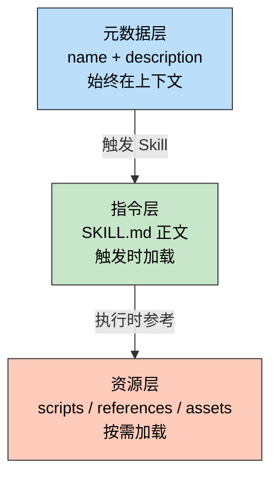

> 一句话定位：Skill 是 Claude Code 的"领域专家模块"——把隐性的工作流知识固化成可复用的显性指令。

> 核心理念：好的 Skill 不靠堆砌信息，而是把正确的内容放在正确的层级，让 AI 按需加载、精准执行。

---

## 3 分钟速览版

<details>
<summary><strong>点击展开核心概念</strong></summary>

### Skill 三层加载模型



### optimize-doc 优化前后对比

| 维度 | v2.0（优化前） | v2.1（优化后） |
|------|--------------|--------------|
| SKILL.md 行数 | 541 行 | 319 行（-41%） |
| 可视化决策逻辑 | 内联在 SKILL.md | 拆到 references/ |
| 格式规则 | 两处重复 | 仅 markdown-rules.md |
| 验证脚本 bug | 代码块检测有歧义 | 状态机修复 |
| 步骤数量 | 10 步（5+6 重复） | 9 步（合并可视化） |

### 多模型分工

| 角色 | 模型 | 职责 |
|------|------|------|
| 提案 | Haiku 4.5 | 快速识别问题，输出初步方案 |
| 审核 | Opus 4.6 | 深度推理，发现遗漏和错误 |
| 执行 | Sonnet 4.6 | 高效编辑，精准落地 |

</details>

---

## 深度剖析版

## 1. Skill 核心概念

### 1.1 什么是 Skill

Skill 是 Claude Code 的模块化能力扩展包。它通过结构化文件（指令 + 脚本 + 参考文档 + 资产模板），为 Claude 注入特定领域的程序化知识，使其能够执行原本需要大量上下文和多轮对话才能完成的复杂任务。

一个 Skill 本质上回答三个问题：

- **何时激活**：通过 `name` + `description` 让 Claude 识别触发时机
- **如何执行**：通过 SKILL.md 提供工作流程和决策规则
- **用什么资源**：通过 `scripts/`、`references/`、`assets/` 提供可复用工具

### 1.2 Skill 与传统工具的区别

传统工具（CLI、API）是**单一操作**的封装：输入参数，返回结果。

Skill 是**完整工作流**的封装，包含决策逻辑、质量标准、错误处理和资源引用：

```text
传统工具：markdownlint file.md  →  返回格式错误列表

Skill：读取文档 → 分析受众 → 设计结构 → 重写内容
       → 选择可视化 → 补充实战 → 验证格式 → 保存输出
```

关键差异在于 Skill 赋予 Claude **判断力**——理解目标、选择策略、评估质量，而非机械执行命令。

## 2. Skill 设计理念

### 2.1 Progressive Disclosure 原则

Skill 采用三层渐进加载，核心是**按需加载，避免上下文污染**：

#### 第一层：元数据（约 100 words，始终存在）

```yaml
---
name: optimize-doc
description: 优化 Markdown 博客文档...
  This skill should be used when a user asks to optimize...
---
```

这层的唯一职责是让 Claude 判断"是否需要激活这个 Skill"。`description` 写得好不好，直接决定触发准确率。

#### 第二层：SKILL.md 正文（触发时加载，建议 < 5000 words）

包含核心工作流程、决策规则、资源索引。不该塞入大段参考材料——那是第三层的职责。

#### 第三层：捆绑资源（按需加载，不限容量）

```text
scripts/      →  可直接运行的脚本，无需读入上下文
references/   →  参考文档，Claude 需要时才读取
assets/       →  模板和素材，直接用于输出
```

**实践案例**：optimize-doc v2.0 把 160 行可视化选择指南写在 SKILL.md 里，每次触发都占用上下文。v2.1 把它移到 `references/visualization-guide.md`，只有执行到"添加可视化"步骤时才加载。

### 2.2 触发描述的编写

触发描述（description）决定 Skill 能否被正确激活。

```yaml
# 好的描述：what + when，双语关键词
description: >
  优化 Markdown 博客文档，按照专业标准改进内容结构、可读性和实用性。
  This skill should be used when a user asks to optimize, improve, or
  rewrite markdown documentation for blog posts or technical articles.

# 差的描述：模糊，缺少触发条件
description: A tool for working with markdown files.
```

有效描述的四要素：

- 使用第三人称（"This skill should be used when..."）
- 中英文关键词并存（提高匹配率）
- 明确触发动词（optimize / improve / rewrite）
- 指定适用范围（blog posts / technical articles）

### 2.3 组织结构最佳实践

内容放置的核心判断依据：**这段内容在 10 次执行中会被用到几次？**

| 使用频率 | 放置位置 |
|---------|---------|
| 10/10 次 | SKILL.md 正文 |
| 3-7/10 次 | SKILL.md 简述 + references/ 详细展开 |
| 1-2/10 次 | 仅 references/，SKILL.md 只写引用指示 |
| 反复执行的代码 | scripts/（确定性执行，节省 token） |
| 输出模板 | assets/（直接复制使用） |

## 3. optimize-doc Skill 设计实践

### 3.1 初始设计思路

optimize-doc 解决的核心问题是：**每次手动优化博客文档，都要重复相同的决策**——选结构、加可视化、验格式、补实战案例。

Skill 把这些隐性知识固化为显性流程：

```text
输入：一篇原始 Markdown 文档
输出：双版本结构 + Mermaid 图表 + 实战案例 + FAQ + 格式验证通过的专业文档
```

### 3.2 YAML Frontmatter 配置

```yaml
---
name: optimize-doc
description: 优化 Markdown 博客文档，按照专业标准改进内容结构、可读性和实用性。
  This skill should be used when a user asks to optimize, improve, or rewrite
  markdown documentation for blog posts, technical articles, or other
  markdown-based content.
arguments:
  - name: file
    description: 要优化的 Markdown 文件路径（绝对路径）
    required: true
  - name: type
    description: 文章类型 (mindset/tech/tools/gaming/anime)
    required: false
  - name: output_path
    description: 输出文件路径（绝对路径，默认：桌面）
    required: false
---
```

只有 `file` 标记为 `required`——其余参数有合理默认值，降低使用门槛。

### 3.3 工作流程设计

v2.1 的工作流包含 9 个步骤，核心逻辑：

```text
分析原文 → 确定路径 → 设计结构 → 重写内容 → 添加可视化
→ 补充实战 → 格式验证 → 保存文档 → 反馈结果
```

每步都有明确的输入、输出和质量标准。例如"添加可视化"步骤：

- 决策依据：`references/visualization-guide.md` 中的决策树
- 硬约束：Mermaid 图 ≤ 3 张，节点数 ≤ 8，超出改用 CDN 图片
- 验证项：PJAX 兼容、链接可访问、颜色与博客风格协调

## 4. Skill 优化方案：多模型协作实录

### 4.1 Haiku 4.5 的初步方案

Haiku 快速扫描 Skill 文件后，提出 5 项建议：

1. 重构 SKILL.md（541 → 200 行）
2. 创建 `references/visualization-guide.md`
3. 完善 `document-template.md`（"只有前 100 行，不完整"）
4. 新增 `scripts/init_output_path.py`
5. 改进 arguments 说明

### 4.2 Opus 4.6 的审核与修正

Opus 逐条审核后发现 5 个问题：

#### 问题 1：未读完就下结论

Haiku 读 `document-template.md` 时设了 `limit=100`，只看开头就判断"不完整"。实际该文件有 586 行，是完整模板。

教训：审查文件前必须完整读取，或先检查总行数。

#### 问题 2：过度工程

建议新增 `init_output_path.py`——但这个逻辑只有 5 行（有指定用指定，没有存桌面），不满足 scripts 收录标准："被反复重写"或"需要确定性执行"。

#### 问题 3：目标行数过激

541 → 200 行意味着砍掉 63%，可能丢失关键程序化知识。合理目标是 ~320 行（移走参考性内容）。

#### 问题 4：遗漏了真正的 bug

`validate_markdown.py` 中代码块检测有歧义：

```python
# 旧代码（有 bug）
def is_code_block_start(self, line):
    # \w* 允许零字符，导致结束标记 ``` 也被匹配为"开始"
    return re.match(r'^```\w*\s*$', line) is not None

def is_code_block_end(self, line):
    return re.match(r'^```\s*$', line) is not None
```

```python
# 修复后：用状态机区分开始/结束
def is_code_fence(self, line):
    return re.match(r'^```', line) is not None

def check_code_blocks(self):
    in_code_block = False
    for i, line in enumerate(self.lines):
        if not self.is_code_fence(line):
            continue
        if not in_code_block:
            in_code_block = True   # 开始
        else:
            in_code_block = False  # 结束
```

#### 问题 5：内容重复

SKILL.md 和 `references/markdown-rules.md` 都列出了 MD022/MD032/MD036 的说明，违反 single source of truth 原则。

### 4.3 Sonnet 4.6 的执行结果

按优先级执行所有修改：

- **P0**：创建 `references/visualization-guide.md`，移入约 160 行可视化逻辑
- **P1**：精简步骤 2（删除伪代码）、合并步骤 5+6、删除重复格式规则、删除 emoji 堆砌的示例输出
- **P2**：用状态机修复 `validate_markdown.py` 的代码块检测 bug

最终结果：

| 指标 | 变化 |
|------|------|
| SKILL.md 行数 | 541 → 319（-41%） |
| references 文件数 | 1 → 2 |
| 重复内容处 | 3 → 0 |
| 脚本 bug | 1 → 0 |

### 4.4 一个意外插曲：cc-switch 导致文件丢失

本次优化过程中发现了一个值得注意的问题：**cc-switch 的 symlink 管理机制在会话切换后会覆盖文件**。

具体表现：Sonnet 创建了 `visualization-guide.md` 并编辑了 SKILL.md，但在切换模型（Haiku → Opus → Sonnet）之后，这些文件的修改时间恢复到了原始版本（2月9日）。

排查过程：

```bash
# 检查两个路径的文件状态
ls -lah ~/.claude/skills/optimize-doc/references/
ls -lah ~/.cc-switch/skills/optimize-doc/references/

# 结果：visualization-guide.md 不存在，SKILL.md 时间戳回退
```

解决方案：手动重新写入所有丢失的修改，并验证两个路径的同步状态。

防范建议：在使用 cc-switch 切换模型前，确保关键文件已写入磁盘并验证时间戳。

### 4.5 案例：资源文件未加载导致格式错误（auto-post v1.2.0）

这是一个典型的 Agent 可靠性问题——Skill 的 references/ 中有正确的规范，但 Agent 执行时跳过了加载，导致输出不符合规范。

#### 问题现象

使用 `/auto-post` 生成文章后，更新记录使用了列表格式：

```markdown
## 版本历史示例

- 2025-05-22：初始版本
```

但 `references/format-rules.md` 明确要求表格 + 版本号格式：

```markdown
## 版本历史示例

| 版本 | 日期 | 说明 |
|------|------|------|
| v1.0 | 2025-05-22 | 初始版本 |
```

#### 根因分析：三处缺陷的叠加

| # | 缺陷位置 | 具体问题 | 严重度 |
|---|---------|---------|-------|
| 1 | SKILL.md 自检清单 | 写的是旧列表格式 `- YYYY-MM-DD：初始版本`，与 format-rules.md **直接矛盾** | 根因 |
| 2 | 参考资源 section 标题 | 标题为"按需加载"，暗示所有资源可跳过，削弱了 format-rules.md 的强制性 | 助因 |
| 3 | Step 4 无硬前置 | 仅写"对照 format-rules.md 自检"，未要求必须先 Read 该文件 | 助因 |

Agent 执行时的决策链：看到标题"按需加载" → 判断 format-rules.md 不是必需的 → 依赖 SKILL.md 内的自检清单 → 清单写的是列表格式 → 输出列表格式。

**根因不是 Agent 没读文件，而是 SKILL.md 自检清单本身就写错了。** 即使 Agent 读了 format-rules.md，面对两处矛盾的指令也可能随机选择其一。

#### 修复方案

三处同时修复，消除矛盾源：

```text
修复 1：自检清单 — 删除内联的错误格式描述，改为引用 format-rules.md
  旧：- [ ] 更新记录存在，格式为 `- YYYY-MM-DD：初始版本`
  新：- [ ] 更新记录使用表格格式，含版本号（参见 format-rules.md §更新记录规范）

修复 2：参考资源 — 去掉"按需加载"标题，改为表格明确区分必须/按需
  format-rules.md 标注为：是，禁止跳过

修复 3：Step 3 并行加载 — format-rules.md 与模板文件同时 Read，Step 4 设兜底检查
```

#### Agent 可靠性原则

这个案例验证了 Google/Kaggle Agent 白皮书中的两条核心原则：

**1. Single Source of Truth**：同一规则不要在两处维护不同描述。SKILL.md 的自检清单和 format-rules.md 对更新记录格式的描述矛盾了，Agent 无法判断哪个是权威的。修复方式是清单只引用，不内联。

**2. Reproducibility**：Agent 的错误必须能够复现和防止。仅靠"提醒 Agent 下次记得读文件"是不可靠的——每次会话是独立的，Agent 没有跨会话记忆。必须在 Skill 结构层面消除错误的可能性：将强制加载写入工作流步骤，而非依赖 Agent 的自主判断。

### 4.6 v2.2 迭代：代码块跳过与 MD018 检测

基于 5.3 节列出的迭代方向，v2.2 完成了两项改进。

#### 改进 1：预计算代码块映射，消除误报

v2.1 的状态机修复仅应用于 `check_code_blocks()`，其余 5 个 check 方法（`check_headings`、`check_lists`、`check_tables`、`check_horizontal_rules`、`check_emphasis_as_heading`）仍会检测代码块内部的内容，产生大量误报。

v2.2 引入 `_build_code_block_map()`，在验证开始时一次性预计算所有代码块的行范围：

```python
def _build_code_block_map(self):
    """预计算每行是否在代码块内部，供所有 check 方法共享"""
    self._in_code_block = set()
    self._code_fence_lines = set()
    self._code_fence_open = set()   # 开启围栏行号
    self._code_fence_close = set()  # 关闭围栏行号
    in_block = False
    for i, line in enumerate(self.lines):
        if line.strip().startswith('```'):
            self._code_fence_lines.add(i)
            if not in_block:
                self._code_fence_open.add(i)
            else:
                self._code_fence_close.add(i)
            in_block = not in_block
            continue
        if in_block:
            self._in_code_block.add(i)
```

所有 6 个 check 方法通过共享的 `_is_inside_code_block()` / `_is_code_fence()` 统一跳过代码块内容。`check_code_blocks()` 也改用 `_code_fence_open` / `_code_fence_close` 集合，不再需要独立的开闭判断逻辑，废弃的 `is_code_block_start()` / `is_code_block_end()` 被彻底删除。

#### 改进 2：新增 MD018 标题格式检测

新增 `is_heading_no_space()` 检测 `##标题` 这类 `#` 后缺空格的常见错误：

```python
def is_heading_no_space(self, line: str) -> bool:
    # 匹配 # 后直接跟非空格非 # 非数字字符，排除 #123 等 issue 引用
    return re.match(r'^#{1,6}[^\s#\d]', line) is not None
```

正则设计要点：`[^\s#\d]` 排除了三种合法场景——空格（正确格式）、`#`（连续 `#` 号）、数字（`#123` issue 引用）。

同步更新了 Skill 的规范文档：

- **SKILL.md**：「严格格式规范」中 MD018 升为第一条规则并加粗，新增「特别注意」段落给出正反例
- **markdown-rules.md**：在 MD022 之前新增完整的「标题 `#` 后必须有空格 (MD018)」章节，含正确/错误示例

### 4.7 v2.3 迭代：Frontmatter 误报修复

#### 问题发现

使用 `/optimize-doc` 生成一篇新文章后，运行 `validate_markdown.py` 验证格式，每次都报两个"错误"：

```text
❌ 发现 2 个错误:
  - 第 1 行: 分隔线后需要空行
  - 第 9 行: 分隔线前需要空行
```

第 1 行和第 9 行正是 YAML frontmatter 的 `---` 分隔符：

```yaml
---          ← 第 1 行，被误判为分隔线
layout: post
title: ...
date: ...
toc: true
---          ← 第 9 行，被误判为分隔线
```

这不是真正的格式错误——每篇博客文章都以 frontmatter 开头，是 Hexo 的标准格式。但 `check_horizontal_rules()` 的 `is_horizontal_rule()` 正则 `^[\s\-*_]{3,}\s*$` 无差别匹配了所有 `---`，无法区分 frontmatter 分隔符和正文中的水平分隔线。

#### 根因分析

验证脚本的区域感知只有一层——代码块（v2.2 加入）。但 Markdown 博客文件实际有三种"特殊区域"需要跳过：

| 区域 | 标记 | v2.2 是否跳过 |
|------|------|:----------:|
| 代码块 | ` ``` ` ... ` ``` ` | 是 |
| YAML Frontmatter | `---` ... `---`（文件开头） | **否** |
| HTML 注释 | `<!--` ... `-->` | 否（暂不需要） |

Frontmatter 的 `---` 被 `is_horizontal_rule()` 匹配后，由于第 1 行前无空行、第 9 行后紧跟正文内容（`>`），触发了"分隔线前/后需要空行"的检查。

#### 修复方案

新增 `_build_frontmatter_map()` 方法，在验证开始时（`_build_code_block_map()` 之前）预计算 frontmatter 区域：

```python
def _build_frontmatter_map(self):
    """检测 YAML frontmatter 区域（文件以 --- 开头，到第二个 --- 结束）"""
    self._frontmatter_lines = set()
    if not self.lines or self.lines[0].strip() != '---':
        return
    self._frontmatter_lines.add(0)
    for i in range(1, len(self.lines)):
        self._frontmatter_lines.add(i)
        if self.lines[i].strip() == '---':
            break
```

关键设计决策：

- **检测条件**：仅当文件第 1 行恰好是 `---` 时才启用，不会误判正文中的分隔线
- **范围界定**：从第 1 行扫描到第二个 `---`，中间所有行都标记为 frontmatter
- **执行顺序**：必须在 `_build_code_block_map()` 之前执行，因为后者也需要跳过 frontmatter 区域（避免将 frontmatter 的 `---` 误判为代码块围栏）

所有 6 个 check 方法的跳过条件从：

```python
if self._is_inside_code_block(i) or self._is_code_fence(i):
    continue
```

统一扩展为：

```python
if self._is_inside_frontmatter(i) or self._is_inside_code_block(i) or self._is_code_fence(i):
    continue
```

#### 修复验证

```text
# 修复前
❌ 发现 2 个错误:
  - 第 1 行: 分隔线后需要空行
  - 第 9 行: 分隔线前需要空行

# 修复后
✅ 文件格式验证通过！
```

交叉验证了多篇已有博客文章（含不同 frontmatter 长度），均通过。

#### 复盘：为什么 v2.2 没发现这个问题

v2.2 的测试用例是已有的博客文章（当时恰好都通过了，因为 `check_headings()` 的 `if i > 5` 硬编码跳过了前 5 行，间接绕过了 frontmatter），而 `check_horizontal_rules()` 没有类似的硬编码保护。这说明"硬编码跳过"是脆弱的——正确做法是结构化地识别和跳过特殊区域。

### 4.8 v2.4 迭代：模板 `**粗体**` 诱导 MD036 违规

#### 问题发现

一次性用 optimize-doc 生成 4 篇后端技术文章后，每篇都出现 1-3 处 MD036 违规：

```text
❌ 发现 1 个错误:
  - 第 446 行: 禁止使用强调文本作为标题，请使用标准标题格式 (MD036)
```

违规行的形态各异，但模式一致——**整行只有 `**粗体文字**`，没有其他文字**：

```markdown
**结论：Redis ZSet 综合得分最高，是当前场景的最优选。**
**A:**
**场景一：自定义 SqlSessionFactory Bean**
**为什么用 @PostConstruct？**
```

#### 根因分析：模板教坏了 AI

排查 `document-template.md`，找到 5 处完全匹配 MD036 检测正则 `^(\*\*[^*]+\*\*)\s*$` 的行：

| 行号 | 模板内容 | 意图 |
|------|---------|------|
| 167 | `**步骤 1：准备工作**` | 子标题 |
| 177 | `**步骤 2：基础配置**` | 子标题 |
| 185 | `**步骤 3：运行示例**` | 子标题 |
| 199 | `**场景1：高级配置**` | 子标题 |
| 213 | `**场景2：性能优化**` | 子标题 |

这些行的写作意图是**子标题**，但用了 `**粗体**` 而非 `####` 标题语法。模板本身不会被 validate 检测（不是文章），但 AI 在生成文章时会**泛化这个模式**：

```text
模板：**步骤 1：准备工作**（独立成行的粗体 = 子标题）
 ↓ AI 学到的规则
生成：**结论：...**、**A:**、**场景一：...**（各种变体）
 ↓ validate_markdown.py
MD036 违规 ❌
```

这是一个典型的"上游模板污染下游输出"问题——验证脚本的规则和模板的写法自相矛盾。

#### 修复方案

将模板中 5 处独立粗体改为 `####` 四级标题：

```text
旧：**步骤 1：准备工作**
新：#### 步骤 1：准备工作

旧：**场景1：高级配置**
新：#### 场景 1：高级配置
```

由于项目 skill 路径 `~/.claude/skills/optimize-doc` 是指向 `~/.cc-switch/skills/optimize-doc` 的软链接，修改一处即全局生效。

#### 修复验证

```text
# 模板自检：无 MD036 违规
✅ 模板中无 MD036 违规

# 用修复后的模板生成的文章：4 篇全部通过
✅ 文件格式验证通过！
```

#### 复盘：为什么之前没发现

模板文件不是文章，从未被 `validate_markdown.py` 检测过。之前手动优化文章时，作者写的是正确的 `####` 标题；只有当 AI 大量生成文章时，才会系统性地复现模板中的 `**粗体**` 模式。这说明 **模板不仅是给人看的，更是给 AI 看的**——模板中的每一处格式选择都会被 AI 当作"正确示范"来泛化。

#### Agent 可靠性原则补充

在 4.5 节的 Single Source of Truth 基础上，这次补充第三条原则：

**3. Template as Specification**：模板不只是"可复制的骨架"，它是 AI 的格式规范隐式教材。模板中出现的任何格式写法，都会被 AI 理解为"推荐做法"并在生成时泛化。因此模板本身必须严格遵守验证脚本的规则——模板和验证规则不能自相矛盾。

#### 同一机制的第二个实例：tags 格式矛盾

修复 MD036 后，4 篇新文章的 `tags` 全部使用了 YAML 列表格式（`- tag1`），而仓库中其他文章统一使用行内数组格式（`[tag1, tag2]`）。排查发现模板和 SKILL.md 对 `tags` 的示范互相矛盾：

| 参考源 | `categories` 格式 | `tags` 格式 |
|--------|------------------|------------|
| `document-template.md` | `[tech, subcategory]` | `- tag1`（YAML 列表） |
| SKILL.md 步骤 4 示例 | `[tech, subcategory]` | `[tag1, tag2]`（行内数组） |
| 仓库实际标准 | `[tech, backend]` | `[tag1, tag2]`（行内数组） |

`categories` 两处一致，AI 输出稳定；`tags` 两处矛盾，AI 随机选择模板版本，导致 4 篇文章全部偏离仓库标准。

修复方式：将模板的 `tags` 从 YAML 列表改为行内数组，与 SKILL.md 和仓库标准保持一致。

这个案例与 `**粗体**` 问题的机制完全相同，进一步验证了 Template as Specification 原则：**当模板与其他参考源对同一规则给出不同示范时，AI 没有判断"哪个更权威"的能力，只会随机选择其一**。消除矛盾的唯一方式是确保所有参考源严格一致。

## 5. 实施建议

### 5.1 Skill 创建检查清单

#### 元数据层

- [ ] `name` 简洁可搜索
- [ ] `description` 包含 what + when，中英文并存
- [ ] `description` 使用第三人称
- [ ] 只有真正必需的参数标记为 `required`

#### SKILL.md 层

- [ ] 正文 < 5000 words
- [ ] 工作流步骤无重叠
- [ ] 复杂参考内容已拆到 references/
- [ ] 每段信息只出现在一处（single source of truth）

#### 资源层

- [ ] scripts/：仅反复使用或需确定性执行的代码
- [ ] references/：SKILL.md 中有明确引用指示
- [ ] assets/：模板完整可用，无需读入上下文理解

### 5.2 常见问题与解决方案

#### Q1：SKILL.md 写多长合适？

没有固定答案。核心判断：每段内容在 10 次执行中被用到几次？

- 必须每次参考 → 放 SKILL.md
- 偶尔查阅 → 放 references/，SKILL.md 只写引用

经验区间：300-500 行。

#### Q2：scripts 和 SKILL.md 中的代码示例有什么区别？

SKILL.md 中的代码是**说明性**的（帮助 Claude 理解逻辑）。

scripts/ 中的代码是**执行性**的（直接运行产生结果）。

简单逻辑（< 10 行）用 SKILL.md 说明即可；需要实际运行的，放 scripts/。

#### Q3：如何验证 Skill 优化后没有"过度精简"？

用优化后的 Skill 执行一次完整任务，观察 Claude 是否需要"猜测"SKILL.md 中未提及的规则。如果需要，说明精简过度。

#### Q4：多模型协作适合什么场景？

| 任务 | 推荐模型 |
|------|---------|
| 方案评审、架构决策 | Opus |
| 文件编辑、执行明确任务 | Sonnet |
| 快速探索、初步方案 | Haiku |

Skill 的开发周期本身就是很好的例子：Haiku 快速提案、Opus 深度审核、Sonnet 精准落地。

#### Q5：文件被 cc-switch 覆盖怎么办？

在切换模型前运行检查：

```bash
# 检查关键文件的修改时间
ls -lah ~/.claude/skills/your-skill/

# 对比两个路径的文件状态
diff <(ls -lah ~/.claude/skills/your-skill/) \
     <(ls -lah ~/.cc-switch/skills/your-skill/)
```

如果发现时间戳回退，重新写入丢失的内容。长期方案：将 skills 目录纳入 git 版本管理。

### 5.3 后续迭代方向

已完成的迭代：

- **v2.2**（详见 4.6 节）：预计算代码块映射 + MD018 标题格式检测
- **v2.3**（详见 4.7 节）：Frontmatter 区域识别，消除 `---` 误报
- **v2.4**（详见 4.8 节）：修复 `document-template.md` 中 5 处 `**粗体**` 伪标题，消除 AI 生成文章时的 MD036 泛化违规

继续优化当前 skill 的局部迭代：

1. **修正步骤编号**：合并步骤 5+6 后，编号出现 5→7 的间隙
2. **CDN 路径参数化**：`leahana/blog-images` 硬编码在多个文件中，应提取为配置项
3. **按文章类型精简流程**：gaming/anime 类型不需要故障排查和代码示例章节

开始拆分 skill 体系的结构性演进：

1. **收紧 `optimize-doc` 定位**：明确它优先服务博客型 Markdown 成品优化
2. **为 SOP / 知识库笔记拆出独立 skill**：避免继续往同一个工作流里叠加互相冲突的默认值
3. **准备固定测试请求集**：用相同输入验证拆分后的触发准确率和输出匹配度

到 v2.3 为止，当前 `optimize-doc` 在实现层面的主要误报、
重复说明和脚本缺陷已经基本收敛。但这也暴露出一个更深的问题：
当一个 skill 需要靠不断加规则去覆盖越来越多场景时，瓶颈往往
不再是实现细节，而是边界设计。

## 6. 从一次优化复盘到 Skill 边界重构

### 6.1 `optimize-doc` 当前真正适合什么

结合这次优化过程，可以更清楚地看到 `optimize-doc` 的真实边界。
它最适合的是：

- 技术博客和个人文章重写
- 已接近成稿、需要增强结构与可读性的 Markdown 文档
- Hexo 场景下需要补齐可视化、FAQ、案例和检查清单的成品内容

它不适合的则是另一类任务：

- 安装教程和 SOP
- 持续迭代型知识库笔记
- 偏比较、诊断、迁移建议的分析文档
- 只需要轻量润色或局部整理的文本

这些场景的共同点是：用户要的不是一篇“更像博客成品”的文章，
而是更稳定、更克制、便于后续维护的文档结构。

### 6.2 为什么继续加规则会失效

`optimize-doc` 的问题，并不是规则还不够多，而是默认工作流
已经明显偏向博客成品化输出：

- 触发描述相对宽，但资源和模板高度偏向博客写作
- 默认结构强调速览版、可视化、FAQ、案例，天然不适合 SOP
- 校验脚本能判断 Markdown 格式是否正确，却不能判断文档类型是否匹配

当一个 skill 同时想覆盖“博客优化”“安装手册”“知识库整理”
“分析笔记”这些目标完全不同的任务时，再继续加规则，
只会让 SKILL.md 越来越长、默认值越来越互相冲突，最后变成
每次使用都要先纠偏。

### 6.3 三种演化方向的取舍

| 方案 | 优点 | 风险 | 结论 |
|------|------|------|------|
| 拆成多个 skill | 触发更准，资源更聚焦 | 要维护多个 skill | 推荐 |
| 单 skill 多模式 | 迁移成本低，保留旧入口 | 模式判断会继续膨胀 | 适合短期过渡 |
| 路由 skill | 用户入口统一 | 路由本身也要维护 | 适合第二阶段 |

这三条路里，最稳的不是继续把 `optimize-doc` 做成“大一统文档 skill”，
而是先承认边界，再收窄职责。

### 6.4 推荐路径：先拆边界，再考虑统一入口

更合理的做法是分两步：

1. 先冻结当前 `optimize-doc` 的职责，把它明确成”博客型 Markdown 成品优化”。
2. 再为其他高频场景拆出更窄的 skill，比如 SOP 整理、知识库笔记整理。

只有当这些子 skill 都稳定以后，才值得考虑再加一个统一入口的
路由 skill。否则过早引入路由，只会把原本没拆清楚的边界问题
再次包起来。

### 6.5 怎样验证 skill 真的变好

判断一个 skill 是否进化成功，不能只看它“写得更长”或“规则更全”，
而要看它面对真实请求时是不是更少误触发、更少让用户纠偏。

最直接的办法，是准备一组固定测试请求，例如：

- 技术博客优化
- 工具教程整理
- 安装 SOP 整理
- 知识库笔记收口
- 轻量润色任务

然后检查四件事：

- 是否误触发到错误的工作流
- 是否默认套错模板
- 是否输出过重
- 是否仍然需要用户反复手动纠偏

如果拆分后的 skill 能让博客请求更快进入成品文风，让 SOP 和
知识库请求不再默认博客化，那就说明这次优化已经从“修一个 skill”
真正升级到了“重构一类 skill 的边界”。

---

## 更新记录

| 版本 | 日期 | 说明 |
|------|------|------|
| v1.0 | 2026-03-05 | 初始版本，基于 optimize-doc v2.0→v2.1 优化过程 |
| v1.1 | 2026-03-06 | 新增 4.5 节：auto-post 资源文件未加载导致格式错误案例 |
| v1.2 | 2026-03-11 | 新增 4.6 节：v2.2 代码块跳过与 MD018 检测；更新 5.3 迭代方向 |
| v1.3 | 2026-03-12 | 新增 4.7 节：v2.3 Frontmatter 误报修复（`_build_frontmatter_map`）；更新 5.3 |
| v1.4 | 2026-03-23 | 新增第 6 节，收束为 skill 边界与演化路径结论 |
| v1.5 | 2026-03-23 | 新增 4.8 节：v2.4 模板 `**粗体**` 诱导 MD036 违规修复 + tags 格式矛盾修复；更新 5.3 |
