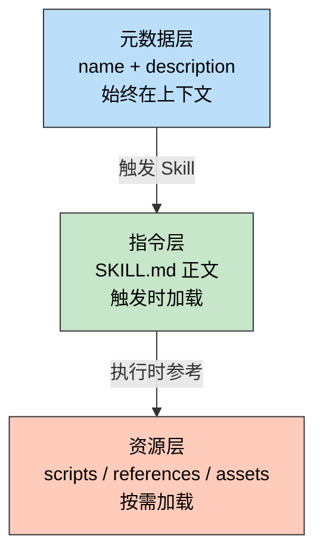

> 一句话定位：Skill 是 Claude Code 的"领域专家模块"——把隐性的工作流知识固化成可复用的显性指令。

> 核心理念：好的 Skill 不靠堆砌信息，而是把正确的内容放在正确的层级，让 AI 按需加载、精准执行。

---

## 3 分钟速览版

<details>
<summary><strong>点击展开核心概念</strong></summary>

### Skill 三层加载模型



### optimize-doc 优化前后对比

| 维度 | v2.0（优化前） | v2.1（优化后） |
|------|--------------|--------------|
| SKILL.md 行数 | 541 行 | 319 行（-41%） |
| 可视化决策逻辑 | 内联在 SKILL.md | 拆到 references/ |
| 格式规则 | 两处重复 | 仅 markdown-rules.md |
| 验证脚本 bug | 代码块检测有歧义 | 状态机修复 |
| 步骤数量 | 10 步（5+6 重复） | 9 步（合并可视化） |

### 多模型分工

| 角色 | 模型 | 职责 |
|------|------|------|
| 提案 | Haiku 4.5 | 快速识别问题，输出初步方案 |
| 审核 | Opus 4.6 | 深度推理，发现遗漏和错误 |
| 执行 | Sonnet 4.6 | 高效编辑，精准落地 |

</details>

---

## 深度剖析版

## 1. Skill 核心概念

### 1.1 什么是 Skill

Skill 是 Claude Code 的模块化能力扩展包。它通过结构化文件（指令 + 脚本 + 参考文档 + 资产模板），为 Claude 注入特定领域的程序化知识，使其能够执行原本需要大量上下文和多轮对话才能完成的复杂任务。

一个 Skill 本质上回答三个问题：

- **何时激活**：通过 `name` + `description` 让 Claude 识别触发时机
- **如何执行**：通过 SKILL.md 提供工作流程和决策规则
- **用什么资源**：通过 `scripts/`、`references/`、`assets/` 提供可复用工具

### 1.2 Skill 与传统工具的区别

传统工具（CLI、API）是**单一操作**的封装：输入参数，返回结果。

Skill 是**完整工作流**的封装，包含决策逻辑、质量标准、错误处理和资源引用：

```text
传统工具：markdownlint file.md  →  返回格式错误列表

Skill：读取文档 → 分析受众 → 设计结构 → 重写内容
       → 选择可视化 → 补充实战 → 验证格式 → 保存输出
```

关键差异在于 Skill 赋予 Claude **判断力**——理解目标、选择策略、评估质量，而非机械执行命令。

## 2. Skill 设计理念

### 2.1 Progressive Disclosure 原则

Skill 采用三层渐进加载，核心是**按需加载，避免上下文污染**：

#### 第一层：元数据（约 100 words，始终存在）

```yaml
---
name: optimize-doc
description: 优化 Markdown 博客文档...
  This skill should be used when a user asks to optimize...
---
```

这层的唯一职责是让 Claude 判断"是否需要激活这个 Skill"。`description` 写得好不好，直接决定触发准确率。

#### 第二层：SKILL.md 正文（触发时加载，建议 < 5000 words）

包含核心工作流程、决策规则、资源索引。不该塞入大段参考材料——那是第三层的职责。

#### 第三层：捆绑资源（按需加载，不限容量）

```text
scripts/      →  可直接运行的脚本，无需读入上下文
references/   →  参考文档，Claude 需要时才读取
assets/       →  模板和素材，直接用于输出
```

**实践案例**：optimize-doc v2.0 把 160 行可视化选择指南写在 SKILL.md 里，每次触发都占用上下文。v2.1 把它移到 `references/visualization-guide.md`，只有执行到"添加可视化"步骤时才加载。

### 2.2 触发描述的编写

触发描述（description）决定 Skill 能否被正确激活。

```yaml
# 好的描述：what + when，双语关键词
description: >
  优化 Markdown 博客文档，按照专业标准改进内容结构、可读性和实用性。
  This skill should be used when a user asks to optimize, improve, or
  rewrite markdown documentation for blog posts or technical articles.

# 差的描述：模糊，缺少触发条件
description: A tool for working with markdown files.
```

有效描述的四要素：

- 使用第三人称（"This skill should be used when..."）
- 中英文关键词并存（提高匹配率）
- 明确触发动词（optimize / improve / rewrite）
- 指定适用范围（blog posts / technical articles）

### 2.3 组织结构最佳实践

内容放置的核心判断依据：**这段内容在 10 次执行中会被用到几次？**

| 使用频率 | 放置位置 |
|---------|---------|
| 10/10 次 | SKILL.md 正文 |
| 3-7/10 次 | SKILL.md 简述 + references/ 详细展开 |
| 1-2/10 次 | 仅 references/，SKILL.md 只写引用指示 |
| 反复执行的代码 | scripts/（确定性执行，节省 token） |
| 输出模板 | assets/（直接复制使用） |

## 3. optimize-doc Skill 设计实践

### 3.1 初始设计思路

optimize-doc 解决的核心问题是：**每次手动优化博客文档，都要重复相同的决策**——选结构、加可视化、验格式、补实战案例。

Skill 把这些隐性知识固化为显性流程：

```text
输入：一篇原始 Markdown 文档
输出：双版本结构 + Mermaid 图表 + 实战案例 + FAQ + 格式验证通过的专业文档
```

### 3.2 YAML Frontmatter 配置

```yaml
---
name: optimize-doc
description: 优化 Markdown 博客文档，按照专业标准改进内容结构、可读性和实用性。
  This skill should be used when a user asks to optimize, improve, or rewrite
  markdown documentation for blog posts, technical articles, or other
  markdown-based content.
arguments:
  - name: file
    description: 要优化的 Markdown 文件路径（绝对路径）
    required: true
  - name: type
    description: 文章类型 (mindset/tech/tools/gaming/anime)
    required: false
  - name: output_path
    description: 输出文件路径（绝对路径，默认：桌面）
    required: false
---
```

只有 `file` 标记为 `required`——其余参数有合理默认值，降低使用门槛。

### 3.3 工作流程设计

v2.1 的工作流包含 9 个步骤，核心逻辑：

```text
分析原文 → 确定路径 → 设计结构 → 重写内容 → 添加可视化
→ 补充实战 → 格式验证 → 保存文档 → 反馈结果
```

每步都有明确的输入、输出和质量标准。例如"添加可视化"步骤：

- 决策依据：`references/visualization-guide.md` 中的决策树
- 硬约束：Mermaid 图 ≤ 3 张，节点数 ≤ 8，超出改用 CDN 图片
- 验证项：PJAX 兼容、链接可访问、颜色与博客风格协调

## 4. Skill 优化方案：多模型协作实录

### 4.1 Haiku 4.5 的初步方案

Haiku 快速扫描 Skill 文件后，提出 5 项建议：

1. 重构 SKILL.md（541 → 200 行）
2. 创建 `references/visualization-guide.md`
3. 完善 `document-template.md`（"只有前 100 行，不完整"）
4. 新增 `scripts/init_output_path.py`
5. 改进 arguments 说明

### 4.2 Opus 4.6 的审核与修正

Opus 逐条审核后发现 5 个问题：

#### 问题 1：未读完就下结论

Haiku 读 `document-template.md` 时设了 `limit=100`，只看开头就判断"不完整"。实际该文件有 586 行，是完整模板。

教训：审查文件前必须完整读取，或先检查总行数。

#### 问题 2：过度工程

建议新增 `init_output_path.py`——但这个逻辑只有 5 行（有指定用指定，没有存桌面），不满足 scripts 收录标准："被反复重写"或"需要确定性执行"。

#### 问题 3：目标行数过激

541 → 200 行意味着砍掉 63%，可能丢失关键程序化知识。合理目标是 ~320 行（移走参考性内容）。

#### 问题 4：遗漏了真正的 bug

`validate_markdown.py` 中代码块检测有歧义：

```python
# 旧代码（有 bug）
def is_code_block_start(self, line):
    # \w* 允许零字符，导致结束标记 ``` 也被匹配为"开始"
    return re.match(r'^```\w*\s*$', line) is not None

def is_code_block_end(self, line):
    return re.match(r'^```\s*$', line) is not None
```

```python
# 修复后：用状态机区分开始/结束
def is_code_fence(self, line):
    return re.match(r'^```', line) is not None

def check_code_blocks(self):
    in_code_block = False
    for i, line in enumerate(self.lines):
        if not self.is_code_fence(line):
            continue
        if not in_code_block:
            in_code_block = True   # 开始
        else:
            in_code_block = False  # 结束
```

#### 问题 5：内容重复

SKILL.md 和 `references/markdown-rules.md` 都列出了 MD022/MD032/MD036 的说明，违反 single source of truth 原则。

### 4.3 Sonnet 4.6 的执行结果

按优先级执行所有修改：

- **P0**：创建 `references/visualization-guide.md`，移入约 160 行可视化逻辑
- **P1**：精简步骤 2（删除伪代码）、合并步骤 5+6、删除重复格式规则、删除 emoji 堆砌的示例输出
- **P2**：用状态机修复 `validate_markdown.py` 的代码块检测 bug

最终结果：

| 指标 | 变化 |
|------|------|
| SKILL.md 行数 | 541 → 319（-41%） |
| references 文件数 | 1 → 2 |
| 重复内容处 | 3 → 0 |
| 脚本 bug | 1 → 0 |

### 4.4 一个意外插曲：cc-switch 导致文件丢失

本次优化过程中发现了一个值得注意的问题：**cc-switch 的 symlink 管理机制在会话切换后会覆盖文件**。

具体表现：Sonnet 创建了 `visualization-guide.md` 并编辑了 SKILL.md，但在切换模型（Haiku → Opus → Sonnet）之后，这些文件的修改时间恢复到了原始版本（2月9日）。

排查过程：

```bash
# 检查两个路径的文件状态
ls -lah ~/.claude/skills/optimize-doc/references/
ls -lah ~/.cc-switch/skills/optimize-doc/references/

# 结果：visualization-guide.md 不存在，SKILL.md 时间戳回退
```

解决方案：手动重新写入所有丢失的修改，并验证两个路径的同步状态。

防范建议：在使用 cc-switch 切换模型前，确保关键文件已写入磁盘并验证时间戳。

### 4.5 案例：资源文件未加载导致格式错误（auto-post v1.2.0）

这是一个典型的 Agent 可靠性问题——Skill 的 references/ 中有正确的规范，但 Agent 执行时跳过了加载，导致输出不符合规范。

#### 问题现象

使用 `/auto-post` 生成文章后，更新记录使用了列表格式：

```markdown
## 更新记录

- 2025-05-22：初始版本
```

但 `references/format-rules.md` 明确要求表格 + 版本号格式：

```markdown
## 更新记录

| 版本 | 日期 | 说明 |
|------|------|------|
| v1.0 | 2025-05-22 | 初始版本 |
```

#### 根因分析：三处缺陷的叠加

| # | 缺陷位置 | 具体问题 | 严重度 |
|---|---------|---------|-------|
| 1 | SKILL.md 自检清单 | 写的是旧列表格式 `- YYYY-MM-DD：初始版本`，与 format-rules.md **直接矛盾** | 根因 |
| 2 | 参考资源 section 标题 | 标题为"按需加载"，暗示所有资源可跳过，削弱了 format-rules.md 的强制性 | 助因 |
| 3 | Step 4 无硬前置 | 仅写"对照 format-rules.md 自检"，未要求必须先 Read 该文件 | 助因 |

Agent 执行时的决策链：看到标题"按需加载" → 判断 format-rules.md 不是必需的 → 依赖 SKILL.md 内的自检清单 → 清单写的是列表格式 → 输出列表格式。

**根因不是 Agent 没读文件，而是 SKILL.md 自检清单本身就写错了。** 即使 Agent 读了 format-rules.md，面对两处矛盾的指令也可能随机选择其一。

#### 修复方案

三处同时修复，消除矛盾源：

```text
修复 1：自检清单 — 删除内联的错误格式描述，改为引用 format-rules.md
  旧：- [ ] 更新记录存在，格式为 `- YYYY-MM-DD：初始版本`
  新：- [ ] 更新记录使用表格格式，含版本号（参见 format-rules.md §更新记录规范）

修复 2：参考资源 — 去掉"按需加载"标题，改为表格明确区分必须/按需
  format-rules.md 标注为：是，禁止跳过

修复 3：Step 3 并行加载 — format-rules.md 与模板文件同时 Read，Step 4 设兜底检查
```

#### Agent 可靠性原则

这个案例验证了 Google/Kaggle Agent 白皮书中的两条核心原则：

**1. Single Source of Truth**：同一规则不要在两处维护不同描述。SKILL.md 的自检清单和 format-rules.md 对更新记录格式的描述矛盾了，Agent 无法判断哪个是权威的。修复方式是清单只引用，不内联。

**2. Reproducibility**：Agent 的错误必须能够复现和防止。仅靠"提醒 Agent 下次记得读文件"是不可靠的——每次会话是独立的，Agent 没有跨会话记忆。必须在 Skill 结构层面消除错误的可能性：将强制加载写入工作流步骤，而非依赖 Agent 的自主判断。

## 5. 实施建议

### 5.1 Skill 创建检查清单

#### 元数据层

- [ ] `name` 简洁可搜索
- [ ] `description` 包含 what + when，中英文并存
- [ ] `description` 使用第三人称
- [ ] 只有真正必需的参数标记为 `required`

#### SKILL.md 层

- [ ] 正文 < 5000 words
- [ ] 工作流步骤无重叠
- [ ] 复杂参考内容已拆到 references/
- [ ] 每段信息只出现在一处（single source of truth）

#### 资源层

- [ ] scripts/：仅反复使用或需确定性执行的代码
- [ ] references/：SKILL.md 中有明确引用指示
- [ ] assets/：模板完整可用，无需读入上下文理解

### 5.2 常见问题与解决方案

#### Q1：SKILL.md 写多长合适？

没有固定答案。核心判断：每段内容在 10 次执行中被用到几次？

- 必须每次参考 → 放 SKILL.md
- 偶尔查阅 → 放 references/，SKILL.md 只写引用

经验区间：300-500 行。

#### Q2：scripts 和 SKILL.md 中的代码示例有什么区别？

SKILL.md 中的代码是**说明性**的（帮助 Claude 理解逻辑）。

scripts/ 中的代码是**执行性**的（直接运行产生结果）。

简单逻辑（< 10 行）用 SKILL.md 说明即可；需要实际运行的，放 scripts/。

#### Q3：如何验证 Skill 优化后没有"过度精简"？

用优化后的 Skill 执行一次完整任务，观察 Claude 是否需要"猜测"SKILL.md 中未提及的规则。如果需要，说明精简过度。

#### Q4：多模型协作适合什么场景？

| 任务 | 推荐模型 |
|------|---------|
| 方案评审、架构决策 | Opus |
| 文件编辑、执行明确任务 | Sonnet |
| 快速探索、初步方案 | Haiku |

Skill 的开发周期本身就是很好的例子：Haiku 快速提案、Opus 深度审核、Sonnet 精准落地。

#### Q5：文件被 cc-switch 覆盖怎么办？

在切换模型前运行检查：

```bash
# 检查关键文件的修改时间
ls -lah ~/.claude/skills/your-skill/

# 对比两个路径的文件状态
diff <(ls -lah ~/.claude/skills/your-skill/) \
     <(ls -lah ~/.cc-switch/skills/your-skill/)
```

如果发现时间戳回退，重新写入丢失的内容。长期方案：将 skills 目录纳入 git 版本管理。

### 5.3 后续迭代方向

基于本次经验，optimize-doc v2.2 可考虑：

1. **修复验证脚本的 false positive**：当前 `check_headings`、`check_lists`、`check_horizontal_rules` 不跳过代码块内容，导致约 30 个误报
2. **修正步骤编号**：合并步骤 5+6 后，编号出现 5→7 的间隙
3. **CDN 路径参数化**：`leahana/blog-images` 硬编码在多个文件中，应提取为配置项
4. **按文章类型精简流程**：gaming/anime 类型不需要故障排查和代码示例章节

---

## 更新记录

| 版本 | 日期 | 说明 |
|------|------|------|
| v1.0 | 2026-03-05 | 初始版本，基于 optimize-doc v2.0→v2.1 优化过程 |
| v1.1 | 2026-03-06 | 新增 4.5 节：auto-post 资源文件未加载导致格式错误案例 |
