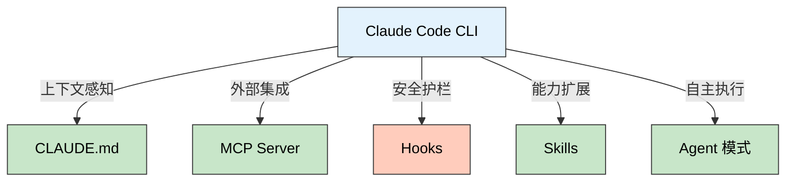
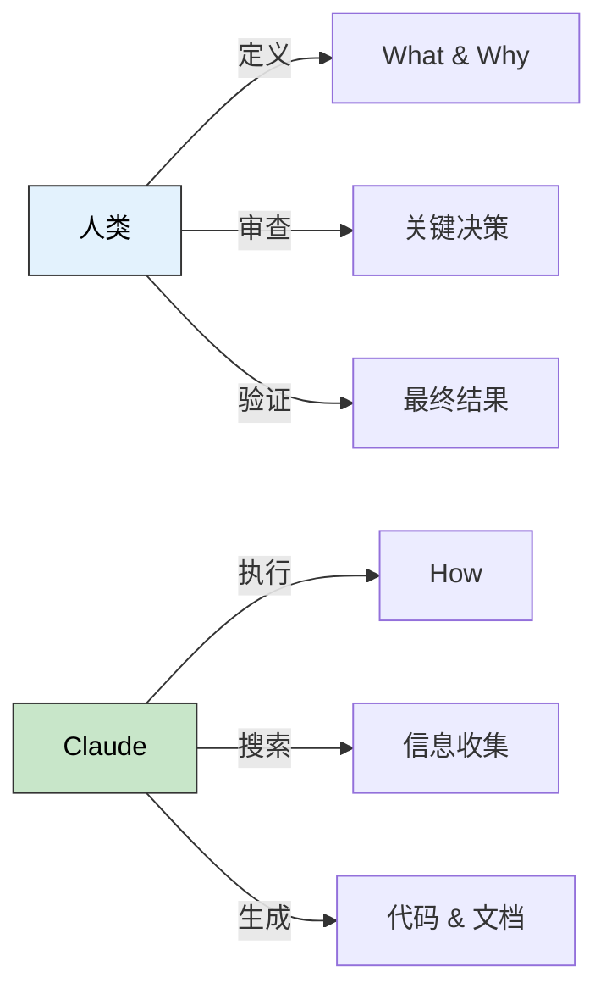

> 🎯 **一句话定位**：Vibecoding 不是"让 AI 写代码"，而是用自然语言驱动的方式，与 AI 协作完成从构思到交付的完整编程工作流。
>
> 💡 **核心理念**：好的 vibecoding 不在于 prompt 写得多巧妙，而在于你为 AI 构建了多好的工作上下文——CLAUDE.md 是地基，MCP 是桥梁，hooks 是护栏。

---

## 📋 问题背景

### 什么是 Vibecoding

2025 年初，Andrej Karpathy 提出了 vibecoding 这个概念：不再逐行敲代码，而是用自然语言描述意图，让 AI 生成代码，开发者负责审查、引导和验证。这不是偷懒，而是一种新的人机分工——人类负责 "what" 和 "why"，AI 负责 "how"。

Claude Code CLI 是 Anthropic 官方推出的命令行 AI 编程工具，直接运行在终端中，没有 IDE 插件的限制，能深度接触项目文件系统、Git 历史和 shell 环境。它天然适合 vibecoding 工作流。

### 痛点分析

- **上下文断裂**：IDE 内置的 AI 助手每次对话都从零开始，不了解你的项目规范和偏好
- **工具割裂**：写代码用 Copilot，搜索用 Google，运行命令用终端，上下文在多个工具间碎片化
- **审查负担**：AI 生成大量代码后，逐行审查的成本有时比自己写还高

### 目标

建立一套可复用的 vibecoding 工作流：让 Claude Code 理解项目上下文，自动遵守规范，在需要时调用外部工具，同时保持人类对关键决策的控制权。

---

## 🔍 Claude Code 核心能力速览

### 不是聊天机器人，是终端里的工程搭档

Claude Code 和 ChatGPT 类产品的本质区别在于：它有 **行动能力**。它可以读写文件、执行命令、搜索代码、操作 Git——不是给你建议，而是直接做事。

一个典型的工作流对比：

| 传统方式 | Vibecoding 方式 |
|---------|----------------|
| 打开文件，定位函数，手动修改 | "把 getUserList 的返回类型从 any 改成 User[]" |
| 打开浏览器查文档，复制配置 | "帮我配置 ESLint flat config，启用 TypeScript 规则" |
| 手动写测试，运行，调试 | "给 parseConfig 函数写单元测试，覆盖边界情况" |
| git log + git diff 分析变更 | "总结这个分支相对 main 的所有改动，写一个 PR 描述" |

### 核心功能矩阵



---

## 💡 四大支柱：构建你的 Vibecoding 基础设施

### 支柱一：CLAUDE.md — 项目的"大脑"

CLAUDE.md 是 Claude Code 每次启动时自动加载的项目说明书。它告诉 AI：这个项目是什么、用什么技术栈、有什么规范、常用命令是什么。

**为什么重要**：没有 CLAUDE.md，每次对话你都要重复解释"这是一个 Hexo 博客""用 pnpm 不用 npm""提交前要跑安全检查"。有了它，Claude 从第一句话就理解你的上下文。

**实际示例**——本博客项目的 CLAUDE.md 关键片段：

```markdown
## Common Commands
- `pnpm dev` - Start local development server
- `pnpm build` - Generate static site
- `pnpm check:secrets` - Check for sensitive information

## Content Management
### File Naming Convention
- Format: `YYYY-MM-DD-{kebab-title}.md`
- Date represents initial publication date, NEVER change after creation

### Update Records
When modifying content, NEVER rename the file. Add an entry to "更新记录".
```

**写好 CLAUDE.md 的要点**：

- **命令清单**：把 dev、build、test、lint 等常用命令列出来，Claude 就不会猜错包管理器
- **规范约束**：文件命名、代码风格、Git 提交规范——写一次，终身受益
- **架构概览**：目录结构、关键配置文件位置，帮助 Claude 快速定位代码
- **不要做什么**：明确的禁止项（如"不要用 hexo deploy""不要修改文件名中的日期"）比正面描述更有效

### 支柱二：MCP Server — 连接外部世界

MCP（Model Context Protocol）让 Claude Code 能调用外部服务。比如：

- **GitHub MCP**：直接创建 PR、查看 issue、搜索代码，不用切到浏览器
- **Context7 MCP**：查询最新的库文档，不再依赖训练数据中可能过时的版本
- **Web Search MCP**：搜索互联网获取最新信息

配置方式很简单，在项目根目录创建 `.mcp.json`：

```json
{
  "mcpServers": {
    "github": {
      "command": "npx",
      "args": ["-y", "@modelcontextprotocol/server-github"],
      "env": { "GITHUB_PERSONAL_ACCESS_TOKEN": "${GITHUB_TOKEN}" }
    },
    "context7": {
      "command": "npx",
      "args": ["-y", "@upstash/context7-mcp"]
    }
  }
}
```

**实际收益**：当我说"帮我查一下 Hexo 8.x 的 tag 插件语法有没有变化"，Claude 通过 Context7 MCP 直接拉取最新文档，而不是凭记忆回答一个可能过时的答案。

### 支柱三：Hooks — 自动化护栏

Hooks 是 Claude Code 在特定事件触发时自动执行的脚本，类似 Git hooks。它们在 `~/.claude/settings.json` 或项目 `.claude/settings.json` 中配置。

常见用途：

- **PreToolUse**：在 Claude 执行工具前检查，比如阻止修改特定文件
- **PostToolUse**：工具执行后自动触发，比如保存文件后自动运行 linter
- **Notification**：任务完成时发送通知

```json
{
  "hooks": {
    "PostToolUse": [
      {
        "matcher": "Write|Edit",
        "command": "echo 'File modified: check formatting'"
      }
    ]
  }
}
```

**与 Git Hooks 的关系**：Git hooks 守护代码仓库（commit 前扫密钥），Claude Code hooks 守护 AI 行为（修改文件后验证格式）。两者互补，不冲突。

### 支柱四：Skills — 可复用的专家模块

Skills 是预定义的任务模板，封装了特定领域的知识和工作流。用 `/skill-name` 调用，Claude 就变成该领域的专家。

本博客项目使用的 Skills：

| Skill | 用途 | 触发方式 |
|-------|------|---------|
| `auto-post` | 从主题到完整文章的全流程生成 | `/auto-post <topic>` |
| `optimize-doc` | 按专业标准优化文档结构和可读性 | `/optimize-doc <path>` |
| `security-review` | AI 驱动的安全审查 | `/security-review` |

**Skill vs 直接 prompt 的区别**：直接 prompt 每次都要重新描述需求；Skill 把工作流固化下来，包括参考资源的加载顺序、输出格式的约束、质量检查的清单。一个好的 Skill 相当于一本"操作手册 + 检查清单"。

---

## 🚧 Vibecoding 实战场景

### 场景一：从零创建功能

```text
> 给博客添加一个 pre-push hook，在推送前检查所有文章中的图片 URL 是否返回 200

Claude 的工作流：
1. 读取现有 .githooks/ 目录，理解 hook 结构
2. 编写 check-images.sh 脚本
3. 更新 pre-push hook 集成新检查
4. 在 package.json 添加对应 npm script
5. 执行测试验证
```

我不需要告诉 Claude 用什么语言写、放在哪个目录、怎么集成——CLAUDE.md 已经提供了这些上下文。

### 场景二：调试和修复

```text
> pnpm build 报错：FATAL ERROR: RangeError - Invalid count value
> 帮我查一下是什么问题

Claude 的工作流：
1. 运行 pnpm build 复现错误
2. 分析错误堆栈
3. Grep 搜索相关源文件
4. 定位问题根因
5. 提出修复方案并实施
```

关键在于 Claude 能直接执行命令复现问题，而不是让你复制粘贴错误日志。

### 场景三：代码审查与重构

```text
> 审查 scripts/ 目录下所有 shell 脚本的安全性，特别关注命令注入风险
```

Claude 会逐文件读取、分析，给出具体的行号和修复建议。这比手动审查高效得多，尤其是对 shell 脚本这种容易出安全问题的代码。

---

## ⚡ Vibecoding 最佳实践

### 人机分工原则



- **人类擅长**：定义需求、判断优先级、审查架构决策、验证业务逻辑
- **AI 擅长**：搜索代码、生成样板、执行重复性任务、遵守格式规范

### 沟通技巧

**1. 给上下文，不给步骤**

```text
# 不够好
"打开 _config.yml，找到 theme 字段，改成 kratos-rebirth"

# 更好
"把博客主题切换到 kratos-rebirth"
```

Claude 知道 Hexo 的配置文件在哪里，不需要你手把手指导。过度指定步骤反而限制了 AI 选择最优路径的能力。

**2. 分批交付，而非一次性大需求**

```text
# 不够好
"重构整个项目的构建系统，迁移到 Vite，添加单元测试，配置 CI/CD"

# 更好
"先把构建系统从 webpack 迁移到 Vite"
→ 验证通过
"接下来给核心模块添加单元测试"
→ 验证通过
"最后更新 CI/CD 配置"
```

**3. 善用 CLAUDE.md 积累项目知识**

每次 Claude 做了一个好的决策，考虑把那个知识点加入 CLAUDE.md。比如：

- "部署不用 hexo deploy，用 GitHub Actions" → 写入 CLAUDE.md
- "source 目录下的 CNAME 不要删" → 写入 CLAUDE.md
- "图片统一托管在 blog-images 仓库" → 写入 CLAUDE.md

这样知识会随着项目持续积累，而不是每次对话都从头来。

### 常见坑点

1. **Context 溢出**
   - **现象**：长对话后 Claude 开始忘记早期指令，行为不一致
   - **原因**：上下文窗口有限，早期消息被压缩
   - **解决**：关键约束放在 CLAUDE.md（始终加载），而非对话中口头说明；长任务拆分为多次对话

2. **过度信任 AI 输出**
   - **现象**：Claude 生成的代码看起来合理，但有隐蔽的逻辑错误
   - **原因**：AI 擅长模式匹配，但不真正"理解"业务逻辑
   - **解决**：核心业务逻辑必须人工审查；让 Claude 写测试来验证自己的代码

3. **权限过度放开**
   - **现象**：Claude 执行了不该执行的操作（如 force push）
   - **原因**：默认权限模式过于宽松
   - **解决**：使用 hooks 限制危险操作；关键命令保持手动确认模式

---

> 版本更新日志持续追踪：

## ✨ 总结

### 核心要点

1. **CLAUDE.md 是基础**：投入 30 分钟写好项目说明书，后续每次对话都节省时间
2. **工作流 > 单次 prompt**：vibecoding 的价值不在于某个 prompt 写得好，而在于 CLAUDE.md + MCP + Hooks + Skills 构成的完整基础设施
3. **人机各司其职**：人类负责 "what" 和 "why" 的决策，AI 负责 "how" 的执行——这是效率最高的协作模式

### 适用场景

- 个人项目和小团队：CLAUDE.md 就是你的"团队规范文档"，Claude 是你的"新同事"
- 博客和内容管理：Skills 封装写作规范，批量生产高质量内容
- 运维和脚本编写：Claude 对 shell 脚本、配置文件的理解很强，适合自动化任务
- 代码审查：安全扫描、风格检查、重构建议——AI 不会累

### 注意事项

Vibecoding 不意味着放弃编程能力。你仍然需要能读懂代码、判断方案优劣、发现 AI 的错误。把 AI 当作一个高效但需要监督的同事，而不是一个不会犯错的神谕。最好的 vibecoding 工程师，是既懂编程又懂如何与 AI 协作的人。

---

## 更新记录

| 版本 | 日期 | 说明 |
|------|------|------|
| v1.0 | 2026-03-13 | 初始版本 |
| v1.1 | 2026-04-09 | 追加 Claude Code 近期增量更新，补充 2.1.89 到 2.1.97 的变化 |
| v1.2 | 2026-04-13 | 将增量更新段迁移至独立 tracking 文章，原文加引用链接 |
