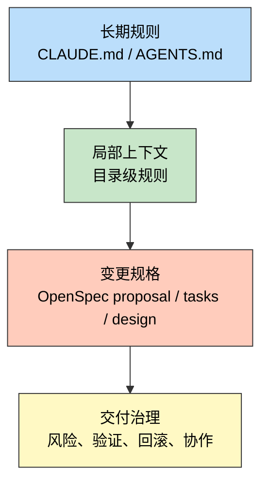
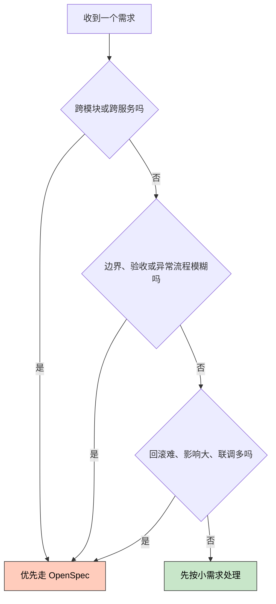
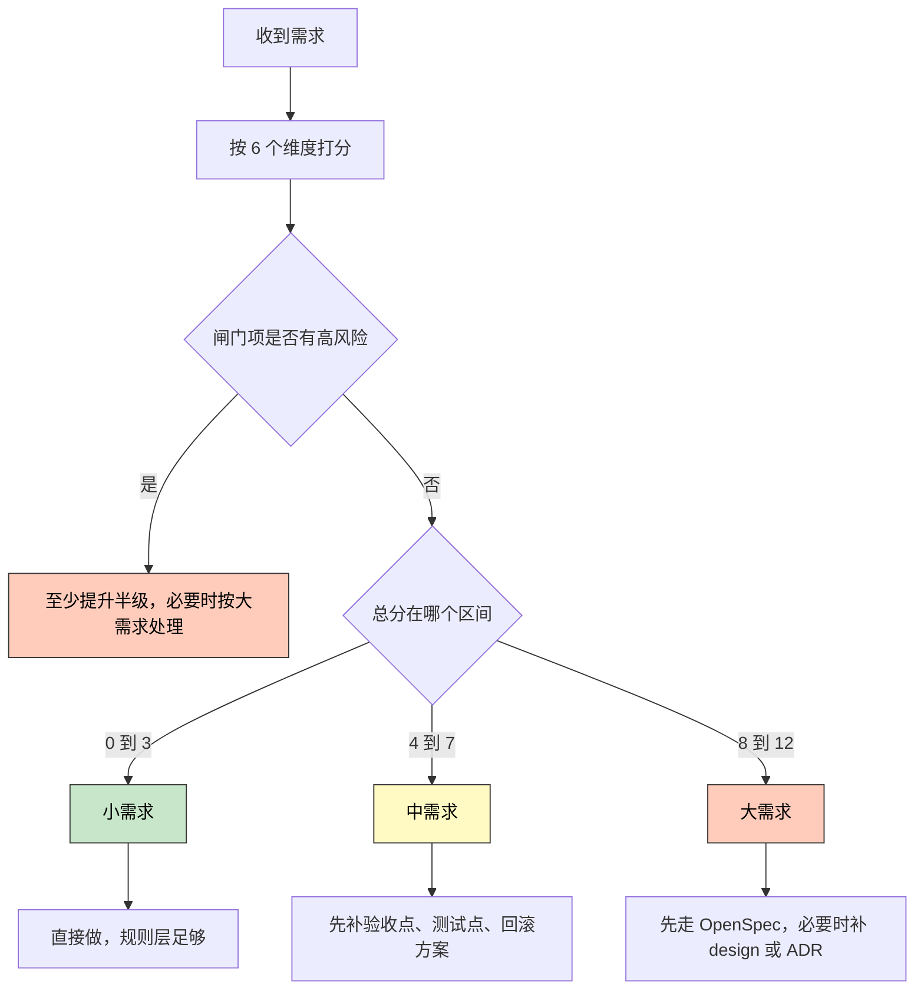

> 一句话定位：这是一篇把 OpenSpec、规则分层、项目管理经验和交付风险治理串成一套实战方法的文章。

> 核心理念：复杂需求真正难的不是写代码，而是先把意图、边界、风险、验证和协作方式定义清楚。

---

## 3 分钟速览版

<details>
<summary><strong>点击展开核心概念</strong></summary>

### OpenSpec 在整个体系里的位置



最容易混淆的一点是：`CLAUDE.md` 或 `AGENTS.md`
解决的是“长期应该怎么做”，而 OpenSpec
解决的是“这次具体要改什么、为什么改、怎么验收、做完后如何沉淀”。

### 一张表看懂三种层级

| 层级 | 典型载体 | 负责什么 | 适合什么 | 不适合什么 |
|------|----------|----------|----------|------------|
| 长期规则层 | `CLAUDE.md`、`AGENTS.md` | 团队约定、命名规范、测试门槛、常用命令 | 稳定不常变的规则 | 一次性需求和临时验收标准 |
| 局部上下文层 | 子目录规则文件 | 某个模块的边界、目录职责、局部禁忌 | 容易被 AI 改错的复杂子树 | 记录跨模块变更方案 |
| 变更规格层 | `openspec/changes/*` | Proposal、design、tasks、归档 | 中大需求、跨模块需求、高风险需求 | 简单修字、局部小修 |

### 什么时候该上 OpenSpec



一句话判断法：如果你已经需要同时思考“改哪几层、边界是什么、怎么验证、失败怎么办”，那它大概率已经不是小需求了。

### 需求复杂度模型

| 维度 | 你真正要问的问题 |
|------|------------------|
| 影响范围 | 牵动多少模块、接口、用户和数据域 |
| 需求清晰度 | 验收标准和异常流程是否足够明确 |
| 业务风险 | 出错后影响是体验问题还是核心业务问题 |
| 系统耦合 | 是否涉及共享状态、契约、迁移和上下游 |
| 验证成本 | 要不要联调、回归、灰度和数据核对 |
| 协作成本 | 需要多少角色和团队一起对齐 |

再加 3 个闸门项：可回滚性、可观测性、技术成熟度。它们不一定计分，但足以把一个中需求升级为大需求。

</details>

---

## 1. 为什么很多团队明明有 rules，AI 还是越写越飘

过去一年里，大家已经逐渐从“模型越强越好”转向“上下文管理才是真瓶颈”。

这并不是一句口号，而是很多团队在实践里反复踩出来的结论：

- 模型能写代码，不代表它总能理解这次改动的真实意图。
- 需求、边界和例外只存在聊天记录里时，AI 很容易在长会话里发生上下文漂移。
- 当团队把所有问题都塞进一份越来越长的 `CLAUDE.md` 或
  `AGENTS.md` 时，长期规则和一次性需求会互相污染。

得物技术那篇《Claude Code + OpenSpec 正在加速 AICoding
落地：从模型博弈到工程化的范式转移》把这个问题讲得很清楚：AI
编码的真正瓶颈不是模型本身，而是上下文管理和开发意图表达。

这个判断和 OpenSpec 官方的设计目标是一致的。OpenSpec 的核心不是“再加一份更详细的 rules”，而是把一次变更从聊天里提出来，落成结构化的
proposal、tasks、spec delta 和 archive。这样做的好处不是形式感，而是让团队先对齐，再编码，再归档。

换句话说：

- rules 解决的是“平时怎么做”
- OpenSpec 解决的是“这次要做什么”

如果把这两件事混在一起，结果通常会是：

- 规则文件越来越长，但真正关键的变更信息仍然散落在聊天里。
- 团队以为已经“沉淀经验”，实际上沉淀的是大量只适用于某一次需求的噪音。
- AI 读取上下文时，长期约束和短期任务优先级混乱，输出会越来越不稳定。

---

## 2. 把 OpenSpec 放到正确位置：它不是替代 rules，而是补上“变更管理层”

我更推荐把整个 AI 编码体系理解成四层：

| 层级 | 目标 | 典型文件 | 生命周期 |
|------|------|----------|----------|
| 全局或组织规则 | 统一长期原则 | 全局 `CLAUDE.md`、全局 `AGENTS.md` | 长期稳定 |
| 项目规则 | 统一项目约束 | 根目录 `CLAUDE.md`、根目录 `AGENTS.md` | 长期稳定 |
| 模块上下文 | 限定局部边界 | 子目录规则文件 | 中长期稳定 |
| 变更规格 | 定义一次改动 | `openspec/changes/*` | 随变更流转 |

这个分层和 Claude Code、OpenCode 的官方机制其实是吻合的。

Claude Code 的官方文档明确把 `./CLAUDE.md` 和
`./.claude/CLAUDE.md` 视为项目记忆，并支持目录递归查找和 `@path`
导入。这意味着它天然适合承载“团队共享的长期规则”和“分层上下文”。

OpenCode 的官方文档则把 `AGENTS.md` 定义为项目规则入口，并支持：

- 根目录 `AGENTS.md`
- 全局 `~/.config/opencode/AGENTS.md`
- `opencode.json` 的 `instructions` 字段
- 对 Claude Code 规则文件的兼容回退

所以如果你同时使用 Claude Code 和 OpenCode，最稳的做法不是维护两套完全不同的内容，而是：

1. 把真正的规则内容拆到共享文档里。
2. 让 `CLAUDE.md` 和 `AGENTS.md` 只做入口和装配层。
3. 把一次性变更需求从规则层剥离，交给 OpenSpec。

这个思路也解释了为什么 OpenSpec 和 `deepinit` 或目录级
`agent.md` 不是替代关系。

它们分别解决不同问题：

- 目录级规则：这个目录应该怎么改，哪些边界不能碰。
- OpenSpec：这次变更为什么做、具体改什么、验收标准是什么。

如果你习惯了 `deepinit`
或“每个复杂目录放一份规则文件”的工作流，那么最自然的接法就是：

- 长期共识进根规则
- 模块边界进子目录规则
- 跨模块需求进 OpenSpec

---

## 3. 项目管理真正补上的，不是流程感，而是复杂度与风险的分离

很多工程团队谈需求大小时，实际在混用三种完全不同的概念：

- 工作量有多大
- 事情有多复杂
- 出错后代价有多高

如果这三件事不拆开，评估就会越来越玄学。

Atlassian
在估算相关文档里就把 story points
解释成复杂度、工作量和风险或不确定性的综合表达。换句话说，成熟团队从来不只看“要写多少代码”。

PMI 对复杂度的定义也很有启发。它把复杂度拆成三大类：

| PMI 视角 | 含义 | 对应到研发现场 |
|----------|------|----------------|
| Human Behavior | 人和群体之间的行为互动 | 干系人多、意见不一致、协作链长 |
| System Behavior | 系统之间的联动和依赖 | 上下游多、契约多、状态流复杂 |
| Ambiguity | 对现状和未来缺乏清晰理解 | 需求不明确、例外流程不明确、方案不收敛 |

这三类复杂度，几乎可以完整映射到 AI 编码时代最常见的翻车来源：

- 需求没有说清楚，AI 只能猜。
- 上下游耦合没讲清楚，AI 只改了局部。
- 需要多人确认，但团队误以为“让 agent 一把梭”就够了。

项目管理视角的价值在这里非常明显：它提醒我们，复杂度不是纯技术问题，很多时候是“人、系统、歧义”叠加起来的结果。

---

## 4. 交付风险为什么要单独评估：SRE、DORA 和测试实践给出的补充

只看复杂度还不够，因为有些需求并不复杂，但仍然非常危险。

Google SRE 的发布实践和错误预算思想，给了一个很关键的提醒：变更本身就是不稳定的主要来源。SRE 特别强调几个关键词：

- blast radius，也就是影响半径
- canary，也就是逐步暴露真实流量
- rollback，也就是能不能快速回退
- observability，也就是出问题后能不能及时发现

DORA 的新五项指标也把这个问题说得更明确。它现在不只看吞吐，也专门看不稳定性，尤其是：

- `change fail rate`
- `deployment rework rate`

这两个指标的含义很直接：一次改动上线后，到底有多大概率变成回滚、热修或者额外返工。

这对需求评估的启发非常实用：

- 复杂度回答的是“这事难不难做”
- 风险回答的是“这事出错会不会出大事”
- 交付负担回答的是“为了把它安全交出去，我们还要额外付出多少验证和协调成本”

测试领域的 risk-based testing
也长期在用类似原则：优先把测试资源投向高业务影响和高失败概率的区域，而不是平均用力。

所以一套真正能落地的需求评估模型，至少要同时覆盖三件事：

1. 复杂度
2. 风险
3. 交付负担

---

## 5. 一套可落地的需求复杂度评估模型

我建议把模型拆成两部分：

- 6 个核心打分维度
- 3 个闸门项

前者帮助你形成统一语言，后者帮助你避免低估风险。

### 5.1 六个核心维度

每个维度按 `0-2` 分打分。

| 维度 | 0 分 | 1 分 | 2 分 |
|------|------|------|------|
| 影响范围 | 只改一个局部点位 | 一个模块内多点修改 | 跨模块、跨服务、跨端或跨数据域 |
| 需求清晰度 | 验收标准明确 | 仍需补边界或异常流程 | 目标、边界、验收都还模糊 |
| 业务风险 | 出错影响小 | 影响某条业务路径 | 涉及核心链路、权限、金额、数据正确性 |
| 系统耦合 | 基本独立 | 有明显上下游依赖 | 牵涉契约、状态、迁移、缓存或异步链路 |
| 验证成本 | 本地很容易验证 | 需要多场景或联调验证 | 需要灰度、回归、数据核对或线上观测 |
| 协作成本 | 一个人可以闭环 | 需要和 1 到 2 个角色确认 | 需要跨团队协作、审批或发布窗口协调 |

### 5.2 三个闸门项

这三个项可以不计入总分，但任意一个为高，都应提高警惕。

| 闸门项 | 要问的问题 | 为什么重要 |
|--------|------------|------------|
| 可回滚性 | 如果失败，能否在低成本下快速回退 | 不可逆变更会显著放大上线风险 |
| 可观测性 | 上线后能否快速知道问题是否出现 | 没有观测闭环，验证其实并未完成 |
| 技术成熟度 | 是否引入新技术、新模式或低成熟组件 | 低成熟度会放大不确定性和试错成本 |

### 5.3 如何判级



具体建议如下：

- `0-3 分`：小需求，直接做
- `4-7 分`：中需求，先补验收、测试和回滚，再做
- `8-12 分`：大需求，默认先写 OpenSpec proposal，再实现

再加几条硬规则：

- 涉及支付、权限、合规、主数据迁移的需求，默认不低于中需求。
- “跨团队协作 + 难回滚”同时出现时，默认按大需求处理。
- 线上验证必须依赖真实流量且缺少观测手段时，按高风险处理。

---

## 6. 这套模型如何和 OpenSpec 联动

最实用的做法不是“所有需求都上 OpenSpec”，而是让评估模型决定
workflow。

### 6.1 推荐映射关系

| 需求等级 | 推荐做法 | OpenSpec 建议 |
|----------|----------|---------------|
| 小需求 | 直接实现 | 不强制使用 |
| 中需求 | 先补验收和测试点 | 简版 proposal 或 checklist |
| 大需求 | 先对齐再编码 | `proposal + tasks` 起步，必要时加 `design` |

### 6.2 一个非常实用的触发规则

只要命中下面任意一条，就建议走 OpenSpec：

- 跨两个以上模块
- 需要明确异常流程
- 涉及接口契约、数据库或状态机变化
- 无法快速回滚
- 需要多人协作对齐

这也是为什么 OpenSpec 特别适合 brownfield 场景。它把：

- `openspec/specs/` 当作当前真相
- `openspec/changes/` 当作未来变化

这样做的价值是，团队讨论的不是抽象愿景，而是“当前是什么”和“将来要变成什么”之间的明确差异。

---

## 7. OpenCode 与 Claude Code 两种落地版本

如果你的团队同时使用 OpenCode 和 Claude Code，建议把“规则内容”做成一份，把“入口文件”做成两份。

### 7.1 Claude Code 版本

适合承载：

- 项目共享约束
- 常用命令
- 架构原则
- 何时必须走 OpenSpec

一个更稳的 `CLAUDE.md` 片段可以像这样：

```md
See @README for project overview and @package.json for common commands.

# Change Workflow
- Small changes can be implemented directly.
- Medium changes must list acceptance criteria, test points, and rollback notes before coding.
- Large changes must start with OpenSpec.
- Any cross-module API change, data migration, permission change, or hard-to-roll-back change must use OpenSpec.

# Project Rules
- Prefer minimal diffs.
- Keep public contracts backward compatible unless explicitly approved.
- Update tests and docs when behavior changes.
```

这段内容的重点不是“告诉 AI 这次具体要做什么”，而是把
workflow 判断逻辑固化进去。

### 7.2 OpenCode 版本

OpenCode 里更推荐：

- 根目录 `AGENTS.md` 放总规则
- `opencode.json` 做外部规则拼装
- 复杂子树按需补局部 `AGENTS.md`

一个更稳的组合可以像这样：

```md
# Project Workflow

- Small changes can be implemented directly.
- Medium changes require explicit acceptance criteria, test notes, and rollback notes.
- Large or risky changes must use OpenSpec before implementation.
- Treat any cross-module, data-affecting, or permission-related change as at least medium.
```

```json
{
  "$schema": "https://opencode.ai/config.json",
  "instructions": [
    "docs/development-standards.md",
    "docs/testing-guidelines.md",
    "packages/*/AGENTS.md"
  ]
}
```

它的好处是：

- 根规则保持短小
- 细则可拆分到共享文档
- OpenCode 和 Claude Code 可以复用同一套知识源

---

## 8. 一个完整案例：如何给“加筛选条件”这类需求定级

OpenSpec 官方文档里用过一个很典型的例子：给 profile search 增加按 role 和
team
的筛选条件。这个例子很适合作为需求评估练习，因为它看起来不大，但已经带有典型的中需求特征。

### 8.1 背景

需求描述：

- 在成员目录中增加“按角色筛选”和“按团队筛选”
- 前端需要更新筛选 UI
- 后端需要支持新的查询参数
- 需要补验收标准，说明多筛选条件组合时的行为

### 8.2 评分

| 维度 | 评分 | 理由 |
|------|------|------|
| 影响范围 | 1 | 同时影响前后端，但还在同一条业务链路内 |
| 需求清晰度 | 1 | 基本目标明确，但组合筛选和空值行为需要补充 |
| 业务风险 | 1 | 搜索体验受影响，但不是支付级风险 |
| 系统耦合 | 2 | 牵涉接口契约和查询逻辑 |
| 验证成本 | 1 | 需要联调和多场景验证 |
| 协作成本 | 1 | 需要产品、前端、后端至少简单对齐 |

总分为 `7`，已经落在中需求上沿。

### 8.3 推荐处理方式

- 先写 OpenSpec proposal
- 在 proposal 里补 acceptance criteria
- 生成 tasks 之后再进入实现
- 如果只是简单加筛选参数，不一定需要单独 design
- 如果涉及搜索架构、权限过滤或缓存策略调整，则补 design 或 ADR

### 8.4 一个可直接复用的评估卡

```yaml
request: "为成员目录增加角色与团队筛选"
score:
  impact_scope: 1
  requirement_clarity: 1
  business_risk: 1
  system_coupling: 2
  verification_cost: 1
  coordination_cost: 1
gates:
  rollback: low
  observability: medium
  technical_maturity: low
decision:
  level: medium
  workflow: "OpenSpec proposal + tasks"
  need_design: false
  notes:
    - "补组合筛选的验收标准"
    - "联调前后端查询参数"
    - "补空结果与默认排序测试"
```

---

## 9. 团队真正要沉淀的，不是“经验之谈”，而是可重复执行的模板

如果你希望这套方法在团队里真正活下来，而不是只在某次分享会上看起来很合理，我建议最少沉淀三类模板。

### 9.1 需求入口模板

```md
## 需求摘要

- 目标：
- 不做什么：
- 受影响模块：
- 关键用户路径：
- 验收标准：
- 异常流程：
- 风险点：
- 回滚方式：
```

### 9.2 OpenSpec 触发模板

```md
## OpenSpec Trigger Rules

- Cross-module changes must start with OpenSpec.
- Any data migration or contract change must start with OpenSpec.
- Any change with unclear acceptance criteria must clarify spec before coding.
- Any hard-to-roll-back change must include rollback and validation notes.
```

### 9.3 事后复盘模板

```md
## Post-change Review

- Original level: small / medium / large
- Actual rework needed:
- Was rollback needed:
- Were observability signals sufficient:
- Which dimension was underestimated:
- Should trigger rules be adjusted:
```

有了这三类模板，你的团队就能把“主观经验”慢慢变成“组织能力”。

---

## 10. 最佳实践

### 10.1 先把规则和变更分开

- 长期规则写进 `CLAUDE.md` 或 `AGENTS.md`
- 局部边界写进子目录规则文件
- 一次性需求写进 OpenSpec

### 10.2 不要把评分做成形式主义

- 先用轻量 `0-2` 评分即可
- 每个维度只追求可讨论，不追求数学精确
- 复盘时重点看“哪一维最常被低估”

### 10.3 对高风险需求，先想回滚，再想实现

- 有没有 feature flag
- 有没有 canary 或灰度
- 有没有关键监控和报警
- 失败后 10 分钟内能否恢复

### 10.4 对大需求，设计记录比代码更先值钱

Google Cloud 的 ADR 指南很值得借鉴。只要你遇到：

- 两个以上工程方案可选
- 需要记录“为什么选这个、不选那个”
- 未来很可能有人接手这块逻辑

就该留下 design 或 ADR，而不是只把结论藏在聊天里。

---

## 11. 常见误区与排查

### 11.1 症状：团队觉得“所有需求都很大”

原因通常是把“代码量”误当复杂度，或者把每个风险都直接打到最高。

解决方法：

- 先明确影响范围而不是文件数
- 把复杂度和业务风险分开打
- 用事后复盘校准评分尺度

### 11.2 症状：明明打成中需求，结果还是一路膨胀

常见原因是忽略了闸门项，尤其是可回滚性和可观测性。

解决方法：

- 在评审时单独问“失败后怎么退”
- 单独问“上线后靠什么知道它坏了”
- 闸门项高时，直接升级 workflow

### 11.3 症状：`CLAUDE.md` 或 `AGENTS.md` 越来越长

原因通常是把临时需求、会议纪要和局部异常都塞进了根规则。

解决方法：

- 根规则只保留长期有效信息
- 局部差异下沉到子目录规则
- 一次性变更统一走 OpenSpec

### 11.4 症状：AI 很听话，但做出来的东西仍然不对

原因往往不是规则不够多，而是需求本身没有被结构化。

解决方法：

- 先写验收标准
- 先写边界条件
- 中大需求先 proposal 再 apply

### 11.5 症状：团队觉得模型太理论，落不了地

原因一般是没有把它和真实工作流绑定起来。

解决方法：

- 把评分结果直接映射到 workflow
- 把 OpenSpec 触发条件写进规则文件
- 用季度回顾不断修正分级标准

---

## 12. FAQ

### 12.1 这套模型和 story points 是替代关系吗

不是。story points
更像规划和粗估工具，这套模型更偏需求分级和 workflow
选择工具。你完全可以在同一个团队里同时使用两者。

### 12.2 是不是所有中需求都必须用 OpenSpec

不一定。中需求至少要补验收、测试和回滚信息。如果它跨模块、边界模糊或风险较高，就建议走 OpenSpec；如果只是一个模块内的明确需求，简版
checklist 也可能足够。

### 12.3 为什么要把“可观测性”单独拎出来

因为很多需求不是做不出来，而是上线后无法快速判断是否出问题。没有观测闭环，团队会把“实现完成”误认为“交付完成”。

### 12.4 一个需求到底应该谁来评分

最理想的是由最靠近交付的一线协作者共同评分，通常是开发、测试、产品或技术负责人一起完成。重点不是谁最权威，而是让不同视角都被显式说出来。

### 12.5 如果需求还在探索阶段，评分会不会没有意义

探索阶段更需要评分，因为“需求清晰度”本来就是评分维度之一。需求模糊本身就是复杂度来源，不应该被隐藏。

### 12.6 多久需要校准一次模型

建议至少每个迭代或每个月回看一次，把返工、热修、回滚和延期较多的需求拉出来复盘，看看是哪个维度经常被低估。

---

## 13. 总结

如果只用一句话收束全文，我会这样说：

OpenSpec 的真正价值，不是让团队多写几份文档，而是让“这次变更到底要做什么”从聊天记录中被提纯出来；项目管理的真正价值，也不是让研发流程变重，而是帮助团队区分复杂度、风险和交付负担，避免把所有需求都用同一种方式处理。

所以一套更稳的 AI 编码实践应该是：

- 用 `CLAUDE.md` 或 `AGENTS.md` 管长期规则
- 用目录级规则管局部上下文
- 用 OpenSpec 管中大需求
- 用复杂度评估模型决定应该走哪种 workflow
- 用复盘把经验变成团队能力

当你把这些环节串起来，AI 编码才会真正从“模型博弈”进入“工程化交付”。

---

## 参考资料

1. 得物技术：《Claude Code + OpenSpec 正在加速 AICoding 落地：从模型博弈到工程化的范式转移》
2. OpenSpec 官方仓库：[Fission-AI/OpenSpec](https://github.com/Fission-AI/OpenSpec)
3. GitHub Blog：[Spec-driven development with AI: Get started with a new open source toolkit](https://github.blog/ai-and-ml/generative-ai/spec-driven-development-with-ai-get-started-with-a-new-open-source-toolkit/)
4. Claude Code 官方文档：[Manage Claude's memory](https://docs.claude.com/en/docs/claude-code/memory)
5. OpenCode 官方文档：[Rules](https://opencode.ai/docs/rules)
6. Atlassian 官方文档：[Estimation in agile teams](https://www.atlassian.com/agile/project-management/estimation)
7. PMI 文章：[Managing Organizational Complexity](https://www.pmi.org/learning/library/managing-organizational-complexity-11139)
8. PMI 文章：[Complexity and Change](https://www.pmi.org/learning/library/complexity-and-change-11127)
9. Google SRE Workbook：[Canarying Releases](https://sre.google/workbook/canarying-releases/)
10. Google SRE Workbook：[Example Error Budget Policy](https://sre.google/workbook/error-budget-policy/)
11. DORA 指标指南：[DORA’s software delivery performance metrics](https://dora.dev/guides/dora-metrics/)
12. Google Cloud 文档：[Architecture decision records overview](https://docs.cloud.google.com/architecture/architecture-decision-records)
13. ISTQB Glossary：[Risk-Based Testing](https://istqb-glossary.page/risk-based-testing/)

---

## 更新记录

| 版本 | 日期 | 说明 |
|------|------|------|
| v1.0 | 2026-03-25 | 初版成稿，完成从 OpenSpec、规则分层到需求复杂度评估模型的整合 |
