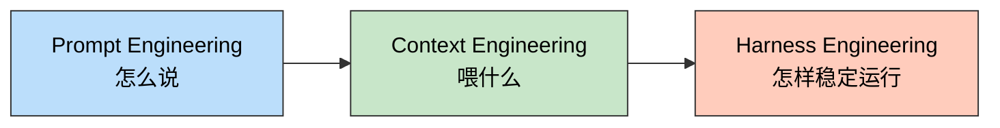
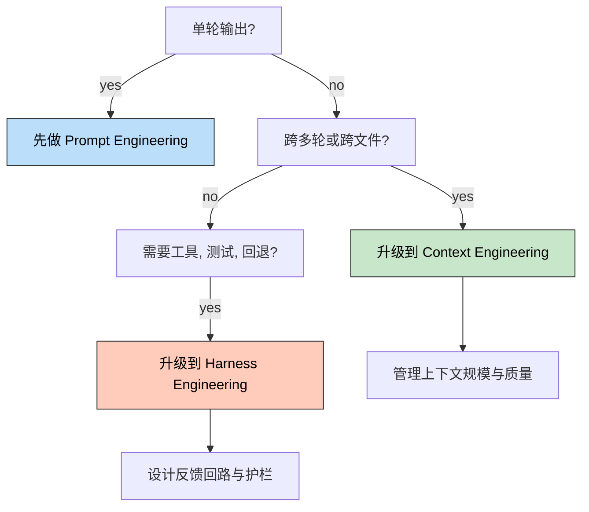
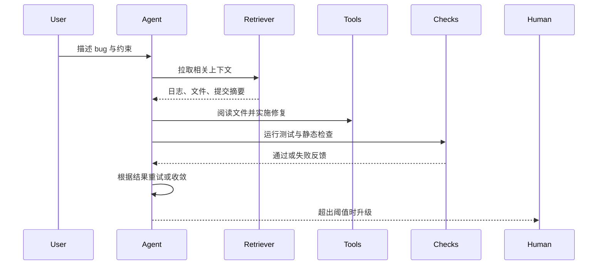

> 一句话定位：这不是三个孤立概念，而是 AI 系统工程关注点的升级。

> 核心理念：`Prompt` 解决“怎么说”，`Context` 解决“喂什么”，`Harness` 解决“系统怎么让 agent 稳定完成工作”。

---

## 3 分钟速览版

<details>
<summary><strong>点击展开核心概念</strong></summary>

### 核心关系




<details>
<summary>**🖼️ 插图版（2026-04-17 增量补充）**</summary>


</details>

这三个概念不是并列替代关系，而是逐层外扩的工程关注点。你可以把它理解为：从“写一段更好的指令”，到“组织一次更好的推理输入”，再到“设计一套让 agent 在真实环境里可靠工作的运行系统”。

### 三者对比

| 概念 | 核心问题 | 关注对象 | 典型手段 | 常见适用场景 |
|------|------|------|------|------|
| Prompt Engineering | 我该怎么说，模型才更容易做对 | 指令与输出约束 | system prompt、few-shot、格式要求、示例 | 单轮问答、生成、抽取、改写 |
| Context Engineering | 这次推理前，模型应该知道什么 | 每次调用时进入上下文的全部信息 | RAG、历史裁剪、摘要、记忆、工具结果注入 | 多轮 agent、长任务、代码库理解 |
| Harness Engineering | 怎样让 agent 在系统里稳定交付 | 模型之外的整套运行框架 | 工具接入、权限、测试闭环、重试、评估、人工升级 | AI coding、长期 agent、生产级自动化 |

### 何时需要升级




<details>
<summary>**🖼️ 插图版（2026-04-17 增量补充）**</summary>


</details>

最实用的判断标准不是术语本身，而是失败模式：

- 如果失败主要来自“指令不清”，先优化 prompt。
- 如果失败主要来自“模型不知道足够的背景”，先优化 context。
- 如果失败主要来自“任务做了一半就跑偏、不可验证、不可回滚、不可接管”，你已经进入 harness 问题。

</details>

---

## 深度剖析版

## 1. 为什么 Harness Engineering 会出现

`Harness Engineering` 之所以冒出来，并不是因为 `Prompt Engineering` 失效了，而是因为 agent 的任务边界变了。早期很多 LLM 应用更像“一次性生成器”，你只要把话说清楚，输出往往就能过关。但在 AI coding 和 agent 系统里，任务不再是一次回答，而是一连串可执行动作：读取代码、选择文件、调用工具、运行测试、根据结果修正、必要时再交给人。

OpenAI 在 `2026-02-11` 的文章《Harness engineering: leveraging Codex in an agent-first world》中，把这种变化压缩成一句很有代表性的话：`Humans steer. Agents execute.` 这句话背后的重点不是“模型更会写代码了”，而是工程师的主要工作开始从“亲手写每一行代码”转向“设计环境、指定意图、建立反馈回路”。

### 1.1 从“show me code”到“show me prompt”：讨论焦点为什么变了

`show me code` 代表的是第一阶段的期待：大家最关心模型能不能直接给出看起来正确的代码片段。

`show me prompt` 则代表第二阶段的意识变化：大家开始追问，为什么同一个模型在不同产品里表现差异这么大，差异究竟来自模型本身，还是来自它背后的 prompt、context、tooling、memory 和 workflow。

这句话不是一个行业标准术语，而是一种很有解释力的现象描述。它至少反映了三件事：

- prompt 已经不只是输入文本，而是在很多产品里变成了可复用的工程资产。
- 好结果越来越依赖“给模型什么背景”，而不只是“用什么措辞发问”。
- 当人们继续追问 prompt 背后的运行条件时，问题自然会外扩到 harness。

换句话说，大家表面上是在问“给我看看你的 prompt”，本质上是在问“你的 agent 到底是怎么被组织起来的”。

### 1.2 为什么现在必须关心 harness

模型能力上来之后，瓶颈开始转移。真正影响 AI coding 成败的，越来越不是一句 prompt 写得多漂亮，而是下面这些系统性问题：

- agent 是否拿到了最相关的上下文，而不是一大堆噪声。
- agent 是否拥有合适但受控的工具权限。
- 每一步动作之后，系统是否能给出可验证的反馈。
- 失败时能否自动收敛、重试、回退，或者及时升级给人。

如果这些问题没有被工程化处理，再强的模型也会在真实任务里出现同样的症状：上下文漂移、行动发散、修错文件、测试不跑、越修越乱。

## 2. 三个概念的定义、边界与包含关系

从今天的主流实践看，这三个概念可以这样理解：

- `Prompt Engineering`：设计和组织指令，让模型更容易在一次调用里理解你的目标、约束和输出格式。
- `Context Engineering`：决定每次调用前到底给模型哪些信息，以及如何在多轮任务里持续维护这些信息。
- `Harness Engineering`：把模型放进一个受控的运行系统里，让它能调用工具、接受反馈、通过检查、失败重试，并在必要时交回人类。

这里有一个非常实用的工程化归纳：

`Prompt Engineering ⊂ Context Engineering ⊂ Harness Engineering`

这个关系不是教科书式统一标准，而是为了帮助工程决策。因为在真实 agent 系统里：

- prompt 是 context 的一部分。
- context 又只是 harness 中的一个组成部分。
- harness 关心的是端到端任务能否稳定交付，而不是单次推理是否“看起来聪明”。

Anthropic 在 `2025-09-29` 的文章《Effective context engineering for AI agents》中把这个区别说得很清楚：应用 AI 的重心正在从“怎样写好 prompt”，转向“怎样配置最可能得到目标行为的上下文”。再往前一步，OpenAI 的 `Harness Engineering` 讨论实际上是在继续追问：就算上下文配置对了，agent 是否真的能在系统里可靠完成工作。

### 2.1 三者最容易混淆的边界

最常见的混淆有三个：

- 把 prompt 当成全部控制手段，结果把大量脆弱逻辑硬编码进系统提示词。
- 把 context 理解成“塞更多资料”，结果上下文越来越长，信号越来越稀。
- 把 harness 理解成“多接几个工具”，结果缺少测试闭环、权限边界和人工兜底。

判断边界最简单的方法是看你在设计什么：

- 你在设计一句话或一段结构化指令，通常是在做 prompt。
- 你在设计输入集合、记忆策略、裁剪规则，通常是在做 context。
- 你在设计 agent 的运行环境、反馈机制和升级路径，通常是在做 harness。

## 3. 在 AI coding / agent 开发里分别解决什么问题

## 3.1 Prompt Engineering 解决“最小可执行契约”

在 AI coding 里，prompt 的价值不是把所有逻辑都写进去，而是定义一次调用的最小契约：

- 任务目标是什么。
- 哪些约束不能破坏。
- 输出要长什么样。
- 失败时应该如何说明。

一个足够好的 prompt，应该让模型在没有额外追问的情况下，知道“什么算完成，什么算越界”。

下面是一个面向修 bug 的简化 prompt 示例：

```text
你是负责修复生产回归问题的代码代理。

目标：
修复用户登录后偶发 500 错误的问题。

约束：
1. 不修改数据库 schema。
2. 不改变现有 HTTP API 的入参与返回结构。
3. 优先做最小修复，不顺手重构无关代码。

输出要求：
1. 先用 3 句话总结你理解的问题。
2. 给出计划。
3. 完成修改后列出受影响文件。
4. 报告你运行了哪些测试，以及结果如何。
5. 如果你无法确认修复有效，明确说明原因，不要假装完成。
```

这个 prompt 已经能明显提升结果质量，但它还不够解决长任务问题。因为模型知道“应该做什么”，不等于它真的拿到了“做成这件事所需的信息和环境”。

## 3.2 Context Engineering 解决“这次调用前应该知道什么”

在代码任务里，context 往往决定 agent 是像一个靠谱同事，还是像一个只会猜的实习生。

高质量的上下文通常包括：

- 与报错直接相关的日志片段，而不是整份日志文件。
- 涉及模块的关键文件，而不是整个仓库。
- 最近几次相关提交或 PR 摘要。
- 测试说明、约束规则、接口契约。
- 上一轮动作的结果，包括失败信息和当前假设。

Anthropic 把 context 看作有限资源，这个判断在 AI coding 场景里尤其重要。上下文越长，并不自动等于效果越好；很多时候，真正有价值的是“更小但更高信号”的输入。

OpenAI Cookbook 关于 session memory 的示例也说明了这一点：多轮 agent 的问题不只是保存历史，而是管理历史。你既可以简单保留最近若干轮，也可以在接近窗口上限时做高保真摘要，但核心目标始终是同一个：让下一轮看到最有用的信息，而不是最多的信息。

## 3.3 Harness Engineering 解决“怎样让任务真正交付”

到了 harness 层，讨论对象不再只是模型输入，而是完整的任务闭环。

在 AI coding 里，一个最低可用的 harness 通常要回答这些问题：

- agent 能访问哪些文件、命令和外部系统。
- 调工具的顺序和边界是什么。
- 修改后必须经过哪些自动检查。
- 失败几次后需要收敛、换策略或升级给人。
- 最终结果如何记录、审查和回滚。

这也是为什么 `Harness Engineering` 更接近“系统设计”而不是“提示词技巧”。它本质上是在为 agent 建一条安全、可验证、可维护的工作轨道。

## 4. 一个“让 agent 修 bug”的贯穿案例

假设你要让一个 coding agent 修复线上登录接口的偶发 `500` 错误。这个任务看起来像一个普通 bugfix，但实际上正好能把三层问题分开。

### 4.1 只做 prompt 会发生什么

如果你只给一句“修掉这个 bug，顺便把代码整理一下”，模型常见的失败方式包括：

- 对问题理解过度泛化，开始无关重构。
- 不知道应该先看哪些文件，只能在仓库里瞎猜。
- 修改后不跑测试，或者只报告主观判断。
- 看见一次报错就自信下结论，没有验证回归范围。

Prompt 可以减少这些问题，但不能根治它们。

### 4.2 把 context 加进去，会解决什么

如果你再补上这些上下文，成功率会大幅提高：

- 最近 20 分钟的相关错误日志摘要。
- `auth`、`session`、`middleware` 相关文件路径。
- 过去一周内改过登录流程的提交摘要。
- 登录接口的契约说明和现有测试入口。
- 当前任务已知的排查结论，例如“数据库层指标正常，错误集中在 session 反序列化分支”。

这时 agent 已经更像一个拿到案卷的工程师，而不是一个只能根据一句话猜题的模型。

### 4.3 再往前一步，harness 才是真正的交付层

当任务进入真实工作流之后，你还需要把 agent 放进可运行、可验证、可接管的闭环里。




<details>
<summary>**🖼️ 插图版（2026-04-17 增量补充）**</summary>


</details>

下面是一份简化的 harness 伪配置：

```yaml
task: fix-login-500
goal: 修复登录后偶发 500 错误

inputs:
  prompt:
    - 明确问题、约束和输出格式
  context:
    - 最近报错摘要
    - 相关文件列表
    - 最近提交摘要
    - 测试入口说明

tools:
  read_files: allowed
  search_code: allowed
  run_tests:
    allowed: true
    commands:
      - npm test -- login
      - npm run lint
  deploy:
    allowed: false

checks:
  must_pass:
    - lint
    - targeted_tests
  must_report:
    - changed_files
    - root_cause
    - residual_risk

retries:
  max_attempts: 2
  on_failure:
    - refine_context
    - rerun_checks

escalation:
  trigger:
    - repeated_test_failure
    - uncertain_root_cause
    - cross_service_impact
  action: handoff_to_human
```

这个例子最能说明 `Harness Engineering` 的本质：它不是额外包了一层壳，而是把 prompt、context、tools、checks、retries、handoff 组织成了一条完整轨道。

## 5. 常见误区与故障排查

### 5.1 常见误区

- 误区一：prompt 写得足够长，agent 就会更可靠。实际情况往往相反，过长 prompt 很容易把脆弱逻辑堆进文字里。
- 误区二：context engineering 等于把资料塞满上下文窗口。真正有效的是高信号组织，而不是简单扩容。
- 误区三：公开一个 prompt 模板，就等于公开了系统能力。很多效果差异其实藏在上下文装配、工具封装和检查闭环里。
- 误区四：只要 agent 能成功一次，就说明系统设计没问题。生产系统真正关心的是稳定性、可验证性和失败后的处理方式。

### 5.2 故障排查

| 症状 | 更可能的问题层 | 常见原因 | 优先处理方式 |
|------|------|------|------|
| 输出格式混乱、目标理解偏差大 | Prompt | 约束不明确，成功标准模糊 | 重写任务目标、边界和输出要求 |
| 反复引用无关文件、遗漏关键事实 | Context | 检索粒度差，历史过长或摘要失真 | 缩小输入范围，补关键事实，重做摘要 |
| 改完代码不验证，或反复在失败路径打转 | Harness | 缺少 checks、重试策略和升级条件 | 增加测试 gate、失败阈值和 handoff 机制 |
| 同一个任务在不同环境里表现差异极大 | Harness | 权限、工具、上下文装配不一致 | 统一运行环境与上下文注入流程 |

## 6. FAQ

### 6.1 Harness Engineering 和 Agent Framework 是什么关系

Framework 更像是脚手架或开发框架，帮你更快搭 agent。Harness 更像是你最终围绕 agent 建出来的运行系统。你可以用同一个 framework，做出很弱的 harness，也可以做出很强的 harness。

### 6.2 Context Engineering 会替代 Prompt Engineering 吗

不会。Prompt 仍然重要，因为它定义了目标、边界和输出契约。只是随着任务变复杂，prompt 不再是全部，必须和 context 一起设计。

### 6.3 为什么大家开始从“show me code”走向“show me prompt”

因为大家逐渐发现，真正可复用的差异化能力往往不只是模型输出结果，而是结果背后的组织方式。问 prompt，本质上是在追问系统设计。但如果继续追问下去，你最终会看到的不是一句 prompt，而是一整套 harness。

### 6.4 小团队什么时候需要上 harness

当任务开始满足下面任一条件时，就该至少做一个轻量 harness：跨多文件、多轮推理、需要工具调用、需要自动验证、失败成本高，或者需要多人协作交接。

### 6.5 个人开发者怎样从 prompt 逐步演进到 harness

最现实的路径不是一步到位，而是三步走：先把 prompt 写成稳定模板，再补最小上下文装配，最后把测试、日志、权限和 handoff 机制接进来。很多个人项目并不需要完整平台，但至少需要最小闭环。

## 7. 落地清单：从 Prompt 到 Context 到 Harness

### Prompt Engineering 最小落地项

- [ ] 为每类任务写清目标、约束、输出格式和失败报告方式。
- [ ] 把“不要做什么”改成“应该怎么做”。
- [ ] 为高频任务沉淀可复用模板，而不是每次临时手写。
- [ ] 用少量高质量示例替代大段模糊解释。
- [ ] 把 prompt 当作契约，而不是塞满业务逻辑的万能胶。

### Context Engineering 升级项

- [ ] 明确每次调用前需要哪些最小必要信息。
- [ ] 建立代码检索、日志摘要、历史压缩和记忆策略。
- [ ] 控制上下文长度，优先保留高信号信息。
- [ ] 区分长期记忆、短期会话状态和即时工具结果。
- [ ] 为长任务设计 compaction 或 trimming 机制，避免上下文漂移。

### Harness Engineering 生产级项

- [ ] 设计 agent 可调用的工具边界和权限模型。
- [ ] 为关键任务接入 lint、测试、评估和结果报告 gate。
- [ ] 定义失败重试策略，而不是无限循环尝试。
- [ ] 为不确定、跨系统、高风险任务设置人工升级条件。
- [ ] 记录 agent 的输入、动作、结果和残余风险，保证可审计。
- [ ] 把 prompt、context、tools、checks、handoff 作为一套系统统一设计。

如果只想记住一句话，可以记这个顺序：

先让模型听懂，再让模型看到该看到的，最后让模型在一个可靠系统里干活。

## 参考资料

- [OpenAI - Harness engineering: leveraging Codex in an agent-first world](https://openai.com/index/harness-engineering/)
- [Anthropic - Effective context engineering for AI agents](https://www.anthropic.com/engineering/effective-context-engineering-for-ai-agents)
- [OpenAI Cookbook - Context Engineering: Short-Term Memory Management with Sessions](https://developers.openai.com/cookbook/examples/agents_sdk/session_memory)
- [OpenAI Help - Best practices for prompt engineering with the OpenAI API](https://help.openai.com/en/articles/6654000-prompt-engineering-guide)

## 更新记录

| 版本 | 日期 | 说明 |
|------|------|------|
| v1.0 | 2026-03-30 | 基于对话与公开资料整理首版，确立以 Harness Engineering 为主线的对比与落地框架 |
| v1.1 | 2026-04-17 | 为 3 个 Mermaid 图表追加 Chiikawa 风格插图（m2c-pipeline 生成） |
