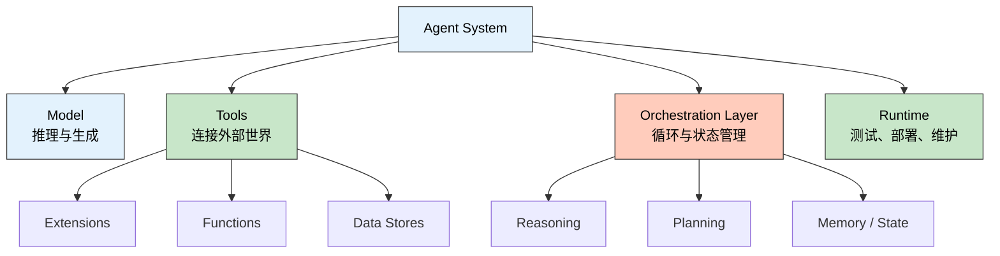
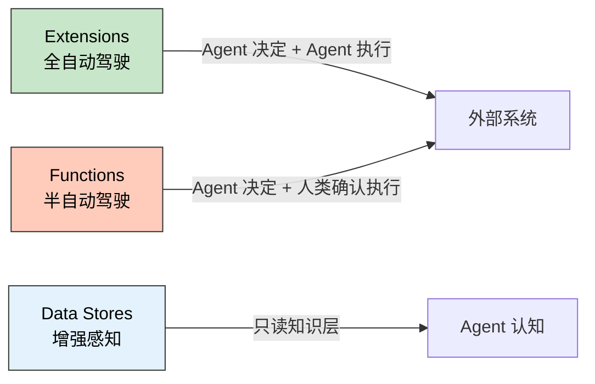
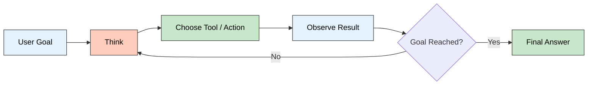

> **一句话定位**：这不是一篇"Agent 很火"的概念文，而是把 Day 1 白皮书拆成开发者真正能拿来理解架构的认知地图，并补上白皮书没讲的工程权衡。
>
> **核心理念**：Agent 不是"会调工具的模型"，
> 而是一个以 LM 为推理核心、通过循环驱动完成目标的完整应用系统。
> 理解 Agent 的关键不在于记概念，
> 而在于理解每个设计决策背后的 Why。

---

## 为什么 Day 1 值得精读

Google 和 Kaggle 在 2025 年推出了 `5-Day AI Agents Intensive Course`。Day 1 的白皮书是整个系列的认知底座，负责回答最根本的三个问题：

- Agent 到底是什么
- Agent 和单纯的 Model 差在哪里
- 一个能跑起来的 Agent，最小架构应该长什么样

整个 5 Days 的学习地图如下：

| 天数 | 主题焦点 | 你会建立的认知 |
|------|----------|----------------|
| Day 1 | Agent 基础架构 | Agent 的定义、组件与运行循环 |
| Day 2 | Tools / Memory / Context | Agent 如何连接外部世界与知识 |
| Day 3 | Build | 如何把架构变成可运行原型 |
| Day 4 | Evaluate | 如何评估、调试与持续改进 |
| Day 5 | Production / Multi-Agent | 如何把原型推进到真实系统 |

Day 1 的价值不在于"知识点最多"，而在于它决定了你后面读 Day 2 到 Day 5 时，到底是在堆概念，还是在搭一套能自洽的系统观。

### 白皮书的价值与局限

2025 年 Agent 从概念炒作走向生产落地。Google 的这份白皮书是目前最系统化的官方 Agent 定义之一：

- **给出了精确的定义边界**：不是所有带 Function Calling 的应用都是 Agent
- **拆解了组件职责**：Model、Tools、Orchestration Layer 各自的工程挑战
- **建立了工具分类体系**：Extensions / Functions / Data Stores 的设计意图

但它也有明显的局限：对成本、可靠性、安全性、调试等生产级问题着墨甚少。这篇精读会在白皮书的基础上，补充工程视角的深度分析。

---

## 什么才算 Agent

白皮书没有把 Agent 写成一个神秘的新物种。它给出的定义很务实：

> An AI Agent = combination of models, tools, orchestration layer,
> and runtime services which utilizes the LM **in a loop**
> to accomplish a goal.

这个定义里，最关键的不是 "models"、不是 "tools"，而是 **"in a loop"**。同时，三个特征把 Agent 和普通模型区分开来：

- **目标导向**：不是为了聊天而聊天，而是围绕明确目标推进
- **自主推进**：拿到目标后，可以自己决定下一步需要做什么
- **主动行动**：不只生成文本，还会在需要时去检索、调用 API 或改写计划

### "in a loop" 为什么如此重要

一个能调用工具的模型和一个 Agent 之间的本质区别，就在于是否存在**自主循环**。

单次 Function Calling 是线性的：用户提问 → 模型决定调哪个工具 → 调用 → 返回结果 → 模型生成回答。整个过程最多一次工具调用，决策链是确定的。

Agent 的流程是循环的：用户提出目标 → 模型规划步骤 → 执行第一步 → 观察结果 → 根据结果调整计划 → 执行下一步 → ……直到目标完成。**每一步的结果都影响下一步的决策**，整个过程是一个状态机。

这意味着三个工程层面的直接后果：

- **错误会累积**：第三步的错误会被后续步骤放大
- **上下文会膨胀**：每一步的结果都塞进 context window
- **成本是非线性的**：循环次数不可预测，token 消耗可能远超预期

这些正是 Agent 工程化的核心挑战。

### Agent vs Model：五个维度的本质区别

| 维度 | Model | Agent |
|------|-------|-------|
| 本质 | 推理引擎 | 面向目标的完整应用系统 |
| 知识来源 | 主要受限于训练数据 | 可借助工具连接外部系统 |
| 工作方式 | 一次推理或一次回答 | 多轮状态化循环 |
| 输出 | 文本 / 结构化数据 | 行动 + 可观测的副作用 |
| 失败模式 | 输出质量差 | 错误累积、无限循环、资源耗尽 |

**关键洞察**：一个能调用工具的模型不自动等于 Agent。Orchestration Loop 才是区分 Agent 和"带工具的模型"的分水岭。

---

## 把 Day 1 读成一张四层架构图

白皮书在核心章节里强调了三个 essential components：`Model`、`Tools`、`Orchestration Layer`。但如果从工程视角去读，应该把它整理成四层：

**🖼️ 插图版（2026-04-17 增量补充）**

前三层是白皮书正文明确展开的"核心组件"，而 `Runtime` 是结合课程语境和生产化章节做的工程化归纳——帮助我们把"原理"和"落地容器"分开看清。

### Model：上下文窗口管理才是真正的工程挑战

在 Day 1 的定义里，Model 是 agent process 的
centralized decision maker。它负责推理、判断下一步行动、
选择工具，以及综合 observation 生成最终回答。

但白皮书也提醒了一点：模型本身并不知道"你这个 Agent 的具体配置"。它不是天生就懂你的工具集合和业务边界，而是要通过 prompt、示例、工具描述和状态上下文，被放到一个特定系统里工作。

更深层的工程问题是：
**上下文窗口（Context Window）是有限资源**。
Agent 的每次循环都会产生新信息，这些全部塞进 context window，
而 window 有上限。这个问题可以抽象为三个演化阶段：

1. **Prompt Engineering**：在固定空间里写出最好的指令（静态优化）
2. **Context Engineering**：动态决定每次调用塞什么信息进 window（运行时管理）
3. **Harness Engineering**：设计整个 Agent 框架的信息流架构（系统设计）

很多 Agent 项目会在第二阶段遇到明显瓶颈：context window
管理不当时，后期循环质量很容易快速下滑。常见症状包括：
遗忘早期指令、重复调用相同工具、输出冗余信息。

### Tools：让模型从"会说"变成"能做"

没有工具的模型，知道很多；有工具的 Agent，才可能做到很多。白皮书把工具分成三类（Extensions、Functions、Data Stores），下一节会详细展开。

这里先说一个白皮书没讲透的深层逻辑：**工具分类的本质是控制权分配**。

**🖼️ 插图版（2026-04-17 增量补充）**

设计 Agent 时，选工具类型首先问的不是"这个 API 能不能调"，而是"这个操作的控制权应该在谁手里"。

### Orchestration Layer：本质是一个状态机

白皮书说 Orchestration Layer 管理 Think → Act → Observe 循环。这一层常常被低估，但它才是 Agent 的"神经系统"——决定什么时候该继续思考、什么时候该调用工具、什么时候应该停止。

在工程层面，这本质上是一个**有限状态机（FSM）**：

- 状态：当前任务进度、上下文摘要、工具可用性
- 转移条件：推理结果、工具返回、错误信号
- 终止条件：目标完成、资源耗尽、错误不可恢复

这与分布式系统中的经典模式高度相似：

| 分布式模式 | Agent 对应 | 共同点 |
|-----------|-----------|--------|
| Saga Pattern | 工具调用链 | 多步事务编排，每步有补偿逻辑 |
| Event Sourcing | 执行轨迹 | 所有状态变更记录为事件 |
| Actor Model | 多 Agent 协作 | 独立实体通过消息通信 |

理解这些类比，可以帮助我们借鉴分布式系统的成熟工程实践来构建 Agent。

### Runtime：白皮书没大讲，但落地一定绕不过去

如果说前三层回答了"Agent 是什么"，那么 Runtime 回答的是
"这东西怎么真正跑起来"。白皮书后半段讲到 Vertex AI 上的
production applications 时，实际上已经把 Runtime 的轮廓带出来了：

- 谁来托管工具和模型调用
- 谁来保存会话状态与中间结果
- 谁来做测试、评估、调试和部署
- 谁来处理维护成本

---

## Agent 不是一次回答，而是一段循环

Day 1 最值得反复看的地方，是它把 Agent 描述为一个持续运行的认知循环。

**🖼️ 插图版（2026-04-17 增量补充）**

这张图概念简单，但"概念简单"不等于"工程简单"。每一步都藏着真实的工程挑战：

**Get Mission（接收任务）**：用户说"帮我订明天去上海的机票"，
Agent 需要消歧——出发城市、舱位偏好、预算范围、"明天"是哪天。
模糊意图的消歧需要额外的 LLM 调用或用户交互。

**Scan Scene（扫描环境）**：收集所有可用信息——用户历史、
工具状态、当前上下文。Context Engineering 的核心工作就在这里。
信息过多会导致 context window 溢出和注意力稀释；
信息过少则会导致推理质量下降。

**Think（推理规划）**：基于收集到的信息决定下一步。推理框架的选择（ReAct、CoT 等）直接影响这一步的质量。

**Act（执行行动）**：调用工具或生成输出。生产环境里工具调用经常失败：API 超时、权限不足、返回格式不符预期。每个工具调用都需要错误处理、重试逻辑和超时机制。

**Observe（观察结果）**：评估行动结果，决定是否继续。**这是大多数生产故障发生的地方**——怎么判断"目标已完成"？怎么判断"当前路径失败需要转向"？怎么避免无限循环？

### 常见故障模式

| 故障类型 | 表现 | 根因 | 缓解手段 |
|---------|------|------|---------|
| 无限循环 | 反复执行相同操作 | 观察结果无法推动状态转移 | 循环次数上限 + 相似度检测 |
| 错误级联 | 后续步骤全部基于错误信息 | 一个工具返回异常未被识别 | 每步结果校验 + 回退机制 |
| 上下文溢出 | 推理质量断崖式下降 | 多轮循环历史信息填满 window | 滑动窗口 + 摘要压缩 |
| 目标漂移 | 执行过程偏离原始目标 | 中间步骤引入干扰信息 | 目标锚定 + 周期性回检 |

---

## Tools 不是附件，而是 Agent 的能力边界

Day 1 对工具体系的拆分非常实用。它没有泛泛说"Agent 可以接 API"，而是明确分成三类，每类对应不同的控制权分配。

### 三类工具对比

| 维度 | Extensions | Functions | Data Stores |
|------|-----------|-----------|-------------|
| 执行位置 | Agent 端 | 客户端 | 向量数据库 |
| 调用方式 | Agent 直接调用 API | 返回 JSON 给客户端执行 | RAG 检索 |
| 控制权 | Agent 自主 | 人类/系统把关 | 知识层（只读） |
| 信任等级 | 高（已授权） | 低（需确认） | N/A |
| 核心优势 | 多步规划流畅 | 安全、权限控制好 | 减少幻觉 |
| 典型场景 | 搜索、邮件发送 | 支付、数据写入 | 企业知识库 |
| 人机协作 | 无需人工介入 | 支持 Human-in-the-loop | 无需人工介入 |

### Extensions：把 API 教会给 Agent

白皮书指出，直接手写胶水代码去解析用户输入、拼接 API 参数，
短期当然能跑，但会非常脆。Extension 更稳的地方在于，
它不是把 API "硬接上去"，而是把
"这个 API 什么时候该用、需要哪些参数、怎样调用才像样"
一起教给 Agent。于是模型不仅会用工具，
还更可能在多轮任务里选对工具。

### Functions：把执行权收回到客户端

Function Calling 的关键不是"也能调工具"，而是执行权在谁手上。Agent 会给出函数名和参数，但真正执行动作的是客户端或你自己的后端：

- 可以插入鉴权与审计
- 可以加入 `human-in-the-loop`
- 可以控制批处理或顺序执行
- 可以连接不能直接暴露给外部系统的内部接口

很多业务系统真正想要的，其实不是"Agent 直接替我干"，而是"Agent 先把动作规划对，再由我决定是否执行"。

### Data Stores：解决的不是知识量，而是知识时效性

Data Stores（RAG）与另外两类工具有本质区别：它不是"行动工具"，而是**知识层**。它不改变外部世界的状态，只改变 Agent 对问题的理解。

这意味着 Data Stores 可以与其他工具类型自由组合，
不需要担心副作用冲突。但它引入了另一个工程挑战：
**检索质量直接决定推理质量**。检索到错误的信息
比没有信息更危险，因为 Agent 会基于错误信息
自信地做出错误决策。

---

### 为什么 Day 1 会提前提到多 Agent

Day 1 的任务是建立底层认知，不是把多 Agent 工作流讲完。
但课程在 Notebook 里会提前露出多 Agent 的影子，
原因很简单：当单个 Agent 的上下文、职责和工具集合变得越来越重，
"拆角色、分控制权"就会成为很自然的下一步。

所以在 Day 1 先记住这一点就够了：
**多 Agent 不是另起炉灶的新概念，而是单 Agent 架构继续外推后的组织方式。**
等读到后续 Notebook 或 Day 5，再展开看它的编排模式、角色分工和工程代价会更顺。

---

## 白皮书没有讲的生产盲区

白皮书给出了 Agent 的系统化定义，
但如果你是带着"准备把它放进真实系统"的心态来读，
很快就会发现还有几类关键问题没有被充分展开：

| 维度 | 核心问题 | 为什么会成为真实门槛 |
|------|---------|----------------------|
| **成本** | 循环次数、工具调用次数、上下文膨胀如何控制 | Agent 的资源消耗通常不是固定流程那样容易预估 |
| **可靠性** | 同一任务多次执行结果不一致怎么办 | 需要重试、上限、回退和验收标准 |
| **安全性** | 工具访问边界、审批、沙箱怎么设计 | 一旦 Agent 能行动，攻击面就不再只是文本输出 |
| **调试** | 出错后如何还原当时的推理与调用链 | 概率性系统很难只靠"重跑一次"定位问题 |
| **评估** | 怎么判断 Agent 是真变好，还是只是看起来更忙 | 没有稳定评估，工程优化就很难闭环 |

这也是我理解 Day 1 的最好方式：
它不是生产实践的终点，而是后续所有工程讨论的总装图。
你先把定义、循环、控制权这三件事理解对，
后面再去看评估、监控、运行时和多 Agent，
才不会把它们误读成零散技巧。

---

## 总结：我从 Day 1 带走的认知锚点

1. **Agent 不是更强的聊天框**，而是一个围绕目标运行的应用系统。Model 决定推理上限，但 Tools 和 Orchestration 才决定它能不能真的做事。

2. **循环是本质**。没有自主循环的"Agent"只是一个带工具的模型。循环带来了适应性，也带来了所有工程难题——错误累积、上下文膨胀、成本不可控。

3. **Context 往往是最先撞上的瓶颈之一**。很多 Agent 的问题不是模型不会推理，而是循环过程中塞进 window 的信息越来越杂，导致后续决策质量持续下滑。

4. **控制权是设计核心**。`Extensions`、`Functions`、`Data Stores` 不是并列术语，而是三种不同的控制权分配方式。工具选型、安全边界、失败恢复，本质上都是在回答"谁在控制"这个问题。

5. **一旦走向 production，AgentOps 很快就会从加分项变成必答题**。评估、调试、性能测量和持续改进，不是 Day 1 会讲透的内容，但它们迟早都会回到架构设计本身。

---

## Day 2 值得期待什么

如果 Day 1 解决的是"Agent 是什么"，那么 Day 2 更值得看的是"Agent 怎么持续拿到对的信息"。下一步最自然的问题：

- 工具到底该怎么设计
- Memory 和 Context 到底怎么分工
- RAG 在 Agent 里究竟是知识库，还是决策增强器

所以 Day 1 最好的阅读方式，不是把它当成一个已经完结的定义，而是把它当成整套课程的总装图。接下来可以顺着读
[Day 2：Agent 工具体系](./2026-04-03-kaggle-google-agent-5days-day2-whitepaper-reading.md)，
把"会循环"进一步接到"能连接外部世界"。

---

## 参考资料

- [5-Day AI Agents Intensive Course 官方回顾](https://blog.google/innovation-and-ai/technology/developers-tools/ai-agents-intensive-recap/)
- [Agents 白皮书 PDF（Google / Kaggle 课程配套）](https://storage.googleapis.com/kagglesdsdata/datasets/7096349/11342329/22365_19_Agents_v8.pdf)
- [ADK（Agent Development Kit）文档](https://google.github.io/adk-docs/)
- [Vertex AI Agent Evaluation 文档](https://docs.cloud.google.com/agent-builder/agent-engine/evaluate)

---

## 更新记录

| 版本 | 日期 | 说明 |
|------|------|------|
| v1.0 | 2026-03-31 | 初始版本 |
| v2.0 | 2026-04-03 | 合并两版精读，重写为完整版：融合工程深度分析与认知地图结构 |
| v2.1 | 2026-04-03 | 补充 ADK 框架介绍、四种多 Agent 工作流模式、AgentTool vs Sub-Agent 区分 |
| v2.2 | 2026-04-06 | 收敛 Markdown 排版并修复 lint 规范。 |
| v2.3 | 2026-04-07 | 收束 Day 1 主线，精简延伸章节并强化与 Day 2 的系列衔接 |
| v2.4 | 2026-04-17 | 为 3 个 Mermaid 图表追加 Chiikawa 风格插图（m2c-pipeline 生成） |
