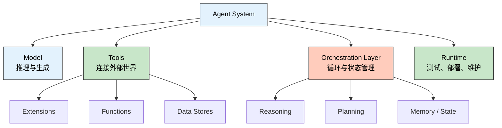
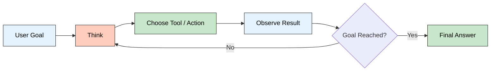

> 🎯 **一句话定位**：这不是一篇“Agent 很火”的概念文，而是把 Kaggle
> 和 Google 的 Day 1 白皮书，拆成开发者真正能拿来理解架构的认知地图。
>
> 💡 **核心理念**：Day 1 真正要讲清楚的，不是“Agent 会不会思考”，而是
> 一个可运行的 Agent 系统，到底由哪些层组成，又为什么它比单纯的
> Model 更接近“应用”。

---

## 为什么 Day 1 值得精读

Google 和 Kaggle 在 2025 年推出了 `5-Day AI Agents Intensive Course`。
官方回顾里提到，这套课程围绕 AI Agent 的设计、评估与部署展开；而
Day 1 的白皮书，就是整个系列的认知底座。

如果说后面几天会进入工具、评估、多 Agent 和生产化，那么 Day 1
负责回答的，是最根本的三个问题：

- Agent 到底是什么
- Agent 和单纯的 Model 差在哪里
- 一个能跑起来的 Agent，最小架构应该长什么样

整个 5 Days 可以先粗看成下面这张学习地图：

| 天数 | 主题焦点 | 你会建立的认知 |
|------|----------|----------------|
| Day 1 | Agent 基础架构 | Agent 的定义、组件与运行循环 |
| Day 2 | Tools / Memory / Context | Agent 如何连接外部世界与知识 |
| Day 3 | Build | 如何把架构变成可运行原型 |
| Day 4 | Evaluate | 如何评估、调试与持续改进 |
| Day 5 | Production / Multi-Agent | 如何把原型推进到真实系统 |

所以 Day 1 的价值，并不是“知识点最多”，而是它决定了你后面读 Day 2
到 Day 5 时，到底是在堆概念，还是在搭一套能自洽的系统观。

---

## Day 1 先回答：什么才算 Agent

白皮书没有把 Agent 写成一个神秘的新物种。它给出的定义很务实：
Agent 是一个为了达成目标而运行的应用，它会观察环境、调用手头可用的
工具，并据此持续做出下一步决策。

这个定义里，最关键的不是 “AI”，而是下面三个特征：

- **目标导向**：它不是为了聊天而聊天，而是围绕明确目标推进
- **自主推进**：拿到目标后，可以自己决定下一步需要做什么
- **主动行动**：不只生成文本，还会在需要时去检索、调用 API 或改写计划

这也是白皮书一开始就反复强调的原因：Agent 不是“更强一点的问答模型”，
而是一个把语言模型嵌进执行闭环里的系统。

### Agent 和 Model 的边界，必须先分清

很多人在讨论 Agent 时，容易把 “LLM 很强” 和 “系统很 agentic” 混为一谈。
Day 1 的一个核心贡献，就是把这条边界划得很清楚。

| 维度 | Model | Agent |
|------|-------|-------|
| 知识来源 | 主要受限于训练数据 | 可借助工具连接外部系统 |
| 工作方式 | 一次推理或一次回答 | 多轮状态化循环 |
| 上下文 | 通常只关注当前输入 | 持续管理会话、状态与历史 |
| 行动能力 | 生成文本或结构化输出 | 选择工具、执行动作、读取结果 |
| 系统形态 | 推理引擎 | 面向目标的完整应用 |

换句话说，Model 更像 “会推理的大脑”，而 Agent 更像 “带着大脑、
双手、记忆和调度系统的执行体”。

这也是为什么开发 Agent 时，问题不只是 “我用哪个模型”，而是
“我准备给这个模型怎样的工具、记忆和控制流”。

---

## 把 Day 1 读成一张四层架构图

白皮书在核心章节里强调了三个 essential components：
`Model`、`Tools`、`Orchestration Layer`。但如果从工程视角去读，
我更建议把它整理成四层：

- Model：负责推理与生成
- Tools：负责连接外部世界
- Orchestration Layer：负责循环、状态与决策
- Runtime：负责把这一切放进可测试、可部署、可维护的运行环境

这里需要说明一下：前面三层是白皮书正文明确展开的“核心组件”，而把
`Runtime` 单独拎出来，是结合课程语境和生产化章节做的工程化归纳。
它不是在和白皮书唱反调，反而能帮助我们把 “原理” 和 “落地容器”
分开看清。



### Model：不是主角滤镜，而是中央决策器

在 Day 1 的定义里，Model 是 agent process 的 centralized decision maker。
它负责做推理、判断下一步行动、选择工具，以及综合 observation
生成最终回答。

但白皮书也提醒了一点非常重要的现实感：模型本身通常并不知道
“你这个 Agent 的具体配置”。它不是天生就懂你的工具集合、
编排规则和业务边界，而是要通过 prompt、示例、工具描述和状态上下文，
被放到一个特定系统里工作。

所以在 Agent 架构里，Model 很重要，但它从来不是全部。

### Tools：让模型从“会说”变成“能做”

没有工具的模型，知道很多；有工具的 Agent，才可能做到很多。

Tools 的本质，是把语言模型从训练数据里拉出来，让它接触实时信息、
结构化数据和外部动作。白皮书里举的例子很典型：查航班、读数据库、
发邮件、完成交易。

你会发现，Day 1 对工具的定义本身已经很清楚地指向生产环境了：
真正有用的 Agent，必须能和外部系统发生关系。

### Orchestration Layer：真正决定“像不像 Agent”的地方

这一层常常被低估，但它其实才是 Agent 的“神经系统”。

白皮书把它定义成一个循环式过程：Agent 接收信息，做内部推理，再根据
推理结果决定下一步行动；只要目标还没完成，这个循环就会继续。

这意味着 Agent 的核心竞争力，不只是某次回答答得好不好，而是：

- 什么时候该继续思考
- 什么时候该调用工具
- 工具结果回来后是否需要改写计划
- 什么时候应该停止并给出最终答案

### Runtime：白皮书没大讲，但落地一定绕不过去

如果说前三层回答了 “Agent 是什么”，那么 Runtime 回答的是
“这东西怎么真正跑起来”。

白皮书后半段讲到 LangChain / LangGraph 原型，以及 Vertex AI
上的 production applications 时，实际上已经把 Runtime 的轮廓带出来了：

- 谁来托管工具和模型调用
- 谁来保存会话状态与中间结果
- 谁来做测试、评估、调试和部署
- 谁来处理维护成本，而不是让每个团队都手搓一套底层设施

也正因为如此，我会把 Runtime 当作读 Day 1 时必须补上的第四层。

---

## Agent 不是一次回答，而是一段循环

Day 1 最值得反复看的地方，是它把 Agent 描述为一个持续运行的认知循环，
而不是一次性生成。



这张图看起来简单，但它其实解释了为什么 Agent 天然适合多步任务。
因为很多真实问题，本来就不是“一次回答就结束”的：

- 找资料之后，还要比对真伪
- 选完工具之后，还要补参数
- 执行一个动作之后，还要根据返回值决定下一步

白皮书在这里引入的关键概念，是 `cognitive architectures`。它想表达的不是
“给模型一个 fancy 名词”，而是：如果你希望系统连续地观察、推理、
行动、修正，那么你就需要一套明确的控制框架。

### ReAct、CoT、ToT 在这里分别扮演什么角色

Day 1 点到了三类常见 reasoning techniques：

- **ReAct**：把 Reasoning 和 Acting 交织在一起，适合循环式 Agent
- **Chain-of-Thought**：显式写出中间推理步骤，适合复杂推导
- **Tree-of-Thoughts**：允许探索多条候选思路，更适合 lookahead 场景

如果只从“提示词技巧”去看，这三者会显得像 Prompt Engineering 小节。
但放回 Agent 里看，它们其实决定的是 orchestration layer 的行为风格。

也就是说，推理框架不是装饰品，而是控制流的一部分。

### 白皮书给出的 ReAct 序列很值得记住

白皮书举了一个典型流程：

1. 用户发来问题
2. Agent 进入 ReAct 序列
3. 模型生成 `Thought`
4. 模型决定 `Action`
5. 提供 `Action Input`
6. 接收 `Observation`
7. 若还未完成，则继续下一轮
8. 输出 `Final Answer`

只要把这 8 步记住，你再去看任何一个 Agent Framework，就更容易判断：
它到底是在帮你封装循环，还是只是在包一层聊天接口。

---

## Tools 不是附件，而是 Agent 的能力边界

Day 1 对工具体系的拆分非常实用。它没有泛泛说 “Agent 可以接 API”，
而是明确分成三类：`Extensions`、`Functions`、`Data Stores`。

| 工具类型 | 执行位置 | 核心作用 | 更适合的场景 |
|----------|----------|----------|--------------|
| Extensions | Agent 侧 | 让 Agent 直接对接外部 API | 多步规划、连续调用、多跳任务 |
| Functions | Client 侧 | 由 Agent 产出参数，客户端执行 | 权限敏感、需审批、顺序受控 |
| Data Stores | Agent 侧 | 给 Agent 提供检索式知识访问 | RAG、企业知识、私有数据访问 |

### Extensions：把 API 教会给 Agent

白皮书对 Extensions 的解释很接地气。它指出，直接手写一堆胶水代码去解析
用户输入、拼接 API 参数，短期当然能跑，但会非常脆。

Extension 更稳的地方在于，它不是把 API “硬接上去”，而是把
“这个 API 什么时候该用、需要哪些参数、怎样调用才像样” 一起教给
Agent。于是模型不仅会用工具，还更可能在多轮任务里选对工具。

### Functions：把执行权收回到客户端

Function Calling 的关键，不是“也能调工具”，而是执行权在谁手上。

在这种模式下，Agent 会给出函数名和参数，但真正执行动作的是客户端或你
自己的后端。这样做的意义很大：

- 可以插入鉴权与审计
- 可以加入 `human-in-the-loop`
- 可以控制批处理或顺序执行
- 可以连接不能直接暴露给外部系统的内部接口

很多业务系统真正想要的，其实不是“Agent 直接替我干”，而是
“Agent 先把动作规划对，再由我决定是否执行”。

### Data Stores：解决的不是知识量，而是知识时效性

白皮书把 Data Stores 也归进工具体系，这是一个很好的提醒：
RAG 不是外挂，而是 Agent 访问世界的一种手段。

当模型本身不知道组织内部文档、实时网页内容或企业数据库里的信息时，
Data Store 能把相关内容拉进当前上下文，让模型基于最新信息做决策。

这也解释了为什么 Agent 和单纯的聊天模型有本质差别：
它不必只依赖“脑子里原来知道什么”，而是可以在需要时重新取证。

---

## 从 targeted learning 到 AgentOps 雏形

Day 1 的后半段很有意思。它没有直接大喊 “这里开始讲 AgentOps”，
但如果用今天更熟悉的术语去理解，这一段其实已经把生产化轮廓摆出来了。

### 三种 targeted learning，本质是在教模型更会用工具

白皮书给了三种增强模型表现的方法：

- **In-context learning**：在推理时给 prompt、工具描述和 few-shot 示例
- **Retrieval-based in-context learning**：从外部记忆里动态取回相关信息、
  工具与示例
- **Fine-tuning based learning**：提前用更大规模、特定任务的数据做训练

它们解决的，不只是“模型知道得够不够多”，更重要的是
“模型会不会在正确的时候用正确的工具”。

从工程视角看，这三种方式可以理解成三档能力建设：

- 原型期，先靠 prompt 和示例把行为跑通
- 进入复杂业务后，引入 retrieval 把知识与示例外置
- 当模式足够稳定，再考虑 fine-tuning 做更深层定制

### Vertex AI 那一节，已经很接近今天说的 AgentOps

白皮书在 `Production applications with Vertex AI agents` 一节里提到，
生产级 Agent 不能只有模型和工具，还需要配套的：

- 用户界面
- evaluation frameworks
- testing
- performance measurement
- debugging
- continuous improvement mechanisms

这段话很重要，因为它把一个常见误区戳破了：
Agent 真正难的地方，往往不是第一版能不能跑，而是第二十版还能不能持续
迭代、定位问题、衡量效果。

如果借用今天更常见的词汇，这已经是 AgentOps 的雏形了。只是白皮书没有
把它包装成单独的方法论名词，而是把它自然地放进了
“从 prototype 到 production” 的过渡里。

---

## 白皮书最后给了两个递进示例

我很喜欢 Day 1 的收尾方式。它没有停在抽象架构图上，而是给了两个层次
不同、但互相衔接的示例。

### 示例一：LangChain / LangGraph 原型

白皮书先用一个小型 Agent 原型说明，什么叫
`Model + Tools + Orchestration` 真正一起工作。

它的场景很简单：先搜索一支球队上周和谁比赛，再根据结果继续查询对方主场
地址。这个问题之所以适合做演示，是因为它天然需要两跳：

1. 先搜出对手是谁
2. 再根据对手去查球场地址

下面这个精简版代码，足够体现白皮书想表达的结构：

```python
from langgraph.prebuilt import create_react_agent


def search(query: str) -> str:
    return run_google_search(query)


def places(query: str) -> str:
    return run_places_lookup(query)


model = load_vertex_model("gemini-2.0-flash-001")
tools = [search, places]
agent = create_react_agent(model, tools)

result = agent.invoke(
    {
        "messages": [
            (
                "human",
                "Who did the Texas Longhorns play last week? "
                "What is the address of the other team's stadium?",
            )
        ]
    }
)
```

这段示例的重点，不是 LangGraph API 本身，而是它把 Agent 的最小闭环演示得
非常清楚：问题不是一次答完，而是先检索、再观察、再继续检索。

### 示例二：Vertex AI 生产级架构

接着，白皮书把视角从开源原型推到托管平台，展示一个更完整的
end-to-end agent architecture。

这一层的重点变成了：

- 不是只有工具调用，还要有整体环境
- 不是只有推理过程，还要有测试和评估
- 不是只有“能跑”，还要考虑部署与维护

也就是说，Google 想传达的未来形态并不是
“一个超级 Prompt 就够了”，而是一个由模型、工具、示例、子 Agent、
测试能力和托管基础设施共同组成的系统。

从这个收尾顺序也能看出 Day 1 的写法很克制：
先讲原理，再给原型，最后再给生产化方向。

---

## 我从 Day 1 带走的 5 个认知锚点

1. Agent 不是更强的聊天框，而是一个围绕目标运行的应用系统。
2. Model 决定推理上限，但 Tools 和 Orchestration 才决定它能不能真的做事。
3. Agent 的关键不是“会回答”，而是能在 `Think -> Act -> Observe` 循环里
   持续修正。
4. `Extensions`、`Functions`、`Data Stores` 不是并列术语背诵题，而是三种
   不同的控制权分配方式。
5. 白皮书虽然主要讲基础架构，但后半段已经明显指向 production：
   评估、调试、性能测量和持续改进，迟早都会成为主战场。

---

## Day 2 值得期待什么

如果 Day 1 解决的是 “Agent 是什么”，那么 Day 2 更值得看的，会是
“Agent 怎么持续拿到对的信息”。

换句话说，读完 Day 1 之后，下一步最自然的问题就是：

- 工具到底该怎么设计
- Memory 和 Context 到底怎么分工
- RAG 在 Agent 里究竟是知识库，还是决策增强器

所以 Day 1 最好的阅读方式，不是把它当成一个已经完结的定义，而是把它当成
整套课程的总装图。

---

## 参考资料

- [5-Day AI Agents Intensive Course 官方回顾](https://blog.google/innovation-and-ai/technology/developers-tools/ai-agents-intensive-recap/)
- [Agents 白皮书 PDF（Google / Kaggle 课程配套）](https://storage.googleapis.com/kagglesdsdata/datasets/7096349/11342329/22365_19_Agents_v8.pdf)
- [Vertex AI Agent Evaluation 文档](https://docs.cloud.google.com/agent-builder/agent-engine/evaluate)

---

## 更新记录

| 版本 | 日期 | 说明 |
|------|------|------|
| v1.0 | 2026-03-31 | 初始版本 |
