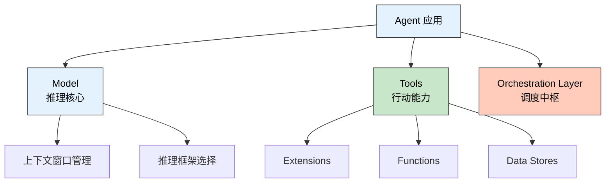
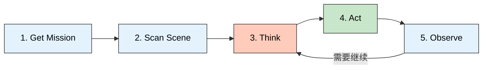

> 🎯 **一句话定位**：Google 官方白皮书 Day 1 精读，逐层拆解 Agent 架构的定义、组件与运行机制，并补上白皮书没讲的工程权衡。
>
> 💡 **核心理念**：Agent 不是"会调工具的模型"，而是一个以 LM 为推理核心、通过循环驱动完成目标的完整应用系统。理解 Agent 的关键不在于记概念，而在于理解每个设计决策背后的 Why。

---

## 白皮书背景与阅读定位

Google 和 Kaggle 联合推出了一门为期 5 天的 AI Agents 速成课程，配套一份完整的白皮书。整个课程的结构如下：

| 天数 | 主题 | 核心内容 |
|------|------|---------|
| Day 1 | Agent 基础架构 | 定义、组件、运行机制 |
| Day 2 | Agent 工具体系 | Extensions、Functions、Data Stores |
| Day 3 | 代码实践 | LangChain + Vertex AI 实战 |
| Day 4 | AgentOps | 评估、调试、持续优化 |
| Day 5 | 多 Agent 系统 | 高级架构与案例研究 |

### 为什么这份白皮书值得精读

2025 年 Agent 从概念炒作走向生产落地。无数团队在造 Agent，但大多数人停留在"调 API + 挂工具"的层面，对架构设计缺乏系统性理解。Google 的这份白皮书是目前最系统化的官方 Agent 定义之一，它的价值在于：

- **给出了精确的定义边界**：不是所有带 Function Calling 的应用都是 Agent
- **拆解了组件职责**：Model、Tools、Orchestration Layer 各自的工程挑战
- **建立了工具分类体系**：Extensions / Functions / Data Stores 的设计意图

但它也有明显的局限：对成本、可靠性、安全性、调试等生产级问题着墨甚少。这篇精读会在白皮书的基础上，补充工程视角的深度分析。

---

## Agent 的定义：不只是"会调工具的模型"

Google 给了一个非常精炼的定义：

> An AI Agent = combination of models, tools, orchestration layer, and runtime services which utilizes the LM **in a loop** to accomplish a goal.

这句话中最关键的词不是 "models"、不是 "tools"，而是 **"in a loop"**。

### "in a loop" 为什么如此重要

一个能调用工具的模型（比如 ChatGPT + Function Calling）和一个 Agent 之间的本质区别，就在于是否存在**自主循环**。

单次 Function Calling 的流程是线性的：用户提问 → 模型决定调哪个工具 → 调用 → 返回结果 → 模型生成回答。整个过程最多一次工具调用，决策链是确定的。

Agent 的流程是循环的：用户提出目标 → 模型规划步骤 → 执行第一步 → 观察结果 → 根据结果调整计划 → 执行下一步 → ……直到目标完成。**每一步的结果都影响下一步的决策**，整个过程是一个状态机。

这意味着：

- **错误会累积**：第三步的错误会被后续步骤放大
- **上下文会膨胀**：每一步的结果都塞进 context window
- **成本是非线性的**：循环次数不可预测，token 消耗可能远超预期

这些正是 Agent 工程化的核心挑战。

### 从 Predictive AI 到 Agentic AI 的范式转变

白皮书把 AI 的发展分成两个阶段：

- **Predictive AI**：模型接收输入，产生输出。一问一答，确定性流程
- **Agentic AI**：模型接收目标，自主规划并执行多步操作。循环驱动，非确定性流程

这不仅是营销术语的区别，而是根本性的架构差异。Predictive AI 的工程挑战是"怎么让单次推理更准"；Agentic AI 的工程挑战是"怎么让一个概率性系统在多步循环中保持可靠"。后者复杂了至少一个数量级。

### Agent vs Model：五个维度的本质区别

| 维度 | Model | Agent |
|------|-------|-------|
| 本质 | 推理引擎 | 完整应用系统 |
| 输出 | 文本 / 结构化数据 | 行动 + 可观测的副作用 |
| 外部连接 | 无（只有训练数据） | 有（API、数据库、文件系统） |
| 工作方式 | 单次问答 | 多步自主循环 |
| 失败模式 | 输出质量差 | 错误累积、无限循环、资源耗尽 |

**关键洞察**：一个能调用工具的模型不自动等于 Agent。Orchestration Loop 才是区分 Agent 和 "带工具的模型" 的分水岭。

---

## 三大组件的工程拆解

### Model：上下文窗口管理才是真正的工程挑战

白皮书把 Model 定义为"核心推理引擎"，但一笔带过了最重要的工程问题：**上下文窗口（Context Window）是有限资源**。

Agent 的每次循环都会产生新信息：工具返回结果、用户反馈、中间推理过程。这些东西全部塞进 context window，而 window 有上限。怎么管理这个有限空间，才是 Agent 工程的核心难题。

这个问题可以抽象为三个演化阶段：

1. **Prompt Engineering**：在固定空间里写出最好的指令（静态优化）
2. **Context Engineering**：动态决定每次调用塞什么信息进 window（运行时管理）
3. **Harness Engineering**：设计整个 Agent 框架的信息流架构（系统设计）

大部分 Agent 项目卡在第二阶段：context window 管理不当导致后期循环质量断崖式下降。常见症状包括：遗忘早期指令、重复调用相同工具、输出冗余信息。

### Tools：控制流和信任边界的设计决策

白皮书把工具分成三类（Extensions、Functions、Data Stores），但没讲清楚一个更深层的设计逻辑：**工具分类的本质是控制权分配**。

- **Extensions**：Agent 自主调用，控制权在 Agent。适合低风险、高频率的操作（搜索、读取）
- **Functions**：Agent 只生成调用意图，客户端执行。控制权在人类/系统。适合高风险操作（支付、写入）
- **Data Stores**：不是"行动工具"，而是知识层。改变的是 Agent 的认知，而非外部状态

这个视角比白皮书的分类更有工程指导意义。选工具类型时，首先问的不是"这个 API 能不能调"，而是"这个操作的控制权应该在谁手里"。

### Orchestration Layer：本质是一个状态机

白皮书说 Orchestration Layer 管理 Think → Act → Observe 循环。但在工程层面，这本质上是一个**有限状态机（FSM）**：

- 状态：当前任务进度、上下文摘要、工具可用性
- 转移条件：推理结果、工具返回、错误信号
- 终止条件：目标完成、资源耗尽、错误不可恢复

这与分布式系统中的经典模式高度相似：

- **Saga Pattern**：多步事务编排，每步有补偿逻辑 → Agent 的工具调用链
- **Event Sourcing**：所有状态变更记录为事件 → Agent 的执行轨迹
- **Actor Model**：独立实体通过消息通信 → 多 Agent 协作

理解这些类比，可以帮助我们借鉴分布式系统的成熟工程实践来构建 Agent。

---

## 运行循环：概念简单，工程复杂

白皮书给出了 Agent 运行的 5 步循环，每一步都很直觉。但"概念简单"不等于"工程简单"。让我们逐层分析每一步的工程挑战：

### Get Mission（接收任务）

看似简单的一步，实际上藏着意图理解的难题。用户说"帮我订明天去上海的机票"，Agent 需要理解：出发城市是哪里？偏好什么舱位？预算范围？"明天"是哪天？

**工程挑战**：模糊意图的消歧需要额外的 LLM 调用或用户交互，这增加了延迟和复杂度。

### Scan Scene（扫描环境）

这一步要收集所有可用信息：用户历史、工具状态、当前上下文。**Context Engineering 的核心工作就在这里**——决定哪些信息进入当前推理窗口。

**工程挑战**：信息过多导致 context window 溢出和注意力稀释；信息过少导致推理质量下降。这是一个动态平衡问题，没有静态最优解。

### Think（推理规划）

基于收集到的信息决定下一步。推理框架的选择（ReAct、CoT 等）直接影响这一步的质量。

**工程挑战**：推理框架不是银弹，不同任务需要不同框架，选择错误会导致效率低下或质量下降。

### Act（执行行动）

调用工具或生成输出。白皮书把这步描述得很轻松，但生产环境里工具调用经常失败：API 超时、权限不足、返回格式不符预期。

**工程挑战**：每个工具调用都需要错误处理、重试逻辑和超时机制。工具的健壮性直接决定 Agent 的可靠性。

### Observe（观察结果）

评估行动结果，决定是否继续。**这是大多数生产故障发生的地方**。

**工程挑战**：

- 怎么判断"目标已完成"？这是一个开放性问题，没有确定答案
- 怎么判断"当前路径失败需要转向"？需要元认知能力
- 怎么避免无限循环？需要设定循环次数上限和资源预算

### 常见故障模式

生产环境中 Agent 的典型故障模式包括：

- **无限循环**：Agent 反复执行相同操作，没有收敛到目标
- **工具错误级联**：一个工具返回错误，导致后续步骤全部基于错误信息推理
- **上下文溢出**：多轮循环后 context window 被历史信息填满，推理质量断崖式下降
- **目标漂移**：Agent 在执行过程中逐渐偏离原始目标

---

## 推理框架：ReAct vs CoT 的工程权衡

白皮书介绍了两种推理框架，但没深入分析它们的工程权衡。

### ReAct：为什么交织比纯规划更好

ReAct（Reasoning + Acting）的核心思想是：不一口气想完所有步骤再动手，而是**边想边做，做了再想**。Thought → Action → Observation 交织进行。

这种方式的优势是**适应性**：每一步的 Observation 都为下一步的 Thought 提供新信息。在信息不完全的情况下（Agent 启动时通常如此），这比纯规划更务实。

但 ReAct 有明显的工程弱点：

- **慢**：每个 Think → Act → Observe 循环至少一次 LLM 调用。10 步计划意味着 10+ 次 LLM 调用
- **循环倾向**：Agent 可能在两个 Action 之间反复切换而不收敛
- **工具失败脆弱性**：一个工具返回异常，后续的 Thought 基于错误信息，整个链条崩溃

### Chain of Thought：适合分析，不适合执行

CoT（Chain of Thought）要求模型显式写出推理步骤。它的优势是**推理可追溯**，每一步都有据可查。适合分析型任务（数学证明、逻辑推理），但不适合需要与环境交互的执行型任务。

### 什么时候用什么

| 任务类型 | 推荐框架 | 原因 |
|---------|---------|------|
| 信息检索与分析 | CoT | 不需要外部交互，纯推理 |
| 多步操作执行 | ReAct | 需要根据中间结果调整策略 |
| 混合任务 | ReAct + CoT | 规划阶段用 CoT，执行阶段用 ReAct |

### 白皮书没提到的推理框架

白皮书只介绍了 ReAct 和 CoT，但学术界还有更先进的框架：

- **Tree-of-Thought (ToT)**：把推理过程建模为搜索树，支持回溯。适合复杂决策场景
- **Reflexion**：Agent 对自己的输出做自我批评，并据此改进。适合需要自我纠错的场景
- **LATS (Language Agent Tree Search)**：结合 MCTS 和 LLM，在推理空间中做蒙特卡洛搜索。最先进但最昂贵

这些框架在特定场景下比 ReAct 强得多，但工程复杂度也成倍增加。

---

## 工具分类：控制权的设计决策

白皮书把 Agent 的工具做了系统分类，但背后的设计逻辑比表面看到的更深。

### 三类工具对比

| 维度 | Extensions | Functions | Data Stores |
|------|-----------|-----------|-------------|
| 执行位置 | Agent 端 | 客户端 | 向量数据库 |
| 调用方式 | Agent 直接调用 API | 返回 JSON 给客户端执行 | RAG 检索 |
| 控制权 | Agent 自主 | 人类/系统把关 | 知识层（只读） |
| 信任等级 | 高（已授权） | 低（需确认） | N/A |
| 核心优势 | 多步骤规划流畅 | 安全、权限控制好 | 减少幻觉 |
| 典型场景 | 搜索、邮件发送 | 支付、数据写入 | 企业知识库 |
| 人机协作 | 无需人工介入 | 支持 Human-in-the-loop | 无需人工介入 |

### 这是控制面板（Control Plane）的设计

把三类工具放在一起看，你会发现它们构成了一个**控制平面**：

- Extensions 是"全自动驾驶"——Agent 自己决定、自己执行
- Functions 是"半自动驾驶"——Agent 决定，人类确认后执行
- Data Stores 是"增强感知"——不改变控制流，只增强 Agent 的认知

这个视角比白皮书的分类更有工程指导意义。设计 Agent 时，应该先画出控制流图，标注每个节点的信任等级和风险级别，然后据此选择工具类型。

### Data Stores 的架构特殊性

Data Stores（RAG）与另外两类工具有本质区别：它不是"行动工具"，而是**知识层**。它不改变外部世界的状态，只改变 Agent 对问题的理解。

这意味着 Data Stores 可以与其他工具类型自由组合，不需要担心副作用冲突。但它引入了另一个工程挑战：**检索质量直接决定推理质量**。检索到错误的信息比没有信息更危险，因为 Agent 会基于错误信息自信地做出错误决策。

---

## 学习方式：三种递进的工程成本

| 方式 | 原理 | 零训练成本 | 知识上限 | 工程成本 | 适用阶段 |
|------|------|-----------|---------|---------|---------|
| In-Context Learning | Prompt + Few-shot | ✅ 即时生效 | 受窗口限制 | 极低 | 快速原型 |
| Retrieval-Based | 向量数据库检索 | ✅ 动态更新 | 受检索质量限制 | 中等 | 生产环境 |
| Fine-Tuning | 微调模型权重 | ❌ 需训练数据 | 深度定制 | 极高 | 特定领域 |

### 80% 的生产 Agent 停在前两层

实践中，绝大多数生产级 Agent 只需要 In-Context Learning + RAG 就够了。Fine-Tuning 很少被用到，原因很简单：

- **成本不成比例**：Fine-Tuning 需要高质量数据集、GPU 时间、评估流程
- **更新困难**：知识变了要重新训练，而 RAG 只需要更新向量库
- **灵活性差**：微调后的模型在领域外任务上表现可能退化

这三种方式不是互斥的，而是递进的。推荐的实践路径是：先用 In-Context Learning 验证可行性 → 引入 RAG 扩展知识边界 → 只在确认必要时才 Fine-Tune。

每一层的工程成本是指数级增长的，但边际收益是递减的。

---

## AgentOps：从 Demo 到生产的鸿沟

白皮书后半部分讲 AgentOps，是从原型到生产的关键跨越。

### LM-as-Judge：谁来评估评估者

白皮书推荐用另一个 LM 来评估 Agent 的输出质量。这比人工评估高效得多，但它引入了一个元问题：**谁来评估评估者？**

LM-as-Judge 的校准挑战包括：

- **位置偏见**：LLM 倾向于给排在前面的选项更高评分
- **冗长偏见**：更长的回答往往获得更高评分，即使质量不如简洁的回答
- **自我偏好**：某些模型倾向于给自己风格的输出更高评分
- **一致性**：同一个 Judge 对同一个输入多次评分可能不一致

实践建议：不要用单一维度评分，而是定义结构化的评估 Rubric（评分标准），包含多个独立维度，每个维度有明确的评分锚点。

### OpenTelemetry：为什么 Agent 比传统软件更需要 Trace

白皮书推荐用 OpenTelemetry 做 Agent 的 trace 追踪。这对 Agent 来说比传统软件更关键，原因是：

传统软件的调用链是确定性的——相同的输入产生相同的调用链。Agent 的调用链是概率性的——相同的输入可能产生完全不同的执行路径。这意味着你**不能通过复现来调试**，必须依赖 trace 记录来还原完整执行过程。

每一步 Think、Act、Observe 都应该打上 span，记录：

- 输入上下文的摘要（不是全部内容，太大了）
- 推理结果和置信度
- 工具调用参数和返回值
- 循环次数和资源消耗

### 学习闭环：概率性软件的 DevOps

AgentOps 的核心理念是形成学习闭环：收集用户反馈 → 分析失败案例 → 优化 Prompt / 工具 → 再次评估。

这本质上是**概率性软件的 DevOps**。传统 DevOps 关注的是确定性系统的可靠性（崩溃恢复、扩缩容），AgentOps 关注的是概率性系统的质量（输出准确性、目标完成率）。

### Agent Gym：模拟评估的局限性

Google 提出了 "Agent Gym" 的概念：在模拟环境中大量测试 Agent 的各种边界情况。这是个好方向，但有局限：

- **模拟保真度有限**：模拟环境无法完全复现生产环境的复杂性
- **评估覆盖度不足**：你只能测试你能想到的边界情况
- **Sim-to-Real Gap**：在模拟中表现好的策略，在生产环境可能失效

---

## 进阶案例的架构拆解

白皮书最后展示了两个前沿案例，值得从架构视角分析。

### Google Co-Scientist：Supervisor 模式

这是一个多 Agent 协作系统，用于辅助科学研究。架构由四类 Agent 组成：

- **Supervisor Agent**：分配任务、协调流程
- **Generation Agent**：生成假设和方案
- **Reflection Agent**：审查和批判生成结果
- **Ranking Agent**：评估和排序最终方案

这是经典的 **Supervisor Pattern**：一个"管理者"Agent 协调多个"专家"Agent。它的优势是职责分离，劣势是：

- **通信开销**：Agent 之间传递信息需要序列化到文本，信息损失不可避免
- **错误级联**：Supervisor 分配任务错误，所有下游 Agent 的工作都白费
- **调试困难**：出问题时需要回放多个 Agent 的完整交互链

### AlphaEvolve：进化式代码生成

AlphaEvolve 采用进化论思路：用 LLMs Ensemble 生成候选解，再用 Evaluators Pool 评估，不断迭代进化。

这连接到了程序合成（Program Synthesis）的研究传统。AlphaEvolve 的创新在于用 LLM 替代了传统的搜索策略（如遗传算法的交叉和变异），使得搜索空间更加语义化。但在实践中，这种方法的瓶颈在于 **Evaluator 的质量**——评估函数设计不好，进化方向就会偏。

---

## 我的思考：白皮书没有讲的

白皮书给出了 Agent 的系统化定义，但有几个关键的生产级问题几乎没有涉及。

### 成本问题

每轮循环消耗 token，自主 Agent 的成本可能远超预期。一个 10 步的 ReAct 循环，如果每步平均消耗 2000 token（包含 context），总共就是 20000 token。如果某步触发工具错误需要重试，成本还要翻倍。

对于高并发场景，一个"自主 Agent"可能比传统的确定性行车贵 10-100 倍。**成本预算应该成为 Agent 设计的一等公民**。

### 可靠性

Agent 是概率性系统。同一个任务执行 10 次，可能得到 10 个不同的结果。在生产环境中，这意味着：

- 需要设定执行次数上限和资源预算
- 需要定义"可接受的失败率"阈值
- 需要 Fallback 机制：当 Agent 失败时，降级到确定性流程

传统的"五个九"可靠性工程在 Agent 语境下需要重新定义。

### 安全性

带工具访问的 Agent 是一个**攻击面**。Prompt Injection 可以让 Agent 执行非预期的工具调用。一个有文件系统访问权限的 Agent，如果被注入了恶意指令，可能删除重要数据。

白皮书几乎没有讨论这个问题。在实践中，安全边界应该通过工具权限、调用审批、沙箱执行等多层机制来保障。

### 调试难度

一个 10 步执行计划，在第 3 步出错。你需要：

1. 回放完整的执行轨迹
2. 找到第 3 步的输入上下文
3. 理解为什么模型在那个上下文下做出了错误决策
4. 修改 Prompt 或工具逻辑
5. 重新测试

这个过程比调试传统代码难一个数量级，因为"错误"不是确定性的，而是概率性的。

### 评估标准缺失

行业仍缺乏标准化的 Agent 评估基准。我们不知道怎么客观比较两个 Agent 系统的优劣。现有评估要么太简单（单一任务通过率），要么太复杂（需要人工评审）。

这个问题不解决，Agent 工程化就缺乏科学的进步基础。

---

## 总结

### 核心要点

1. **Agent ≠ Model + Tools**。Agent = Model + Tools + Orchestration Loop + Runtime。"in a loop" 是关键区分点
2. **上下文窗口管理是 Agent 工程的核心挑战**，比推理质量更影响整体表现
3. **工具分类的本质是控制权分配**：Extensions = Agent 自主，Functions = 人类把关，Data Stores = 知识增强
4. **ReAct 适合执行，CoT 适合分析**，选择错误的框架比没有框架更糟
5. **AgentOps 不是可选项**，是从 Demo 到生产的必经之路

### 如果你只记住三件事

1. **循环是本质**。没有自主循环的"Agent"只是一个带工具的模型。循环带来了适应性，也带来了所有工程难题
2. **Context 是瓶颈**。Agent 的能力上限不是模型的推理能力，而是 context window 里能塞多少有用信息
3. **控制权是设计核心**。工具选型、安全边界、失败恢复，本质上都是在回答"谁在控制"这个问题

### 相关资源

- Kaggle 课程地址：[5-Day Gen AI Intensive Course](https://www.kaggle.com/learn-guide/5-day-gen-ai-intensive)
- Google 白皮书原文：课程配套 PDF
- Day 2 笔记：（待更新）
- Day 3 Notebook 实战：（待更新）

---

## 更新记录

| 版本 | 日期 | 说明 |
|------|------|------|
| v1.0 | 2026-03-31 | 初始版本 |
| v2.0 | 2026-03-31 | 重写为精读版，增加深度分析与工程视角 |
