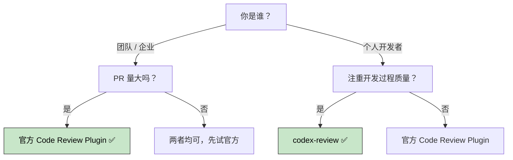
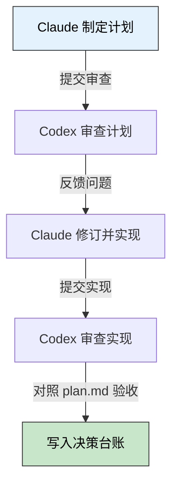

> 🎯 **一句话定位**：两款插件解决的是同一问题的不同阶段——一个守 PR 的门，一个管开发的过程。
>
> 💡 **核心理念**：在 AI 大量产出代码的时代，代码审查本身也需要 AI 来分层把关。

---

## 📖 3 分钟速览版

<details>
<summary><strong>📊 点击展开：对比速览 + 选型决策树</strong></summary>

### 核心对比

| 维度 | 官方 Code Review Plugin | codex-review |
|------|------------------------|--------------|
| **来源** | Anthropic 官方 | 社区开发者（boyand） |
| **定位** | 企业级 PR 质量门控 | 开发过程双模型交叉验证 |
| **触发时机** | PR 提交后，合并前 | 编码过程中每个关键节点 |
| **运行模型** | Claude 单模型多 Agent | Claude + Codex 双模型 |
| **输出形式** | GitHub PR 评论 | 本地磁盘文件 + 决策台账 |
| **目标用户** | 团队 / 企业 | 个人开发者 |
| **订阅要求** | Teams / Enterprise | OpenAI API key 或 ChatGPT 订阅 |

### 选型决策树



<details>
<summary>**🖼️ 插图版（2026-04-17 增量补充）**</summary>


</details>

推荐方案：两者叠加使用，开发期间用 `codex-review` 把好每步决策，提 PR 时用官方插件做最终把关。

</details>

---

## 背景：AI 产出爆炸，Review 成为瓶颈

Claude Code 等 AI 编程工具让开发效率大幅提升，但随之而来的是 PR 数量的爆炸式增长。Anthropic 在发布官方 Code Review 插件时直接点明："这个产品专门针对大规模企业用户，他们已经在用 Claude Code，现在需要应对它产生的海量 PR Review 需求。"

与此同时，社区也涌现出专注于开发过程中双模型交叉验证的工具，`codex-review` 就是其中之一。

两款插件分别从不同维度切入了同一痛点——如何在 AI 产出爆炸的时代，保持代码质量的可控性。

---

## 使用场景详解

### 官方 Code Review Plugin：PR 的守门员

核心机制是 5 个独立 Agent 并行扫描变更，各自负责不同视角：

- CLAUDE.md 合规检查
- Bug 检测
- Git 历史上下文分析
- 历史 PR 评论回顾
- 代码注释核查

每条发现都会被打 0-100 的置信度分，默认只有分数 ≥ 80 的问题才会输出，大幅减少噪音。结果以一条高信号汇总评论 + 行级内联评论的形式发布到 GitHub PR 上，不阻断现有 Review 流程。

**适合以下场景**：

- 团队每天合并数十个 AI 生成的 PR，人工 Review 跟不上节奏
- 需要统一的安全合规检查门控
- 想在不改变现有 GitHub 工作流的前提下提升 Review 质量
- Enterprise 用户需要批量处理跨仓库的 Review 需求

在仓库中添加 `REVIEW.md` 或 `CLAUDE.md` 即可自定义检测策略。

**前置要求**：需要 Claude Code Teams 或 Enterprise 订阅，由管理员在仓库级别开启。

---

### codex-review：开发过程中的双模型闭环

核心机制是将 Claude 和 Codex 组成一个互相挑剔的协作循环：



<details>
<summary>**🖼️ 插图版（2026-04-17 增量补充）**</summary>


</details>

每一轮 Review 结果都落盘，并维护一份标准化的决策记录台账，全程可溯源。

**适合以下场景**：

- 设计复杂功能时，想在动手写代码前让第二个模型审查方案
- 需要对照原始 `plan.md` 验证最终实现是否偏离设计意图
- 想保留每轮 Review 历史用于个人复盘和溯源
- 探索多模型协作工作流的个人开发者

**前置要求**：需要 OpenAI API key 或 ChatGPT 订阅（含免费层），以及 Node.js 18.18+。

---

## 快速上手

### 官方 Code Review Plugin

官方插件由管理员在 Claude Code 后台启用，无需手动安装。启用后在 PR 分支执行：

```bash
/code-review
```

在仓库根目录添加 `REVIEW.md` 指定审查重点：

```markdown
## Review 重点

- 重点检查 API 权限边界
- 关注数据库查询 N+1 问题
- 验证所有用户输入均已完成校验
```

### codex-review

通过 Claude Code 插件机制安装，具体步骤参考仓库 README（github.com/boyand/codex-review）。安装后的基本用法：

```bash
# 审查当前计划（plan 阶段）
/codex-review plan

# 审查实现是否符合计划（impl 阶段）
/codex-review impl
```

每次调用结果自动写入本地磁盘，Claude Code 会话中可随时查阅决策台账。

---

## 组合使用：两者并不冲突

两款插件解决的是代码质量保障链条的不同环节，完全可以叠加使用：

- **开发期间** → 用 `codex-review` 保证每步决策质量，让 Claude 和 Codex 互相挑毛病
- **提 PR 时** → 用官方插件做最终把关，过滤漏网的 Bug 和合规问题

这与传统软件工程中"开发自测 + CI 门控"的分层质量保障理念一脉相承。

---

## 常见问题（FAQ）

### Q1：codex-review 和 OpenAI 官方 codex-plugin-cc 有什么区别？

`codex-plugin-cc` 是 OpenAI 官方发布的插件，提供 `/codex:review`、`/codex:adversarial-review` 等 6 个命令，还有 Review Gate 功能（自动拦截有问题的输出）。而 `codex-review`（boyand）是社区作品，专注于"计划→审查→实现→审查"的多轮闭环，侧重过程验证而非单次 Review。

### Q2：官方 Code Review Plugin 是自动触发还是手动触发？

取决于管理员配置。默认支持手动触发（`/code-review`），也可配置为在 PR 创建或更新时自动触发。已关闭、草稿状态、自动化 PR 或已完成 Review 的 PR 会被自动跳过。

### Q3：codex-review 会影响 Claude Code 的正常工作流吗？

不会。它以插件形式运行，仅在主动调用时生效，不干预正常的 Claude Code 交互。每轮结果写入本地磁盘，不会自动推送或修改代码。

### Q4：个人开发者没有 Teams 订阅，有替代方案吗？

官方 Code Review Plugin 确实需要 Teams 或 Enterprise 订阅。个人开发者可以使用 `codex-review`（boyand）或 OpenAI 官方的 `codex-plugin-cc`，后者只需 ChatGPT 免费订阅或 OpenAI API key 即可使用。

### Q5：官方插件的置信度阈值（默认 80）可以调整吗？

可以。在仓库的 `CLAUDE.md` 或 `REVIEW.md` 中配置检测策略，包括调整置信度阈值、指定重点检查路径或忽略某类问题。降低阈值会发现更多潜在问题，但误报率也会相应上升，建议根据团队实际情况调整。

---

## 总结

### 核心要点

1. 官方插件是**团队协作工具**，面向 PR 流水线的批量质量管控，降低人工 Review 负担
2. codex-review 是**个人开发工具**，专注开发决策过程的多轮双模型交叉验证
3. 两者定位不同，组合使用可覆盖从编码到发布的完整质量链条

### 行动建议

#### 今天就可以做的

- 个人开发者：安装 `codex-plugin-cc` 或 `codex-review` 体验双模型 Review
- 团队 / 企业：评估 Claude Code Teams 计划，在一个仓库先开启官方 Code Review Plugin 试水

#### 本周可以优化的

- 在仓库中建立 `REVIEW.md`，定制审查关注重点（安全、性能、合规等）
- 尝试在开发复杂功能时引入双模型验证，对比与纯单模型的体验差异

---

## 更新记录

| 版本 | 日期 | 说明 |
|------|------|------|
| v1.0 | 2026-04-02 | 初始版本 |
| v1.1 | 2026-04-02 | 补充速览版、FAQ、快速上手和行动建议 |
| v1.2 | 2026-04-17 | 为 2 个 Mermaid 图表追加 Chiikawa 风格插图（m2c-pipeline 生成） |
