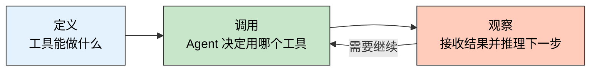
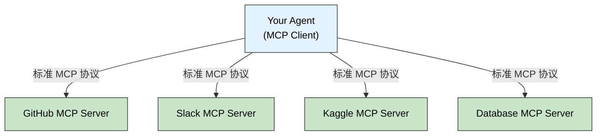
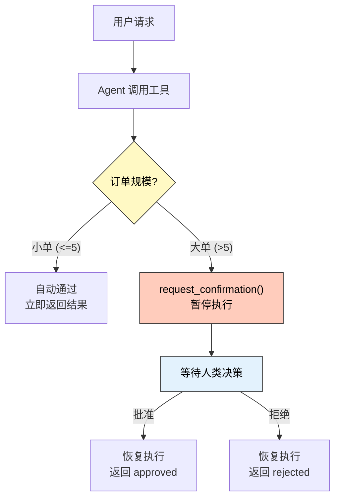
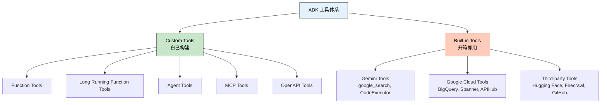

> **一句话定位**：Day 1 定义了 Agent 是什么，Day 2 回答"Agent 怎么连接外部世界"——从自定义函数到 MCP 开放协议，从即时调用到人机协作的长时运行，拆解工具体系的设计哲学与工程模式。
>
> **核心理念**：工具不是 Agent 的附件，而是它的能力边界。没有工具的 Agent 只是一个知识冻结的问答模型；有了工具，Agent 才能检索实时信息、执行真实操作、与外部系统交互。

---

## 为什么 Day 2 值得精读

回顾 5 Days 学习地图，Day 2 是从"理解 Agent"到"构建 Agent"的转折点：

| 天数 | 主题焦点 | 你会建立的认知 |
|------|----------|----------------|
| Day 1 | Agent 基础架构 | Agent 的定义、组件与运行循环 |
| **Day 2** | **Tools** | **Agent 如何连接外部世界与知识** |
| Day 3 | Build | 如何把架构变成可运行原型 |
| Day 4 | Evaluate | 如何评估、调试与持续改进 |
| Day 5 | Production / Multi-Agent | 如何把原型推进到真实系统 |

Day 1 白皮书把工具称为 Agent 的"双手"（The "Hands" of your AI Agent），并给出了一句精辟的定义：

> If the model is the agent's brain, tools are the hands that connect
> its reasoning to reality.

Day 2 的价值，就是把这句话拆开来讲清楚：**工具到底有哪些类型？怎么设计一个好的工具？怎么让 Agent 和外部世界安全地交互？**

### Day 2 的素材结构

与 Day 1 不同，Day 2 没有专门的白皮书。内容分散在三处：

| 素材 | 内容 | 定位 |
|------|------|------|
| Introduction to Agents 白皮书 p20-25 | Tools / Function Calling / MCP 理论 | 概念框架 |
| Agents Companion 白皮书 p33-37 | Agentic RAG 进阶 | 知识层深度 |
| Day 2a + Day 2b Notebook | ADK 工具实战全景 | 工程实践 |

这篇精读会将三者编织在一起：白皮书提供理论框架，Notebook 提供实战验证。

---

## 为什么 Agent 需要工具

白皮书开篇就点明了问题：没有工具的 Agent，知识冻结在训练时间。它不知道今天的天气、你公司的库存、最新的汇率。更重要的是，它**无法替你做事**——不能发邮件、不能查数据库、不能完成交易。

工具把 Agent 从"会说"变成"能做"。白皮书把工具的工作方式抽象为三部分循环：



白皮书进一步把工具的用途分为两大类：

- **检索信息（Grounding in Reality）**：RAG、向量数据库、Knowledge Graph、NL2SQL——让 Agent 基于事实而非猜测做决策
- **执行动作（Changing the World）**：API 调用、代码执行、发邮件、更新数据库——让 Agent 不只回答问题，还能完成任务

这两类的核心区别在于：检索是**只读**的，执行是**有副作用**的。这个区别直接决定了后面工具设计中的信任等级和控制流。

---

## Custom Function Tools：把 Python 函数变成 Agent 工具

Day 2a Notebook 用一个核心观点开场：
**任何 Python 函数都可以成为 Agent 工具**。
ADK 不需要复杂的注册机制，
只要把函数加到 `tools=[]` 列表里，
框架自动处理剩下的事。

但"能成为工具"和"成为好的工具"是两码事。Notebook 给出了四条最佳实践：

### 四条工具设计黄金法则

| 法则 | 做法 | 为什么重要 |
|------|------|-----------|
| Dict 返回 | `{"status": "success", "data": ...}` | LLM 能结构化理解结果，区分成功/失败 |
| 清晰 Docstring | 写明用途、参数含义、返回格式 | **LLM 用 docstring 决定何时调用这个工具** |
| Type Hints | `def func(amount: float, currency: str) -> dict` | ADK 据此生成正确的 JSON Schema |
| 错误处理 | `{"status": "error", "error_message": "..."}` | Agent 能优雅地处理失败而非崩溃 |

其中 **Docstring** 最关键。它不是给人看的文档，
而是给 LLM 看的"使用手册"——
LLM 读 docstring 来判断"这个问题应该用哪个工具"。
Docstring 写得模糊，Agent 就会选错工具。

### 实战：货币转换 Agent

Notebook 用一个货币转换场景演示了完整流程：

```python
def get_exchange_rate(base_currency: str, target_currency: str) -> dict:
    """Looks up and returns the exchange rate between two currencies.

    Args:
        base_currency: The ISO 4217 currency code of the currency you
                       are converting from (e.g., "USD").
        target_currency: The ISO 4217 currency code of the currency you
                         are converting to (e.g., "EUR").

    Returns:
        Dictionary with status and rate information.
        Success: {"status": "success", "rate": 0.93}
        Error: {"status": "error", "error_message": "Unsupported currency pair"}
    """
    rate_database = {"usd": {"eur": 0.93, "jpy": 157.50, "inr": 83.58}}
    base, target = base_currency.lower(), target_currency.lower()
    rate = rate_database.get(base, {}).get(target)
    if rate is not None:
        return {"status": "success", "rate": rate}
    return {"status": "error", "error_message": f"Unsupported: {base}/{target}"}
```

注意这个函数满足了所有四条法则。Agent 的 instruction 引用工具的**函数名**来指导调用：

```python
currency_agent = LlmAgent(
    name="currency_agent",
    model=Gemini(model="gemini-2.5-flash-lite"),
    instruction="""For currency conversion requests:
    1. Use `get_fee_for_payment_method()` to find transaction fees
    2. Use `get_exchange_rate()` to get currency conversion rates
    3. Check the "status" field in each tool's response for errors
    4. Calculate the final amount after fees...""",
    tools=[get_fee_for_payment_method, get_exchange_rate],
)
```

---

## Agent as Tool：用代码执行解决 LLM 算数弱点

Day 2a 揭示了一个重要问题：**LLM 不擅长算数**。让模型"心算" `1237.5 * 83.58` 可能得到错误结果。

解决方案是 **Agent as Tool** 模式：
用一个专门的 Agent 生成 Python 代码来计算，
再用 `BuiltInCodeExecutor` 在沙箱中执行。

```python
calculation_agent = LlmAgent(
    name="CalculationAgent",
    model=Gemini(model="gemini-2.5-flash-lite"),
    instruction="You ONLY respond with Python code. Generate code that calculates and prints the result.",
    code_executor=BuiltInCodeExecutor(),
)

# 主 Agent 把计算 Agent 当工具用
enhanced_currency_agent = LlmAgent(
    tools=[
        get_fee_for_payment_method,
        get_exchange_rate,
        AgentTool(agent=calculation_agent),  # Agent 作为工具
    ],
)
```

### AgentTool vs Sub-Agent：这里先记控制权差异

这一组概念在 Day 1 已经展开过，
这里先记最实用的判断标准就够了：

- **调用完还要由当前 Agent 继续推进任务**：更接近 `AgentTool`
- **调用后直接把后续交互和控制权交出去**：更接近 `Sub-Agent`

如果你想看更完整的控制权解释，可以回到
[Day 1：Agent 基础架构](./2026-03-31-kaggle-google-agent-5days-day1-whitepaper-reading.md)。

---

## Function Calling：连接工具的标准契约

白皮书 p22 点明了一个工程现实：Agent 要可靠地调用工具，需要**标准化的契约**。工具必须告诉 Agent：我叫什么、需要什么参数、会返回什么。

这个契约有三种实现方式：

| 方式 | 原理 | 优势 | 适用场景 |
|------|------|------|---------|
| **OpenAPI** | 从 API 规范自动生成工具 | 无需手写代码，规范即工具 | 已有 REST API 的系统 |
| **MCP** | 开放协议，标准化发现与调用 | 社区生态，即插即用 | 连接外部服务（GitHub、Slack） |
| **Native Tools** | 模型内置能力 | 零配置，调用即 LM 推理的一部分 | Google Search、代码执行 |

白皮书特别强调了 MCP 的崛起：
"For simpler discovery and connection to tools,
open standards like the Model Context Protocol (MCP)
have become popular because they are more convenient."

---

## MCP：连接外部世界的开放协议

Day 2b Notebook 用了整整一个 Section 来讲 MCP。它的核心理念很简单：**不要为每个外部服务手写集成代码，用标准协议一次解决**。

### MCP 架构



在协议层看，不同 MCP Server 会更像一组统一接口。
这不代表它们的能力、稳定性和权限模型真的完全一致，
但至少 Agent 不需要为每一个外部服务都重新学习一套接线方式。

### ADK 中的 MCP 集成

Notebook 演示了连接 MCP Server 只需要几行代码：

```python
from google.adk.tools.mcp_tool.mcp_toolset import McpToolset
from google.adk.tools.mcp_tool.mcp_session_manager import StdioConnectionParams
from mcp import StdioServerParameters

mcp_tools = McpToolset(
    connection_params=StdioConnectionParams(
        server_params=StdioServerParameters(
            command="npx",
            args=["-y", "@modelcontextprotocol/server-everything"],
        ),
        timeout=30,
    ),
    tool_filter=["getTinyImage"],  # 只暴露需要的工具
)
```

背后发生了什么：ADK 启动 MCP Server 进程 → 建立 stdio 通信 → Server 告诉 ADK "我提供哪些工具" → Agent 像使用本地函数一样调用它们。

### 示例性的 MCP Server 类型

与其背一张"推荐清单"，更值得记的是三类常见接入对象：

| 类型 | 例子 | 适合场景 |
|------|------|---------|
| 数据与内容平台 | Kaggle MCP | 搜索数据集、访问 Notebook |
| 协作平台 | GitHub MCP | PR、Issue、仓库上下文分析 |
| 教学 / 验证用 | Everything MCP | 本地验证 MCP 协议链路 |

具体 Server 的连接方式、认证模式和可用工具，建议始终以各自的官方 README 或文档为准。

---

## Long-Running Operations：人机协作的工程模式

白皮书 p21 提到，Agent 的工具不只是立即返回的函数调用。有一类场景需要 **Human-in-the-Loop (HITL)**：Agent 暂停执行，等待人类确认后再继续。

Day 2b Notebook 把这个概念落地为完整的工程模式。

### 什么时候需要 LRO

- 金融交易需要审批
- 批量操作需要确认（删除 1000 条记录）
- 合规检查点
- 不可逆操作（永久删除账户）

### 完整流程



### 关键机制：ToolContext

Notebook 演示了 `ToolContext` 的两个核心能力：

```python
def place_shipping_order(
    num_containers: int, destination: str, tool_context: ToolContext
) -> dict:
    # 小单：直接通过
    if num_containers <= LARGE_ORDER_THRESHOLD:
        return {"status": "auto_approved", "order_id": f"ORD-{num_containers}-AUTO"}

    # 大单第一次调用：请求确认
    if not tool_context.tool_confirmation:
        tool_context.request_confirmation(
            f"Approve shipping {num_containers} containers to {destination}?"
        )
        return {"status": "pending", "message": "Awaiting approval"}

    # 大单恢复调用：检查人类决策
    if tool_context.tool_confirmation.confirmed:
        return {"status": "approved", "order_id": f"ORD-{num_containers}-HUMAN"}
    return {"status": "rejected", "reason": "Human declined"}
```

### 状态持久化：App + ResumabilityConfig

普通的 `LlmAgent` 是无状态的——暂停后无法恢复。需要用 `App` 包装并启用 `ResumabilityConfig`：

```python
from google.adk.apps.app import App, ResumabilityConfig

shipping_app = App(
    agent=shipping_agent,
    name="shipping_coordinator",
    resumability=ResumabilityConfig(enabled=True),
)
```

恢复时，通过相同的 `invocation_id` 告诉 ADK"恢复这次执行，而不是开始新的"。

---

## Agentic RAG：从静态检索到自主检索

Agents Companion 白皮书 p33-37 介绍了一个重要的进化概念：**Agentic RAG**。

传统 RAG 是静态的——一次查询、一次检索、一次生成。但面对模糊、多步、多视角的查询时，静态 RAG 经常失败。

Agentic RAG 引入了**自主检索 Agent**，让检索过程本身变得智能：

| 能力 | 传统 RAG | Agentic RAG |
|------|---------|-------------|
| 查询方式 | 单次查询 | **Context-Aware Query Expansion**：生成多个查询细化 |
| 推理方式 | 单步检索 | **Multi-Step Reasoning**：分解复杂查询为逻辑步骤 |
| 数据源 | 固定向量库 | **Adaptive Source Selection**：动态选择最佳知识源 |
| 质量保障 | 无 | **Validation and Correction**：交叉验证减少幻觉 |

### Better Search, Better RAG

白皮书还给出了提升 RAG 质量的工程实践清单：

1. **Parse & Chunk**：用 Vertex AI Layout Parser 处理复杂文档布局
2. **添加 Metadata**：同义词、关键词、日期、标签——让检索更精准
3. **微调 Embedding 模型**：让向量空间更贴合你的领域
4. **使用 Ranker**：向量搜索快但粗，需要 re-ranking 保证 top-k 质量
5. **Check Grounding**：验证每句生成的话是否真的可以被检索到的文档支持

---

## ADK 工具体系全景图

Day 2a Notebook Section 4 给出了 ADK 完整的工具分类：



### 八类工具速查

| 工具类型 | 定义 | 何时使用 |
|---------|------|---------|
| **Function Tools** | Python 函数 → Agent 工具 | 自定义业务逻辑 |
| **Long Running Function Tools** | 需要长时间或人类介入的函数 | 审批流、文件处理 |
| **Agent Tools** | 其他 Agent 作为工具 | 委派专门子任务 |
| **MCP Tools** | MCP 协议连接外部服务 | 接入社区生态（GitHub、Slack） |
| **OpenAPI Tools** | 从 API 规范自动生成 | 已有 REST API 的系统 |
| **Gemini Tools** | Gemini 内置能力 | 搜索、代码执行 |
| **Google Cloud Tools** | GCP 服务连接 | 企业级数据库、API |
| **Third-party Tools** | 第三方工具生态 | 复用已有工具投资 |

---

## 白皮书 vs Notebook：控制权视角与实现视角

如果你刚读完 Day 1，这里最容易混淆的一点是：
白皮书和 Notebook 看起来都在"给工具分类"，
但它们解决的其实不是同一个问题。

在 [Day 1：Agent 基础架构](./2026-03-31-kaggle-google-agent-5days-day1-whitepaper-reading.md)
里，`Extensions / Functions / Data Stores`
回答的是**控制权应该放在哪**；
而 Day 2 的 ADK Notebook 里，
`Function Tools / MCP Tools / OpenAPI Tools / Long Running Tools`
回答的是**工具具体怎么接进框架**。

可以把两者理解成一组**近似对照**，而不是严格映射：

| Day 1 视角 | 更接近的 Day 2 / ADK 实现 | 说明 |
|-----------|---------------------------|------|
| **Extensions** | Function Tools、MCP Tools、部分 Gemini Tools | 共同点是 Agent 往往能直接决定何时调用 |
| **Functions** | Long Running Function Tools，或任何需要客户端/人工把关的接入方式 | 重点不在名字，而在执行权是否仍留在系统一侧 |
| **Data Stores** | RAG、只读知识接入、部分数据查询工具 | 它更像知识层，不等于某一个单独的 ADK 类 |

所以最稳的读法不是硬背映射表，
而是先问自己：**我现在讨论的是控制权，还是实现方式？**

白皮书还提到了一个重要的设计光谱：**Agent 的自主度**。

一端是确定性工作流（用代码硬编码每一步），
另一端是完全自主（LLM 自行决定用哪个工具、按什么顺序）。
白皮书建议：生产级框架应该支持**混合模式**——
"a hybrid approach where the non-deterministic reasoning of an LM
is governed by hard-coded business rules."

---

## 工具设计的工程反思

课程内容给出了工具的全景图，但几个关键的工程问题值得深入思考：

### 工具描述质量决定 Agent 行为

这是 Day 2 最重要的工程洞察：
**Agent 选择工具的依据是 docstring 和参数描述，
而不是代码逻辑**。如果两个工具的描述相似，
Agent 可能选错。如果描述模糊，
Agent 可能在不该用的时候用。

这意味着工具描述应该被当作**Agent 的 API 文档**来认真对待，而不是随便写的注释。

### MCP 生态的成熟度

MCP 协议本身很优雅，但生态仍在早期。大多数 MCP Server 是社区维护的，质量参差不齐。生产环境中使用 MCP 需要额外考虑：连接稳定性、错误处理、安全审计。

### LRO 的超时与幂等性

Notebook 的 LRO 示例假设人类会在合理时间内响应。
但在生产中：如果审批者 3 天没回复怎么办？
如果恢复时工具被调用了两次怎么办？
超时机制和幂等性设计是 LRO 落地的必答题。

### 工具数量与选择困难

当 Agent 有 2-3 个工具时，选择很准确。当工具增加到 20+ 个时，LLM 的选择准确率会下降。这是一个实践中常见但课程没有讨论的问题。解法包括：工具分组、分层选择、动态加载。

---

## 总结：我从 Day 2 带走的认知锚点

1. **工具是 Agent 的能力边界**。没有工具，Agent 只是一个聊天框；有了工具，Agent 才能检索、执行、与世界交互。

2. **Docstring 不是注释，是 Agent 的工具说明书**。
   LLM 用 docstring 决定何时、如何调用工具。
   工具描述的质量直接决定 Agent 的行为质量。

3. **MCP 是当前最值得持续关注的工具连接方向之一**。从手写集成代码到标准化协议，它让 Agent 更有机会以统一方式接入外部服务生态。

4. **Long-Running Operations 解锁了人机协作**。
   不是所有操作都能立即完成。
   `request_confirmation` + `ResumabilityConfig`
   让 Agent 能暂停等待人类决策，然后恢复执行。

5. **工具分类至少有两个视角**：白皮书的控制权视角和 ADK 的实现视角并不冲突，但也不能硬套成一张严格映射表。

---

## Day 3 值得期待什么

如果说 Day 2 解决的是"Agent 怎么连接外部世界"，
那么下一步最自然的问题就是：
**Agent 怎么把正在做的事记住，并在多轮执行里保持状态连续。**

像 `Runner`、`SessionService`、`App`
这些在 Day 2 里已经露头的运行时概念，
就是后续继续展开记忆与状态管理的入口。

---

## 参考资料

- [Introduction to Agents 白皮书（Google / Kaggle）](https://www.kaggle.com/whitepaper-introduction-to-agents)
- [Agents Companion 白皮书（Google / Kaggle）](https://www.kaggle.com/whitepaper-agent-companion)
- [ADK Tools 文档](https://google.github.io/adk-docs/tools/)
- [ADK Custom Tools 指南](https://google.github.io/adk-docs/tools-custom/)
- [ADK Function Tools](https://google.github.io/adk-docs/tools/function-tools/)
- [MCP Tools 文档](https://google.github.io/adk-docs/tools/mcp-tools/)
- [Model Context Protocol 规范](https://spec.modelcontextprotocol.io/)
- [5-Day AI Agents Intensive Course](https://www.kaggle.com/learn-guide/5-day-agents)

---

## 更新记录

| 版本 | 日期 | 说明 |
|------|------|------|
| v1.0 | 2026-04-03 | 初始版本 |
| v1.1 | 2026-04-06 | 收敛 Markdown 排版并修复 lint 规范。 |
| v1.2 | 2026-04-07 | 收束 Day 2 工具主线，弱化与 Day 1 重复内容并校准分类表述 |
