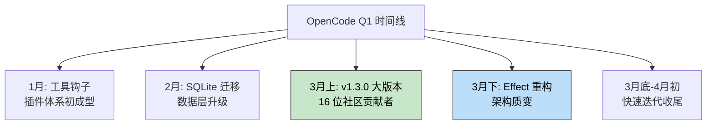
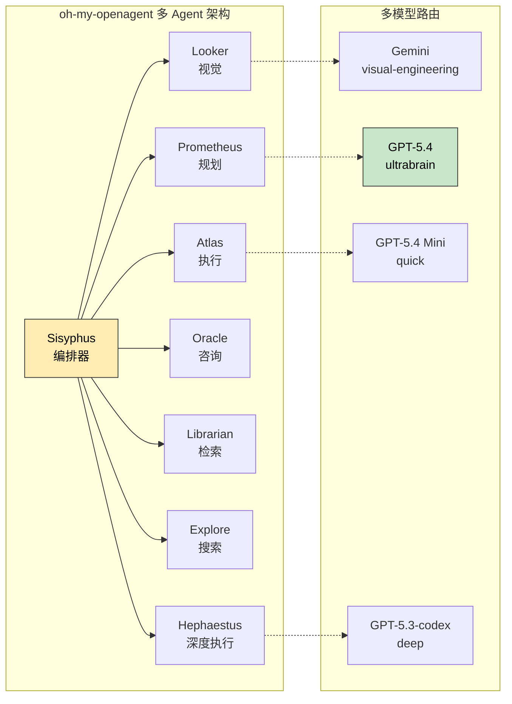

> 🎯 **一句话定位**：OpenCode 与 oh-my-openagent 在 2026 年 Q1
> 经历了爆发式增长，从架构重构到品牌重塑，从单模型到多模型编排。
>
> 💡 **核心理念**：AI 编程代理的竞争已经从"谁的模型更强"
> 转向"谁的架构更聪明"，而这两个项目正在定义新的标准。

---

## 📖 3 分钟速览版

📊 点击展开：Q1 精选特性速览 + 行动建议

### OpenCode Q1 精选（截至 2026-04-03，136k stars）

| 特性 | 一句话价值 | 适合谁 |
|------|-----------|--------|
| Effect 架构重构 | 服务层解耦，插件稳定性质的飞跃 | 插件开发者 |
| SQLite 数据库迁移 | 会话管理从文件系统升级到数据库 | 重度用户 |
| GitLab Agent Platform | 企业级 CI/CD 工作流集成 | 企业团队 |
| Node.js Runtime | 不再绑定 Bun，生态兼容性大增 | Node 用户 |
| Git-backed Session Review | 代码审查可视化，分支对比清晰 | 团队协作者 |
| AI SDK v6 + 多模型支持 | 灵活切换模型，跟进最新能力 | 所有用户 |
| 社区贡献爆发 | v1.3.0 单版本 16 位贡献者 | 开源爱好者 |

### oh-my-openagent Q1 精选（截至 2026-04-03，47.4k stars）

| 特性 | 一句话价值 | 适合谁 |
|------|-----------|--------|
| "Atlas Trusts No One" 大拆分 | 645 文件重构，200 LOC 硬限制 | 架构关注者 |
| 品牌重塑为 oh-my-openagent | 定位从"插件"升级为"平台" | 所有人 |
| Hash-Anchored Edits | 编辑准确率 6.7% → 68.3% (10x) | 所有用户 |
| 多模型编排引擎 | 按任务类型自动路由最优模型 | 效率追求者 |
| 8 Agent 协作系统 | Sisyphus 编排 + 7 专家 Agent | 复杂项目 |
| GPT-5.4 原生支持 | 第一时间跟进最强模型 | 前沿用户 |

### 行动建议

- **OpenCode 重度用户**：升级到 v1.3.13+，体验 Effect 架构
- **oh-my-openagent 用户**：确认已升级到 v3.14.1 获取兼容层
- **企业团队**：关注 OpenCode GitLab 集成 + oh-my-openagent
  企业采用案例（Google、Microsoft、Indent 已在生产环境使用）
- **新用户**：先试 OpenCode 入门 CLI Agent，再用
  oh-my-openagent 体验多 Agent 协作

---

## 第一部分：OpenCode，从底层架构到企业级集成

OpenCode 在 Q1 完成了从 v1.1.65 到 v1.3.13 的跨越式迭代。
仅 3 月份就发布了 10 个版本，社区贡献者从个位数飙升到
单版本 16 人。这种节奏背后是两个关键决策：底层架构彻底重构，
以及企业级功能的大步推进。

### SQLite 数据库迁移（v1.2.0）

**变了什么**：OpenCode 把会话存储从文件系统迁移到了 SQLite
数据库。用户需要删除 `~/.local/share/opencode/opencode.db*`
才能触发重新迁移。

**为什么重要**：文件系统存储在会话量大时性能退化严重。SQLite
不仅解决了这个问题，还为后续的会话搜索、跨会话引用、
统计分析等功能提供了结构化查询基础。

**实际价值**：如果你有上百个历史会话，升级后启动速度和
会话切换的响应速度会有明显提升。代价是一次性的迁移操作。

### Effect 架构重构（v1.3.4）

**变了什么**：这是 Q1 最大的架构变更。Session、Config、
Plugin、LSP、Skill 五大核心服务全部用 Effect 框架重写。
底层依赖升级到 Effect 4.0.0-beta.42，同时引入了
AI SDK v6 支持。

**为什么重要**：Effect 是 TypeScript 生态中处理副作用和
错误传播的框架。用它重写意味着每个服务都有统一的错误处理、
依赖注入和资源管理。这对插件开发者尤其关键，因为插件不再
需要关心宿主服务的生命周期管理。

**实际价值**：从用户角度看，最直接的感受是插件崩溃不再
拖垮整个应用。从开发者角度看，新插件的开发门槛降低，
因为 Effect 的类型系统能在编译期捕获大部分错误。

### GitLab Agent Platform 集成（v1.3.0）

**变了什么**：OpenCode 现在可以发现 GitLab 的 workflow 模型，
并通过 WebSocket 访问工具。这意味着 OpenCode 可以直接
参与 CI/CD 流水线的编排和调试。

**为什么重要**：此前 OpenCode 的企业集成主要围绕 GitHub。
GitLab 在欧洲和大型企业中有大量用户，这个集成填补了
一个重要的市场空白。WebSocket 工具访问意味着 Agent
可以实时监听流水线状态并做出响应。

**实际价值**：使用 GitLab 的团队可以直接让 OpenCode
在 MR 提交时自动审查代码、建议修复、甚至触发回滚。
不再是"AI 写代码 + 人手动触发 CI"，而是端到端的自动化。

### Node.js Runtime 支持（v1.3.0）

**变了什么**：OpenCode 此前只支持 Bun 运行时。v1.3.0
正式加入 Node.js 支持，用户可以自由选择运行环境。

**为什么重要**：Bun 虽然性能出色，但生态兼容性一直是痛点。
很多企业环境的 Node.js 工具链（nvm、pkg、Docker 镜像）
无法直接迁移到 Bun。Node.js 支持消除了这个采纳障碍。

**实际价值**：如果你所在的企业有标准化的 Node.js 环境，
现在可以直接用 `node` 运行 OpenCode，无需额外安装 Bun。

### 其他值得关注的更新

**交互式升级流程（v1.3.0）**：升级前弹出确认对话框，
避免意外破坏现有环境。小功能，但对生产环境至关重要。

**多步认证（v1.3.0）**：支持 GitHub Copilot Enterprise
的多步 OAuth 流程，企业 SSO 用户终于可以无缝接入。

**语法高亮扩展（v1.3.0）**：新增 Kotlin、HCL（Terraform）、
Lua、TOML 的语法高亮。覆盖了更多 DevOps 和游戏开发场景。

**TUI 插件系统（v1.3.4）**：终端 UI 现在支持插件注入
自定义 prompt slot，意味着插件可以在对话流程中插入
自己的指令。这为工作流自动化打开了新大门。

**插件版本锁定（v1.3.8-10）**：新增插件版本 pinning 功能，
防止自动更新引入不兼容变更。结合交互式升级流程，
企业用户对环境稳定性的控制力进一步增强。

**Catppuccin 主题支持（v1.3.8-10）**：引入 Catppuccin
配色方案，终端 UI 的视觉体验得到改善。虽然是外观更新，
但 CLI 工具的"颜值"对长时间使用体验有实际影响。

---

## 第二部分：oh-my-openagent，从插件到架构的进化

oh-my-openagent 在 Q1 经历了身份和架构的双重转变。从项目名
"oh-my-opencode"变为"oh-my-openagent"，不仅仅是品牌重塑，
更是从"OpenCode 的增强插件"到"独立 Agent 平台"的定位跃迁。

### "Atlas Trusts No One" 大拆分（v3.5.0）

**变了什么**：645 个文件被拆分重构，代码变更量达到
+34,507/-21,492 行。引入 200 行 LOC 硬限制，所有模块
必须拆分到 200 行以内。而且没有引入任何破坏性变更。

**为什么重要**：这个拆分的名字"Atlas Trusts No One"
暗示了核心设计哲学：没有模块可以无限膨胀。200 行限制
强制每个模块保持单一职责，同时通过零破坏性变更证明了
拆分可以在不影响用户体验的前提下完成。

**实际价值**：对用户而言，这意味着 oh-my-openagent 的
稳定性会显著提升。代码量可控的模块更容易测试、更容易
debug。对贡献者而言，阅读和修改代码的成本大幅降低。

### Hash-Anchored Edits：10 倍准确率提升

**变了什么**：引入了基于行哈希的编辑验证机制。每次编辑
操作都会验证 `LINE#ID` 格式的内容哈希，确保编辑目标
与实际文件内容匹配。

**为什么重要**：AI 编程代理最头疼的问题之一就是"编辑错位"，
模型想修改第 50 行，实际改了第 48 行。这种错误在大文件
中尤其常见。哈希锚定让每次编辑都有 cryptographic 级别的
位置校验。

**实际价值**：编辑成功率从 6.7% 飙升到 68.3%，10 倍提升。
这不是渐进式优化，而是从"经常出错"到"大部分时候能对"
的质变。对于频繁使用 AI 编辑功能的用户，这意味着大幅
减少手动修正的时间。

### 多模型编排引擎

**变了什么**：引入了按任务类型自动路由到不同模型的机制：

| 任务类别 | 路由模型 | 适用场景 |
|---------|---------|---------|
| visual-engineering | Gemini | UI/UX、前端可视化 |
| ultrabrain | GPT-5.4 | 复杂推理、架构设计 |
| quick | GPT-5.4 Mini | 快速修复、简单问答 |
| deep | GPT-5.3-codex | 深度编码、大规模重构 |

**为什么重要**：单一模型无法在所有场景下都表现最优。
视觉任务需要多模态能力（Gemini），深度编码需要代码专精
（GPT-5.3-codex），简单任务用轻量模型即可（GPT-5.4 Mini）。
自动路由让用户不需要手动选择模型。

**实际价值**：实际使用中，你会发现 Agent 自动在
不同任务间切换模型，而每次切换都匹配到最适合的能力。
这比手动选模型省心，也比固定用一个模型高效。

### 8 Agent 协作系统

**变了什么**：oh-my-openagent 构建了 8 个专业化 Agent
的协作网络。Sisyphus 作为编排者协调 7 个专家 Agent：

| Agent | 职责 | 类比 |
|-------|------|------|
| Sisyphus | 编排调度 | 项目经理 |
| Hephaestus | 深度执行 | 高级工程师 |
| Prometheus | 计划制定 | 架构师 |
| Atlas | 任务执行 | 开发者 |
| Oracle | 咨询回答 | 顾问 |
| Librarian | 知识检索 | 资料员 |
| Explore | 代码搜索 | 侦查员 |
| Looker | 视觉理解 | 设计师 |

**为什么重要**：单 Agent 架构的问题是"万能即无能"。
一个 Agent 同时负责规划、搜索、编码、审查，必然顾此失彼。
专业 Agent 各司其职，通过 Sisyphus 编排器协作，
类似微服务架构在 AI Agent 领域的应用。

**实际价值**：在复杂项目中（比如跨多个文件的重构），
你会感受到任务拆解更合理、执行更并行、最终质量更高。

### 品牌重塑：从插件到平台

**变了什么**：项目从 "oh-my-opencode" 更名为
"oh-my-openagent"（v3.11.0），同步更新了 GitHub
仓库名和包名。v3.14.0 提供了包名兼容层确保平滑过渡。

**为什么重要**：改名说明了一件事：oh-my-openagent
不再把自己定位为 OpenCode 的附属插件。创始人的原话是
"OmO and Sisyphus is about the whole architecture，
not just a plugin"。这是一个战略信号。

**实际价值**：对现有用户来说，兼容层确保升级无痛。
对新用户来说，项目定位更清晰，不会把它和
"OpenCode 插件"画等号。

---

## 第三部分：综合分析与行动建议

### 发展轨迹对比

两个项目在 Q1 走了不同的路线：

**OpenCode** 选择了"底层先行"策略。先用 Effect 框架
重构架构，再在稳固基础上叠加企业功能（GitLab、多步认证、
交互式升级）。这是一条"磨刀不误砍柴工"的路线。

**oh-my-openagent** 选择了"体验先行"策略。先用大拆分
解决技术债，再通过多模型编排和多 Agent 协作拉高用户体验。
这是一条"边跑边换轮胎"的路线。

两种策略没有高下之分，但反映了对目标用户的不同理解。
OpenCode 更看重企业稳定性，oh-my-openagent 更看重
开发者体验的极致化。

### 共同趋势

两个项目在 Q1 都在做三件相同的事：

1. **架构拆分**：OpenCode 用 Effect 重构五大服务，
   oh-my-openagent 用 200 LOC 限制拆分 645 文件。
   背后的共识是，AI Agent 的代码量正在失控，
   必须在爆炸前建立模块化纪律。

2. **多模型支持**：OpenCode 接入了 xAI、Poe、Azure、
   Vertex Anthropic 等多个模型提供商。oh-my-openagent
   直接实现了按任务类型的自动路由。趋势很明确：
   单一模型绑定正在成为历史。

3. **社区驱动**：OpenCode v1.3.0 有 16 位社区贡献者，
   oh-my-openagent v3.11.0 合并了 17 个社区 PR。
   两个项目都在从"创始人驱动"转向"社区驱动"。

### 影响力评估

截至 2026-04-03：

- **OpenCode**：136k stars，v1.3.4 的 Effect 架构重构
  可能是全年最重要的变更，为后续的插件生态和稳定性
  打下了决定性基础。

- **oh-my-openagent**：47.4k stars，Hash-Anchored Edits
  的 10 倍准确率提升是最具用户感知力的改进。Discord
  社区 20k+ 成员，已有用户表示"让我退掉了 Cursor 订阅"。
  Google、Microsoft、Indent 已在生产环境使用。

### 行动建议

| 你是谁 | 建议动作 | 优先级 |
|-------|---------|--------|
| OpenCode 老用户 | 升级到 v1.3.13，删除旧数据库触发迁移 | 高 |
| oh-my-openagent 老用户 | 升级到 v3.14.1，确认兼容层正常 | 高 |
| 企业评估者 | 用 OpenCode GitLab 集成做 PoC | 中 |
| 个人开发者 | 两个都试，OpenCode 做日常编码，oh-my-openagent 做复杂项目 | 中 |
| 插件开发者 | 基于 OpenCode Effect 架构开发新插件 | 低 |

---

## 📅 [2026-04-07] 增量更新：OpenCode

**同步版本区间**: `[v1.3.13]` -> `[v1.3.17]`

### 🚀 核心新特性 (快速掌握)

| 特性 | 价值点 | 💡 使用案例 (Quick Start) |
| :--- | :--- | :--- |
| **git-backed review 恢复** | 重新打通未提交改动与分支 diff 审查，长分支 review 更连贯 | `git diff main...HEAD` `# 在 OpenCode 中继续按分支差异审查当前改动` |
| **Provider / 配置能力增强** | Azure 同时兼容 chat / responses，ACP 会话暴露 model / mode，Cloudflare 缺参报错更直接 | `{"model":"azure/gpt-5.4"}` `# 在 ACP 客户端里按会话切换 build / plan` |
| **安装与插件兼容性修复** | npm 安装、`node-gyp` 路径与插件解析更稳，减少环境差异踩坑 | `npm install -g opencode-ai` `"plugin": ["@my-org/custom-plugin"]` |

### 🔧 优化与修复 (认知同步)

- **[Review Workflow]**: 恢复 git-backed review，并修复 revert chain
  之后的 snapshot 恢复问题。
- **💡 认知**: 以前分支对比和多次回退后，
  审查上下文容易断掉；
  现在 review 状态能跟着 git diff 和 snapshot 一起恢复。
  建议：经常审查长分支的团队可以直接升级。
- **[Provider Stability]**: 修复 OpenAI-compatible provider 在工具调用后
  session 卡住的问题，并为 Cloudflare Workers AI / AI Gateway
  缺参场景补上明确提示。
- **💡 认知**: 以前 provider 配错时，
  常表现为“调用后无响应”或模糊失败；
  现在错误更容易定位。
  建议：Cloudflare 用户升级后先核对必填字段。
- **[Cross-platform UX]**: TUI 支持禁用鼠标捕获，Windows 上 `Ctrl+Z`
  改为 undo，kitty 键盘输入处理更稳。
- **💡 认知**: 以前不同终端环境的
  快捷键和输入行为不一致；
  现在跨平台体验更接近统一。
  建议：Windows / kitty 用户优先升级。

### ⚠️ 架构变更与风险提醒

- **底层变动**: 本轮没有新的 Effect 级重构，主轴转向 provider
  兼容、插件安装和 review 工作流的可用性打磨。
- **手动干预**: 无。若你使用 Cloudflare Workers AI 或 AI Gateway，
  升级后请顺手核对必填配置是否完整。

---

## 📅 [2026-04-07] 增量更新：oh-my-openagent

**同步版本区间**: `[v3.14.1]` -> `[v3.15.3]`

### 🚀 核心新特性 (快速掌握)

| 特性 | 价值点 | 💡 使用案例 (Quick Start) |
| :--- | :--- | :--- |
| **重命名兼容层继续收口** | 自动更新、发布和包名识别继续兼容新旧名称，降低迁移尾部成本 | `rg -n "oh-my-opencode|oh-my-openagent" ~/.config .` `# 回查仍引用旧名称的脚本或配置` |
| **lineage-aware continuation** | `session_origins`、background launch tracking 与 continuation state 更完整，后台续跑更可靠 | `{"description":"continue refactor","run_in_background":true}` `# 后台任务结束后继续沿同一 lineage 接力` |
| **delegate-task 契约补强** | 参数校验、可调用 agent 模式限制和通知默认值更一致，多 Agent 调度更稳 | `{"description":"scan repo","run_in_background":true}` `# 显式传参，避免隐式默认行为` |

### 🔧 优化与修复 (认知同步)

- **[Session Reliability]**: SDK 不可用时可回退到文件存储，
  并补上
  `session-last-agent` 排序、background task session tracking
  等会话连续性能力。
- **💡 认知**: 以前后台任务或续跑链路
  可能因状态缺口中断；
  现在 session lineage 和 fallback storage 让接力更连续。
  建议：长任务、后台任务用户优先升级。
- **[Migration Safety]**: legacy config path 迁移、原子写配置、
  auto-update/config path 对齐，以及发布流程兼容性继续补强。
- **💡 认知**: 以前重命名后的旧路径和更新流程
  容易留下兼容坑；
  现在迁移收尾更平滑。建议：检查自定义脚本和 CI
  是否仍引用旧包名。
- **[Security Hardening]**: tar 预检改为 fail-closed，MCP
  环境变量清理时会屏蔽云凭证。
- **💡 认知**: 以前安装包或外部环境变量异常时，
  更容易“带着风险继续执行”；
  现在默认更保守。
  建议：依赖 MCP / 云凭证的团队回归一次自动化。

### ⚠️ 架构变更与风险提醒

- **底层变动**: 本轮没有新的品牌或架构级重构，
  重点是重命名迁移收尾，以及多 Agent 会话、
  后台任务链路的可靠性补强。
- **手动干预**: 若你的脚本、CI、shell alias 或配置目录仍引用
  `oh-my-opencode` 旧包名或旧路径，升级后请统一切到
  `oh-my-openagent`；其余场景无强制手动步骤。

---

## 更新记录

| 版本 | 日期 | 说明 |
|------|------|------|
| v1.0 | 2026-04-03 | 初始版本 |
| v1.1 | 2026-04-07 | 追加 OpenCode v1.3.14-v1.3.17 与 oh-my-openagent v3.15.x 增量更新 |
