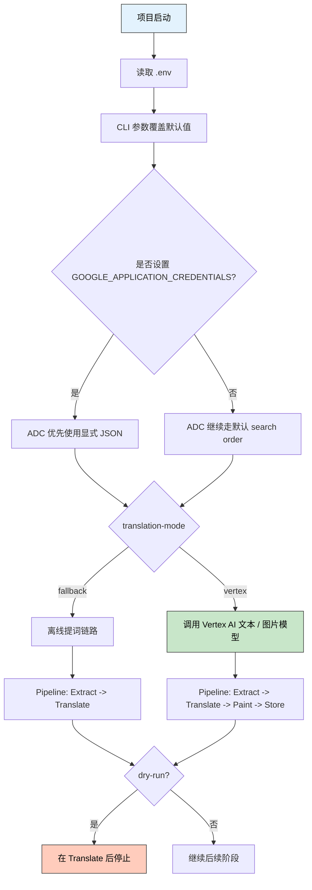
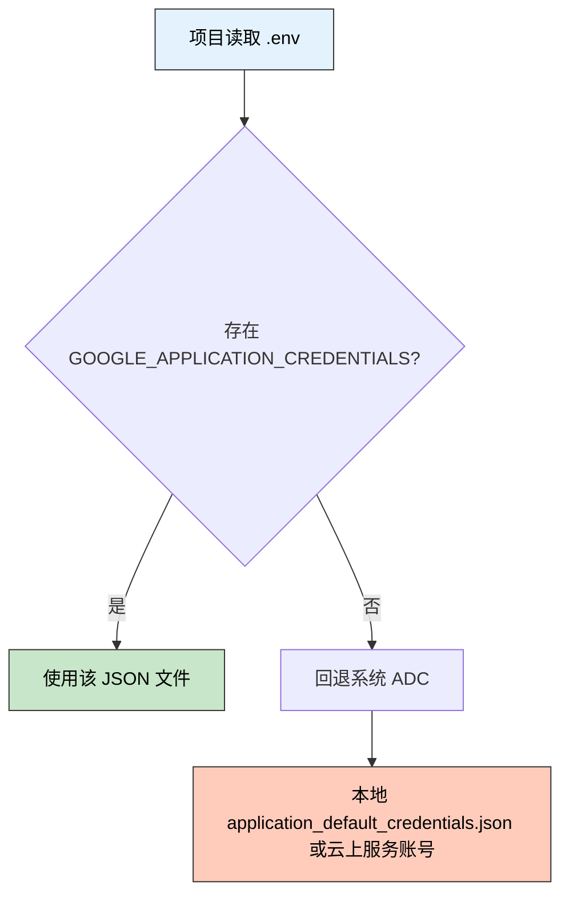

> 🎯 **一句话定位**：把一次真实的 Vertex AI 本地接入与预算配置过程，整理成一套可长期复用的知识框架。
>
> 💡 **核心理念**：先把认证来源、运行时依赖、服务账号权限和预算能力拆开理解，再决定项目应该优先走 `.env + GOOGLE_APPLICATION_CREDENTIALS`，还是回退系统 ADC。

---

## 📋 问题背景

### 业务场景

在一个本地 CLI 项目里，我们需要调用 Vertex AI 完成两件事：

- 用 Gemini 文本模型把 Mermaid 图翻译成图片提示词。
- 再用 Gemini 图片模型生成实际图片。

这个项目本身是一个典型的本地开发场景：

- 项目通过 `.env` 管理业务配置，例如 `M2C_PROJECT_ID`、模型名、输出目录。
- 运行时要调用 Google Cloud 的 Vertex AI API。
- 需要控制成本，又不希望长期依赖当前 `gcloud` CLI 登录的是哪个账号。

看起来只是“把项目跑起来”，但实际会牵出一整套知识点：

- `gcloud` CLI 账号和 ADC 到底是什么关系。
- `.env` 和 ADC JSON 应该分别管理什么。
- 服务账号和服务账号 key JSON 是什么。
- `GOOGLE_APPLICATION_CREDENTIALS` 为什么能让运行时脱离当前 CLI 登录状态。
- Budget 到底是不是硬性的消费上限。
- `--dry-run` 在项目里究竟是“完全不花钱”还是“只跳过图片生成”。

### 痛点分析

- **痛点 1**：Google Cloud 的认证概念很多，`gcloud auth login`、`gcloud auth application-default login`、ADC、service account、service account key 很容易混在一起。
- **痛点 2**：本地项目既有 `.env` 配置，又有 Google Cloud 凭据文件，如果边界没划清，很容易形成“到底是项目在管，还是系统在管”的混乱感。
- **痛点 3**：预算、配额、并发、权限这些词经常一起出现，但它们解决的问题完全不同，混用后容易做出错误的成本控制设计。

### 目标

建立一套清晰、可落地、可复用的本地开发方案：

- 项目配置优先通过 `.env` 加载。
- 认证优先通过 `.env + GOOGLE_APPLICATION_CREDENTIALS` 指定。
- 如果未显式指定，再回退到系统 ADC。
- 服务账号只给最小必要权限。
- 成本控制先用预算告警，再结合应用层保守策略。

---

## 🔍 方案对比

### 方案调研

| 方案 | 核心思路 | 优点 | 缺点 | 适用场景 |
|------|---------|------|------|---------|
| 方案 A | 依赖当前 `gcloud` 用户账号 + 系统 ADC | 上手快，适合临时测试 | 容易受当前登录账号影响，跨项目和跨账号时容易混乱 | 临时本地验证、一次性实验 |
| 方案 B | 用户账号生成 ADC，但通过服务账号冒充使用 Vertex AI | 更安全，不必分发长期 key | 初始化仍依赖 `gcloud`，理解成本更高 | 团队协作、本地安全要求较高 |
| 方案 C | `.env + GOOGLE_APPLICATION_CREDENTIALS=/path/to/service-account.json` | 运行时最明确，脱离当前 CLI 登录状态，项目行为稳定 | 需要管理服务账号 key，安全要求更高 | 本地固定项目、希望显式控制认证来源 |

### 选择理由

从本地工程体验看，方案 C 最接近“项目自身可解释”的理想状态。

原因很简单：

- `.env` 本来就负责项目配置。
- `GOOGLE_APPLICATION_CREDENTIALS` 恰好可以作为“项目显式声明的认证来源”。
- 运行时只要 `.env` 被加载，Google SDK 就能优先读取指定 JSON，不再依赖当前 `gcloud` CLI 活动账号。

因此，最终推荐模式是：

- **首选**：`.env + GOOGLE_APPLICATION_CREDENTIALS`
- **回退**：系统 ADC

这套模式既保留了 Google 官方 ADC 机制，又把项目层面的行为收拢到了一个容易理解的位置。

---

## 🧩 最小可运行链路

### 接线图



### 最小伪代码

```python
import os

from m2c_pipeline.config import VertexConfig
from google import genai
from google.genai import types

config = VertexConfig.from_env()
credential_path = os.getenv("GOOGLE_APPLICATION_CREDENTIALS")

# 1. .env 负责项目配置；CLI 参数可在运行前覆盖默认值
# 2. 是否真正访问 Vertex AI，还要看 translation mode
# 3. 如果设置了 GOOGLE_APPLICATION_CREDENTIALS，ADC 会优先使用它

if config.translation_mode == "vertex":
    client = genai.Client(
        vertexai=True,
        project=config.project_id,
        location=config.location,
        http_options=types.HttpOptions(timeout=60_000),
    )

    response = client.models.generate_content(
        model=config.gemini_model,
        contents="Reply with exactly: SERVICE_ACCOUNT_OK",
    )
    print(response.text)

# 这类 CLI 项目的运行阶段通常是：
# Extract -> Translate -> Paint -> Store
# 如果是 dry-run，则在 Translate 后提前停止，不进入 Paint / Store
```

### 关键点说明

- **关键点 1**：`.env` 负责项目配置，ADC JSON 负责 Google Cloud 身份认证，这两者职责不同，但可以在同一个项目启动链路中协同工作。
- **关键点 2**：按 Google ADC 的默认 search order，`GOOGLE_APPLICATION_CREDENTIALS` 一旦设置，就会先于本地 ADC 文件和云上附加服务账号被读取；如果不设置，才会继续往后找。
- **关键点 3**：是否真的访问 Vertex AI，不只取决于有没有配好凭据，还取决于当前 `translation-mode`。在本项目语境里，`vertex` 和 `fallback` 代表的是两条不同的翻译链路。

---

## 🧠 核心知识点梳理

### CLI 账号与 ADC 不是一回事

这是本次排查里最容易混淆、但也最关键的一点。

`gcloud` CLI 的配置主要受这些命令影响：

```bash
gcloud config set account YOUR_USER_EMAIL
gcloud config set project YOUR_PROJECT_ID
```

它们影响的是：

- 你执行 `gcloud ...` 命令时默认用哪个账号。
- `gcloud` 命令默认指向哪个 project。

但 ADC 属于另一条链路。ADC 常见来源有：

1. `GOOGLE_APPLICATION_CREDENTIALS`
2. `gcloud auth application-default login` 生成的本地 ADC 文件
3. 云环境附加的服务账号

因此，完全可能出现下面这种状态：

- CLI 当前账号是 B
- 系统 ADC 仍然是 A
- 项目 `.env` 又显式指定了服务账号 JSON

此时，**真正决定项目运行身份的，是 Google SDK 找到的 ADC 来源，而不是当前 CLI 活动账号。**

### `gcloud auth login` 和 `gcloud auth application-default login` 的区别

这两个命令虽然都和“登录”有关，但作用完全不同。

`gcloud auth login`：

- 主要给 `gcloud` CLI 自己用。
- 决定 `gcloud` 命令以谁的身份执行。

`gcloud auth application-default login`：

- 主要给 Google SDK 和 client libraries 用。
- 会生成本地 ADC 文件。

如果只记一句话：

**前者偏 CLI，后者偏 SDK。**

### 两类 JSON 文件要分清

本次对话里，关于“JSON 是不是只能通过 gcloud 生成”，结论是：**不是。**

需要区分两类文件：

#### 用户 ADC JSON

通常由下面命令生成：

```bash
gcloud auth application-default login
```

特点：

- 本质上是用户凭据对应的 ADC 文件。
- 适合本地开发。
- 初始化依赖 `gcloud`。

#### 服务账号 JSON key

通常来自：

- Cloud Console 的 `Keys -> Create new key -> JSON`
- 或 `gcloud iam service-accounts keys create`

特点：

- 是服务账号私钥文件。
- 可以直接通过 `GOOGLE_APPLICATION_CREDENTIALS` 使用。
- 运行时不依赖当前 `gcloud` CLI 登录状态。

对于本地项目的显式控制来说，第二种更接近“项目自带运行规则”的理想模型。

### `.env` 应该管什么

本次实践里，一个很重要的沉淀是：

**`.env` 不应该存放 JSON 内容本身，而应该存放 JSON 路径。**

正确的思路是：

```dotenv
M2C_PROJECT_ID=YOUR_PROJECT_ID
GOOGLE_APPLICATION_CREDENTIALS=/absolute/path/to/adc-or-service-account.json
```

而不是把 JSON 文本塞进 `.env`。

这会带来两个好处：

- 项目仍然只有一个显式入口：`.env`
- 凭据文件仍保持独立，不会让 `.env` 变成超大且高风险的密钥容器

### “优先 `.env + GOOGLE_APPLICATION_CREDENTIALS`，回退系统 ADC” 是什么意思

这套最终方案可以理解成一条两级查找链路：



这比“完全依赖系统环境”更可控，也比“项目强耦合某一种认证方式”更灵活。

### 服务账号最小权限该怎么想

在本项目当前的调用范围里，服务账号主要用于：

- 调用 Vertex AI 文本模型
- 调用 Vertex AI 图片模型

而不是：

- 管理项目 IAM
- 管理 billing
- 访问 Cloud Storage
- 部署线上服务

所以角色上的更稳妥说法是：

- **先给 `Vertex AI User`，也就是 `roles/aiplatform.user`，作为起步配置。**

不需要一开始就给：

- `Editor`
- `Owner`
- `Vertex AI Admin`
- `Storage Admin`

对当前这条本地 CLI 调用链来说，`roles/aiplatform.user`
已经足够让服务账号成功发起 Vertex AI 请求；但如果后续接入
Cloud Storage、Batch、更多管理类 API，是否足够就要重新按调用
面审查，而不是把这条经验直接当成 Vertex AI 的通用最小权限公式。

### service account policy 为空是什么意思

我们在检查服务账号时，还看到一个容易被误解的现象：

- 服务账号本身存在
- 项目角色已经赋上
- 但 service account IAM policy 为空

这并不表示配置有问题。

它只表示：

- 目前还没有额外的 principal 被授予“冒充它”或“使用它”的服务账号级权限

如果你走的是：

- `JSON key + GOOGLE_APPLICATION_CREDENTIALS`

那么 service account policy 为空，反而是合理且干净的状态。

### `SYSTEM_MANAGED` key 和 `USER_MANAGED` key 的区别

在检查服务账号 key 时，会同时看到：

- `SYSTEM_MANAGED`
- `USER_MANAGED`

这里最需要记住的是：

- `USER_MANAGED` 才是你在 Console 手动创建、能下载成 JSON 文件的那一类。
- `SYSTEM_MANAGED` 一般不是拿来给本地 `.env + GOOGLE_APPLICATION_CREDENTIALS` 直接使用的下载型 key。

所以，如果你要把 key JSON 落到本地路径里，真正相关的是：

- 新创建的 `USER_MANAGED` key

### 为什么要把 key 文件移出 Downloads

这看起来像一个小动作，但其实是安全实践的一部分。

刚下载的 key 文件如果长期留在：

- `Downloads`
- 桌面
- 仓库目录

都会带来风险。

更稳的做法是：

- 放到仓库外的固定路径
- 收紧权限为 `600`
- 让 `.env` 指向这个固定路径

例如：

```bash
chmod 600 /path/to/m2c-pipeline-adc.json
```

这一步虽然简单，但它体现的是“凭据文件应有独立生命周期”的思路。

## 💰 成本与预算边界

### Budget 是什么，不是什么

本次对话里另一个重要知识点是：

**Google Cloud Budget 不是硬性封顶。**

Budget 能做的是：

- 给你设一个预算参考值
- 在达到一定比例或预测超出时发告警

Budget 不能直接保证的是：

- 超过预算后自动停止所有消费
- 自动禁止 Vertex AI 调用
- 自动停机

所以“billing limit”这个词要谨慎理解。

更准确的说法应该是：

- Budget 是预算告警机制
- 真正的“硬性限制”通常还需要应用层控制、自动化动作，或者手动干预

### 为什么预算第一版建议按项目级、All services 配置

很多人一开始会想把预算只绑定到某个具体服务，但第一版通常不值得这么做。

更稳的方式是：

- 作用域只选目标项目
- `Services` 先保持 `All services`

原因是：

- 成本来源先按项目整体观察更稳
- 不容易漏掉与 Vertex AI 相关的附带费用
- 先建立成本感知，再决定要不要收窄

### 本项目测试期可先用的一组预算设置

本次对话里关于预算页面，实际沉淀了以下几点：

- 如果 billing 账号是台湾地区，预算和报表很可能按 `NT$ / TWD` 计价。
- 页面中同时出现 `$` 和 `NT$` 时，应优先以明确写出 `NT$` 的报表为准。
- `Budget type` 更适合选 `Specified amount`，而不是 `Last period's spend`。
- 对当前这种本地测试期、调用量还不稳定的项目，可以先从下面这组
  阈值起步：
  - `50% Actual`
  - `80% Actual`
  - `100% Actual`
  - `120% Forecasted`

这更像一组便于建立成本感知的起点配置，而不是所有项目都该照抄的
标准答案。真正长期运行时，还是要结合调用频率、并发策略和预算周期
再做收紧。

## 🧪 本项目中的 dry-run 语义

### `--dry-run` 到底是什么

这是最后一个很实用、也很容易被误解的点。

在这个项目里，`--dry-run` 的定义首先是**提前结束流水线**，而不是
“天然等于零成本”。

`M2CPipeline.run()` 的主链路可以拆成四段：

- `Extract`：提取 Mermaid
- `Translate`：生成图片提示词
- `Paint`：调用图片模型生成图像
- `Store`：落盘保存

这里的 `--dry-run` 会在 `Translate` 之后提前返回，因此：

- **会执行 Mermaid 提取**
- **会执行文本翻译**
- **不会执行图片生成**
- **不会保存 PNG**

也就是说：

- 它能验证前半段链路：配置、模式选择、提示词生成
- 它不能验证后半段链路：图片模型、图片保存、最终视觉效果

但是否真的访问云端，还要再看 `translation-mode`：

- `--translation-mode fallback --dry-run`
  只是在本地验证提取和 fallback 提词链路，不会触发 Vertex AI。
- `--translation-mode vertex --dry-run`
  仍然可能调用 Vertex AI 的文本模型，所以依旧可能产生费用。

这也和我在
[`GitHub Actions CI 最小落地方案`](../tools/2026-04-04-github-actions-ci-minimal-implementation-guide.md)
里锁定的门禁命令保持一致：CI 里使用的是
`--dry-run --translation-mode fallback`，它验证的是离线前置链路，
不是完整的 Vertex 图片生成链路。

因此，`dry-run` 更准确的理解应该是：

- 它是“低成本前置验证”
- 它不是“完整链路验证”
- 它也不自动等于“零云端调用”

---

## 🚧 生产实践

### 边界条件

- [ ] **本地与云上差异**：本地偏向 `.env + GOOGLE_APPLICATION_CREDENTIALS`，云上更推荐使用附加服务账号，而不是长期 key 文件。
- [ ] **预算不是硬限制**：即使配了 Budget，也不能假设超额后调用会自动被拦住。
- [ ] **服务账号职责单一**：如果后续服务账号还要访问别的资源，应重新审查角色，不要把当前最小权限默认扩张成通用权限。

### 常见坑点

1. **把 CLI 账号和 ADC 当成同一套东西**
   - **现象**：明明 `gcloud config set account` 切换了账号，项目调用结果却不符合预期。
   - **原因**：项目真正读取的是 ADC，而不是 CLI 当前活动账号。
   - **解决**：明确区分 CLI 配置与 ADC 配置；优先使用 `.env + GOOGLE_APPLICATION_CREDENTIALS` 固定项目运行身份。

2. **误以为 Budget 是硬消费上限**
   - **现象**：配置了预算后，以为超过金额就不会再花钱。
   - **原因**：Google Cloud Budget 的设计目标是告警与追踪，不是硬性封顶。
   - **解决**：把 Budget 当成告警机制，并结合应用层保守策略，例如低并发、先 dry-run、必要时手动轮换或禁用 key。

### 监控指标

- Vertex AI 每月总花费与预算阈值达成情况
- 图片生成前后的 dry-run 占比、真实生成占比、并发数变化

### 最佳实践

- 在本地项目中优先采用 `.env + GOOGLE_APPLICATION_CREDENTIALS`，未设置时再回退系统 ADC。
- 服务账号先从 `roles/aiplatform.user` 这种起步权限开始，跑通后再决定是否有必要扩权。

---

## ✨ 总结

### 核心要点

1. `gcloud` CLI、系统 ADC、`.env + GOOGLE_APPLICATION_CREDENTIALS` 是三条不同层级的配置链路，必须拆开理解。
2. 对这类本地 CLI 项目来说，更稳的做法之一是让 `.env` 显式指定认证来源，而不是依赖当前 CLI 活动账号。
3. 预算要先作为告警体系来设计，而不是误认为它天然具备硬性封顶能力。

### 适用场景

这套思路特别适合以下场景：

- 本地 CLI 项目需要稳定调用 Vertex AI。
- 一个项目会在多个用户账号或多个 GCP 项目之间切换。
- 希望把“项目配置”和“系统认证”拆清楚，减少环境漂移。
- 希望逐步建立起服务账号最小权限和成本治理意识。

### 注意事项

真正长期维护时，还应继续补上三件事：

- 定期轮换 `USER_MANAGED` key。
- 在团队内约定好 `.env`、ADC、系统凭据的边界。
- 对图片生成这类高成本调用，始终保留“先 dry-run、后真实生成”的操作习惯。

---

## 更新记录

| 版本 | 日期 | 说明 |
|------|------|------|
| v1.0 | 2026-04-03 | 初始版本 |
| v1.1 | 2026-04-07 | 补齐最小接线链路，校准 dry-run 语义并收束为本地 CLI 场景实践 |
