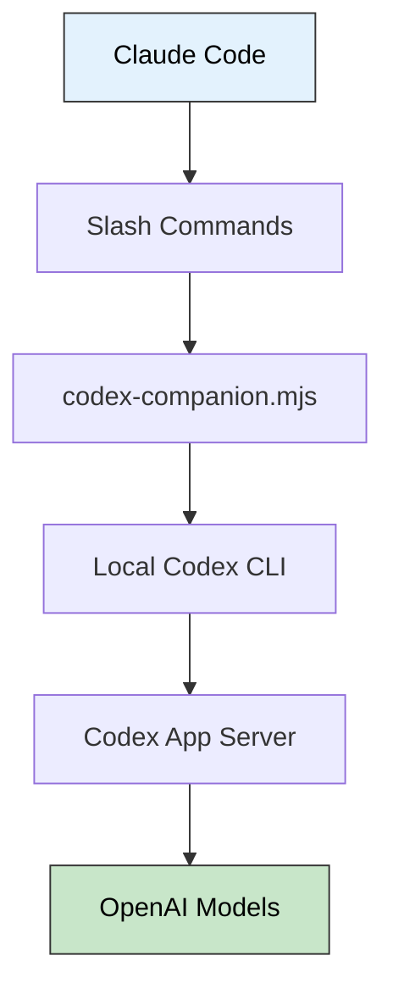

> 🎯 **一句话定位**：基于当前版本插件能力，整理一套
> `Claude Code + Codex` 的审查、委派与后台协作实践。
>
> 💡 **核心理念**：不要把它只看成“多了几个 Slash 命令”，而要
> 把它看成“Claude 主写、Codex 复核与接手”的协作接口。

---

## 📋 问题背景

### 业务场景

作为一个 vibecoding 工程师，你的日常大概是这样的：用 Claude Code 写功能、改 bug、重构代码，节奏飞快。但代码质量怎么保证？提交前有没有遗漏的边界条件？设计决策是否经得起推敲？

传统方案是自己 review 或者找同事 review，但在 AI 辅助开发的工作节奏下，人工审查跟不上代码产出的速度。

### 痛点分析

- **痛点 1**：Claude Code 写代码很快，但没有内置的"第二双眼睛"来审查质量
- **痛点 2**：手动跑 Codex CLI 做审查需要切出当前工作流，打断思路
- **痛点 3**：复杂 bug 的调查和修复需要长时间运行，阻塞主工作流

> 还有哈，claude 自己做 review 有点贵


### 目标

在 Claude Code 内部无缝调用 Codex（GPT-5.x 系列），实现代码审查和任务委派的双引擎协作，同时保持工作流不被打断。

---

## 🔍 这篇文章解决什么问题

### 方案调研

| 方案 | 核心思路 | 优点 | 缺点 | 适用场景 |
|------|---------|------|------|---------|
| 手动切 Codex CLI | 在终端手动运行 `codex` | 控制力最强 | 需要切出 Claude 工作流 | 一次性深度任务 |
| Claude 自检 | 继续让 Claude 自己 review | 零额外依赖 | 缺少外部视角 | 快速自查 |
| Codex Plugin | 在 Claude Code 内转发到本机 Codex | 不切上下文、能做后台协作 | 仍需本机 Codex 安装与认证 | 日常开发主流程 |

我更看重的不是“多了几个命令”，而是它把 `Claude 写` 和
`Codex 看` 放进了同一条工作流里。对于实践型开发，这意味着：

- 提交前可以多一层外部视角
- 复杂调查可以交给 Codex 在后台继续跑
- 发现问题后可以直接把修复任务委派出去，而不是重新切终端

---

## 🧭 当前版本能力边界

按我本机当前安装的 `openai-codex` 插件整理，这篇文章讨论的是一个
**当前版本工作流**，不是永久不变的“官方命令大全”。



<details>
<summary>**🖼️ 插图版（2026-04-17 增量补充）**</summary>


</details>

更准确的理解是：

- 它复用的是**本机 Codex CLI、认证状态和 `.codex/config.toml`**
- 如果你这台机器已经能跑 `codex`，插件通常就能直接复用那套状态
- 如果你还没装或没登录，仍然要先完成安装和 `codex login`

当前版本面向用户暴露的是下面这组 Slash 命令：

| 命令族 | 作用 | 我会怎么理解它 |
|------|------|----------------|
| `/codex:setup` | 检查安装与认证，管理可选 review gate | 先确认环境是否 ready |
| `/codex:review` | 普通只读审查 | 提交前的日常质量门 |
| `/codex:adversarial-review` | 带攻击性的挑战式审查 | 上线前质疑方案本身 |
| `/codex:rescue` | 调查或继续处理任务 | 把问题委派给 Codex |
| `/codex:status` `/codex:result` `/codex:cancel` | 管理后台任务 | 看进度、取结果、取消任务 |

如果你刚开始接入，第一步就是：

```bash
/codex:setup
```

它会检查 Codex 是否已安装、是否已认证；如果本机缺少 Codex 且 `npm`
可用，当前版本会提供安装入口。review gate 也是在这里开启或关闭：

```bash
/codex:setup --enable-review-gate
/codex:setup --disable-review-gate
```

---

## 🚧 三类核心工作流

### 1. 审查：`review` 和 `adversarial-review`

这是我最常用的一组能力。

```bash
/codex:review
/codex:review --base main
/codex:review --background

/codex:adversarial-review --base main challenge whether this was the right caching and retry design
/codex:adversarial-review --background look for race conditions and question the chosen approach
```

两者的区别不在“严格程度”，而在审查立场：

| 维度 | `/codex:review` | `/codex:adversarial-review` |
|------|----------------|---------------------------|
| 目标 | 看当前改动有没有明显问题 | 质疑这条实现路线是否值得继续 |
| 焦点 | 代码质量、缺陷、遗漏 | 假设、权衡、失败模式、替代方案 |
| 自定义 focus | 不支持 | 支持在命令后补充 focus 文本 |
| 适用时机 | 日常提交前 | 关键功能上线前 |

当前版本里，这组命令还有几个很实用的边界：

- 都支持 `--base <ref>` 做分支级审查
- 都支持 `--wait` 和 `--background`
- `review` 支持 `--scope auto|working-tree|branch`
- `adversarial-review` 也支持同样的目标选择，但不支持
  `staged-only` / `unstaged-only`

一个很值得记住的实现细节是：如果你不显式写 `--wait` 或
`--background`，插件会先估计改动规模，再推荐你前台等还是后台跑。
对多文件、边界不清或改动较大的情况，当前版本明显偏向后台执行。

### 2. 委派：`rescue`

`rescue` 是把任务交给 Codex 接手的主入口，适合调查、尝试修复和继续
之前的任务。

```bash
/codex:rescue investigate why the build is failing in CI
/codex:rescue fix the failing test with the smallest safe patch
/codex:rescue --resume apply the top fix from the last run
/codex:rescue --background investigate the regression in the auth module
```

当前版本的几个关键点：

- 支持 `--background`、`--wait`、`--resume`、`--fresh`
- 默认执行模式是**前台**
- 如果你没写 `--resume` 或 `--fresh`，且当前仓库里有可恢复线程，
  插件会先问你是继续旧线程还是新开线程
- `--model` 和 `--effort` 是显式可控的，但不写时会沿用 Codex 默认值
- 写 `spark` 时，当前版本会把它映射到 `gpt-5.3-codex-spark`

我自己的使用习惯很简单：

- 明确、很小的补丁可以前台跑
- 开放式调查、CI 事故、疑难杂症一律显式加 `--background`

### 3. 后台任务管理：`status` / `result` / `cancel`

一旦把 review 或 rescue 放到后台，这三个命令就会变成主线。

```bash
/codex:status
/codex:status task-abc123
/codex:result
/codex:result task-abc123
/codex:cancel
/codex:cancel task-abc123
```

这里有两个当前版本细节很值得记：

- 不带 job id 的 `/codex:status`，会把当前会话里已知任务整理成一张
  Markdown 表格，适合快速扫状态
- `/codex:result` 在可用时会带上 `session-id`，你可以继续回到 Codex
  CLI 里执行：

```bash
codex resume <session-id>
```

---

## 🧪 典型使用路径

### 流程 A：提交前双引擎审查

```text
你写完功能 → /codex:review --background → /codex:adversarial-review --background
                                               ↓                            ↓
                                          /codex:status              /codex:status
                                               ↓                            ↓
                                          /codex:result              /codex:result
                                               ↓                            ↓
                                     发现问题 → /codex:rescue fix the critical issue
```

这条链路最适合“已经写完，但还不想马上 push”的时刻。

### 流程 B：CI 红灯时，把调查先委派出去

```bash
/codex:rescue investigate why the build is failing in CI
/codex:rescue --resume apply the top fix from the last run
/codex:review --wait
```

这里最有价值的不是“让 Codex 一次修好”，而是把调查和修复串成同一个
线程，减少你重复描述上下文的成本。

### 流程 C：长时间调查，不阻塞当前工作

```bash
/codex:rescue --background --model gpt-5.4-mini --effort xhigh \
  investigate the flaky integration test in test/auth.test.ts

/codex:status
/codex:result
```

如果你本来就习惯让长任务慢慢跑，这条路径会很顺手。

---

## ⚠️ 风险与限制

- 这套链路依赖本机 Codex CLI；当前 README 要求 `Node.js 18.18+`
- 如果你还没登录 Codex，需要先跑 `/codex:setup`，再按提示执行
  `!codex login`
- 认证可以走 ChatGPT 账号，也可以走 API key；所有使用量仍计入
  Codex 配额
- review gate 是可选能力，但它会把 Claude 的停止动作接到 Codex 审查
  上，形成更长的循环，配额消耗会明显上升
- 这篇文章基于我本机当前插件版本整理；命令集、模型别名和执行细节
  后续都可能变化，发布时最好再核对一次插件 README

我自己的保守原则是：

- 平时默认关闭 review gate
- 后台任务才用 `status/result/cancel` 做显式管理
- `rescue` 只在我接受它继续处理当前工作区时才使用

---

## 🔗 和插件对比文的关系

如果你现在还在做插件选型，先看这篇：

- [Claude Code Code Review 插件对比：官方插件 vs codex-review](./2026-04-02-claude-code-review-plugins-comparison.md)

那篇回答的是“我该选谁”；这篇默认你已经决定要在 Claude Code 里接入
Codex，所以重点是“接进来以后，怎么把它用成一条稳定工作流”。

---

## ✨ 总结

### 核心要点

1. Codex Plugin 的价值，不是命令数量，而是把 Claude 的主工作流和 Codex 的复核、接手能力接到了一起。
2. 对日常开发来说，最值得优先建立的是三条路径：提交前审查、问题委派、后台任务管理。
3. 这篇文章更适合当“当前版本实践记录”来读；具体命令和细节，发布前仍应以插件 README 为准。

### 适用场景

- 你已经在用 Claude Code，希望引入第二个模型视角做复核
- 你经常遇到需要长时间调查的 bug 或 CI 问题
- 你不想频繁切出 Claude 工作流，再单独打开 Codex CLI

### 注意事项

- 如果机器上还没有 Codex，这个插件不会替你绕过安装和登录步骤
- `adversarial-review` 更像方案压力测试，不是简单的“更严格 review”
- `rescue` 更适合问题调查和继续处理，不建议在脏工作区里随手乱开

---

## 更新记录

| 版本 | 日期 | 说明 |
|------|------|------|
| v1.0 | 2026-04-07 | 初始版本 |
| v1.1 | 2026-04-07 | 基于校验后的插件能力重写标题与工作流口径，去除高风险命令穷举表述 |
| v1.2 | 2026-04-17 | 为 1 个 Mermaid 图表追加 Chiikawa 风格插图（m2c-pipeline 生成） |
