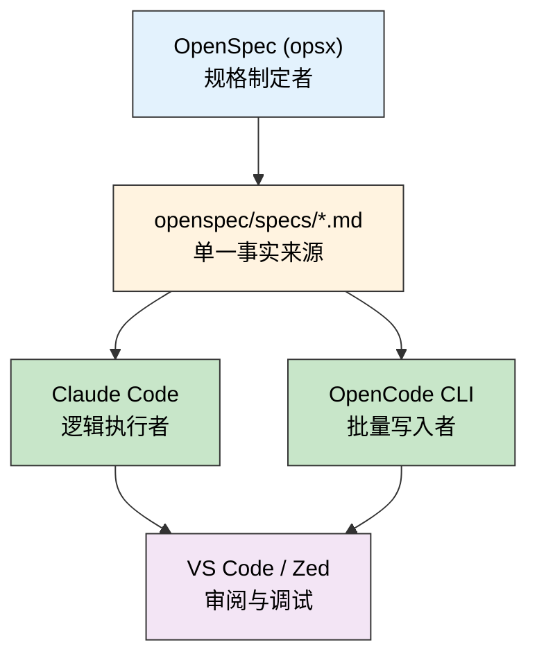
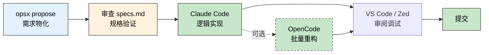

> 🎯 **一句话定位**：一篇把 OpenSpec 从"概念工具"变成"可落地工程实践"的操作手册。
>
> 💡 **核心理念**：AI 写代码失控的根源不是模型能力不够，而是没有把"要做什么"和"怎么验收"定义清楚。OpenSpec 就是那个工程化协议层。

---

## 📋 问题背景

### 业务场景

你在用 Claude Code 做 vibecoding 开发，节奏很快：给一个需求描述，AI 把代码
写出来，你审查、合并、继续下一个。直到有一天，AI 改了一个"简单"功能，
顺手动了三个你没预期的模块，测试全绿但行为已经悄悄漂移了。

这不是偶发事故。在快速迭代的节奏下，"需求意图"和"实现边界"之间永远存在模糊
地带——而 AI 会用它能理解的方式来填补这个模糊地带，结果未必是你想要的。

### 痛点分析

- **痛点 1**：纯 prompt 描述需求，AI 对边界的理解每次不一样，相同的描述在不同
  会话里可能产出结构完全不同的代码。
- **痛点 2**：多工具协作时（Claude Code 写逻辑、OpenCode 批量重构、VS Code 审查），
  各个 AI 工具拿到的上下文不同，容易形成"各说各话"的漂移。
- **痛点 3**：没有结构化的验收标准，AI 生成的代码"能跑"但不一定"对"，
  边界条件漏测，上线后才发现。

### 目标

在 Claude Code 工作流里引入 OpenSpec 作为"规格层"：需求先走 OpenSpec 物化成
结构化规格文档，再把规格文档喂给 Claude Code / OpenCode 执行，
实现"AI 写代码有据可依、AI 审代码有标准可查"。

---

## OpenSpec 产物长什么样

真正值得沉淀的不是 `/opsx:propose` 这条命令本身，
而是它在仓库里留下来的那份**结构化规格**。
以一个"异步爬虫 + 缓存 + 重试"的需求为例，
我更关心的是最终能不能落出一份所有 AI 工具都看得懂的契约。

一个典型的规格骨架大致会长这样：

```markdown
# crawler-feature

## User Stories
- 作为调用方，我希望爬虫支持按域名限速，避免把目标站点打挂
- 作为维护者，我希望失败请求有明确重试策略，便于排查

## API Specs
### `crawl(url: str) -> CrawlResult`
- 输入：目标 URL
- 输出：状态、内容摘要、错误信息

## Data Models
### `CrawlTask`
- `url`
- `retry_count`
- `status`
- `cached_at`

## Tasks
- [ ] Task 1：建立基础爬虫接口与数据模型
- [ ] Task 2：补齐缓存层与 TTL 策略
- [ ] Task 3：补齐重试与错误处理
```

这类产物的价值不在于“格式好看”，
而在于它把一次需求拆成了四个对实现真正有约束力的面：

- 用户到底想解决什么问题
- 接口边界是什么
- 数据结构是什么
- 实施顺序是什么

如果一篇规格最后没有落到这些东西上，
它就更像一段整理得比较工整的 prompt，
而不是可复用的工程契约。

---

## 什么时候该用 / 不该用

在 vibecoding 工作流里，"动手之前先想清楚"常见有四种做法：

| 做法 | 最适合的场景 | 容易出问题的场景 |
|------|-------------|----------------|
| 纯 prompt 驱动 | 单文件、小改动、边界非常清晰 | 跨模块需求、多人协作、容易越权修改 |
| Claude Code Plan Mode | 单次中等复杂任务，需要先只读想一遍 | 需要跨会话保存、跨工具共享计划 |
| OpenSpec | 需求边界模糊、需要规格存档、要喂给多个 AI 工具 | 非常小的修改，规格成本会高于收益 |
| 执行层多 Agent | 跨文件复杂改动，已经有明确规格，需要并行执行 | 需求本身还没收敛时，容易放大漂移 |

所以 OpenSpec 最适合解决的是这类问题：

- 你知道这次改动不小，但边界还不够清楚
- 你希望 Claude Code、OpenCode 看到的是同一份契约
- 你希望这次需求不只存在于聊天记录里，而是能随 Git 一起沉淀

反过来，如果只是一个明确的小修小补，
直接写 prompt 或先走 Plan Mode 往往更划算。

### OpenSpec 和 Plan Mode 的边界

这两者看起来都像“先别急着写代码”，但解决的问题并不一样。

| 维度 | Claude Code Plan Mode | OpenSpec |
|------|-----------------------|----------|
| 约束方式 | 工具层硬约束，直接禁止写入 | 通过规格与流程约束后续实现 |
| 持久性 | 只有当前对话里的分析 | 会生成真实文件并进入版本控制 |
| 生命周期 | 一次性思考后退出 | `explore -> propose -> apply -> archive` 可持续推进 |
| 最适合场景 | 临时想清楚思路、快速审计 | 需要跨会话、跨工具保存变更上下文 |

我现在更倾向于这样区分：

- 还只是想“先想清楚”时，用 Plan Mode 很轻便
- 已经确定这是一个要跟踪的变更时，用 OpenSpec 更像在开工程单

换句话说，Plan Mode 更像安全模式，OpenSpec 更像轻量级变更管理层。

> 关于"什么时候该上 OpenSpec"的判断模型，可参考
> [从 OpenSpec 到项目管理经验：一套能落地的需求复杂度评估模型](./2026-03-25-from-openspec-to-demand-complexity-model.md)。
> 那篇重点讲判断标准，本文重点讲实际落地流程。

---

## 安装与初始化

### 安装流程

**前置环境**：

- Node.js **≥ 20.19.0**
- npm（全局安装用）或 pnpm（项目内依赖管理）
- 无需任何外部 API Key，无需配置 `.env`

**安装步骤**：

```bash
# 1. 全局安装 OpenSpec CLI
npm install -g @fission-ai/openspec@latest

# 2. 在项目根目录初始化（生成 openspec/ 目录结构）
cd your-project
openspec init

# 3. 在 Claude Code 中直接使用 slash command
# /opsx:propose "你的需求描述"
```

### 一次真实安装记录：Volta 环境下的坑

我在这台机器上的实际安装过程里，还补到了一个很实用的经验：

- 本机环境是 `Node.js v24.14.0`、`pnpm 9.15.4`
- 前置版本本身没有问题
- 但如果你和我一样用 **Volta** 管 Node.js，直接跑
  `pnpm add -g @fission-ai/openspec@latest`，可能会撞上
  `ERR_PNPM_NO_GLOBAL_BIN_DIR`

这时与其继续折腾 `PNPM_HOME`，更稳的做法通常是直接回到：

```bash
npm install -g @fission-ai/openspec@latest
```

我这次最终就是这样安装成功的，随后用：

```bash
openspec --version
```

确认到的版本是 `1.2.0`。

### `openspec init` 实际会做什么

初始化的真实价值，不只是“生成一个目录”，而是把 Claude Code
里的项目级入口也一起接好。

这次在博客仓库里执行 `openspec init` 后，非交互模式给出的结果包括：

- 创建 OpenSpec 基础目录结构
- 自动为 Claude Code 和 GitHub Copilot 做集成
- 在 `.claude` 和 `.github/` 下写入 `4 skills + 4 commands`
- 提示重启 IDE，让新的 Slash Commands 生效

这也解释了为什么初始化后你会在 Claude Code 里直接看到 `/opsx:`
这一组命令，而不只是一个孤零零的 CLI。

### `/opsx:` 四个命令怎么分工

初始化之后，我现在更推荐把 `/opsx:` 当成一个完整生命周期来理解：

| 命令 | 作用 | 最适合的使用时机 |
|------|------|----------------|
| `/opsx:explore` | 先把模糊需求聊清楚 | 还在纠结“要不要、怎么做、会不会影响 X” |
| `/opsx:propose` | 产出 proposal / design / tasks | 需求已明确，准备生成工程文档 |
| `/opsx:apply` | 按 proposal/tasks 推进实现 | 规格已经确认，开始进入编码 |
| `/opsx:archive` | 把这次变更归档收尾 | 实现完成，准备做沉淀和关闭 |

它们和 `/openspec:*` 本质上是同一套工作流，只是 `/opsx:` 更像初始化后
在项目里直接可用的别名入口。

### `explore` 和 `propose` 到底差在哪

以前我也觉得两者边界有点虚，直到真的走了一遍之后，感觉区别清楚很多：

- `explore` 解决的是“把模糊想法聊清楚”
- `propose` 解决的是“把清楚想法落成工程文档”

比如博客场景里：

- “我想加阅读进度条，但不确定放顶部还是侧边，要不要移动端显示”
  这种还有很多问号的阶段，更适合 `explore`
- “给博客顶部加一个固定阅读进度条，用 `custom.styl` 实现，移动端隐藏”
  这种意图已经明确的阶段，就可以直接 `propose`

还有一个很关键的实践点：

- `explore -> propose` 的衔接主要靠**同一会话里的上下文**
- 它不是“写入某个隐藏状态后再自动传递”
- 当讨论足够成熟时，Claude 会主动问你要不要创建 proposal，
  然后在当前对话里直接切进 `propose` 逻辑

所以我现在的经验是：`explore` 更像橡皮鸭对话，`propose` 更像出工程单。

**版本管理建议**：

- `openspec/specs/` 目录下的所有 `.md` 文件直接纳入 Git 版本管理——
  规格文档即代码，每次变更都有记录。
- 规格进度随 Git 流动，换机器 / 切编辑器只需 `git pull` 即可恢复上下文。

### OpenSpec 目录与文件清单

理解 `opsx` 命令背后操作了哪些文件，有助于你更好地掌控变更状态。初始化后，你的项目根目录会多出一个 `openspec/` 文件夹：

| 目录/文件 | 作用 | 存续周期 |
|----------|------|---------|
| **`openspec/changes/`** | **变更中（In-flight）**。存放当前正在进行、尚未归档的任务。 | 临时 |
| └─ `<change-id>/` | 每一个独立的变更需求都会拥有一个以 ID 命名的文件夹。 | 任务期间 |
| 　 ├─ `proposal.md` | **核心方案建议书**。包含用户故事、API 规格、数据模型等。 | 任务期间 |
| 　 ├─ `tasks.md` | **任务清单**。由方案拆解出的原子化执行步骤。 | 任务期间 |
| 　 ├─ `design.md` | （可选）更详细的架构图、UI 设计或技术细节说明。 | 任务期间 |
| 　 └─ `.openspec.yaml` | 变更单的元数据（标题、作者、关联 spec 等）。 | 任务期间 |
| **`openspec/specs/`** | **长期规格（Stable）**。存放已收敛、作为长期文档维护的特性规格。 | 长期 |
| └─ `<feature>.md` | 某个模块或特性的完整说明，是所有 AI 工具读取的“单一事实来源”。 | 长期 |
| **`openspec/archive/`** | **归档库（Archive）**。存放已完成并执行了 `archive` 命令的历史任务文件夹。 | 永久 |

**核心逻辑**：
1. `propose` 时，AI 在 `changes/` 下创建新文件夹和 `proposal.md`。
2. `apply` 时，AI 根据 `proposal.md` 里的 Tasks 逐项修改代码。
3. `archive` 时，相关的 Task 可能会更新到 `specs/` 下的长期文档中，然后整个变更文件夹会被移动到 `archive/`。

### 工具链分工架构

四个工具各司其职，形成"AI 架构师 + AI 程序员"的双层协作：



| 工具 | 集成角色 | 实战调用方式 |
|------|---------|------------|
| **OpenSpec (opsx)** | 规格制定者 | `opsx propose "<需求描述>"` 产出 `specs/` 下的 MD 文件和任务清单 |
| **Claude Code CLI** | 逻辑执行者 | `Read @openspec/specs/feature_a.md and implement tasks in order` |
| **OpenCode CLI** | 批量写入者 | 根据规格书对存量代码做跨文件重构，利用其文件操作能力 |
| **VS Code / Zed** | 审阅与调试 | VS Code 插件可视化任务进度；Zed 负责代码精修与运行调试 |

---

## 🚧 生产实践

### 典型工作流串联

#### 流程 A：功能需求全链路



**Step 1：需求物化（Proposal Phase）**

在项目根目录运行，OpenSpec 会通过追问引导你把模糊需求变成明确规格：

```bash
opsx propose "设计一个带缓存机制的 Python 异步爬虫，支持请求重试和速率限制"
```

AI 会追问：使用哪个缓存库（Redis/Disk）？重试策略是指数退避还是固定间隔？
速率限制是全局还是按域名？每个追问都在收窄"边界模糊地带"。

**Step 2：规格验证（Verification Phase）**

检查生成的 `openspec/specs/feature_a.md`，确认：

- API 签名与 Data Model 字段一致
- 任务拆分粒度合理（每个 task 对应一个原子改动）
- 验收标准可测试（有具体的输入/输出示例）

此阶段**不产生任何代码**，只是对"契约"做最终签字。

**Step 3：自动化实现（Implementation Phase）**

切换到 Claude Code，喂入规格文档：

```text
Read @openspec/specs/crawler-feature.md and implement tasks 1-3.
Follow the API spec exactly. Do not modify files outside the scope defined in the spec.
```

有了明确的 `tasks.md`，Claude Code 的实现通常会更容易按任务边界推进，
也更容易减少对无关文件的顺手改动。

**Step 4：批量重构（可选）**

如果需要对存量代码做跨文件的结构调整，切换到 OpenCode：

```bash
opencode "按照 openspec/specs/refactor-auth.md 重构认证模块，保持接口不变"
```

> 💡 OpenCode 的指令直接引用规格文件路径，而不是重新描述需求——这样
> Claude Code 和 OpenCode 至少是在读取同一份契约，能明显减少"各说各话"的漂移。

#### 流程 B：存量代码重构

```bash
# 1. 先用 OpenSpec 把重构意图规格化
opsx propose "将现有的同步认证模块重构为异步，保持对外接口不变"

# 2. 验证规格，确认改动边界
# 检查 openspec/specs/async-auth.md

# 3. 用 OpenCode 批量执行跨文件改动
opencode "按照 openspec/specs/async-auth.md task 1-5 修改认证模块"
```

Step 4 切回 Claude Code 补全测试（prompt 直接引用规格的 Test Cases 章节）：

```text
Read @openspec/specs/async-auth.md section "Test Cases" and implement them.
Do not modify files outside the auth module.
```

#### 流程 C（高级可选）：OpenSpec + oh-my-openagent 串联

当功能复杂到"需要多个专家 Agent 并行"时，OpenSpec 和 oh-my-openagent 可以串联：
OpenSpec 负责把模糊需求收敛成精确规格，oh-my-openagent 的 Sisyphus 负责把规格
拆解并分发给专业 Agent 执行。

```bash
# 1. OpenSpec 完成需求收敛，产出规格文档
opsx propose "设计用户认证模块：JWT + OAuth2 双通道，支持刷新令牌，Redis 缓存 session"

# 2. 规格验证通过后，在 OpenCode（已装 oh-my-openagent）中调用 Prometheus 做规划
```

```text
Read @openspec/specs/auth-module.md.
Use Prometheus Agent to create a detailed implementation plan,
breaking tasks down to atomic level (≤50 lines per task).
```

```bash
# 3. 确认 Prometheus 的规划符合 specs 后，触发 Sisyphus 并行编排
```

```text
Execute the implementation plan:
- Atlas handles API route layer (openspec/specs/auth-module.md tasks 1-3)
- Hephaestus handles core auth logic (tasks 4-6)
Run in parallel where tasks have no dependencies.
```

```bash
# 4. 执行完成后，用 OpenSpec 规格做验收基准
# 检查实现是否覆盖 specs 中的所有 User Stories 和 Test Cases
```

**串联的关键**：`openspec/specs/` 文件是两套系统之间的桥梁——
OpenSpec 写入它，oh-my-openagent 的各 Agent 读取它。两边都不需要重新描述需求，
这会比“每个工具各吃一遍自然语言背景”更稳定，也更容易控制上下文漂移。

### 边界条件

- **空追问跳过**：如果在 `propose` 阶段直接回车跳过所有追问，生成的规格质量
  会退化为普通 prompt 水平，失去 OpenSpec 的核心价值。务必耐心回答每个追问。
- **规格版本冲突**：多人协作时，`openspec/specs/` 目录的 Git 冲突需要手动解决，
  规则是"以最新讨论结果为准"，不要自动合并规格文件。

### 常见坑点

1. **任务粒度过粗**

   - **现象**：OpenCode 执行一个 task 时改了几十个文件，结果混乱
   - **原因**：`propose` 阶段没有要求 AI 把任务拆到原子级别
   - **解决**：在 `propose` 时明确要求——"每个 task 修改代码不超过 50 行，
     单一职责"，或在验证阶段手动拆分过大的 task

2. **AI 工具间上下文漂移**

   - **现象**：Claude Code 和 OpenCode 对同一模块的改法不一致，互相覆盖
   - **原因**：各工具有各自的会话上下文，没有共享的"事实来源"
   - **解决**：始终以 `openspec/specs/` 作为单一事实来源（Single Source of Truth），
     每次给 AI 工具的指令都明确引用对应的规格文件，而不是重新描述需求

### 最佳实践

- **分层指令**：在 `CLAUDE.md` 中预设规则——
  `Always prioritize instructions in the openspec/ directory if they exist.`
  这样 Claude Code 每次启动都会把规格文档纳入最高优先级上下文。
- **任务颗粒度控制**：`propose` 阶段要求 AI 拆到"原子级"（每个 task 修改
  不超过 50 行），是提高 OpenCode 自动执行成功率的最有效手段。
- **环境隔离**：把 `openspec/specs/` 作为跨工具的共享上下文，避免在
  Claude Code、OpenCode、Gemini CLI 里重复输入相同的背景信息，
  既省 token 又保持代码风格一致。
- **规格文档提交 Git**：`opsx propose` 生成的 `specs/*.md` 和 `tasks.md`
  应该和业务代码一起提交，方便日后追溯"当初为什么这样设计"。

---

## ✨ 总结

### 核心要点

1. **工程化协议层**：OpenSpec 不是提示词工程，它是在 AI 和需求之间插入的一层
   结构化契约，强制把"要做什么"和"怎么验收"显式化。
2. **单一事实来源**：`openspec/specs/` 目录是所有 AI 工具的共享上下文，
   解决多工具协作时的漂移问题。
3. **双层分工**：OpenSpec 做架构师（规格制定），Claude Code / OpenCode 做程序员
   （代码执行），分工明确后各工具的输出质量都会提升。

### 适用场景

- 需求边界模糊、容易被 AI"自由发挥"的中大型功能
- 多个 AI 工具协作（Claude Code + OpenCode + Gemini CLI）的复杂项目
- 需要长期维护、要求"当初为什么这样设计"可追溯的模块
- 团队协作场景，需要统一 AI 执行的规格口径

### 注意事项

- 安装依赖 Node.js ≥ 20.19.0，无需 API Key 或外部服务账号
- `propose` 阶段的追问决定规格质量，不要跳过
- 规格文件要纳入 Git 版本管理，`openspec/` 目录不应加入 `.gitignore`
- 原子级任务拆分是 OpenCode 自动执行成功率的关键前提

---

## 更新记录

| 版本 | 日期 | 说明 |
|------|------|------|
| v1.0 | 2026-04-07 | 初始版本 |
| v1.1 | 2026-04-07 | 方案对比扩展：补充 Claude Code Plan Mode、Cursor Plan Mode、oh-my-openagent 多 Agent；新增使用时机判断决策树 |
| v1.2 | 2026-04-07 | 修复决策树逻辑（两层判断）；章节名精准化；Python 依赖补说明；流程 A 标出可选路径；新增流程 C（OpenSpec + oh-my-openagent 串联）；Step 4 prompt 与 bash 分离 |
| v1.3 | 2026-04-07 | 修正幻觉内容：移除虚构的 Supabase 依赖、OpenAI API Key、Python 依赖及 git clone 安装方式；更正为官方实际安装方式（npm install -g）及正确的 Node.js 版本要求（≥20.19.0） |
| v1.4 | 2026-04-07 | 前置规格产物示例，压缩生态对比并突出 OpenSpec 主流程 |
| v1.5 | 2026-04-07 | 补充真实安装踩坑、`/opsx:` 命令边界与 OpenSpec 和 Plan Mode 的分工认知 |
| v1.6 | 2026-04-07 | 补充概念澄清：对比 OpenSpec 与 Alibaba/AgentScope 的定位差异 |
| v1.7 | 2026-04-13 | 补充 OpenSpec 目录与文件清单小节，明确 `changes/`, `specs/`, `archive/` 职责 |
