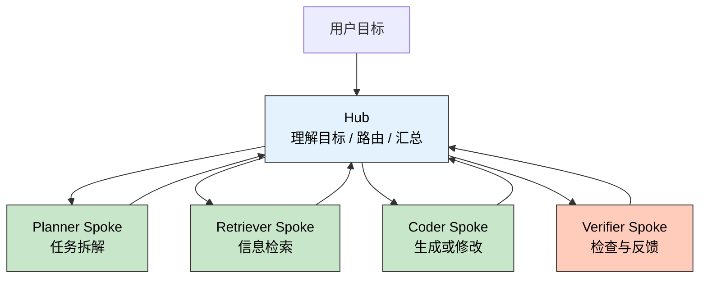
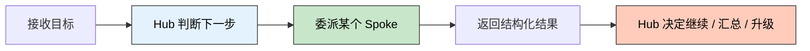

> 🎯 **一句话定位**：如果你已经从单 Agent 走到多 Agent，
> 但开始被上下文膨胀、职责漂移和工具选择失控困扰，
> `Hub and Spoke` 往往是第一种值得认真落地的编排架构。
>
> 💡 **核心理念**：把“全局理解与决策”收敛到主控 `Hub`，
> 把“单点能力执行”拆给多个辐射节点 `Spoke`，
> 让系统从“一个万能 Agent”变成“可治理的协作网络”。

---

## 问题背景

### 为什么单 Agent 容易先跑通，再失控

很多 Agent 系统的第一版都很像这样：

- 一个大 Prompt
- 一组工具
- 一个“尽量聪明”的执行循环

刚开始它很好用，因为实现成本低，调试面也小。
但只要业务开始变复杂，问题会非常快地冒出来：

- 一个 Agent 同时负责理解需求、拆任务、查资料、
  写代码、做检查
- 工具数量变多后，模型越来越容易误选工具
- 每一步结果都堆回上下文，导致后续推理越来越“糊”
- 某个子任务失败时，很难判断是路由错了，
  还是执行者能力不够

这类系统的共同症状是：**功能在增长，但结构没有增长**。

### Hub and Spoke 要解决的到底是什么

`Hub and Spoke` 本质上不是“多弄几个 Agent”这么简单，
而是把多 Agent 协作拆成两个清晰层次：

- `Hub`：负责目标理解、任务拆分、路由选择、结果汇总
- `Spoke`：负责某一类明确能力，
  例如检索、规划、编码、校验

你可以把它理解成一个
“主控调度中心 + 专项执行单元”的模型。
这样做的核心收益，不是炫技，而是降低系统复杂度：

- 让每个 `Spoke` 的提示词更短、更稳定
- 让任务失败更容易定位到具体责任面
- 让工具选择从“全量开放”变成“按角色暴露”

### 典型业务场景

我会优先考虑在下面几类系统里使用这套架构：

- **研发 Copilot**：主控决定是查代码、改代码还是跑检查
- **企业问答 Agent**：主控决定走知识库、
  数据库还是工单系统
- **内容生产流水线**：主控拆成检索、提纲、
  写作、审校几个环节
- **复杂自动化任务**：主控先规划，
  再把子步骤委派给专长节点

如果你的系统已经出现下面三个信号，
通常就该认真考虑它了：

- **痛点 1**：一个 Agent 既要“懂全局”，又要“做细节”，
  提示词越写越长
- **痛点 2**：工具变多后，模型的选择质量明显下降
- **痛点 3**：出了问题只能看到“最终失败”，
  看不到是哪一层失控

### 目标

通过 `Hub and Spoke` 架构，把多 Agent 系统从“能跑”推进到
“可扩展、可观测、可治理”的状态。更具体一点：

- 降低单个 Agent 的上下文压力
- 让职责边界稳定到可以独立优化
- 让路由、执行、汇总三类问题能分开调试

---

## 方案对比

### 常见多 Agent 编排方式

| 方案 | 核心思路 | 优点 | 缺点 | 适用场景 |
|------|---------|------|------|---------|
| 单 Agent + 全量工具 | 一个 Agent 自主决定所有动作 | 简单、启动快 | 容易上下文膨胀，工具误选多 | 原型验证、小规模场景 |
| 顺序流水线 | 固定步骤串行执行 | 稳定、好控、好测试 | 灵活性差，分支处理弱 | 文档处理、ETL 式流程 |
| Hub and Spoke | 主控拆解并委派给专长节点 | 职责清晰，扩展性好，便于治理 | 需要设计契约和路由规则 | 多角色协作、复杂任务 |
| 去中心化协作 | Agent 之间互相对话和转交 | 灵活，适合开放式探索 | 难观测，成本高，易漂移 | 研究型、多轮探索型系统 |

### 为什么很多团队会停在这里

从演进路径看，`Hub and Spoke` 经常是最现实的一步。
原因很简单：

- 它比单 Agent 更稳定
- 它比完全去中心化更可控
- 它不像固定流水线那样僵硬

换句话说，它是一个很适合工程团队落地的“中间态”。

### 选择理由

如果你的目标是把 Agent 系统做成一个长期维护的产品，
而不是一次性的 Demo，那么 `Hub and Spoke`
的优势非常明确：

- **复杂度可分层**：全局决策和局部执行拆开演进
- **治理更直接**：每个 `Spoke` 可以单独限权、限流、评测
- **故障面更清楚**：路由错、执行错、汇总错可以分别定位

它并不总是最强的架构，但经常是**最均衡**的架构。

---

## 核心实现

### 架构视图

先看一张最小可用的关系图：



这里最重要的一点不是“节点数量”，
而是**控制权只在 `Hub` 手里**。
`Spoke` 不负责随意接管流程，它们只返回结构化结果：

- 做了什么
- 结果是什么
- 置信度如何
- 是否需要升级处理

### 设计时要先定好的三个契约

真正决定这套架构是否稳定的，
通常不是 Prompt 文案，而是下面三个契约。

#### 1. 输入契约

`Hub` 不应该把全部上下文一股脑丢给 `Spoke`，
而是传递最小必要信息：

- `task_type`
- `goal`
- `constraints`
- `context_summary`
- `expected_output`

这能避免 `Spoke` 被全局噪音污染。

#### 2. 输出契约

我建议所有 `Spoke` 都统一返回一个标准结果对象，
至少包含：

- `status`
- `summary`
- `artifacts`
- `confidence`
- `next_action_hint`

统一输出格式的价值很大。它让 `Hub` 不需要理解每个 `Spoke`
的自然语言风格，而只需要消费结构化字段。

#### 3. 升级契约

不是所有任务都应该“做完再说”。
当 `Spoke` 遇到边界问题时，应该主动请求升级，例如：

- 缺少必要上下文
- 工具权限不足
- 结果置信度过低
- 发现潜在高风险操作

这会让系统从“盲目执行”变成“带刹车的执行”。

### 一个可运行的最小实现

下面用 Python 写一个最小可运行的 `Hub and Spoke` 原型。
它不依赖具体模型 SDK，重点是把职责边界表达清楚。

```python
from __future__ import annotations

from dataclasses import dataclass, field
from typing import Any, Protocol


@dataclass
class Task:
    task_type: str
    goal: str
    constraints: list[str] = field(default_factory=list)
    context_summary: str = ""
    expected_output: str = ""


@dataclass
class SpokeResult:
    status: str
    summary: str
    artifacts: dict[str, Any] = field(default_factory=dict)
    confidence: float = 0.0
    next_action_hint: str = "return_to_hub"


class Spoke(Protocol):
    name: str

    def can_handle(self, task: Task) -> bool:
        ...

    def run(self, task: Task) -> SpokeResult:
        ...


class PlannerSpoke:
    name = "planner"

    def can_handle(self, task: Task) -> bool:
        return task.task_type == "plan"

    def run(self, task: Task) -> SpokeResult:
        steps = [
            "澄清目标和约束",
            "拆分为检索、实现、验证三个阶段",
            "把结果交回 Hub 决定下一跳",
        ]
        return SpokeResult(
            status="ok",
            summary="已生成执行计划",
            artifacts={"steps": steps},
            confidence=0.93,
            next_action_hint="dispatch_retriever",
        )


class RetrieverSpoke:
    name = "retriever"

    def can_handle(self, task: Task) -> bool:
        return task.task_type == "retrieve"

    def run(self, task: Task) -> SpokeResult:
        references = [
            "内部规范：输出必须结构化",
            "历史案例：类似任务先检索再实现更稳定",
        ]
        return SpokeResult(
            status="ok",
            summary="已补充检索上下文",
            artifacts={"references": references},
            confidence=0.88,
            next_action_hint="dispatch_coder",
        )


class CoderSpoke:
    name = "coder"

    def can_handle(self, task: Task) -> bool:
        return task.task_type == "code"

    def run(self, task: Task) -> SpokeResult:
        draft = {
            "module": "hub_spoke.py",
            "change": "实现基础调度和结构化返回",
        }
        return SpokeResult(
            status="ok",
            summary="已完成初版实现",
            artifacts={"draft": draft},
            confidence=0.81,
            next_action_hint="dispatch_verifier",
        )


class VerifierSpoke:
    name = "verifier"

    def can_handle(self, task: Task) -> bool:
        return task.task_type == "verify"

    def run(self, task: Task) -> SpokeResult:
        checks = [
            "结构化输出存在",
            "职责边界明确",
            "仍需补充异常分支",
        ]
        return SpokeResult(
            status="ok",
            summary="完成验证并给出回馈",
            artifacts={"checks": checks},
            confidence=0.9,
            next_action_hint="return_to_hub",
        )


class Hub:
    def __init__(self, spokes: list[Spoke]) -> None:
        self.spokes = {spoke.name: spoke for spoke in spokes}

    def dispatch(self, task: Task) -> SpokeResult:
        for spoke in self.spokes.values():
            if spoke.can_handle(task):
                return spoke.run(task)
        return SpokeResult(
            status="needs_human",
            summary=f"没有可处理任务类型 {task.task_type} 的 Spoke",
            confidence=0.0,
            next_action_hint="escalate",
        )

    def run(self, goal: str) -> list[SpokeResult]:
        plan = self.dispatch(Task(task_type="plan", goal=goal))
        retrieve = self.dispatch(Task(task_type="retrieve", goal=goal))
        code = self.dispatch(Task(task_type="code", goal=goal))
        verify = self.dispatch(Task(task_type="verify", goal=goal))
        return [plan, retrieve, code, verify]


if __name__ == "__main__":
    hub = Hub(
        [
            PlannerSpoke(),
            RetrieverSpoke(),
            CoderSpoke(),
            VerifierSpoke(),
        ]
    )
    results = hub.run("实现一个可治理的多 Agent 编排系统")
    for item in results:
        print(item)
```

### 执行流程怎么看

上面这段代码虽然简化，
但已经体现了 `Hub and Spoke` 的四个关键动作：



真正上线时，通常还会再补三层能力：

- **状态存储**：保存每次路由和执行痕迹
- **权限隔离**：不是所有 `Spoke` 都能直接调用高风险工具
- **观测埋点**：统计路由命中率、失败原因、重试次数

### 关键点说明

- **关键点 1**：`Hub` 负责控制流，`Spoke` 负责能力输出。
  不要让 `Spoke` 自己决定是否再找另一个 `Spoke`，
  否则控制面会再次分散。
- **关键点 2**：所有 `Spoke`
  都要“短上下文、强约束、结构化输出”。
  这比写一个“聪明的大 Agent”更稳定。
- **关键点 3**：路由逻辑不要一开始就全交给 LLM。
  能用规则收敛的部分先用规则，剩下的再交给模型判断。

---

## 生产实践

### 边界条件

- [ ] **跨领域复合任务**：如果一个任务天然需要多个 `Spoke`
  连续协作，就要明确中间产物格式，
  否则结果很容易在交接处丢失。
- [ ] **高风险操作**：涉及删库、发版、支付、权限修改时，
  必须让 `Hub` 增加人工确认或双重校验。
- [ ] **长链路任务**：当一次目标需要
  10 步以上的连续决策时，要考虑引入阶段性摘要，
  否则 `Hub` 自己也会被上下文拖垮。

### 常见坑点

1. **把 `Hub` 做成“超级 Agent”**

   - **现象**：虽然名义上有多个 `Spoke`，
     但 `Hub` 仍然持有全部工具和全部上下文。
   - **原因**：只是把节点拆多了，没有真正拆职责。
   - **解决**：让 `Hub` 只负责路由、汇总和升级，
     不直接承担专业执行任务。

2. **`Spoke` 输出格式不统一**

   - **现象**：有的返回自然语言摘要，
     有的返回 JSON，有的直接给一大段正文。
   - **原因**：每个 `Spoke` 各写各的，没有统一契约。
   - **解决**：先定义共享结果模型，
     再去优化每个 `Spoke` 的 Prompt 和工具调用。

3. **所有决策都交给模型**

   - **现象**：路由不稳定，同一个输入有时找检索，
     有时直接进编码。
   - **原因**：把可规则化的判断也完全交给了 LLM。
   - **解决**：先用规则处理高置信度路径，
     再把模糊区间交给模型补判断。

### 监控指标

如果准备把它做成长期运行的系统，
我会重点盯下面这些指标：

- 路由命中率：`Hub` 是否把任务送到了合适的 `Spoke`
- 升级率：多少任务因为权限、上下文或低置信度被打回
- 单次目标平均调用步数：链路是不是在不断变长
- `Spoke` 失败分布：
  到底是某个角色不稳定，还是整体设计有问题
- 人工介入率：系统是否真的降低了人工成本

### 最佳实践

- 先从 2 到 4 个 `Spoke` 开始，不要一开始就铺十几个角色
- 给每个 `Spoke` 配一套单独评测集，而不是只看最终成败
- `Hub` 的提示词要强调“选择谁做”，
  而不是“自己把一切做完”
- 为关键节点保留可回放日志，后续排错会轻松很多

---

## 总结

### 核心要点

1. `Hub and Spoke` 的价值，不在于“多 Agent”本身，
   而在于把控制流和执行流拆开治理。
2. 它最适合从单 Agent 走向复杂系统的过渡阶段，
   是灵活性和可控性之间非常实用的平衡点。
3. 真正决定成败的不是节点数量，
   而是契约、路由和观测能力。

### 适用场景

如果你的任务已经开始出现
“多步骤、跨能力、需要汇总判断”的特点，
同时又不希望系统演化成一个不可调试的黑盒，
那么这套架构非常值得优先尝试。

尤其是下面三类系统，通常会很受益：

- 代码助手和工程自动化
- 企业知识问答和内部操作代理
- 内容生成、审校、发布的多阶段流水线

### 注意事项

`Hub and Spoke` 不是银弹。

如果你的任务本来就是固定顺序、稳定输入、稳定输出，
那固定流水线通常更简单；如果你的场景高度开放、
需要 Agent 之间长时间自由协商，
那去中心化协作可能更合适。

真正好的架构选择，不是“看起来最先进”，
而是**最符合当前复杂度**。

---

## 更新记录

| 版本 | 日期 | 说明 |
|------|------|------|
| v1.0 | 2026-04-21 | 初始版本 |
