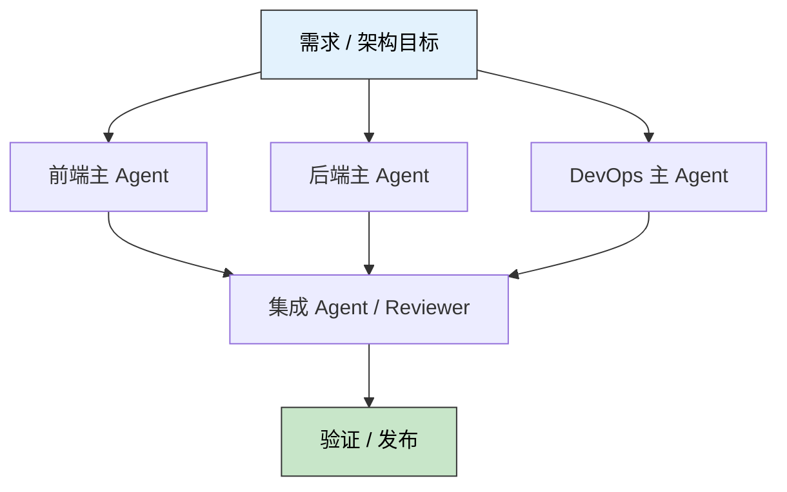

> 🎯 **一句话定位**：当单个 Tech Lead Agent 已经无法稳定吞下全栈复杂度时，
> 多主 Agent 是把大项目重新切回可控系统的一种架构升级。
>
> 💡 **核心理念**：不要让一个全能 Agent 同时理解前端、后端、
> DevOps 和集成细节，而是让多个拥有独立上下文和明确所有权的主
> Agent 并行工作，再通过契约和集成节点完成协作。

---

## 📋 问题背景

### 业务场景

在小型任务里，`Parent-Child` 模式很顺手：一个主 Agent 像 Tech Lead，
负责理解需求、拆分任务、调用子 Agent，再统一整合结果。

但项目一旦进入全栈联动阶段，这种模式会很快碰到上限。比如你同时要做
前端重构、接口改造、数据库变更、流水线发布、监控回补和灰度验证时，
单个主控 Agent 会被迫承担三件互相冲突的事：

- 持续维护跨领域的超长上下文。
- 在多个技术栈之间频繁切换推理视角。
- 把所有分支决策重新汇总到自己身上。

这时候，系统的瓶颈往往已经不再是模型够不够聪明，而是架构是否允许
每个 Agent 在一个足够清晰、足够稳定的边界里工作。

### 痛点分析

- **痛点 1**：单主控 Agent 容易成为上下文黑洞，越到后期越难保持判断稳定。
- **痛点 2**：子 Agent 只是执行者，很多领域性架构决策仍然要回流给父节点。
- **痛点 3**：跨域改动越来越多时，协作链会退化成串行排队，吞吐量明显下降。

### 目标

把一个巨型项目拆成多个并行主节点，让每个主 Agent 只维护自己负责领域的
高信号上下文，并把跨域协作压缩成可审计的契约、产物和集成检查。理想状态
下，单个 Agent 的有效上下文规模下降 `50%` 左右，跨域返工次数明显降低。

---

## 🔍 方案对比

### 方案调研

| 方案 | 核心思路 | 优点 | 缺点 | 适用场景 |
|------|---------|------|------|---------|
| `Parent-Child` | 一个主控 Agent 调度多个执行型子 Agent | 实现简单，收敛快 | 父节点容易成为瓶颈 | 单仓库、中小任务、短链路改动 |
| `Swarm` 式协作 | 多个 Agent 自由通信、动态协商 | 灵活，探索能力强 | 边界模糊，容易重复劳动 | 研究型任务、开放探索 |
| `Multi-Main Agent` | 按领域设置多个主 Agent，并通过契约协作 | 上下文隔离好，并行度高 | 设计成本更高，需要集成机制 | 全栈大项目、跨团队协作、长期演进 |

### 选择理由

如果问题只是“多开几个 Agent 能不能更快”，那不一定需要
`Multi-Main Agent`。真正需要它的时刻，是当领域复杂度已经超过一个
主控节点的认知负载。

`Multi-Main Agent` 的价值，不在于把一个人类经理复制成三份，而在于把
系统从“单脑调度”升级为“多中心并行”。它更像微服务架构里的领域拆分：

- 前端主 Agent 关注界面状态、组件边界、交互回归。
- 后端主 Agent 关注接口契约、领域模型、数据一致性。
- DevOps 主 Agent 关注构建、发布、环境、可观测性。
- 集成 Agent 或人工 Reviewer 只处理跨域对齐，而不是重新做所有工作。

这样做的成本，是前期要多花一点时间定义所有权和交付契约；换来的收益，
是系统在复杂项目里不会被一个超长对话拖垮。

---

## 💡 核心实现

### 实现思路



上图里最关键的变化，是“主”不再只有一个。

每个主 Agent 都有自己的工作区、自己的终端、自己的任务池和上下文摘要，
它不是某个父节点的临时手脚，而是一个拥有领域判断权的主节点。跨域协作
不再依赖长对话转述，而依赖结构化的交付物，比如：

- 接口契约变更说明。
- 迁移脚本与回滚策略。
- 预览环境地址与验证清单。
- 待集成的 `handoff ticket`。

### 完整代码

```python
from __future__ import annotations

from dataclasses import dataclass, field
from enum import Enum
from typing import Dict, List


class Domain(str, Enum):
    FRONTEND = "frontend"
    BACKEND = "backend"
    DEVOPS = "devops"


@dataclass
class Task:
    id: str
    title: str
    owner: Domain
    expected_artifact: str
    depends_on: List[str] = field(default_factory=list)


@dataclass
class HandoffTicket:
    task_id: str
    producer: Domain
    target: str
    summary: str
    artifact: str


class MainAgent:
    def __init__(self, domain: Domain) -> None:
        self.domain = domain
        self.local_memory: List[str] = []

    def execute(self, task: Task) -> HandoffTicket:
        self.local_memory.append(task.title)
        artifact = f"{task.id}:{self.domain.value}:{task.expected_artifact}"
        summary = (
            f"{self.domain.value} finished {task.id}, "
            f"deliver {task.expected_artifact}"
        )
        return HandoffTicket(
            task_id=task.id,
            producer=self.domain,
            target="integrator",
            summary=summary,
            artifact=artifact,
        )


class Integrator:
    def __init__(self) -> None:
        self.received: List[HandoffTicket] = []

    def collect(self, ticket: HandoffTicket) -> None:
        self.received.append(ticket)

    def report(self) -> None:
        print("=== integration report ===")
        for ticket in self.received:
            print(
                f"[{ticket.producer.value}] {ticket.task_id} -> "
                f"{ticket.artifact} | {ticket.summary}"
            )


def run(tasks: List[Task]) -> None:
    agents: Dict[Domain, MainAgent] = {
        Domain.FRONTEND: MainAgent(Domain.FRONTEND),
        Domain.BACKEND: MainAgent(Domain.BACKEND),
        Domain.DEVOPS: MainAgent(Domain.DEVOPS),
    }
    integrator = Integrator()

    for task in tasks:
        ticket = agents[task.owner].execute(task)
        integrator.collect(ticket)

    integrator.report()


if __name__ == "__main__":
    tasks = [
        Task(
            id="FE-12",
            title="checkout page split by route ownership",
            owner=Domain.FRONTEND,
            expected_artifact="ui patch + screenshot checklist",
        ),
        Task(
            id="BE-08",
            title="payment api add idempotency contract",
            owner=Domain.BACKEND,
            expected_artifact="openapi diff + integration tests",
        ),
        Task(
            id="OPS-03",
            title="preview env add canary release and tracing",
            owner=Domain.DEVOPS,
            expected_artifact="deploy plan + rollback runbook",
        ),
    ]
    run(tasks)
```

这段代码不是完整的生产系统，但它把 `Multi-Main Agent` 的核心约束
表达清楚了：

1. 任务首先按领域归属，而不是按对话层级归属。
2. 每个主 Agent 只维护本领域的 `local_memory`。
3. 跨域沟通依赖 `HandoffTicket`，而不是整段历史对话。
4. 集成节点只收敛结果，不重新扮演“全知全能的父亲”。

### 关键点说明

- **关键点 1**：所有权优先于调度顺序。先定义谁对哪部分结果负责，再谈怎么协作。
- **关键点 2**：契约优先于聊天记录。跨域交付必须沉淀成可复用的结构化产物。
- **关键点 3**：集成优先于总控。真正需要收口的是接口、验证和发布，而不是所有思考过程。

---

## ⚡ 效率分析

### 测试环境

- 硬件：`M` 系列开发机，多终端并行工作。
- 软件版本：支持多会话的 Agent IDE / CLI 环境。
- 数据规模：中型全栈项目，前端 `80+` 文件、后端 `120+` 文件、基础设施 `15+` 项配置。

### 示例数据

下表不是通用 benchmark，而是一个中型项目里常见的体感对比，用来说明
为什么复杂任务会更适合 `Multi-Main Agent`：

| 指标 | 单主控模式 | 多主模式 | 变化 |
|------|--------|--------|------|
| 首轮任务拆分耗时 | 90 分钟 | 35 分钟 | `-61%` |
| 单 Agent 平均上下文规模 | 38k tokens | 14k tokens | `-63%` |
| 跨域返工次数 | 7 次 | 3 次 | `-57%` |

### 优化建议

不要把这些数字当成保证值，更重要的是理解它们为什么会下降：

- 每个主 Agent 看见的信息更少，但信号密度更高。
- 决策是在领域内闭环完成的，不必总是回父节点确认。
- 集成节点只看结果差异和契约冲突，而不是完整过程日志。

---

## 🚧 生产实践

### 边界条件

- [ ] **接口尚未冻结**：先定义 API 契约和版本策略，再并行推进前后端工作。
- [ ] **共享数据模型正在演进**：让后端主 Agent 持有 schema 所有权，其他 Agent 只消费版本化结果。
- [ ] **发布窗口有限**：保留人工 gate，不要让集成 Agent 自动越过灰度和回滚审批。

### 常见坑点

1. **把多主 Agent 用成多个“无主 Agent”**

现象：不同 Agent 同时修改同一片代码，结论互相覆盖，最后冲突比单主控更多。

原因：团队只看见“并行”，却没有先定义文件所有权、领域边界和交付格式。

解决：先做一张 ownership matrix，明确谁可以改、谁只能提 ticket、
谁负责最终拍板。

2. **让集成节点重新吞下全部上下文**

现象：集成 Agent 收到的是三份超长聊天记录，结果它又成了新的上下文黑洞。

原因：大家仍然在转发过程，而不是交付产物。

解决：强制使用结构化 `handoff ticket`，只提交决策摘要、变更清单、
验证结果和待确认项。

### 监控指标

- 每个主 Agent 的平均上下文长度，以及摘要触发频率。
- 跨 Agent 的 `handoff` 成功率、返工率和集成阻塞时长。

### 最佳实践

- 主 Agent 的拆分维度尽量对齐领域架构，而不是对齐某个短期任务步骤。
- 把“接口契约、验证清单、回滚方案”当成一等产物，而不是附属说明。

---

## ✨ 总结

### 核心要点

1. `Parent-Child` 不是错，而是当复杂度超过单节点认知负载时会自然失效。
2. `Multi-Main Agent` 的本质不是多开会话，而是给不同领域建立独立主权和契约协作。
3. 真正避免上下文灾难的方法，不是无限扩窗，而是缩小每个 Agent 必须知道的世界。

### 适用场景

如果你的项目已经出现这些信号，就值得认真考虑 `Multi-Main Agent`：

- 前后端、基础设施需要长期并行演进。
- 一个主控 Agent 经常因为上下文过长而反复失真。
- 团队已经有明确的领域边界，但 AI 协作方式还停留在单线程调度。

### 注意事项

`Multi-Main Agent` 不是银弹。对小任务来说，它会增加额外的协调开销；
对没有领域边界的团队来说，它会把组织混乱原样放大。最稳妥的做法，
通常是从一个需要持续两周以上、且天然跨前后端与发布链路的项目开始试点。

---

## 更新记录

| 版本 | 日期 | 说明 |
|------|------|------|
| v1.0 | 2026-04-21 | 初始版本 |
