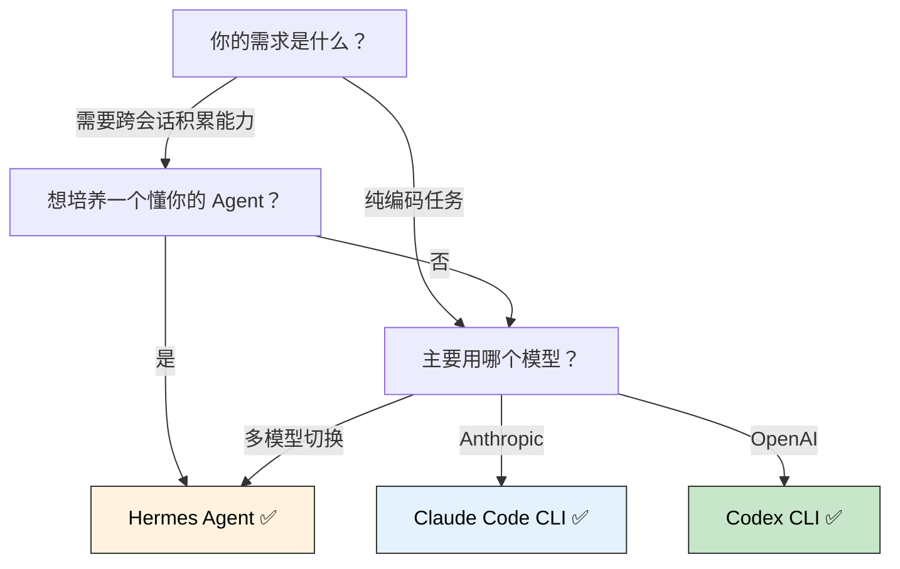
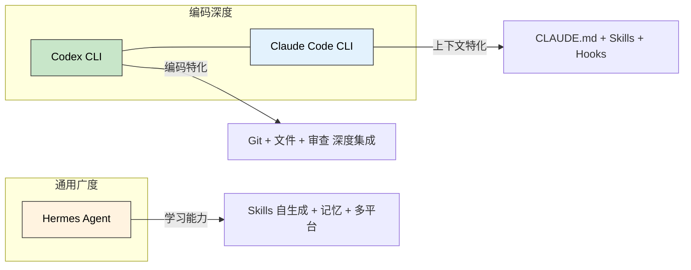

> 🎯 **一句话定位**：Hermes Agent 是目前唯一内置"学习循环"的开源 AI Agent——它不只会执行任务，还会从经验中自动创建技能、持续自我改进，让 Agent 越用越强。
>
> 💡 **核心理念**：Agent 的价值不在于它能调用多少工具，而在于它能否把每次交互都转化为可复用的能力——技能从使用中产生、知识在会话间延续、模型随用户成长而适配。

---

## 📖 3 分钟速览版

<details>
<summary><strong>📊 点击展开：Hermes Agent 核心能力速览 + 三工具快速对比</strong></summary>

### Hermes Agent 一句话

Nous Research 推出的开源 AI Agent，MIT 协议，Python 实现。核心差异化能力：从使用中学习的闭环。

### 核心对比速览

| 维度 | Hermes Agent | Claude Code CLI | Codex CLI |
|------|-------------|-----------------|-----------|
| **开发者** | Nous Research | Anthropic | OpenAI |
| **协议** | MIT 开源 | 专有（免费使用） | 专有（订阅制） |
| **语言/技术栈** | Python (10.7k 行核心) | Node.js / TypeScript | Node.js / TypeScript |
| **模型绑定** | 18+ 提供商，自由切换 | Anthropic 系列 | OpenAI 系列 |
| **学习能力** | ✅ 自动创建 Skill + 自我改进 | ⚠️ 手动 SKILL.md + CLAUDE.md | ❌ 无内置学习 |
| **记忆系统** | MEMORY.md + USER.md + FTS5 搜索 | CLAUDE.md + hooks + MCP | .codex/config.toml |
| **内置工具** | 47 工具 / 19 工具集 | 随版本增长 | 随版本增长 |
| **终端后端** | 本地 / Docker / SSH / Daytona / Singularity / Modal | 本地 | 本地 |
| **平台覆盖** | CLI + 15+ 消息平台 + IDE ACP + Python 库 | CLI only | CLI + IDE 插件 |
| **MCP 支持** | ✅ 原生 | ✅ 原生 | ✅ 原生 |
| **安全机制** | 审批 + 容器隔离 + Tirith 扫描 + 密钥脱敏 | 审批 + sandbox + hooks | 审批 |
| **定价** | 免费（自备 API key） | 免费 + 订阅制高级功能 | OpenAI 订阅/API 付费 |
| **安装方式** | curl-to-bash 一键 | npm install -g | npm install -g |
| **Windows 支持** | ❌ 需 WSL2 | ✅ 原生 | ✅ 原生 |

### 选型决策树



</details>

---

## 背景：为什么关注 Hermes Agent

作为 Claude Code CLI 和 Codex 的日常用户，有几个痛点你大概也碰到过：

- **痛点 1：每个新会话"从零开始"**。CLAUDE.md 和 SKILL.md 能提供项目上下文，但 Agent 不会从你的使用中自动积累经验——每次会话都是独立事件。你今天纠正过的错误用法，明天它照样犯。
- **痛点 2：CLI 的限制**。Claude Code 和 Codex 都绑在终端里，你离开电脑就只能等。没法在手机上通过 Telegram 看一眼进度，也没法让 Agent 定时巡检项目。
- **痛点 3：Skills 全靠手动维护**。写 SKILL.md 是体力活——你要先意识到某个流程值得沉淀，再手工撰写、测试、迭代。Agent 不会帮你做这件事。
- **痛点 4：单模型锁定**。用 Claude Code 就只能用 Anthropic 模型，用 Codex 就只能用 OpenAI。想切模型？换个工具。

Hermes Agent 的定位正好打在这些痛点上。它不是另一个编码 Agent，而是 **学会从使用中成长的通用 Agent**。Nous Research 是 Hermes 模型系列的创造者，在开源 AI 社区有相当影响力（Hermes 系列是 HuggingFace 上下载量最高的指令微调模型之一）。他们把模型训练中对"学习"的理解注入了这个 Agent 产品。

---

## 核心能力拆解

### 2.1 学习循环：从使用到技能的闭环

这是 Hermes 最根本的差异化能力。它的工作方式是：

1. **观察**——Agent 在执行任务时，记录哪些操作成功、哪些踩坑
2. **抽象**——完成复杂任务（5+ 次工具调用）后，自动将成功路径编码为 Skill
3. **复用**——下次遇到类似场景，Agent 自动加载对应 Skill
4. **改进**——Skill 在使用中被持续打磨，成功的操作强化、低效的路径被替换

这个流程对应到开发者的实际工作里：部署脚本、日志分析模式、数据库巡检流程——这些重复性任务会随着使用次数的增加而逐步自动化。

与 Claude Code Skills 的本质区别：

|  | Claude Code Skills | Hermes Skills |
|--|-------------------|---------------|
| **创建方式** | 人工编写 SKILL.md | Agent 自动创建 |
| **优化方式** | 人工迭代 | Agent 自我改进 |
| **共享标准** | GitHub / npm 安装 | agentskills.io 开放标准 |
| **生命周期** | 静态，除非人工更新 | 随使用持续进化 |

agentskills.io 是一个开放标准，意味着 Hermes 创建的技能可以在其他兼容 Agent 之间迁移。社区可以通过 Skills Hub 贡献和共享技能，目前已有 7 个来源（包括 OpenAI、Anthropic 官方技能仓库、Vercel skills.sh 等）。

> 有一个关键细节值得注意：Skills 系统的"渐进式披露"设计。Agent 只在真正需要时才加载 Skill 的完整内容（三级加载：列表→摘要→全文），最大程度节省 token 消耗。

### 2.2 记忆系统：跨会话的知识延续

Hermes 的记忆架构是三层设计：

| 层级 | 载体 | 容量 | 作用 |
|------|------|------|------|
| **持久记忆** | MEMORY.md（~2,200 chars） | 8-15 条记录 | Agent 认为重要的事：环境配置、项目约定、踩过的坑 |
| **用户画像** | USER.md（~1,375 chars） | 5-10 条记录 | 用户偏好、沟通风格、工作习惯、技术水平 |
| **会话搜索** | SQLite FTS5（`~/.hermes/state.db`） | 无限 | 全文搜索历史会话 + Gemini Flash 摘要 |

关键差异在于**谁来决定存什么**。Claude Code 的 MEMORY.md 靠你主动说"记住这个"；Hermes 的 Agent 会自行判断并自动保存——你纠正它一次，它下次会主动避开同样的坑。

记忆的注入机制也值得一提：系统 prompt 在会话开始时冻结快照（为了保持 LLM 的 prefix cache 性能），所以会话内的记忆变更不会立刻生效，但在下次会话启动时自动注入。

此外，Hermes 支持 8 个外部记忆提供者插件（Honcho、Mem0、Holographic 等），这些运行在持久记忆之上，提供知识图谱、语义搜索、跨会话用户建模等增强能力。Honcho 在其中比较特别——它专注于"辩证式用户建模"，不只记住你说过什么，还会推断你的决策模式和思维习惯。

### 2.3 多平台覆盖：不止于终端

Hermes 的设计哲学是"一个 Agent，所有平台"。它的核心 `AIAgent` 类同时服务五个入口：

- **CLI**：全功能 TUI，支持多行编辑、斜杠命令、流式工具输出
- **Gateway**：单一进程管理 18 个消息平台适配器（Telegram、Discord、Slack、WhatsApp、Signal、Matrix、Mattermost、Email、SMS、钉钉、飞书、企业微信、BlueBubbles、QQ Bot、Home Assistant 等）
- **ACP Adapter**：通过 stdio / JSON-RPC 接入支持 Agent Communication Protocol 的 IDE（VS Code、Zed、JetBrains）
- **Batch Runner**：批量轨迹生成，面向研究和评估
- **Python Library**：`import hermes` 直接嵌入 Python 项目

实际场景：在电脑上通过 Docker 后端跑 Hermes，它会做代码分析和定时任务；你在手机上通过 Telegram 收到结果推送，可以直接回复指令。

### 2.4 终端隔离与安全

Hermes 的终端工具有 6 种后端，安全层级是逐步递进的：

| 后端 | 隔离程度 | 适用场景 |
|------|---------|---------|
| **Local** | 无隔离 | 开发、受信任任务 |
| **Docker** | 容器隔离（cap drop、no new privileges、256 PID 限制） | 安全性要求高的操作 |
| **SSH** | 远程隔离 | 让 Agent 远离自己的代码 |
| **Daytona** | 云端开发环境 | 持久化远程沙箱 |
| **Singularity** | HPC 容器 | 集群计算、rootless 工作负载 |
| **Modal** | 无服务器云执行 | 可扩展的按需运行 |

安全机制是四层叠加：

1. **命令审批**——支持手动/智能/关闭三种模式，智能模式用辅助 LLM 评估风险后自动放行低风险命令
2. **容器隔离**——Docker/Singularity 后端提供完全隔离的执行环境
3. **Tirith 扫描**——执行终端命令前进行安全扫描（可配置超时和失败开放策略）
4. **密钥脱敏**——检测输出中的 API key、token、密码并自动遮盖

这种多层安全设计让 Hermes 可以放心跑在服务器上——不像 Claude Code 和 Codex，基本只能在本地终端用。

### 2.5 工具集与调度系统

47 个内置工具按 19 个工具集组织，覆盖：

- **Web**：搜索、内容提取、爬虫
- **终端**：6 种后端的命令执行、后台进程管理（含 PTY 模式支持 Codex/Claude Code 等交互式 CLI）
- **浏览器**：Playwright 自动化，支持文本和视觉模式
- **媒体**：视觉分析、图片生成、TTS
- **编排**：TODO 管理、子 Agent 委派、代码执行
- **记忆**：Memory 工具、会话搜索

Cron 调度是 Hermes 的一个强项——它不是"在 shell 里加了个 crontab 的 wrapper"，而是 Agent 的一等公民能力。你可以用自然语言描述："每天早上 9 点检查项目的依赖更新，通过 Telegram 通知我"——Agent 自己会创建、调度、执行这个任务。

子 Agent 委派（`delegate_task`）也是重要特性——主 Agent 可以 spawn 隔离子 Agent 并行处理不同任务，每个子 Agent 有自己的上下文窗口。最大并发 3 个子 Agent，委派深度可配（1-3 层）。

### 2.6 模型自由

Hermes 支持 18+ LLM 提供商，包括：

- Anthropic（Claude Opus 4.7 / Sonnet 4.6 等）
- OpenAI / Codex
- OpenRouter（200+ 模型）
- Google Gemini
- DeepSeek
- Kimi Coding
- 阿里百炼
- NIM、Groq、xAI 等

一句 `hermes model` 就能热切换，不需要改配置或重启。这对于需要根据不同任务选择不同模型的场景非常实用——比如用 Claude 做推理、用 Gemini 做压缩、用 DeepSeek 做低成本批量任务。

---

## 优缺点分析

### 优势

| # | 优势 | 说明 |
|---|------|------|
| 1 | **学习循环** | 唯一具备"用中学"能力的 Agent，技能自动生成、自我改进 |
| 2 | **模型自由** | 18+ 提供商，一句命令热切换，避免供应商锁定 |
| 3 | **全平台覆盖** | CLI + 15 消息平台 + IDE + Python 库，部署到 VPS 后在手机上收发 |
| 4 | **MIT 开源** | 完全免费，代码可审计、可定制、可商用 |
| 5 | **记忆深度** | 三层架构 + Honcho 用户建模 + 8 外部记忆插件，跨会话积累远超同类 |
| 6 | **安全层级** | 容器隔离 + Tirith + 密钥脱敏 + 命令审批，四层防护可放心部署到服务器 |
| 7 | **研究生态** | RL 训练环境（Atropos） + 轨迹生成 + 压缩器，不仅是工具也是研究平台 |
| 8 | **Cron 一等公民** | 自然语言描述定时任务，Agent 自己创建和管理 |
| 9 | **迁移友好** | 内置 OpenClaw 一键迁移，导入所有配置和记忆 |

### 劣势

| # | 劣势 | 说明 |
|---|------|------|
| 1 | **无原生 Windows** | 必须通过 WSL2 间接使用，Windows 桌面用户有额外一层 |
| 2 | **非编程专用** | 通用 Agent 定位，编码深度不如 Claude Code 和 Codex 的 Git/文件/审查集成 |
| 3 | **上手门槛** | 10.7k 行核心 + 大量配置选项，比 `npm install -g && claude` 重得多 |
| 4 | **Python 技术栈** | 对于 Node.js/TypeScript 生态的开发者，调试和定制的语言成本高 |
| 5 | **学习循环质量存疑** | "自动创建技能"是把双刃剑——质量差的 Skill 可能固化错误模式，需要定期审查 |
| 6 | **文档成熟度** | 相比 Anthropic / OpenAI 官方产品的文档完整度仍有差距，部分页面（如 Godmode）还是占位 |
| 7 | **无内置代码审查** | Claude Code 有 `/review`，Codex 有 `/codex:review`，Hermes 需要手工搭建审查流程 |
| 8 | **配额不可预测** | 学习循环 + 记忆强化的后台消耗不易预估，建议先在便宜 API 后端上实验 |

---

## 深度对比：Hermes Agent vs Claude Code CLI vs Codex

### 架构理念对比

| 维度 | Hermes Agent | Claude Code CLI | Codex CLI |
|------|-------------|-----------------|-----------|
| **核心理念** | 学习型——经验积累，越用越强 | 上下文型——CLAUDE.md + Skills + Hooks 构建工作上下文 | 任务型——专注编码任务的端到端完成 |
| **"大脑"模型** | 记忆 + 技能 + 用户画像三层 | CLAUDE.md 项目说明书 | .codex/config.toml |
| **自主程度** | 最高（自我创建技能、自动维护记忆） | 中（在 hooks/sandbox 约束内自主） | 中（工具调用 + 子任务委派） |
| **设计哲学** | 平台化——一个 Agent 跑在所有地方 | 嵌入式——深度集成终端和项目 | 专用化——围绕 OpenAI 模型优化 |

### 开发体验对比

| 场景 | Hermes Agent | Claude Code CLI | Codex CLI |
|------|-------------|-----------------|-----------|
| **从零写功能** | 适合，但需要先"培养"对项目的理解 | **最佳**——CLAUDE.md 让首句话就有上下文 | 好——GPT-5.x 对代码生成有针对性优化 |
| **代码审查** | 需自行搭建流程 | `/review` + 插件生态 | `/codex:review` + `/codex:adversarial-review` |
| **Bug 调查** | 可能更好——如果积累过类似场景的 Skill | 好——可直接执行命令复现 | 好——`/codex:rescue` 后台调查 |
| **跨会话延续** | **最佳**——MEMORY.md + FTS5 自动召回历史 | 依赖 `--resume` 恢复特定会话 | 依赖 `--resume` |
| **移动端接入** | ✅ Telegram / Discord / Slack 等 | ❌ 仅终端 | ❌ 仅终端 |
| **定时任务** | ✅ 自然语言 Cron | ❌ 需外部 cron / systemd | ❌ 需外部 cron / systemd |
| **模型切换** | 一行 `hermes model` 热切换 | 仅 Anthropic 系列 | 仅 OpenAI 系列 |
| **安装成本** | curl-to-bash（~60s）| npm install -g（~30s）| npm install -g（~30s）|
| **Windows 体验** | WSL2 only | ✅ 原生 | ✅ 原生 |

### 生态定位



### 关键差异总结

1. **模型的维度**：Claude Code 和 Codex 锁定单一模型系列（深度优化）；Hermes 绑定用户选择（自由度和不确定性并存）
2. **记忆的维度**：Claude Code / Codex 是"你告诉它记住"；Hermes 是"它自己判断并记住"——前者可控，后者可能发现你忽视的模式
3. **平台的维度**：Claude Code / Codex 是终端工具；Hermes 是消息平台 + 终端 + IDE + Python 库的平台化 Agent
4. **学习的维度**：这是 Hermes 的根本差异化——其他 Agent 每次使用是独立事件，Hermes 把每次使用变成成长增量

---

## 实际使用场景映射

| 你的场景 | 推荐工具 | 理由 |
|---------|---------|------|
| 日常编码、写功能、改 Bug | Claude Code CLI / Codex | 编码深度集成最好 |
| 需要第二双眼睛做代码审查 | Codex Plugin + Claude Code | 双引擎交叉验证 |
| 想在手机上跟进 Agent 任务 | **Hermes Agent** | 唯一支持消息平台 |
| 想长期培养懂你项目的 Agent | **Hermes Agent** | 学习循环 + 用户建模 |
| 需要定时自动任务 | **Hermes Agent** | Cron 一等公民 |
| 想自由切换底层模型 | **Hermes Agent** | 18+ 提供商 |
| 纯 Windows 桌面环境 | Claude Code CLI / Codex | Hermes 无原生 Windows |
| 刚入门 AI 辅助编程 | Claude Code CLI | CLAUDE.md 上手最快 |
| 想一次性低成本体验 | Claude Code CLI + Hermes 并行 | 两者免费且互补 |
| 需要部署到服务器长期运行 | **Hermes Agent** | 容器隔离 + 多层安全 |

---

## 上手路径与建议

### 安装

```bash
# Linux / macOS / WSL2（唯一前置：git）
curl -fsSL https://raw.githubusercontent.com/NousResearch/hermes-agent/main/scripts/install.sh | bash
source ~/.bashrc
hermes  # 进入交互式引导，配置模型和 API key
```

安装器会自动处理 Python 3.11 (via uv)、Node.js 22、ripgrep、ffmpeg 等依赖。

### 从 Claude Code 用户视角的迁移建议

不要用"替代"思维，用"互补"思维：

- **Claude Code** 继续做日常编码主力——它的 Git/文件/审查集成是最成熟的
- **Hermes** 负责三个 Claude Code 做不到的事：
  1. **长期运行的定时任务**（项目健康巡检、依赖更新检查、日志异常扫描）
  2. **消息平台接入**（通过 Telegram 接收任务结果、手机端下发指令）
  3. **知识积累**（通过学习循环把重复性运维/部署流程逐步自动化）

两者可以通过 MCP 互通——Hermes 可以连接 Claude Code 的 MCP server，反之亦然。

### 风险提示

- 学习循环的 API quota 消耗可能超预期，建议先在 OpenRouter 免费额度或便宜的 API 后端上实验
- 自动创建的 Skill 需要定期审查——AI 可能学到并固化错误的"模式"
- Windows 用户必须接受 WSL2 的额外层
- 不要在生产环境直接开放所有工具权限——利用审批和容器隔离

---

## FAQ

**Q1: Hermes Agent 能替代 Claude Code CLI 吗？**

不能，也不应该。两者的定位不同：Claude Code 是嵌入式编码工具，Hermes 是平台化通用 Agent。它们在同一个工作流里是互补关系——Claude Code 做编码主力，Hermes 做长期知识积累和跨平台接入。

**Q2: 学习循环真的有用吗？会不会学到错误的习惯？**

这是个合理的担忧。学习循环的价值体现在重复性任务上——当你多次执行类似的部署、巡检、排查流程时，Agent 会逐步优化这些路径。但质量确实取决于生成的 Skill 是否经过验证，建议定期用 `hermes skills list` 审查自动创建的技能。

**Q3: Hermes 的 Skills 和 Claude Code 的 Skills 有什么区别？**

格式兼容（都是 Markdown + YAML frontmatter），但 Hermes Skills 多了 agentskills.io 标准支持，可以跨 Agent 迁移。更关键的区别：Hermes 的 Agent 可以自动创建和优化 Skills，Claude Code 的技能全靠人工维护。

**Q4: Hermes Agent 在国内网络环境能用吗？**

Hermes 本身是本地安装的，API 调用取决于你选的模型提供商。如果用 DeepSeek、阿里百炼、Kimi Coding 这些国内提供商，网络不是问题。OpenRouter 在中国大陆的可用性不稳定。Telegram 接入需要代理。

**Q5: 安装需要什么前置条件？**

唯一硬性要求是 Git。安装器会自动处理 Python 3.11、Node.js 22、ripgrep、ffmpeg。需要至少一个 LLM 提供商的 API key。Docker、Modal、Daytona 等后端是可选的。

**Q6: API 配额消耗大概多少？**

这取决于你使用的模型和任务复杂度。内存和技能系统的额外开销约 1,300 tokens / 会话（记忆注入）。如果用 Gemini Flash 做压缩和搜索摘要，这笔开销很小。学习循环的消耗取决于技能创建频率。

**Q7: 如何确保自动创建的 Skill 质量？**

定期运行 `hermes skills list` 审查 Skills 列表，用 `hermes skills inspect <name>` 查看具体内容，不满意的直接 `hermes skills uninstall <name>`。也可以在 `config.yaml` 中限制 Skills 的自动创建频率。

**Q8: 和 Claude Code 可以同时使用吗？**

可以。两者互不冲突——Hermes 通过 Docker/SSH 后端运行，Claude Code 在本地终端。通过 MCP 还能互通。Hermes 也支持 PTY 模式，可以在其终端工具里运行 Claude Code 和 Codex。

---

## 总结

Hermes Agent 的核心差异化不是工具数量或平台覆盖的广度，而是**学习循环**——这是目前 Claude Code 和 Codex 都不具备的能力。它把每次使用视为一次学习机会，技能从使用中产生、知识在会话间延续。

但这也意味着它和 Claude Code / Codex 不在同一个品类。它不是编程工具的替代品，而是一个互补角色：

- **Claude Code** 是你日常编码的最佳搭档——它深度嵌入终端、Git 和你的项目
- **Codex** 为 OpenAI 生态的编码任务提供针对性优化
- **Hermes** 填补了前两者做不到的事——长期知识积累、跨平台接入、自主调度

如果你是一个 AI 工具的早期采用者，想在编码主力之外探索"Agent 如何学会我的项目和个人偏好"这个命题，Hermes 值得花一个下午来尝试。MIT 协议意味着你可以零成本持有，等它的学习能力持续产生复利。

**行动建议**：

- **今天**：在 WSL2 或 Linux 环境 `curl | bash` 安装，用 OpenRouter 免费额度跑 30 分钟体验
- **本周**：让 Hermes 对接一个项目仓库，观察它在 3-5 次对话后是否产生有用的 Skill
- **持续观察**：学习循环的质量、agentskills.io 社区的技能共享生态发展

---

## 更新记录

| 版本 | 日期 | 说明 |
|------|------|------|
| v1.0 | 2026-04-24 | 初始版本，基于 Hermes Agent v0.11.0 |
