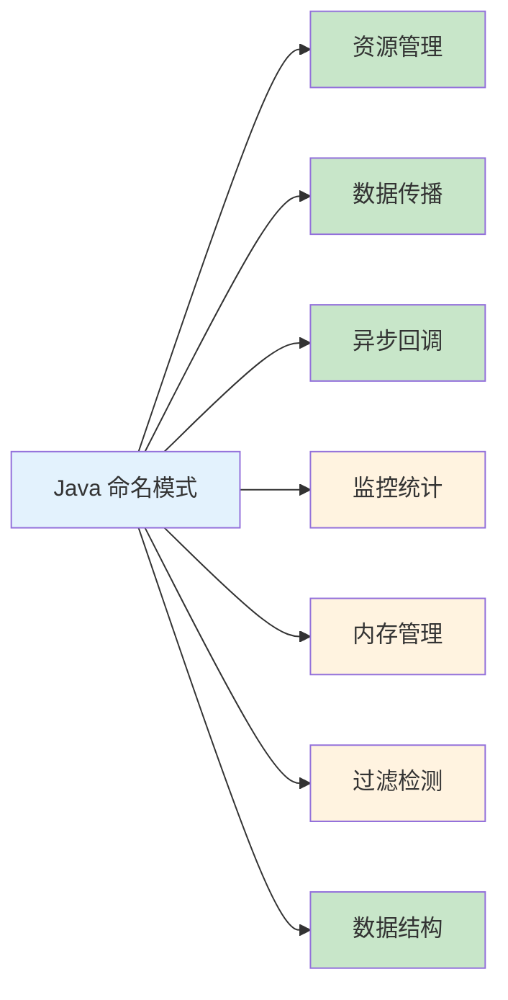

> 🎯 **一句话定位**：Java 类/变量命名的速查词典，覆盖 11 大类 50+ 常用命名模式
> 💡 **核心理念**：好的命名 = 自文档化代码，选对后缀就能让阅读者秒懂类的职责

---

## 📖 3分钟速览版

<details>
<summary><strong>📊 点击展开命名模式全景图</strong></summary>

### 🔌 11 类命名模式总览



### 💎 命名速查表

| 你想表达的意思 | 推荐后缀 | 典型示例 |
|-------------|---------|---------|
| 启动入口 | Bootstrap / Starter | `ServerBootstrap` |
| 处理某个流程 | Processor | `BeanPostProcessor` |
| 管理资源生命周期 | Manager | `TransactionManager` |
| 创建对象 | Factory | `BeanFactory` |
| 持有引用/全局缓存 | Holder | `ViewHolder` |
| 注册资源 | Registrar | `ImportServiceRegistrar` |
| 传递上下文变量 | Context | `ApplicationContext` |
| 响应事件/消息 | Handler / Callback / Listener | `ChannelHandler` |
| 收集监控数据 | Metric / Tracker | `TimelineMetric` |
| 分配内存 | Allocator / Pool | `ArrayAllocator` |
| 过滤/拦截请求 | Filter / Interceptor | `ScanFilter` |
| 责任链处理 | Pipeline / Chain | `FilterChain` |
| 缓存数据 | Cache / Buffer | `LoadingCache` |
| 包装增强对象 | Wrapper / Adapter | `QueryWrapper` |
| 限流控制 | Limiter | `RateLimiter` |
| 策略切换 | Strategy / Provider | `AppStrategy` |
| 构建复杂对象 | Builder | `RequestBuilder` |
| 转换格式 | Converter / Formatter | `DateFormatter` |
| 解析字符串/DSL | Parser / Resolver | `SQLParser` |
| 代理访问控制 | Proxy / Delegate | `SlowQueryProxy` |

### 🎯 查询方法命名规范（阿里巴巴）

| 操作 | 命名 | 示例 |
|-----|------|------|
| 查询单个对象 | `getXxx` | `getStudent` |
| 查询多个对象 | `listXxx` | `listStudents` |
| 分页查询 | `pageXxx` | `pageStudents` |

</details>

---

## 🧠 深度剖析版

## 1. 管理类命名

> 统一资源管理，清晰的启动过程可以有效的组织代码，覆盖资源的注册、调度和集合管理。

### 1.1 Bootstrap / Starter

一般作为启动程序使用，或者作为启动器的基类。通俗来说，可以认为是 main 函数的入口。

```java
AbstractBootstrap
ServerBootstrap
MacosXApplicationStarter
DNSTaskStarter
```

### 1.2 Processor

某一类功能的处理器，用来表示某个处理的过程，是一系列代码片段的集合。如果不知道一些顺序类的代码怎么命名，可以使用 Processor。

```java
CompoundProcessor
BinaryComparisonProcessor
DefaultDefaultValueProcessor
BeanPostProcessor
```

### 1.3 Manager

对有生命状态的对象进行管理，通常作为某一类资源的管理入口。

```java
AccountManager
DevicePolicyManager
TransactionManager
```

### 1.4 Holder

表示持有某个或者某类对象的引用，并可以对其进行统一管理。多见于不好回收的内存统一处理，或者一些全局集合容器的缓存。

```java
QueryHolder
InstructionHolder
ViewHolder
```

### 1.5 Factory

工厂模式的命名，Spring 中非常常见。

```java
SessionFactory
ScriptEngineFactory
LiveCaptureFactory
BeanFactory
```

### 1.6 Provider

Provider = Strategy + Factory Method，把策略模式和方法工厂揉在一起，让人用起来顺手。Provider 一般是接口和抽象类，由子类完成具体实现。

### 1.7 Registrar

注册并管理一系列资源。

```java
ImportServiceRegistrar
IKryoRegistrar
PipelineOptionRegistrar
```

### 1.8 Engine

一般是核心模块，用来处理一类功能。引擎是个非常高级的名词，一般的类没有资格使用。

```java
ScriptEngine
DataQLScriptEngine
C2DEngine
```

### 1.9 Service

某个服务。范围太广，勿滥用。

```java
IntegratorServiceImpl
ISelectionService
PersistenceService
```

### 1.10 Task

某个任务，通常是个 Runnable。

```java
WorkflowTask
FutureTask
ForkJoinTask
```

## 2. 传播类命名

> 为了完成一些设计类或者全局类的功能，有些参数需要一传到底。传播类的对象可以通过统一封装的方式进行传递，并在合适的地方进行拷贝和更新。

### 2.1 Context

程序执行中，有一些变量需要从函数执行的入口开始，一直传到大量子函数执行完毕后。这些变量或者集合，如果以参数的形式传递，会让代码变得冗长。这时候可以把变量统一塞到 Context 里，以单个对象的形式进行传递。

在 Java 中，由于 ThreadLocal 的存在，Context 甚至可以不用在参数之间进行传递。

```java
AppContext
ServletContext
ApplicationContext
```

### 2.2 Propagator

传播器，用来将 Context 中传递的值进行复制、添加、清除、重置、检索、恢复等动作。通常它会提供一个叫做 `propagate` 的方法，实现真正的变量管理。

```java
TextMapPropagator
FilePropagator
TransactionPropagator
```

## 3. 回调类命名

> 使用多核可以增加程序运行的效率，不可避免地引入异步化。需要获取异步任务执行的结果，对任务执行过程中的关键点进行检查。回调类 API 可以通过监听、通知等方式获取这些事件。

### 3.1 Handler / Callback / Trigger / Listener

四者的区别：

| 名称 | 特点 | 使用场景 |
|-----|------|---------|
| Callback | 接口，用于响应某类消息 | 异步回调处理 |
| Handler | 有状态的消息处理对象 | 消息处理逻辑 |
| Trigger | 触发器，属于 Handler | 事件触发，通常不出现在类命名中 |
| Listener | 局限性更强 | 观察者模式中的监听 |

```java
ChannelHandler
SuccessCallback
CronTrigger
EventListener
```

### 3.2 Aware

感知的意思，一般以该单词结尾的类都实现了 Aware 接口。在 Spring 中，Aware 的目的是为了让 Bean 获取 Spring 容器的服务，具体回调方法由子类实现。

```java
ApplicationContextAware
ApplicationStartupAware
ApplicationEventPublisherAware
```

## 4. 监控类命名

> 程序较复杂时，运行状态监控和监控数据的收集需要侵入程序的边边角角，有效地与正常业务进行区分非常有必要。

### 4.1 Metric

表示监控数据。**不要再用 Monitor 了。**

```java
TimelineMetric
HistogramMetric
Metric
```

### 4.2 Estimator

估计、统计。用于计算某一类统计数值的计算器。

```java
ConditionalDensityEstimator
FixedFrameRateEstimator
NestableLoadProfileEstimator
```

### 4.3 Accumulator

累加器，用来缓存累加的中间计算结果，并提供读取通道。

```java
AbstractAccumulator
StatsAccumulator
TopFrequencyAccumulator
```

### 4.4 Tracker

一般用于记录日志或者监控值，通常用于 APM 中。

```java
VelocityTracker
RocketTracker
MediaTracker
```

## 5. 内存管理类命名

> 如果用到了自定义的内存管理，使用以下命名方式。Netty 实现了自己的内存管理机制。

### 5.1 Allocator

与储存相关，通常表示内存分配器或者管理器。如果程序需要申请有规律的大块内存，建议以 Allocator 命名。

```java
AbstractByteBufAllocator
ArrayAllocator
RecyclingIntBlockAllocator
```

### 5.2 Chunk

表示一块内存，如果想要对这一类储存资源进行抽象并统一管理，可以使用此命名。

```java
EncryptedChunk
ChunkFactory
MultiChunk
```

### 5.3 Arena

Linux 把它用在内存管理上，普遍用于各种储存资源的申请、释放与管理。为不同规格的储存 Chunk 提供舞台。

```java
BookingArena
StandaloneArena
PoolArena
```

### 5.4 Pool

表示池子——内存池、线程池、连接池。

```java
ConnectionPool
ObjectPool
MemoryPool
```

## 6. 过滤检测类命名

> 程序收到的事件和信息非常多，有些合法，有些需要过滤。根据不同的使用范围和功能性差别，过滤操作也有很多形式。

### 6.1 Pipeline / Chain

一般在责任链模式中使用。Netty、SpringMVC、Tomcat 等都有大量应用。通过将某个处理过程加入到责任链的某个位置中，就可以接收前面处理过程的结果，强制添加或者改变某些功能。就像 Linux 的管道操作一样，最终构造出想要的结果。

```java
Pipeline
ChildPipeline
DefaultResourceTransformerChain
FilterChain
```

### 6.2 Filter

过滤器，用来筛选某些满足条件的数据集，或者在满足某些条件的时候执行一部分逻辑。如果和责任链连接起来，则通常能够实现多级过滤。

```java
FilenameFilter
AfterFirstEventTimeFilter
ScanFilter
```

### 6.3 Interceptor

拦截器，和 Filter 相似。但是在 Tomcat 中，Interceptor 可以拿到 Controller 对象，而 Filter 不行。拦截器被包裹在过滤器中。

```java
HttpRequestInterceptor
```

### 6.4 Evaluator

评估器，用于判断某些条件是否成立。一般内部方法 `evaluate` 会返回 boolean 类型。

```java
ScriptEvaluator
SubtractionExpressionEvaluator
StreamEvaluator
```

### 6.5 Detector

探测器，用来管理一系列探测性事件，并在发生的时候进行捕获和响应。比如 Android 的手势检测、温度检测等。

```java
FileHandlerReloadingDetector
TransformGestureDetector
ScaleGestureDetector
```

## 7. 结构类命名

> 除了基本的数据结构（数组、链表、队列、栈等），其他更高一层的常见抽象类，能够大量减少交流成本，并封装常见变化。

### 7.1 Cache vs Buffer

| 名称 | 用途 | 典型场景 |
|-----|------|---------|
| Cache | 缓存，读优化 | LRU、LFU、FIFO 等缓存算法 |
| Buffer | 缓冲，写优化 | 数据写入阶段的临时存储 |

```java
// Cache
LoadingCache
EhCacheCache

// Buffer
ByteBuffer
RingBuffer
DirectByteBuffer
```

### 7.2 Composite

将相似的组件组合，并以相同接口或者功能暴露，使用者不知道是组合体还是其他个体。

```java
CompositeData
CompositeMap
ScrolledComposite
```

### 7.3 Wrapper

用来包装某个对象，做一些额外的处理，以便增加或者去掉某些功能。

```java
IsoBufferWrapper
ResponseWrapper
MavenWrapperDownloader
QueryWrapper
```

### 7.4 Option / Param / Attribute

用来表示配置信息。通常比 Config 级别小，关注单个属性值。Param 一般是作为参数，对象生成速度更快。

```java
SpecificationOption
SelectOption
AlarmParam
ModelParam
```

### 7.5 Tuple

元组，Java 中缺乏元组结构，通常会自定义这样的类（Python 原生支持）。

```java
Tuple2
Tuple3
```

### 7.6 Aggregator

聚合器，可以做一些聚合计算。比如分库分表中的 SUM、MAX、MIN 等聚合函数的汇集。

```java
BigDecimalMaxAggregator
PipelineAggregator
TotalAggregator
```

### 7.7 Iterator

迭代器，可以实现 Java 的迭代器接口。数据集很大时需要进行深度遍历，迭代器必备。使用迭代器可以在迭代过程中安全地删除某些元素。

```java
BreakIterator
StringCharacterIterator
```

### 7.8 Batch

某些可以批量执行的请求或者对象。

```java
SaveObjectBatch
BatchRequest
```

### 7.9 Limiter

限流器，使用漏桶算法或者令牌桶来完成平滑的限流。

```java
DefaultTimepointLimiter
RateLimiter
TimeBasedLimiter
```

## 8. 设计模式类命名

> 常见设计模式对应的命名后缀，仅列出常用。

### 8.1 Strategy

策略模式——相同接口，不同实现类，同一方法结果不同，实现策略不同。

```java
RemoteAddressStrategy
StrategyRegistration
AppStrategy
```

### 8.2 Adapter

适配器模式——将一个类的接口转换为客户希望的另一个接口。常见用法是对 Handler 中大量方法提供默认实现，子类只需重写需要的方法。

```java
ExtendedPropertiesAdapter
ArrayObjectAdapter
CardGridCursorAdapter
```

### 8.3 Action / Command

命令模式——将请求封装成对象，用来实现命令模式。Action 一般用在 UI 操作上，后端框架可以无差别使用。在 DDD 的 CQRS 概念中，C 即为 Command。

```java
DeleteAction
BoardCommand
```

### 8.4 Event

表示一系列事件。在语义上，Action/Command 来自于**主动触发**，Event 来自于**被动触发**。

```java
ObservesProtectedEvent
KeyEvent
```

### 8.5 Delegate

委托模式——将一件属于委托者做的事情，交给另一个委托者来处理。

```java
LayoutlibDelegate
FragmentDelegate
```

### 8.6 Builder

构建者模式——将一个复杂对象的构建与它的表示分离，使得同样的构建过程可以创建不同的表示。

```java
JsonBuilder
RequestBuilder
```

### 8.7 Template

模版方法模式——定义一个操作中的算法骨架，将一些步骤延迟到子类中。子类可以不改变算法结构即可重定义某些特定步骤。

```java
JDBCTemplate
RedisTemplate
```

### 8.8 Proxy

代理模式——为其他对象提供一种代理以控制对这个对象的访问。

```java
ProxyFactory
SlowQueryProxy
```

## 9. 解析类命名

> 程序设计中大量的字符串解析、日期解析、对象转换。根据语义和使用场合的区别，分为多种。

### 9.1 Converter / Resolver

转换和解析。一般用于不同对象之间的格式转换。特别复杂的转换或者有加载过程的需求，可以使用 Resolver。

```java
DataSetToListConverter
LayoutCommandLineConverter
InitRefResolver
MustacheViewResolver
```

### 9.2 Parser

用来表示非常复杂的解析器，比如 DSL 解析。

```java
SQLParser
JSONParser
```

### 9.3 Customizer

用来表示对某个对象进行特别的配置。由于配置过程特别复杂，值得单独提取出来进行自定义设置。

```java
ContextCustomizer
DeviceFieldCustomizer
```

### 9.4 Formatter

格式化类。主要用于字符串、数字或者日期的格式化处理工作。

```java
DateFormatter
StringFormatter
```

## 10. 网络类命名

> 网络编程中的常用命名。

| 后缀 | 用途 | 示例 |
|-----|------|------|
| Packet | 网络数据包 | `DhcpPacket`、`PacketBuffer` |
| Protocol | 协议表示 | `RedisProtocol`、`HttpProtocol` |
| Encoder / Decoder | 编码解码 | `RedisEncoder`、`RedisDecoder` |
| Codec | 编解码器 | `RedisCodec` |
| Request / Response | 网络请求的进出 | 仅用于网络请求场景 |

## 11. CRUD 命名与其他

### 11.1 CRUD 三层命名

```java
xxController  // 控制层
xxService     // 服务层
xxDao         // 数据访问层
```

### 11.2 工具类

| 后缀 | 特点 | 示例 |
|-----|------|------|
| Util | 无状态，静态方法 | `HttpUtil` |
| Helper | 需要创建实例 | `CreationHelper` |

### 11.3 枚举与类型

```java
OperationMode  // mode 后缀多半是枚举
BridgeMode
ActionType
```

### 11.4 Invoker / Invocation

Invoker 是一类接口，通常会以反射或者触发的方式执行具体的逻辑业务。通过抽象出 `invoke` 方法，可以在执行之前对入参进行记录或处理，在执行之后对结果和异常进行处理，是 AOP 中常见的操作方式。

```java
MethodInvoker
Invoker
ConstructorInvocation
```

### 11.5 Initializer

初始化类。

```java
MultiBackgroundInitializer
ApplicationContextInitializer
```

### 11.6 Future / Promise

在多线程之间进行数据传递。Future 相当于一个占位符，代表一个操作将来的结果。一般通过 `get` 可以直接阻塞得到结果，或者让它异步执行然后通过 Callback 回调结果。`CompletableFuture` 用来解决回调地狱，`Promise` 为了让代码变得更简洁。

### 11.7 其他常用后缀

| 后缀 | 用途 | 示例 |
|-----|------|------|
| Selector | 根据条件获取同类资源 | `NodeSelector` |
| Reporter | 汇报执行结果 | `MetricReporter` |
| Constants | 常量列表 | `AppConstants` |
| Accessor | 封装 get/set，通过计算完成 | `StompHeaderAccessor` |
| Generator | 生成器，生成代码或 ID | `CodeGenerator` |

## 💬 常见问题（FAQ）

### Q1: Manager 和 Service 有什么区别？

**A:** Manager 侧重于对有生命周期状态的对象进行管理（创建、销毁、状态转换），如 `TransactionManager`。Service 更偏向于业务逻辑的封装，范围更广。建议：如果类主要职责是管理资源的生命周期，用 Manager；如果是提供业务功能，用 Service。

### Q2: Handler 和 Callback 什么时候用哪个？

**A:** Handler 通常是有状态的，持有真正的消息处理逻辑；Callback 通常是一个无状态的接口，用于异步响应。如果你的处理器需要维护状态信息，用 Handler；如果只是简单的回调通知，用 Callback。

### Q3: Converter 和 Resolver 怎么选？

**A:** Converter 用于简单直接的格式转换（如 `DataSetToListConverter`）。Resolver 用于更复杂的解析过程，通常涉及查找、加载等操作（如 `MustacheViewResolver` 需要定位模板文件并解析）。

### Q4: Cache 和 Buffer 有什么区别？

**A:** Cache 是缓存，优化**读**操作，存储计算结果避免重复计算。Buffer 是缓冲，优化**写**操作，临时存储数据等待批量写入。简单记忆：读用 Cache，写用 Buffer。

### Q5: 什么时候应该用 Factory，什么时候用 Builder？

**A:** Factory 适合创建结构相对简单的对象，通常一步到位。Builder 适合创建参数较多、构建过程复杂的对象，支持链式调用逐步配置。当构造函数参数超过 4 个时，优先考虑 Builder。

## ✨ 总结

### 核心要点

1. **选对后缀是关键**：好的类名后缀让阅读者秒懂类的职责，无需查看实现代码
2. **区分相似命名**：Manager vs Service、Cache vs Buffer、Converter vs Resolver 各有侧重
3. **遵循框架惯例**：Spring 的 Factory/Template/Aware、Netty 的 Handler/Pipeline 等，保持一致性

### 行动建议

- **开发时**：遇到新类命名犹豫时，回来查阅本文速查表
- **Code Review 时**：关注命名是否准确表达类的职责
- **团队协作**：统一命名规范，减少沟通成本

> 命名是编程中最难的事情之一，但好的命名能让代码自己说话。

---

## 更新记录

| 版本 | 日期 | 说明 |
|------|------|------|
| v1.0 | 2023-03-03 | 初始版本 |
| v1.1 | 2026-03-11 | 优化文档结构，添加速查表、对比分析和 FAQ |
