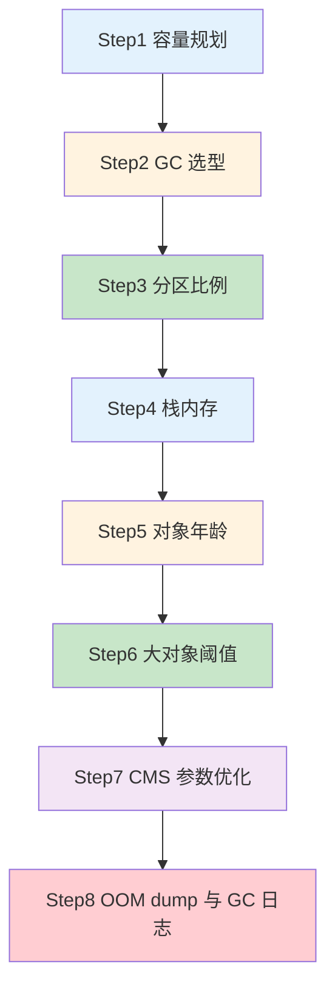

> 🎯 **一句话定位**：以每天 100w 次登录请求、8G 内存服务器为例，手把手推演 JVM 参数从零到生产级的 8 步调优过程
> 💡 **核心理念**：JVM 调优的本质是让短命对象在新生代被回收，长命对象尽早进入老年代，最终减少 Full GC 频率

---

## 📖 3分钟速览版

<details>
<summary><strong>📊 点击展开：JVM 调优 8 步法速查</strong></summary>

### 🔌 JVM 调优 8 步流程



### 💎 CMS vs G1 对比

| 维度 | ParNew + CMS | G1 |
| --- | --- | --- |
| 适用堆大小 | < 4G | >= 8G |
| 优化目标 | 低延迟（响应优先） | 高吞吐（吞吐优先） |
| 新生代设置 | 手动指定 `-Xmn` | 不建议手动设置 |
| 调优复杂度 | 较高，需精细调参 | 较低，主要调 MaxGCPauseMillis |
| 老年代回收 | 标记-清除 + 整理 | 混合回收（MixGC） |
| STW 特点 | 初始标记和重新标记阶段 STW | 可控停顿时间 |
| 推荐场景 | 延迟敏感型业务（如登录系统） | 大内存服务（如数据处理平台） |

### 🎯 JVM 参数速查表

| 参数 | 作用 | 推荐值 |
| --- | --- | --- |
| `-Xms` / `-Xmx` | 堆内存大小（最小/最大设为一致） | OS 内存的一半 |
| `-Xmn` | 新生代大小 | 堆的 3/8（Sun 推荐） |
| `-Xss` | 线程栈大小 | 512K ~ 1M |
| `-XX:SurvivorRatio` | Eden 与 Survivor 比例 | 8（即 8:1:1） |
| `-XX:MaxTenuringThreshold` | 对象晋升老年代的年龄 | 5 ~ 15 |
| `-XX:PretenureSizeThreshold` | 大对象直接进老年代的阈值 | 1M |
| `-XX:CMSInitiatingOccupancyFraction` | CMS 触发 GC 的老年代占用率 | 70 |
| `-XX:MaxGCPauseMillis` | G1 最大 GC 停顿时间目标 | 150 ~ 200 |

</details>

---

## 🧠 深度剖析版

## 1. 新系统上线如何规划容量（Step1）

### 1.1 建模套路总结

任何新业务系统上线前都需要估算服务配置和 JVM 的内存参数，容量和资源规划并不仅仅是随意估算的，需要根据系统所在的业务场景估算，推算出一个系统运行模型，评估 JVM 性能和 GC 频率等指标。

建模步骤：

- 计算业务系统每秒创建的对象会占用多大的内存空间，然后计算每个集群下每个系统每秒的内存占用空间（对象的创建速度）
- 设置一个机器配置，估算新生代的空间，比较不同新生代大小之下，多久触发一次 Minor GC

> Minor GC：当 Eden 区域不足分配时就会触发。

- 根据这套配置，基本可以推算出整个系统的运行模型，每秒钟创建多少对象，1s 后成为垃圾，系统运行多久新生代会触发一次 GC，频率多高

### 1.2 套路实战——以登录系统为例

模拟推演过程：

- 假设每天 100w 次登录请求，登录峰值在早上，预估峰值时期每秒 100 次登录请求
- 假设部署三台服务器，每台服务器每秒处理 30 次登录请求，假设一个登录请求需要处理 1 秒钟，JVM 新生代每秒就要生成 30 个登录对象，1s 之后请求完毕这些对象成为了垃圾
- 一个登录对象假设 20 个字段，一个对象估算 500 字节，30 个登录占用大约 15KB，考虑到 RPC 和 DB 操作，网络通信，写库，写缓存一顿操作下来，可以扩大到 20-50 倍，大约 1s 产生几百 KB 到 1MB 数据
- 假设 2C4G 机器部署，分配 2G 堆内存，新生代则只有几百 MB，按照 1s 1MB 的垃圾产生速度，几百秒就会触发一次 Minor GC
- 假设 4C8G 机器部署，分配 4G 堆内存，新生代分配 2G，如此需要几个小时才会触发一次 Minor GC

所以可以粗略推断出一个每天 100w 次请求的登录系统，按照 4C8G 的 3 实例集群配置，分配 4G 堆内存，2G 新生代的 JVM，可以保证系统的一个正常负载。

## 2. 该如何进行垃圾回收器的选择（Step2）

### 2.1 吞吐量优先还是响应时间优先

吞吐量 = CPU 在用户应用程序运行的时间 /（CPU 在用户应用程序运行的时间 + CPU 垃圾回收的时间）

响应时间 = 平均每次 GC 的耗时

通常这在 JVM 中是两难之选。

堆内存增大，GC 一次能处理的数量变大，吞吐量变大；但是 GC 一次的时间会变长，导致后面排队的线程等待时间变长；相反，如果堆内存小，GC 一次时间短，排队等待的线程等待时间变短，延迟减少，但一次请求的数量变小（并不绝对）。

无法同时兼顾，是吞吐优先还是响应优先，这是一个需要权衡的问题。

### 2.2 垃圾回收设计上的考量

- JVM 在 GC 时不允许一边垃圾回收，一边创建新对象
- JVM 需要一段 Stop The World 的暂停时间，STW 会造成系统短暂停顿不能处理任何请求
- 新生代收集频率高，性能优先，常用复制算法；老年代频次低，空间敏感，避免复制方式
- 所有垃圾回收器的设计目标都是让 GC 频率更少，时间更短，减少 GC 对系统影响

### 2.3 CMS 和 G1

目前主流的垃圾回收器配置是新生代采用 ParNew，老年代采用 CMS 组合的方式，或者是完全采用 G1 回收器。

从未来趋势来看，G1 是官方维护和更为推崇的垃圾回收器。

- 响应优先：ParNew + CMS 组合
  - `-XX:+UseParNewGC`（CMS 默认）
  - `-XX:+UseConcMarkSweepGC`

- 吞吐优先：G1 回收器
  - `-XX:+UseG1GC`

系统业务选型：

- 延迟敏感推荐使用 CMS
- 大内存服务，要求高吞吐量的，采用 G1 回收器

### 2.4 CMS 垃圾回收器的工作机制

CMS 主要是针对老年代的回收器，老年代是标记-清除，默认会在一次 Full GC 算法后做整理算法，清理内存碎片。

| CMS GC | 描述 | Stop The World | 速度 |
| :---: | :--- | :---: | :---: |
| 1.初始标记 | 仅标记 GC Roots 能关联到的对象，速度很快 | Yes | 很快 |
| 2.并发标记 | 进行 GC Roots Tracing 的过程 | No | 慢 |
| 3.重新标记 | 修正并发标记期间因用户程序继续运作而导致标记变动的那一部分对象的标记记录 | Yes | 很快 |
| 4.并发清理 | 并发清理垃圾对象 | No | 慢 |

- 优点：并发收集，主打低延迟。在最耗时的两个阶段都没有发生 STW
- 缺点：1.消耗 CPU 2.浮动垃圾 3.内存碎片
- 适用场景：重视服务器响应速度，要求系统停顿时间最短

## 3. 如何对每个分区的比例、大小进行规划（Step3）

### 3.1 一般思路

首先，JVM 最重要最核心的参数是去评估内存和分配，第一步需要指定堆内存大小，这是系统上线前必须要做的。`-Xms` 初始堆大小，`-Xmx` 最大堆大小，后台 Java 服务中一般都指定为系统内存的一半，过大会占用服务器的系统资源，过小则无法发挥出 JVM 的最佳性能。

其次，需要指定 `-Xmn` 新生代的大小，这个参数非常关键，灵活度很大。Sun 官方推荐为 3/8 大小，但是要根据业务场景来定：

- 无状态或轻状态服务（如 Web 应用）：新生代甚至可以给到堆内存 3/4 的大小
- 有状态服务（如 IM 服务、网关接入层）：新生代可以按照默认比例 1/3 来设置。有状态意味着会有更多的本地缓存和会话状态信息常驻内存，因此要给老年代设置更大的内存

最后，设置 `-Xss` 栈内存大小，设置单个线程栈大小，默认值和 JDK 版本、系统有关，一般默认 512~1024KB。一个后台服务如果常驻线程有几百个，那么栈内存也会占用几百 MB 的大小。

| JVM 参数 | 描述 | 默认 | 推荐 |
| --- | --- | --- | --- |
| `-Xms` | Java 堆内存大小 | OS 内存 1/64 | OS 内存一半 |
| `-Xmx` | Java 堆内存最大大小 | OS 内存 1/4 | OS 内存一半 |
| `-Xmn` | 新生代大小，扣除新生代剩下的就是老年代 | 堆内存 1/3 | Sun 推荐 3/8 |
| `-Xss` | 每个线程的栈内存大小 | 和 JDK 有关 | 512K~1M |

### 3.2 实战推演

对于 8G 内存，一般分配一半的最大内存就可以了，即 4G 内存分配给 JVM。

引入性能压测环节，测试同学对登录接口压至 1s 内 50MB 的对象生成速度，采用 ParNew+CMS 的组合回收器。

正常的 JVM 参数如下：

```shell
-Xms3072M -Xmx3072M -Xss1M -XX:MetaspaceSize=256M -XX:MaxMetaspaceSize=256M -XX:SurvivorRatio=8
```

这样设置可能会由于动态对象年龄判断原则导致频繁 Full GC。

压测过程中，短时间（比如 20s）Eden 区就满了，此时对象已经无法分配，会触发 Minor GC。

假设在这次 GC 后 S1 装入 100MB，马上 20s 后又会触发一次 Minor GC，多出来的 100MB 存活对象加上 S 区的 100MB 已经无法顺利放入到 S2 区，此时就会触发 JVM 的动态年龄机制，将一批 100MB 左右的对象推到老年代保存，持续运行一段时间，系统可能一个小时内就会触发一次 Full GC。

按照默认 8:1:1 比例分配，Survivor 区只有 1G 的 10%，也就是几十到 100MB。

如果每次 Minor GC 垃圾回收后进入 Survivor 对象很多，并且 Survivor 对象大小很快超过 Survivor 的 50%，那么就会触发动态年龄判定规则，让部分对象进入老年代。

### 3.3 解决方案：调大 Survivor 区

为了让对象尽可能在新生代的 Eden 区和 Survivor 区，尽可能的让 Survivor 区内存多一点，达到 200MB 左右。

于是更新 JVM 参数如下：

```shell
-Xms3072M -Xmx3072M -Xmn2048M -Xss1M -XX:MetaspaceSize=256M -XX:MaxMetaspaceSize=256M -XX:SurvivorRatio=8

# 说明：
# -Xmn2048M -XX:SurvivorRatio=8
# 年轻代大小2G，Eden与Survivor的比例为8:1:1，也就是1.6G:0.2G:0.2G
```

Survivor 达到 200MB，几十 MB 对象到达 Survivor，Survivor 也不一定超过 50%。这样可以防止每次垃圾回收后，Survivor 对象太早超过 50%，从而降低了因为对象年龄判断原则导致对象频繁进入老年代的问题。

### 3.4 什么是 JVM 动态年龄判断规则

对象进入老年代的**动态年龄判断规则**（动态晋升年龄计算阈值）：Minor GC 时，Survivor 中年龄 1 到 N 的对象大小超过 Survivor 的 50% 时，则将大于等于年龄 N 的对象放入老年代。

核心优化策略：

- 让短期存活的对象尽量都留在 Survivor 里，不要进入老年代，这样在 Minor GC 时这些对象都会被回收，不会进到老年代从而导致 Full GC

## 4. 栈内存大小多少比较合适（Step4）

`-Xss` 栈内存大小，设置单个线程栈大小，默认值和 JDK 版本、系统有关，一般默认 512~1024KB。一个后台服务如果常驻线程有几百个，那么栈内存这边也会占用了几百 MB 的大小。

## 5. 对象年龄应该为多少才移动到老年代比较合适（Step5）

假设一次 Minor GC 要间隔 20~30s，并且大多数对象在几秒内就会变为垃圾。

那么对象长时间没有被回收，比如 2 分钟没有回收，可以认为这些对象是会存活比较长的对象，从而移动到老年代，而不是继续一直占用 Survivor 区空间。

所以可以将默认的 15 岁改小一点，比如改为 5。那么意味着对象要经过 5 次 Minor GC 才会进入老年代，整个时间也有一两分钟了（5 x 30s = 150s），和几秒的时间相比，对象已经存活了足够长的时间了。

所以适当调整 JVM 参数如下：

```shell
-Xms3072M -Xmx3072M -Xmn2048M -Xss1M -XX:MetaspaceSize=256M -XX:MaxMetaspaceSize=256M -XX:SurvivorRatio=8 -XX:MaxTenuringThreshold=5
```

## 6. 多大的对象可以直接到老年代（Step6）

对于多大的对象直接进入老年代（参数 `-XX:PretenureSizeThreshold`），一般可以结合自己系统看下有没有什么大对象生成，预估下大对象的大小，一般来说设置为 1M 就差不多了，很少有超过 1M 的大对象。

```shell
-Xms3072M -Xmx3072M -Xmn2048M -Xss1M -XX:MetaspaceSize=256M -XX:MaxMetaspaceSize=256M -XX:SurvivorRatio=8 -XX:MaxTenuringThreshold=5 -XX:PretenureSizeThreshold=1M
```

## 7. 垃圾回收器 CMS 老年代的参数优化（Step7）

### 7.1 回收器组合选择

JDK8 默认的垃圾回收器是 `-XX:+UseParallelGC`（年轻代）和 `-XX:+UseParallelOldGC`（老年代）。

如果内存较大（超过 4G），建议使用 G1。

这里是 4G 以内，又是主打"低延时"的业务系统，可以使用下面的组合：

```text
ParNew + CMS（-XX:+UseParNewGC -XX:+UseConcMarkSweepGC）
```

新生代采用 ParNew 回收器，工作流程就是经典复制算法，在三块区中进行流转回收，只不过采用多线程并行的方式加快了 Minor GC 速度。

老年代采用 CMS。再去**优化老年代参数**：比如老年代默认在标记清除以后会做整理，还可以在 CMS 的增加 GC 频次还是增加 GC 时长上做些取舍。

### 7.2 响应优先的参数调优

```shell
-XX:CMSInitiatingOccupancyFraction=70
```

设定 CMS 在内存占用率达到 70% 的时候开始 GC（因为 CMS 会有浮动垃圾，所以一般较早启动 GC）。

```shell
-XX:+UseCMSInitiatingOccupancyOnly
```

和上面搭配使用，否则只生效一次。

```shell
-XX:+AlwaysPreTouch
```

强制操作系统把内存真正分配给 JVM。

### 7.3 完整 CMS 参数模板

综上，只要年轻代参数设置合理，老年代 CMS 的参数设置基本都可以用默认值，如下所示：

```shell
-Xms3072M -Xmx3072M -Xmn2048M -Xss1M -XX:MetaspaceSize=256M -XX:MaxMetaspaceSize=256M -XX:SurvivorRatio=8 -XX:MaxTenuringThreshold=5 -XX:PretenureSizeThreshold=1M -XX:+UseParNewGC -XX:+UseConcMarkSweepGC -XX:CMSInitiatingOccupancyFraction=70 -XX:+UseCMSInitiatingOccupancyOnly -XX:+AlwaysPreTouch
```

**参数解释：**

1. `-Xms3072M -Xmx3072M`：最小最大堆设置为 3G，最大最小设置为一致防止内存抖动
2. `-Xss1M`：线程栈 1M
3. `-Xmn2048M -XX:SurvivorRatio=8`：年轻代大小 2G，Eden 与 Survivor 的比例为 8:1:1，也就是 1.6G:0.2G:0.2G
4. `-XX:MaxTenuringThreshold=5`：年龄为 5 进入老年代
5. `-XX:PretenureSizeThreshold=1M`：大于 1M 的大对象直接在老年代生成
6. `-XX:+UseParNewGC -XX:+UseConcMarkSweepGC`：使用 ParNew+CMS 垃圾回收器组合
7. `-XX:CMSInitiatingOccupancyFraction=70`：老年代中对象达到这个比例后触发 Full GC
8. `-XX:+UseCMSInitiatingOccupancyOnly`：老年代中对象达到这个比例后触发 Full GC，每次
9. `-XX:+AlwaysPreTouch`：强制操作系统把内存真正分配给 JVM，而不是用时才分配

## 8. 配置 OOM 时的内存 dump 文件和 GC 日志（Step8）

### 8.1 OOM 自动 dump

额外增加了 GC 打印日志，OOM 自动 dump 等配置内容，帮助进行问题排查。

```shell
-XX:+HeapDumpOnOutOfMemoryError
```

在 OOM、JVM 快要死掉的时候，输出 Heap Dump 到指定文件。路径只指向目录，JVM 会保持文件名的唯一（`java_pid${pid}.hprof`）。

```shell
-XX:+HeapDumpOnOutOfMemoryError
-XX:HeapDumpPath=${LOGDIR}/
```

因为如果指向特定的文件，而文件已存在，反而不能写入。

输出 4G 的 HeapDump，会导致 IO 性能问题，在普通硬盘上，会造成 20 秒以上的硬盘 IO 跑满。需要注意，在容器环境下，这也会影响同一宿主机上的其他容器。

### 8.2 GC 日志输出

GC 日志的输出也很重要：

```shell
-Xloggc:/dev/xxx/gc.log
-XX:+PrintGCDateStamps
-XX:+PrintGCDetails
```

## 9. 通用模板

### 9.1 基于 4C8G 系统的 ParNew+CMS 回收器模板（响应优先）

新生代大小根据业务灵活调整！不能保证性能最佳，但是至少能让 JVM 这一层是稳定可控的。

```shell
-Xms4g
-Xmx4g
-Xmn2g
-Xss1m
-XX:SurvivorRatio=8
-XX:MaxTenuringThreshold=10
-XX:+UseConcMarkSweepGC
-XX:CMSInitiatingOccupancyFraction=70
-XX:+UseCMSInitiatingOccupancyOnly
-XX:+AlwaysPreTouch
-XX:+HeapDumpOnOutOfMemoryError
-verbose:gc
-XX:+PrintGCDetails
-XX:+PrintGCDateStamps
-XX:+PrintGCTimeStamps
-Xloggc:gc.log
```

### 9.2 基于 8C16G 系统的 G1 回收器模板（吞吐优先）

G1 收集器自身已经有一套预测和调整机制了，因此首先的选择是相信它，即调整 `-XX:MaxGCPauseMillis=N` 参数，这也符合 G1 的目的——让 GC 调优尽量简单！

同时也不要自己显式设置新生代的大小（用 `-Xmn` 或 `-XX:NewRatio` 参数），如果人为干预新生代的大小，会导致目标时间这个参数失效。

```shell
-Xms8g
-Xmx8g
-Xss1m
-XX:+UseG1GC
-XX:MaxGCPauseMillis=150
-XX:InitiatingHeapOccupancyPercent=40
-XX:+HeapDumpOnOutOfMemoryError
-verbose:gc
-XX:+PrintGCDetails
-XX:+PrintGCDateStamps
-XX:+PrintGCTimeStamps
-Xloggc:gc.log
```

| G1 参数 | 描述 | 默认值 |
| --- | --- | --- |
| `-XX:MaxGCPauseMillis=N` | 最大 GC 停顿时间。柔性目标，JVM 满足 90% 不保证 100% | 200 |
| `-XX:InitiatingHeapOccupancyPercent=N` | 当整个堆的空间使用百分比超过这个值时，就会触发 MixGC | 45 |

针对 `-XX:MaxGCPauseMillis` 来说，参数的设置带有明显的倾向性：调低：延迟更低，但 Minor GC 频繁，MixGC 回收老年代区减少，增大 Full GC 的风险。调高：单次回收更多的对象，但系统整体响应时间也会被拉长。

针对 `-XX:InitiatingHeapOccupancyPercent` 来说，调参大小的效果也不一样：调低：更早触发 MixGC，浪费 CPU。调高：堆积过多待回收 region，增大 Full GC 的风险。

## 💬 常见问题（FAQ）

### Q1: 为什么 -Xms 和 -Xmx 要设置成一样大？

**A:** 如果 `-Xms` 和 `-Xmx` 不一致，JVM 会在运行过程中根据需要动态扩缩堆内存，每次调整都会触发一次 Full GC，导致"内存抖动"。在生产环境中，将两者设为一致可以避免不必要的 Full GC，保持服务稳定。

### Q2: 什么时候该选 CMS，什么时候该选 G1？

**A:** 核心判断标准有两个：

- **堆大小**：堆内存 < 4G 时用 CMS，>= 8G 时用 G1。4G~8G 之间两者皆可
- **业务特点**：延迟敏感型（如登录、支付）倾向 CMS；大内存、高吞吐型（如数据处理、批量计算）倾向 G1

从 JDK9 开始，CMS 已被标记为废弃，新项目建议优先考虑 G1。

### Q3: 动态年龄判断规则频繁触发导致 Full GC，怎么排查？

**A:** 排查步骤：

1. 开启 GC 日志（`-XX:+PrintGCDetails -XX:+PrintGCDateStamps`）
2. 观察 Minor GC 后 Survivor 区的占用情况
3. 如果 Survivor 区频繁超过 50%，说明 Survivor 太小或存活对象太多
4. 解决方案：增大新生代（`-Xmn`），让 Survivor 区有更大空间；或者降低 `MaxTenuringThreshold` 让长命对象尽快晋升老年代

### Q4: G1 的 MaxGCPauseMillis 设太低会有什么问题？

**A:** `MaxGCPauseMillis` 设太低（如 50ms），G1 为了满足停顿时间目标，每次 MixGC 只会回收少量 region，导致：

1. Minor GC 频率大幅增加
2. 老年代回收速度跟不上对象晋升速度
3. 最终触发 Full GC（G1 的 Full GC 是单线程的，停顿时间很长）

建议从 200ms 开始调优，根据实际 GC 日志逐步微调，通常 150~200ms 是比较合理的范围。

### Q5: JVM 调优是不是性能优化的第一选择？

**A:** 不是。JVM 调优的优先级应该排在后面，推荐的优化顺序为：

1. **架构优化**：合理的系统拆分、缓存策略、异步化
2. **代码优化**：减少不必要的对象创建、避免大对象、合理使用数据结构
3. **SQL/IO 优化**：慢查询优化、连接池配置
4. **JVM 调优**：在以上都优化完的基础上，最后对 JVM 参数进行精细化调整

JVM 调优是对服务器配置的最后一次"压榨"，不能替代架构和代码层面的优化。

## ✨ 总结

### 核心要点

1. **业务预估**：根据预期的并发量、平均每个任务的内存需求大小，然后评估需要几台机器来承载，每台机器需要什么样的配置
2. **容量预估**：根据系统的任务处理速度，然后合理分配 Eden、Survivor 区大小，老年代的内存大小
3. **回收器选型**：响应优先的系统，建议采用 ParNew+CMS 回收器；吞吐优先、多核大内存（heap size >= 8G）服务，建议采用 G1 回收器
4. **优化思路**：让短命对象在 Minor GC 阶段就被回收（同时回收后的存活对象小于 Survivor 区域 50%，可控制保留在新生代），长命对象尽早进入老年代，不要在新生代来回复制；尽量减少 Full GC 的频率，避免 Full GC 对系统的影响
5. **上线前测试验证**：尽量在上线之前，就将机器的 JVM 参数设置到最优

### 行动建议

- **上线之前**：应先考虑将机器的 JVM 参数设置到最优
- **代码层面**：减少创建对象的数量，减少使用全局变量和大对象
- **架构层面**：优先架构调优和代码调优，JVM 优化是不得已的手段
- **持续优化**：分析 GC 情况优化代码比优化 JVM 参数更好

通过以上原则，我们发现最有效的优化手段是架构和代码层面的优化，而 JVM 优化则是最后不得已的手段，也可以说是对服务器配置的最后一次"压榨"。

## 更新记录

| 版本 | 日期 | 说明 |
|------|------|------|
| v1.0 | 2023-03-03 | 初始版本 |
| v1.1 | 2026-03-11 | 优化文档结构，添加速查版、对比分析和 FAQ |
