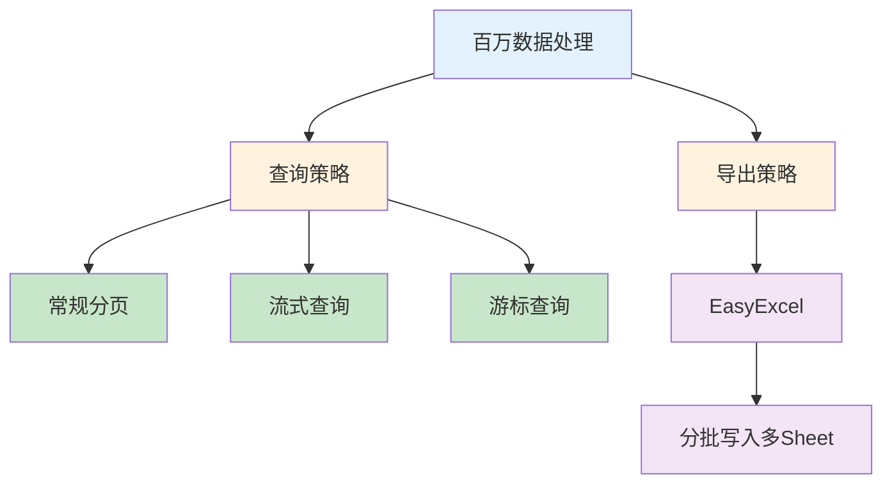

> 🎯 **一句话定位**：掌握 MySQL 百万级数据的查询与导出方案，避免 OOM、慢查询等生产事故
> 💡 **核心理念**：大数据操作的关键在于"分而治之"——分批查询、分批写入、控制内存占用

---

## 📖 3分钟速览版

<details>
<summary><strong>📊 点击展开核心概念</strong></summary>

### 🔌 核心概念



<details>
<summary>**🖼️ 插图版（2026-04-17 增量补充）**</summary>


</details>

### 💎 三种查询方式对比

| 对比维度 | 常规分页 | 流式查询 | 游标查询 |
|---------|---------|---------|---------|
| **内存占用** | 高（全量加载） | 低（逐行读取） | 中（按批读取） |
| **查询方式** | 多次 SQL 查询 | 一次查询，逐行返回 | 一次查询，按批返回 |
| **连接占用** | 每次查询短暂占用 | 长连接，独占 | 长连接，独占 |
| **深分页性能** | 差（OFFSET 越大越慢） | 不涉及分页 | 不涉及分页 |
| **适用场景** | 数据量 < 10 万 | 数据量大，逐行处理 | 数据量大，批量处理 |
| **实现复杂度** | 低 | 中 | 中 |

### 🎯 决策要点

- **数据量 < 10 万**：直接使用常规分页查询
- **数据量 10 万~100 万，需逐行处理**：使用流式查询
- **数据量 10 万~100 万，需批量处理**：使用游标查询
- **数据导出到 Excel**：使用 EasyExcel + 分批查询 + 多 Sheet 写入

</details>

---

## 🧠 深度剖析版

## 1. 大数据操作场景

大数据操作的常见场景：

- 数据迁移
- 数据导出
- 批量处理数据

实际工作中，当查询数据过大时，一般采用分页查询的方式一页一页将数据存放到内存中。不分页，或者分页很大时，如果一下将数据全部加载出来到内存中，很可能发生 OOM，而且查询很慢，因为框架耗费大量时间去把数据库查询的结果封装成我们要的实体类。

**举例**：在业务系统需要从 MySQL 数据库里读取 100w 数据行进行处理，应该怎么做？

做法通常如下：

1. **常规查询**：一次性读取 100w 数据到内存中，或者分页读取
2. **流式查询**：建立长连接，利用服务端游标，每次读取一条加载到 JVM 内存（多次获取，一次一行）
3. **游标查询**：和流式一样，通过 fetchSize 参数，控制一次读取多少数据（多次获取，一次多行）

## 2. 常规分页查询

> 默认情况下，完整的检索结果会将其储存在内存中。大多数情况下，这是最有效的操作方式，并且由于 MySQL 网络协议的设计，因此更易于实现。

### 2.1 代码示例

假设单表 100w 数据，一般采用分页的方式查询：

```java
@Mapper
public interface BigDataSearchMapper extends BaseMapper<BigDataSearchEntity> {

    @Select("SELECT bds.* FROM big_data_search bds ${ew.customSqlSegment} ")
    Page<BigDataSearchEntity> pageList(@Param("page") Page<BigDataSearchEntity> page, @Param(Constants.WRAPPER) QueryWrapper<BigDataSearchEntity> queryWrapper);

}
```

**注意**：这里使用 MybatisPlus。该方式比较简单，但在不考虑 Limit 深分页优化的情况下，数据库服务器很快就会出现性能问题，或者可能会花上几十分钟、几个小时、甚至几天时间检索数据。

## 3. 流式查询

> 流式查询是指查询成功后不是返回一个集合，而是返回一个迭代器，应用每次从迭代器取一条查询结果。流式查询的好处是能够降低内存的使用。如果没有流式查询，我们想要从数据库获取 100w 记录而没有足够的内存时，就不得不分页查询，而分页查询的效率取决于表设计，如果设计的不好，就无法执行高效的分页查询。因此流式查询是一个数据库访问框架必须具备的功能。

MyBatis 中使用流式查询避免数据量过大导致 OOM，但在流式查询过程中，数据库连接是保持打开状态的。

因此需要注意：

1. 执行一个流式查询后，数据库访问框架就不负责关闭数据库连接了，需要应用在取完数据后自己关闭
2. 必须先读取（或者关闭）结果集中的所有行，然后才能对连接发出任何其他查询，否则将引发异常

### 3.1 MyBatis 流式查询接口

> MyBatis 提供了一个叫 `org.apache.ibatis.cursor.Cursor` 的接口类用于流式查询，这个接口继承了 `java.io.Closeable` 和 `java.lang.Iterable` 接口。

由此可知：

1. Cursor 是可关闭的
2. Cursor 是可遍历的

除此之外，Cursor 还提供了三个方法：

- `isOpen()`：用于在读取数据之前判断 Cursor 对象是否是打开状态，只有当打开时 Cursor 才能读取数据
- `isConsumed()`：用于判断查询结果是否全部取完
- `getCurrentIndex()`：返回已经获取了多少条数据

使用流式查询，则要保持对产生结果集的语句所引用的表的并发访问，因为其查询会独占连接，所以必须尽快处理。

### 3.2 为什么要用流式查询

- 如果有一个很大的查询结果需要遍历处理，又不想一次性将结果集装入客户端内存，就可以考虑使用流式查询
- 分库分表的场景下，单个表的查询结果集虽然不大，但是如果某个查询跨了多个库多个表，又要做结果集的合并、排序等动作，依然有可能撑爆内存。除了 group by 与 order by 字段不一样之外，其他的场景都非常适合使用流式查询，可以最大限度的降低对客户端内存的消耗

## 4. 游标查询

> 对大量数据进行处理时，为防止内存泄漏情况发生，也可以采用游标方式进行数据查询处理。这种处理方式比常规查询要快很多。
>
> 当查询百万级的数据的时候，还可以使用游标方式进行数据查询处理，不仅可以节省内存的消耗，而且还不需要一次性取出所有数据，可以进行逐条处理或逐条取出部分批量处理。一次查询指定 fetchSize 的数据，直到把数据全部处理完。

### 4.1 代码示例

MyBatis 的处理加了两个注解：`@Options` 和 `@ResultType`

```java
@Mapper
public interface BigDataSearchMapper extends BaseMapper<BigDataSearchEntity> {

    // 方式一 多次获取，一次多行
    @Select("SELECT bds.* FROM big_data_search bds ${ew.customSqlSegment} ")
    @Options(resultSetType = ResultSetType.FORWARD_ONLY, fetchSize = 1000000)
    Page<BigDataSearchEntity> pageList(@Param("page") Page<BigDataSearchEntity> page, @Param(Constants.WRAPPER) QueryWrapper<BigDataSearchEntity> queryWrapper);

    // 方式二 一次获取，一次一行
    @Select("SELECT bds.* FROM big_data_search bds ${ew.customSqlSegment} ")
    @Options(resultSetType = ResultSetType.FORWARD_ONLY, fetchSize = 100000)
    @ResultType(BigDataSearchEntity.class)
    void listData(@Param(Constants.WRAPPER) QueryWrapper<BigDataSearchEntity> queryWrapper, ResultHandler<BigDataSearchEntity> handler);

}
```

### 4.2 注解说明

**@Options**

- `ResultSet.FORWARD_ONLY`：结果集的游标只能向下滚动
- `ResultSet.SCROLL_INSENSITIVE`：结果集的游标可以上下移动，当数据库变化时，当前结果集不变
- `ResultSet.SCROLL_SENSITIVE`：返回可滚动的结果集，当数据库变化时，当前结果集同步改变
- `fetchSize`：每次获取量

**@ResultType**

- `@ResultType(BigDataSearchEntity.class)`：转换成返回实体类型

### 4.3 两种方式的区别

**注意**：返回类型必须为 void，因为查询的结果在 ResultHandler 里处理数据，所以这个 handler 也是必须的，可以使用 lambda 实现一个依次处理逻辑。

**注意**：虽然上述代码都有 `@Options` 但实际操作不同：

1. 方式 1 是多次查询，一次返回多条
2. 方式 2 是一次查询，一次返回一条

**原因**：

- **Oracle**：从服务器一次取出 fetch size 条记录放在客户端，客户端处理完成一个批次后再向服务器取下一个批次，直到所有数据处理完成
- **MySQL**：在执行 `ResultSet.next()` 方法时，会通过数据库连接一条一条的返回。flush buffer 的过程是阻塞式的，如果网络中发生了拥塞，send buffer 被填满，会导致 buffer 一直 flush 不出去，那 MySQL 的处理线程会阻塞，从而避免数据把客户端内存撑爆

### 4.4 非流式与流式查询的对比

1. **非流式查询**：内存会随着查询记录的增长而近乎直线增长
2. **流式查询**：内存会保持稳定，不会随着记录的增长而增长。其内存大小取决于批处理大小 BATCH_SIZE 的设置，该尺寸越大，内存会越大。所以 BATCH_SIZE 应该根据业务情况设置合适的大小

另外要切记每次处理完一批结果要记得释放存储每批数据的临时容器。

## 5. EasyExcel 数据导入导出

### 5.1 传统 POI 版本优缺点比较

| POI 版本 | 支持格式 | 最大行数 | 内存占用 | 适用场景 |
|---------|---------|---------|---------|---------|
| HSSFWorkbook | `.xls`（Excel 2003 及以前） | 65,535 行 | 低 | 小数据量导出 |
| XSSFWorkbook | `.xlsx`（Excel 2007+） | 104 万行 | 高（易 OOM） | 中等数据量，需操作样式 |
| SXSSFWorkbook | `.xlsx`（POI 3.8+） | 104 万行 | 低（磁盘缓存） | 大数据量导出，无需改表头 |

**各版本详细说明**：

- **HSSFWorkbook**：数据量还不到 7 万，所以内存一般都够用，但最多只能导出 65535 行
- **XSSFWorkbook**：突破 65535 行局限，最多可以导出 104 万条数据，但所创建的 book、Sheet、row、cell 等在写入到 Excel 之前都是存放在内存中的，容易 OOM
- **SXSSFWorkbook**：使用硬盘来换取内存空间，支持大型 Excel 文件的创建，但同一时间只能访问一定数量的数据，`sheet.clone()` 方法不再支持，不再支持对公式的求值，不能改动表头

### 5.2 根据情况选择使用方式

1. **数据不超过 7 万**：可以选择使用 `HSSFWorkbook` 或者 `XSSFWorkbook`
2. **数据超过 7 万且不涉及样式/公式操作**：推荐使用 `SXSSFWorkbook`
3. **数据超过 7 万且需要操作表头/样式/公式**：使用 `XSSFWorkbook` 配合分批查询，分批写入

### 5.3 百万级数据导入导出面临的问题

1. 数据量超级大，传统 POI 方式可能导致内存溢出，效率低
2. 不能直接 `select * from tableName`，一次查出 300 万条数据会很慢
3. 不能都写在一个 Sheet 中，效率很低
4. 不能一行一行导出，频繁 IO 操作不可取
5. 导入时不能循环一条条插入
6. 不能使用 Mybatis 批量插入（本质是 SQL 循环，速度慢）

### 5.4 解决思路

1. 使用 EasyExcel 解决内存溢出问题
2. 分批查询代替全量查询
3. 将数据分散写入不同 Sheet（每个 Sheet 100 万条）
4. 分批查询的数据分批写入
5. 达到一定数量后批量插入数据库
6. 使用 JDBC 批量插入 + 事务代替 Mybatis 批量插入

### 5.5 实践案例：模拟 500 万数据导出

使用 `EasyExcel` 完成 500 万数据的导出：

1. 分批查询，例如每次查询 20 万条数据
2. 每次查询结束后，使用 `EasyExcel` 将查询到的数据立即写入
3. 当一个 Sheet 满载 100 万条数据后，开始向另一个 Sheet 写入
4. 循环上述步骤，直至所有数据全部写入 Excel

**注意事项**：

- 需要预先计算 Sheet 的数量，以及每个 Sheet 的写入次数
- 需要计算写入次数，因为写入的次数应与查询的次数一致
- 大批量数据的导出和导入操作会占用大量内存，实际开发中应限制操作人数
- 做大批量数据导入时，可以使用 JDBC 手动开启事务，批量提交

## 💬 常见问题（FAQ）

### Q1: 流式查询过程中能否执行其他 SQL？

**A:** 不能。流式查询会独占数据库连接，在结果集未完全读取或关闭之前，不能对同一连接发出任何其他查询，否则将引发异常。建议使用独立的数据源或连接池来隔离流式查询的连接。

### Q2: MySQL 的 fetchSize 设置为什么不像 Oracle 那样生效？

**A:** MySQL 驱动默认会一次性拉取全部结果到客户端内存。要让 fetchSize 生效，需要同时满足以下条件：

1. 设置 `resultSetType = ResultSetType.FORWARD_ONLY`
2. 设置 `fetchSize = Integer.MIN_VALUE`（流式模式）或具体数值
3. JDBC URL 中添加 `useCursorFetch=true` 参数

### Q3: EasyExcel 导出时为什么要使用多个 Sheet？

**A:** Excel 单个 Sheet 最大支持约 104 万行数据（1,048,576 行）。当数据量超过此限制时，必须分散到多个 Sheet 中。即使数据量未超限，将大量数据写入单个 Sheet 也会导致写入效率下降和内存占用过高。建议每个 Sheet 控制在 100 万条以内。

### Q4: 大数据导出时如何避免 OOM？

**A:** 防止 OOM 的关键策略：

1. **分批查询**：每次从数据库查询固定数量（如 20 万条），而非全量查询
2. **使用 EasyExcel**：它基于 SAX 模式解析，内存占用极低
3. **及时释放**：每批数据写入后，清空临时容器，让 GC 回收
4. **限制并发**：控制同时执行导出操作的用户数
5. **设置 JVM 参数**：适当调大堆内存，如 `-Xmx2g`

### Q5: 流式查询和游标查询应该如何选择？

**A:** 选择依据：

- **流式查询**：适合逐行处理的场景，如数据清洗、逐行转换。内存占用最低，但处理速度相对较慢
- **游标查询**：适合批量处理的场景，如批量写入文件、批量调用 API。通过 fetchSize 控制每批数量，在内存和速度之间取得平衡
- **常规分页**：适合数据量小（< 10 万）或需要随机访问的场景

## ✨ 总结

### 核心要点

1. **查询策略选择**：根据数据量和处理方式，在常规分页、流式查询、游标查询中选择合适的方案
2. **内存控制**：始终遵循"分批处理"原则，避免一次性加载大量数据到内存
3. **导出方案**：使用 EasyExcel 替代传统 POI，配合分批查询和多 Sheet 写入
4. **连接管理**：流式/游标查询会独占连接，务必及时关闭并合理配置连接池

### 行动建议

1. **数据量评估**：在开发前先评估数据量级别，选择对应的技术方案
2. **压力测试**：上线前用真实数据量进行压测，验证内存占用和执行时间
3. **监控告警**：对大数据操作添加内存和耗时监控，设置合理的告警阈值
4. **降级方案**：准备异步导出、文件分片等降级方案，应对突发大数据量场景

---

## 更新记录

| 版本 | 日期 | 说明 |
|------|------|------|
| v1.0 | 2023-03-06 | 初始版本 |
| v1.1 | 2026-03-11 | 优化文档结构，添加速查版、对比分析和 FAQ |
| v1.2 | 2026-04-17 | 为 1 个 Mermaid 图表追加 Chiikawa 风格插图（m2c-pipeline 生成） |
