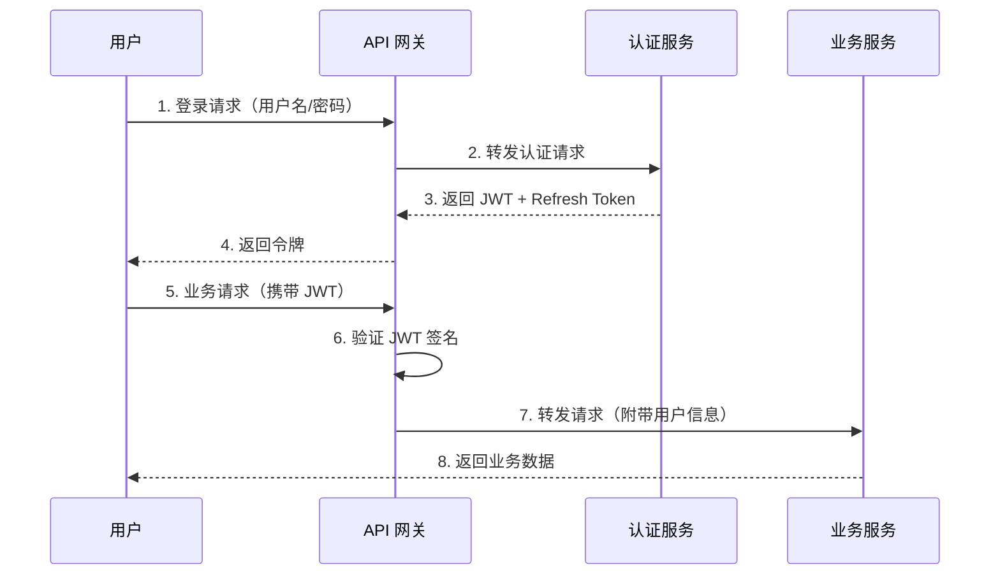
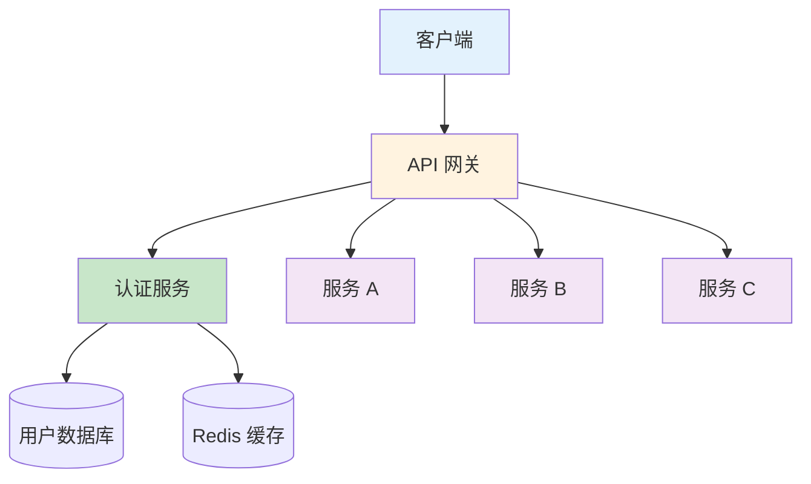
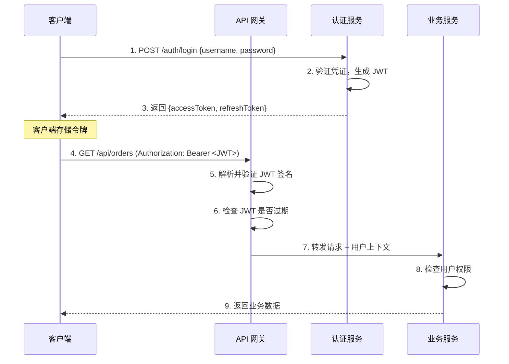
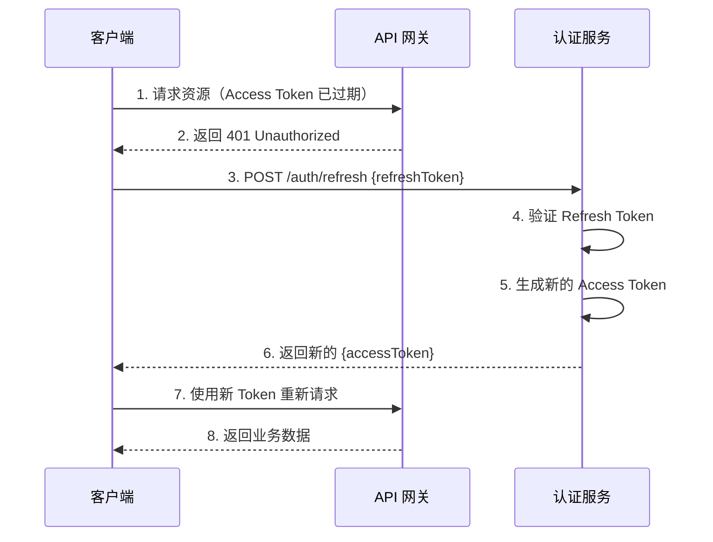

> 🎯 **一句话定位**：从原理到实战，全面掌握微服务架构中权限参数传递的核心方案与最佳实践
> 💡 **核心理念**：无状态认证（JWT） + 标准化授权框架（OAuth2） = 可扩展、高安全的微服务权限体系

---

## 📖 3分钟速览版

<details>
<summary><strong>📊 点击展开核心概念</strong></summary>

### 🔌 JWT 认证流程



### 💎 方案对比

| 特性 | JWT | OAuth2 | Session |
|------|-----|--------|---------|
| **状态管理** | 无状态 | 无状态/有状态 | 有状态 |
| **扩展性** | ⭐⭐⭐ 天然支持分布式 | ⭐⭐⭐ 天然支持分布式 | ⭐ 需要共享存储 |
| **复杂度** | ⭐⭐ 中等 | ⭐⭐⭐ 较高 | ⭐ 低 |
| **安全性** | ⭐⭐ 依赖实现 | ⭐⭐⭐ 成熟标准 | ⭐⭐ 依赖传输层 |
| **适用场景** | 服务间通信 | 第三方授权 | 单体应用 |
| **吊销能力** | 较弱（需额外机制） | 较强（可吊销授权） | 强（直接销毁） |
| **跨域支持** | 原生支持 | 原生支持 | 需要额外配置 |

### 🎯 如何选择？

```text
📋 决策指南：
├─ 纯内部微服务通信 → JWT（轻量、高效）
├─ 需要第三方应用授权 → OAuth2（标准化、安全）
├─ 单体或简单架构 → Session（简单、直接）
└─ 高安全要求场景 → OAuth2 + JWT（组合使用）
```

</details>

---

## 🧠 深度剖析版

## 1. 微服务认证的核心挑战

### 1.1 为什么传统 Session 不适合微服务？

在单体应用中，用户登录后服务器创建 Session 并将 Session ID 通过 Cookie 返回给浏览器，后续请求自动携带 Cookie 完成身份识别。但在微服务架构下，这种方式面临严峻挑战：

- **状态共享问题**：每个服务实例都是独立进程，Session 存储在某一台服务器内存中，其他实例无法访问
- **横向扩展困难**：新增服务节点时，已有 Session 不会自动同步
- **服务间调用**：服务 A 调用服务 B 时，Session 无法跨服务传递
- **跨域问题**：不同域名下 Cookie 无法共享

虽然可以通过 Redis 等共享存储方案集中管理 Session，但这引入了新的依赖和单点故障风险。因此，**无状态认证方案**（JWT）成为微服务架构的首选。

### 1.2 微服务认证架构总览



在这个架构中，**API 网关**负责统一的认证鉴权，业务服务只需关注自身逻辑。认证服务集中管理用户信息和令牌发放。

---

## 2. JWT 深度解析

### 2.1 JWT 的结构

JWT（JSON Web Token）由三部分组成，用 `.` 分隔：

```text
Header.Payload.Signature

eyJhbGciOiJIUzI1NiIsInR5cCI6IkpXVCJ9.
eyJzdWIiOiIxMjM0NTY3ODkwIiwibmFtZSI6Ik1hbWltaUphIn0.
SflKxwRJSMeKKF2QT4fwpMeJf36POk6yJV_adQssw5c
```

**Header（头部）** — 声明令牌类型和签名算法：

```json
{
  "alg": "HS256",
  "typ": "JWT"
}
```

**Payload（载荷）** — 携带用户信息和权限声明（Claims）：

```json
{
  "sub": "1234567890",
  "name": "MamimiJa",
  "roles": ["ADMIN", "USER"],
  "permissions": ["user:read", "user:write", "order:read"],
  "iat": 1686556684,
  "exp": 1686560284
}
```

常见的标准声明（Registered Claims）：

| 字段 | 全称 | 说明 |
|------|------|------|
| `sub` | Subject | 主题（通常为用户 ID） |
| `iss` | Issuer | 签发者 |
| `aud` | Audience | 接收者 |
| `exp` | Expiration | 过期时间 |
| `iat` | Issued At | 签发时间 |
| `nbf` | Not Before | 生效时间 |
| `jti` | JWT ID | 唯一标识 |

**Signature（签名）** — 防止数据被篡改：

```text
HMACSHA256(
  base64UrlEncode(header) + "." + base64UrlEncode(payload),
  secret
)
```

> **注意**：Payload 部分仅做 Base64 编码，**不是加密**。任何人都可以解码看到内容，因此不要在 JWT 中放置敏感信息（如密码）。签名的作用是验证数据完整性，而非保密。

### 2.2 JWT 认证完整流程

用户首次登录成功后，认证服务器将用户的权限和其他信息打包进一个 JWT。这个 JWT 会返回给用户，并在随后的每一次请求中附加在请求头中。



当微服务收到请求时，会读取并验证 JWT。由于 JWT 在被创建时使用了密钥签名，所以微服务可以验证 JWT 的完整性和有效性，然后从中读取出用户的权限，决定是否允许用户进行相应的操作。

### 2.3 Spring Boot 中实现 JWT 认证

#### JWT 工具类

```java
@Component
public class JwtUtils {

    @Value("${jwt.secret}")
    private String secret;

    @Value("${jwt.expiration:3600}")
    private long expiration; // 默认 1 小时

    /**
     * 生成 JWT Token
     */
    public String generateToken(UserDetails userDetails) {
        Map<String, Object> claims = new HashMap<>();
        claims.put("roles", userDetails.getAuthorities().stream()
                .map(GrantedAuthority::getAuthority)
                .collect(Collectors.toList()));

        return Jwts.builder()
                .setClaims(claims)
                .setSubject(userDetails.getUsername())
                .setIssuedAt(new Date())
                .setExpiration(new Date(System.currentTimeMillis() + expiration * 1000))
                .signWith(SignatureAlgorithm.HS256, secret)
                .compact();
    }

    /**
     * 从 Token 中解析用户名
     */
    public String getUsernameFromToken(String token) {
        return getClaimsFromToken(token).getSubject();
    }

    /**
     * 从 Token 中解析角色列表
     */
    @SuppressWarnings("unchecked")
    public List<String> getRolesFromToken(String token) {
        Claims claims = getClaimsFromToken(token);
        return (List<String>) claims.get("roles");
    }

    /**
     * 验证 Token 是否有效
     */
    public boolean validateToken(String token) {
        try {
            Claims claims = getClaimsFromToken(token);
            return !claims.getExpiration().before(new Date());
        } catch (JwtException | IllegalArgumentException e) {
            return false;
        }
    }

    private Claims getClaimsFromToken(String token) {
        return Jwts.parser()
                .setSigningKey(secret)
                .parseClaimsJws(token)
                .getBody();
    }
}
```

#### JWT 认证拦截器

```java
@Component
public class JwtAuthInterceptor implements HandlerInterceptor {

    @Autowired
    private JwtUtils jwtUtils;

    @Override
    public boolean preHandle(HttpServletRequest request,
                             HttpServletResponse response,
                             Object handler) throws Exception {
        // 从请求头中获取 Token
        String authHeader = request.getHeader("Authorization");

        if (authHeader == null || !authHeader.startsWith("Bearer ")) {
            response.setStatus(HttpServletResponse.SC_UNAUTHORIZED);
            response.getWriter().write("{\"error\": \"Missing or invalid Authorization header\"}");
            return false;
        }

        String token = authHeader.substring(7);

        // 验证 Token
        if (!jwtUtils.validateToken(token)) {
            response.setStatus(HttpServletResponse.SC_UNAUTHORIZED);
            response.getWriter().write("{\"error\": \"Token expired or invalid\"}");
            return false;
        }

        // 将用户信息放入请求上下文
        String username = jwtUtils.getUsernameFromToken(token);
        List<String> roles = jwtUtils.getRolesFromToken(token);
        request.setAttribute("currentUser", username);
        request.setAttribute("currentRoles", roles);

        return true;
    }
}
```

#### 在业务 Controller 中使用

```java
@RestController
@RequestMapping("/api/orders")
public class OrderController {

    @GetMapping
    public ResponseEntity<?> getOrders(HttpServletRequest request) {
        String currentUser = (String) request.getAttribute("currentUser");
        @SuppressWarnings("unchecked")
        List<String> roles = (List<String>) request.getAttribute("currentRoles");

        // 权限检查
        if (!roles.contains("ROLE_ADMIN") && !roles.contains("ROLE_USER")) {
            return ResponseEntity.status(403).body("权限不足");
        }

        // 业务逻辑
        List<Order> orders = orderService.getOrdersByUser(currentUser);
        return ResponseEntity.ok(orders);
    }
}
```

### 2.4 微服务间 JWT 传递

在服务间调用时，需要将 JWT 自动转发到下游服务。通过自定义 `RequestInterceptor`，可以在 Feign 调用中自动携带 Token：

```java
@Component
public class FeignAuthInterceptor implements RequestInterceptor {

    @Override
    public void apply(RequestTemplate template) {
        // 从当前请求上下文获取 Token
        ServletRequestAttributes attributes =
                (ServletRequestAttributes) RequestContextHolder.getRequestAttributes();

        if (attributes != null) {
            HttpServletRequest request = attributes.getRequest();
            String authHeader = request.getHeader("Authorization");
            if (authHeader != null) {
                template.header("Authorization", authHeader);
            }
        }
    }
}
```

---

## 3. Token 刷新机制

### 3.1 为什么需要 Refresh Token？

JWT 的一大挑战是如何安全地管理和刷新令牌。如果 JWT 泄露，那么任何人都可以伪造用户的请求。如果 JWT 在较长时间内不过期，那么这个问题会更加严重。

因此，实际方案中通常采用**双 Token 机制**：

| Token 类型 | 有效期 | 用途 | 存储位置 |
|-----------|--------|------|---------|
| Access Token | 15-60 分钟 | 访问资源 | 内存/LocalStorage |
| Refresh Token | 7-30 天 | 刷新 Access Token | HttpOnly Cookie |

### 3.2 刷新流程



### 3.3 刷新接口实现

```java
@RestController
@RequestMapping("/auth")
public class AuthController {

    @Autowired
    private JwtUtils jwtUtils;

    @Autowired
    private RefreshTokenService refreshTokenService;

    @PostMapping("/login")
    public ResponseEntity<?> login(@RequestBody LoginRequest request) {
        // 验证用户凭证
        UserDetails userDetails = authService.authenticate(
                request.getUsername(), request.getPassword());

        // 生成双 Token
        String accessToken = jwtUtils.generateToken(userDetails);
        String refreshToken = refreshTokenService.createRefreshToken(userDetails.getUsername());

        return ResponseEntity.ok(Map.of(
                "accessToken", accessToken,
                "refreshToken", refreshToken,
                "expiresIn", 3600
        ));
    }

    @PostMapping("/refresh")
    public ResponseEntity<?> refresh(@RequestBody RefreshRequest request) {
        String refreshToken = request.getRefreshToken();

        // 验证 Refresh Token 是否有效
        if (!refreshTokenService.validateRefreshToken(refreshToken)) {
            return ResponseEntity.status(401).body("Refresh Token 无效或已过期");
        }

        // 获取用户信息并生成新的 Access Token
        String username = refreshTokenService.getUsernameByRefreshToken(refreshToken);
        UserDetails userDetails = userDetailsService.loadUserByUsername(username);
        String newAccessToken = jwtUtils.generateToken(userDetails);

        return ResponseEntity.ok(Map.of(
                "accessToken", newAccessToken,
                "expiresIn", 3600
        ));
    }
}
```

---

## 4. OAuth2 授权框架

### 4.1 OAuth2 概述

OAuth 2.0 是一个完整的授权框架，可以用于处理各种复杂的授权场景，包括微服务的授权。与 JWT 不同，OAuth2 定义的是一套标准化的授权流程，而 JWT 可以作为 OAuth2 中的令牌格式使用。

OAuth2 的核心角色：

| 角色 | 说明 | 示例 |
|------|------|------|
| Resource Owner | 资源所有者（用户） | 终端用户 |
| Client | 客户端应用 | Web 应用、移动 App |
| Authorization Server | 授权服务器 | Keycloak、Auth0 |
| Resource Server | 资源服务器 | API 后端服务 |

### 4.2 四种授权模式

OAuth2 定义了四种标准的授权模式，适用于不同场景：

**1. 授权码模式（Authorization Code）**

最安全的模式，适用于有后端的 Web 应用。用户在授权服务器上登录后，返回授权码给客户端，客户端再用授权码换取 Token。

```text
用户 → 授权服务器（登录授权）→ 客户端后端（获得授权码）→ 授权服务器（授权码换 Token）
```

**2. 隐式模式（Implicit）**

适用于纯前端应用（SPA），Token 直接通过浏览器 URL 返回。安全性较低，OAuth 2.1 中已不推荐使用。

**3. 密码模式（Resource Owner Password）**

用户直接将用户名密码交给客户端，客户端用它换取 Token。仅适用于高度信任的第一方应用。

**4. 客户端凭证模式（Client Credentials）**

适用于服务间通信，没有用户参与。服务用自己的 client_id 和 client_secret 直接获取 Token。

```text
微服务 A → 授权服务器（client_id + secret）→ 获得 Token → 调用微服务 B
```

### 4.3 OAuth2 与 JWT 的关系

OAuth2 和 JWT 并不是互斥的：

- **OAuth2** 定义了授权流程（如何获取令牌、如何授权）
- **JWT** 定义了令牌格式（令牌长什么样、包含什么信息）

在实际项目中，最常见的方案是 **OAuth2 + JWT**：使用 OAuth2 的授权流程来颁发和管理令牌，令牌本身的格式采用 JWT。

---

## 5. Spring Security + JWT 集成

### 5.1 Security 配置

```java
@Configuration
@EnableWebSecurity
public class SecurityConfig {

    @Autowired
    private JwtAuthenticationFilter jwtAuthFilter;

    @Bean
    public SecurityFilterChain securityFilterChain(HttpSecurity http) throws Exception {
        http
            .csrf(csrf -> csrf.disable())
            .sessionManagement(session ->
                session.sessionCreationPolicy(SessionCreationPolicy.STATELESS))
            .authorizeHttpRequests(auth -> auth
                .requestMatchers("/auth/login", "/auth/refresh").permitAll()
                .requestMatchers("/api/admin/**").hasRole("ADMIN")
                .requestMatchers("/api/**").authenticated()
                .anyRequest().permitAll()
            )
            .addFilterBefore(jwtAuthFilter, UsernamePasswordAuthenticationFilter.class);

        return http.build();
    }

    @Bean
    public PasswordEncoder passwordEncoder() {
        return new BCryptPasswordEncoder();
    }
}
```

### 5.2 JWT 认证过滤器

```java
@Component
public class JwtAuthenticationFilter extends OncePerRequestFilter {

    @Autowired
    private JwtUtils jwtUtils;

    @Autowired
    private UserDetailsService userDetailsService;

    @Override
    protected void doFilterInternal(HttpServletRequest request,
                                    HttpServletResponse response,
                                    FilterChain filterChain)
            throws ServletException, IOException {

        String authHeader = request.getHeader("Authorization");

        if (authHeader == null || !authHeader.startsWith("Bearer ")) {
            filterChain.doFilter(request, response);
            return;
        }

        String token = authHeader.substring(7);

        if (jwtUtils.validateToken(token)) {
            String username = jwtUtils.getUsernameFromToken(token);
            List<String> roles = jwtUtils.getRolesFromToken(token);

            List<SimpleGrantedAuthority> authorities = roles.stream()
                    .map(SimpleGrantedAuthority::new)
                    .collect(Collectors.toList());

            UsernamePasswordAuthenticationToken authentication =
                    new UsernamePasswordAuthenticationToken(username, null, authorities);
            authentication.setDetails(
                    new WebAuthenticationDetailsSource().buildDetails(request));

            SecurityContextHolder.getContext().setAuthentication(authentication);
        }

        filterChain.doFilter(request, response);
    }
}
```

### 5.3 使用注解进行权限控制

集成 Spring Security 后，可以在 Controller 上使用注解声明式地进行权限控制：

```java
@RestController
@RequestMapping("/api/users")
public class UserController {

    @GetMapping
    @PreAuthorize("hasRole('ADMIN')")
    public List<User> getAllUsers() {
        return userService.findAll();
    }

    @GetMapping("/{id}")
    @PreAuthorize("hasRole('USER') or hasRole('ADMIN')")
    public User getUser(@PathVariable Long id) {
        return userService.findById(id);
    }

    @DeleteMapping("/{id}")
    @PreAuthorize("hasRole('ADMIN') and #id != authentication.principal")
    public void deleteUser(@PathVariable Long id) {
        userService.deleteById(id);
    }
}
```

---

## 6. 安全最佳实践

### 6.1 Token 安全管理

| 实践 | 说明 | 重要程度 |
|------|------|---------|
| 设置合理过期时间 | Access Token 15-60 分钟，Refresh Token 7-30 天 | ⭐⭐⭐ |
| 使用 HTTPS | 防止 Token 在传输过程中被截获 | ⭐⭐⭐ |
| 密钥轮换 | 定期更换签名密钥，降低密钥泄露风险 | ⭐⭐⭐ |
| 不存储敏感信息 | JWT Payload 不要包含密码等敏感数据 | ⭐⭐⭐ |
| Token 黑名单 | 维护已注销的 Token 列表（Redis 实现） | ⭐⭐ |
| 使用非对称加密 | 生产环境推荐 RS256 替代 HS256 | ⭐⭐ |

### 6.2 使用 RS256 非对称签名

在微服务场景中，推荐使用 RS256（RSA + SHA256）非对称签名：

- **认证服务**：持有私钥，负责签发 Token
- **业务服务**：只持有公钥，只能验证不能签发

这样即使业务服务被攻破，攻击者也无法伪造 Token。

```yaml
# application.yml
jwt:
  private-key: classpath:keys/private.pem   # 仅认证服务持有
  public-key: classpath:keys/public.pem     # 所有服务持有
  expiration: 3600
```

### 6.3 Token 黑名单机制

对于已注销的用户或被盗的 Token，可以通过 Redis 实现黑名单：

```java
@Service
public class TokenBlacklistService {

    @Autowired
    private StringRedisTemplate redisTemplate;

    /**
     * 将 Token 加入黑名单
     */
    public void blacklist(String token) {
        Claims claims = jwtUtils.getClaimsFromToken(token);
        long ttl = claims.getExpiration().getTime() - System.currentTimeMillis();

        if (ttl > 0) {
            redisTemplate.opsForValue().set(
                    "token:blacklist:" + token, "1", ttl, TimeUnit.MILLISECONDS);
        }
    }

    /**
     * 检查 Token 是否在黑名单中
     */
    public boolean isBlacklisted(String token) {
        return Boolean.TRUE.equals(
                redisTemplate.hasKey("token:blacklist:" + token));
    }
}
```

### 6.4 安全检查清单

- [ ] Access Token 过期时间不超过 1 小时
- [ ] 使用 HTTPS 传输所有请求
- [ ] JWT Payload 中不包含密码等敏感信息
- [ ] 生产环境使用 RS256 非对称签名
- [ ] 实现 Token 黑名单或吊销机制
- [ ] Refresh Token 存储在 HttpOnly Cookie 中
- [ ] 定期轮换签名密钥
- [ ] 限制 Token 的 audience（aud）范围
- [ ] 记录认证失败的日志用于安全审计

---

## 💬 常见问题（FAQ）

### Q1: JWT 和 Session 应该选哪个？

**A:** 取决于你的架构：

- **单体应用**：Session 更简单，天然支持服务端吊销，使用成熟的 Servlet 容器即可
- **微服务架构**：JWT 是更好的选择，无状态特性天然支持分布式部署，服务间传递方便
- **混合架构**：可以在网关层使用 Session，网关到微服务之间使用 JWT

关键判断标准：如果你需要横向扩展多个服务实例，或者有服务间调用的需求，选 JWT。

### Q2: JWT Token 被盗了怎么办？

**A:** JWT 泄露确实是一个严重的安全问题，可以通过以下措施降低风险：

1. **缩短 Access Token 有效期**：设置为 15-30 分钟，即使被盗影响也有限
2. **实现 Token 黑名单**：用 Redis 存储已失效的 Token，在验证时增加黑名单检查
3. **绑定客户端信息**：在 Token 中包含客户端 IP 或设备指纹，校验时做比对
4. **使用 HTTPS**：确保传输过程中 Token 不被截获
5. **监控异常行为**：同一 Token 从不同 IP 地址发出请求时触发告警

### Q3: Refresh Token 应该存在哪里？

**A:** 不同存储位置各有优劣：

- **HttpOnly Cookie**（推荐）：浏览器自动管理，无法被 JavaScript 访问，防 XSS 攻击
- **LocalStorage**：方便使用但容易受 XSS 攻击
- **内存**：最安全但页面刷新后丢失

生产环境推荐使用 **HttpOnly + Secure + SameSite** 属性的 Cookie 存储 Refresh Token。

### Q4: 微服务之间如何传递认证信息？

**A:** 常见方案有三种：

1. **透传用户 Token**：通过 Feign 拦截器将用户的 JWT 自动转发到下游服务（见 2.4 节示例代码）
2. **服务间独立认证**：使用 OAuth2 客户端凭证模式，每个服务拥有自己的 client_id/secret
3. **内部信任 + 用户上下文传递**：服务网格内部互信，通过 Header 传递用户上下文信息（如 `X-User-Id`）

选择建议：对外接口用方案 1，纯内部通信用方案 3，需要精细权限控制用方案 2。

### Q5: JWT 的 Payload 能放多少信息？

**A:** 虽然 JWT 规范没有限制 Payload 大小，但实际使用中需要注意：

- JWT 会附加在每个 HTTP 请求的 Header 中，过大的 Token 会增加网络开销
- 部分 Web 服务器对 Header 大小有限制（如 Nginx 默认 8KB、Tomcat 默认 8KB）
- 建议只放必要信息：用户 ID、角色列表、关键权限标识
- 详细的权限数据建议通过用户 ID 到数据库或缓存中查询，不要全部塞进 JWT

---

## ✨ 总结

### 核心要点

1. **JWT 是微服务认证的首选方案**：无状态特性天然支持分布式部署，服务器无需保留会话状态，极大地简化了微服务的设计
2. **双 Token 机制是安全与体验的平衡点**：短期 Access Token + 长期 Refresh Token，在不牺牲安全性的情况下提高用户体验
3. **OAuth2 适合复杂授权场景**：当需要第三方授权或标准化的授权流程时，OAuth2 是成熟的选择
4. **JWT 和 OAuth2 可以组合使用**：用 OAuth2 的流程管理授权，用 JWT 作为令牌格式
5. **安全永远是第一位**：HTTPS、密钥轮换、Token 黑名单、合理的过期时间缺一不可

### 🎯 行动建议

1. **新项目启动**：直接采用 Spring Security + JWT 方案，配合 Refresh Token 机制
2. **已有项目迁移**：先在 API 网关层引入 JWT 验证，逐步替换 Session 方案
3. **安全加固**：检查当前系统是否符合 6.4 节的安全检查清单
4. **生产部署**：务必使用 RS256 非对称签名，避免使用 HS256 共享密钥

---

## 更新记录

| 版本 | 日期 | 说明 |
|------|------|------|
| v1.0 | 2023-06-12 | 初始版本 |
| v2.0 | 2026-03-11 | 优化文档结构，大幅扩充内容，添加代码示例和 FAQ |
