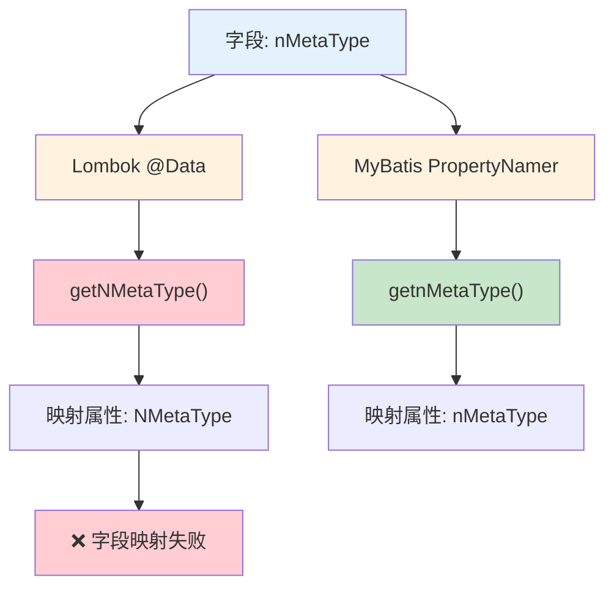

> 🎯 **一句话定位**：Lombok @Data 与 MyBatis PropertyNamer 对特殊命名字段生成不同的 getter/setter，导致字段映射失败的排查与解决方案
> 💡 **核心理念**：属性命名规范是框架兼容性的基础，前两个字母统一小写可以从根本上避免 Lombok 与 MyBatis 的命名冲突

---

## 📖 3分钟速览版

<details>
<summary><strong>📊 点击展开核心概念</strong></summary>

### 🔌 命名冲突流程



### 💎 命名对比表

| 字段声明 | 生成方 | Getter 方法 | 推导属性名 | 是否一致 |
|---------|--------|------------|-----------|---------|
| `String name` | Lombok | `getName()` | name | ✅ 一致 |
| `String name` | MyBatis | `getName()` | name | ✅ 一致 |
| `Boolean isDelete` | Lombok | `getIsDelete()` | isDelete | ❌ 不一致 |
| `Boolean isDelete` | MyBatis | `getDelete()` | delete | ❌ 不一致 |
| `NMetaType nMetaType` | Lombok | `getNMetaType()` | NMetaType | ❌ 不一致 |
| `NMetaType nMetaType` | MyBatis | `getnMetaType()` | nMetaType | ✅ 符合预期 |

### 🎯 影响总结

- **触发条件**：属性名第一个字母小写、第二个字母大写（如 `nMetaType`、`xOffset`）
- **影响范围**：MyBatis 结果集映射、JSON 序列化/反序列化、BeanUtils 属性拷贝
- **根因**：Lombok 统一首字母大写拼接前缀，而 JavaBean 规范要求保留原始大小写

</details>

---

## 🧠 深度剖析版

## 1. 问题背景

在 Java 编程中，我们经常使用 Lombok 库提供的 `@Data` 注解来自动生成 getter 和 setter 方法。然而，如果不了解它的生成规则，可能会导致一些不符合预期的结果。特别是在使用 MyBatis 等其他框架时，会因为 getter 和 setter 方法的命名规则不同，产生字段映射失败的问题。

## 2. 实体类示例

以下实体类包含三种典型的字段命名：

```java
public class TestEntity {
    private String name;         // 普通命名
    private Boolean isDelete;    // is 前缀命名
    private NMetaType nMetaType; // 首字母小写、第二字母大写
}
```

## 3. Lombok 生成的 Getter 和 Setter

使用 Lombok 的 `@Data` 注解生成的 getter 和 setter 方法如下：

```java
class TestEntityLombok {
    private String name;
    private Boolean isDelete;
    private NMetaType nMetaType;

    public TestEntityLombok() {
    }

    public String getName() {
        return this.name;
    }

    public Boolean getIsDelete() {
        return this.isDelete;
    }

    // ⚠️ 注意：首字母 n 被大写为 N
    public NMetaType getNMetaType() {
        return this.nMetaType;
    }

    public void setName(String name) {
        this.name = name;
    }

    public void setIsDelete(Boolean isDelete) {
        this.isDelete = isDelete;
    }

    // ⚠️ 注意：首字母 n 被大写为 N
    public void setNMetaType(NMetaType nMetaType) {
        this.nMetaType = nMetaType;
    }
}
```

**Lombok 的规则**：统一将属性名首字母大写，然后拼接 `get`/`set` 前缀。

## 4. IDEA、MyBatis 和 Java 默认的 Getter 和 Setter

使用 IDEA、MyBatis 或者 Java 默认（JavaBean 规范）的方式生成的 getter 和 setter 方法如下：

```java
class TestEntityMybatis {
    private String name;
    private Boolean isDelete;
    private NMetaType nMetaType;

    public String getName() {
        return name;
    }

    public void setName(String name) {
        this.name = name;
    }

    // ⚠️ 注意：is 前缀被去除
    public Boolean getDelete() {
        return isDelete;
    }

    public void setDelete(Boolean delete) {
        isDelete = delete;
    }

    // ⚠️ 注意：首字母 n 保持小写
    public NMetaType getnMetaType() {
        return nMetaType;
    }

    public void setnMetaType(NMetaType nMetaType) {
        this.nMetaType = nMetaType;
    }
}
```

**JavaBean 规范的规则**：

- `is` 前缀的 Boolean 字段：去掉 `is`，用 `get`/`set` + 剩余部分
- 属性名长度 > 1 且第二个字母小写：首字母小写保留（`getnMetaType`）
- 属性名长度 > 1 且第二个字母大写：首字母大小写保留（`getNMetaType` 不会出现，因为不需要变换）

### 4.1 核心差异对比

| 字段 | Lombok Getter | JavaBean/MyBatis Getter | 差异原因 |
|------|--------------|------------------------|---------|
| `name` | `getName()` | `getName()` | 无差异 |
| `isDelete` | `getIsDelete()` | `getDelete()` | Lombok 不处理 `is` 前缀 |
| `nMetaType` | `getNMetaType()` | `getnMetaType()` | Lombok 统一首字母大写 |

## 5. MyBatis PropertyNamer 源码解析

MyBatis 3.5.1 PropertyNamer 源码：

```java
package org.apache.ibatis.reflection.property;

import java.util.Locale;
import org.apache.ibatis.reflection.ReflectionException;

public final class PropertyNamer {
    private PropertyNamer() {
    }

    public static String methodToProperty(String name) {
        if (name.startsWith("is")) {
            name = name.substring(2);
        } else {
            if (!name.startsWith("get") && !name.startsWith("set")) {
                throw new ReflectionException(
                    "Error parsing property name '" + name
                    + "'.  Didn't start with 'is', 'get' or 'set'.");
            }
            name = name.substring(3);
        }

        // 关键逻辑：长度为1 或 第二个字母非大写 → 首字母转小写
        if (name.length() == 1
            || name.length() > 1 && !Character.isUpperCase(name.charAt(1))) {
            name = name.substring(0, 1).toLowerCase(Locale.ENGLISH)
                   + name.substring(1);
        }

        return name;
    }

    public static boolean isProperty(String name) {
        return isGetter(name) || isSetter(name);
    }

    public static boolean isGetter(String name) {
        return name.startsWith("get") && name.length() > 3
            || name.startsWith("is") && name.length() > 2;
    }

    public static boolean isSetter(String name) {
        return name.startsWith("set") && name.length() > 3;
    }
}
```

### 5.1 PropertyNamer 命名规则总结

- **`is` 前缀**：一般为布尔类型，例如 `isDelete`，对应的 getter 方法为 `getDelete()` 和 `setDelete(Boolean delete)`
- **单字母属性**：例如 `private int x;`，对应的 getter 和 setter 方法是 `getX()` 和 `setX(int x)`
- **长度 > 1 且第二个字母小写**：例如 `private NMetaType nMetaType;`，对应的 getter 和 setter 方法是 `getnMetaType()` 和 `setnMetaType(NMetaType nMetaType)`

## 6. PropertyNamer 测试验证

通过以下代码验证上述规则：

```java
@Test
public void foundPropertyNamer() {
    String isName = "isName";
    String getName = "getName";
    String getnMetaType = "getnMetaType";
    String getNMetaType = "getNMetaType";

    Stream.of(isName, getName, getnMetaType, getNMetaType)
            .forEach(methodName ->
                System.out.println("方法名字是:" + methodName
                    + " 属性名字:" + PropertyNamer.methodToProperty(methodName)));
}
```

测试结果如下：

```text
方法名字是:isName 属性名字:name
方法名字是:getName 属性名字:name
方法名字是:getnMetaType 属性名字:nMetaType
方法名字是:getNMetaType 属性名字:NMetaType
```

**关键发现**：`getNMetaType` 被 MyBatis 反推为属性 `NMetaType`（首字母大写），而实际字段名是 `nMetaType`（首字母小写），导致映射失败。

## 7. 解决方案

### 7.1 方案一：规范属性命名（推荐）

修改属性名，确保前两个字母统一小写：

```java
// ❌ 有问题的命名
private NMetaType nMetaType;

// ✅ 推荐的命名
private NMetaType metaType;
// 或
private NMetaType nmetaType;
```

### 7.2 方案二：手动编写 Getter/Setter

如果数据库已设计好，且前后端接口已对接完毕不便修改，可以为特殊属性单独使用 IDEA 生成 getter 和 setter 方法：

```java
@Data
public class TestEntity {
    private String name;
    private NMetaType nMetaType;

    // 手动覆盖 Lombok 生成的方法
    public NMetaType getnMetaType() {
        return nMetaType;
    }

    public void setnMetaType(NMetaType nMetaType) {
        this.nMetaType = nMetaType;
    }
}
```

### 7.3 方案三：使用 @Accessor 注解

Lombok 提供 `@Accessors` 注解可以自定义访问器行为：

```java
@Data
@Accessors(prefix = "")
public class TestEntity {
    private NMetaType nMetaType;
}
```

> **注意**：`@Accessors` 的行为在不同 Lombok 版本之间可能有差异，使用前请确认版本兼容性。

---

## 💬 常见问题（FAQ）

### Q1: 只有 MyBatis 会受到这个问题的影响吗？

**A:** 不是。所有遵循 JavaBean 规范的框架都可能受影响，包括：

- **MyBatis**：结果集字段映射失败
- **Jackson/Gson**：JSON 序列化时字段名不一致
- **Spring BeanUtils**：属性拷贝时漏拷贝特殊命名字段
- **Apache Commons BeanUtils**：同样依赖 JavaBean 规范

### Q2: Boolean 类型的 isDelete 字段为什么也有问题？

**A:** Lombok 对 `Boolean isDelete` 生成 `getIsDelete()`，而 JavaBean 规范认为 `is` 前缀的布尔属性应该去掉 `is`，生成 `getDelete()`。MyBatis 按照 JavaBean 规范将 `getIsDelete()` 反推为属性 `isDelete`（保留了 `is`），但如果 SQL 结果集的列名是 `delete`，映射就会失败。

**建议**：避免使用 `is` 前缀命名 Boolean 类型字段，直接使用 `deleted` 替代 `isDelete`。

### Q3: 如何快速检查项目中是否存在这类命名问题？

**A:** 可以通过正则表达式搜索可能有问题的字段命名：

```bash
# 查找第一个字母小写、第二个字母大写的字段
grep -rn "private .* [a-z][A-Z]" src/main/java/

# 查找 Boolean is 前缀的字段
grep -rn "private Boolean is[A-Z]" src/main/java/
```

### Q4: 升级 Lombok 版本能解决这个问题吗？

**A:** 截至 Lombok 1.18.x 版本，这个行为仍然没有改变。Lombok 官方认为统一首字母大写的规则更加简洁一致，而 JavaBean 规范的特殊处理（如保留前两个字母大小写）是历史遗留设计。因此，不能指望通过升级 Lombok 来解决这个问题，应从命名规范入手。

### Q5: 使用 MyBatis-Plus 会有同样的问题吗？

**A:** 是的。MyBatis-Plus 底层依赖 MyBatis 的反射机制，同样使用 `PropertyNamer` 来解析属性名。因此，无论使用 MyBatis 还是 MyBatis-Plus，都会遇到相同的命名冲突问题。解决方案一致：规范属性命名或手动编写 getter/setter。

---

## ✨ 总结

### 核心要点

1. **根因**：Lombok `@Data` 统一将属性首字母大写拼接前缀，而 JavaBean 规范在特定情况下保留原始大小写
2. **触发条件**：属性名第一个字母小写、第二个字母大写（如 `nMetaType`、`xOffset`、`eTag`）
3. **影响范围**：所有依赖 JavaBean 规范的框架（MyBatis、Jackson、Spring BeanUtils 等）

### 行动建议

- **新项目**：制定命名规范，要求所有属性的前两个字母统一小写
- **存量项目**：排查特殊命名字段，使用手动 getter/setter 覆盖 Lombok 生成的方法
- **Code Review**：在 Code Review 阶段关注字段命名，防止问题引入

---

## 更新记录

| 版本 | 日期 | 说明 |
|------|------|------|
| v1.0 | 2023-06-19 | 初始版本 |
| v1.1 | 2026-03-11 | 优化文档结构，添加速查版、对比分析和 FAQ |
