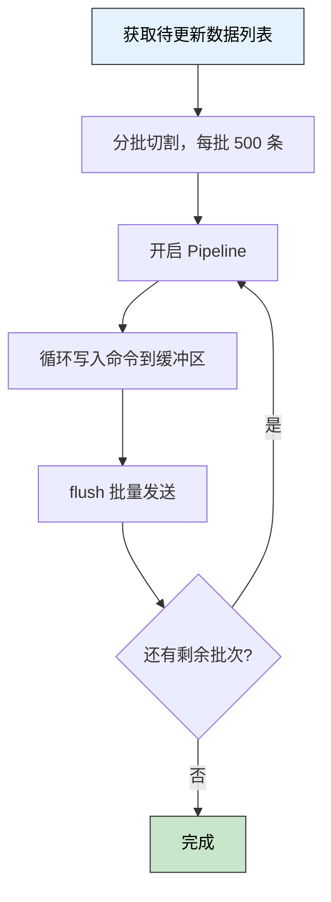

> 🎯 **一句话定位**：Redis Pipeline 把"一次发一条"变成"一次发一批"，用更少的网络往返换来更高的吞吐量。
>
> 💡 **核心理念**：缓存批量更新的瓶颈往往不在 Redis 本身，而在客户端与服务端之间的网络往返（RTT）。Pipeline 通过在客户端缓冲命令、一次性发送来消除这个瓶颈。

---

## 问题背景

### 业务场景

在大促、定时任务、数据同步等场景中，经常需要批量刷新缓存：

- 电商大促前预热数万条商品价格/库存缓存
- 定时任务批量更新用户积分排行榜
- 数据同步时将 DB 变更同步到 Redis

### 痛点分析

- **RTT 放大**：逐条执行 `SET` 命令，每条命令都需要一次完整的网络往返，1000 条命令在局域网（0.5ms RTT）下也需要 ~500ms
- **线程阻塞**：同步等待每条命令的响应，线程利用率极低
- **吞吐受限**：Redis 单机 QPS 可达 10W+，但客户端的串行发命令方式远达不到这个上限

### 目标

将批量更新 1000 条缓存的耗时从 **~500ms 降至 ~20ms 以内**，吞吐量提升 **10 倍以上**。

---

## 方案对比

### 方案调研

| 方案 | 核心思路 | 优点 | 缺点 | 适用场景 |
|------|---------|------|------|---------|
| 逐条 SET | 每条命令单独发送 | 简单直接，错误易定位 | RTT 累加，性能差 | 低频单条更新 |
| MSET | 单条命令设置多个 key | 原子性强，一次 RTT | 只支持 String 类型，无法设置 TTL | 同类型批量写入 |
| Pipeline | 批量发送命令，一次收响应 | 兼容任意命令组合，性能高 | 非原子，需分批控制内存 | 批量混合操作 |
| Lua 脚本 | 在 Redis 端执行批量逻辑 | 原子性最强 | 脚本复杂，调试难，长脚本阻塞 | 需要原子性的复杂操作 |

### 选择理由

Pipeline 是批量缓存更新的首选：命令类型灵活（`SET`、`EXPIRE`、`HSET` 可混用），TTL 可独立控制，且实现简单。若需严格原子性，再考虑 Lua 脚本，但大多数缓存更新场景不需要原子性保证。

---

## 核心实现

### 实现思路



<details>
<summary>**🖼️ 插图版（2026-04-17 增量补充）**</summary>


</details>

### 完整代码

**Spring Data Redis（推荐）**：

```java
import org.springframework.data.redis.core.RedisCallback;
import org.springframework.data.redis.core.StringRedisTemplate;
import org.springframework.stereotype.Service;

import java.util.List;
import java.util.Map;
import java.util.concurrent.TimeUnit;

@Service
public class CacheBatchService {

    private final StringRedisTemplate redisTemplate;

    // 每批最大命令数，避免单次 flush 占用过多内存
    private static final int BATCH_SIZE = 500;

    public CacheBatchService(StringRedisTemplate redisTemplate) {
        this.redisTemplate = redisTemplate;
    }

    /**
     * 批量更新缓存，使用 Pipeline 减少 RTT
     *
     * @param cacheMap key -> value 映射
     * @param ttl      过期时间（秒），-1 表示不过期
     */
    public void batchSet(Map<String, String> cacheMap, long ttl) {
        List<Map.Entry<String, String>> entries = List.copyOf(cacheMap.entrySet());

        for (int i = 0; i < entries.size(); i += BATCH_SIZE) {
            // 切割当前批次
            List<Map.Entry<String, String>> batch =
                    entries.subList(i, Math.min(i + BATCH_SIZE, entries.size()));

            redisTemplate.executePipelined((RedisCallback<Void>) connection -> {
                for (Map.Entry<String, String> entry : batch) {
                    byte[] key = entry.getKey().getBytes();
                    byte[] value = entry.getValue().getBytes();

                    if (ttl > 0) {
                        // SET key value EX ttl
                        connection.setEx(key, ttl, value);
                    } else {
                        connection.set(key, value);
                    }
                }
                // 返回 null，Pipeline 回调不使用返回值
                return null;
            });
        }
    }
}
```

**Jedis 原生写法（非 Spring 环境）**：

```java
try (Jedis jedis = jedisPool.getResource();
     Pipeline pipeline = jedis.pipelined()) {

    for (Map.Entry<String, String> entry : cacheMap.entrySet()) {
        pipeline.setex(entry.getKey(), ttl, entry.getValue());
    }

    // 发送所有缓冲命令并同步等待响应
    pipeline.sync();
}
```

### 关键点说明

- **`executePipelined` 返回值**：Spring 的 Pipeline 回调必须 `return null`，实际响应列表由 `executePipelined` 方法返回，若需要检查每条命令结果可遍历该列表
- **分批控制**：单次 Pipeline 命令数建议控制在 **500~1000** 条，过大会导致客户端缓冲区占用过高，反而影响性能
- **连接独占**：Pipeline 执行期间该 Redis 连接被独占，高并发场景需确保连接池容量充足

---

## 性能分析

### 测试环境

- 硬件：4 核 8G 云服务器，Redis 与应用同机房
- 软件版本：Redis 7.0，Spring Boot 3.x，Lettuce 驱动
- 数据规模：1000 条 String 缓存，value 约 100 字节

### 性能数据

| 指标 | 逐条 SET | MSET | Pipeline（批 500） |
|------|----------|------|-------------------|
| 总耗时 | ~480ms | ~5ms | ~12ms |
| RTT 次数 | 1000 次 | 1 次 | 2 次 |
| 内存峰值 | 低 | 中 | 低 |
| 支持 TTL | ✓ | ✗ | ✓ |
| 命令类型限制 | 无 | 仅 String | 无 |

### 优化建议

- 批次大小 **500 条**在大多数场景是较好的平衡点，可根据实际 value 大小调整
- 若 value 较大（>1KB），适当减小批次到 **200 条**，避免单次 flush 数据量过大
- 监控 `used_memory` 和 `instantaneous_ops_per_sec`，结合业务流量动态调整

---

## 生产实践

### 边界条件

- [ ] **空集合入参**：`cacheMap` 为空时提前返回，避免空 Pipeline 执行
- [ ] **超大批量**：单次调用超过 10W 条时，考虑拆分任务或改用异步队列处理
- [ ] **部分失败**：Pipeline 非原子，某条命令失败不影响其他命令；若需感知失败，需遍历 `executePipelined` 返回的响应列表

### 常见坑点

1. **误以为 Pipeline 有原子性**
   - **现象**：批量写入中途 Redis 重启，部分数据丢失，但开发者未做补偿
   - **原因**：Pipeline 只是批量传输，不是事务，不保证原子性
   - **解决**：需要原子性时改用 `MULTI/EXEC` 事务或 Lua 脚本；缓存丢失通常可接受，做好兜底查 DB 的降级逻辑即可

2. **Pipeline 内使用了读命令后立即依赖结果**
   - **现象**：Pipeline 内先 `GET` 再根据结果 `SET`，但 `GET` 结果始终为 null
   - **原因**：Pipeline 内命令响应是批量返回的，不能在回调内即时读取
   - **解决**：读写分离，先用普通命令查询，再用 Pipeline 批量写入

3. **连接池耗尽**
   - **现象**：并发批量更新时抛出 `PoolExhaustedException`
   - **原因**：Pipeline 独占连接，高并发下连接池耗尽
   - **解决**：增大连接池 `maxActive`，或对批量任务做并发限流

### 监控指标

- `redis.instantaneous_ops_per_sec`：实时 OPS，Pipeline 后该值应显著提升
- `redis.connected_clients`：并发批量任务时关注连接数是否接近上限
- 应用侧批量任务耗时 P99，设置告警阈值

### 最佳实践

- 将 `BATCH_SIZE` 做成可配置项（如 `@Value`），便于生产调优而不需重新部署
- 批量任务建议在业务低峰期执行，避免与正常读请求争抢连接
- 若使用 Lettuce 驱动（Spring Boot 默认），Pipeline 底层自动复用单连接，无需担心连接独占问题；Jedis 驱动则需注意

---

## 总结

### 核心要点

1. **性能瓶颈在 RTT**：Redis 本身足够快，批量场景的瓶颈是网络往返，Pipeline 直接消除这个瓶颈
2. **分批是关键**：单批 500~1000 条，过大适得其反
3. **Pipeline 非原子**：缓存更新通常可接受非原子，若不可接受则改用 Lua 脚本

### 适用场景

批量缓存预热、定时刷新、数据同步写缓存等**写多读少**的批量操作场景。

### 注意事项

不要在 Pipeline 内做依赖上一条命令结果的逻辑；大批量任务做好并发限流，避免连接池打满。

---

## 更新记录

| 版本 | 日期 | 说明 |
|------|------|------|
| v1.0 | 2025-05-22 | 初始版本 |
| v1.1 | 2026-04-17 | 为 1 个 Mermaid 图表追加 Chiikawa 风格插图（m2c-pipeline 生成） |
