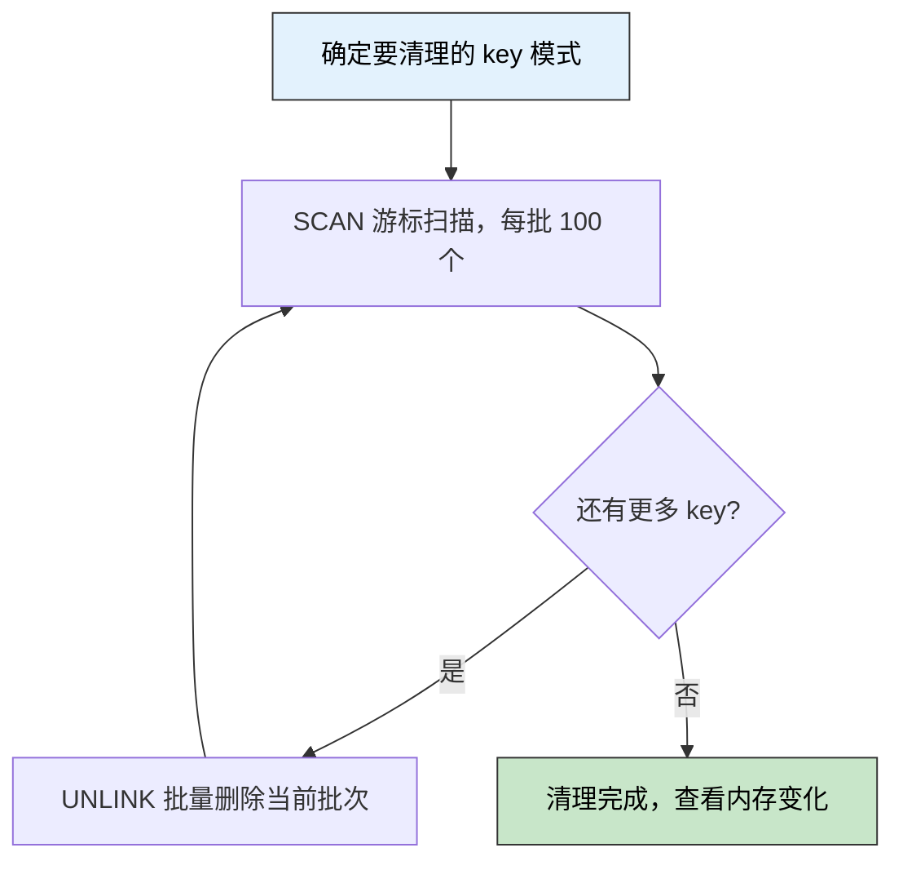

> 🎯 **一句话定位**：生产环境清理 Redis Key，用 UNLINK 代替 DEL，异步释放内存不阻塞主线程——这个替换背后，藏着 Redis 内存管理的核心逻辑。
>
> 💡 **核心理念**：缓存清理不是简单地"执行删除"，理解 Redis 的内存释放机制、过期策略和批量操作方式，才能做到安全、高效、不影响线上服务。

---

## 📋 问题背景

### 业务场景

服务器运行一段时间后，Redis 中积累了大量冗余数据：

- 用户 session key（用户已注销但 key 未及时清理）
- 临时计算结果（业务逻辑变更后遗留的旧格式 key）
- 批量任务中间态数据（任务完成后未清理）
- 旧版本缓存（上线新版本后遗留的 v1 格式数据）

运维同学登录服务器，用 `keys pattern:*` + `del` 逐批清理。起初很顺畅，但当碰到 value 很大的 key（list 有数万条、hash 有几千个 field）时，删除操作变得"卡顿"——Redis 命令响应时间飙升，线上业务开始报超时。

排查后发现：**DEL 是同步操作，删除大 key 会阻塞 Redis 主线程。**

### 痛点分析

- **痛点 1：DEL 阻塞主线程**：删除大 key 时（value > 1MB 或元素数 > 千级），Redis 单线程同步执行，期间所有其他命令排队等待
- **痛点 2：KEYS 命令本身也是阻塞**：`KEYS pattern*` 全量扫描，线上禁止使用
- **痛点 3：内存未如预期释放**：清理后 Redis 内存指标并未立刻下降，不理解原因

### 目标

在不影响线上服务的前提下，安全清理 Redis 中指定模式的冗余 key，释放内存。

---

## 🔍 方案对比

### 方案调研

| 方案 | 核心思路 | 优点 | 缺点 | 适用场景 |
|------|---------|------|------|---------|
| DEL | 同步删除 key | 简单直接，删除后立即释放引用 | 阻塞主线程，大 key 危险 | 小 key、开发 / 测试环境 |
| UNLINK | 主线程仅移除引用，内存回收由后台线程异步完成 | 非阻塞，生产安全 | Redis 4.0+，有极短延迟 | 生产环境，尤其是大 key |
| SCAN + 批量 UNLINK | 用 SCAN 游标分批扫描 key，每批用 UNLINK 删除 | 非阻塞扫描 + 非阻塞删除，双重保障 | 实现稍复杂，需控制批次大小 | 生产环境批量清理首选 |

### 选择理由

- 生产环境：SCAN（替代 KEYS）+ UNLINK（替代 DEL），双重非阻塞
- 开发 / 临时操作：DEL 可接受，但仍建议养成用 UNLINK 的习惯
- 核心原则：**所有涉及大 key 或大批量的删除操作，必须用 UNLINK**

---

## 💡 核心实现

### 实现思路



### Shell 脚本（快速使用）

```bash
#!/bin/bash
# 安全批量清理 Redis key，使用 SCAN + UNLINK 避免阻塞
# 用法：./redis-cleanup.sh <pattern> [batch_size]
# 示例：./redis-cleanup.sh "session:*" 100

PATTERN=${1:-"*"}
BATCH_SIZE=${2:-100}
CURSOR=0
TOTAL=0

echo "开始清理 pattern: $PATTERN"

while true; do
    # SCAN 非阻塞扫描，每次返回 cursor 和 key 列表
    RESULT=$(redis-cli SCAN $CURSOR MATCH "$PATTERN" COUNT $BATCH_SIZE)
    CURSOR=$(echo "$RESULT" | head -1)
    KEYS=$(echo "$RESULT" | tail -n +2)

    if [ -n "$KEYS" ]; then
        COUNT=$(echo "$KEYS" | wc -l)
        # UNLINK 异步删除，不阻塞主线程
        echo "$KEYS" | xargs redis-cli UNLINK > /dev/null
        TOTAL=$((TOTAL + COUNT))
        echo "已处理 $TOTAL 个 key (cursor: $CURSOR)"
    fi

    # cursor 回到 0 表示扫描完成
    if [ "$CURSOR" -eq 0 ]; then
        break
    fi
done

echo "✅ 清理完成，共删除 $TOTAL 个 key"
```

### Java 代码（程序化清理）

```java
/**
 * 使用 SCAN + UNLINK 批量清理 Redis Key
 * 生产安全：非阻塞扫描 + 异步删除
 */
@Service
public class RedisCacheCleanupService {

    @Autowired
    private RedisTemplate<String, Object> redisTemplate;

    public long cleanupByPattern(String pattern, int batchSize) {
        long totalDeleted = 0;
        ScanOptions options = ScanOptions.scanOptions()
            .match(pattern)
            .count(batchSize)
            .build();

        try (Cursor<byte[]> cursor = redisTemplate.getConnectionFactory()
                .getConnection()
                .scan(options)) {

            List<String> batch = new ArrayList<>();
            while (cursor.hasNext()) {
                batch.add(new String(cursor.next()));

                if (batch.size() >= batchSize) {
                    // UNLINK 异步删除，不阻塞
                    totalDeleted += unlinkKeys(batch);
                    batch.clear();
                }
            }
            // 处理最后一批
            if (!batch.isEmpty()) {
                totalDeleted += unlinkKeys(batch);
            }
        }
        return totalDeleted;
    }

    private long unlinkKeys(List<String> keys) {
        // 使用 UNLINK 而非 DEL
        return redisTemplate.execute((RedisCallback<Long>) connection ->
            connection.unlink(keys.stream()
                .map(String::getBytes)
                .toArray(byte[][]::new))
        );
    }
}
```

### 关键点说明

- **UNLINK vs DEL 本质区别**：DEL 同步删除（阻塞），UNLINK 仅在主线程移除 key 的引用（O(1) 非阻塞），实际内存回收由 `lazyfree` 后台线程异步完成
- **SCAN 的 COUNT 参数不是精确限制**：COUNT 是提示 Redis 每次扫描的槽位数量，实际返回 key 数量可能多也可能少，不能作为精确分页依据
- **为什么内存没有立刻降**：UNLINK 后内存释放是异步的，有毫秒级延迟；另外 Redis 默认不会立刻将内存还给操作系统（内存池机制），需配合 `activedefrag` 或等待新分配触发回收

---

## ⚡ 性能分析

### DEL vs UNLINK 阻塞对比

| 指标 | DEL（大 key） | UNLINK（大 key） | 说明 |
|------|--------------|-----------------|------|
| 主线程耗时 | 10ms ~ 500ms+ | < 1ms | UNLINK 仅做引用移除 |
| 内存回收时机 | 立即（同步） | 异步（毫秒级延迟） | lazyfree 后台线程 |
| 影响线上请求 | 是（明显延迟） | 否 | 生产必用 UNLINK |

### 优化建议

- **批次大小控制在 100-500**：过大会导致单次 UNLINK 提交量大，虽然异步但也有积压压力
- **扫描批次间加短暂间隔**：两批之间可加 10ms 间隔，避免 SCAN 本身过于密集占用 CPU
- **选择业务低峰期执行**：即使 UNLINK 非阻塞，大批量清理也会增加 CPU 和网络压力

---

## 🚧 生产实践

### 边界条件

- [x] **KEYS 命令禁止生产使用**：全量扫描阻塞时间不可控，必须用 SCAN 替代
- [x] **确认 Redis 版本 ≥ 4.0**：UNLINK 命令在 4.0 引入，低版本只能用 DEL
- [x] **清理前确认 key 模式**：先用 SCAN 小批量采样，确认 pattern 只命中预期 key，避免误删

### 常见坑点

1. **pattern 写错误删业务 key**

   - **现象**：清理后业务报缓存 miss，查询量暴增，数据库压力飙升
   - **原因**：pattern 过于宽泛，如 `user:*` 误删了活跃用户的缓存
   - **解决**：清理前先执行 `SCAN 0 MATCH pattern COUNT 20` 采样确认，再全量执行

2. **Redis Cluster 模式 SCAN 不完整**

   - **现象**：清理脚本执行完，仍有大量目标 key 残留
   - **原因**：Cluster 模式下 SCAN 是节点级别的，单节点执行只扫描该节点的 slot
   - **解决**：Cluster 模式需对每个节点分别执行 SCAN，或使用客户端库的 cluster-aware scan

3. **UNLINK 后内存指标不降**

   - **现象**：执行完清理，`INFO memory` 的 `used_memory` 几乎没变
   - **原因**：Redis 采用内存池，释放的内存优先供内部复用，不立即还给 OS；另外可能存在内存碎片
   - **解决**：开启 `activedefrag yes` 让 Redis 自动整理碎片；或执行 `MEMORY PURGE`（Redis 4.0+）强制将空闲内存归还 OS

### 监控指标

- `INFO memory` → `used_memory_human`：清理前后内存变化
- `INFO stats` → `expired_keys`：累计过期 key 数量（验证 TTL 策略是否合理）
- `INFO keyspace` → key 总数：验证清理效果

### 最佳实践

- **生产删除永远用 UNLINK**：养成习惯，DEL 仅限开发环境使用
- **新 key 尽量设置 TTL**：主动控制 key 生命周期，减少手动清理依赖；临时数据、session 等必须设 TTL
- **大 key 提前预警**：定期用 `redis-cli --bigkeys` 扫描，发现大 key 及时拆分或设 TTL，避免积累到需要手动干预的地步

---

## ✨ 总结

### 核心要点

1. **UNLINK 是生产环境删除 key 的正确姿势**：主线程仅做引用移除（O(1) 非阻塞），实际内存回收由 lazyfree 后台线程异步完成
2. **批量清理必须用 SCAN + UNLINK**：SCAN 非阻塞游标扫描替代 KEYS，UNLINK 异步删除替代 DEL，生产双重安全
3. **内存不立刻降是正常的**：Redis 内存池 + lazyfree 异步回收，清理后内存会逐步释放；若需立刻整理可执行 `MEMORY PURGE`

### 适用场景

线上 Redis 清理冗余 / 过期 key、删除大 key（list、hash、set 元素数量级较大）、程序化定期清理业务 key（如 session 清理、临时数据回收）。

### 注意事项

- 清理前务必采样确认 pattern，避免误删活跃业务 key
- Redis Cluster 模式下 SCAN 需按节点分别执行
- Redis < 4.0 无 UNLINK 命令，需升级或接受 DEL 的阻塞风险

---

## 更新记录

| 版本 | 日期 | 说明 |
|------|------|------|
| v1.0 | 2026-03-06 | 初始版本 |
