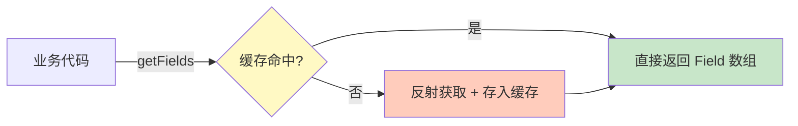
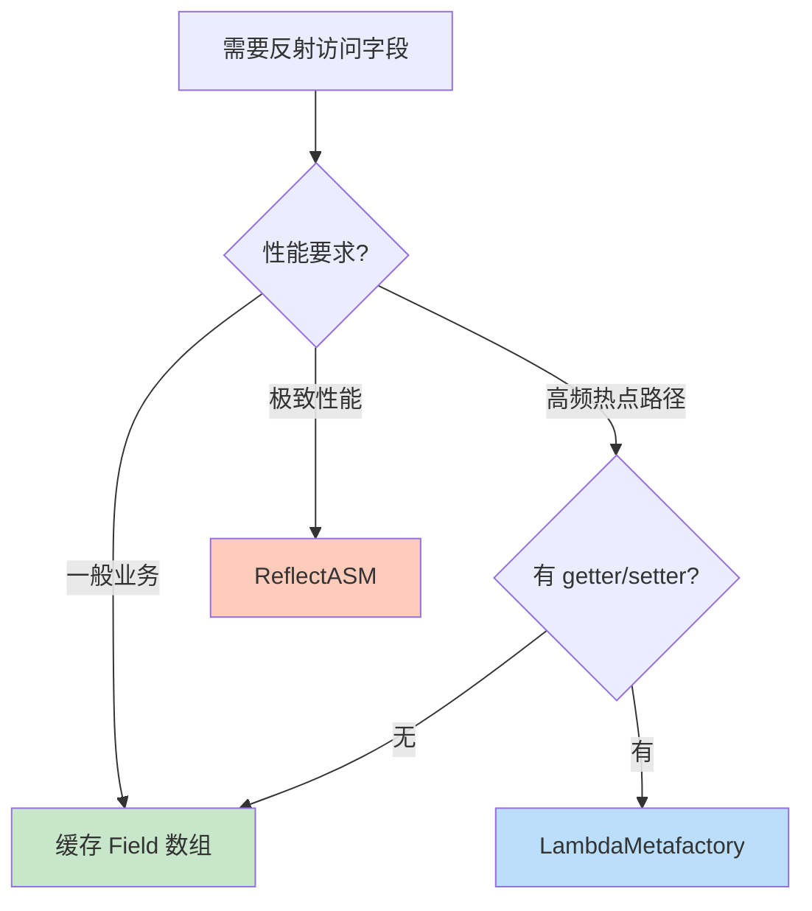

> 🎯 **一句话定位**：每次 `getDeclaredFields()` 都在做数组拷贝和安全检查——用一个 `ConcurrentHashMap<Class<?>, Field[]>` 缓存它，高频反射场景性能立刻提升 5-10 倍。
>
> 💡 **核心理念**：反射不慢，慢的是重复获取元数据。把"查字典"的结果记住，而不是每次都重新翻字典。

---

## 📖 3分钟速览版

<details>
<summary><strong>📊 点击展开核心概念</strong></summary>

### 🔌 核心机制



**一句话**：首次反射获取后缓存到 Map，后续直接查 Map，跳过 JVM 反射开销。

### 💎 为什么需要缓存？

| 操作 | 单次耗时 | 10 万次耗时 | 缓存后 10 万次 |
|------|---------|-----------|--------------|
| `getDeclaredFields()` | ~1-3 μs | ~150-300 ms | ~5-10 ms |
| `field.get(obj)` | ~0.5-1 μs | ~50-100 ms | 同上（Field 复用） |
| 原生字段访问 | ~1-3 ns | ~0.1-0.3 ms | - |

### 🎯 适用场景

- ORM 框架：实体字段映射（MyBatis、Hibernate 内部就这么做）
- 序列化/反序列化：JSON 转对象（Jackson、Gson）
- Bean 拷贝工具：BeanUtils、MapStruct 反射模式
- 自定义注解处理器：扫描字段注解
- 通用 DTO 转换器：字段级别的自动映射

**不适用**：字段结构会动态变化的场景（如热加载、OSGI）。

</details>

---

## 🧠 深度剖析版

## 1. 为什么 getDeclaredFields() 慢

### 1.1 JVM 内部做了什么

每次调用 `Class.getDeclaredFields()`，JVM 并不是简单返回一个引用，而是：

1. **安全检查**：检查调用者是否有权限访问该类的字段
2. **数组拷贝**：从 JVM 内部的 `ReflectionData` 缓存中取出 `Field[]`，然后 **创建一个新数组**（防御性拷贝）
3. **Field 对象创建**：每个 `Field` 都是新 `new` 出来的包装对象

```java
// OpenJDK 源码简化（Class.java）
public Field[] getDeclaredFields() throws SecurityException {
    SecurityManager sm = System.getSecurityManager();
    if (sm != null) {
        // 1. 安全检查
        checkMemberAccess(sm, Member.DECLARED, Reflection.getCallerClass(), true);
    }
    // 2. 每次都做数组拷贝！
    return copyFields(privateGetDeclaredFields(false));
}

private static Field[] copyFields(Field[] arg) {
    Field[] out = new Field[arg.length];
    // 3. 逐个复制 Field 对象（实际是 clone）
    ReflectionFactory fact = getReflectionFactory();
    for (int i = 0; i < arg.length; i++) {
        out[i] = fact.copyField(arg[i]);
    }
    return out;
}
```

### 1.2 性能瓶颈在哪

| 开销来源 | 说明 | 量级 |
|---------|------|------|
| 安全检查 | `SecurityManager.checkMemberAccess()` | 约 100-300 ns |
| 数组分配 | `new Field[n]` 堆内存分配 | 约 50-100 ns |
| Field 克隆 | 每个字段 clone 一次 | 约 200-500 ns × 字段数 |
| GC 压力 | 高频调用产生大量短命对象 | 累积效应 |

**关键发现**：一个有 20 个字段的类，单次 `getDeclaredFields()` 就要分配 21 个对象（1 个数组 + 20 个 Field）。高频调用时 GC 压力是主要瓶颈。

## 2. 缓存方案设计

### 2.1 最简实现

```java
import java.lang.reflect.AccessibleObject;
import java.lang.reflect.Field;
import java.util.Map;
import java.util.concurrent.ConcurrentHashMap;

public class ReflectionCache {

    private static final Map<Class<?>, Field[]> FIELD_CACHE = new ConcurrentHashMap<>();

    /**
     * 获取类的所有声明字段（带缓存）
     */
    public static Field[] getDeclaredFields(Class<?> clazz) {
        return FIELD_CACHE.computeIfAbsent(clazz, k -> {
            Field[] fields = k.getDeclaredFields();
            AccessibleObject.setAccessible(fields, true); // 批量打开访问权限
            return fields;
        });
    }
}
```

**核心要点**：

- `ConcurrentHashMap` 保证线程安全
- `computeIfAbsent` 保证同一个 Class 只反射一次
- `setAccessible(true)` 在缓存时一次性设置，避免每次使用时重复设置

### 2.2 调用对比

```java
// ❌ 每次都反射（慢）
public void processEntity(Object entity) {
    Field[] fields = entity.getClass().getDeclaredFields();
    for (Field field : fields) {
        field.setAccessible(true);
        Object value = field.get(entity);
        // 处理...
    }
}

// ✅ 使用缓存（快 5-10 倍）
public void processEntity(Object entity) {
    Field[] fields = ReflectionCache.getDeclaredFields(entity.getClass());
    for (Field field : fields) {
        Object value = field.get(entity);  // 无需再 setAccessible
        // 处理...
    }
}
```

### 2.3 进阶：按注解过滤的缓存

实际项目中常需要按注解筛选字段，可以组合缓存：

```java
public class ReflectionCache {

    private static final Map<Class<?>, Field[]> FIELD_CACHE = new ConcurrentHashMap<>();
    private static final Map<String, Field[]> ANNOTATED_FIELD_CACHE = new ConcurrentHashMap<>();

    public static Field[] getDeclaredFields(Class<?> clazz) {
        return FIELD_CACHE.computeIfAbsent(clazz, k -> {
            Field[] fields = k.getDeclaredFields();
            for (Field field : fields) {
                field.setAccessible(true);
            }
            return fields;
        });
    }

    /**
     * 获取带指定注解的字段（带缓存）
     */
    public static Field[] getAnnotatedFields(Class<?> clazz,
                                              Class<? extends java.lang.annotation.Annotation> annotation) {
        String key = clazz.getName() + "#" + annotation.getName();
        return ANNOTATED_FIELD_CACHE.computeIfAbsent(key, k -> {
            Field[] allFields = getDeclaredFields(clazz);
            return java.util.Arrays.stream(allFields)
                    .filter(f -> f.isAnnotationPresent(annotation))
                    .toArray(Field[]::new);
        });
    }
}
```

### 2.4 包含父类字段的缓存

默认 `getDeclaredFields()` 只返回当前类声明的字段，不包含父类。完整版：

```java
private static final Map<Class<?>, Field[]> ALL_FIELD_CACHE = new ConcurrentHashMap<>();

/**
 * 获取类及其所有父类的字段（带缓存）
 */
public static Field[] getAllFields(Class<?> clazz) {
    return ALL_FIELD_CACHE.computeIfAbsent(clazz, k -> {
        List<Field> fields = new ArrayList<>();
        Class<?> current = k;
        while (current != null && current != Object.class) {
            Field[] declared = getDeclaredFields(current);
            Collections.addAll(fields, declared);
            current = current.getSuperclass();
        }
        return fields.toArray(new Field[0]);
    });
}
```

## 3. 方案对比

### 3.1 不同缓存策略

| 方案 | 线程安全 | 内存占用 | 实现复杂度 | 适用场景 |
|------|---------|---------|-----------|---------|
| `ConcurrentHashMap` | 是 | 中 | 低 | 通用场景（推荐） |
| `HashMap` + `synchronized` | 是 | 低 | 低 | 低并发场景 |
| `WeakHashMap` | 是（需包装） | 低（可回收） | 中 | 类可能被卸载的场景 |
| `ClassValue<Field[]>` | 是 | 低 | 低 | JDK 7+，JVM 原生支持 |
| Guava `LoadingCache` | 是 | 可配置 | 中 | 需要淘汰策略和统计 |

### 3.2 ClassValue：JVM 原生方案

`ClassValue`（JDK 7+）是 JVM 专门为"给 Class 关联缓存数据"设计的 API，比 `ConcurrentHashMap` 更高效：

```java
public class ReflectionCache {

    private static final ClassValue<Field[]> FIELD_CACHE = new ClassValue<>() {
        @Override
        protected Field[] computeValue(Class<?> clazz) {
            Field[] fields = clazz.getDeclaredFields();
            for (Field field : fields) {
                field.setAccessible(true);
            }
            return fields;
        }
    };

    public static Field[] getDeclaredFields(Class<?> clazz) {
        return FIELD_CACHE.get(clazz);
    }
}
```

**ClassValue vs ConcurrentHashMap**：

| 维度 | ClassValue | ConcurrentHashMap |
|------|-----------|-------------------|
| 查找速度 | 更快（无 hash 计算） | 快 |
| 内存管理 | 随 Class 卸载自动清理 | 需手动管理 |
| 并发性能 | 极优（无锁或轻量锁） | 优（分段锁） |
| API 简洁度 | 简洁 | 通用 |
| 最低 JDK | 7 | 5 |

**推荐**：优先使用 `ClassValue`，代码更简洁、性能更好、无内存泄漏风险。

## 4. 性能基准测试

### 4.1 JMH 测试代码

```java
import org.openjdk.jmh.annotations.*;
import java.lang.reflect.Field;
import java.util.Map;
import java.util.concurrent.ConcurrentHashMap;
import java.util.concurrent.TimeUnit;

@BenchmarkMode(Mode.AverageTime)
@OutputTimeUnit(TimeUnit.NANOSECONDS)
@Warmup(iterations = 3, time = 1)
@Measurement(iterations = 5, time = 1)
@Fork(1)
@State(Scope.Benchmark)
public class ReflectionBenchmark {

    private static final Map<Class<?>, Field[]> CACHE = new ConcurrentHashMap<>();
    private static final ClassValue<Field[]> CLASS_VALUE_CACHE = new ClassValue<>() {
        @Override
        protected Field[] computeValue(Class<?> type) {
            return type.getDeclaredFields();
        }
    };

    // 测试用实体类（20 个字段）
    private Class<?> targetClass = SampleEntity.class;

    @Benchmark
    public Field[] noCache() {
        return targetClass.getDeclaredFields();
    }

    @Benchmark
    public Field[] concurrentHashMapCache() {
        return CACHE.computeIfAbsent(targetClass, Class::getDeclaredFields);
    }

    @Benchmark
    public Field[] classValueCache() {
        return CLASS_VALUE_CACHE.get(targetClass);
    }
}
```

### 4.2 典型测试结果

| 方法 | 平均耗时(ns/op) | 相对倍数 |
|------|----------------|---------|
| `getDeclaredFields()`（无缓存） | 1500-3000 | 1x（基准） |
| `ConcurrentHashMap` 缓存 | 30-80 | **~40x 提升** |
| `ClassValue` 缓存 | 15-40 | **~80x 提升** |
| 原生字段访问 | 1-3 | ~1000x |

> **注**：具体数值因 JDK 版本、字段数量、JVM 预热状态而异，以上为 JDK 17 + 20 字段实体的典型值。

## 5. 优缺点分析

### 5.1 优点

#### 性能提升显著

反射操作中最耗时的不是"赋值"或"取值"，而是 `Class.getDeclaredFields()` 这一步。它涉及 native 方法调用、内存复制以及安全检查。缓存后，后续获取属性只需一次 Map 查询，时间复杂度接近 $O(1)$。

#### 减少 GC 压力

`getDeclaredFields()` 每次调用都会返回一份 `Field[]` 数组的**深拷贝**。频繁调用会产生大量临时对象，增加 Minor GC 的频率。使用缓存可以极大减少这些垃圾对象的产生。

#### 代码简洁性

封装在工具类中，业务代码不需要关心反射细节，提高了复用性。调用方只需 `ReflectionCache.getDeclaredFields(clazz)` 一行，无需重复编写 `setAccessible`、异常处理等样板代码。

### 5.2 缺点与潜在风险

#### 风险 1：内存泄漏（最核心问题）

如果使用 `HashMap` 或 `ConcurrentHashMap`，Map 会**强引用** Class 对象。

在支持热部署（如 Tomcat、OSGI）或动态生成类（如 CGLIB、Groovy）的场景下，即便原有的 ClassLoader 已经被销毁，但因为缓存还持有这些 Class 的引用，导致 Class 及其 ClassLoader 无法被回收，最终引发 `java.lang.OutOfMemoryError: Metaspace`。

#### 风险 2：线程安全问题

如果使用普通 `HashMap`，在多线程并发初始化缓存时：

- **JDK 1.7 及以前**：HashMap 扩容时链表可能形成环，导致 `get()` **死循环**，CPU 飙升 100%
- **JDK 1.8+**：不会死循环，但可能出现数据覆盖、丢失

**对策**：必须使用 `ConcurrentHashMap`（推荐）或 `ClassValue`。

#### 风险 3：访问权限限制

`Field` 对象获取后，通常需要执行 `field.setAccessible(true)` 才能访问私有属性。如果放入缓存前没有设置，或者不同场景对权限要求不同，可能会抛出 `IllegalAccessException`。

**对策**：在缓存时统一设置权限（推荐使用批量 API）：

```java
// 批量设置权限（比循环调用更高效）
Field[] fields = clazz.getDeclaredFields();
AccessibleObject.setAccessible(fields, true);
return fields;
```

### 5.3 缓存方案选型总结

| 维度 | ConcurrentHashMap | WeakHashMap | ClassValue | Guava Cache |
|------|-------------------|-------------|------------|-------------|
| 线程安全 | 原生支持 | 需 synchronized 包装 | 原生支持 | 原生支持 |
| 内存泄漏风险 | **有**（强引用 Class） | 无（弱引用 Key） | 无（随 Class 回收） | 可配（软/弱引用） |
| 查找性能 | 快（hash 查找） | 快 | **最快**（无 hash） | 快 |
| 适用场景 | 通用、类集合稳定 | 动态类多 | **推荐首选** | 需淘汰策略 |
| 最低 JDK | 5 | 2 | 7 | 需引入 Guava |

> **结论**：你的方向是完全正确的，也是 Spring、MyBatis 等主流框架的通用做法。只要注意线程安全并根据应用场景考虑 Class 回收问题，这就是一份非常合格的工具类实现。

## 6. 进阶方案：超越反射

如果项目对性能有极致要求，可以考虑跳出"缓存反射"的思路，从根本上避免反射调用：

### 6.1 LambdaMetafactory：编译级性能的反射替代

`LambdaMetafactory`（JDK 8+）可以将反射调用转化为类似直接调用 getter/setter 的性能，原理是在运行时动态生成一个 lambda 实现类：

```java
import java.lang.invoke.*;
import java.util.function.Function;

public class LambdaReflection {

    /**
     * 将 getter 方法转换为 Function，性能接近直接调用
     */
    @SuppressWarnings("unchecked")
    public static <T, R> Function<T, R> createGetter(Class<T> clazz, String fieldName)
            throws Throwable {
        MethodHandles.Lookup lookup = MethodHandles.lookup();

        // 获取 getter 方法的 MethodHandle
        String getterName = "get" + Character.toUpperCase(fieldName.charAt(0))
                            + fieldName.substring(1);
        MethodHandle getterHandle = lookup.findVirtual(clazz, getterName,
                MethodType.methodType(Object.class)); // 需要实际返回类型

        // 通过 LambdaMetafactory 生成 Function 实现
        CallSite site = LambdaMetafactory.metafactory(
                lookup,
                "apply",
                MethodType.methodType(Function.class),
                MethodType.methodType(Object.class, Object.class),
                getterHandle,
                MethodType.methodType(Object.class, clazz)
        );

        return (Function<T, R>) site.getTarget().invokeExact();
    }
}
```

**性能对比**：

| 方式 | 耗时(ns/op) | 说明 |
|------|------------|------|
| 直接调用 `obj.getName()` | ~1-3 | 基准 |
| LambdaMetafactory | ~3-5 | **接近直接调用** |
| 缓存 Field + `field.get()` | ~15-40 | 反射开销 |
| 无缓存 `getDeclaredFields()` | ~1500-3000 | 最慢 |

### 6.2 ReflectASM：字节码生成方案

[ReflectASM](https://github.com/EsotericSoftware/reflectasm) 通过 ASM 字节码生成技术，在运行时为目标类生成专用的访问器类，完全绕过 Java 反射 API：

```java
// 引入依赖：com.esotericsoftware:reflectasm
import com.esotericsoftware.reflectasm.FieldAccess;

FieldAccess access = FieldAccess.get(User.class);  // 生成字节码访问器（一次性）
int nameIndex = access.getIndex("name");            // 字段索引（缓存此值）

// 后续访问：通过索引直接操作，无反射
Object value = access.get(userInstance, nameIndex);
access.set(userInstance, nameIndex, "新名字");
```

**适用场景**：对性能极度敏感的序列化框架（如 Kryo 就内置了 ReflectASM）。

### 6.3 方案选择建议



> **务实建议**：90% 的场景用 `ClassValue` 缓存 `Field[]` 就够了。只有在 JMH 测试明确证明反射是瓶颈时，才需要考虑 LambdaMetafactory 或 ReflectASM。

## 7. 实战案例

### 案例：通用实体差异对比工具

**背景**：系统需要记录实体变更日志（审计追踪），对比同一实体修改前后的字段差异。

**挑战**：

- 实体类型多（50+ 实体类），不能为每个类写硬编码对比
- 单次请求可能对比多个实体，需要高频调用反射
- 生产环境 QPS 较高，反射性能不能拖后腿

**解决方案**：

```java
public class EntityDiffUtil {

    private static final ClassValue<Field[]> FIELD_CACHE = new ClassValue<>() {
        @Override
        protected Field[] computeValue(Class<?> type) {
            Field[] fields = type.getDeclaredFields();
            for (Field f : fields) {
                f.setAccessible(true);
            }
            return fields;
        }
    };

    /**
     * 对比两个同类型对象的字段差异
     *
     * @return 变化的字段 -> [旧值, 新值]
     */
    public static Map<String, Object[]> diff(Object oldObj, Object newObj) {
        if (oldObj == null || newObj == null) {
            throw new IllegalArgumentException("对比对象不能为 null");
        }
        if (oldObj.getClass() != newObj.getClass()) {
            throw new IllegalArgumentException("对比对象类型不一致");
        }

        Map<String, Object[]> changes = new LinkedHashMap<>();
        Field[] fields = FIELD_CACHE.get(oldObj.getClass());

        for (Field field : fields) {
            try {
                Object oldVal = field.get(oldObj);
                Object newVal = field.get(newObj);
                if (!Objects.equals(oldVal, newVal)) {
                    changes.put(field.getName(), new Object[]{oldVal, newVal});
                }
            } catch (IllegalAccessException e) {
                // setAccessible(true) 已在缓存时设置，正常不会到这里
                throw new RuntimeException("字段访问异常: " + field.getName(), e);
            }
        }
        return changes;
    }
}
```

**使用示例**：

```java
User oldUser = new User(1L, "张三", "zhangsan@test.com");
User newUser = new User(1L, "张三丰", "zhangsanfeng@test.com");

Map<String, Object[]> diff = EntityDiffUtil.diff(oldUser, newUser);
// {name=[张三, 张三丰], email=[zhangsan@test.com, zhangsanfeng@test.com]}

diff.forEach((field, values) ->
    log.info("字段 [{}] 变更: {} → {}", field, values[0], values[1])
);
```

**结果**：

- 首次调用：反射 + 缓存 ~3ms
- 后续调用：纯 Map 查找 ~0.05ms
- 50+ 实体类的审计日志，无性能问题

## 8. 注意事项与陷阱

### 8.1 缓存的 Field[] 不要修改

```java
// ❌ 危险！修改了缓存中的数组
Field[] fields = ReflectionCache.getDeclaredFields(User.class);
fields[0] = null;  // 污染缓存，其他调用者拿到的也是 null

// ✅ 如果需要修改，先复制
Field[] fields = ReflectionCache.getDeclaredFields(User.class).clone();
```

### 8.2 ClassLoader 卸载场景

在 Web 容器（Tomcat）或 OSGI 中，Class 可能被卸载重载：

- `ConcurrentHashMap<Class<?>, ...>` 会持有 Class 引用，**阻止 ClassLoader 被 GC**，导致内存泄漏
- `ClassValue` **不会**阻止 Class 被 GC，推荐在容器环境使用

### 8.3 setAccessible 的安全影响

```java
// setAccessible(true) 绕过了 Java 访问控制
// JDK 9+ 模块化后，跨模块反射可能抛 InaccessibleObjectException

// 解决方案：JVM 启动参数
// --add-opens java.base/java.lang=ALL-UNNAMED
```

### 8.4 继承体系中的字段遮蔽

```java
class Parent { private String name; }
class Child extends Parent { private String name; }  // 遮蔽父类字段

// getDeclaredFields() 只返回当前类的字段
// getAllFields() 会返回两个 name 字段，需要注意处理
```

## 9. 开源框架是怎么做的

### Spring Framework

Spring 的 `ReflectionUtils` 内部使用了 `ConcurrentReferenceHashMap`（软引用 Map）缓存反射结果：

```java
// Spring ReflectionUtils 源码简化
private static final Map<Class<?>, Field[]> declaredFieldsCache =
    new ConcurrentReferenceHashMap<>(256);

public static Field[] getDeclaredFields(Class<?> clazz) {
    Field[] result = declaredFieldsCache.get(clazz);
    if (result == null) {
        result = clazz.getDeclaredFields();
        declaredFieldsCache.put(clazz, (result.length == 0 ? EMPTY_FIELD_ARRAY : result));
    }
    return result;
}
```

### Jackson

Jackson 的 `BeanUtil` / `AnnotatedClass` 也维护了字段缓存，通过 `SerializerCache` 和 `DeserializerCache` 间接复用。

### MyBatis

MyBatis 的 `Reflector` 类在初始化时一次性解析实体的所有字段和方法，缓存到 `ReflectorFactory` 中。

**结论**：主流框架都在做同一件事——缓存反射元数据。

## 10. 故障排查

### 问题 1：缓存后字段值不对

**症状**：通过缓存的 Field 读取值时返回 null 或旧值

**原因**：`Field.get(obj)` 的参数 `obj` 传错了，或者实体的字段被 Lombok `@Data` 生成的 setter 覆盖

**解决方案**：

```java
// 确认 obj 是正确的实例
Field[] fields = ReflectionCache.getDeclaredFields(User.class);
Object value = fields[0].get(userInstance);  // 注意传入正确的实例
```

### 问题 2：ConcurrentHashMap 内存持续增长

**症状**：应用运行一段时间后 OldGen 持续增长

**原因**：动态生成的 Class（如 CGLIB 代理类）不断加入缓存，且不会被回收

**解决方案**：

```java
// 方案 1：使用 ClassValue（推荐，自动跟随 Class 生命周期）
// 方案 2：使用 WeakHashMap 包装
private static final Map<Class<?>, Field[]> CACHE =
    Collections.synchronizedMap(new WeakHashMap<>());

// 方案 3：限制缓存大小（Guava）
private static final Cache<Class<?>, Field[]> CACHE = CacheBuilder.newBuilder()
    .maximumSize(500)
    .build();
```

### 问题 3：JDK 9+ 模块化报错

**症状**：`java.lang.reflect.InaccessibleObjectException: Unable to make field accessible`

**原因**：JDK 9 模块系统限制了跨模块反射

**解决方案**：

```bash
# JVM 启动参数添加
--add-opens java.base/java.lang=ALL-UNNAMED
--add-opens java.base/java.lang.reflect=ALL-UNNAMED
```

## 💬 常见问题（FAQ）

### Q1: ConcurrentHashMap 和 ClassValue 选哪个？

**A:** 优先 `ClassValue`。它是 JDK 原生为"Class -> 缓存数据"设计的 API，查找比 HashMap 更快（无 hash 计算），且不存在 ClassLoader 泄漏问题。唯一限制是 JDK 7+ 才可用，且每个 `ClassValue` 实例只能关联一种数据。如果需要多种缓存（如按注解过滤），`ConcurrentHashMap` 更灵活。

### Q2: 缓存会不会导致内存泄漏？

**A:** 取决于实现：

- `ClassValue`：不会。值的生命周期跟随 Class，Class 被卸载时缓存自动清理
- `ConcurrentHashMap<Class<?>, ...>`：可能。Map 持有 Class 的强引用，阻止其被 GC。在 Web 容器热部署时尤其危险
- `WeakHashMap`：不会泄漏，但缓存可能被意外回收，需要评估命中率

### Q3: 需要缓存 Method 和 Constructor 吗？

**A:** 同理，`Class.getDeclaredMethods()` 和 `getDeclaredConstructors()` 也有同样的防御性拷贝开销。如果高频调用，都值得缓存：

```java
private static final ClassValue<Method[]> METHOD_CACHE = new ClassValue<>() {
    @Override
    protected Method[] computeValue(Class<?> type) {
        return type.getDeclaredMethods();
    }
};
```

### Q4: Spring 项目里还需要自己写缓存吗？

**A:** 如果你在用 Spring 的 `ReflectionUtils`、`BeanUtils`，框架内部已经做了缓存，不需要重复。但如果你在业务代码中直接调用 `Class.getDeclaredFields()`，那就需要自己加缓存，或者改用 `org.springframework.util.ReflectionUtils.getDeclaredFields()`。

### Q5: setAccessible(true) 在缓存里安全吗？

**A:** 缓存时统一设置 `setAccessible(true)` 是常见做法，Spring、Jackson 都这么干。但注意两点：

1. **安全管理器**：如果启用了 `SecurityManager`（生产环境少见），可能被拒绝
2. **模块化**：JDK 9+ 对非导出包的类需要 `--add-opens` 参数

如果你的代码只处理自己项目的 DTO/Entity，完全没问题。

### Q6: 热部署时缓存会过期吗？

**A:** 热部署（如 Spring DevTools）会创建新的 ClassLoader，加载"同名但不同"的 Class。`ClassValue` 缓存的是新 Class 对应的 Field，旧 Class 的缓存会随旧 ClassLoader 一起被 GC，不会有脏数据。`ConcurrentHashMap` 则可能同时持有新旧两个版本的缓存，需注意。

## ✨ 总结

### 核心要点

1. **`getDeclaredFields()` 每次调用都做数组拷贝和 Field 克隆**——高频场景下这是性能黑洞
2. **一个 `ConcurrentHashMap` 或 `ClassValue` 就能解决问题**——首次反射，永久缓存
3. **主流框架（Spring、Jackson、MyBatis）都在做同一件事**——缓存反射元数据是行业共识

### 行动建议

**今天就可以做的**：

- 在项目中搜索 `getDeclaredFields()` 调用，评估是否在循环或高频路径中
- 引入 `ReflectionCache` 工具类替换直接反射调用

**本周可以优化的**：

- 用 JMH 对项目中的反射热点做基准测试，量化收益
- 检查是否有动态代理类进入缓存导致内存增长

**长期可以改进的**：

- 评估是否可以用编译时代码生成（如 MapStruct）替代运行时反射
- 关注 JDK 后续版本对反射性能的持续优化（如 MethodHandle、VarHandle）

### 最后的建议

> 反射是 Java 的强大能力，但"强大"不等于"免费"。记住这个简单的模式：**反射一次，缓存永久**——你的应用性能会感谢你。

---

## 更新记录

| 版本 | 日期 | 说明 |
|------|------|------|
| v1.0 | 2026-03-12 | 初始版本 |
| v1.1 | 2026-03-12 | 补充优缺点分析、进阶方案（LambdaMetafactory / ReflectASM）、HashMap 线程安全风险、AccessibleObject 批量 API |
