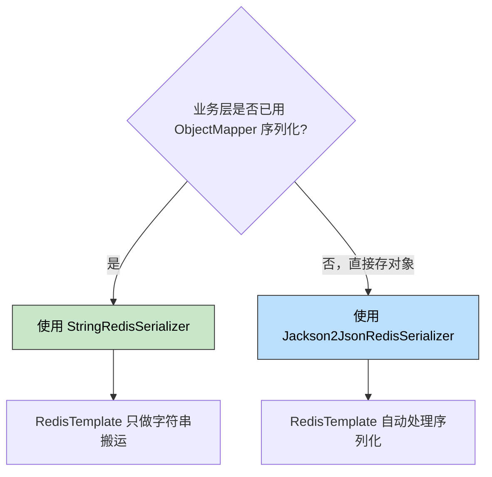

> 🎯 **一句话定位**：解决 Redis 存储值被 `""""` 双重双引号包裹的序列化陷阱。
>
> 💡 **核心理念**：让 RedisTemplate 只做纯字符串存取，序列化的活交给业务层自己控制。

---

## 📖 3 分钟速览版

<details>
<summary><strong>📊 点击展开核心概念</strong></summary>

### 问题一句话

业务层用 `ObjectMapper` 把对象转成 JSON 字符串后，`Jackson2JsonRedisSerializer` 又给它序列化了一遍，导致 Redis 里的值变成 `"\"...\""` 双重引号结构。

### 序列化器选择决策



### 方案对比速查

| 序列化器 | Key 可读 | Value 可读 | 自动序列化对象 | 二次序列化风险 |
|---------|---------|-----------|-------------|-------------|
| JDK 默认 | ❌ 乱码 | ❌ 乱码 | ✅ | ❌ |
| Jackson2Json | ✅ | ⚠️ 已序列化字符串会被二次包裹 | ✅ | ⚠️ 高 |
| **StringRedis** | ✅ | ✅ 所见即所得 | ❌ 需手动 | ❌ 无 |

### 解决方案（30 秒复制可用）

```java
@Bean
public RedisTemplate<String, String> redisTemplate(RedisConnectionFactory factory) {
    RedisTemplate<String, String> template = new RedisTemplate<>();
    template.setConnectionFactory(factory);
    StringRedisSerializer s = new StringRedisSerializer();
    template.setKeySerializer(s);
    template.setValueSerializer(s);
    template.setHashKeySerializer(s);
    template.setHashValueSerializer(s);
    template.afterPropertiesSet();
    return template;
}
```

> 或者更简单：直接注入 Spring Boot 自动配置的 `StringRedisTemplate`。

</details>

---

## 📋 问题背景

### 业务场景

在 Spring Boot 项目中使用 Redis 缓存数据，业务代码先用 `ObjectMapper` 将对象序列化为 JSON 字符串，再通过 `RedisTemplate` 写入 Redis。从 Redis 读取后，再用 `ObjectMapper` 反序列化回对象。

一个典型的操作流程：

```java
// 写入
String json = objectMapper.writeValueAsString(user);
redisTemplate.opsForValue().set("user:1001", json);

// 读取
String cached = (String) redisTemplate.opsForValue().get("user:1001");
User user = objectMapper.readValue(cached, User.class);
```

### 痛点分析

- **双重引号**：使用 `Jackson2JsonRedisSerializer` 或 `GenericJackson2JsonRedisSerializer` 作为 value 序列化器时，已经是 JSON 字符串的值会被**再次序列化**，变成 `"\"{"name":"张三"}\""`
- **Key 乱码**：Redis 中存储的 key 带有 `\xac\xed\x00\x05t\x00` 等 JDK 序列化前缀，用 `redis-cli` 完全不可读
- **Hash 字段污染**：Hash 结构的 hashKey 和 hashValue 同样被序列化器污染，排查问题时在 Redis 客户端看到的数据无法理解

### 目标

让 Redis 中存储的 key 和 value 都是**干净的纯字符串**，用 `redis-cli` 或可视化工具能直接看到可读内容。

---

## 🔍 问题根因

### 二次序列化的本质

`Jackson2JsonRedisSerializer` 的职责是：**把 Java 对象序列化为 JSON 字节数组**。当你传入一个 `String` 类型的值（比如已经是 JSON 的字符串），它会把这个 `String` **当作一个普通 Java 对象**，再调用 `ObjectMapper.writeValueAsBytes()` 序列化一遍。

结果就是：

- 原始 JSON 字符串：`{"name":"张三","age":25}`
- 被 Jackson 再包一层：`"{"name":"张三","age":25}"` → 字节数组中变成 `\"{\\"name\\":\\"张三\\",\\"age\\":25}\"`

```mermaid
graph TD
    A["业务代码: objectMapper.writeValueAsString(user)"] -->|"得到 JSON 字符串"| B["{\"name\":\"张三\"}"]
    B -->|"传入 redisTemplate.set()"| C{"Value 序列化器?"}
    C -->|"Jackson2JsonRedisSerializer"| D["再次序列化: 外加引号+转义"]
    C -->|"StringRedisSerializer"| E["原样写入: 纯字节拷贝"]

    style D fill:#ffccbc,stroke:#333,color:#000
    style E fill:#c8e6c9,stroke:#333,color:#000
```

### 反序列化时的连锁反应

双重引号不只是"看起来不好"，它会导致**读取时反序列化失败**：

```java
// Redis 中存的是: "\"{"name":"张三"}\""
String json = redisTemplate.opsForValue().get("user:1001");
// json 的值是: "{"name":"张三"}"  （带外层引号的字符串）

// 直接反序列化会报错或得到错误结果
User user = objectMapper.readValue(json, User.class);
// JsonParseException: Unexpected character ('"' ...)
```

你不得不先 `objectMapper.readValue(json, String.class)` 脱掉一层引号，再做一次反序列化——完全是多余的操作。

---

## 🔍 方案对比

### 序列化器全景对比

| 序列化器 | 原理 | Key 可读 | Value 可读 | 适用场景 | 二次序列化风险 |
|---------|------|---------|-----------|---------|-------------|
| `JdkSerializationRedisSerializer` | Java 原生序列化 | ❌ | ❌ | 不推荐 | 无（但有乱码） |
| `Jackson2JsonRedisSerializer` | Jackson ObjectMapper | ✅ | ⚠️ 字符串被再包一层 | 直接存 Java 对象 | ⚠️ 高 |
| `GenericJackson2JsonRedisSerializer` | Jackson + 类型信息 | ✅ | ⚠️ 同上 + `@class` 字段 | 需要多态反序列化 | ⚠️ 高 |
| `StringRedisSerializer` | UTF-8 字节拷贝 | ✅ | ✅ 所见即所得 | 业务层已有序列化 | ❌ 无 |

### 选择理由

选择 `StringRedisSerializer`。在大多数项目中，业务层已经在用 `ObjectMapper` 做序列化，RedisTemplate 只需要做**纯粹的字符串搬运**。让序列化职责明确归属业务层，避免框架层的隐式二次序列化。

---

## 💡 核心实现

### 方式一：自定义 RedisTemplate（完全控制）

```java
import org.springframework.context.annotation.Bean;
import org.springframework.context.annotation.Configuration;
import org.springframework.data.redis.connection.RedisConnectionFactory;
import org.springframework.data.redis.core.RedisTemplate;
import org.springframework.data.redis.serializer.StringRedisSerializer;

@Configuration
public class RedisConfig {

    @Bean
    public RedisTemplate<String, String> redisTemplate(RedisConnectionFactory connectionFactory) {
        RedisTemplate<String, String> template = new RedisTemplate<>();
        template.setConnectionFactory(connectionFactory);

        // 统一使用 StringRedisSerializer
        StringRedisSerializer serializer = new StringRedisSerializer();

        // key 和 value
        template.setKeySerializer(serializer);
        template.setValueSerializer(serializer);

        // hash 的 key 和 value —— 不要遗漏！
        template.setHashKeySerializer(serializer);
        template.setHashValueSerializer(serializer);

        template.afterPropertiesSet();
        return template;
    }
}
```

### 方式二：直接使用 StringRedisTemplate（零配置）

Spring Boot 自动配置会注册一个 `StringRedisTemplate` Bean，它内部**已经**使用 `StringRedisSerializer` 配置了所有四个序列化器：

```java
@Service
public class UserCacheService {

    // 直接注入，无需自定义 @Bean
    private final StringRedisTemplate stringRedisTemplate;
    private final ObjectMapper objectMapper;

    public UserCacheService(StringRedisTemplate stringRedisTemplate,
                            ObjectMapper objectMapper) {
        this.stringRedisTemplate = stringRedisTemplate;
        this.objectMapper = objectMapper;
    }

    public void cacheUser(String userId, User user) throws JsonProcessingException {
        String key = "user:" + userId;
        String json = objectMapper.writeValueAsString(user);
        stringRedisTemplate.opsForValue().set(key, json, Duration.ofHours(1));
    }

    public User getUser(String userId) throws JsonProcessingException {
        String key = "user:" + userId;
        String json = stringRedisTemplate.opsForValue().get(key);
        if (json == null) {
            return null;
        }
        return objectMapper.readValue(json, User.class);
    }
}
```

### 两种方式怎么选？

| 场景 | 推荐方式 |
|------|---------|
| 纯字符串操作，无特殊需求 | 方式二：直接注入 `StringRedisTemplate` |
| 需要自定义连接池、超时、重试策略 | 方式一：自定义 `RedisTemplate<String, String>` |
| 部分操作存字符串，部分存对象 | 声明两个 Bean，分别使用不同序列化器 |

### 关键点说明

- **泛型声明为 `<String, String>`**：编译期就能发现类型错误，避免运行时 `ClassCastException`
- **四个序列化器全部设置**：`keySerializer`、`valueSerializer`、`hashKeySerializer`、`hashValueSerializer` 缺一不可，遗漏的部分会回退到 JDK 默认序列化器
- **调用 `afterPropertiesSet()`**：触发 RedisTemplate 的初始化逻辑，确保所有配置生效

---

## 🚧 生产实践

### 效果对比

在 `redis-cli` 中查看存储效果：

```bash
# ❌ JDK 默认序列化器 —— 完全不可读
127.0.0.1:6379> KEYS *
1) "\xac\xed\x00\x05t\x00\x09user:1001"

127.0.0.1:6379> GET "\xac\xed\x00\x05t\x00\x09user:1001"
"\xac\xed\x00\x05t\x00\x1b{\"name\":\"\xe5\xbc\xa0\xe4\xb8\x89\"}"

# ⚠️ Jackson2JsonRedisSerializer —— Key 可读，Value 双重引号
127.0.0.1:6379> GET "user:1001"
"\"{\\\"name\\\":\\\"张三\\\",\\\"age\\\":25}\""

# ✅ StringRedisSerializer —— 干净可读
127.0.0.1:6379> GET "user:1001"
"{\"name\":\"张三\",\"age\":25}"
```

### Hash 操作示例

Hash 结构也是重灾区，hashKey 和 hashValue 都可能被污染：

```java
// 使用 StringRedisSerializer 后，Hash 操作同样干净
Map<String, String> userMap = new HashMap<>();
userMap.put("name", "张三");
userMap.put("age", "25");
userMap.put("email", "zhangsan@example.com");

stringRedisTemplate.opsForHash().putAll("user:1001:info", userMap);
```

```bash
# redis-cli 查看 —— field 和 value 都是可读字符串
127.0.0.1:6379> HGETALL "user:1001:info"
1) "name"
2) "张三"
3) "age"
4) "25"
5) "email"
6) "zhangsan@example.com"
```

### 常见坑点

1. **两个 Bean 冲突导致注入歧义**
   - **现象**：`NoUniqueBeanDefinitionException`，Spring 找到两个 `RedisTemplate` Bean
   - **原因**：自定义了 `RedisTemplate<String, String>`，同时 Spring Boot 自动配置也注册了 `StringRedisTemplate`
   - **解决**：用 `@Qualifier` 指定，或干脆只用其中一个。推荐：如果不需要定制，直接用 `StringRedisTemplate`，删掉自定义 Bean

2. **存入非字符串类型编译报错**
   - **现象**：`redisTemplate.opsForValue().set("key", userObject)` 编译不通过
   - **原因**：泛型声明为 `<String, String>`，value 只接受 `String` 类型
   - **解决**：先用 `objectMapper.writeValueAsString()` 转为字符串再存入——这正是设计意图

3. **Hash 序列化器遗漏**
   - **现象**：`opsForValue()` 正常，但 `opsForHash()` 的 field 出现 `\xac\xed` 乱码前缀
   - **原因**：只设置了 `keySerializer` 和 `valueSerializer`，没有设置 `hashKeySerializer` 和 `hashValueSerializer`
   - **解决**：四个序列化器必须全部显式设置

4. **RedisTemplate 和 StringRedisTemplate 混用**
   - **现象**：同一个 key，用 `RedisTemplate`（JDK 序列化）写入，用 `StringRedisTemplate` 读取，返回 `null`
   - **原因**：两者的 key 序列化方式不同，`RedisTemplate` 写入的 key 带 JDK 前缀，`StringRedisTemplate` 按纯字符串查找
   - **解决**：项目中统一使用一种 Template，不要混用

### 最佳实践

- **统一入口**：所有 Redis 操作封装到 Service 层，禁止在 Controller 或其他地方直接操作 Template
- **序列化职责分离**：RedisTemplate 负责传输，`ObjectMapper` 负责序列化——各司其职
- **Key 命名规范**：使用 `业务:模块:id` 格式，如 `user:cache:1001`、`order:lock:20001`
- **加过期时间**：永远不要写没有 TTL 的缓存，避免 Redis 内存无限增长

---

## 💬 常见问题（FAQ）

### Q1：StringRedisTemplate 和自定义 RedisTemplate<String, String> 有什么区别？

本质上没有区别。`StringRedisTemplate` 是 `RedisTemplate<String, String>` 的子类，构造函数里已经把四个序列化器设置为 `StringRedisSerializer`。如果不需要额外定制，直接用 `StringRedisTemplate` 更简洁。

### Q2：如果项目中既要存字符串，又要直接存对象，怎么办？

声明两个 Bean：

```java
@Bean
public StringRedisTemplate stringRedisTemplate(RedisConnectionFactory factory) {
    return new StringRedisTemplate(factory);
}

@Bean("jsonRedisTemplate")
public RedisTemplate<String, Object> jsonRedisTemplate(RedisConnectionFactory factory) {
    RedisTemplate<String, Object> template = new RedisTemplate<>();
    template.setConnectionFactory(factory);
    template.setKeySerializer(new StringRedisSerializer());
    template.setValueSerializer(new Jackson2JsonRedisSerializer<>(Object.class));
    template.setHashKeySerializer(new StringRedisSerializer());
    template.setHashValueSerializer(new Jackson2JsonRedisSerializer<>(Object.class));
    template.afterPropertiesSet();
    return template;
}
```

使用 `jsonRedisTemplate` 时，**不要在业务层提前序列化**，直接传对象即可。

### Q3：GenericJackson2JsonRedisSerializer 存入的数据带 @class 字段，很占空间怎么办？

`GenericJackson2JsonRedisSerializer` 会在 JSON 中加入 `"@class":"com.example.User"` 用于反序列化时定位类型。如果觉得冗余：

- 改用 `StringRedisSerializer` + 业务层手动序列化（推荐）
- 或使用指定类型的 `Jackson2JsonRedisSerializer<>(User.class)`，不带 `@class`

### Q4：从 JDK 序列化器迁移到 StringRedisSerializer，旧数据怎么办？

旧数据的 key 和 value 都是 JDK 序列化格式，新序列化器无法读取。两种处理方式：

- **逐步淘汰**：设置旧 key 的 TTL，等过期后自然切换
- **批量迁移**：写脚本用旧序列化器读出、新序列化器写入，然后删除旧 key

### Q5：序列化器的选择会影响 Redis 性能吗？

`StringRedisSerializer` 只做 UTF-8 字节转换，开销最小。`Jackson2JsonRedisSerializer` 需要走 ObjectMapper 反射+序列化流程，相对较慢。但在实际生产中，这个差异通常可以忽略——网络 IO 才是 Redis 操作的瓶颈。

---

## ✨ 总结

### 核心要点

1. `Jackson2JsonRedisSerializer` 会把已经是 JSON 字符串的 value **再序列化一次**，产生 `""""` 双重引号
2. 统一使用 `StringRedisSerializer` 设置 key/value/hashKey/hashValue **四个序列化器**，让 Redis 存取透明化
3. 序列化职责归业务层（`ObjectMapper`），RedisTemplate 只做字符串搬运工
4. 大多数场景下，直接注入 Spring Boot 自动配置的 `StringRedisTemplate` 就够了，无需自定义

### 行动建议

**现在就可以做的**：

- 检查项目中 RedisTemplate 的序列化器配置，确认是否存在二次序列化风险
- 用 `redis-cli` 检查线上 Redis 数据是否有乱码或双重引号

**本周可以优化的**：

- 将散落在各处的 RedisTemplate 操作统一收拢到 Service 层
- 制定 Redis Key 命名规范，避免 key 冲突

> 记住一条原则：**序列化只做一次，要么业务层做，要么框架做——永远不要叠加**。

---

## 更新记录

| 版本 | 日期 | 说明 |
|------|------|------|
| v1.0 | 2026-03-16 | 初始版本 |
| v1.1 | 2026-03-17 | 增加 3 分钟速览版、FAQ、Hash 操作示例、迁移指南 |
