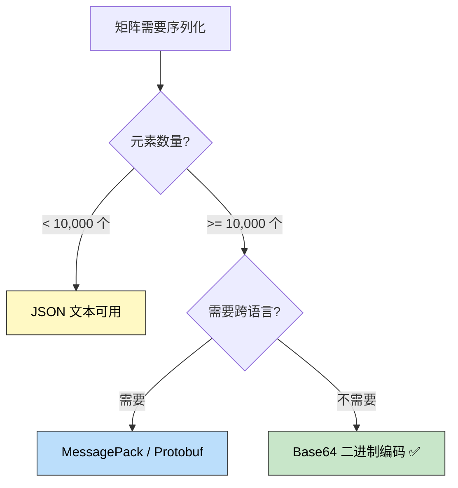
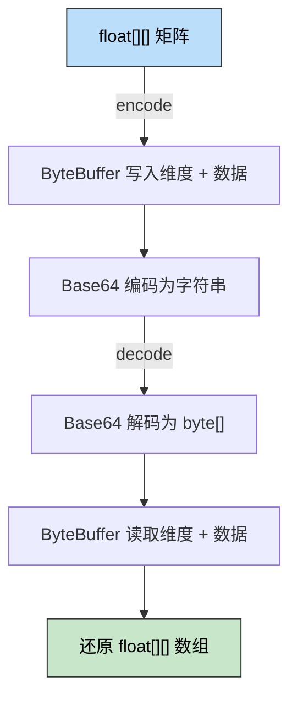
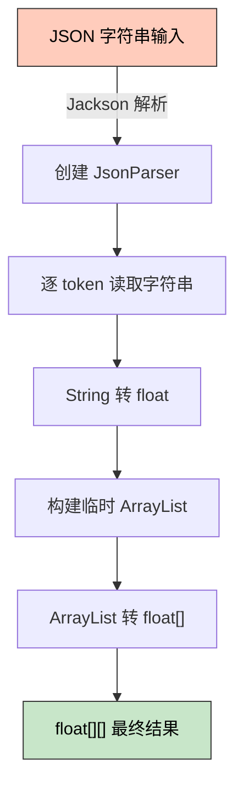

> 🎯 **一句话定位**：大矩阵序列化时，JSON 文本格式是内存杀手，Base64 二进制编码才是正解。
>
> 💡 **核心理念**：用二进制紧凑表示替代人类可读的 JSON 文本，在序列化/反序列化的每一步都减少内存分配。

---

## 📖 3 分钟速览版

<details>
<summary><strong>📊 点击展开核心概念</strong></summary>

### 方案一眼对比

以 `1000 × 512` 的 `float[][]` 矩阵（512,000 个浮点数）为例：

| 序列化方案 | 输出大小 | 内存风险 | 推荐度 |
|-----------|---------|---------|-------|
| `ObjectMapper` 普通 JSON | ~6.5 MB | 高（大量临时 String） | ⚠️ 小矩阵可用 |
| `writerWithDefaultPrettyPrinter()` | ~13 MB | 极高（体积翻倍） | ❌ 禁止 |
| Base64 二进制编码 | ~2.73 MB | 极低（仅 1 个 byte[]） | ✅ 推荐 |

### 选哪个方案



<details>
<summary>**🖼️ 插图版（2026-04-17 增量补充）**</summary>


</details>

### 核心代码（一分钟上手）

编码：`ByteBuffer.allocate(8 + rows*cols*4)` → 写维度 → 写数据 → `Base64.encode()`

解码：`Base64.decode()` → `ByteBuffer.wrap()` → 读维度 → 读数据 → `float[][]`

完整代码见下方「核心实现」章节。

</details>

---

## 📋 问题背景

### 业务场景

在机器学习模型服务、图像特征存储、推荐系统向量计算等场景中，经常需要将 `float[][]` 矩阵（如 embedding 向量、权重矩阵）序列化后存入数据库或通过接口传输。

一个典型的矩阵规模：`1000 × 512` 的 `float[][]`，包含 512,000 个浮点数。

### 痛点分析

- **痛点 1**：`ObjectMapper.readValue()` 反序列化 JSON 文本时，需要逐字符解析数字字符串再转为 `float`，中间对象极多，大矩阵直接 OOM
- **痛点 2**：`writerWithDefaultPrettyPrinter()` 输出带缩进的 JSON，空格和换行符使序列化结果膨胀 2-3 倍，进一步加剧内存压力
- **痛点 3**：JSON 文本中每个浮点数占 8-15 个字符（如 `0.12345678`），而二进制只需固定 4 字节，存储效率差距巨大

### 目标

将 `float[][]` 矩阵的序列化内存占用降低 60% 以上，彻底消除大矩阵场景下的 OOM 风险。

---

## 🔍 方案对比

### 方案调研

| 方案 | 核心思路 | 优点 | 缺点 | 适用场景 |
|------|---------|------|------|---------|
| JSON 文本（ObjectMapper） | 将矩阵序列化为 `[[0.1,0.2],[0.3,0.4]]` | 人类可读，调试方便 | 内存占用极高，大矩阵 OOM | 小规模数据、调试 |
| Base64 二进制编码 | float → 4 字节 → Base64 字符串 | 内存紧凑，速度快，零依赖 | 不可直接阅读 | 生产环境、大矩阵 |
| MessagePack / Protobuf | 使用二进制序列化框架 | 生态成熟，跨语言 | 引入额外依赖，学习成本 | 跨服务通信 |

### 选择理由

Base64 二进制编码方案：**零额外依赖**（JDK 自带 `java.util.Base64` + `ByteBuffer`），实现简单，性能最优。在只需要 Java 内部序列化的场景下，没必要引入 MessagePack 等重型框架。

---

## 💡 核心实现

### 编解码流程



<details>
<summary>**🖼️ 插图版（2026-04-17 增量补充）**</summary>

![编解码流程：float[][] 矩阵、encode](https://cdn.jsdelivr.net/gh/leahana/blog-images@dev/tech/backend/2026-03-16-float-matrix-base64-encoding-avoid-oom/diagram_20260417_091714_00.webp)

</details>

### 完整实现代码

```java
import java.nio.ByteBuffer;
import java.util.Base64;

public class FloatMatrixCodec {

    /**
     * 将 float[][] 编码为 Base64 字符串
     * 二进制格式：[rows(4B)][cols(4B)][float 数据(rows*cols*4B)]
     */
    public static String encode(float[][] matrix) {
        int rows = matrix.length;
        int cols = (rows > 0) ? matrix[0].length : 0;

        // 精确计算字节数：8（维度头）+ rows * cols * 4（数据区）
        // 使用 long 防止 int 溢出（rows * cols * 4 可能超过 Integer.MAX_VALUE）
        long size = 8L + (long) rows * cols * 4;
        if (size > Integer.MAX_VALUE) {
            throw new IllegalArgumentException(
                "Matrix too large for single buffer, use chunk encoding");
        }
        ByteBuffer buffer = ByteBuffer.allocate((int) size);
        buffer.putInt(rows);
        buffer.putInt(cols);

        for (float[] row : matrix) {
            for (float val : row) {
                buffer.putFloat(val);
            }
        }

        return Base64.getEncoder().encodeToString(buffer.array());
    }

    /**
     * 将 Base64 字符串解码为 float[][]
     */
    public static float[][] decode(String base64Str) {
        byte[] bytes = Base64.getDecoder().decode(base64Str);
        if (bytes.length < 8) {
            throw new IllegalArgumentException("Invalid encoded data: too short");
        }
        ByteBuffer buffer = ByteBuffer.wrap(bytes);

        int rows = buffer.getInt();
        int cols = buffer.getInt();
        if (rows < 0 || cols < 0 || 8 + (long) rows * cols * 4 != bytes.length) {
            throw new IllegalArgumentException("Invalid encoded data: size mismatch");
        }

        float[][] matrix = new float[rows][cols];
        for (int i = 0; i < rows; i++) {
            for (int j = 0; j < cols; j++) {
                matrix[i][j] = buffer.getFloat();
            }
        }

        return matrix;
    }
}
```

### Roundtrip 测试

```java
import org.junit.jupiter.api.Test;
import static org.junit.jupiter.api.Assertions.*;

class FloatMatrixCodecTest {

    @Test
    void encodeAndDecodeShouldBeIdentical() {
        float[][] original = {{1.1f, 2.2f, 3.3f}, {4.4f, 5.5f, 6.6f}};
        String encoded = FloatMatrixCodec.encode(original);
        float[][] decoded = FloatMatrixCodec.decode(encoded);
        assertArrayEquals(original, decoded);
    }

    @Test
    void emptyMatrixShouldRoundtrip() {
        float[][] empty = new float[0][0];
        assertArrayEquals(empty, FloatMatrixCodec.decode(FloatMatrixCodec.encode(empty)));
    }
}
```

### 关键设计说明

- **维度信息前置**：头 8 字节存储 rows 和 cols，解码时无需额外传参，字符串本身自描述
- **精确 allocate**：`8 + rows * cols * 4` 一次性分配，避免动态扩容带来的内存拷贝
- **IEEE 754 直接写入**：`ByteBuffer.putFloat()` 将 float 的二进制位原样写入，无精度损失，无字符串转换

---

## ⚡ 性能分析

### 内存占用对比

以 `1000 × 512` 的 `float[][]` 矩阵（512,000 个浮点数）为例：

| 指标 | JSON（普通） | JSON（Pretty Print） | Base64 二进制 |
|------|------------|---------------------|--------------|
| 序列化结果大小 | ~6.5 MB | ~13 MB | **~2.73 MB** |
| 与原始数据比 | 3.2× | 6×+ | **1.33×** |
| 反序列化中间对象 | 大量 String、JsonNode、临时数组 | 更多 | **仅 1 个 byte[]** |

### 为什么 ObjectMapper 会 OOM



<details>
<summary>**🖼️ 插图版（2026-04-17 增量补充）**</summary>


</details>

Jackson 反序列化 `float[][]` 的过程中，**每一个浮点数**都经历了：字符串分配 → 数字解析 → 装箱/拆箱 → 临时集合存储 → 最终数组拷贝。512K 个浮点数意味着至少 512K 次字符串分配，GC 压力巨大。

### writerWithDefaultPrettyPrinter 的代价

```java
// ❌ 千万不要这样做！
String json = objectMapper
    .writerWithDefaultPrettyPrinter()
    .writeValueAsString(matrix);
```

Pretty Print 会在每个元素后加换行和缩进，对于 `float[][]` 这种高密度数据结构：

- 每个 float 值独占一行 + 缩进空格 → 每个元素额外增加 ~10 字节
- 512K 个元素 → 额外 ~5 MB 的空白字符
- 最终 JSON 字符串可达原始数据 **6 倍以上**

### 进阶优化：GZIP + Base64

如果存储空间敏感，可以在 Base64 外再套一层 GZIP：

```java
import java.io.*;
import java.nio.ByteBuffer;
import java.util.Base64;
import java.util.zip.GZIPInputStream;
import java.util.zip.GZIPOutputStream;

public class FloatMatrixCodecGzip {

    public static String encodeWithGzip(float[][] matrix) throws IOException {
        // Step 1：float[][] → byte[]（内联 ByteBuffer 编码，跳过 Base64 步骤）
        int rows = matrix.length;
        int cols = (rows > 0) ? matrix[0].length : 0;
        ByteBuffer buf = ByteBuffer.allocate(8 + rows * cols * 4);
        buf.putInt(rows);
        buf.putInt(cols);
        for (float[] row : matrix) {
            for (float v : row) buf.putFloat(v);
        }
        byte[] raw = buf.array();

        // Step 2：GZIP 压缩
        ByteArrayOutputStream baos = new ByteArrayOutputStream();
        try (GZIPOutputStream gz = new GZIPOutputStream(baos)) {
            gz.write(raw);
        }

        // Step 3：Base64 编码
        return Base64.getEncoder().encodeToString(baos.toByteArray());
    }

    public static float[][] decodeWithGzip(String base64Str) throws IOException {
        byte[] compressed = Base64.getDecoder().decode(base64Str);

        // Step 1：GZIP 解压
        ByteArrayOutputStream baos = new ByteArrayOutputStream();
        try (GZIPInputStream gz = new GZIPInputStream(new ByteArrayInputStream(compressed))) {
            byte[] tmp = new byte[4096];
            int len;
            while ((len = gz.read(tmp)) != -1) baos.write(tmp, 0, len);
        }

        // Step 2：byte[] → float[][]
        ByteBuffer buf = ByteBuffer.wrap(baos.toByteArray());
        int rows = buf.getInt();
        int cols = buf.getInt();
        float[][] matrix = new float[rows][cols];
        for (int i = 0; i < rows; i++)
            for (int j = 0; j < cols; j++)
                matrix[i][j] = buf.getFloat();

        return matrix;
    }
}
```

**GZIP 效果**：对规律性较强的 embedding 向量，可再减少 30-50% 体积，但 CPU 开销约增加 2-3 倍。优先考虑 IO 瓶颈是否大于 CPU 开销后再决定是否启用。

---

## 🚧 生产实践

### 边界条件处理

- **空矩阵**：`new float[0][0]` 编码后仅 8 字节（rows=0, cols=0），解码正常还原
- **不规则矩阵**：当前实现以 `matrix[0].length` 为列数，不规则矩阵（各行列数不同）需先补齐为矩形矩阵
- **超大矩阵**：`ByteBuffer.allocate()` 上限约 2 GB，超过时需分块处理

### 常见坑点

1. **Base64 变体选择错误**
   - **现象**：存入数据库或 URL 传输时 `+` `/` 被转义，导致解码失败
   - **原因**：标准 Base64 包含 `+` `/` `=`，不适合 URL 和部分数据库驱动
   - **解决**：URL 场景改用 `Base64.getUrlEncoder()` 和 `Base64.getUrlDecoder()`

2. **ByteBuffer 字节序不一致**
   - **现象**：跨平台或跨语言解码后数据乱码
   - **原因**：不同平台默认字节序可能不同
   - **解决**：显式声明 `buffer.order(ByteOrder.BIG_ENDIAN)`（Java 默认已是大端序，但跨语言时两端都建议显式声明）

3. **数据库字段长度不足**
   - **现象**：存储时被静默截断，解码时报错或返回错误数据
   - **原因**：Base64 输出长度 = `⌈原始字节数 / 3⌉ × 4`，需预先估算
   - **解决**：MySQL 改用 `MEDIUMTEXT`（最大 16 MB）或 `LONGTEXT`，避免 `VARCHAR(N)`

### 字段长度速查

| 矩阵规模 | 原始字节 | Base64 长度 | MySQL 字段 |
|---------|---------|------------|-----------|
| 100 × 128 | ~50 KB | ~68 KB | `TEXT` |
| 1000 × 512 | ~2 MB | ~2.7 MB | `MEDIUMTEXT` |
| 10000 × 512 | ~20 MB | ~27 MB | `LONGTEXT` |

### 监控指标

- 序列化/反序列化 P99 耗时（基准：1000 × 512 矩阵单次 < 5ms）
- 单次编码的 `byte[]` 分配大小（防止超预期大矩阵打满堆）
- GC 频率（切换 Base64 方案后应有明显下降）

### 生产上线检查清单

<details>
<summary><strong>✅ 点击展开上线前确认清单</strong></summary>

#### 编码选择

- [ ] 矩阵元素数量 >= 10,000 → 已改用 Base64 二进制编码
- [ ] 已禁止代码中出现 `writerWithDefaultPrettyPrinter()` 操作大矩阵
- [ ] 确认编解码两端使用相同字节序（默认 `BIG_ENDIAN` 即可）

#### 数据库配置

- [ ] 字段类型已从 `VARCHAR` 改为 `MEDIUMTEXT` 或 `LONGTEXT`
- [ ] 已按矩阵最大规模估算 Base64 长度并留有余量

#### URL / 接口传输

- [ ] URL 参数场景已改用 `Base64.getUrlEncoder()`
- [ ] 接口文档已标注字段为 Base64 二进制编码格式

#### 监控告警

- [ ] 已添加序列化耗时监控（P99）
- [ ] 已配置 JVM 堆内存监控并设置阈值告警

</details>

---

## 💬 常见问题（FAQ）

### Q1：Base64 编码会有精度损失吗？

**A：** 不会。`ByteBuffer.putFloat()` 直接将 float 的 IEEE 754 二进制位（32 bit）原样写入字节数组，没有任何字符串转换，解码后与原始值 bit-for-bit 一致。而 JSON 文本序列化在配置了数字格式化（如 `DecimalFormat` 或 `@JsonFormat(pattern="0.##")`）时可能引入精度损失。

### Q2：能用于 double[][] 吗？

**A：** 完全可以。只需将 `buffer.putFloat()` / `buffer.getFloat()` 改为 `buffer.putDouble()` / `buffer.getDouble()`，并将每个元素字节数从 4 改为 8。但 double 体积是 float 的 2 倍，大部分 embedding 应用 float 的精度（~7 位有效数字）已足够。

### Q3：Base64 字符串不方便调试，怎么办？

**A：** 推荐双模式策略：

- **开发/测试环境**：同时输出 JSON 格式的前几个元素到日志
- **生产环境**：存储和传输全部走 Base64 二进制

```java
// 仅在 DEBUG 级别打印可读预览，不影响生产性能
if (log.isDebugEnabled()) {
    log.debug("Matrix preview [{},{},...] size={}x{}",
        matrix[0][0], matrix[0][1],
        matrix.length, matrix[0].length);
}
String encoded = FloatMatrixCodec.encode(matrix);
```

### Q4：和 Kryo / FST 等 Java 序列化框架相比怎么样？

**A：** 核心区别在于**可移植性**：

- **Kryo / FST**：极快，但格式与 Java 强绑定，跨语言复杂
- **Base64 二进制**：输出标准 Base64 字符串，Python/Go 等任何语言都能用约 10 行代码解码

如果确定只在 Java 内部使用，Kryo 性能更优；如果需要将矩阵传给 Python 模型服务，Base64 二进制方案更合适。

### Q5：什么时候该用 MessagePack 而不是 Base64 二进制？

**A：** 以下场景推荐 MessagePack：

- **复杂对象**：不只是 `float[][]`，还包含字符串、嵌套对象等异构数据
- **跨语言生态**：团队同时有 Python / Go / Java 服务，MessagePack 有成熟的多语言 SDK
- **自描述需求**：MessagePack 支持类型标注，而 Base64 二进制依赖双端约定格式

纯粹的 `float[][]` 场景，Base64 二进制更轻量；复杂业务对象，MessagePack 更合适。

### Q6：我的矩阵超过 2 GB 怎么办？

**A：** `ByteBuffer.allocate()` 上限约 2 GB（`Integer.MAX_VALUE` 字节）。超大矩阵需分块处理：

```java
// 示例：按行分块，每块最多 N 行
public static List<String> encodeInChunks(float[][] matrix, int chunkRows) {
    List<String> chunks = new ArrayList<>();
    for (int start = 0; start < matrix.length; start += chunkRows) {
        int end = Math.min(start + chunkRows, matrix.length);
        float[][] chunk = Arrays.copyOfRange(matrix, start, end);
        chunks.add(FloatMatrixCodec.encode(chunk));
    }
    return chunks;
}
```

---

## ✨ 总结

### 核心要点

1. **JSON 文本是大矩阵的内存杀手**：`ObjectMapper` 反序列化时每个元素都产生临时字符串，512K 个浮点数直接引发 GC 爆炸
2. **`writerWithDefaultPrettyPrinter()` 绝不能用于数值数据**：让 JSON 体积膨胀 6 倍以上，是调试工具，不是数据格式
3. **Base64 二进制编码 = 零依赖，内存降 58%**：`ByteBuffer.putFloat()` + `Base64.getEncoder()`，50 行代码彻底告别大矩阵 OOM

### 适用场景

- ML 模型 embedding 向量的存储与传输
- 图像特征矩阵的数据库持久化
- 推荐系统中用户/物品向量的批量序列化
- 任何需要高效传输大规模浮点数组的场景

### 行动建议

**今天就可以做的**：

- 搜索代码库中所有 `ObjectMapper` + `float[][]` 的组合，标记为待优化
- 引入 `FloatMatrixCodec` 工具类，补充单元测试验证编解码一致性

**本周可以优化的**：

- 将生产环境大矩阵字段全部迁移到 Base64 编码
- 更新数据库字段类型（`VARCHAR` → `MEDIUMTEXT`）

**长期可以改进的**：

- 对 embedding 存储量大的表，评估 GZIP + Base64 方案，进一步降低存储成本
- 建立团队级矩阵序列化规范，统一编码格式，避免新人踩坑

> 序列化不只是"把对象变成字符串"，它是内存管理的第一道防线。选对格式，才能选对战场。

---

## 更新记录

| 版本 | 日期 | 说明 |
|------|------|------|
| v1.0 | 2026-03-16 | 初始版本 |
| v2.0 | 2026-03-16 | 深度优化：新增 3 分钟速览、FAQ（6 问）、GZIP 进阶方案、生产检查清单、行动建议 |
| v2.1 | 2026-03-16 | Review 修复：encode 增加溢出校验、decode 增加输入校验、修正精度描述、补充 JUnit 测试 |
| v2.2 | 2026-04-17 | 为 3 个 Mermaid 图表追加 Chiikawa 风格插图（m2c-pipeline 生成） |
