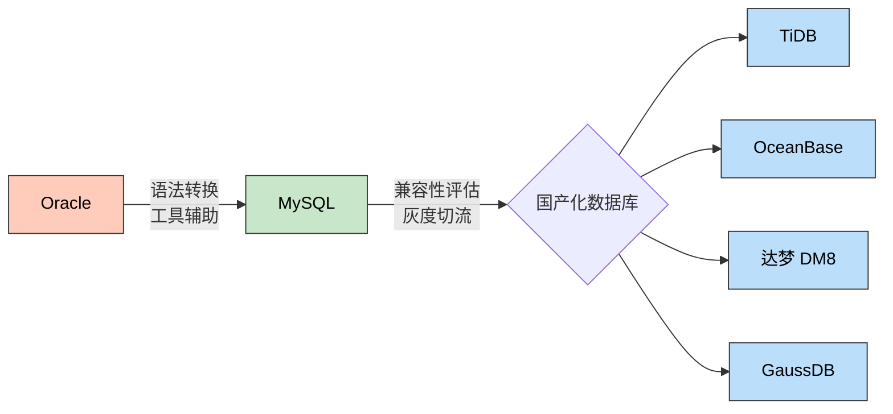
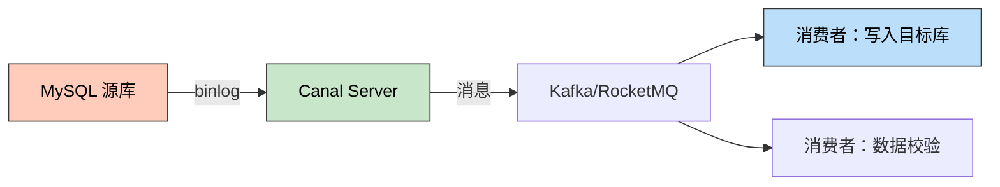
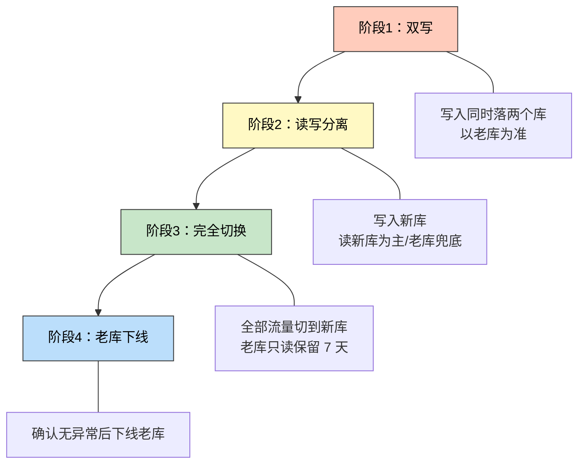

> 🎯 **一句话定位**：一篇覆盖 Oracle → MySQL → 国产化数据库的全链路迁移指南，从语法差异到灰度切流，帮你少踩 80% 的坑。

> 💡 **核心理念**：迁移不是翻译 SQL，而是重新理解业务在新引擎上的最优表达。

---

## 📖 3分钟速览版

<details>
<summary><strong>📊 点击展开迁移全景图</strong></summary>

### 🔌 迁移路径总览



<details>
<summary>**🖼️ 插图版（2026-04-17 增量补充）**</summary>


</details>

### 💎 核心要点

| 阶段 | 关键动作 | 最大风险 |
|------|---------|---------|
| Oracle → MySQL | 语法转换 + 函数替换 | 隐式类型转换、空字符串 vs NULL |
| 数据迁移 | 全量 + 增量同步 | 大表迁移超时、字符集不一致 |
| MySQL → 国产化 | 兼容性评估 + 灰度切流 | 方言差异、驱动兼容性 |
| 上线验证 | 数据校验 + 性能基线 | 执行计划差异导致慢查询 |

### 🎯 国产化数据库选型速查

| 数据库 | 兼容模式 | 核心优势 | 适用场景 |
|--------|---------|---------|---------|
| TiDB | MySQL | 水平扩展、HTAP | 大数据量、高并发 |
| OceanBase | MySQL/Oracle 双模 | 金融级高可用 | 金融交易、核心系统 |
| 达梦 DM8 | Oracle | 信创主流认证 | 政务、国企 |
| GaussDB | PostgreSQL | 华为生态 | 华为云客户、混合云 |

</details>

---

## 🧠 深度剖析版

## 1. 为什么要做数据库迁移

### 1.1 Oracle 迁出的驱动因素

- **授权成本高**：Oracle 按 CPU 核心数收费，年维护费占总 license 的 22%，一台 16 核服务器年费可达数十万
- **供应链风险**：中美技术博弈背景下，Oracle 断供风险上升
- **信创政策**：党政、金融、电信等关键行业要求 2027 年前完成国产化替代

### 1.2 典型迁移路径

大多数企业采用 **两步走** 策略：

1. **Oracle → MySQL**：先迁到开源生态，降低成本、消除授权风险
2. **MySQL → 国产化**：在 MySQL 兼容基础上选择信创认证数据库

这种策略的优势在于：MySQL 生态成熟，人才储备充足，迁移工具丰富；国产化数据库大多兼容 MySQL 协议，二次迁移成本可控。

---

## 2. Oracle → MySQL 语法差异

### 2.1 数据类型映射

| Oracle 类型 | MySQL 类型 | 注意事项 |
|-------------|-----------|---------|
| `NUMBER(p,s)` | `DECIMAL(p,s)` | MySQL `DECIMAL` 最大精度 65 位 |
| `NUMBER(p)` (无小数) | `BIGINT` / `INT` | 根据精度选择 |
| `VARCHAR2(n)` | `VARCHAR(n)` | Oracle 按字节，MySQL 按字符（utf8mb4） |
| `NVARCHAR2(n)` | `VARCHAR(n)` | MySQL utf8mb4 天然支持 Unicode |
| `DATE` | `DATETIME` | **Oracle DATE 含时分秒，MySQL DATE 不含** |
| `TIMESTAMP` | `DATETIME(6)` | MySQL 6 位微秒精度 |
| `CLOB` | `LONGTEXT` | 最大 4GB |
| `BLOB` | `LONGBLOB` | 最大 4GB |
| `RAW(n)` | `VARBINARY(n)` | 二进制数据 |
| `ROWID` | 无直接等价 | 改用自增主键或 UUID |

### 2.2 函数差异对照

| Oracle 函数 | MySQL 替代 | 示例 |
|-------------|-----------|------|
| `NVL(a, b)` | `IFNULL(a, b)` | `IFNULL(name, '未知')` |
| `NVL2(a, b, c)` | `IF(a IS NOT NULL, b, c)` | - |
| `DECODE(a, b, c, d)` | `CASE WHEN a=b THEN c ELSE d END` | - |
| `SYSDATE` | `NOW()` | 注意时区设置 |
| `SYSTIMESTAMP` | `NOW(6)` | 含微秒 |
| `TO_CHAR(date, fmt)` | `DATE_FORMAT(date, fmt)` | 格式符不同：`YYYY→%Y`, `MM→%m` |
| `TO_DATE(str, fmt)` | `STR_TO_DATE(str, fmt)` | 同上 |
| `TO_NUMBER(str)` | `CAST(str AS DECIMAL)` | 或直接 `str + 0` |
| `ROWNUM` | `LIMIT` | `WHERE ROWNUM <= 10` → `LIMIT 10` |
| `ROWNUM` (分页) | `LIMIT offset, count` | 嵌套子查询 → 简单 `LIMIT` |
| `SUBSTR(s, p, l)` | `SUBSTRING(s, p, l)` | 参数含义相同 |
| `INSTR(s, sub)` | `LOCATE(sub, s)` | **参数顺序相反** |
| `LENGTH(s)` | `CHAR_LENGTH(s)` | `LENGTH()` 在 MySQL 中返回字节数 |
| `TRUNC(date)` | `DATE(date)` | 截断到天 |
| `ADD_MONTHS(d, n)` | `DATE_ADD(d, INTERVAL n MONTH)` | - |
| `MONTHS_BETWEEN(a, b)` | `TIMESTAMPDIFF(MONTH, b, a)` | **参数顺序相反** |
| `序列.NEXTVAL` | `AUTO_INCREMENT` | 见下文详述 |

### 2.3 序列 vs AUTO_INCREMENT

**Oracle 序列**：

```sql
-- Oracle: 创建序列
CREATE SEQUENCE seq_user_id START WITH 1 INCREMENT BY 1;

-- 使用
INSERT INTO t_user (id, name) VALUES (seq_user_id.NEXTVAL, '张三');
```

**MySQL 自增**：

```sql
-- MySQL: 自增主键
CREATE TABLE t_user (
    id BIGINT NOT NULL AUTO_INCREMENT,
    name VARCHAR(50),
    PRIMARY KEY (id)
) ENGINE=InnoDB;

-- 插入时不指定 id
INSERT INTO t_user (name) VALUES ('张三');

-- 获取最后插入的 id
SELECT LAST_INSERT_ID();
```

**注意**：如果业务代码依赖"先获取序列值再插入"的模式，需要重构为"插入后获取自增 ID"或使用分布式 ID 生成器（Snowflake、Leaf）。

### 2.4 空字符串与 NULL 的致命差异

这是 Oracle → MySQL 迁移中**最容易出 bug** 的地方：

```sql
-- Oracle：空字符串 == NULL
SELECT * FROM t_user WHERE name IS NULL;
-- 能查到 name = '' 的记录

-- MySQL：空字符串 != NULL
SELECT * FROM t_user WHERE name IS NULL;
-- 查不到 name = '' 的记录，需要：
SELECT * FROM t_user WHERE name IS NULL OR name = '';
```

**修复策略**：全面排查代码中的 `IS NULL` 判断，评估是否需要补充 `OR column = ''`。

### 2.5 存储过程迁移

Oracle PL/SQL 和 MySQL 存储过程语法差异大，建议优先将逻辑迁移到应用层（Java/Python）。必须保留存储过程时，主要差异：

```sql
-- Oracle PL/SQL
CREATE OR REPLACE PROCEDURE update_salary(
    p_emp_id IN NUMBER,
    p_raise  IN NUMBER
) AS
    v_current NUMBER;
BEGIN
    SELECT salary INTO v_current FROM emp WHERE id = p_emp_id;
    UPDATE emp SET salary = v_current + p_raise WHERE id = p_emp_id;
    COMMIT;
EXCEPTION
    WHEN NO_DATA_FOUND THEN
        DBMS_OUTPUT.PUT_LINE('Employee not found');
END;
/
```

```sql
-- MySQL 存储过程
DELIMITER $$
CREATE PROCEDURE update_salary(
    IN p_emp_id BIGINT,
    IN p_raise DECIMAL(10,2)
)
BEGIN
    DECLARE v_current DECIMAL(10,2);
    DECLARE CONTINUE HANDLER FOR NOT FOUND
        SELECT 'Employee not found' AS message;

    SELECT salary INTO v_current FROM emp WHERE id = p_emp_id;
    UPDATE emp SET salary = v_current + p_raise WHERE id = p_emp_id;
    -- MySQL 默认 autocommit，无需显式 COMMIT
END$$
DELIMITER ;
```

---

## 3. 迁移工具与数据同步

### 3.1 工具选型

| 工具 | 类型 | 适用场景 | 许可 |
|------|------|---------|------|
| ora2pg | 开源 | Oracle → PostgreSQL/MySQL DDL 转换 | 免费 |
| SQLines | 商业/社区版 | SQL 语法批量转换 | 社区版免费 |
| AWS SCT | 云服务 | 全面的 schema 转换 + 评估报告 | AWS 用户免费 |
| mysqldump / mydumper | 开源 | MySQL 全量导出 | 免费 |
| Canal | 开源（阿里） | MySQL binlog 增量同步 | 免费 |
| DataX | 开源（阿里） | 异构数据库批量同步 | 免费 |

### 3.2 全量迁移流程

```sql
-- 1. 使用 ora2pg 导出 DDL（Oracle → MySQL 格式）
-- ora2pg -t TABLE -o tables.sql -c ora2pg.conf

-- 2. 手动检查并修正 DDL
-- 重点：数据类型、索引、约束

-- 3. 使用 DataX 同步数据
-- datax.py job/oracle_to_mysql.json
```

**DataX 配置示例**（Oracle → MySQL）：

```json
{
  "job": {
    "content": [{
      "reader": {
        "name": "oraclereader",
        "parameter": {
          "connection": [{
            "jdbcUrl": ["jdbc:oracle:thin:@//host:1521/orcl"],
            "table": ["T_USER"]
          }],
          "username": "readonly_user",
          "password": "***",
          "column": ["ID", "NAME", "STATUS", "CREATED_AT"]
        }
      },
      "writer": {
        "name": "mysqlwriter",
        "parameter": {
          "connection": [{
            "jdbcUrl": "jdbc:mysql://host:3306/mydb?useUnicode=true&characterEncoding=utf8mb4",
            "table": ["t_user"]
          }],
          "username": "write_user",
          "password": "***",
          "column": ["id", "name", "status", "created_at"],
          "writeMode": "replace"
        }
      }
    }],
    "setting": {
      "speed": { "channel": 4 }
    }
  }
}
```

### 3.3 增量同步（Canal + MQ）

迁移过程中业务不停机，需要增量同步：



<details>
<summary>**🖼️ 插图版（2026-04-17 增量补充）**</summary>


</details>

**Canal 核心配置**：

```properties
# canal.properties
canal.instance.master.address=source-mysql:3306
canal.instance.dbUsername=canal
canal.instance.dbPassword=***
canal.instance.filter.regex=mydb\\..*
canal.mq.topic=canal_sync
```

---

## 4. MySQL → 国产化数据库

### 4.1 兼容性评估矩阵

| 评估维度 | TiDB | OceanBase | 达梦 DM8 | GaussDB |
|---------|------|-----------|---------|---------|
| MySQL 协议兼容 | ✅ 高（>95%） | ✅ 高（MySQL 模式） | ⚠️ 中（Oracle 模式为主） | ❌ 低（PG 内核） |
| JDBC 驱动 | MySQL Connector | 自有 + MySQL 兼容 | 自有驱动 | 自有驱动 |
| ORM 框架支持 | MyBatis/JPA 透明 | MyBatis/JPA 透明 | 需适配方言 | 需适配方言 |
| 分布式能力 | 原生分布式 | 原生分布式 | 单机 + 集群 | 分布式可选 |
| 信创认证 | ✅ | ✅ | ✅ 主流 | ✅ |
| 社区生态 | 活跃（PingCAP） | 活跃（蚂蚁） | 一般 | 华为主导 |
| 运维复杂度 | 中 | 高 | 低 | 中 |

### 4.2 各数据库迁移要点

#### TiDB（推荐 MySQL 生态项目）

**优势**：几乎无感迁移，修改 JDBC URL 即可。

```yaml
# 应用配置只需改连接串
spring:
  datasource:
    url: jdbc:mysql://tidb-host:4000/mydb?useSSL=false
    driver-class-name: com.mysql.cj.jdbc.Driver
```

**注意事项**：

- 自增 ID 非连续（分布式分配），业务不能依赖 ID 连续性
- 不支持外键约束（需在应用层保证）
- `SELECT ... FOR UPDATE` 的锁行为与 MySQL 略有差异

#### OceanBase（推荐金融场景）

```yaml
# MySQL 模式连接
spring:
  datasource:
    url: jdbc:mysql://obproxy-host:2883/mydb
    driver-class-name: com.mysql.cj.jdbc.Driver
```

**注意**：通过 OBProxy 代理连接，应用层对 MySQL 透明。

#### 达梦 DM8（推荐政务/国企）

达梦以 Oracle 兼容为主，若源库是 MySQL 需注意：

```xml
<!-- Maven 依赖 -->
<dependency>
    <groupId>com.dameng</groupId>
    <artifactId>DmJdbcDriver18</artifactId>
    <version>8.1.2.192</version>
</dependency>
```

```yaml
spring:
  datasource:
    url: jdbc:dm://dm-host:5236/mydb
    driver-class-name: dm.jdbc.driver.DmDriver
```

**MyBatis 方言适配**：

```java
// 达梦分页不支持 LIMIT，使用 ROWNUM 或 TOP
// MyBatis Plus 已内置 DmDialect，配置即可：
mybatis-plus:
  configuration:
    database-id: dm
```

#### GaussDB（推荐华为云客户）

```yaml
spring:
  datasource:
    url: jdbc:gaussdb://gauss-host:8000/mydb
    driver-class-name: com.huawei.gaussdb.jdbc.Driver
```

**注意**：GaussDB 基于 PostgreSQL 内核，SQL 方言差异较大，`LIMIT` 语法兼容但函数不同。

### 4.3 迁移策略：灰度切流



<details>
<summary>**🖼️ 插图版（2026-04-17 增量补充）**</summary>


</details>

**双写模式核心代码**：

```java
@Service
public class DualWriteService {

    @Autowired
    @Qualifier("mysqlJdbcTemplate")
    private JdbcTemplate mysqlTemplate;

    @Autowired
    @Qualifier("tidbJdbcTemplate")
    private JdbcTemplate tidbTemplate;

    @Transactional
    public void saveUser(User user) {
        // 主库写入（MySQL）
        mysqlTemplate.update(
            "INSERT INTO t_user (name, status) VALUES (?, ?)",
            user.getName(), user.getStatus()
        );

        // 新库写入（TiDB），异步 + 容错
        try {
            tidbTemplate.update(
                "INSERT INTO t_user (name, status) VALUES (?, ?)",
                user.getName(), user.getStatus()
            );
        } catch (Exception e) {
            // 记录差异日志，后续补偿
            log.error("TiDB 双写失败, userId={}", user.getId(), e);
            diffLogService.record("t_user", user.getId(), "INSERT");
        }
    }
}
```

---

## 5. 数据校验与回滚

### 5.1 数据一致性校验

```sql
-- 行数对比
SELECT 'mysql' AS source, COUNT(*) AS cnt FROM mysql_db.t_user
UNION ALL
SELECT 'tidb' AS source, COUNT(*) AS cnt FROM tidb_db.t_user;

-- 抽样校验（MD5 校验和）
SELECT MD5(GROUP_CONCAT(
    CONCAT_WS(',', id, name, status, created_at)
    ORDER BY id
)) AS checksum
FROM t_user
WHERE id BETWEEN 1 AND 10000;
```

**pt-table-checksum**（推荐）：

```bash
# 对比源库和目标库的数据一致性
pt-table-checksum \
    --host=mysql-source \
    --databases=mydb \
    --tables=t_user \
    --recursion-method=dsn=h=tidb-target,D=percona,t=dsns
```

### 5.2 回滚方案设计

| 阶段 | 回滚方式 | RTO |
|------|---------|-----|
| 双写阶段 | 切回老库读写，停止双写 | < 1 分钟 |
| 读写分离 | 读切回老库，写已在新库需同步回老库 | < 5 分钟 |
| 完全切换后 7 天内 | 反向同步 + 切回 | < 30 分钟 |
| 老库下线后 | 从备份恢复 | 数小时 |

---

## 6. 故障排查

### 6.1 问题：字符集乱码

**症状**：迁移后中文显示为 `???` 或乱码。

**原因**：Oracle 使用 `AL32UTF8`，MySQL 需要 `utf8mb4`。

**解决**：

```sql
-- 检查 MySQL 字符集
SHOW VARIABLES LIKE 'character_set%';

-- 确保数据库和表使用 utf8mb4
ALTER DATABASE mydb CHARACTER SET utf8mb4 COLLATE utf8mb4_unicode_ci;
ALTER TABLE t_user CONVERT TO CHARACTER SET utf8mb4;
```

### 6.2 问题：日期精度丢失

**症状**：Oracle `DATE` 迁移到 MySQL `DATE` 后，时分秒丢失。

**原因**：Oracle `DATE` 含时分秒，MySQL `DATE` 只含日期。

**解决**：Oracle `DATE` 应映射为 MySQL `DATETIME`，而非 `DATE`。

### 6.3 问题：大表迁移超时

**症状**：千万级表迁移时 DataX 任务超时。

**解决**：

```json
{
  "setting": {
    "speed": {
      "channel": 8,
      "byte": 10485760
    },
    "errorLimit": {
      "record": 0,
      "percentage": 0
    }
  }
}
```

- 增加并发 channel 数
- 按主键范围分片：`WHERE id BETWEEN ? AND ?`
- 关闭目标库的 binlog（迁移期间）：`SET sql_log_bin = 0;`

---

## 💬 常见问题（FAQ）

### Q1: 迁移后 SQL 性能下降怎么办？

**A:** Oracle 和 MySQL 的优化器策略不同，相同 SQL 的执行计划可能差异巨大。

**排查步骤**：

1. `EXPLAIN` 对比执行计划
2. 检查索引是否正确迁移（Oracle 函数索引在 MySQL 中不支持）
3. 关注 `JOIN` 顺序：MySQL 优化器对多表 JOIN 的处理弱于 Oracle
4. 考虑添加查询 Hint：`/*+ STRAIGHT_JOIN */`

### Q2: Oracle 的分区表如何迁移？

**A:** MySQL 支持 RANGE、LIST、HASH、KEY 分区，但不支持 Oracle 的组合分区。

- **RANGE 分区**：直接对应
- **LIST 分区**：直接对应
- **组合分区**：拆为单级分区 + 应用层路由
- 如果目标是 TiDB，建议用 TiDB 的 Region 分裂替代分区表

### Q3: 国产数据库 JDBC 驱动从哪获取？

各数据库驱动获取方式如下：

| 数据库 | Maven 仓库 | 备注 |
|--------|-----------|------|
| TiDB | `mysql-connector-java`（同 MySQL） | 无需额外驱动 |
| OceanBase | Maven Central: `com.oceanbase:oceanbase-client` | 也可用 MySQL 驱动 |
| 达梦 DM | 官网下载，手动安装到私服 | `mvn install:install-file` |
| GaussDB | 华为云官网 / 镜像仓库 | 注意版本匹配 |

### Q4: 如何保证迁移过程中数据不丢失？

**A:** 采用「全量 + 增量 + 校验」三步法：

1. **全量同步**：停写窗口或一致性快照导出
2. **增量同步**：Canal 监听 binlog，消费写入目标库
3. **数据校验**：pt-table-checksum 对比行数和校验和
4. **补偿机制**：差异日志 + 定时修复任务

### Q5: 达梦 DM 和 GaussDB 如何选择？

两者的核心区别在于兼容方向和目标生态：

| 维度 | 达梦 DM8 | GaussDB |
|------|---------|---------|
| 兼容方向 | Oracle 兼容 | PostgreSQL 兼容 |
| 信创认证 | 覆盖面广，政务首选 | 华为生态优先 |
| 运维难度 | 低，传统单机架构 | 中，分布式可选 |
| 推荐场景 | 从 Oracle 迁出的政务系统 | 华为云客户、PG 生态项目 |
| 社区支持 | 一般，依赖厂商 | 华为文档丰富 |

**简单判断**：如果你的系统原来是 Oracle → 选达梦；如果原来是 PostgreSQL 或跑在华为云 → 选 GaussDB。

### Q6: 迁移周期一般多长？

**A:** 视系统规模而定：

- 小型系统（< 50 张表）：2-4 周
- 中型系统（50-200 张表，含存储过程）：1-3 个月
- 大型核心系统（> 200 张表，高并发）：3-6 个月
- 其中 **SQL 兼容性改造** 占 40-60% 的工期

---

## ✨ 总结

### 核心要点

1. **Oracle → MySQL 的核心难点不在数据搬迁，在 SQL 语法和隐式行为差异**（尤其是空字符串/NULL、日期类型、函数差异）
2. **国产化数据库选型取决于你的源库类型和行业要求**：MySQL 生态选 TiDB/OceanBase，Oracle 生态选达梦
3. **灰度切流是生命线**：双写 → 读写分离 → 完全切换，每个阶段都必须有回滚方案

### 行动建议

**今天就可以做的**：

- 梳理当前系统的 Oracle 专有语法使用情况（搜索 `ROWNUM`、`NVL`、`DECODE`、`序列`）
- 评估存储过程数量和复杂度，决定是迁移还是重构到应用层

**本周可以完成的**：

- 使用 ora2pg 或 SQLines 做一次自动化转换评估，输出兼容性报告
- 搭建目标数据库测试环境，跑通核心业务 SQL

**长期持续改进的**：

- 建立 SQL 兼容性基线测试套件，CI/CD 中自动验证
- 完善数据校验和灰度切流机制，形成可复用的迁移 SOP

---

## 更新记录

| 版本 | 日期 | 说明 |
|------|------|------|
| v1.0 | 2026-03-23 | 初始版本 |
| v1.1 | 2026-04-17 | 为 3 个 Mermaid 图表追加 Chiikawa 风格插图（m2c-pipeline 生成） |
