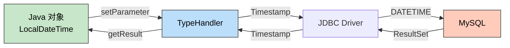

> 🎯 **一句话定位**：当 MyBatis Plus 默认的 LocalDateTime 映射失效时，用 @PostConstruct 手动注册 TypeHandler 是最可靠的解法。

> 💡 **核心理念**：理解 TypeHandler 的注册时机和生效范围，比复制代码更重要。

---

## 📖 3分钟速览版

<details>
<summary><strong>📊 点击展开核心方案</strong></summary>

### 🔌 TypeHandler 调用链



### 💎 核心代码（最精简版）

```java
@Component
public class TypeHandlerRegistrar {

    @Autowired
    private SqlSessionFactory sqlSessionFactory;

    @PostConstruct
    public void register() {
        TypeHandlerRegistry registry = sqlSessionFactory
            .getConfiguration().getTypeHandlerRegistry();
        registry.register(LocalDateTime.class,
            JdbcType.TIMESTAMP,
            new LocalDateTimeTypeHandler());
    }
}
```

### 🎯 什么时候需要手动注册？

| 场景 | 默认注册生效？ | 需要手动注册？ |
|------|--------------|--------------|
| 标准单数据源 | ✅ | ❌ |
| 自定义 SqlSessionFactory Bean | ❌ | ✅ |
| 多数据源配置 | ❌ | ✅ |
| 低版本 MyBatis Plus（< 3.1） | ❌ | ✅ |
| 使用 Sharding-JDBC | ❌ | ✅ |

</details>

---

## 🧠 深度剖析版

## 1. 问题背景

### 1.1 Java 日期类型的演变

| 阶段 | Java 类型 | JDBC 类型 | 问题 |
|------|----------|----------|------|
| JDK 1.0 | `java.util.Date` | `java.sql.Date` | 可变对象、线程不安全 |
| JDK 1.1 | `java.sql.Timestamp` | `java.sql.Timestamp` | 继承 Date 的所有问题 |
| JDK 8+ | `java.time.LocalDateTime` | 需要 TypeHandler 桥接 | **JDBC 原生不支持** |

**关键事实**：JDBC 4.2 规范才正式支持 `java.time` 类型，但 MyBatis 的 TypeHandler 层需要显式桥接。

### 1.2 常见报错

```text
// 报错 1：无法找到 TypeHandler
org.apache.ibatis.type.TypeException:
  Could not set parameters for mapping:
  No TypeHandler found for parameter of type 'java.time.LocalDateTime'

// 报错 2：类型转换异常
java.lang.ClassCastException:
  java.sql.Timestamp cannot be cast to java.time.LocalDateTime

// 报错 3：时区错乱（数据库存的是 UTC，读出来是 UTC+8 或反之）
Expected: 2026-03-23T10:00:00
Actual:   2026-03-23T02:00:00
```

### 1.3 MyBatis Plus 默认注册为何失效？

MyBatis Plus 在 3.1+ 版本的 `MybatisSqlSessionFactoryBean` 中自动注册了 `LocalDateTimeTypeHandler`。但以下场景会覆盖默认行为：

#### 场景一：自定义 SqlSessionFactory Bean

```java
// 你写了这个，MyBatis Plus 的自动配置就被跳过了
@Bean
public SqlSessionFactory sqlSessionFactory(DataSource dataSource)
    throws Exception {
    MybatisSqlSessionFactoryBean factory =
        new MybatisSqlSessionFactoryBean();
    factory.setDataSource(dataSource);
    // 如果这里没有手动注册 TypeHandler，就丢失了默认注册
    return factory.getObject();
}
```

#### 场景二：多数据源配置

```java
@Bean("primarySqlSessionFactory")
public SqlSessionFactory primarySqlSessionFactory(
    @Qualifier("primaryDataSource") DataSource dataSource)
    throws Exception {
    // 每个 SqlSessionFactory 需要独立注册
    MybatisSqlSessionFactoryBean factory =
        new MybatisSqlSessionFactoryBean();
    factory.setDataSource(dataSource);
    return factory.getObject();
}
```

这些场景中，开发者自定义的 Bean 替代了 MyBatis Plus 的自动配置，导致内置的 TypeHandler 注册逻辑被跳过。

---

## 2. TypeHandler 原理

### 2.1 核心接口

```java
public interface TypeHandler<T> {

    // Java → JDBC：写入数据库时调用
    void setParameter(PreparedStatement ps, int i,
        T parameter, JdbcType jdbcType) throws SQLException;

    // JDBC → Java：读取结果时调用（三个重载方法）
    T getResult(ResultSet rs, String columnName) throws SQLException;
    T getResult(ResultSet rs, int columnIndex) throws SQLException;
    T getResult(CallableStatement cs, int columnIndex) throws SQLException;
}
```

### 2.2 BaseTypeHandler 模板

`BaseTypeHandler<T>` 处理了 null 检查，我们只需实现四个核心方法：

```java
import org.apache.ibatis.type.BaseTypeHandler;
import org.apache.ibatis.type.JdbcType;
import org.apache.ibatis.type.MappedJdbcTypes;
import org.apache.ibatis.type.MappedTypes;

import java.sql.CallableStatement;
import java.sql.PreparedStatement;
import java.sql.ResultSet;
import java.sql.SQLException;
import java.sql.Timestamp;
import java.time.LocalDateTime;

@MappedTypes(LocalDateTime.class)
@MappedJdbcTypes(JdbcType.TIMESTAMP)
public class LocalDateTimeTypeHandler
    extends BaseTypeHandler<LocalDateTime> {

    @Override
    public void setNonNullParameter(PreparedStatement ps,
        int i, LocalDateTime parameter, JdbcType jdbcType)
        throws SQLException {
        ps.setTimestamp(i, Timestamp.valueOf(parameter));
    }

    @Override
    public LocalDateTime getNullableResult(ResultSet rs,
        String columnName) throws SQLException {
        Timestamp timestamp = rs.getTimestamp(columnName);
        return timestamp != null ? timestamp.toLocalDateTime() : null;
    }

    @Override
    public LocalDateTime getNullableResult(ResultSet rs,
        int columnIndex) throws SQLException {
        Timestamp timestamp = rs.getTimestamp(columnIndex);
        return timestamp != null ? timestamp.toLocalDateTime() : null;
    }

    @Override
    public LocalDateTime getNullableResult(CallableStatement cs,
        int columnIndex) throws SQLException {
        Timestamp timestamp = cs.getTimestamp(columnIndex);
        return timestamp != null ? timestamp.toLocalDateTime() : null;
    }
}
```

---

## 3. 注册方式对比

### 3.1 方式一：@PostConstruct 手动注册（推荐）

适用于自定义 SqlSessionFactory 或多数据源场景。

```java
import org.apache.ibatis.session.SqlSessionFactory;
import org.apache.ibatis.type.JdbcType;
import org.apache.ibatis.type.TypeHandlerRegistry;

import javax.annotation.PostConstruct;
import java.time.LocalDate;
import java.time.LocalDateTime;
import java.time.LocalTime;

import org.springframework.beans.factory.annotation.Autowired;
import org.springframework.stereotype.Component;

@Component
public class MyBatisTypeHandlerRegistrar {

    @Autowired
    private SqlSessionFactory sqlSessionFactory;

    @PostConstruct
    public void registerTypeHandlers() {
        TypeHandlerRegistry registry = sqlSessionFactory
            .getConfiguration().getTypeHandlerRegistry();

        // 注册 LocalDateTime
        registry.register(LocalDateTime.class,
            JdbcType.TIMESTAMP,
            new LocalDateTimeTypeHandler());

        // 可选：注册 LocalDate 和 LocalTime
        registry.register(LocalDate.class,
            JdbcType.DATE,
            new org.apache.ibatis.type.LocalDateTypeHandler());
        registry.register(LocalTime.class,
            JdbcType.TIME,
            new org.apache.ibatis.type.LocalTimeTypeHandler());
    }
}
```

选择 @PostConstruct 的原因：

- Spring Bean 生命周期：构造 → 依赖注入 → `@PostConstruct` → 使用
- 在 `@PostConstruct` 时 `SqlSessionFactory` 已完成初始化，可以安全修改其 Configuration
- 早于任何 Mapper 调用，保证所有 SQL 执行都能找到 TypeHandler

### 3.2 方式二：MybatisSqlSessionFactoryBean 配置（标准做法）

```java
@Bean
public SqlSessionFactory sqlSessionFactory(DataSource dataSource)
    throws Exception {
    MybatisSqlSessionFactoryBean factory =
        new MybatisSqlSessionFactoryBean();
    factory.setDataSource(dataSource);

    // 在 Factory Bean 中注册 TypeHandler
    factory.setTypeHandlers(new TypeHandler[]{
        new LocalDateTimeTypeHandler()
    });

    return factory.getObject();
}
```

### 3.3 方式三：application.yml 包扫描

```yaml
mybatis-plus:
  type-handlers-package: com.example.typehandler
```

需要确保 TypeHandler 类上标注了 `@MappedTypes` 和 `@MappedJdbcTypes` 注解。

### 3.4 方式四：@TableField 字段级注解

```java
@TableField(typeHandler = LocalDateTimeTypeHandler.class)
private LocalDateTime createdAt;
```

注意：字段级注解只影响 MyBatis Plus 自动生成的 SQL，手写的 XML SQL 不会生效。

### 3.5 四种方式对比

| 方式 | 全局生效 | XML SQL 生效 | 多数据源 | 推荐场景 |
|------|---------|-------------|---------|---------|
| @PostConstruct | ✅ | ✅ | 需每个 Factory 注册 | 自定义 Factory 场景 |
| Factory Bean 配置 | ✅ | ✅ | ✅ 各自配置 | 标准做法 |
| yml 包扫描 | ✅ | ✅ | ⚠️ 仅默认 Factory | 简单项目 |
| @TableField | ❌ 字段级 | ❌ | ❌ | 个别字段特殊处理 |

---

## 4. 多数据源场景

多数据源时，每个 `SqlSessionFactory` 有独立的 `TypeHandlerRegistry`，必须分别注册。

```java
@Component
public class MultiDsTypeHandlerRegistrar {

    @Autowired
    @Qualifier("primarySqlSessionFactory")
    private SqlSessionFactory primaryFactory;

    @Autowired
    @Qualifier("secondarySqlSessionFactory")
    private SqlSessionFactory secondaryFactory;

    @PostConstruct
    public void registerAll() {
        registerTypeHandlers(primaryFactory);
        registerTypeHandlers(secondaryFactory);
    }

    private void registerTypeHandlers(SqlSessionFactory factory) {
        TypeHandlerRegistry registry = factory
            .getConfiguration().getTypeHandlerRegistry();
        registry.register(LocalDateTime.class,
            JdbcType.TIMESTAMP,
            new LocalDateTimeTypeHandler());
    }
}
```

**更优雅的写法**：注入所有 SqlSessionFactory：

```java
@Component
public class AllDsTypeHandlerRegistrar {

    @Autowired
    private List<SqlSessionFactory> factories;

    @PostConstruct
    public void registerAll() {
        for (SqlSessionFactory factory : factories) {
            TypeHandlerRegistry registry = factory
                .getConfiguration().getTypeHandlerRegistry();
            registry.register(LocalDateTime.class,
                JdbcType.TIMESTAMP,
                new LocalDateTimeTypeHandler());
        }
    }
}
```

---

## 5. 验证与调试

### 5.1 确认 TypeHandler 已注册

```java
@Component
public class TypeHandlerChecker implements CommandLineRunner {

    @Autowired
    private SqlSessionFactory sqlSessionFactory;

    @Override
    public void run(String... args) {
        TypeHandlerRegistry registry = sqlSessionFactory
            .getConfiguration().getTypeHandlerRegistry();

        boolean hasHandler = registry.hasTypeHandler(
            LocalDateTime.class, JdbcType.TIMESTAMP);

        System.out.println(
            "LocalDateTime TypeHandler registered: " + hasHandler);
    }
}
```

### 5.2 单元测试

```java
@SpringBootTest
class LocalDateTimeTypeHandlerTest {

    @Autowired
    private UserMapper userMapper;

    @Test
    void testInsertAndQuery() {
        User user = new User();
        user.setName("test");
        user.setCreatedAt(LocalDateTime.of(2026, 3, 23, 10, 0, 0));

        userMapper.insert(user);

        User result = userMapper.selectById(user.getId());
        assertNotNull(result.getCreatedAt());
        assertEquals(
            LocalDateTime.of(2026, 3, 23, 10, 0, 0),
            result.getCreatedAt()
        );
    }
}
```

---

## 6. 时区最佳实践

### 6.1 推荐配置

```yaml
spring:
  datasource:
    url: jdbc:mysql://host:3306/db?serverTimezone=Asia/Shanghai&useUnicode=true&characterEncoding=utf8mb4
```

```bash
# JVM 启动参数
java -Duser.timezone=Asia/Shanghai -jar app.jar
```

```sql
-- MySQL 全局时区
SET GLOBAL time_zone = '+08:00';
```

**三层时区保持一致**：JVM、JDBC 连接串、MySQL 服务器都设为 `Asia/Shanghai`。

### 6.2 LocalDateTime vs ZonedDateTime vs OffsetDateTime

| 类型 | 含时区信息 | 适用场景 |
|------|----------|---------|
| `LocalDateTime` | ❌ | 单时区系统（国内项目首选） |
| `ZonedDateTime` | ✅ 完整时区 | 跨时区系统（国际化业务） |
| `OffsetDateTime` | ✅ 偏移量 | API 层传输（ISO 8601 格式） |

**建议**：国内项目统一使用 `LocalDateTime` + 固定 `Asia/Shanghai` 时区。跨时区场景考虑 `OffsetDateTime`。

---

## 💬 常见问题（FAQ）

### Q1: MyBatis Plus 不是已经内置了 LocalDateTimeTypeHandler 吗？

是的，MyBatis Plus 3.1+ 在 `MybatisSqlSessionFactoryBean` 中自动注册了 JSR-310 相关 TypeHandler。但如果你的项目中自定义了 `SqlSessionFactory` Bean（如多数据源、自定义插件配置等），Spring 的自动配置会被覆盖，内置注册逻辑不再执行。这是最常见的"明明版本够高但还是报错"的原因。

### Q2: @PostConstruct 和 InitializingBean.afterPropertiesSet() 哪个更好？

功能上等价，都在依赖注入完成后执行。区别：

- `@PostConstruct`：JSR-250 标准注解，代码更简洁
- `InitializingBean`：Spring 原生接口，不依赖 `javax.annotation`
- 在 Spring Boot 3.x（Jakarta EE）中，`@PostConstruct` 已迁移到 `jakarta.annotation.PostConstruct`

推荐：Spring Boot 项目用 `@PostConstruct`，纯 Spring 框架项目可用 `InitializingBean`。

### Q3: @TableField(typeHandler) 和全局注册行为为什么不同？

`@TableField(typeHandler = Xxx.class)` 只影响 MyBatis Plus **自动生成的 SQL**（如 `selectById`、`insert` 等 BaseMapper 方法）。手动编写的 XML Mapper SQL 不会读取 `@TableField` 注解，必须在 XML 中显式指定 `typeHandler` 或依赖全局注册。

### Q4: 升级到 MyBatis Plus 3.5+ 后还需要手动注册吗？

如果你没有自定义 `SqlSessionFactory` Bean，直接使用 MyBatis Plus 自动配置，则 **不需要手动注册**，框架已经处理好了。但如果有自定义 Factory，无论什么版本都需要手动注册。

### Q5: 时区问题应该在 TypeHandler 里处理还是在连接配置里处理？

在 JDBC 连接配置里处理（`serverTimezone=Asia/Shanghai`）。TypeHandler 应该只做 `LocalDateTime ↔ Timestamp` 的纯类型转换，不应该承担时区转换的职责。时区转换放在 TypeHandler 中会导致逻辑耦合，且无法通过配置灵活调整。

---

## ✨ 总结

### 核心要点

1. **MyBatis Plus 默认注册 TypeHandler 会在自定义 SqlSessionFactory 时失效**，这是绝大多数 LocalDateTime 映射问题的根因
2. **@PostConstruct 手动注册是最通用的解法**，适用于单数据源和多数据源场景
3. **时区一致性比 TypeHandler 更重要**：JVM、JDBC、MySQL 三层保持同一时区

### 行动建议

**今天就可以做的**：

- 检查项目中是否有自定义 `SqlSessionFactory` Bean，如果有，确认 TypeHandler 注册是否完整
- 确认 JDBC 连接串中 `serverTimezone` 参数与 MySQL 服务器时区一致

**本周可以完成的**：

- 添加 `CommandLineRunner` 检查 TypeHandler 注册状态，作为启动自检项
- 编写 LocalDateTime 读写的集成测试

---

## 更新记录

| 版本 | 日期 | 说明 |
|------|------|------|
| v1.0 | 2026-03-23 | 初始版本 |
