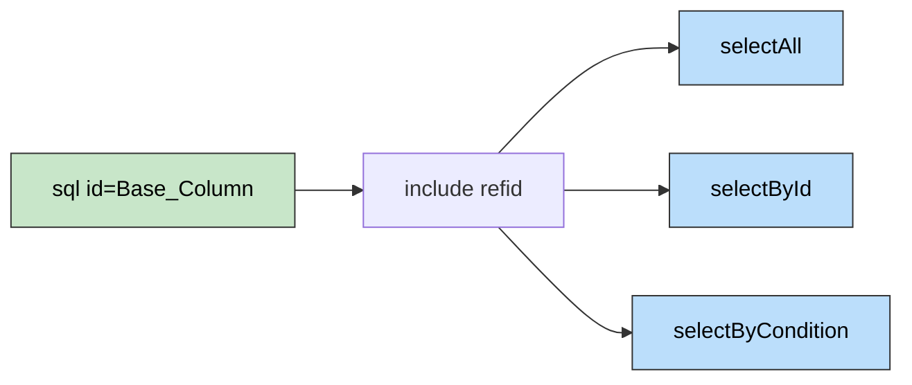

> 🎯 **一句话定位**：用 `<sql>` + `<include>` 实现 Mapper XML 中的 DRY 原则，告别复制粘贴式的 SQL 维护。

> 💡 **核心理念**：重复的 SQL 片段不是小问题——当字段名变更时，遗漏一处就是一个线上 bug。

---

## 📖 3分钟速览版

<details>
<summary><strong>📊 点击展开核心用法</strong></summary>

### 🔌 工作原理



### 💎 最常用的 3 个场景

1. **字段列表复用**：定义一次列名，所有 SELECT 语句共享
2. **条件过滤复用**：软删除、状态过滤等通用 WHERE 条件
3. **动态条件组合**：`<sql>` 内嵌 `<if>` 标签，按需拼接查询条件

### 🎯 注意事项速查

| 事项 | 说明 |
|------|------|
| 片段内可以用动态标签 | `<if>`、`<where>`、`<choose>` 都可以 |
| `${}` 有 SQL 注入风险 | 只用于列名/表名，不要用于值 |
| 跨 Namespace 引用 | 使用完整路径 `com.example.mapper.CommonMapper.片段id` |
| 每篇文章 Mermaid ≤ 3 张 | 遵循博客可视化规范 |

</details>

---

## 🧠 深度剖析版

## 1. 为什么需要 sql 标签

### 1.1 问题：Mapper XML 中的重复地狱

一个典型的 `UserMapper.xml` 中，以下 SQL 片段会反复出现：

```xml
<!-- 查询列表 -->
<select id="selectList" resultMap="BaseResultMap">
    SELECT id, name, email, status, created_at, updated_at
    FROM t_user
    WHERE deleted = 0
    ORDER BY created_at DESC
</select>

<!-- 按 ID 查询 -->
<select id="selectById" resultMap="BaseResultMap">
    SELECT id, name, email, status, created_at, updated_at
    FROM t_user
    WHERE id = #{id} AND deleted = 0
</select>

<!-- 按条件查询 -->
<select id="selectByCondition" resultMap="BaseResultMap">
    SELECT id, name, email, status, created_at, updated_at
    FROM t_user
    WHERE deleted = 0
    <if test="status != null">
        AND status = #{status}
    </if>
</select>
```

**问题**：字段列表 `id, name, email, status, created_at, updated_at` 和 `deleted = 0` 重复了 3 次。当新增字段 `phone` 时，需要改 3 处，遗漏一处就是 bug。

### 1.2 解决：DRY 原则

`<sql>` 标签定义可复用片段，`<include>` 引用——这就是 MyBatis XML 版的"提取方法"重构。

---

## 2. 基础语法

### 2.1 定义与引用

```xml
<!-- 定义可复用 SQL 片段 -->
<sql id="Base_Column_List">
    id, name, email, status, created_at, updated_at
</sql>

<!-- 在 SELECT 中引用 -->
<select id="selectAll" resultMap="BaseResultMap">
    SELECT <include refid="Base_Column_List"/>
    FROM t_user
</select>

<!-- 多处复用同一片段 -->
<select id="selectById" resultMap="BaseResultMap">
    SELECT <include refid="Base_Column_List"/>
    FROM t_user
    WHERE id = #{id}
</select>
```

**生成的 SQL**：

```sql
SELECT id, name, email, status, created_at, updated_at FROM t_user
SELECT id, name, email, status, created_at, updated_at FROM t_user WHERE id = ?
```

---

## 3. 核心场景一：字段过滤

### 3.1 列表页 vs 详情页使用不同字段

场景：`t_article` 表有一个 `content` 大字段（LONGTEXT），列表页不需要加载它。

```xml
<!-- 列表页字段：不含大字段 -->
<sql id="List_Column_List">
    id, title, author, status, summary, view_count, created_at
</sql>

<!-- 详情页字段：包含全部 -->
<sql id="Detail_Column_List">
    id, title, author, status, summary, content,
    view_count, created_at, updated_at
</sql>

<!-- 列表查询 -->
<select id="listArticles" resultMap="ListResultMap">
    SELECT <include refid="List_Column_List"/>
    FROM t_article
    WHERE deleted = 0
    ORDER BY created_at DESC
    LIMIT #{offset}, #{limit}
</select>

<!-- 详情查询 -->
<select id="getArticleDetail" resultMap="DetailResultMap">
    SELECT <include refid="Detail_Column_List"/>
    FROM t_article
    WHERE id = #{id} AND deleted = 0
</select>
```

### 3.2 过滤软删除条件

```xml
<!-- 通用软删除过滤 -->
<sql id="Not_Deleted">
    AND deleted = 0
</sql>

<!-- 使用 -->
<select id="selectActiveUsers" resultMap="BaseResultMap">
    SELECT <include refid="Base_Column_List"/>
    FROM t_user
    WHERE 1 = 1
    <include refid="Not_Deleted"/>
</select>
```

### 3.3 过滤特定状态值

```xml
<!-- 过滤指定状态 -->
<sql id="Active_Status_Filter">
    AND status IN ('ACTIVE', 'VERIFIED')
</sql>

<sql id="Exclude_Test_Data">
    AND email NOT LIKE '%@test.com'
    AND name NOT LIKE 'test_%'
</sql>

<!-- 组合使用 -->
<select id="selectRealActiveUsers" resultMap="BaseResultMap">
    SELECT <include refid="Base_Column_List"/>
    FROM t_user
    WHERE 1 = 1
    <include refid="Not_Deleted"/>
    <include refid="Active_Status_Filter"/>
    <include refid="Exclude_Test_Data"/>
</select>
```

---

## 4. 核心场景二：动态条件片段

### 4.1 结合 if 标签

```xml
<sql id="Base_Where">
    <if test="name != null and name != ''">
        AND name LIKE CONCAT('%', #{name}, '%')
    </if>
    <if test="status != null">
        AND status = #{status}
    </if>
    <if test="startDate != null">
        AND created_at &gt;= #{startDate}
    </if>
    <if test="endDate != null">
        AND created_at &lt;= #{endDate}
    </if>
    AND deleted = 0
</sql>

<select id="queryByCondition" resultMap="BaseResultMap">
    SELECT <include refid="Base_Column_List"/>
    FROM t_user
    <where>
        <include refid="Base_Where"/>
    </where>
    ORDER BY created_at DESC
</select>

<!-- 同样的条件用于计数 -->
<select id="countByCondition" resultType="long">
    SELECT COUNT(*)
    FROM t_user
    <where>
        <include refid="Base_Where"/>
    </where>
</select>
```

注意 XML 中的特殊字符转义：`<` 写作 `&lt;`，`>` 写作 `&gt;`，`&` 写作 `&amp;`。

### 4.2 结合 choose 标签

```xml
<sql id="Order_Clause">
    <choose>
        <when test="orderBy == 'name'">
            ORDER BY name
        </when>
        <when test="orderBy == 'date'">
            ORDER BY created_at
        </when>
        <otherwise>
            ORDER BY id
        </otherwise>
    </choose>
    <if test="orderDir == 'ASC'">ASC</if>
    <if test="orderDir != 'ASC'">DESC</if>
</sql>
```

---

## 5. 核心场景三：带参数的 sql 片段

### 5.1 使用 property 传参

`<include>` 可以通过 `<property>` 向片段传递参数，片段内用 `${propertyName}` 引用。

```xml
<!-- 定义通用分页排序片段 -->
<sql id="Pagination">
    ORDER BY ${orderColumn} ${orderDirection}
    LIMIT #{offset}, #{pageSize}
</sql>

<!-- 使用时传入参数 -->
<select id="listUsers" resultMap="BaseResultMap">
    SELECT <include refid="Base_Column_List"/>
    FROM t_user
    <where>
        <include refid="Base_Where"/>
    </where>
    <include refid="Pagination">
        <property name="orderColumn" value="created_at"/>
        <property name="orderDirection" value="DESC"/>
    </include>
</select>

<select id="listArticles" resultMap="ArticleResultMap">
    SELECT <include refid="List_Column_List"/>
    FROM t_article
    WHERE deleted = 0
    <include refid="Pagination">
        <property name="orderColumn" value="view_count"/>
        <property name="orderDirection" value="DESC"/>
    </include>
</select>
```

### 5.2 安全警告：${} vs #{}

在 `<property>` 中传递的值只能用 `${}` 引用（字符串替换），不能用 `#{}`（预编译参数）。

```xml
<!-- ⚠️ 列名/表名用 ${}（不可避免） -->
<sql id="DynamicOrder">
    ORDER BY ${column} ${direction}
</sql>

<!-- ✅ 值参数用 #{}（防 SQL 注入） -->
<sql id="StatusFilter">
    AND status = #{status}
</sql>
```

**安全原则**：`${}` 只用于列名、表名等结构性元素，且必须确保值来源可控（枚举白名单校验），绝不能直接接收用户输入。

```java
// Java 层做白名单校验
private static final Set<String> ALLOWED_COLUMNS =
    Set.of("id", "name", "created_at", "status");

public void validateOrderColumn(String column) {
    if (!ALLOWED_COLUMNS.contains(column)) {
        throw new IllegalArgumentException(
            "Invalid order column: " + column);
    }
}
```

---

## 6. 跨 Namespace 引用

### 6.1 定义公共 Mapper

```xml
<!-- CommonMapper.xml -->
<mapper namespace="com.example.mapper.CommonMapper">

    <sql id="soft_delete_condition">
        AND deleted = 0
    </sql>

    <sql id="audit_columns">
        created_by, created_at, updated_by, updated_at
    </sql>

    <sql id="tenant_filter">
        AND tenant_id = #{tenantId}
    </sql>

</mapper>
```

### 6.2 在其他 Mapper 中引用

```xml
<!-- UserMapper.xml -->
<mapper namespace="com.example.mapper.UserMapper">

    <select id="selectActiveUsers" resultMap="BaseResultMap">
        SELECT id, name, email,
            <include refid="com.example.mapper.CommonMapper.audit_columns"/>
        FROM t_user
        WHERE 1 = 1
        <include refid="com.example.mapper.CommonMapper.soft_delete_condition"/>
        <include refid="com.example.mapper.CommonMapper.tenant_filter"/>
    </select>

</mapper>
```

### 6.3 最佳实践

```text
src/main/resources/mapper/
├── CommonMapper.xml       ← 公共 SQL 片段
├── UserMapper.xml
├── ArticleMapper.xml
└── OrderMapper.xml
```

- `CommonMapper` 只定义 `<sql>` 片段，不定义查询语句
- 对应的 `CommonMapper.java` 接口可以为空（仅为了让 MyBatis 扫描到 XML）

```java
// 空接口，仅为了让 MyBatis 加载 CommonMapper.xml
@Mapper
public interface CommonMapper {
}
```

---

## 7. 与 MyBatis Plus 结合

### 7.1 什么时候用 xml sql 标签

| 场景 | 推荐方式 | 说明 |
|------|---------|------|
| 简单 CRUD | MyBatis Plus BaseMapper | 零 XML |
| 单表条件查询 | LambdaQueryWrapper | 类型安全 |
| 复杂多表 JOIN | XML + sql 标签 | 灵活度高 |
| 报表统计 SQL | XML + sql 标签 | SQL 可读性好 |
| 通用过滤条件 | XML sql 标签 | 跨查询复用 |

### 7.2 Wrapper 与 XML 的协作

```java
// Wrapper 方式：简单查询
List<User> users = userMapper.selectList(
    new LambdaQueryWrapper<User>()
        .eq(User::getStatus, "ACTIVE")
        .orderByDesc(User::getCreatedAt)
);

// XML 方式：复杂查询（复用 sql 片段）
List<UserDTO> users = userMapper.selectWithDepartment(params);
```

```xml
<!-- 复杂查询用 XML，复用公共片段 -->
<select id="selectWithDepartment" resultMap="UserDeptResultMap">
    SELECT
        u.id, u.name, u.email,
        d.name AS dept_name
    FROM t_user u
    LEFT JOIN t_department d ON u.dept_id = d.id
    <where>
        <include refid="Base_Where"/>
        <include refid="com.example.mapper.CommonMapper.soft_delete_condition"/>
    </where>
    ORDER BY u.created_at DESC
</select>
```

---

## 8. 完整 Mapper 示例

综合运用所有技巧的 `UserMapper.xml`：

```xml
<?xml version="1.0" encoding="UTF-8"?>
<!DOCTYPE mapper PUBLIC "-//mybatis.org//DTD Mapper 3.0//EN"
    "http://mybatis.org/dtd/mybatis-3-mapper.dtd">

<mapper namespace="com.example.mapper.UserMapper">

    <!-- ==================== SQL 片段定义 ==================== -->

    <!-- 基础字段列表 -->
    <sql id="Base_Column_List">
        id, name, email, phone, status, created_at, updated_at
    </sql>

    <!-- 列表字段（排除大字段） -->
    <sql id="List_Column_List">
        id, name, email, status, created_at
    </sql>

    <!-- 通用查询条件 -->
    <sql id="Base_Where">
        <if test="name != null and name != ''">
            AND name LIKE CONCAT('%', #{name}, '%')
        </if>
        <if test="email != null and email != ''">
            AND email = #{email}
        </if>
        <if test="status != null">
            AND status = #{status}
        </if>
        <if test="startDate != null">
            AND created_at &gt;= #{startDate}
        </if>
        <if test="endDate != null">
            AND created_at &lt;= #{endDate}
        </if>
        AND deleted = 0
    </sql>

    <!-- ==================== 查询语句 ==================== -->

    <!-- 列表查询 -->
    <select id="selectUserList" resultType="com.example.dto.UserListDTO">
        SELECT <include refid="List_Column_List"/>
        FROM t_user
        <where>
            <include refid="Base_Where"/>
        </where>
        ORDER BY created_at DESC
        LIMIT #{offset}, #{pageSize}
    </select>

    <!-- 详情查询 -->
    <select id="selectUserDetail" resultType="com.example.dto.UserDetailDTO">
        SELECT <include refid="Base_Column_List"/>
        FROM t_user
        WHERE id = #{id} AND deleted = 0
    </select>

    <!-- 条件计数 -->
    <select id="countByCondition" resultType="long">
        SELECT COUNT(*)
        FROM t_user
        <where>
            <include refid="Base_Where"/>
        </where>
    </select>

    <!-- 导出查询（带关联） -->
    <select id="selectForExport" resultType="com.example.dto.UserExportDTO">
        SELECT
            u.id, u.name, u.email, u.phone, u.status,
            d.name AS dept_name,
            u.created_at
        FROM t_user u
        LEFT JOIN t_department d ON u.dept_id = d.id
        <where>
            <include refid="Base_Where"/>
        </where>
        ORDER BY u.created_at DESC
    </select>

</mapper>
```

---

## 💬 常见问题（FAQ）

### Q1: sql 片段内可以写 if 动态标签吗？

可以。`<sql>` 片段内可以使用所有 MyBatis 动态 SQL 标签：`<if>`、`<where>`、`<choose>`、`<foreach>`、`<trim>` 等。片段在被 `<include>` 引用时，动态标签会正常解析执行。

### Q2: 如何在注解方式（@Select）中实现类似的复用？

注解方式不支持 `<sql>` / `<include>` 机制。替代方案：

```java
// 方式 1：定义常量
public class SqlConstants {
    public static final String BASE_COLUMNS =
        "id, name, email, status, created_at, updated_at";
}

// 方式 2：使用 @SelectProvider 动态拼接
@SelectProvider(type = UserSqlProvider.class, method = "selectByCondition")
List<User> selectByCondition(UserQuery query);
```

**建议**：涉及复用的 SQL 优先使用 XML 方式。

### Q3: 片段 id 命名有没有推荐规范？

推荐命名约定：

| 用途 | 命名模式 | 示例 |
|------|---------|------|
| 字段列表 | `Xxx_Column_List` | `Base_Column_List`, `List_Column_List` |
| WHERE 条件 | `Xxx_Where` / `Xxx_Filter` | `Base_Where`, `Status_Filter` |
| 排序规则 | `Xxx_Order` | `Default_Order` |
| 通用片段 | 小写下划线 | `soft_delete_condition` |

### Q4: include 中的 property 参数如何在片段内引用？

使用 `${propertyName}`（字符串替换），不能用 `#{}`。这是因为 `<property>` 是在 XML 解析阶段进行替换，早于 SQL 预编译阶段。

```xml
<sql id="OrderBy">
    ORDER BY ${column} ${direction}
</sql>

<include refid="OrderBy">
    <property name="column" value="created_at"/>
    <property name="direction" value="DESC"/>
</include>
```

### Q5: sql 标签支持嵌套引用吗？

支持。`<sql>` 内部可以 `<include>` 其他 `<sql>` 片段：

```xml
<sql id="soft_delete">AND deleted = 0</sql>

<sql id="active_user_filter">
    AND status = 'ACTIVE'
    <include refid="soft_delete"/>
</sql>
```

但要避免循环引用（A include B, B include A），MyBatis 会抛出 `IncompleteElementException`。

### Q6: MyBatis Plus 的 @TableField(exist = false) 和字段过滤有什么关系？

`@TableField(exist = false)` 标记的字段不参与 MyBatis Plus **自动生成的 SQL**（如 `selectById`），但与 XML 中的 `<sql>` 字段列表无关。XML 中的字段列表完全由开发者手动控制。两者是独立的机制，分别作用于自动 SQL 和手写 SQL。

---

## ✨ 总结

### 核心要点

1. **`<sql>` + `<include>` 是 Mapper XML 中消灭重复 SQL 的标准手段**，字段列表和通用条件是最高频的复用场景
2. **`<sql>` 片段内可以使用动态标签**（`<if>`, `<where>` 等），这使得条件复用成为可能
3. **跨 Namespace 引用需要完整路径**，适合抽取租户过滤、软删除等全局通用条件

### 行动建议

**今天就可以做的**：

- 检查项目中的 Mapper XML，找出重复出现 3 次以上的 SQL 片段
- 将字段列表和软删除条件抽取为 `<sql>` 片段

**本周可以完成的**：

- 创建 `CommonMapper.xml`，将跨 Mapper 的公共条件（租户过滤、软删除等）统一管理
- 建立团队的 `<sql>` 片段命名规范

---

## 更新记录

| 版本 | 日期 | 说明 |
|------|------|------|
| v1.0 | 2026-03-23 | 初始版本 |
