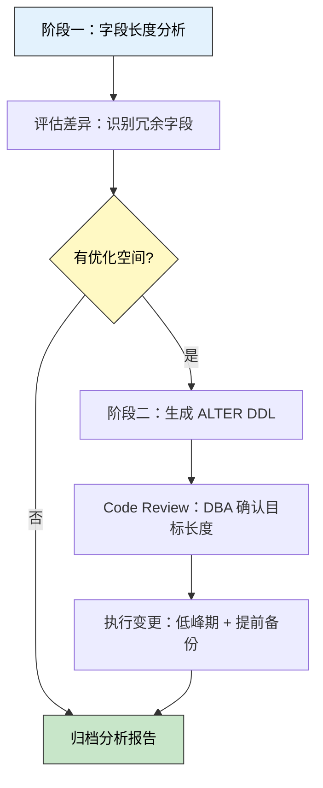

> 🎯 **一句话定位**：用两段 SQL，把「凭经验猜字段长度」变成「用数据说话」的线上表结构优化工作流。
>
> 💡 **核心理念**：先分析再变更，数据驱动 DDL，Review 后再执行。

---

## 📋 问题背景

### 业务场景

项目里有一套调度管理系统，demo_db 库下有 8 张业务表（dispatch_defect、dispatch_task 等）。建表阶段开发对实际数据长度没把握，字段长度普遍使用 VARCHAR(500) 这类「安全值」——上线运行半年后，想做一次系统化的表结构治理，把冗余的字段长度收口，同时补全缺失的字段注释。

### 痛点分析

- **冗余长度**：VARCHAR(500) 的字段实际最大值只有 50，浪费存储空间，也影响内存页估算
- **注释缺失**：历史字段大量缺少 COMMENT，后续维护和字段含义确认成本高
- **变更风险**：手工逐张表、逐个字段修改，容易遗漏或出错，且生成的 DDL 难以 Review

### 目标

对 8 张表的全部 VARCHAR / CHAR 字段完成量化分析，自动生成带字符集、NULL 约束、默认值和注释的完整 ALTER TABLE 语句，DBA 确认目标长度后统一执行变更。

> **注**：本文示例使用脱敏表名和库名（dispatch_*、demo_db），实际使用时请替换为真实环境的表名和库名。

---

## 🔄 整体工作流



两个阶段职责清晰：**阶段一只读不写**，从库执行安全；**阶段二生成草稿**，人工 Review 后再落地。

---

## 🔍 阶段一：字段长度分析

### 设计思路

借助 `information_schema.COLUMNS` 获取目标表的所有 VARCHAR / CHAR 字段，用 `GROUP_CONCAT` 动态拼接 `UNION ALL` 子查询，对每个字段分别计算 `MAX(LENGTH())` 和 `AVG(LENGTH())`，最后通过 `PREPARE / EXECUTE` 执行动态 SQL。

核心设计点：

- **GROUP_CONCAT 拼 SQL**：把「逐字段 SELECT」合并为一条 UNION ALL，减少与 MySQL 的交互次数
- **group_concat_max_len**：默认值仅 1024 字节，字段多时拼接出的 SQL 会被静默截断，须按需调大
- **FIND_IN_SET 过滤表名**：避免游标/WHILE 循环，一次性从 information_schema 读取所有目标字段
- **LENGTH() vs CHAR_LENGTH()**：`LENGTH()` 返回字节数，`CHAR_LENGTH()` 返回字符数；VARCHAR(n) 的 n 是字符数，严格对比时应换用 `CHAR_LENGTH()`，本文采用 `LENGTH()` 便于快速评估字节存储量，分析时注意 UTF-8 中文字符占 3 字节

### 完整存储过程

```sql
DROP PROCEDURE IF EXISTS sp_analyze_field_lengths;
DELIMITER $$

CREATE PROCEDURE sp_analyze_field_lengths(
    IN p_schema      VARCHAR(64),  -- 目标数据库名，如 'demo_db'
    IN p_tables      TEXT,         -- 逗号分隔的表名，如 'table_a,table_b'
    IN p_gc_max_len  INT           -- GROUP_CONCAT 最大长度，建议 1048576（1 MB）
)
BEGIN
    DECLARE v_sql LONGTEXT DEFAULT '';

    -- 1. 调大 GROUP_CONCAT 上限，避免大表/宽表场景下拼接 SQL 被截断
    SET SESSION group_concat_max_len = IFNULL(p_gc_max_len, 1048576);

    -- 2. 从 information_schema 读取目标字段，动态拼接 UNION ALL 查询
    --    结果集结构：tbl | col | dtype | def_len | max_len | avg_len
    SELECT GROUP_CONCAT(
        CONCAT(
            'SELECT ''', TABLE_NAME,  ''' AS `tbl`, ',
                   '''', COLUMN_NAME, ''' AS `col`, ',
                   '''', DATA_TYPE,   ''' AS `dtype`, ',
            IFNULL(CHARACTER_MAXIMUM_LENGTH, 'NULL'), ' AS `def_len`, ',
            'MAX(LENGTH(`',         COLUMN_NAME, '`))           AS `max_len`, ',
            'ROUND(AVG(LENGTH(`',   COLUMN_NAME, '`)), 1)       AS `avg_len` ',
            'FROM `', p_schema, '`.`', TABLE_NAME, '`'
        )
        ORDER BY TABLE_NAME, ORDINAL_POSITION
        SEPARATOR ' UNION ALL '
    )
    INTO v_sql
    FROM information_schema.COLUMNS
    WHERE TABLE_SCHEMA = p_schema
      AND FIND_IN_SET(TABLE_NAME, REPLACE(p_tables, ' ', ''))
      AND DATA_TYPE IN ('varchar', 'char', 'tinytext', 'text', 'mediumtext', 'longtext');

    -- 3. 加外层排序：def_len - max_len 差值最大的字段优先展示
    IF v_sql IS NULL OR v_sql = '' THEN
        SELECT '未找到目标字段，请检查 schema / 表名 / 字段类型' AS result;
    ELSE
        SET v_sql = CONCAT(
            'SELECT * FROM (', v_sql, ') t ',
            'ORDER BY (t.def_len - t.max_len) DESC, t.tbl, t.col'
        );
        SET @stmt = v_sql;
        PREPARE s FROM @stmt;
        EXECUTE s;
        DEALLOCATE PREPARE s;
    END IF;
END$$

DELIMITER ;
```

### 调用示例

```sql
-- 分析 demo_db 库下 8 张业务表的 varchar/char 字段
CALL sp_analyze_field_lengths(
    'demo_db',
    'dispatch_defect,dispatch_task,dispatch_plan,dispatch_log,dispatch_config,dispatch_record,dispatch_alarm,dispatch_worker',
    1048576
);
```

### 示例输出（节选）

```text
+------------------+-------------+---------+---------+---------+---------+
| tbl              | col         | dtype   | def_len | max_len | avg_len |
+------------------+-------------+---------+---------+---------+---------+
| dispatch_defect  | remark      | varchar |     500 |      48 |    15.2 |
| dispatch_defect  | address     | varchar |     500 |      63 |    28.7 |
| dispatch_task    | description | varchar |    1000 |     120 |    65.8 |
| dispatch_task    | task_name   | varchar |     500 |      45 |    22.5 |
| dispatch_defect  | handler     | varchar |     255 |      20 |    10.1 |
| dispatch_defect  | status_desc | varchar |     200 |      12 |     8.3 |
+------------------+-------------+---------+---------+---------+---------+
```

> **读图要点**：`def_len - max_len` 差值越大说明字段越冗余。`avg_len` 远低于 `max_len`（< 30%）进一步验证数据分布稀疏，可大幅缩减字段长度。

---

## 🔧 阶段二：批量生成 ALTER TABLE 语句

### 设计思路

完成字段长度评估后，需要生成**完整的 MODIFY COLUMN 语句**，保留原有字段的所有属性（字符集、NULL 约束、默认值、注释），只修改目标长度。

两个关键处理：

1. **注释占位符**：对 COLUMN_COMMENT 为空的字段自动填入 `【待补充注释】`，提醒 DBA 在执行前补全
2. **单引号转义**：COLUMN_COMMENT 或 COLUMN_DEFAULT 中可能含单引号，需用 `REPLACE(val, '''', '''''')` 转义为 `''`

### DDL 生成查询

```sql
-- 从 information_schema 读取字段元数据，生成完整 MODIFY COLUMN 语句
-- 使用前：将 CHARACTER_MAXIMUM_LENGTH 替换为阶段一分析得出的目标长度
SELECT
    c.TABLE_NAME                   AS `表名`,
    c.COLUMN_NAME                  AS `字段名`,
    c.CHARACTER_MAXIMUM_LENGTH     AS `当前长度`,
    CONCAT(
        'ALTER TABLE `', c.TABLE_NAME, '`',
        ' MODIFY COLUMN `', c.COLUMN_NAME, '` ',
        UPPER(c.DATA_TYPE), '(', c.CHARACTER_MAXIMUM_LENGTH, ')',
        -- 保留原有字符集与排序规则
        CASE c.CHARACTER_SET_NAME
            WHEN 'utf8mb4' THEN ' CHARACTER SET utf8mb4 COLLATE utf8mb4_unicode_ci'
            WHEN 'utf8'    THEN ' CHARACTER SET utf8 COLLATE utf8_general_ci'
            ELSE ''
        END,
        -- 保留 NULL / NOT NULL 约束
        IF(c.IS_NULLABLE = 'NO', ' NOT NULL', ' NULL'),
        -- 保留默认值（如有）；单引号内容需转义
        IF(c.COLUMN_DEFAULT IS NOT NULL,
            CONCAT(' DEFAULT ''', REPLACE(c.COLUMN_DEFAULT, '''', ''''''), ''''  ),
            ''),
        -- 保留或补充注释；空注释插入占位符提示补全
        ' COMMENT ''',
        IF(c.COLUMN_COMMENT IS NULL OR TRIM(c.COLUMN_COMMENT) = '',
            '【待补充注释】',
            REPLACE(c.COLUMN_COMMENT, '''', '''''')),
        ''';'
    ) AS `ALTER DDL`
FROM information_schema.COLUMNS c
WHERE c.TABLE_SCHEMA = 'demo_db'
  AND c.TABLE_NAME IN (
      'dispatch_defect',
      'dispatch_task',
      'dispatch_plan',
      'dispatch_log',
      'dispatch_config',
      'dispatch_record',
      'dispatch_alarm',
      'dispatch_worker'
  )
  AND c.DATA_TYPE IN ('varchar', 'char')
ORDER BY c.TABLE_NAME, c.ORDINAL_POSITION;
```

### 示例输出（节选）

```sql
ALTER TABLE `dispatch_defect` MODIFY COLUMN `remark` VARCHAR(100) CHARACTER SET utf8mb4 COLLATE utf8mb4_unicode_ci NULL COMMENT '备注信息';
ALTER TABLE `dispatch_defect` MODIFY COLUMN `address` VARCHAR(100) CHARACTER SET utf8mb4 COLLATE utf8mb4_unicode_ci NULL COMMENT '【待补充注释】';
ALTER TABLE `dispatch_defect` MODIFY COLUMN `handler` VARCHAR(32) CHARACTER SET utf8mb4 COLLATE utf8mb4_unicode_ci NULL COMMENT '处理人';
ALTER TABLE `dispatch_task` MODIFY COLUMN `task_name` VARCHAR(100) CHARACTER SET utf8mb4 COLLATE utf8mb4_unicode_ci NOT NULL COMMENT '任务名称';
ALTER TABLE `dispatch_task` MODIFY COLUMN `description` VARCHAR(200) CHARACTER SET utf8mb4 COLLATE utf8mb4_unicode_ci NULL DEFAULT '' COMMENT '任务描述';
```

### 字段长度档位建议

评估阶段一结果后，建议将 `max_len` 向上对齐到标准档位，预留合理余量：

| 实际 max_len | 建议目标长度 | 典型用途 |
|-------------|-------------|---------|
| ≤ 10        | 20          | 短编码、枚举值、状态标识 |
| ≤ 32        | 50          | 姓名、操作人、简短标签 |
| ≤ 64        | 100         | 地址、备注（短）、标题 |
| ≤ 128       | 200         | 描述信息、操作内容 |
| ≤ 256       | 500         | 长文本备注 |
| > 256       | 保持原值或改 TEXT | 超长字段考虑改用 TEXT 类型 |

---

## 🚧 生产实践

### 边界条件

- **空表处理**：`MAX(LENGTH())` 对空表返回 NULL，确认目标表有数据后再执行分析
- **大表扫描**：阶段一会全表扫描，建议在**从库**执行，避免影响主库性能
- **字符集注意**：`LENGTH()` 返回字节数，UTF-8 中文汉字占 3 字节；若字段主要存中文，建议换用 `CHAR_LENGTH()` 与 `CHARACTER_MAXIMUM_LENGTH` 对比

### 常见坑点

1. **GROUP_CONCAT 静默截断**

   - **现象**：存储过程执行无报错，但结果集不完整，部分表的字段缺失
   - **原因**：`group_concat_max_len` 默认 1024 字节，宽表（字段多）时拼接 SQL 超限被截断，MySQL 不报错只截断
   - **解决**：传入 `p_gc_max_len = 1048576`（1 MB），若表超过 200 个字段可再调大至 `4194304`

2. **单引号转义错误**

   - **现象**：生成的 ALTER DDL 执行时报 `You have an error in your SQL syntax`
   - **原因**：`COLUMN_COMMENT` 中含单引号（如"员工's 状态"），未正确转义
   - **解决**：使用 `REPLACE(col, '''', '''''')` 将 `'` 替换为 `''`；执行前人工检查含特殊字符的 COMMENT

3. **DEFAULT 函数值被字符串化**

   - **现象**：`create_time` 等时间字段执行 MODIFY 后 `DEFAULT CURRENT_TIMESTAMP` 变成字符串
   - **原因**：`information_schema` 中存储的 DEFAULT 为字符串，直接拼接后被加了引号
   - **解决**：本文只处理 `varchar / char` 类型，时间字段不在范围内；如需扩展，需对 `CURRENT_TIMESTAMP` 等函数值单独处理（不加引号）

### 最佳实践

- **从库分析**：阶段一全表扫描开销较大，优先在从库执行
- **逐表分批变更**：不要一次性执行所有 ALTER，按表逐批操作，每次变更后验证业务功能正常
- **备份先行**：执行 DDL 前确认有近期全量备份；大表建议用 `gh-ost` 或 `pt-online-schema-change` 做在线变更，避免长时间锁表
- **Review 必须人工完成**：生成的 DDL 是草稿，**长度目标值**需 DBA 结合阶段一分析数据和业务知识手动确认修改，不能无脑执行

---

## ✨ 总结

### 核心要点

1. **存储过程 + GROUP_CONCAT + PREPARE/EXECUTE** 是 MySQL 动态 SQL 分析的经典三件套，能够在单次调用中处理任意数量的表和字段，无需循环或游标
2. **information_schema.COLUMNS** 包含生成完整 MODIFY COLUMN 所需的全部元数据（字符集、NULL 约束、默认值、注释），不需要额外维护 schema 配置
3. **两阶段工作流**（分析只读 → 生成草稿 → Review → 执行）比一步到位更安全，任何环节都可以停下来检查，失误成本低

### 适用场景

- 上线运行一段时间后的系统性表结构治理
- 数据库迁移前的字段规范化（如从 Oracle 迁移到 MySQL）
- 新系统接手后对历史库做 Review 和存储优化

### 注意事项

- 本方法基于 MySQL 5.7+ 的 `information_schema`，MariaDB 行为有部分差异（如 `COLUMN_COMMENT` 处理）
- 含大量数据的生产表执行 `ALTER TABLE` 时建议使用在线 DDL 工具（gh-ost、pt-osc）
- 字段长度缩减属于**破坏性变更**，执行前务必通过 `SELECT MAX(CHAR_LENGTH(col))` 再次确认不存在超过目标长度的历史数据

---

## 更新记录

| 版本 | 日期 | 说明 |
|------|------|------|
| v1.0 | 2026-03-23 | 初始版本 |
