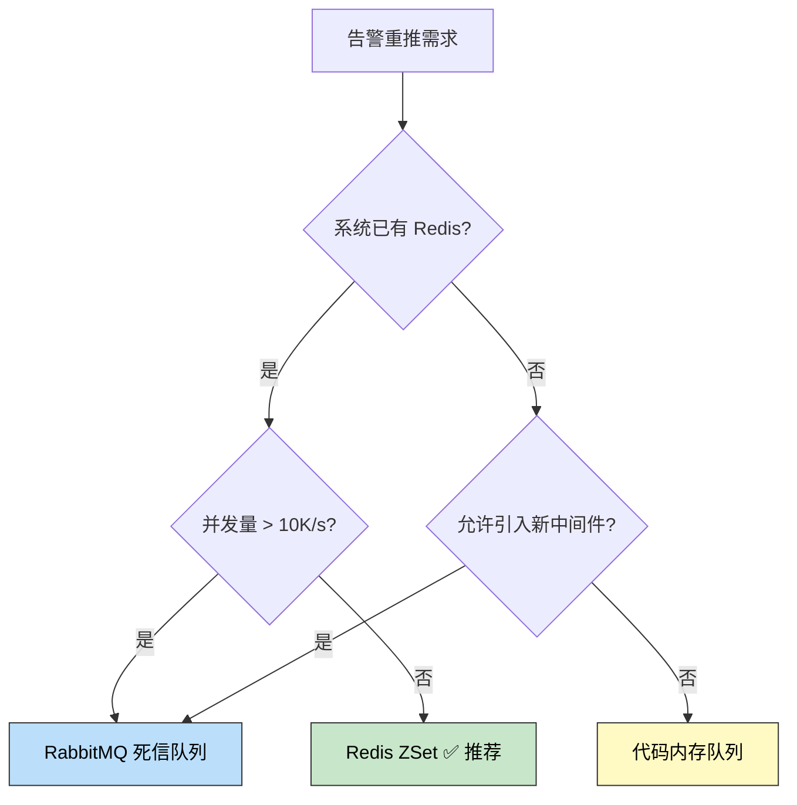

> 🎯 **一句话定位**：一个告警重推需求，三种方案对比，一次关于「只有最适合的架构，没有最好的架构」的实战思考。

> 💡 **核心理念**：架构设计不是秀技术栈，而是在约束条件下找到最小复杂度的解决方案。

---

## 📖 3分钟速览版

<details>
<summary><strong>📊 点击展开架构选型决策树</strong></summary>

### 🔌 三方案对比

| 维度 | 代码内存队列 | Redis ZSet | RabbitMQ 死信队列 |
|------|------------|-----------|-----------------|
| 实现复杂度 | ⭐ 低 | ⭐⭐ 中 | ⭐⭐⭐ 高 |
| 可靠性 | ❌ 进程重启丢失 | ✅ 持久化保障 | ✅ 消息确认机制 |
| 额外依赖 | 无 | Redis（已有） | **需新引入 MQ** |
| 集群支持 | ❌ 多节点重复推送 | ✅ 分布式锁 | ✅ 原生支持 |
| 适用规模 | 单机/开发环境 | 中小型生产环境 | 大型/高可靠场景 |
| 运维成本 | 无 | 低（复用已有 Redis） | 高（MQ 集群运维） |

### 🎯 决策结论



<details>
<summary>**🖼️ 插图版（2026-04-17 增量补充）**</summary>


</details>

**本文结论**：系统已有 Redis、并发量中等、不希望引入新中间件 → **Redis ZSet 是最优解**。

</details>

---

## 🧠 深度剖析版

## 1. 业务背景

### 1.1 需求描述

告警系统的核心流程：

1. 系统检测到异常，发出告警通知（短信/邮件/钉钉）
2. 运维人员在告警面板上**确认**告警
3. 如果 **N 分钟后仍未确认**，告警自动**重新推送**
4. 重推可能有多档：5 分钟、30 分钟、2 小时
5. 超过最大重试次数后升级告警（如通知上级）

### 1.2 技术约束

- **当前技术栈**：Spring Boot + MySQL + Redis（Lettuce）
- **未引入 MQ**：项目中没有 RabbitMQ/Kafka/RocketMQ
- **并发量**：中小型系统，告警量 < 1000 条/天，峰值 QPS < 100
- **可靠性要求**：告警不能丢失，但允许偶尔延迟（秒级精度即可）

### 1.3 核心问题

> 如何实现「到达指定时间后自动触发某个操作」？

这本质上是一个 **延时任务调度** 问题。

---

## 2. 方案一：代码内存队列

### 2.1 实现原理

使用 JDK 自带的 `DelayQueue` + 守护线程轮询。

### 2.2 代码实现

```java
import java.util.concurrent.DelayQueue;
import java.util.concurrent.Delayed;
import java.util.concurrent.TimeUnit;

public class AlertTask implements Delayed {

    private final String alertId;
    private final long triggerTime; // 触发时间戳（毫秒）

    public AlertTask(String alertId, long delayMs) {
        this.alertId = alertId;
        this.triggerTime = System.currentTimeMillis() + delayMs;
    }

    @Override
    public long getDelay(TimeUnit unit) {
        long diff = triggerTime - System.currentTimeMillis();
        return unit.convert(diff, TimeUnit.MILLISECONDS);
    }

    @Override
    public int compareTo(Delayed other) {
        return Long.compare(
            this.triggerTime,
            ((AlertTask) other).triggerTime
        );
    }

    public String getAlertId() {
        return alertId;
    }
}
```

```java
import java.util.concurrent.DelayQueue;

@Component
public class InMemoryAlertScheduler {

    private final DelayQueue<AlertTask> queue = new DelayQueue<>();

    @PostConstruct
    public void startConsumer() {
        Thread consumer = new Thread(() -> {
            while (!Thread.currentThread().isInterrupted()) {
                try {
                    AlertTask task = queue.take(); // 阻塞直到有到期任务
                    handleAlert(task.getAlertId());
                } catch (InterruptedException e) {
                    Thread.currentThread().interrupt();
                    break;
                }
            }
        }, "alert-delay-consumer");
        consumer.setDaemon(true);
        consumer.start();
    }

    public void schedule(String alertId, long delayMs) {
        queue.put(new AlertTask(alertId, delayMs));
    }

    private void handleAlert(String alertId) {
        // 查询告警是否已确认，未确认则重推
    }
}
```

### 2.3 优缺点分析

| 优点 | 缺点 |
|------|------|
| 零外部依赖 | **进程重启后队列丢失** |
| 实现简单，10 分钟搞定 | 集群部署时多节点重复调度 |
| 精度高（毫秒级） | 大量任务时内存压力大 |
| 适合开发/测试环境 | 无法跨 JVM 协调 |

**结论**：适合原型验证和单机开发环境，**不满足生产可靠性要求**。

---

## 3. 方案二：Redis ZSet 延时队列

### 3.1 核心原理

利用 ZSet 的 **score 有序性**：

- `score` = 任务触发时间戳
- `member` = 任务 ID
- 定时轮询 `ZRANGEBYSCORE`，取出所有 `score <= 当前时间` 的任务

### 3.2 完整实现

#### 任务入队

```java
@Service
public class AlertQueueService {

    private static final String QUEUE_KEY = "alert:delay:queue";

    @Autowired
    private StringRedisTemplate redisTemplate;

    /**
     * 将告警加入延时队列
     *
     * @param alertId  告警 ID
     * @param delayMs  延迟毫秒数
     */
    public void enqueue(String alertId, long delayMs) {
        double triggerTime = System.currentTimeMillis() + delayMs;
        redisTemplate.opsForZSet().add(QUEUE_KEY, alertId, triggerTime);
    }

    /**
     * 告警被确认时，从队列中移除
     */
    public void cancel(String alertId) {
        redisTemplate.opsForZSet().remove(QUEUE_KEY, alertId);
    }

    /**
     * 查询待处理任务数
     */
    public Long pendingCount() {
        return redisTemplate.opsForZSet().zCard(QUEUE_KEY);
    }
}
```

#### 定时消费（Lua 原子脚本）

```java
@Component
public class AlertScheduler {

    private static final String QUEUE_KEY = "alert:delay:queue";
    private static final String LOCK_KEY = "alert:scheduler:lock";

    @Autowired
    private StringRedisTemplate redisTemplate;

    @Autowired
    private AlertNotifyService notifyService;

    /**
     * Lua 脚本：原子性地取出到期任务并删除
     * 避免多节点重复消费
     */
    private static final String FETCH_AND_REMOVE_LUA =
        "local tasks = redis.call('ZRANGEBYSCORE', KEYS[1], '0', ARGV[1], 'LIMIT', 0, ARGV[2])\n" +
        "if #tasks > 0 then\n" +
        "    redis.call('ZREM', KEYS[1], unpack(tasks))\n" +
        "end\n" +
        "return tasks";

    private final DefaultRedisScript<List> fetchScript;

    public AlertScheduler() {
        this.fetchScript = new DefaultRedisScript<>();
        this.fetchScript.setScriptText(FETCH_AND_REMOVE_LUA);
        this.fetchScript.setResultType(List.class);
    }

    /**
     * 每 10 秒轮询一次，取出到期告警任务
     */
    @Scheduled(fixedDelay = 10_000)
    public void pollExpiredAlerts() {
        // 分布式锁：防止多节点同时消费
        Boolean locked = redisTemplate.opsForValue()
            .setIfAbsent(LOCK_KEY, "1", Duration.ofSeconds(30));
        if (!Boolean.TRUE.equals(locked)) {
            return; // 其他节点正在处理
        }

        try {
            String now = String.valueOf(System.currentTimeMillis());
            @SuppressWarnings("unchecked")
            List<String> alertIds = redisTemplate.execute(
                fetchScript,
                List.of(QUEUE_KEY),
                now, "50" // 每次最多取 50 条
            );

            if (alertIds != null && !alertIds.isEmpty()) {
                for (String alertId : alertIds) {
                    processAlert(alertId);
                }
            }
        } finally {
            redisTemplate.delete(LOCK_KEY);
        }
    }

    private void processAlert(String alertId) {
        try {
            // 查询告警是否已确认
            if (!notifyService.isAcknowledged(alertId)) {
                notifyService.resend(alertId);
            }
        } catch (Exception e) {
            // 处理失败，重新入队（延迟 60 秒重试）
            redisTemplate.opsForZSet().add(
                QUEUE_KEY,
                alertId,
                System.currentTimeMillis() + 60_000
            );
        }
    }
}
```

#### 启动类配置

```java
@SpringBootApplication
@EnableScheduling
public class AlertApplication {
    public static void main(String[] args) {
        SpringApplication.run(AlertApplication.class, args);
    }
}
```

### 3.3 可靠性分析

| 场景 | 表现 | 说明 |
|------|------|------|
| 进程重启 | ✅ 不丢失 | 任务在 Redis 中，重启后继续消费 |
| 多节点部署 | ✅ 不重复 | Lua 脚本原子取出 + 分布式锁 |
| Redis 宕机 | ⚠️ 取决于持久化 | AOF everysec 最多丢 1 秒数据 |
| 大量任务堆积 | ✅ 可控 | ZSet 内存占用小，百万级无压力 |

---

## 4. 方案三：RabbitMQ 死信队列

### 4.1 实现原理

利用 TTL（消息过期时间）+ Dead Letter Exchange（死信交换机）：

1. 告警消息发送到 `delay-queue`，设置 TTL = 延迟时间
2. 消息过期后，自动路由到死信交换机
3. 死信交换机转发到 `alert-process-queue`
4. 消费者从 `alert-process-queue` 取出并处理

### 4.2 配置示例

```java
@Configuration
public class RabbitAlertConfig {

    @Bean
    public Queue delayQueue() {
        Map<String, Object> args = new HashMap<>();
        args.put("x-dead-letter-exchange", "alert.dlx");
        args.put("x-dead-letter-routing-key", "alert.process");
        return new Queue("alert.delay.queue", true, false, false, args);
    }

    @Bean
    public DirectExchange deadLetterExchange() {
        return new DirectExchange("alert.dlx");
    }

    @Bean
    public Queue processQueue() {
        return new Queue("alert.process.queue");
    }

    @Bean
    public Binding dlxBinding() {
        return BindingBuilder
            .bind(processQueue())
            .to(deadLetterExchange())
            .with("alert.process");
    }
}
```

```java
@Service
public class RabbitAlertProducer {

    @Autowired
    private RabbitTemplate rabbitTemplate;

    public void scheduleAlert(String alertId, long delayMs) {
        rabbitTemplate.convertAndSend(
            "", "alert.delay.queue", alertId,
            message -> {
                message.getMessageProperties()
                    .setExpiration(String.valueOf(delayMs));
                return message;
            }
        );
    }
}
```

### 4.3 引入 MQ 的代价

这不只是加一个依赖的事：

| 代价项 | 具体影响 |
|--------|---------|
| 运维成本 | RabbitMQ 集群搭建、监控、Erlang 升级 |
| 学习曲线 | 团队需要理解交换机/绑定/死信/确认机制 |
| 故障域扩大 | MQ 宕机 = 所有依赖 MQ 的功能不可用 |
| 网络拓扑 | 新增端口开放、防火墙规则、VPC 配置 |
| 消息积压 | 需要处理消费者跟不上的场景 |
| 资源占用 | Erlang VM 内存开销大，至少 512MB 起步 |

---

## 5. 架构选型决策

### 5.1 决策核心：从需求出发

不要问「哪个技术最先进」，要问「哪个方案在当前约束下最合适」。

**当前约束条件**：

1. ✅ 系统已有 Redis（Lettuce 客户端，配置完善）
2. ❌ 未引入任何消息队列
3. 📊 告警量 < 1000 条/天，QPS < 100
4. 👥 团队 3-5 人，运维能力有限
5. ⏱️ 时间精度要求秒级即可

### 5.2 决策矩阵

| 决策因素 | 权重 | 代码队列 | ZSet | RabbitMQ |
|---------|------|---------|------|----------|
| 可靠性 | 30% | 2 | 8 | 10 |
| 实现成本 | 25% | 10 | 8 | 4 |
| 运维成本 | 20% | 10 | 9 | 3 |
| 扩展性 | 15% | 2 | 7 | 10 |
| 团队熟悉度 | 10% | 10 | 8 | 3 |
| **加权得分** | - | **6.3** | **8.0** | **6.1** |

加权得分显示，Redis ZSet 综合得分最高（8.0），是当前场景的最优选。

### 5.3 架构哲学：只有最适合的，没有最好的

**反面案例**：某创业团队 5 人，日活 1000，引入了 Kafka + Redis Cluster + ElasticSearch + K8s，运维占用了 40% 的开发时间，核心功能反而推进缓慢。

**正面案例**：某中型公司告警系统，用 Redis ZSet 跑了 2 年，日均处理 5000+ 告警任务，zero downtime。当业务量增长到 10 万级时再平滑迁移到 RocketMQ。

**核心原则**：

- **YAGNI (You Aren't Gonna Need It)**：不要为假想的未来需求引入复杂度
- **最小依赖原则**：每引入一个中间件，系统的故障域就增加一个
- **渐进式演进**：先用简单方案上线，有数据支撑后再升级

> 引入一个新中间件的成本 ≠ Maven 加一行依赖的成本。它等于：学习成本 + 运维成本 + 故障处理成本 + 团队认知负担，这些才是真正的技术债。

---

## 6. 生产注意事项

### 6.1 轮询间隔的选择

| 间隔 | 精度 | CPU 开销 | 适用场景 |
|------|------|---------|---------|
| 1 秒 | 高 | 中 | 秒级精度要求 |
| 5 秒 | 中 | 低 | 一般告警场景 |
| 10 秒 | 一般 | 极低 | 分钟级告警（推荐） |
| 30 秒 | 低 | 极低 | 非实时场景 |

### 6.2 ZSet Key 的管理

```java
// 按天分 Key，避免单个 ZSet 无限膨胀
String queueKey = "alert:delay:queue:" + LocalDate.now().format(
    DateTimeFormatter.ofPattern("yyyyMMdd")
);

// 定时清理过期 Key（凌晨清理前一天的 Key）
@Scheduled(cron = "0 0 3 * * ?")
public void cleanExpiredKeys() {
    String yesterday = LocalDate.now().minusDays(1).format(
        DateTimeFormatter.ofPattern("yyyyMMdd")
    );
    redisTemplate.delete("alert:delay:queue:" + yesterday);
}
```

### 6.3 Redis 宕机降级策略

```java
@Scheduled(fixedDelay = 10_000)
public void pollExpiredAlerts() {
    try {
        // 正常 ZSet 消费逻辑
        doPoll();
    } catch (RedisConnectionFailureException e) {
        log.error("Redis 连接失败，启用降级策略");
        // 降级：从 MySQL 查询未确认且超时的告警
        fallbackFromMySQL();
    }
}

private void fallbackFromMySQL() {
    List<Alert> expired = alertMapper.selectUnacknowledgedBefore(
        LocalDateTime.now().minusMinutes(5)
    );
    for (Alert alert : expired) {
        notifyService.resend(alert.getId());
    }
}
```

---

## 💬 常见问题（FAQ）

### Q1: ZSet 和 Redisson 的 RDelayedQueue 有什么区别？

Redisson 的 `RDelayedQueue` 底层也是基于 ZSet 实现的，封装了轮询、原子消费等逻辑。如果项目已引入 Redisson，可以直接使用：

```java
RBlockingQueue<String> blockingQueue = redisson.getBlockingQueue("alert-queue");
RDelayedQueue<String> delayedQueue = redisson.getDelayedQueue(blockingQueue);

// 入队
delayedQueue.offer("alert-123", 5, TimeUnit.MINUTES);

// 消费
String alertId = blockingQueue.take(); // 阻塞式
```

如果只用 Lettuce/Jedis，手动实现 ZSet 方案更轻量。

### Q2: 如何保证 ZSet 消费的幂等性？

告警重推本身应该是幂等的（发送通知这个动作可以重复）。但如果涉及状态变更，使用以下策略：

```java
private void processAlert(String alertId) {
    // 1. 先查询数据库中的告警状态
    Alert alert = alertMapper.selectById(alertId);
    if (alert == null || alert.isAcknowledged()) {
        return; // 已确认，跳过
    }
    // 2. CAS 更新状态，防止并发重复处理
    int updated = alertMapper.updateStatusCAS(
        alertId, AlertStatus.PENDING, AlertStatus.RESENDING
    );
    if (updated == 0) {
        return; // 已被其他线程处理
    }
    // 3. 执行重推
    notifyService.resend(alertId);
}
```

### Q3: 多节点部署时如何避免重复推送？

文章中的 Lua 脚本已经解决了这个问题：`ZRANGEBYSCORE` + `ZREM` 在同一个 Lua 脚本中原子执行，只有一个节点能成功取出任务。分布式锁是额外的保险层。

### Q4: 如果 Redis 宕机，告警任务会丢失吗？

取决于 Redis 持久化配置：

| 配置 | 数据安全 | 性能影响 |
|------|---------|---------|
| `appendonly yes` + `appendfsync everysec` | 最多丢 1 秒 | 低 |
| `appendonly yes` + `appendfsync always` | 不丢数据 | 高 |
| 仅 RDB | 可能丢几分钟 | 无 |

**建议**：AOF `everysec` + 定期 RDB 快照。对于告警场景，1 秒的数据丢失可接受。

### Q5: 什么情况下应该升级到 RabbitMQ？

当出现以下任一信号时，考虑升级：

- 告警量增长到 **日均 10 万条以上**
- 需要 **多消费者组**（不同告警类型由不同团队处理）
- 需要 **消息回溯/重放**（审计需求）
- 需要 **跨系统事件驱动**（告警触发工单、告警触发自动扩容等）
- Redis 内存压力大，ZSet 成为瓶颈

升级路径：ZSet 方案可以平滑过渡到 MQ——只需将入队逻辑从 `ZADD` 改为 `send()`，消费逻辑从轮询改为监听。

---

## ✨ 总结

### 核心要点

1. **延时任务不等于需要 MQ**：Redis ZSet 在中小型场景下完全够用，可靠性有保障
2. **引入新中间件的隐性成本远大于显性成本**：运维、学习、故障域扩大才是真正的代价
3. **架构决策应基于约束条件而非技术偏好**：当前规模 + 现有技术栈 + 团队能力 = 最适合的方案

### 行动建议

**今天就可以做的**：

- 评估当前系统是否有类似的延时任务需求（超时未支付取消、定时提醒等）
- 检查 Redis 是否已开启 AOF 持久化

**本周可以完成的**：

- 基于本文代码搭建一个 ZSet 延时队列的 demo
- 压测验证在目标并发量下的性能和可靠性

**长期持续改进的**：

- 监控 ZSet Key 的大小和消费延迟
- 制定从 ZSet 到 MQ 的升级触发条件和迁移方案

---

## 更新记录

| 版本 | 日期 | 说明 |
|------|------|------|
| v1.0 | 2026-03-23 | 初始版本 |
| v1.1 | 2026-04-17 | 为 1 个 Mermaid 图表追加 Chiikawa 风格插图（m2c-pipeline 生成） |
