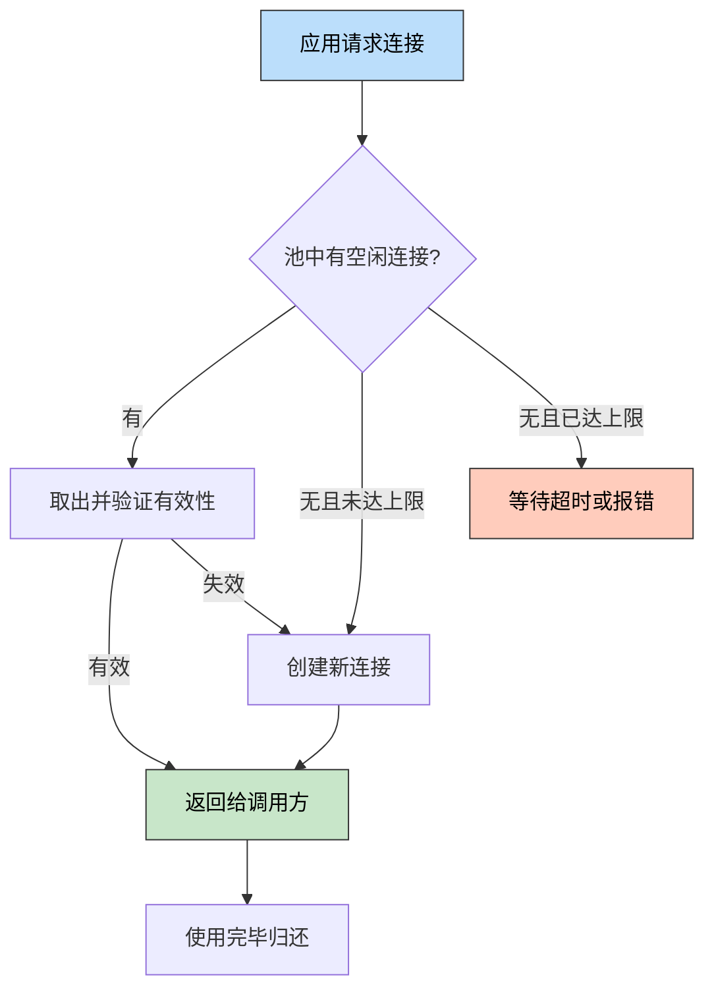
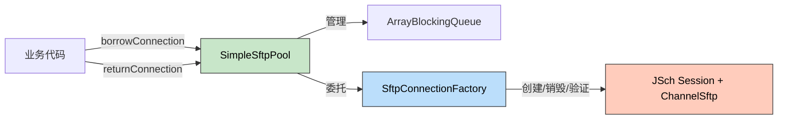
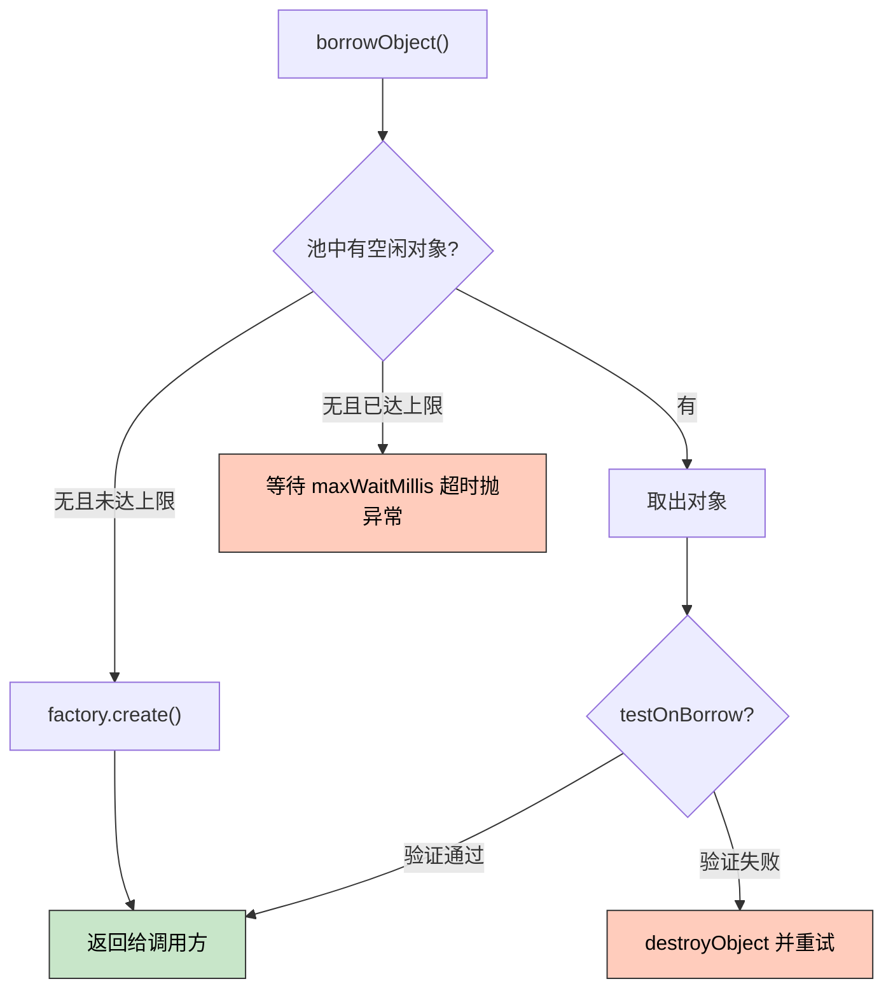

> 🎯 **一句话定位**：从手写 SFTP/FTP 连接池到使用 Commons Pool2，一步步看清"对象池"模式的本质——创建昂贵的资源，池化复用才是正解。
>
> 💡 **核心理念**：连接池不是"缓存连接"这么简单。创建、验证、回收、销毁、配置——五个环节缺一不可，理解了这五个环节，你就理解了所有连接池。

---

## 📖 3 分钟速览版

<details>
<summary><strong>📊 点击展开核心概念</strong></summary>

### 连接池生命周期



### 方案选型速查

| 方案 | 实现复杂度 | 连接验证 | 空闲回收 | 泄漏检测 | 监控 | 推荐场景 |
|------|-----------|---------|---------|---------|------|---------|
| 每次新建 | 极低 | — | — | — | — | 低频操作（<10 次/分钟） |
| 手动实现（BlockingQueue） | 低 | 需自己写 | 需自己写 | 无 | 无 | 学习理解/原型验证 |
| Apache Commons Pool2 | 中 | 内置 | 内置 | 内置 | JMX | **生产首选** |

### 连接池五要素

| 要素 | 说明 | 关键配置 |
|------|------|---------|
| 创建（Create） | 工厂负责新建底层连接 | `maxTotal`、`maxIdle` |
| 验证（Validate） | 借出/归还时检查连接可用性 | `testOnBorrow`、`testOnReturn` |
| 回收（Evict） | 定期清理长时间空闲连接 | `timeBetweenEvictionRunsMillis` |
| 销毁（Destroy） | 关闭连接释放底层资源 | 工厂的 `destroyObject` |
| 配置（Config） | 控制池容量和行为 | `maxWaitMillis`、`minIdle` |

</details>

---

## 🧠 深度剖析版

## 1. 为什么需要 SFTP/FTP 连接池

### 1.1 连接创建的真实开销

每次建立一个新的 SFTP 连接，底层需要经历：

1. **TCP 三次握手**：建立网络通道（局域网 1-5ms，跨网段 10-50ms）
2. **SSH 握手**：算法协商、密钥交换（最耗时，50-200ms）
3. **用户认证**：密码或密钥验证（10-30ms）
4. **Channel 打开**：在 Session 上打开 ChannelSftp（5-10ms）

**总计：一次 SFTP 连接建立通常需要 100-500ms。**

FTP 相比稍轻量，但也需要 TCP 握手 + 登录认证 + 被动模式协商，总耗时约 50-200ms。

对比 HTTP（Keep-Alive 下复用连接，几乎无额外开销）、Redis（TCP 复用，通常 <5ms），SFTP/FTP 的连接开销高出 1-2 个数量级。

### 1.2 高并发场景下的问题

典型业务场景：定时任务每分钟拉取 100 个报表文件，或 Web 接口按需向远端传文件。

如果每次操作都新建连接：

- **性能瓶颈**：100 个文件 × 200ms 建连时间 = 额外 20 秒纯等待
- **连接数暴涨**：并发请求下同时开启大量 SSH Session，打满服务端的 `MaxSessions`（默认 10）
- **资源泄漏风险**：异常时未关闭连接，连接数持续累积

> 在之前的 [运维速查：Linux SFTP 配置 / Java FTP 操作](./2023-03-03-ops-quick-reference.md) 中，FTP 工具类的改进建议里提到了"高并发场景下使用连接池管理 FTPClient 实例"。本文就是对这个改进方向的完整实践。

### 1.3 连接池的目标

- 连接复用，避免重复建立/断开
- 控制最大连接数，保护服务端（不超过 `MaxSessions` 限制）
- 自动检测并回收失效连接

---

## 2. 方案对比

| 方案 | 核心思路 | 优点 | 缺点 | 适用场景 |
|------|---------|------|------|---------|
| 每次新建连接 | 用完即关，下次重建 | 实现最简 | 性能差，开销大 | 低频操作（<10 次/分钟） |
| 全局单连接 + synchronized | 一个连接全局共用 | 零连接开销 | 并发瓶颈，单点故障 | 单线程顺序操作 |
| 手动连接池（BlockingQueue） | 固定大小队列管理连接 | 简单易懂，无额外依赖 | 缺少验证/回收/泄漏检测 | 学习理解、原型验证 |
| Apache Commons Pool2 | GenericObjectPool + PooledObjectFactory | 功能完整，生产久经验证 | 引入依赖 | **生产环境首选** |

**推荐策略**：先手动实现理解原理，再用 Commons Pool2 获得生产级能力。

---

## 3. 手动实现 SFTP 连接池

### 3.1 设计思路



核心设计：

- `SftpConnectionFactory`：负责创建、验证、销毁底层连接（封装 JSch 细节）
- `SimpleSftpPool`：基于 `ArrayBlockingQueue` 管理连接实例，提供 borrow/return 接口
- 业务代码：只关心"借连接、用连接、还连接"

### 3.2 连接工厂

Maven 依赖：

```xml
<dependency>
    <groupId>com.jcraft</groupId>
    <artifactId>jsch</artifactId>
    <version>0.1.55</version>
</dependency>
```

```java
import com.jcraft.jsch.Channel;
import com.jcraft.jsch.ChannelSftp;
import com.jcraft.jsch.JSch;
import com.jcraft.jsch.JSchException;
import com.jcraft.jsch.Session;

public class SftpConnectionFactory {

    private final String host;
    private final int port;
    private final String username;
    private final String password;
    private final int connectTimeoutMs;

    public SftpConnectionFactory(String host, int port,
                                  String username, String password,
                                  int connectTimeoutMs) {
        this.host = host;
        this.port = port;
        this.username = username;
        this.password = password;
        this.connectTimeoutMs = connectTimeoutMs;
    }

    /** 创建一个新的 SFTP Channel */
    public ChannelSftp create() throws JSchException {
        JSch jsch = new JSch();
        Session session = jsch.getSession(username, host, port);
        session.setPassword(password);
        session.setConfig("StrictHostKeyChecking", "no");
        // 客户端主动发心跳，避免服务端因空闲超时断开 Session
        session.setServerAliveInterval(60_000);
        session.connect(connectTimeoutMs);

        Channel channel = session.openChannel("sftp");
        channel.connect(connectTimeoutMs);
        return (ChannelSftp) channel;
    }

    /** 验证连接是否仍然可用 */
    public boolean validate(ChannelSftp channel) {
        try {
            return channel != null
                    && channel.isConnected()
                    && channel.getSession().isConnected();
        } catch (JSchException e) {
            return false;
        }
    }

    /** 销毁连接，释放底层资源 */
    public void destroy(ChannelSftp channel) {
        if (channel == null) return;
        try {
            Session session = channel.getSession();
            channel.disconnect();
            if (session != null) session.disconnect();
        } catch (JSchException ignored) {
        }
    }
}
```

### 3.3 简易连接池

```java
import com.jcraft.jsch.ChannelSftp;
import com.jcraft.jsch.JSchException;
import java.util.concurrent.ArrayBlockingQueue;
import java.util.concurrent.TimeUnit;

public class SimpleSftpPool {

    private final ArrayBlockingQueue<ChannelSftp> pool;
    private final SftpConnectionFactory factory;

    public SimpleSftpPool(SftpConnectionFactory factory, int maxSize, int minIdle)
            throws JSchException {
        this.factory = factory;
        this.pool = new ArrayBlockingQueue<>(maxSize);

        // 预热：提前创建 minIdle 个连接
        for (int i = 0; i < minIdle; i++) {
            pool.offer(factory.create());
        }
    }

    /**
     * 借出一个连接，等待超时则抛出异常
     *
     * @param timeout 等待超时时间
     * @param unit    时间单位
     */
    public ChannelSftp borrowConnection(long timeout, TimeUnit unit)
            throws InterruptedException, JSchException {
        ChannelSftp channel = pool.poll(timeout, unit);
        if (channel == null) {
            throw new JSchException("Connection pool exhausted, no connection available within timeout");
        }
        // 验证连接有效性，失效则重建
        if (!factory.validate(channel)) {
            factory.destroy(channel);
            channel = factory.create();
        }
        return channel;
    }

    /**
     * 归还连接到池中
     *
     * @param channel 要归还的连接
     */
    public void returnConnection(ChannelSftp channel) {
        if (channel == null) return;
        if (factory.validate(channel)) {
            // 连接有效则放回队列；队列已满则直接销毁
            if (!pool.offer(channel)) {
                factory.destroy(channel);
            }
        } else {
            // 连接已失效，直接销毁
            factory.destroy(channel);
        }
    }

    /** 关闭连接池，销毁所有连接 */
    public void close() {
        ChannelSftp channel;
        while ((channel = pool.poll()) != null) {
            factory.destroy(channel);
        }
    }
}
```

### 3.4 使用示例

```java
// 初始化（通常在 Spring @Bean 或应用启动时）
SftpConnectionFactory factory = new SftpConnectionFactory(
        "sftp.example.com", 22, "user", "password", 5000
);
SimpleSftpPool pool = new SimpleSftpPool(factory, 10, 3);

// 业务代码：借出连接使用后归还
ChannelSftp channel = null;
try {
    channel = pool.borrowConnection(5, TimeUnit.SECONDS);
    channel.put("/local/path/report.csv", "/remote/path/report.csv");
} finally {
    // 必须在 finally 中归还，否则发生连接泄漏
    pool.returnConnection(channel);
}
```

### 3.5 手动实现的局限性

手动实现帮你理解了连接池的基本运作，但存在明显短板：

- **无空闲回收**：长时间不用的连接不会被自动清理，服务端可能已单方面关闭
- **无泄漏检测**：忘记归还连接时无任何告警或自动回收机制
- **无后台健康检查**：只有借出时才验证，池中可能积压大量失效连接
- **无 JMX 监控**：无法在运行时观察活跃数、等待数等指标

这些问题在生产环境都可能酿成故障。**不建议直接将手动实现用于生产。**

---

## 4. Apache Commons Pool2 方案

### 4.1 添加依赖

```xml
<dependency>
    <groupId>org.apache.commons</groupId>
    <artifactId>commons-pool2</artifactId>
    <version>2.12.0</version>
</dependency>
<!-- JSch 同上 -->
```

### 4.2 实现 PooledObjectFactory

Commons Pool2 的核心是工厂接口，只需告诉它如何创建、验证、销毁对象：

```java
import com.jcraft.jsch.ChannelSftp;
import org.apache.commons.pool2.BasePooledObjectFactory;
import org.apache.commons.pool2.PooledObject;
import org.apache.commons.pool2.impl.DefaultPooledObject;

public class SftpPooledObjectFactory extends BasePooledObjectFactory<ChannelSftp> {

    private final SftpConnectionFactory connectionFactory;

    public SftpPooledObjectFactory(SftpConnectionFactory connectionFactory) {
        this.connectionFactory = connectionFactory;
    }

    @Override
    public ChannelSftp create() throws Exception {
        return connectionFactory.create();
    }

    @Override
    public PooledObject<ChannelSftp> wrap(ChannelSftp channel) {
        return new DefaultPooledObject<>(channel);
    }

    /** 归还或空闲检测时调用，返回 false 则触发销毁并重建 */
    @Override
    public boolean validateObject(PooledObject<ChannelSftp> p) {
        return connectionFactory.validate(p.getObject());
    }

    /** 从池中移除对象时调用，释放底层资源 */
    @Override
    public void destroyObject(PooledObject<ChannelSftp> p) {
        connectionFactory.destroy(p.getObject());
    }
}
```

### 4.3 配置和使用 GenericObjectPool



```java
import com.jcraft.jsch.ChannelSftp;
import org.apache.commons.pool2.impl.GenericObjectPool;
import org.apache.commons.pool2.impl.GenericObjectPoolConfig;

// 配置连接池参数
GenericObjectPoolConfig<ChannelSftp> config = new GenericObjectPoolConfig<>();
config.setMaxTotal(10);                               // 最大连接数
config.setMaxIdle(10);                                // 最大空闲连接数
config.setMinIdle(3);                                 // 最小空闲连接数（预热）
config.setMaxWaitMillis(5_000);                       // 借连接等待超时（ms）
config.setTestOnBorrow(true);                         // 借出时验证连接有效性
config.setTestWhileIdle(true);                        // 空闲时定期验证
config.setTimeBetweenEvictionRunsMillis(60_000);      // 空闲回收检查间隔（ms）
config.setMinEvictableIdleTimeMillis(300_000);        // 空闲超过 5 分钟则回收

// 创建连接池
SftpConnectionFactory connectionFactory = new SftpConnectionFactory(
        "sftp.example.com", 22, "user", "password", 5000
);
SftpPooledObjectFactory pooledFactory = new SftpPooledObjectFactory(connectionFactory);
GenericObjectPool<ChannelSftp> sftpPool = new GenericObjectPool<>(pooledFactory, config);

// 业务代码：借还必须配对
ChannelSftp channel = sftpPool.borrowObject();
try {
    channel.put("/local/report.csv", "/remote/report.csv");
} finally {
    sftpPool.returnObject(channel);
}
```

### 4.4 FTP 连接池的差异

FTP 使用 `FTPClient`（Apache Commons Net），与 SFTP 的工厂实现类似，主要差异在底层连接方式：

```java
// FTPClient 工厂的 create() 实现示例
public FTPClient create() throws Exception {
    FTPClient client = new FTPClient();
    client.connect(host, port);
    if (!client.login(username, password)) {
        throw new IOException("FTP login failed");
    }
    client.enterLocalPassiveMode(); // 被动模式（穿防火墙必须开启）
    client.setFileType(FTP.BINARY_FILE_TYPE);
    return client;
}

// validate() 实现示例：发送 NOOP 命令探测连接
public boolean validate(FTPClient client) {
    try {
        return client != null && client.isConnected() && client.sendNoOp();
    } catch (IOException e) {
        return false;
    }
}
```

其余的池管理逻辑与 SFTP 版本完全一致——这正是对象池模式的价值所在：把资源管理逻辑和具体连接类型彻底解耦。

---

## 5. 深度反思：连接池的通用设计模式

### 5.1 对象池模式（Object Pool Pattern）

连接池是**对象池模式**的典型应用：对于创建开销大、数量受限的资源，不在使用时创建销毁，而是预先创建放入"池"中，使用时借出、用完归还。

五个核心要素在所有连接池实现中都以不同形式体现：

| 要素 | 手动实现 | Commons Pool2 | HikariCP |
|------|---------|--------------|---------|
| 创建 | `factory.create()` 手动调用 | `PooledObjectFactory.create()` 自动触发 | `ConnectionFactory` |
| 验证 | `factory.validate()` 手动调用 | `validateObject()` 自动触发 | `SELECT 1` keepalive |
| 回收 | 无 | `Evictor` 后台线程 | 内置 evictor |
| 销毁 | `factory.destroy()` 手动调用 | `destroyObject()` 自动触发 | 自动关闭 |
| 配置 | 构造函数参数 | `GenericObjectPoolConfig` | `HikariConfig` |

### 5.2 与其他连接池的横向对比

| 对比维度 | SFTP/FTP 连接池 | HikariCP（数据库） | HttpClient（HTTP） | Jedis Pool（Redis） |
|---------|----------------|-----------------|------------------|-------------------|
| 底层协议 | SSH / FTP | TCP + DB 协议 | HTTP/HTTPS | TCP + RESP |
| 连接创建耗时 | 100-500ms | 10-50ms | 1-10ms | 1-5ms |
| 验证方式 | `isConnected()` + 发命令 | `SELECT 1` | TCP keepalive | `PING` |
| 成熟框架 | Commons Pool2 封装 | HikariCP / Druid | Apache HttpClient | Jedis / Lettuce |
| 典型池大小 | 5-20 | 10-50 | 20-200 | 8-32 |

SFTP/FTP 连接创建开销最高，却缺少像 HikariCP 那样开箱即用的专属库，所以通常需要基于 Commons Pool2 自行封装。这也是本文手动实现有意义的根本原因。

### 5.3 什么时候自建，什么时候用现成方案

- **需要理解原理** → 先手动实现，搞清楚五要素的运作机制
- **生产环境** → 永远优先成熟方案，它们已经处理了你想不到的边界情况
- **成熟方案不满足定制需求** → 基于 Commons Pool2 扩展，而非从零造轮子
- **需要连接多个不同远端服务器** → 使用 `GenericKeyedObjectPool`，按 key（如 host+port）分组管理多个子池

---

## 6. 生产实践

### 6.1 配置建议

| 配置项 | 推荐值 | 说明 |
|-------|-------|------|
| `maxTotal` | 10-20 | 最大连接数，**必须小于服务端 MaxSessions** |
| `maxIdle` | 与 `maxTotal` 相同 | 避免频繁销毁重建 |
| `minIdle` | 2-5 | 保持预热，减少首次借连接延迟 |
| `maxWaitMillis` | 5000 | 借连接等待超时，超时抛异常而不是无限等待 |
| `testOnBorrow` | true | 借出时验证，保证拿到的连接一定可用 |
| `testWhileIdle` | true | 空闲时后台验证，减少 `testOnBorrow` 命中失效连接 |
| `timeBetweenEvictionRunsMillis` | 60000 | 每 60 秒运行一次空闲回收检查 |
| `minEvictableIdleTimeMillis` | 300000 | 空闲超过 5 分钟的连接被回收 |

### 6.2 监控指标

在业务代码中定期上报以下指标（来自 `pool.getNumActive()` 等方法）：

| 指标 | 获取方式 | 告警阈值 |
|------|---------|---------|
| 活跃连接数 | `pool.getNumActive()` | 持续 > `maxTotal * 0.8` |
| 空闲连接数 | `pool.getNumIdle()` | 持续 < `minIdle` |
| 等待线程数 | `pool.getNumWaiters()` | 持续 > 0 超过 30 秒 |
| 连接创建失败次数 | 工厂层异常计数 | > 0 触发告警 |

### 6.3 常见坑点

**坑 1：连接泄漏（借出不归还）**

- 现象：活跃连接数持续增长，最终 `borrowObject` 超时抛 `NoSuchElementException`
- 原因：业务代码异常时未在 `finally` 中归还连接
- 解决：始终在 `finally` 中调用 `returnObject()`；或配置 `AbandonedConfig` 自动回收长时间未归还的连接

**坑 2：SSH 会话空闲超时断开**

- 现象：从池中借出的连接执行操作时报 `Session is down` 或 `channel is not opened`
- 原因：服务端 `ClientAliveInterval` 超时关闭了空闲 SSH 连接，但池里的对象还在
- 解决：在 JSch Session 上设置 `setServerAliveInterval(60000)`，并开启 `testOnBorrow=true`

**坑 3：池大小超过服务端 MaxSessions**

- 现象：并发高时大量连接创建失败，报 `JSchException: channel is not opened`
- 原因：SSH 服务端的 `MaxSessions`（默认 10）限制了单账户的最大 Session 数
- 解决：`maxTotal` 必须小于服务端 `MaxSessions`，或联系运维调高 `MaxSessions`

**坑 4：FTP 被动模式端口被防火墙拦截**

- 现象：FTP 连接认证成功，但文件传输操作挂起或超时
- 原因：FTP 被动模式（PASV）需要随机高端口传输数据，防火墙未放通该端口范围
- 解决：FTP 服务端配置固定的 `pasv_min_port` 和 `pasv_max_port`，防火墙放通该范围；客户端必须调用 `enterLocalPassiveMode()`

---

## 🔍 故障排查

| 现象 | 可能原因 | 排查方式 | 解决方案 |
|------|---------|---------|---------|
| `NoSuchElementException: Timeout waiting for idle object` | 连接泄漏或池太小 | 检查 `numActive` 和 `numWaiters` | 排查泄漏点 / 增大 `maxTotal` |
| `JSchException: Session is down` | 空闲连接超时失效 | 检查 `testOnBorrow` 是否开启 | 开启借出验证 + 服务端心跳 |
| `Auth fail` | 认证信息错误或账户被锁 | 手动 `ssh` 命令测试 | 检查账密 / 服务端 auth.log |
| 文件传输中途断开 | 网络不稳定或大文件超时 | 抓包分析 TCP RST | 设置 socket timeout / 断点续传 |
| FTP 操作挂起 | 被动模式端口被防火墙拦截 | 检查防火墙规则 | 固定 PASV 端口范围并放通 |

---

## 💬 FAQ

**Q1：SFTP 连接池和 FTP 连接池可以共用同一套代码吗？**

不能直接共用底层连接对象（`ChannelSftp` vs `FTPClient` 完全不同），但可以抽取统一的工厂接口 `ConnectionFactory<T>`，让池的管理逻辑复用。同时需要管理两种连接时，建议分别创建两个 `GenericObjectPool` 实例。

**Q2：`testOnBorrow` 和 `testWhileIdle` 都要开吗？**

推荐都开。`testOnBorrow` 保证每次借出的连接可用（会增加借出延迟，约一次命令的往返时间）；`testWhileIdle` 在后台定期清理失效连接，减少 `testOnBorrow` 需要重建连接的概率。如果对借出延迟极为敏感，可以只开 `testWhileIdle` 并降低检查间隔。

**Q3：连接池大小设多少合适？**

取决于三个因素：(1) 业务并发峰值，(2) 远端服务器的 `MaxSessions` 限制，(3) 连接创建耗时。参考公式：`poolSize = 峰值并发数 + 缓冲（2-5 个）`，但不能超过服务端限制。SFTP 场景通常 10-20 足够。

**Q4：为什么不用 Spring 的 `@Scope("prototype")` 来管理连接？**

Spring 的 prototype scope 每次注入都创建新实例，但**不负责销毁和回收**。连接池的核心价值在于"复用"和"生命周期管理"，这是 IoC 容器不擅长的领域。两者职责不同，不能替代。

**Q5：连接池里的连接长时间不用会不会被服务端断开？**

会。SSH 服务端的 `ClientAliveInterval` 超时未响应就会断开连接。解决方案：(1) JSch Session 设置 `setServerAliveInterval(60000)`，让客户端主动发心跳；(2) 配合 `testWhileIdle=true`，后台定期验证并清理失效连接。

**Q6：手动实现的连接池可以直接用在生产环境吗？**

强烈不建议。手动实现缺少空闲回收、泄漏检测、JMX 监控、完整的并发安全测试。它的价值在于帮助理解连接池原理。生产环境请使用 Commons Pool2——它已经处理了你想不到的边界情况。

**Q7：`GenericObjectPool` 和 `GenericKeyedObjectPool` 有什么区别？**

`GenericObjectPool` 管理单一类型的对象池（如连接同一个 SFTP 服务器）。`GenericKeyedObjectPool` 管理按 key 分组的多个子池（如连接多个不同的 SFTP 服务器，每个服务器一个子池）。业务需要连接多个远端时，使用 Keyed 版本更优雅，避免自己维护 `Map<String, GenericObjectPool>`。

---

## ✨ 总结

**三条核心要点：**

1. SFTP/FTP 连接创建开销大（SSH 握手 100-500ms），高并发必须池化，否则连接时间会成为瓶颈
2. 手动实现连接池帮你理解对象池模式的五要素：**创建、验证、回收、销毁、配置**，理解了这五点，你就理解了所有连接池
3. 生产环境直接用 Commons Pool2，它已经把空闲回收、泄漏检测、JMX 监控都实现好了

**现在就可以做的：**

- 检查项目中是否有频繁创建/销毁 SFTP/FTP 连接的代码
- 用 Commons Pool2 封装连接池，开启 `testOnBorrow` 和空闲回收
- 添加监控埋点，观察 `numActive`、`numWaiters` 指标

> 造轮子是为了理解轮子，用轮子是为了跑得更快。连接池如此，所有基础设施组件皆如此。

---

## 更新记录

| 版本 | 日期 | 说明 |
|------|------|------|
| v1.0 | 2026-03-23 | 初始版本 |
