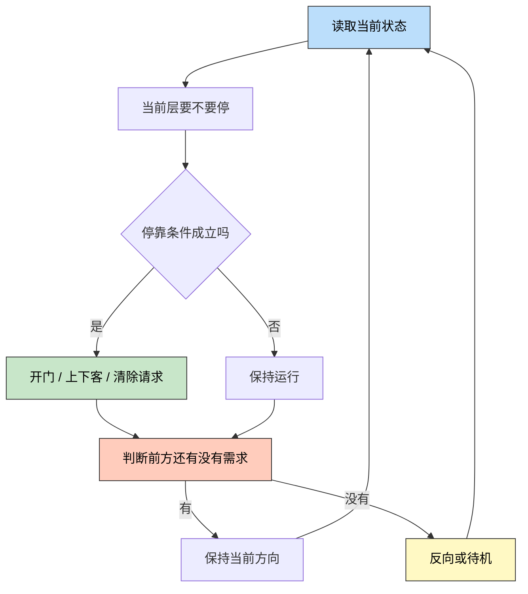
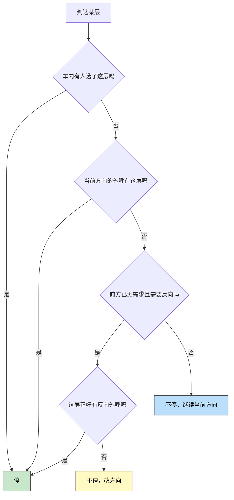

> 一句话定位：这篇笔记只关心一件事，
> 电梯代码到底怎么判断该停哪一层。
> 核心理念：电梯不是“算出一个终点再一路开过去”，
> 而是在每一层都基于当前状态重新做一次局部决策。

---

## 3 分钟速览版

<details>
<summary>点击展开核心概念</summary>

### 代码视角里的决策循环



<details>
<summary>**🖼️ 插图版（2026-04-17 增量补充）**</summary>


</details>

核心不是“先决定最终去哪”，
而是“每到一个决策点，重新判断当前层停不停、接下来往哪走”。

### 电梯代码手里的典型状态

| 状态 | 说明 |
|------|------|
| `current_floor` | 当前楼层 |
| `direction` | 当前方向，`up/down/idle` |
| `car_calls` | 轿厢内选层 |
| `hall_up` | 各层上行外呼 |
| `hall_down` | 各层下行外呼 |
| `door_state` | 门是否可开、是否已关严 |
| `load_state` | 是否满载，能否继续接人 |

### 最小判断规则



<details>
<summary>**🖼️ 插图版（2026-04-17 增量补充）**</summary>


</details>

最重要的三句话：

- 车内选层通常优先级最高，因为乘客已经在轿厢里。
- 外呼通常优先服务“与当前方向一致”的请求。
- 只有当前方没有需求时，代码才会考虑反向。

</details>

---

## 1. 把人的问题翻译成代码问题

人会问：

- 我按了按钮，为什么它不停？
- 它明明离我最近，为什么不上来接我？
- 为什么它先到 8 楼，再回到 5 楼？

代码不会这么问。
代码更像是在反复回答下面四个问题：

1. 当前层有没有必须停靠的理由？
2. 当前方向前方还有没有需求？
3. 如果没有，是否该反向？
4. 如果系统里有多台梯，这个外呼应该分给谁？

这四个问题基本就覆盖了“它为什么停这里、不停那里”的大部分原因。

---

## 2. 底层代码到底维护了哪些数据

### 2.1 最常见的三张请求表

把问题再压缩一点，
电梯控制里最核心的数据往往就是三类请求：

| 数据结构 | 含义 | 典型来源 |
|----------|------|----------|
| `car_calls[floor]` | 轿厢内有人选了哪层 | 轿厢按钮 |
| `hall_up[floor]` | 这一层有人要上行 | 厅外上按钮 |
| `hall_down[floor]` | 这一层有人要下行 | 厅外下按钮 |

如果是单梯系统，
光靠这三张表就已经能做出一个很像样的调度器。

### 2.2 还要配哪些运行状态

除了请求表，代码还得知道系统现在处在什么状态：

| 状态 | 作用 |
|------|------|
| `current_floor` | 决定当前检查的是哪一层 |
| `direction` | 决定优先处理哪一侧请求 |
| `moving` | 当前是否在运动中 |
| `door_closed` | 门没关好时通常不能启动 |
| `full_load` | 满载时可能跳过某些外呼 |
| `fault` | 故障态下进入特殊逻辑 |

也就是说，
“停不停”从来都不是只看一个按钮亮没亮，
而是请求状态和运行状态一起判断。

---

## 3. 到一层楼时，代码为什么决定停

### 3.1 最典型的停靠条件

如果先不考虑故障、消防、满载这些特殊模式，
单梯集选控制的停靠判断可以先理解成下面这张表：

| 条件 | 一般会不会停 | 原因 |
|------|--------------|------|
| 当前层有车内选层 | 会 | 乘客已在轿厢内，优先兑现 |
| 当前层有同向外呼 | 会 | 顺路接人，代价低 |
| 当前层只有反向外呼，前方仍有需求 | 通常不停 | 保持方向纪律 |
| 当前层只有反向外呼，前方已无需求 | 可能会停 | 常作为反向前的最后一次停靠 |

这张表就是很多人感受到“电梯怎么这么倔”的根源：
它不是没看见反向按钮，
而是当前策略不允许它为了这个按钮立刻打断方向。

### 3.2 一个更接近代码的伪代码

```text
if car_calls[current_floor]:
    stop()
elif direction == UP and hall_up[current_floor]:
    stop()
elif direction == DOWN and hall_down[current_floor]:
    stop()
elif no_request_ahead(direction):
    if direction == UP and hall_down[current_floor]:
        stop_and_reverse()
    elif direction == DOWN and hall_up[current_floor]:
        stop_and_reverse()
    else:
        reverse_direction()
else:
    pass_current_floor()
```

这段逻辑里，真正关键的是 `no_request_ahead(direction)`。
因为它决定了系统什么时候允许打破当前方向。

---

## 4. 它怎么判断“前方还有没有需求”

### 4.1 这一步才是调度核心

很多人会把注意力放在“当前层停不停”，
但更核心的其实是：
代码怎么判断当前方向还值不值得继续走。

比如电梯向上时，
它通常会检查上方还有没有这些东西：

- 更高楼层的车内选层
- 更高楼层的上行外呼
- 某些实现里，也会看更高楼层是否有任意待处理请求

如果这些都没了，
代码就会认为“当前方向扫描完成”，
然后准备反向。

### 4.2 一个最小 Python 版本

下面这段代码不追求工业完整度，
只想把“前方是否还有需求”的判断讲清楚。

```python
def has_request_ahead(current_floor, direction, car_calls,
                      hall_up, hall_down):
    if direction == "up":
        above = range(current_floor + 1, len(car_calls))
        return any(car_calls[f] for f in above) or any(
            hall_up[f] or hall_down[f] for f in above
        )

    if direction == "down":
        below = range(0, current_floor)
        return any(car_calls[f] for f in below) or any(
            hall_up[f] or hall_down[f] for f in below
        )

    return False


car_calls = [False, False, False, False, False, True, False, False]
hall_up =   [False, False, True,  False, False, False, False, False]
hall_down = [False, False, False, False, False, False, True,  False]

print(has_request_ahead(3, "up", car_calls, hall_up, hall_down))
print(has_request_ahead(6, "up", car_calls, hall_up, hall_down))
```

```python
True
False
```

它表达的意思很简单：

- 电梯在 3 楼向上时，上方还有请求，所以继续上。
- 电梯在 6 楼向上时，上方没有请求，就该考虑反向。

### 4.3 为什么很多实现更像 LOOK，而不是标准 SCAN

如果代码写成“前方没有请求就反向”，
那它更接近 LOOK。

如果代码写成“即使前方没请求，也要扫到边界楼层再回头”，
那才更接近教材里的标准 SCAN。

真实电梯更常见的是前者，
因为没必要为了形式上的完整扫描去空跑。

---

## 5. 为什么最近的那台电梯不一定来接你

### 5.1 单梯和多梯是两层不同问题

单梯逻辑关心的是：
当前这台梯下一步怎么走。

多梯群控关心的是：
这个厅外呼叫应该分给哪一台梯。

所以“最近的电梯没来”往往不是停靠逻辑的问题，
而是分配逻辑的问题。

### 5.2 群控常看的不是距离，而是代价

群控系统常见的想法不是“谁最近谁去”，
而是“谁去的总代价最低”。
这个代价可能综合了：

- 预计到达时间
- 当前方向是否一致
- 车内已有任务数量
- 是否满载
- 会不会破坏已有乘客的等待体验

于是就会出现一个很常见的现象：
A 梯离你更近，
但 B 梯方向更顺、代价更低，
系统最后把你的外呼分给了 B。

---

## 6. 我现在会怎样理解“电梯代码判断去哪层停”

如果用一句更像程序员的话来总结，
我会写成这样：

> 电梯不是维护“唯一目标楼层”，
> 而是维护一组待处理请求，并在每个决策点根据方向、
> 前方需求和当前层请求来决定停、行、反向。

也就是说，它更像一个持续运行的状态机，
而不是一个简单导航器。

### 6.1 一个更完整的心智模型

我现在会把停靠判断拆成三层：

1. 当前层是否满足停靠条件。
2. 当前方向前方是否还有需求。
3. 如果是多梯，外呼最初是分配给谁的。

只要这三层分开，
很多“它为什么不来接我”的问题就会突然变清楚。

---

## 7. 常见误解

| 误解 | 更接近真实的说法 |
|------|------------------|
| 电梯先算出终点，再一路开过去 | 它会在运行中不断重算局部决策 |
| 只要这层有人按按钮，就一定会停 | 还要看方向、前方需求和运行状态 |
| 最近的那台一定来接我 | 群控常按总代价分配，不只看距离 |
| 电梯调度就是一个 SCAN 算法 | SCAN 只是理解单梯逻辑的好模型 |

---

## 8. FAQ

### 8.1 车内选层和厅外呼叫谁优先

通常车内选层更强一些，
因为乘客已经在轿厢里了。
但具体实现仍会受群控和特殊模式影响。

### 8.2 为什么当前层明明有人按反方向按钮，它却不停

因为当前系统还在完成本方向扫描。
只要前方还有需求，
很多实现都会先保持方向，不立即接反向外呼。

### 8.3 标准 SCAN 和真实电梯最关键的差别是什么

标准 SCAN 更像“扫到边界再回头”，
真实电梯常更接近 LOOK，
也就是“前方没需求就回头”，减少空跑。

### 8.4 如果满载了，外呼还会停吗

很多实现会调整策略，
例如减少无意义停靠，优先把车内乘客送完，
再回来处理厅外请求。

### 8.5 真正的工业代码会比这里复杂多少

复杂得多。
因为还要考虑门控、安全链、故障模式、消防模式、
VIP 服务、群控通信和时间优化。
但“请求表 + 状态机 + 方向纪律”仍是核心骨架。

---

## 9. 总结

如果只回答“电梯底层代码怎么判断该停哪一层”，
我觉得最短的答案就是：

1. 先看当前层有没有必须停的请求。
2. 再看当前方向前方还有没有需求。
3. 前方有需求就继续，没有就反向或待机。
4. 如果是多梯系统，先前那次外呼可能就没分给这台梯。

所以电梯看上去像是在“选楼层”，
其实代码真正做的是一连串持续的状态判断。

---

## 更新记录

| 版本 | 日期 | 说明 |
|------|------|------|
| v1.0 | 2026-03-26 | 初始版本 |
| v1.1 | 2026-03-26 | 改写为停靠判断逻辑导向 |
| v1.2 | 2026-04-17 | 为 2 个 Mermaid 图表追加 Chiikawa 风格插图（m2c-pipeline 生成） |
