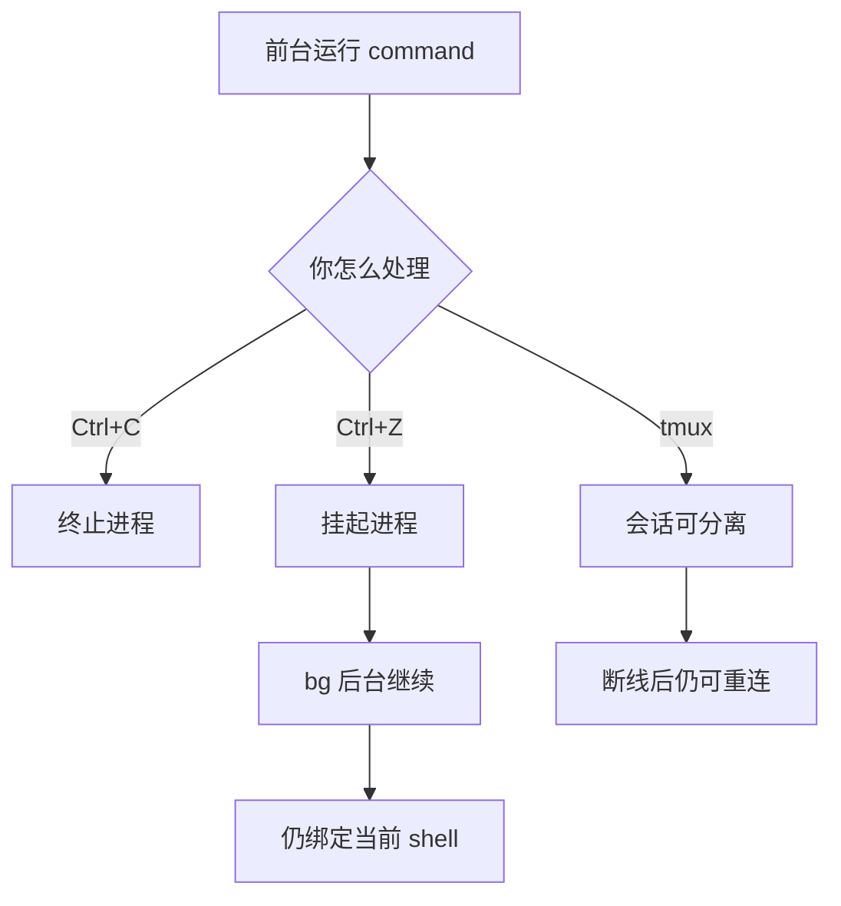
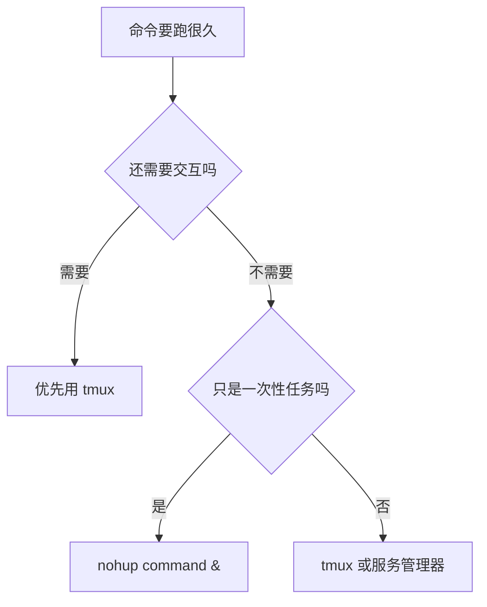

> 一句话定位：这是一篇帮你弄清“前台、后台、挂起、脱离会话”区别的终端任务管理笔记。

> 核心理念：`Ctrl+Z` 和 `bg` 管的是当前 shell 里的作业，`tmux` 管的是整段终端会话能不能断开后再接回来。

---

## 3 分钟速览版

<details>
<summary><strong>点击展开核心概念</strong></summary>

### 核心概念



<details>
<summary>**🖼️ 插图版（2026-04-17 增量补充）**</summary>


</details>

`Ctrl+C` 的目标是停掉任务，`Ctrl+Z` 的目标是先暂停任务，`bg` 的目标是让已暂停任务在后台继续跑。真正解决“关掉终端后还能继续”的，通常不是 `bg`，而是 `nohup`、`disown` 或 `tmux`。

### 一张表看懂差异

| 操作 | 它做了什么 | 任务是否继续运行 | 关闭终端后是否稳妥 | 典型用途 |
|------|------------|------------------|--------------------|----------|
| `Ctrl+C` | 向前台进程发中断信号 | 通常不会 | 不适用 | 明确要停止任务 |
| `Ctrl+Z` | 挂起前台进程 | 不会，先暂停 | 不稳妥 | 先停住再决定 |
| `bg` | 让挂起作业转后台 | 会 | 不稳妥 | 临时让出终端 |
| `disown` | 让 shell 忘记这个作业 | 可能会 | 比 `bg` 稳 | 已启动任务的补救 |
| `nohup command &` | 后台运行并忽略挂断 | 会 | 较稳 | 一次性长任务 |
| `tmux` | 保住整段终端会话 | 会 | 很稳 | 长任务、多窗口、远程登录 |

### 选择建议



<details>
<summary>**🖼️ 插图版（2026-04-17 增量补充）**</summary>


</details>

### 先记住这 4 句话

- `Ctrl+C` 是结束任务，不是放后台。
- `Ctrl+Z` 是挂起，不是“已经安全后台化”。
- `bg` 只是让作业在当前 shell 背后继续跑，不等于脱离当前终端。
- `tmux` 适合需要断线重连、切换窗口、长期维护的命令行工作。

</details>

---

## 1. 先把几个概念分开

### 1.1 前台、后台、挂起、会话分别是什么

| 概念 | 含义 | 你需要记住的点 |
|------|------|----------------|
| 前台任务 | 当前终端正在直接交互的进程 | 会接收键盘输入 |
| 后台任务 | 在当前 shell 中继续跑，但不占前台的作业 | 不代表已经脱离终端 |
| 挂起 | 进程被暂停，暂时不继续执行 | `Ctrl+Z` 默认就是这个效果 |
| shell 会话 | 你这次打开的终端和它启动的 shell 环境 | 关掉会话时，很多作业会受影响 |
| 终端复用器 | 像 `tmux` 这样能托管整段会话的工具 | 会话可断开后再接回 |

很多人第一次混淆，正是因为“后台运行”和“脱离当前终端”不是同一件事。`bg` 解决的是前台占用问题，`tmux` 解决的是会话存活问题。

### 1.2 为什么 `Ctrl+C` 会让任务断掉

在大多数 shell 里，`Ctrl+C` 会给当前前台进程发送 `SIGINT`。很多命令收到这个信号后会直接退出，所以你看到的效果就是“任务断了”。

常见场景包括：

- 运行 `python long_task.py` 时按了 `Ctrl+C`
- 运行 `npm run build` 时按了 `Ctrl+C`
- 运行 `rsync`、`ffmpeg`、`ping` 之类命令时按了 `Ctrl+C`

这不是“暂时离开一下”，而是“告诉它现在就停”。

### 1.3 为什么 `Ctrl+Z` 加 `bg` 还不够

`Ctrl+Z` 会发送 `SIGTSTP`，让前台进程先进入暂停状态。你随后执行 `bg`，是让这个暂停的作业在后台继续跑。

问题在于：这个作业通常还挂在当前 shell 下面。

这带来两个后果：

- 你关闭终端或断开 SSH 后，它可能随着会话结束而收到挂断信号
- 有些程序仍然依赖终端输入输出，放到后台后也可能异常

所以 `Ctrl+Z` 加 `bg` 很适合“我先把终端让出来”，但不天然等于“我现在可以安心关窗口走人”。

---

## 2. 常见命令分别解决什么问题

### 2.1 `jobs`、`fg`、`bg` 的基本配合

如果你已经启动了一个前台任务，可以这样操作：

```bash
python long_task.py
```

按下 `Ctrl+Z` 后，任务会被挂起。然后查看作业列表：

```bash
jobs
```

你可能会看到类似输出：

```text
[1]  + suspended  python long_task.py
```

把 1 号作业放到后台继续跑：

```bash
bg %1
```

如果之后又想切回前台：

```bash
fg %1
```

这套命令的价值是“在当前 shell 里调度作业”，不是“让它彻底独立于当前会话”。

### 2.2 `disown` 解决的是什么问题

如果一个作业已经在当前 shell 后台运行了，你可以考虑让 shell 不再跟踪它：

```bash
jobs
disown %1
```

`disown` 常用于补救场景：

- 任务已经开跑了
- 你临时发现它会跑很久
- 你不想这个作业继续和当前 shell 绑定得太紧

但它不是万能保险。某些命令本身仍然依赖终端输入输出，这时就算 `disown` 了，也不一定表现稳定。

### 2.3 `nohup` 更适合“一次性长任务”

如果你从一开始就知道命令会跑很久，而且不需要你持续交互，更常见的做法是：

```bash
nohup python long_task.py > long_task.log 2>&1 &
```

这个写法做了 3 件事：

1. `nohup` 让进程忽略挂断信号
2. `> long_task.log 2>&1` 把标准输出和标准错误都写进日志
3. `&` 让命令直接在后台启动

常用配套命令：

```bash
tail -f long_task.log
```

```bash
ps aux | rg long_task.py
```

如果只是跑一个批处理、导出任务、备份任务，`nohup` 往往已经够用。

### 2.4 `tmux` 解决的是“会话别丢”

`tmux` 不是单纯把一个命令丢到后台，而是创建一整段可分离、可恢复的终端会话。

最常见用法：

```bash
tmux new -s work
```

在会话里运行长任务：

```bash
python long_task.py
```

按下 `Ctrl+B`，再按 `D`，就会从当前 `tmux` 会话中脱离，但会话和任务还在。

之后可以查看已有会话：

```bash
tmux ls
```

重新接回：

```bash
tmux attach -t work
```

如果任务跑完了，会话不用了：

```bash
tmux kill-session -t work
```

`tmux` 适合这几类场景：

- 远程服务器上的长任务
- 需要多个窗口同时观察日志、代码、命令输出
- 你会频繁断开网络或关闭本地终端
- 你想把工作现场原样保留，稍后接着干

---

## 3. 到底该怎么选

### 3.1 `bg`、`nohup`、`tmux` 的区别

| 维度 | `bg` | `nohup command &` | `tmux` |
|------|------|-------------------|--------|
| 核心目标 | 释放当前前台 | 让单个命令更稳地后台跑 | 保住整段会话 |
| 是否适合已启动任务 | 是 | 通常否，最好启动前用 | 是，最好启动前进会话 |
| 是否适合交互式程序 | 一般 | 不适合 | 适合 |
| 关闭终端后是否可靠 | 低 | 中高 | 高 |
| 是否适合多窗口协作 | 否 | 否 | 是 |
| 学习成本 | 低 | 低 | 中 |

一句话总结：

- 只想临时让出终端，用 `Ctrl+Z` 加 `bg`
- 只想让一个不需要交互的长任务稳一点，用 `nohup command &`
- 想把命令行工作环境整个保住，用 `tmux`

### 3.2 一个实用决策法

如果你面对的是“命令可能要跑几个小时”的情况，可以直接按下面判断：

- 命令已经跑起来了，只是暂时想把终端还回来：`Ctrl+Z` -> `bg`
- 命令已经跑起来了，而且你马上要断开会话：`Ctrl+Z` -> `bg` -> `disown`，但这是补救，不如一开始就规划好
- 命令还没启动，而且它不需要你交互：直接 `nohup command > app.log 2>&1 &`
- 命令要跑很久，而且你还要看输出、反复操作、开多个窗口：先进 `tmux`
- 命令需要长期托管、重启自启、稳定运维：考虑服务管理器，不要只靠手动后台

---

## 4. 实战指南

### 4.1 场景一：已经启动了任务，临时想把它放后台

场景示例：你已经在前台启动了一个数据处理脚本，但现在还想继续敲别的命令。

操作步骤：

```bash
python batch_job.py
```

按 `Ctrl+Z` 挂起后：

```bash
jobs
bg %1
```

如果之后想再看它：

```bash
fg %1
```

适用前提：

- 你还会保留这个终端
- 程序不强依赖实时键盘输入
- 你只是想暂时切出，不是马上断线走人

### 4.2 场景二：从一开始就知道任务会跑很久

场景示例：你要导出一大批文件，或者跑一个长时间脚本，不需要中途交互。

```bash
nohup python export_reports.py > export.log 2>&1 &
echo $!
```

这里的 `echo $!` 会打印刚启动的后台进程 PID，方便你后续排查或结束。

查看日志：

```bash
tail -f export.log
```

结束任务：

```bash
kill <PID>
```

### 4.3 场景三：远程登录服务器，怕断线

这是 `tmux` 最典型的场景。

```bash
tmux new -s train
python train_model.py
```

暂时离开：

```text
Ctrl+B，然后按 D
```

重新连接服务器后接回：

```bash
tmux attach -t train
```

这个方案的关键优势不是“让某个进程后台跑”，而是“保住你当时的整个工作现场”。

### 4.4 场景四：一个窗口不够用

`tmux` 还有一个很实用的点：你可以在同一个会话里开多个窗口。

一种常见工作流是：

- 窗口 1 跑主任务
- 窗口 2 `tail -f` 日志
- 窗口 3 临时执行检查命令

这正是它比 `nohup` 更像“工作环境工具”而不是“单命令保活工具”的原因。

---

## 5. 最佳实践

### 5.1 先决定自己是在解决哪类问题

很多误操作都来自于目标没分清：

- 想停止任务，用 `Ctrl+C`
- 想暂停任务，稍后再决定，用 `Ctrl+Z`
- 想临时把作业放后台，用 `bg`
- 想让一次性长任务更稳，用 `nohup`
- 想断线重连并保留工作现场，用 `tmux`

### 5.2 长任务尽量一开始就规划日志

推荐这样启动：

```bash
nohup python long_task.py > long_task.log 2>&1 &
```

或者在 `tmux` 里运行后另开窗口看日志：

```bash
tail -f long_task.log
```

别等任务已经跑了半小时，才发现输出没有保存。

### 5.3 不要把所有命令都粗暴地丢到后台

这些情况更适合 `tmux`：

- 程序需要你后续继续输入命令
- 程序会持续刷新界面
- 你需要边看输出边操作
- 你希望稍后恢复当时的上下文

纯后台更适合“我只关心它最终跑完”。

### 5.4 远程服务器上养成先开 `tmux` 的习惯

如果你经常 SSH 到远程机器，最省心的做法通常是：

```bash
tmux new -s main
```

然后再开始跑真正的任务。这样比“跑起来之后才想办法补救”稳定很多。

---

## 6. 常见误区

### 6.1 误区一：`Ctrl+Z` 等于后台运行

不对。`Ctrl+Z` 的第一步效果是挂起，不是继续运行。只有再执行 `bg`，它才会在后台继续。

### 6.2 误区二：`bg` 之后就能放心关终端

也不对。`bg` 只是让作业在当前 shell 背后继续，不代表它已经和当前终端会话彻底解绑。

### 6.3 误区三：`nohup` 能替代 `tmux`

不完全能。`nohup` 很适合单个非交互命令，但它不会帮你保留多个窗口、命令历史和当时的操作现场。

### 6.4 误区四：`tmux` 只适合远程服务器

本地机器同样适用。只要你经常开多个终端窗口、处理长任务、怕误关窗口，`tmux` 都能提升稳定性。

---

## 7. 故障排查

| 症状 | 常见原因 | 解决方案 |
|------|----------|----------|
| `bg` 之后一关终端任务就没了 | 作业仍绑定当前 shell，会话结束后被影响 | 改用 `nohup`、`disown` 或 `tmux` |
| 后台任务看起来没输出 | 输出被重定向到日志文件，或程序缓冲了输出 | 检查日志文件，必要时调整程序刷新策略 |
| `nohup` 启动后找不到输出 | 没指定日志文件，输出去了默认位置 | 明确写 `> app.log 2>&1` |
| `tmux attach` 提示没有会话 | 会话未创建，或任务已结束导致会话退出 | 先执行 `tmux ls` 检查现有会话 |
| 程序放后台后行为异常 | 程序仍然依赖终端输入或交互界面 | 不要强行后台化，改在 `tmux` 里运行 |

---

## 8. 实战案例

### 8.1 远程训练任务的稳妥做法

假设你要在远程机器上跑一个需要几个小时的训练任务。

错误但常见的做法：

```bash
ssh user@server
python train.py
```

如果中途网络断了，任务很可能跟着受影响。

更稳妥的做法：

```bash
ssh user@server
tmux new -s train
python train.py
```

临时离开时从会话中脱离，之后重新登录再接回。这样你不但保住了任务，也保住了日志现场、命令上下文和排查窗口。

### 8.2 已经在前台跑了才发现会很久，怎么办

如果你已经启动了命令，又不方便重来，可以这样补救：

```bash
Ctrl+Z
bg %1
disown %1
```

这能帮你把当前作业尽量从 shell 里摘出去，但它依然不是所有程序都适用。遇到依赖交互的任务，通常还是重启并放进 `tmux` 更稳。

---

## 9. 工具与资源

### 9.1 一份最小检查清单

- [ ] 先判断任务是否需要交互
- [ ] 先判断自己会不会关终端或断开 SSH
- [ ] 长任务要提前规划日志输出
- [ ] 远程机器优先先开 `tmux`
- [ ] 不确定时，优先选更稳的方案，而不是事后补救

### 9.2 最常用的命令速查

```bash
# 查看 shell 当前作业
jobs

# 挂起当前前台任务
# 键盘按 Ctrl+Z

# 让挂起任务转后台继续
bg %1

# 把后台任务切回前台
fg %1

# 让 shell 不再跟踪某个作业
disown %1

# 一次性长任务后台运行
nohup command > app.log 2>&1 &

# 新建 tmux 会话
tmux new -s work

# 查看 tmux 会话
tmux ls

# 接回 tmux 会话
tmux attach -t work
```

---

## 10. FAQ

### 10.1 `Ctrl+C` 和 `Ctrl+Z` 最大区别是什么

`Ctrl+C` 通常是中断并结束当前前台进程，`Ctrl+Z` 通常是暂停当前前台进程。一个偏“停掉”，一个偏“先挂起”。

### 10.2 `bg` 之后我能直接关终端吗

不建议默认这样理解。`bg` 只是后台继续，不保证它已经安全脱离当前会话。要看具体 shell、程序行为和终端关闭方式。

### 10.3 `disown` 和 `nohup` 是一回事吗

不是。`disown` 更像让 shell 忘掉这个作业，常用于已经启动后的补救；`nohup` 更像启动前就告诉命令忽略挂断信号。

### 10.4 `tmux` 和 `nohup` 应该优先学哪个

如果你经常远程登录、经常看日志、经常开多个任务窗口，优先学 `tmux`。如果你只是偶尔跑一个不需要交互的长脚本，先掌握 `nohup` 也够用。

### 10.5 已经启动的命令能无缝塞进 `tmux` 吗

通常不能把一个已经跑起来的前台进程无损搬进 `tmux`。大多数时候，更现实的做法是临时用 `Ctrl+Z`、`bg`、`disown` 补救，或者直接重启任务并从一开始就在 `tmux` 里运行。

### 10.6 本地开发也值得用 `tmux` 吗

值得。只要你有多窗口、多任务、长日志、怕误关终端这些需求，`tmux` 在本地一样有价值。

---

## 11. 总结

真正该记住的不是某一条命令，而是一条判断主线：

- 你是在停止任务，还是暂停任务
- 你是在把作业放后台，还是让它脱离当前会话
- 你是在保住一个命令，还是保住整段工作环境

把这条线想清楚之后，选择就很自然了：

- 临时让出终端，用 `Ctrl+Z` 加 `bg`
- 一次性长任务，用 `nohup command &`
- 长期、多窗口、怕断线，用 `tmux`

---

## 更新记录

| 版本 | 日期 | 说明 |
|------|------|------|
| v1.0 | 2026-03-23 | 初版，整理 `Ctrl+C`、`Ctrl+Z`、`bg`、`nohup`、`disown` 和 `tmux` 的选择逻辑 |
| v1.1 | 2026-04-17 | 为 2 个 Mermaid 图表追加 Chiikawa 风格插图（m2c-pipeline 生成） |
