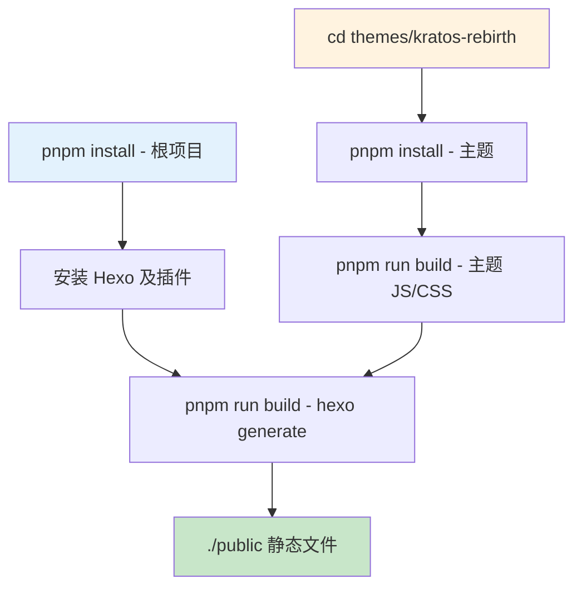
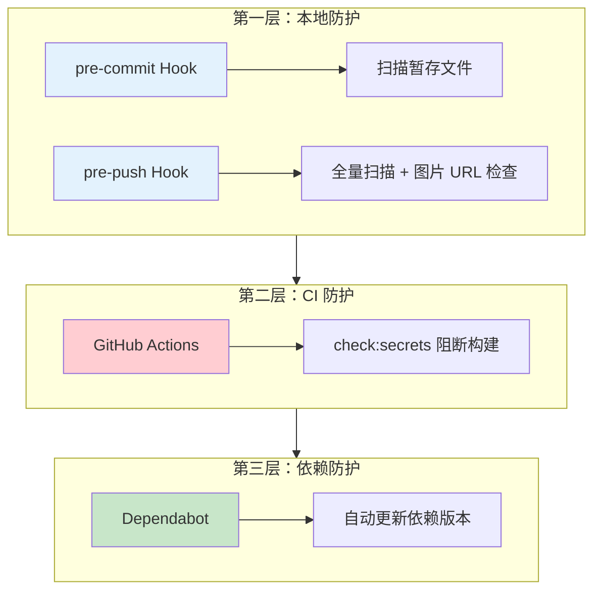

> 🎯 **一句话定位**：一个 54 行的 YAML 文件，藏着 CI/CD 工程化思维的五层骨架。
> 💡 **核心理念**：好的流水线不是命令的堆砌，而是对"触发边界、环境一致性、构建隔离、安全左移、发布可逆"的显式表达。

---

## 📖 3 分钟速览版

<details>
<summary><strong>📊 点击展开：五维度全景 + 快速上手 + 跨生态对比速查</strong></summary>

### 五维度全景流程

| 阶段 | 说明 |
|------|------|
| ① push to hexo | 推送源码分支触发流水线 |
| ② 环境初始化 | 安装 pnpm、Node.js、依赖，利用缓存加速 |
| ③ 两阶段构建 | 先构建主题 JS/CSS，再 hexo generate |
| ④ 安全左移检查 | 密钥扫描阻断泄露，前置于静态文件生成 |
| ⑤ 静态发布 | 推送 public/ 到 GitHub Pages |

### 核心配置速查

| 维度 | 配置项 | 作用 |
|------|--------|------|
| 触发条件 | `branches: [hexo]` | 仅源码分支触发，隔离发布分支 |
| 环境初始化 | `fetch-depth: 0` | 保留完整 Git 历史，支持 Hexo 日期推断 |
| 环境初始化 | `submodules: true` | 自动拉取主题子模块 |
| 环境初始化 | `cache: 'pnpm'` | 利用 pnpm store 跨 job 复用依赖 |
| 构建逻辑 | 主题目录二次 build | 主题有独立 JS/CSS 构建产物 |
| 安全检查 | `check:secrets` | 在构建产物生成前阻断泄露 |
| 发布策略 | `force_orphan: true` | 每次发布为全量孤立提交 |

### 最小可用 deploy.yml（快速上手版）

```yaml
name: Deploy Hexo Blog

on:
  push:
    branches: [hexo]

permissions:
  contents: write

jobs:
  deploy:
    runs-on: ubuntu-latest
    steps:
      - uses: actions/checkout@v4
        with:
          fetch-depth: 0
          submodules: true
      - uses: pnpm/action-setup@v2
        with:
          version: 9
      - uses: actions/setup-node@v4
        with:
          node-version: '20'
          cache: 'pnpm'
      - run: pnpm install
      - run: pnpm run build
      - uses: peaceiris/actions-gh-pages@v4
        with:
          github_token: ${{ secrets.GITHUB_TOKEN }}
          publish_dir: ./public
          force_orphan: true
```

### pnpm vs Maven vs Gradle 缓存速查

| 维度 | pnpm | Maven | Gradle |
|------|------|-------|--------|
| 缓存目录 | `~/.local/share/pnpm/store` | `~/.m2/repository` | `~/.gradle/caches` |
| Actions 内置支持 | `cache: 'pnpm'`（setup-node） | `cache: 'maven'`（setup-java） | `cache: 'gradle'`（setup-java） |
| lockfile | `pnpm-lock.yaml` | `pom.xml`（依赖哈希） | `gradle.lockfile` |
| 缓存命中率 | 高（内容寻址存储） | 中（路径匹配） | 中高（文件哈希） |

</details>

---

## 问题背景：手动部署的四个痛点

在接入 CI/CD 之前，Hexo 博客的发布流程大概是这样的：

1. 本机写文章，本机 `hexo generate` 生成静态文件
2. `hexo deploy` 推送到 GitHub Pages（或手动 push public/ 目录）
3. 每次发布前手动执行密钥检查（如果记得的话）
4. 换台电脑时，需要重新配置 Node.js 环境、安装依赖

这带来四个具体问题：

| 痛点 | 影响 |
|------|------|
| 手动执行多步骤 | 容易遗漏，尤其是安全检查 |
| 依赖本地环境 | 换机器或环境不一致导致构建结果不稳定 |
| 安全检查可绕过 | 本地 Hook 可以 `--no-verify` 跳过 |
| 无可追溯部署记录 | 不知道哪次提交触发了哪次部署 |

GitHub Actions 可以完整解决上述问题。

---

## GitHub Actions 核心概念

在解析具体配置前，先对齐四个核心概念：

| 概念 | 类比 | 说明 |
|------|------|------|
| **Workflow** | 整条流水线 | 由 YAML 文件定义，存放在 `.github/workflows/` |
| **Job** | 流水线中的一个阶段 | 每个 Job 运行在独立的 Runner（虚拟机）中 |
| **Step** | Job 中的一个步骤 | 可以是 `run`（Shell 命令）或 `uses`（调用 Action） |
| **Action** | 可复用的步骤单元 | 来自 GitHub Marketplace 或自定义，如 `actions/checkout@v4` |

关系是：一个 Workflow 包含多个 Job，每个 Job 包含多个 Step，Step 可以调用 Action。

---

## 完整 deploy.yml 解析

本文以下面这个真实的 `deploy.yml` 为分析蓝本：

```yaml
name: Deploy to GitHub Pages

on:
  push:
    branches: [hexo]

permissions:
  contents: write

jobs:
  deploy:
    runs-on: ubuntu-latest

    steps:
      - name: Checkout source code
        uses: actions/checkout@v4
        with:
          fetch-depth: 0
          submodules: true

      - name: Setup pnpm
        uses: pnpm/action-setup@v2
        with:
          version: 9

      - name: Setup Node.js
        uses: actions/setup-node@v4
        with:
          node-version: '20'
          cache: 'pnpm'

      - name: Install dependencies
        run: pnpm install

      - name: Build theme assets
        run: |
          cd themes/kratos-rebirth
          pnpm install
          pnpm run build

      - name: Security check - scan for secrets
        run: pnpm run check:secrets

      - name: Generate static site
        run: pnpm run build

      - name: Deploy to GitHub Pages
        uses: peaceiris/actions-gh-pages@v4
        with:
          github_token: ${{ secrets.GITHUB_TOKEN }}
          publish_dir: ./public
          force_orphan: true
          commit_message: 'Site updated: ${{ github.event.head_commit.message }}'
```

接下来从五个维度逐层拆解。

---

## 维度一：触发条件——流水线的入口哲学

### 分支策略：为什么只监听 hexo 分支

```yaml
on:
  push:
    branches: [hexo]
```

这条配置背后是一个典型的**双分支策略**：

- `hexo` 分支：存放 Hexo 源码（Markdown 文章、配置、主题）
- `main` 分支：存放 GitHub Pages 发布的静态 HTML

核心价值在于**关注点分离**：源码变更触发构建，而发布产物不会反向触发流水线形成循环。如果把 `branches` 改为 `['*']`，向 `main` 推送静态文件时也会触发流水线，造成无意义的重复执行。

### 权限声明的最小化原则

```yaml
permissions:
  contents: write
```

GitHub Actions 默认权限是只读的。这里显式声明 `contents: write` 是为了让 `peaceiris/actions-gh-pages` 能向 `main` 分支推送静态文件。

**最小权限原则**：只声明所需权限，避免使用 `permissions: write-all`，这是安全合规的基础要求。

---

## 维度二：环境初始化——一致性是 CI 的生命线

### fetch-depth: 0 对 Hexo 的重要性

```yaml
- uses: actions/checkout@v4
  with:
    fetch-depth: 0
    submodules: true
```

**`fetch-depth` 默认值是 1**（浅克隆），只拉取最近一次提交。对大多数项目这是合理的——减少网络传输，加速 checkout。但对 Hexo 博客来说，`fetch-depth: 0`（完整历史）是必要的：

**原因一：Hexo 的日期推断机制**

Hexo 可以从文件的 Git 提交历史中推断文章的创建时间。如果只有浅克隆，历史不完整，日期推断会失效，文章时间戳可能显示为 `1970-01-01`。

**原因二：插件依赖 Git 历史**

部分 Hexo 插件（如 `hexo-generator-sitemap`）在生成时会读取 Git log 来计算文档更新时间，浅克隆会导致这类插件行为异常。

> 💡 **权衡**：完整历史会增加 checkout 时间，对提交记录很多的仓库可以考虑 `fetch-depth: 100` 作为折中。

### submodules: true 与主题子模块

Hexo 主题通常以 **Git Submodule** 形式引入，主仓库只记录一个指向主题仓库特定 commit 的指针。`submodules: true` 会自动执行 `git submodule update --init --recursive`，确保主题文件完整。

如果忘记这一项，后续的主题构建步骤会因目录为空而直接失败。

### pnpm 缓存配置

```yaml
- uses: pnpm/action-setup@v2
  with:
    version: 9

- uses: actions/setup-node@v4
  with:
    node-version: '20'
    cache: 'pnpm'
```

两点关键设计：

**版本锁定**：`version: 9` 和 `node-version: '20'` 将工具链版本固定，防止 Runner 环境升级导致的隐性破坏。

**`cache: 'pnpm'` 工作原理**：`setup-node` 会自动读取 `pnpm-lock.yaml` 计算缓存 Key，将 pnpm 的全局 store 目录挂载到 GitHub Actions 缓存。下次 `pnpm install` 时，直接从缓存 store 硬链接文件到 `node_modules`，无需重新下载。

pnpm 的内容寻址存储（CAS）天然适合缓存：同一包的同一版本在 store 中只存一份，缓存命中率远高于 npm。实测在 300+ 依赖的项目中，启用 pnpm 缓存可将 `install` 步骤从 60-90 秒降至 5-10 秒。

---

## 维度三：构建逻辑——两阶段构建的场景需求



### 为什么主题需要独立的 install + build

```yaml
- name: Build theme assets
  run: |
    cd themes/kratos-rebirth
    pnpm install
    pnpm run build
```

主题 `kratos-rebirth` 是有独立 `package.json` 的前端项目，需要将 TypeScript/SCSS 编译为浏览器可识别的 JS/CSS 文件。这和博客根目录是**两个完全独立的 Node.js 项目**：

- 根目录：Hexo 引擎和内容处理插件
- 主题目录：前端构建工具和 UI 组件库

两者依赖树不同，不能合并。这类"子项目独立构建"在大型前端 Monorepo 中也很常见，只是这里通过 Git Submodule 而非 workspace 管理。

### 构建顺序的依赖关系

顺序是：`Build theme assets` → `Generate static site`。Hexo 渲染模板时会引用主题目录下已编译好的 JS/CSS 文件。如果顺序颠倒，生成的 HTML 可能引用不存在的静态资源，导致页面样式崩坏。

---

## 维度四：安全检查——安全左移的流水线价值

```yaml
- name: Security check - scan for secrets
  run: pnpm run check:secrets
```

这一步放在 `Generate static site` **之前**，不是巧合，而是刻意设计。

**安全左移（Shift Left Security）** 的核心思想是：越早发现安全问题，修复成本越低。

将密钥扫描放在构建之前，有三个具体价值：

**价值一：阻断传播链**

包含密钥的文章内容，如果在 Hexo 渲染后被写入 `public/` 目录再推送到 GitHub Pages，密钥会对全网公开。提前扫描可以在静态文件生成前中断这条传播链。

**价值二：节省无效构建时间**

如果存在密钥泄露，后续的 `hexo generate`（可能耗时数分钟）完全是浪费。提前失败，避免在错误上继续投入资源。

**价值三：形成规范约束**

CI 中的强制检查比 Pre-commit Hook 更可靠。开发者可以 `--no-verify` 绕过本地 hook，但无法绕过远程 CI。让安全规范从"建议"变成"门禁"。

> 📋 **检测模式参考**：密码字段（`password:`、`apikey:`）、令牌（`access_token`、`bearer`）、服务密钥（Stripe `sk-`、GitHub `ghp_`、AWS `AKIA`）、数据库 URL（`mysql://`、`mongodb://`）等。

---

## 维度五：发布策略——force_orphan 的工作机制

### peaceiris/actions-gh-pages 的运作原理

```yaml
- uses: peaceiris/actions-gh-pages@v4
  with:
    github_token: ${{ secrets.GITHUB_TOKEN }}
    publish_dir: ./public
    force_orphan: true
    commit_message: 'Site updated: ${{ github.event.head_commit.message }}'
```

`peaceiris/actions-gh-pages` 会将 `publish_dir` 内容推送到目标分支（默认 `gh-pages`，本项目配置为 `main`）。`commit_message` 使用 `${{ github.event.head_commit.message }}` 动态注入源码提交的消息，让部署记录可追溯。

### force_orphan: true 的双面性

| 维度 | force_orphan: true | 正常追加模式 |
|------|-------------------|-------------|
| 仓库体积 | 始终只有一个提交，体积极小 | 随部署次数线性增长 |
| 历史可追溯 | 无历史，只有当前快照 | 可 diff 每次部署的变更 |
| clone 速度 | 极快 | 随历史增长变慢 |
| 回滚能力 | 无法通过 git 直接回滚 | 可 `git checkout <hash>` 回滚 |
| 适用场景 | 静态站点、纯产物分支 | 需要审计和回滚的发布场景 |

**推荐场景**：个人博客、文档站点这类静态站点，`force_orphan: true` 是最佳选择。如果需要回滚，在源码分支执行 `git revert` 后重新触发 CI 即可，无需在部署分支操作。

---

## 三层防护体系

本项目构建了完整的三层安全防护：



- **第一层（本地）**：Git Hooks 在 commit/push 时执行密钥扫描，快速反馈（详见：[博客安全检查方案优化](/tech/tools/blog-security-check-optimization/)）
- **第二层（CI）**：即使绕过本地 Hook，GitHub Actions 也会在构建前强制扫描，形成托底
- **第三层（依赖）**：Dependabot 定期检测 `package.json` 和 GitHub Actions 依赖的版本，自动提 PR 更新

**Dependabot 配置**（本项目实际使用的 `.github/dependabot.yml`）：

```yaml
version: 2
updates:
  - package-ecosystem: npm
    directory: "/"
    schedule:
      interval: weekly
      day: monday
    open-pull-requests-limit: 5
    ignore:
      # 忽略补丁版本更新，只更新次版本和主版本
      - dependency-name: "*"
        update-types: ["version-update:semver-patch"]
```

> 💡 **配置说明**：每周一检查 npm 依赖，跳过 patch 版本（如 `1.0.1` → `1.0.2`），只处理 minor/major 更新，避免过多低价值 PR 干扰。如需同时监控 Actions 版本，可追加 `package-ecosystem: github-actions` 块。

---

## Java 工程师视角：跨生态缓存对比

### 缓存目录对比

```text
Node.js (pnpm)
~/.local/share/pnpm/store/   ← 内容寻址，全局唯一存储
  └── v3/files/<hash>/        ← 每个文件以 sha512 命名

Java (Maven)
~/.m2/repository/            ← 坐标路径，GAV 结构
  └── org/springframework/spring-core/6.1.0/

Java (Gradle)
~/.gradle/caches/modules-2/files-2.1/
  └── org.springframework/
```

**核心差异**：pnpm 使用内容寻址存储（CAS），同一文件只存一份。Maven/Gradle 使用 GAV 坐标路径，同一 jar 在不同项目中可能被重复缓存。

### Actions 中的缓存配置对比

**Node.js (pnpm)**：

```yaml
- uses: actions/setup-node@v4
  with:
    node-version: '20'
    cache: 'pnpm'        # 自动处理 store 路径
```

**Java (Maven)**：

```yaml
- uses: actions/setup-java@v4
  with:
    java-version: '21'
    distribution: 'temurin'
    cache: 'maven'       # 缓存 ~/.m2/repository
```

**Java (Gradle)**：

```yaml
- uses: actions/setup-java@v4
  with:
    java-version: '21'
    distribution: 'temurin'
    cache: 'gradle'      # 缓存 ~/.gradle/caches
```

三者的 `cache` 参数都是对 `actions/cache` 的封装，核心逻辑一致：以 lockfile 的哈希作为缓存 Key，命中则跳过下载。

### lockfile 策略对比

| 生态 | Lockfile | 说明 |
|------|----------|------|
| pnpm | `pnpm-lock.yaml` | 锁定所有依赖精确版本和 integrity 哈希 |
| Maven | `pom.xml`（范围依赖） | `pom.xml` 的 range 版本不是 lockfile，可重现性差 |
| Gradle | `gradle.lockfile` | 默认不生成，需配置 `dependencyLocking` 开启 |

> 💡 **Java 开发者提示**：Maven `pom.xml` 中使用 `1.2.+` 这类范围版本时，不同时间执行可能拿到不同版本，在 CI 中是不可重现的。pnpm 的 lockfile 机制天然避免了这个问题，类似 Gradle 的 `dependencyLocking` 功能。

---

## 生产实践：五个常见坑

### 坑 1：Hexo 文章日期显示 1970-01-01

**症状**：生成的文章时间戳全部显示为 Unix 时间戳 0。

**原因**：`fetch-depth` 默认浅克隆，Hexo 无法读取 Git 历史推断日期。

**解决**：设置 `fetch-depth: 0`。详见"维度二：环境初始化"章节。

### 坑 2：主题目录为空，构建失败

**症状**：`cd themes/kratos-rebirth && pnpm install` 报错 `No such file or directory`。

**原因**：checkout 时未指定 `submodules: true`。

**解决**：添加 `submodules: true`，或手动添加步骤：

```yaml
- run: git submodule update --init --recursive
```

### 坑 3：permissions 配置遗漏

**症状**：部署步骤报错 `remote: Permission to repo denied to github-actions[bot]`。

**原因**：Actions 默认权限是只读（`contents: read`），推送需要写权限。

**解决**：在 workflow 顶层添加：

```yaml
permissions:
  contents: write
```

### 坑 4：pnpm 缓存失效

**症状**：明明有缓存，但每次 CI 都重新下载全部依赖。

**原因**：`pnpm-lock.yaml` 在提交时被 `.gitignore` 忽略，或不同开发者使用不同版本的 pnpm 导致 lockfile 频繁变动。

**解决**：确保 `pnpm-lock.yaml` 提交到仓库，统一 pnpm 版本（通过 `packageManager` 字段或 `pnpm/action-setup` 的 `version` 锁定）。

### 坑 5：check:secrets 误报示例代码

**症状**：文章中用于讲解的示例密钥字符串（非真实密钥）被扫描器拦截。

**原因**：扫描规则基于正则，无法区分"示例密钥"和"真实密钥"。

**解决**：示例代码中使用明显占位符（如 `YOUR_API_KEY`、`<your-token-here>`），并在脚本中为已知误报路径配置白名单。

---

## 💬 常见问题（FAQ）

### Q1：为什么不用 hexo deploy 命令？

**A：** `hexo deploy` 依赖本地环境，需要在 `_config.yml` 中写入 Git 仓库地址，且必须在开发者本机执行。GitHub Actions 让构建和部署完全在云端运行，开发者只需专注写文章，push 即发布。

### Q2：pnpm/action-setup 和 setup-node 的 cache: pnpm 有什么关系？

**A：** 两者各司其职。`pnpm/action-setup` 负责**安装 pnpm 工具本身**，`setup-node` 的 `cache: 'pnpm'` 负责**缓存 pnpm store 目录**。缺少前者会导致 pnpm 命令不存在；缺少后者会导致每次 CI 重新下载所有依赖包。

### Q3：GITHUB_TOKEN 是自己配置的 token 吗？

**A：** 不是。`GITHUB_TOKEN` 是 GitHub Actions 为每次 workflow 运行自动生成的临时 token，无需手动配置。它的权限范围由 `permissions` 字段控制，workflow 结束后自动失效。

### Q4：force_orphan: true 会导致部署历史无法回滚吗？

**A：** 是的，部署分支的历史无法直接追溯，但**源码分支的历史完整保留**。正确的回滚姿势是在 `hexo` 分支执行 `git revert` 或 `git reset`，然后 push 触发新的部署，而不是在部署分支操作。

### Q5：GitHub Actions 的免费额度够用吗？

**A：** 对于个人博客完全够用。GitHub 为公开仓库提供**无限**免费 Actions 分钟；私有仓库每月 2000 分钟免费额度。一次 Hexo 博客构建通常在 2-4 分钟内完成（有缓存时约 1-2 分钟）。

### Q6：如何在不重建整个流水线的情况下测试单个 step？

**A：** 可以使用 `act` 工具在本地模拟 GitHub Actions 执行环境。另一个方案是将该 step 抽取为独立的测试 workflow，设置 `on: workflow_dispatch` 手动触发，避免污染主流水线。

### Q7：可以在 commit_message 中使用 PR 标题而非 commit 消息吗？

**A：** 可以，但需要区分触发事件。`github.event.head_commit.message` 适用于 `push` 事件；如果通过 Pull Request 合并触发，应使用 `github.event.pull_request.title`。当前 workflow 仅监听 push 事件，所以使用 `head_commit.message` 是正确的。

---

## ✨ 总结

### 核心要点

1. **双分支策略**：源码分支（hexo）和发布分支（main）分离，避免循环触发
2. **`fetch-depth: 0` + `submodules: true`** 是 Hexo 项目 checkout 的标准配置
3. **两阶段构建**：根项目和主题是独立的 Node.js 项目，需要分别 install + build
4. **安全左移**：`check:secrets` 前置于 `hexo generate` 之前，阻断泄露传播链
5. **`force_orphan: true`**：适合静态站点，以牺牲历史换取仓库轻量
6. **三层防护**：本地 Git Hooks + CI 扫描 + Dependabot，形成纵深防御

### 行动建议

- [ ] 检查当前 workflow 是否已设置 `fetch-depth: 0`（Hexo 日期问题的常见根因）
- [ ] 确认 `pnpm-lock.yaml` 已提交到仓库（缓存命中的前提）
- [ ] 将密钥扫描步骤前置到构建产物生成之前
- [ ] 评估 `force_orphan` 策略是否符合自己的回滚需求
- [ ] 配置 Dependabot 自动更新 Actions 和 npm 依赖版本

---

## 更新记录

| 版本 | 日期 | 说明 |
|------|------|------|
| v1.0 | 2026-03-24 | 初始版本，合并五维度深度解析与从零入门教程 |
