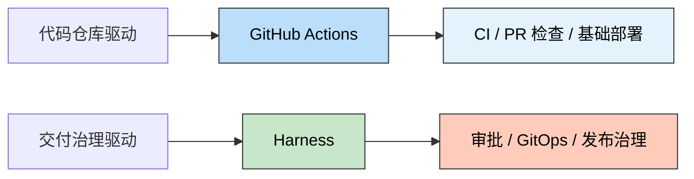
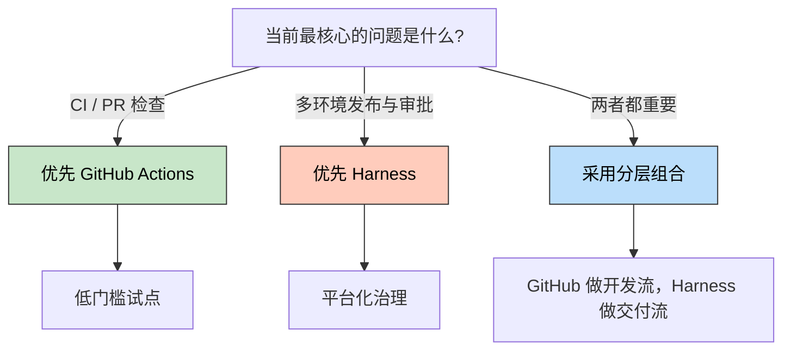
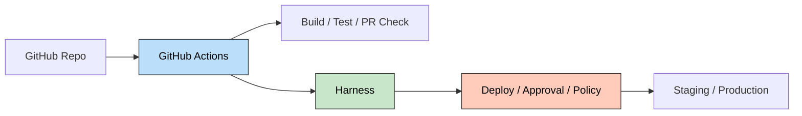

> 🎯 **一句话定位**：这不是一篇“谁的功能更多”的对比，而是一套判断
> “应该选仓库原生自动化，还是企业级交付平台”的思路。
>
> 💡 **核心理念**：先看交付复杂度，再看功能清单。团队真正要解决的
> 问题，决定了平台选型的上限和性价比。

---

## 📖 3 分钟速览版

<details>
<summary>📊 点击展开核心结论</summary>

### 🔌 核心概念



**简要说明**：`GitHub Actions` 强在和 GitHub 仓库、PR、事件流深度绑定，
适合把 CI 和基础部署快速跑起来；`Harness` 强在把部署、审批、策略、
GitOps 和审计收敛成统一交付平台。

### 💎 一张表先看结论

| 你最关心什么 | 更适合 GitHub Actions | 更适合 Harness |
|------|----------------|---------|
| 快速把 CI 跑起来 | 是 | 否 |
| 仓库、PR、事件流一体化 | 是 | 否 |
| 多环境发布编排 | 一般 | 是 |
| 强审批与策略治理 | 一般 | 是 |
| 团队平台化复用 | 一般 | 是 |
| 低门槛、低运维试点 | 是 | 否 |

### 🎯 什么时候选谁



**适用条件**：

- `GitHub Actions`：代码主要在 GitHub，团队先解决 CI、PR 检查和基础部署。
- `Harness`：需要多环境审批、发布编排、GitOps、模板治理和审计能力。
- 分层组合：希望保留 GitHub 开发体验，同时把交付治理独立出来。

**不适用情况**：

- 只有 1 到 2 个服务、1 套环境、审批链也很简单，不必过早引入 Harness。
- 发布治理已经很复杂，却还把所有 CD 逻辑堆在 GitHub Actions 里，后续维护会很痛。

</details>

---

## 🧠 深度剖析版

本文基于截至 2026-03-31 可公开确认的官方文档整理。目标不是替你做唯一
决定，而是帮你缩短试错时间，把讨论重点从“功能多不多”切回“问题像不像”。

### 1. 先看本质，不要先看功能清单

#### 1.1 GitHub Actions 解决什么问题

`GitHub Actions` 本质上是 GitHub 仓库原生的工作流自动化能力。它最强的
地方不是“能写 YAML”，而是和 `push`、`pull_request`、`workflow_call`
这类开发事件天然耦合。只要团队的核心流程仍然围绕 GitHub 仓库展开，
它就很容易成为 CI、检查、构建、测试和基础部署的默认入口。

#### 1.2 Harness 解决什么问题

`Harness` 更像软件交付平台，而不是单纯的 CI 工具。它关注的是部署编排、
审批流程、策略治理、GitOps、环境连接、模板复用和审计留痕。换句话说，
当团队的问题已经从“怎么跑起来”升级为“怎么稳定、合规、可复用地交付”，
Harness 的价值才会真正被放大。

#### 1.3 用 5W1H 快速判断

| 问题 | GitHub Actions 更像 | Harness 更像 |
|------|---------------------|--------------|
| What | 仓库原生自动化 | 企业级交付平台 |
| Why | 快速完成 CI 和基础部署 | 管理复杂发布与治理 |
| Who | 中小团队、GitHub 为中心团队 | 平台团队、多环境、多云、合规团队 |
| When | 从 0 到 1 建交付链路 | 交付复杂度明显上升之后 |
| How | YAML + Marketplace + Runner | Pipeline + Stage + Template + Delegate |
| How much | 工具成本低、学习成本低 | 平台能力强、学习和治理成本更高 |

### 2. 真正影响选型的五个维度

| 维度 | GitHub Actions 更优时机 | Harness 更优时机 |
|------|-------------------------|------------------|
| 开发流耦合 | 代码、评审、检查都围绕 GitHub | 开发流和交付流需要解耦 |
| 部署复杂度 | 少量环境、简单回滚、基础自动化 | 多环境、多阶段审批、复杂发布编排 |
| 治理要求 | 团队约束主要靠约定和少量保护规则 | 需要模板、审批、策略和审计留痕 |
| 基础设施边界 | 公网 Runner 或简单自托管即可 | 需要连 VPC、内网资源、专用环境 |
| 成本结构 | 更看重低门槛和快速落地 | 更看重长期平台复用和治理收益 |

如果你在评审会上只能讲一句话，我建议讲这个：`GitHub Actions` 优势在
“贴近开发流”，`Harness` 优势在“接住交付复杂度”。两者不是简单的高低配，
而是解决问题的边界不同。

### 3. 不想二选一时，分层组合通常更稳

很多团队最后落地的不是“全选 A”或“全选 B”，而是保留 GitHub 做代码托管
和开发流，把更重的发布治理交给 Harness。这个组合的好处是迁移成本低，
而且组织边界更清晰。



这种分层模式尤其适合下面两类团队：

- 开发团队已经很依赖 GitHub PR 流程，不希望一下子重做开发入口。
- 平台团队希望把审批、模板、策略和多环境交付统一收口。

另外，Harness 官方文档也明确提供了 `GitHub Action` 相关能力，这意味着
你不一定要一次性抛弃已有的 GitHub Action 资产，而是可以把它们逐步纳入
新的交付链路。

### 4. 实战指南：一周做完 PoC

#### 4.1 先写清楚三件事

1. PoC 成功标准是什么，例如构建时长、部署成功率、回滚时间和审批链路。
2. PoC 边界是什么，例如只选一个服务、一个环境、一条最核心发布路径。
3. PoC 失败标准是什么，例如平台学习成本过高、接入内网困难或治理收益不明显。

#### 4.2 GitHub Actions 最小可用起步

如果你的目标是先把 PR 检查和 CI 跑起来，可以从一份最小工作流开始：

```yaml
name: ci

on:
  pull_request:
  push:
    branches: [main]

permissions:
  contents: read
  id-token: write

jobs:
  build-test:
    runs-on: ubuntu-latest
    steps:
      - uses: actions/checkout@v4
      - uses: actions/setup-node@v4
        with:
          node-version: 20
      - run: corepack enable
      - run: pnpm install --frozen-lockfile
      - run: pnpm test
```

这份配置的价值不在于复杂，而在于它能快速验证三件事：Runner 是否稳定、
依赖安装是否顺畅、测试是否适合放进统一工作流。

#### 4.3 Harness 最小可用试点

如果你的目标是验证“平台化治理是否值得”，建议先做一个最小 CD 或混合 PoC，
而不是一上来就重做全部流水线。下面这个片段展示了 Harness 在 CI 中使用
GitHub Action 风格步骤的能力：

```yaml
- step:
    type: Action
    name: setup nodejs
    identifier: setup_nodejs
    spec:
      uses: actions/setup-node@v3
      with:
        node-version: "20"
```

PoC 时请优先验证下面四件事：

- Delegate 或 Runner 能否顺利访问你的目标环境和制品仓库。
- 审批、模板和策略是否真的减少了脚本散落问题。
- 发布回滚链路是否比现有方案更可控。
- 团队是否能接受平台模型的学习成本。

#### 4.4 选型检查清单

- [ ] 代码仓库是否主要在 GitHub
- [ ] 是否需要多环境审批和发布编排
- [ ] 是否有 GitOps 或审计合规要求
- [ ] 是否需要连接内网、VPC 或受限环境
- [ ] 是否需要跨团队共享模板与统一治理
- [ ] 是否愿意为平台化建设承担额外学习成本

### 5. 最佳实践：把成本算全，不只算 License

#### 5.1 安全

如果使用 `GitHub Actions`，尽量优先采用 `OIDC`、环境保护规则和最小权限
原则，减少长效密钥在工作流中的暴露。如果使用 `Harness`，则应重点关注
`Delegate` 的网络边界、权限收敛和凭据管理，把“能连进去”变成“只允许
它访问必要资源”。

#### 5.2 治理

治理能力不是越多越好，而是越“能被团队持续维护”越好。中小团队很容易在
还没形成稳定交付模式时，就先搭了过重的审批和模板体系，结果平台本身变成
新的维护负担。

#### 5.3 观测

无论选哪个平台，都建议至少跟踪下面这些指标：

| 指标 | 为什么重要 |
|------|------------|
| 构建成功率 | 反映 CI 稳定性 |
| 部署成功率 | 反映发布链路可靠性 |
| 回滚耗时 | 反映风险控制能力 |
| 变更失败率 | 反映交付质量 |
| Lead Time | 反映从提交到上线的真实效率 |

### 6. 常见误判与故障排查

#### 6.1 误把“需要部署”当成“需要交付平台”

**症状**：团队只有少量服务和环境，却想一步到位上完整交付平台。  
**原因**：把未来复杂度当成当前复杂度。  
**解决**：先用 `GitHub Actions` 跑通基础链路，再观察审批和治理需求是否真的出现。

#### 6.2 误把“GitHub 上能做”当成“GitHub 上适合做”

**症状**：部署、审批、回滚逻辑全都写在 workflow 和脚本里，越来越难维护。  
**原因**：早期方案成功后，团队继续把平台问题塞回仓库工作流。  
**解决**：当发布链路明显复杂化时，把 CD 和治理部分独立出来。

#### 6.3 Runner 或 Delegate 接入环境后权限过大

**症状**：流水线能访问太多资源，安全边界不清。  
**原因**：为了先跑通流程，直接给了过宽权限。  
**解决**：收紧最小权限、隔离环境、分离非生产与生产访问策略。

#### 6.4 只看工具报价，不看组织维护成本

**症状**：评审时只比较账面费用，忽略脚本维护、审批沟通和平台治理投入。  
**原因**：把成本理解成“采购价”，而不是“总拥有成本”。  
**解决**：把人力维护成本、治理收益和故障恢复成本一起纳入评估。

### 7. 场景案例

| 场景 | 更推荐的方案 | 原因 |
|------|--------------|------|
| GitHub 为中心的中小团队 | GitHub Actions | 上手快，能最快形成稳定 CI |
| 多环境、多团队协作 | Harness | 审批、模板、策略治理价值更明显 |
| 既想保留 GitHub 流程，又要强化交付治理 | 分层组合 | 开发流和交付流职责清晰，迁移风险更低 |

### 8. 工具与资源

#### 8.1 开会前可以先准备的问题

- 我们现在最痛的是 CI 慢，还是发布过程乱。
- 我们是否已经有必须落地的审批、审计或 GitOps 诉求。
- 我们是否真的需要平台治理，还是只需要把现有 CI 补齐。
- 我们未来半年内的复杂度，大概率会不会继续上升。

#### 8.2 官方资料

- [GitHub Actions Docs](https://docs.github.com/en/actions)
- [Reuse Workflows](https://docs.github.com/en/actions/how-tos/reuse-automations/reuse-workflows)
- [OpenID Connect](https://docs.github.com/en/actions/concepts/security/openid-connect)
- [Harness Continuous Delivery](https://developer.harness.io/docs/continuous-delivery/)
- [Install Delegate](https://developer.harness.io/docs/platform/get-started/tutorials/install-delegate)
- [Policy as Code](https://developer.harness.io/docs/platform/governance/policy-as-code/harness-governance-overview/)
- [Harness GitHub Actions](https://developer.harness.io/docs/software-supply-chain-assurance/slsa/verify-slsa-with-github-actions/)

### 9. FAQ

#### Q1：`GitHub Actions` 能不能做 CD？

能做，而且对简单部署场景已经足够好用。问题不在“能不能”，而在“当审批、
回滚、环境治理越来越复杂时，是否还适合继续堆在同一层工作流里”。

#### Q2：`Harness` 是不是只有大公司才需要？

不一定。真正的判断标准不是公司大小，而是交付复杂度。如果你已经有明显的
多环境审批、审计或平台治理诉求，Harness 就可能值得评估。

#### Q3：如果代码不在 GitHub，`GitHub Actions` 还值得优先考虑吗？

价值会明显下降。`GitHub Actions` 的核心优势就是和 GitHub 仓库、PR、
事件流的原生耦合；一旦这个前提不成立，它的吸引力就会减弱。

#### Q4：分层组合会不会让系统更复杂？

会增加一定的系统边界，但如果职责划分清楚，整体复杂度反而更低。关键不是
“用了几个平台”，而是“每个平台是否只承担自己擅长的事情”。

#### Q5：第一次 PoC 最容易犯什么错？

最常见的错是试图一次性覆盖所有服务和环境。更稳的做法是只选一条关键链路，
先验证最核心的收益，再决定是否扩大范围。

#### Q6：如果现在还拿不准，最稳的下一步是什么？

先做一个轻量 PoC。对于偏开发流的问题，用 `GitHub Actions` 验证最小 CI；
对于偏交付治理的问题，用 `Harness` 验证一条带审批的发布链路。

### 10. 总结

1. `GitHub Actions` 更适合解决 GitHub 为中心的 CI 和基础自动化问题。
2. `Harness` 更适合解决多环境发布、审批、策略和交付治理问题。
3. 如果两类问题同时存在，分层组合通常比“彻底替换”更现实。

如果你现在正准备做选型，我建议先别问“哪个公司功能更多”，先问“我们最痛
的问题究竟发生在开发流，还是交付流”。这个问题想清楚，答案往往已经出来了。

---

## 更新记录

| 版本 | 日期 | 说明 |
|------|------|------|
| v1.0 | 2026-03-31 | 基于对话记录整理为选型笔记 |
| v1.1 | 2026-03-31 | 重构为双版本结构，补充实战指南、FAQ 与故障排查 |
