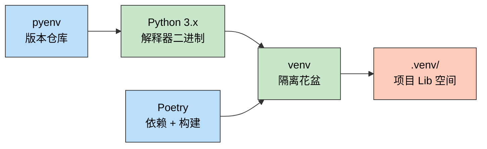
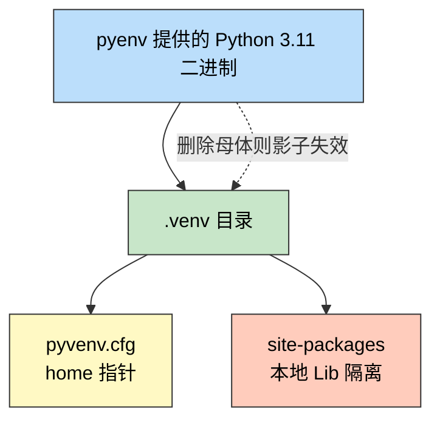
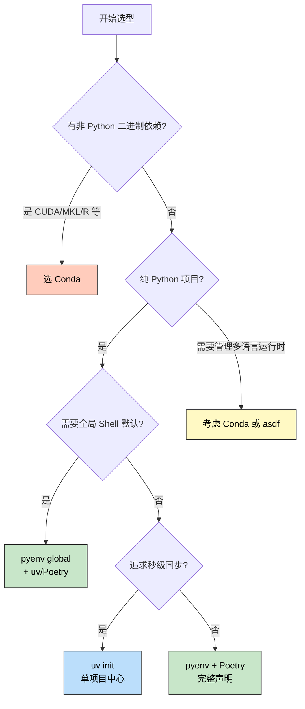

> 一句话定位：这是一篇帮助 Java 工程师跨越语言鸿沟的笔记，从"我曾以为"出发，经过心智重构，最终确定工程方案。

> 核心理念：pyenv 是仓库，venv 是花盆，Poetry 是园丁，uv 是高速园丁，Conda 是装甲实验室——理解生态位，比记住 API 更重要。

---

## 3 分钟速览版

<details>
<summary><strong>点击展开核心概念图与对标表</strong></summary>

### Python 工具链全景



### Python vs Java 工具对标

| 职责 | Python 工具 | Java 工具 | 核心差异 |
|------|-------------|-----------|----------|
| 版本管理 | pyenv | SDKMAN! | 职责对等，均管理语言版本二进制文件 |
| 依赖隔离 | venv | Classpath / Module Path | venv 是 Thin Wrapper（影子），非独立 Fat Binary |
| 构建/依赖 | Poetry | Maven / Gradle | Poetry 兼管环境创建，Maven 不负责 JDK 切换 |
| 项目工具（新） | uv | Maven（部分功能） | uv 集版本管理、依赖、环境于一身，项目中心，秒级同步 |
| 重型隔离 | Conda | 无直接对应 | Conda 处理非 Python 二进制（CUDA/R），Java 无此需求 |

### 何时选哪个工具

- 纯 Python 项目（Web、CLI、爬虫），追求快速迭代 → **pyenv + uv**（现代方案）
- 纯 Python 项目，追求完整声明和 lock 精度 → pyenv + Poetry
- 科学计算 / ML / CUDA / R 混合场景 → Conda
- 全局 Shell 层默认版本 → 必须用 pyenv

</details>

---

## 1. 初始误解：思维定势的碰撞

### 1.1 误区 A：把 venv 和 pyenv 当作同一层

我曾以为 venv 和 pyenv 是同一层级的工具：一个轻量（venv），一个重量（Conda）。实际上这两者根本不在同一个"层"：

- pyenv 管理的是 Python 解释器本身的二进制文件，属于版本管理层
- venv 管理的是某个项目的依赖隔离空间，属于项目环境层

两者是依赖关系，不是并列关系。先有 pyenv 提供解释器，venv 才能基于它创建环境。

### 1.2 误区 B：为什么 PyCharm 把 Poetry 和 venv 并列？

基于 Java 经验，我认为 Poetry = Maven（构建工具），不应与"JDK 级别"的 venv/Conda 并列出现在 PyCharm 的解释器选择面板里。

这个困惑的根源在于：Maven 不能创建 JDK，但 Poetry 可以自动创建 venv 并将其与项目绑定。PyCharm 把 Poetry 列在那里，是因为 Poetry 会在背后帮你 `python -m venv .venv`，再把项目解释器指向这个 venv。Poetry 兼管了"园丁 + 花盆"两层职责，这是 Java 世界里 Maven 从未有过的设计。

### 1.3 误区 C：Conda 套 venv 的套娃模式

为了满足"Lib 在项目内"的洁癖，我尝试了 Conda 母体 -> venv 子体 的嵌套方式：先用 Conda 创建基础环境，再在该环境上 `python -m venv .venv`，试图把依赖锁在项目目录里。

这条路看上去合理，实则埋下了路径破碎的定时炸弹，下文将详细说明。

## 2. 逻辑突破：影子与克隆

### 2.1 pyvenv.cfg 的真相

创建 venv 后，进入 `.venv/` 目录，会看到一个 `pyvenv.cfg` 文件：

```ini
home = /path/to/.pyenv/versions/3.11.8/bin
include-system-site-packages = false
version = 3.11.8
```

`home` 字段揭示了 venv 的本质：它只是一个指针，指向真实的 Python 二进制文件。

Java 世界里，JDK 是完整的 Fat Binary，包含 JVM、标准库、工具链，删掉 JDK 8 不影响 JDK 17。但 venv 不是这样。

### 2.2 venv 的依赖关系链



核心结论：venv 是影子，不是克隆。如果删除或升级了 pyenv 中的母体解释器，`.venv` 中的 python 命令就会指向不存在的路径，环境立刻失效。

### 2.3 工具生态位重新定义

用园艺比喻理解这五个工具：

- **pyenv = 种子仓库（Warehouse）**：储备 Python 3.9 / 3.10 / 3.11 等不同品种的种子（解释器二进制），提供全局 Shim 接口
- **venv = 花盆（Flowerpot）**：为每个项目提供独立生长空间，把根系（Lib）锁在项目内部
- **Poetry = 自动化园丁（Gardener）**：从仓库领种子、种在花盆里，还负责记录土壤配方（pyproject.toml 和 lock 文件）
- **uv = 高速园丁（Express Gardener）**：新一代项目工具，秒级同步，自动取种、种植、记录，集版本管理+依赖管理+环境隔离于一身，但本质上仍是项目中心
- **Conda = 重型装甲实验室（Lab）**：当你需要 CUDA、MKL、R 语言等非 Python 二进制依赖时才请它出场

## 3. 技术对标：pyenv/venv/Poetry/uv vs SDKMAN!/Classpath/Maven

| 维度 | Python 方案 | Java 方案 | 关键差异 |
|------|-------------|-----------|----------|
| 版本切换方式 | `pyenv global 3.11` | `sdk use java 17-tem` | 机制相同，均修改 PATH 前缀 |
| 隔离实现机制 | `.venv/` 目录下的 Thin Wrapper | JVM Classpath / Module Path | Python 是文件系统隔离，Java 是 ClassLoader 隔离 |
| 环境与源码关系 | venv 是影子，依赖母体存活 | JDK 是独立 Fat Binary | Python 环境不可跨机迁移，Java JDK 可复制 |
| 依赖声明格式 | `pyproject.toml` + `poetry.lock` | `pom.xml` + 仓库快照 | lock 文件功能对等，均支持精确版本锁定 |
| 构建工具是否管环境 | Poetry 自动创建 venv | Maven 不安装 JDK | 这是 PyCharm 将 Poetry 列在解释器面板的根本原因 |
| uv 的项目中心特质 | uv 自动下载、管理版本，但缺乏全局 Shim | Maven 不管项目外的依赖 | uv 强于项目内速度，弱于全局 Shell 层管理 |
| 非语言二进制依赖 | Conda 专门处理 | Maven 不处理 native lib | Java 依赖通常是纯 JAR，Python 科学计算需要 C/CUDA 扩展 |

## 4. 避坑指南：为什么"Conda 套 venv"是路径破碎的风险点

### 4.1 链式依赖的本质风险

Conda 套 venv 的结构是：系统 Python -> Conda Base -> Conda Env -> venv。每增加一层，路径就多一次间接引用。当你做以下任何一件事时，整条链都可能断裂：

- 更新 Conda（`conda update conda`）
- 重建 Conda 环境（`conda env remove` + recreate）
- 将项目迁移到新机器
- 在 CI/CD 中按照文档复现环境

### 4.2 具体的破碎表现

运行 Python 时报错 `No such file or directory: /opt/conda/envs/myenv/bin/python3.11`，尽管你的 `.venv` 目录还在，但它指向的母体已不复存在。在 CI 环境中更难调试，因为日志显示 venv 已激活，但 `python --version` 报错或 import 路径异常。

### 4.3 工具选型决策树



### 4.4 方案对比

| 方案 | 链路层数 | 迁移风险 | 项目覆盖 | 推荐场景 |
|------|----------|----------|----------|----------|
| Conda 套 venv | 4 层 | 高，任意层更新都可能破碎 | 全局+项目 | 不推荐作为常规工程方案 |
| 纯 Conda | 2 层 | 中，Conda 更新有风险 | 全局+项目 | 科学计算、ML 重型依赖 |
| pyenv + venv | 2 层 | 低，pyenv 母体稳定 | 全局+项目 | 通用 Python 项目 |
| pyenv + Poetry | 2 层 | 低，Poetry 全自动管理 venv | 全局+项目 | 完整声明、lock 精度要求高 |
| pyenv（全局）+ uv（项目） | 2 + 1 层 | 低，uv 项目独立性强 | 全局+项目 | **现代方案**：Shell 稳定性 + 项目秒级同步 |

## 5. 最终工程方案

### 5.1 选型结论

选型方案为 **pyenv（版本管理） + Poetry（依赖管理） + in-project venv（隔离）**，三者各司其职，无重叠也无冲突：

- pyenv 确保解释器版本可控、可切换
- Poetry 确保依赖声明完整、版本可锁定
- in-project venv 确保依赖物理隔离在项目目录内，类似 `node_modules`

### 5.2 关键配置

启用 in-project 模式，让 `.venv` 出现在项目根目录而非全局缓存：

```bash
poetry config virtualenvs.in-project true
```

启用后，项目目录结构变为：

```text
my-project/
├── .venv/           # 依赖隔离在这里，加入 .gitignore
├── pyproject.toml   # 依赖声明（对标 pom.xml）
├── poetry.lock      # 版本锁定（对标 mvn dependency:tree 快照）
└── src/
```

### 5.3 评价指标：环境的瞬时重建能力

不追求"这个环境用了两年从未重建"，而追求"任何人在任何机器上执行一条命令就能完全复现"：

```bash
poetry install  # 根据 pyproject.toml + poetry.lock 秒级重建
```

这与 Java 的 `mvn install` 理念完全一致。`pyproject.toml` 就是你的 `pom.xml`，`poetry.lock` 就是精确锁定的 snapshot。

## 6. 实战指南：macOS 行动清单

### 6.1 安装 pyenv

```bash
# 使用 Homebrew 安装 pyenv
brew install pyenv

# 安装 Python 编译所需的构建依赖（避免后续安装版本时报错）
brew install openssl readline sqlite3 xz zlib tcl-tk
```

### 6.2 配置 ~/.zshrc

将以下内容追加到 `~/.zshrc`：

```bash
# pyenv 初始化
export PYENV_ROOT="$HOME/.pyenv"
export PATH="$PYENV_ROOT/bin:$PATH"
eval "$(pyenv init -)"
```

配置生效：

```bash
source ~/.zshrc
pyenv --version   # 应输出 pyenv 2.x.x
```

### 6.3 安装并设置 Python 版本

```bash
# 查看可用的 Python 版本
pyenv install --list | grep "3.11"

# 安装指定版本
pyenv install 3.11.8

# 设置全局默认版本
pyenv global 3.11.8

# 验证
python --version   # Python 3.11.8
```

### 6.4 安装 Poetry

```bash
# 官方推荐安装方式（不依赖当前 Python 环境，避免污染）
curl -sSL https://install.python-poetry.org | python3 -

# 将 Poetry 加入 PATH（追加到 ~/.zshrc）
export PATH="$HOME/.local/bin:$PATH"

# 重新加载并验证
source ~/.zshrc
poetry --version
```

### 6.5 配置 in-project 模式

```bash
# 全局设置：所有新项目的 venv 都放在项目根目录
poetry config virtualenvs.in-project true

# 验证配置
poetry config --list | grep in-project
```

### 6.6 创建第一个项目

```bash
# 新建项目（Poetry 自动生成 pyproject.toml）
poetry new my-project
cd my-project

# 指定 Python 版本（使用 pyenv 已安装的版本）
poetry env use 3.11.8

# 添加依赖
poetry add requests

# 安装所有依赖（首次或 git pull 后执行）
poetry install

# 查看当前环境信息
poetry env info
```

执行 `poetry install` 后，项目根目录会出现 `.venv/`，即你的隔离花盆。

## 7. 工具演进：为什么 uv 改变了游戏规则

### 7.1 uv 出现的背景

2024 年，Python 生态出现了新兵 **uv**——用 Rust 编写的超高速包管理器。它使得"全局 pyenv + 项目 uv"比"全局 pyenv + 项目 Poetry"更优，成为现代方案。

### 7.2 uv vs Poetry 的关键差异

| 维度 | Poetry | uv | 结论 |
|------|--------|-----|-------|
| 依赖同步速度 | 秒到数十秒 | 通常秒级 | **uv 胜** |
| 版本自动管理 | 需独立 pyenv | 内置下载（项目中心） | **需混合方案** |
| lock 文件精度 | poetry.lock 精确 | uv.lock 同样精确 | 平手 |
| 从 pip 迁移成本 | 需重组织 | 直接识别 requirements.txt | **uv 胜** |

### 7.3 为什么 pyenv 仍然不能被 uv 完全替代

#### 场景 1：全机默认 Python（Shell 层）

当你在任何地方输入 `python`，应该直接启动哪个版本？pyenv Shim 在 Shell 层接管，无需 `uv run`。uv 的项目中心设计不适合这个全局场景。

#### 场景 2：IDE 寻找物理解释器路径

IDE 插件和自动化工具通常需要一个物理路径（如 `/usr/bin/xxx`）。pyenv 的 ~/.pyenv/versions/{version}/bin/python 路径绝对固定，即使删除项目也失效；uv 缓存可能被清理。

#### 场景 3：极客版本编译

pyenv install --patch 允许源码定制编译；uv 只能下载官方构建版本。

#### 场景 4：全局系统工具

ansible、glances 这样的工具需要一个稳定的全局 Python，不能依赖项目 uv 环境（项目删除就失效）。

### 7.4 新时代的工具分工

**关键洞察**：项目内的重活、累活、快活全给 uv；Shell 层的脸面、全局的规矩、工具的根基留给 pyenv。

```bash
# 全局层（一次性设置）
pyenv global 3.12.8           # Shell Shim 接管

# 项目层（秒级操作）
cd my-project
uv init --python 3.12       # 自动创建 .venv + pyproject.toml
uv add requests             # 秒级添加依赖
uv sync                     # 秒级同步
uv run python main.py       # 自动激活运行
```

### 7.5 Poetry 还是 uv？

| 场景 | 推荐 | 原因 |
|------|------|-------|
| 新项目、个人、快速迭代 | **uv** | 秒级体验 |
| 已上线稳定项目、大团队 | **Poetry** | lock 精度、社区成熟 |
| 库作者、版本控制复杂 | **Poetry** | pyproject.toml 标准化程度高 |
| ML/数据科学（需 CUDA） | **Conda + uv** | Conda 管非二进制依赖 + uv 管 Python 包 |

## 8. 故障排查

### 问题 1：pyenv: command not found

**症状**：安装后终端提示 `pyenv: command not found`。

**原因**：`~/.zshrc` 中 pyenv 初始化脚本未生效，或未重新加载 shell。

**解决方案**：

```bash
# 检查 .zshrc 是否包含 pyenv 配置
grep -n "pyenv" ~/.zshrc

# 强制重新加载
source ~/.zshrc
```

### 问题 2：python --version 显示的不是 pyenv 管理的版本

**症状**：`pyenv global 3.11.8` 后，`python --version` 仍显示系统 Python 或 Conda Python。

**原因**：PATH 中其他 Python 路径优先于 pyenv shims。

**解决方案**：

```bash
# 检查 python 实际指向
which python

# 确认 pyenv 的 PATH 设置处于 ~/.zshrc 最靠前位置
# export PATH="$PYENV_ROOT/bin:$PATH" 必须在 Conda 初始化之前
echo $PATH
```

### 问题 3：poetry install 后找不到 .venv 目录

**症状**：`poetry install` 成功，但项目根目录没有 `.venv/`。

**原因**：`virtualenvs.in-project` 未设置为 `true`，Poetry 将 venv 存放在全局缓存目录。

**解决方案**：

```bash
poetry config virtualenvs.in-project true

# 删除旧的 venv 并重建
poetry env remove python
poetry install
```

### 问题 4：迁移到新机器后 venv 失效

**症状**：复制项目到新机器后，`.venv/python` 指向原机器的绝对路径，无法执行。

**原因**：venv 中的路径是硬编码的绝对路径，不可跨机器移植（这正是"venv 是影子"的具体体现）。

**解决方案**：

```bash
# 不要复制 .venv 目录，将 .venv 加入 .gitignore
# 在新机器上安装 pyenv + Poetry 后，进入项目目录执行：
poetry install   # 根据 pyproject.toml 和 poetry.lock 自动重建
```

## 常见问题（FAQ）

### Q1：pyenv 和 asdf 有什么区别，该用哪个？

**A：** `asdf` 是通用版本管理器，可以管理 Node.js、Ruby、Go 等多种语言，Python 只是其一个插件。`pyenv` 专注 Python，更轻量，配置更简单。如果你只需要管理 Python，`pyenv` 足够；如果你同时需要管理多种语言运行时，`asdf` 更统一。

### Q2：Poetry 和 pip + requirements.txt 有什么本质区别？

**A：** `pip + requirements.txt` 是"记录"工具：你先手动安装，再 `pip freeze > requirements.txt` 输出快照。`Poetry` 是"声明"工具：你在 `pyproject.toml` 里声明依赖范围，Poetry 自动解析、锁定、安装。最大区别是 Poetry 生成 `poetry.lock` 精确锁定版本，确保任意机器任意时间 `poetry install` 的结果完全一致，与 Maven 锁定 `pom.xml` 的方式高度一致。

### Q3：什么场景下仍然应该用 Conda？

**A：** 三种场景适合 Conda：ML 项目需要 CUDA 工具链（cuDNN、TensorRT）；科学计算需要 MKL/BLAS 等 C 语言数学库；需要同时管理 Python 和 R 的混合项目。纯 Python 的 Web 服务、爬虫、CLI 工具，pyenv + Poetry 完全够用。

### Q4：.venv 目录应该提交到 Git 吗？

**A：** 不应该。`.venv` 是可重建的产物，应当加入 `.gitignore`。只需提交 `pyproject.toml`（依赖声明）和 `poetry.lock`（版本锁定），任何人执行 `poetry install` 都能得到完全相同的环境。这与 Java 项目中不提交 `target/` 目录是同样的道理。

### Q5：Poetry 创建的 venv 和手动 python -m venv .venv 有什么区别？

**A：** 功能上没有本质区别，两者最终都调用 `python -m venv` 创建隔离环境。区别在于管理方式：手动创建的 venv 需要自己 activate/deactivate 并维护 `requirements.txt`；Poetry 创建的 venv 由 Poetry 全程托管，依赖增删通过 `poetry add/remove` 操作，`poetry run python` 无需手动激活。

### Q6：多个 Python 项目如何快速切换版本？

**A：** 在项目根目录创建 `.python-version` 文件，pyenv 会在 `cd` 进入该目录时自动切换到指定版本：

```bash
# 在项目目录内设置局部版本
pyenv local 3.10.12

# 查看效果（会在项目根目录生成 .python-version 文件）
cat .python-version
```

### Q7：uv 和 Poetry 我应该用哪个？

**A：** 

用 **uv** 如果：
- 新项目或快速迭代项目
- 追求秒级依赖同步
- 正从 pip/requirements.txt 迁移
- 个人项目或小团队

用 **Poetry** 如果：
- 已上线的稳定生产项目
- 大团队需要 lock 文件精确控制
- 库作者，需要发布到 PyPI
- 依赖版本控制复杂（如语义化版本约束）

**简答**：新项目用 uv（快），生产项目用 Poetry（稳）。

### Q8：uv 会不会完全替代 pyenv？

**A：** 不会。虽然 uv 内置版本下载能力，但无法替代 pyenv 的 4 个场景：
- **全机 Shell 默认**：`python` 命令需要 pyenv Shim
- **IDE 物理路径**：IDE 插件需要固定的解释器路径
- **源码定制编译**：pyenv install --patch 的灵活性 uv 没有
- **全局系统工具**：ansible、glances 这类需要稳定全局版本

**最优方案**：pyenv（全局 + Shim）+ uv（项目）= 既快又稳。

### Q9：能不能在 Conda 环境里用 uv？

**A：** 完全可以，这是 ML/数据科学项目的黄金搭配：

```bash
# 1. Conda 管理非 Python 二进制（CUDA、MKL、R）
conda create -n ml-env python=3.11 cuda cudnn
conda activate ml-env

# 2. 在 Conda 环境里用 uv 管 Python 包
uv init --python 3.11
uv add torch transformers
uv sync
```

这样既得到了 CUDA 支持，又享受 uv 的秒级同步。

## 总结

### 核心要点

1. **venv 是影子，不是克隆**：它依赖母体解释器存活，理解这一点是摆脱 Java 惯性思维的第一步。
2. **四个工具层次分明、各司其职**：pyenv 管全局版本，uv/Poetry 管项目依赖和环境，venv 管隔离，Conda 管非 Python 二进制。
3. **Conda 套 venv 是反模式**：链路越长迁移风险越高，在非必要场景中应避免嵌套。
4. **现代方案：pyenv（全局 Shim）+ uv（项目快速迭代）**：既稳又快，是当下 Python 生态的最优实践。

### 行动建议

#### 今天就可以做的

- 运行 `brew install pyenv` 并按本文配置 `~/.zshrc`
- 安装 `uv`：`curl -LsSf https://astral.sh/uv/install.sh | sh`
- 设置全局 Python：`pyenv global 3.12.8`

#### 本周可以优化的

- **新项目**：用 `uv init` 快速启动，体验秒级同步
- **现有项目**：如果用 Poetry，可逐步迁移到 uv（`uv sync --all-extras`）
- 如果有旧 Conda 环境占用空间，清理只保留 2-3 个稳定版本给全局工具

#### 长期可以改进的

- 在 CI/CD 中用 `pyenv + uv sync` 替换 Conda（非科学计算项目）
- 建立个人的 `pyproject.toml` 模板，统一依赖声明风格
- 定期检查 pyenv 版本列表，按照新项目建议只保留核心版本

### 最后的建议

> 项目内的重活、累活、快活：全给 uv。Shell 层的脚面、全局的规矩、工具的根基：留给 pyenv。不以“学会了多少 API”为本事，而以“对代码运行路径的绝对控制”为本事。

---

## 更新记录

| 版本 | 日期 | 说明 |
|------|------|------|
| v1.0 | 2026-03-31 | 初始版本 |
| v1.1 | 2026-04-08 | 补充 uv 为现代方案，介绍 uv 与 pyenv 的分工配合，添加 Q7-Q9 FAQ 问题 |
