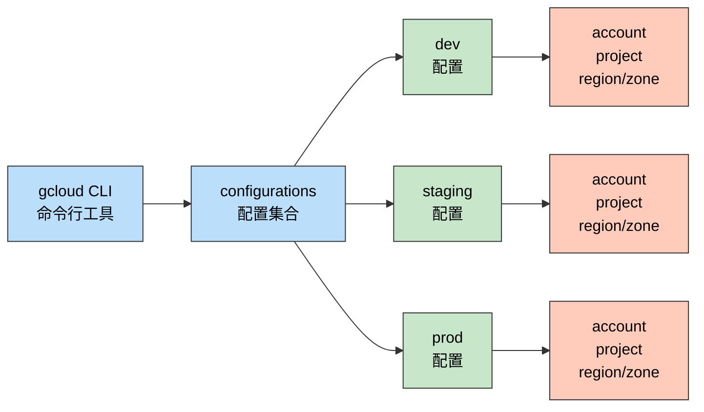
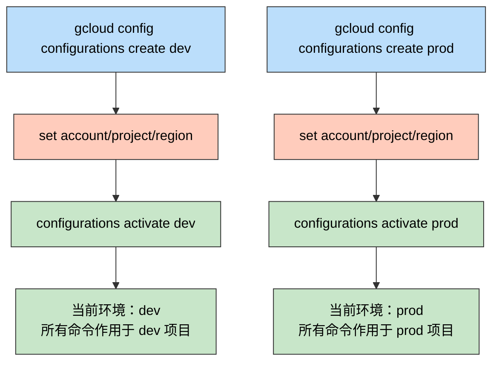

> 一句话定位：这是一篇帮助 Java 工程师快速上手 gcloud CLI
> 并掌握多环境配置管理的实战笔记。

> 核心理念：一套 gcloud CLI，N 个 configurations，
> 像 Spring Profiles 一样按需切换 dev/staging/prod，
> 告别手动 `gcloud config set` 的重复劳动。

---

## 3 分钟速览版

<details>
<summary><strong>点击展开核心概念图与速查表</strong></summary>

### gcloud config 架构概览



<details>
<summary>**🖼️ 插图版（2026-04-17 增量补充）**</summary>


</details>

### 常用命令速查

| 类别 | 命令 | 说明 |
|------|------|------|
| 认证 | `gcloud auth login` | 浏览器登录（CLI 使用） |
| 认证 | `gcloud auth application-default login` | ADC 登录（应用使用） |
| 配置 | `gcloud config list` | 查看当前配置 |
| 配置 | `gcloud config set project PROJECT_ID` | 设置项目 |
| 多配置 | `gcloud config configurations create dev` | 创建命名配置 |
| 多配置 | `gcloud config configurations activate dev` | 切换到指定配置 |
| 多配置 | `gcloud config configurations list` | 列出所有配置 |
| 计算 | `gcloud compute instances list` | 列出虚拟机 |
| 存储 | `gsutil ls` | 列出存储桶 |
| IAM | `gcloud iam service-accounts list` | 列出服务账号 |

### gcloud 与 Spring 配置体系对标

| 概念 | gcloud | Spring Boot / Maven |
|------|--------|---------------------|
| 定义环境 | `configurations create dev` | `application-dev.yml` |
| 切换环境 | `configurations activate dev` | `--spring.profiles.active=dev` |
| 环境变量覆盖 | `CLOUDSDK_ACTIVE_CONFIG=dev` | `SPRING_PROFILES_ACTIVE=dev` |
| 查看激活状态 | `configurations list` | 启动日志 "active profiles: dev" |
| 单次覆盖 | `--project=other-project` | 无对等方案（JVM 级别） |

</details>

---

## 1. 工具概述

### 1.1 gcloud CLI 是什么

gcloud CLI 是 Google Cloud SDK 的核心组件，是与 GCP 交互的主要命令行工具。
Google Cloud SDK 除 gcloud 外还包含：

- `gsutil`：Cloud Storage 专用工具
- `bq`：BigQuery 专用工具
- `kubectl`：Kubernetes 集群管理（通过 GKE 集成）

对于 Java 工程师来说，gcloud CLI 的定位相当于 Maven/Gradle CLI 在构建领域的角色——
它是操控云基础设施的标准工具，而 GCP Console 则是对应的 IDE 图形界面。

### 1.2 为什么用 CLI 而不是 Console

| 场景 | CLI 优势 | Console 优势 |
|------|----------|-------------|
| 重复操作 | 可脚本化，一键执行 | 可视化，适合首次探索 |
| CI/CD 集成 | 天然集成，无须截图 | 不适合自动化 |
| 资源批量管理 | 循环 + 管道组合命令 | 逐个点击 |
| 审计/复现 | 命令即记录 | 操作历史分散 |
| 团队协作 | 命令可 review、可版本控制 | 操作无法共享 |

### 1.3 与其他云 CLI 对比

| 维度 | gcloud CLI | AWS CLI | Azure CLI |
|------|-----------|---------|-----------|
| 所属云 | Google Cloud | AWS | Azure |
| 多配置支持 | 一等公民：named configurations | Profile 机制 | Subscription 切换 |
| 安装（macOS） | `brew install google-cloud-sdk` | `brew install awscli` | `brew install azure-cli` |
| 配置切换命令 | `configurations activate` | `--profile` | `az account set` |
| ADC 支持 | `auth application-default login` | `aws configure` | `az login` |

---

## 2. 快速上手

### 2.1 安装

macOS 推荐用 Homebrew 安装：

```bash
# 安装 Google Cloud SDK（含 gcloud、gsutil、bq）
brew install google-cloud-sdk
```

安装后将 Shell 补全加入 `~/.zshrc`：

```bash
# 添加到 ~/.zshrc
source "$(brew --prefix)/share/google-cloud-sdk/path.zsh.inc"
source "$(brew --prefix)/share/google-cloud-sdk/completion.zsh.inc"
```

重启终端或执行 `source ~/.zshrc` 生效。

### 2.2 初始化

```bash
# 交互式初始化：登录账号、选择项目、配置默认 region
gcloud init
```

`gcloud init` 会引导你完成以下步骤：

1. 打开浏览器完成 Google 账号授权
2. 列出你有权访问的 GCP 项目，选择默认项目
3. 可选：设置默认 compute region 和 zone

### 2.3 认证：两种 login 的区别

这是初学者最常见的困惑点。

```bash
# 1. CLI 认证：供 gcloud 命令本身使用
gcloud auth login

# 2. ADC 认证：供本地应用（如 Spring Boot）使用
gcloud auth application-default login
```

| | `auth login` | `auth application-default login` |
|--|-------------|----------------------------------|
| 用途 | gcloud CLI 执行命令 | 本地应用调用 GCP API |
| 对应场景 | 在终端运行 `gcloud compute instances list` | Spring Boot 调用 Cloud Storage SDK |
| 凭据存储位置 | `~/.config/gcloud/credentials.db` | `~/.config/gcloud/application_default_credentials.json` |
| 类比 | 登录你的 IDE 账号 | 给本地 JVM 配置运行时凭证 |

如果你既要用 gcloud 命令，又要在本地开发调用 GCP API，两个都需要执行。

### 2.4 验证安装

```bash
# 查看当前配置（账号、项目、region）
gcloud config list

# 列出你有权访问的项目
gcloud projects list

# 手动设置当前项目
gcloud config set project YOUR_PROJECT_ID
```

---

## 3. 核心命令

### 3.1 Compute Engine

```bash
# 列出虚拟机实例
gcloud compute instances list

# 创建实例（最小化示例）
gcloud compute instances create my-vm \
  --zone=asia-east1-b \
  --machine-type=e2-micro \
  --image-family=debian-12 \
  --image-project=debian-cloud

# SSH 登录实例
gcloud compute ssh my-vm --zone=asia-east1-b

# 删除实例
gcloud compute instances delete my-vm --zone=asia-east1-b
```

### 3.2 Cloud Storage（gsutil）

```bash
# 列出存储桶
gsutil ls

# 列出桶内文件
gsutil ls gs://my-bucket/

# 上传文件
gsutil cp local-file.txt gs://my-bucket/

# 创建存储桶
gsutil mb -l ASIA-EAST1 gs://my-new-bucket
```

### 3.3 IAM

```bash
# 列出服务账号
gcloud iam service-accounts list

# 创建服务账号
gcloud iam service-accounts create my-sa \
  --display-name="My Service Account"

# 为项目绑定 IAM 角色
gcloud projects add-iam-policy-binding PROJECT_ID \
  --member="serviceAccount:my-sa@PROJECT_ID.iam.gserviceaccount.com" \
  --role="roles/storage.objectViewer"
```

### 3.4 GKE（Kubernetes）

```bash
# 列出集群
gcloud container clusters list

# 获取集群凭据（更新 kubeconfig）
gcloud container clusters get-credentials my-cluster \
  --zone=asia-east1-b
```

### 3.5 服务管理

```bash
# 列出已启用的 API
gcloud services list --enabled

# 启用某个 API
gcloud services enable storage.googleapis.com
```

---

## 4. 多配置管理

这是本文的核心章节。如果你只需要管理单个 GCP 项目，前几章已够用。
但如果你需要在多个项目、多个账号之间频繁切换，configurations 是你真正需要掌握的能力。

### 4.1 为什么需要多配置管理

**痛点场景**：

- 公司有 dev、staging、prod 三套 GCP 项目，每次切换要手动 `gcloud config set`
- 工作账号和个人账号都需要使用 GCP CLI
- 团队新人入职，需要快速设置标准化的 CLI 环境

没有 configurations 时，切换环境的流程是：

```bash
# 每次切换都要手动执行这一堆命令
gcloud config set account dev@company.com
gcloud config set project my-project-dev
gcloud config set compute/region asia-east1
gcloud config set compute/zone asia-east1-b
```

有了 configurations，只需要：

```bash
gcloud config configurations activate dev
```

### 4.2 创建 configurations

```bash
# 创建 dev 配置（创建后自动激活）
gcloud config configurations create dev

# 为 dev 配置设置属性
gcloud config set account dev@company.com
gcloud config set project my-project-dev
gcloud config set compute/region asia-east1
gcloud config set compute/zone asia-east1-b

# 创建 prod 配置
gcloud config configurations create prod

# 为 prod 配置设置属性
gcloud config set account ops@company.com
gcloud config set project my-project-prod
gcloud config set compute/region asia-northeast1
gcloud config set compute/zone asia-northeast1-a
```

注意：`create` 命令会自动切换到新建的配置，之后执行的 `config set`
都是在给这个新配置设置属性。

### 4.3 切换与查看



<details>
<summary>**🖼️ 插图版（2026-04-17 增量补充）**</summary>


</details>

```bash
# 列出所有配置（IS_ACTIVE 列显示当前激活的）
gcloud config configurations list

# 输出示例：
# NAME     IS_ACTIVE  ACCOUNT             PROJECT           DEFAULT_ZONE
# default  False      -                   -                 -
# dev      True       dev@company.com     my-project-dev    asia-east1-b
# prod     False      ops@company.com     my-project-prod   asia-northeast1-a

# 切换到 prod
gcloud config configurations activate prod

# 查看当前配置详情
gcloud config list
```

### 4.4 CLOUDSDK_ACTIVE_CONFIG 环境变量

除了 `activate` 命令，还可以通过环境变量控制激活的配置：

```bash
# 临时为单次命令使用 prod 配置（不改变全局状态）
CLOUDSDK_ACTIVE_CONFIG=prod gcloud compute instances list

# 为整个 Shell 会话设置（当前终端窗口内有效）
export CLOUDSDK_ACTIVE_CONFIG=staging

# 在 CI/CD 脚本中指定配置
CLOUDSDK_ACTIVE_CONFIG=prod ./deploy.sh
```

这和 Spring Boot 的 `SPRING_PROFILES_ACTIVE` 环境变量是完全一样的设计思路：
环境变量优先级高于代码/命令中的默认值，适合在不同执行环境（本地、CI、生产）中灵活控制。

### 4.5 删除配置

```bash
# 删除不再使用的配置
gcloud config configurations delete old-config
```

### 4.6 Spring Profiles 类比深入

| 工作流步骤 | gcloud | Spring Boot |
|-----------|--------|-------------|
| 定义环境 | `configurations create dev` | 创建 `application-dev.yml` |
| 设置属性 | `config set project/account/region` | 在 YAML 中写 datasource/endpoint |
| 激活环境 | `configurations activate dev` | `--spring.profiles.active=dev` |
| 环境变量激活 | `CLOUDSDK_ACTIVE_CONFIG=dev` | `SPRING_PROFILES_ACTIVE=dev` |
| 查看激活状态 | `configurations list`（IS_ACTIVE 列） | 启动日志 "The following profiles are active" |
| 单次覆盖 | `--project=other-project` 参数 | 无直接对等方案 |
| 配置文件位置 | `~/.config/gcloud/configurations/` | `src/main/resources/` |

---

## 5. 进阶技巧

### 5.1 --project 临时覆盖

不想切换全局配置时，用 `--project` 为单次命令指定项目：

```bash
# 当前激活 dev 配置，但临时查看 prod 项目的资源
gcloud compute instances list --project=my-project-prod
```

当你需要跨项目比较资源时很有用，不需要来回切换配置。

### 5.2 --format 格式化输出

对脚本化非常有用：

```bash
# JSON 格式（方便 jq 处理）
gcloud compute instances list --format=json

# 自定义表格列
gcloud projects list --format="table(projectId,name,projectNumber)"

# CSV 格式（方便导入 Excel）
gcloud compute instances list --format=csv[no-heading](name,zone,status)
```

### 5.3 CI/CD 环境中的配置

在 CI/CD 中，避免使用交互式 `gcloud init`，改用以下方式：

```bash
# 用服务账号密钥认证（适合自托管 CI/CD）
gcloud auth activate-service-account \
  --key-file=/path/to/sa-key.json

# 用环境变量设置项目（不依赖 configurations）
export CLOUDSDK_CORE_PROJECT=my-project-prod
export CLOUDSDK_COMPUTE_REGION=asia-east1

# --quiet 参数：抑制交互式提示（适合脚本）
gcloud compute instances delete my-vm --quiet
```

GitHub Actions 推荐方案：

```yaml
# 在 GitHub Actions 中使用 Workload Identity Federation
- uses: google-github-actions/auth@v2
  with:
    workload_identity_provider: 'projects/123/locations/global/...'
    service_account: 'my-sa@project.iam.gserviceaccount.com'

- uses: google-github-actions/setup-gcloud@v2
```

### 5.4 在 Shell Prompt 中显示当前配置

在 `~/.zshrc` 中添加，让 Prompt 显示当前激活的 gcloud 配置：

```bash
# 在 Prompt 中显示当前 gcloud 配置名
gcloud_prompt() {
  local config
  config=$(gcloud config configurations list \
    --filter="IS_ACTIVE=true" \
    --format="value(name)" 2>/dev/null)
  echo "${config}"
}

# 添加到 PROMPT（zsh 示例）
PROMPT='%n@%m %~$([ -n "$(gcloud_prompt)" ] && echo " [gcloud:$(gcloud_prompt)]") %# '
```

---

## 6. 最佳实践

### 6.1 命名规范

推荐命名格式：`{env}` 或 `{env}-{service-short-name}`

```text
dev
staging
prod
dev-backend
prod-dataplatform
```

避免使用项目 ID 直接作为配置名——配置名应体现"环境角色"，项目 ID 放在配置属性里。

### 6.2 安全建议

- 不要将服务账号密钥文件 (`sa-key.json`) 提交到代码仓库
- CI/CD 优先使用 Workload Identity Federation，避免长期有效的密钥文件
- 定期审查 `gcloud config configurations list`，删除过期配置

### 6.3 团队协作

为团队维护一个配置初始化脚本：

```bash
#!/bin/bash
# scripts/setup-gcloud.sh
# 团队成员执行此脚本，快速建立标准配置

# Dev 环境配置
gcloud config configurations create dev
gcloud config set account "$1"          # 传入账号参数
gcloud config set project my-project-dev
gcloud config set compute/region asia-east1
gcloud config set compute/zone asia-east1-b

# Staging 环境配置
gcloud config configurations create staging
gcloud config set account "$1"
gcloud config set project my-project-staging
gcloud config set compute/region asia-east1
gcloud config set compute/zone asia-east1-b

echo "配置完成。使用 gcloud config configurations activate dev 切换到 dev 环境。"
```

### 6.4 实践清单

| 实践 | 收益 |
|------|------|
| 统一配置命名规范 | 团队成员无歧义，降低认知成本 |
| 定期删除废弃配置 | 减少切换时的干扰项 |
| CI/CD 使用服务账号认证 | 避免交互式提示，安全可审计 |
| 维护团队初始化脚本 | 新成员快速上手，避免配置漂移 |
| 不提交 SA 密钥文件 | 安全底线 |

---

## 7. 故障排查

| 症状 | 原因 | 解决方案 |
|------|------|----------|
| `gcloud: command not found` | Cloud SDK 未加入 PATH | 在 `~/.zshrc` 添加 `source "$(brew --prefix)/share/google-cloud-sdk/path.zsh.inc"` 并重启终端 |
| `ERROR: There was a problem refreshing your current auth tokens` | 认证过期 | 重新执行 `gcloud auth login` |
| `The current account does not have access to project` | 激活的配置对应账号没有该项目权限 | 执行 `gcloud config configurations list` 确认当前激活的配置和账号 |
| `compute/region is not set` | 当前配置未设置 region | 执行 `gcloud config set compute/region REGION_NAME` |
| `gcloud init` 无法打开浏览器 | 无图形界面环境（如 SSH） | 使用 `gcloud auth login --no-browser` 获取授权码 |
| `WARNING: Could not find the default configured project` | 配置中未设置 project | 执行 `gcloud config set project PROJECT_ID` 或 `gcloud projects list` 查找 ID |

---

## 8. FAQ

### Q1：`gcloud auth login` 和 `gcloud auth application-default login` 到底有什么区别？

**A：** 两者面向不同的调用方。`auth login` 给 gcloud CLI 工具本身授权，你在终端执行的
所有 `gcloud compute`、`gcloud iam` 等命令都用这套凭证。`auth application-default login`
设置的是 Application Default Credentials（ADC），供本地运行的应用程序（比如 Spring Boot
调用 Google Cloud Storage SDK）使用。如果你只在终端运行 gcloud 命令，只需要第一个；
如果你同时在本地开发调用 GCP API 的应用，两个都需要执行。

### Q2：多配置模式和 `--project` 参数哪个更好用？

**A：** 两者用途不同，不是竞争关系。Configurations 是持久状态，适合"我接下来一段时间
都在处理 dev 环境"的场景，相当于 IDE 里切换工作空间。`--project` 是单次临时覆盖，
适合"大部分时间在 dev，偶尔需要看一眼 prod 的某个资源"。规律是：如果你要对同一个
环境执行多条命令，用 activate；如果只是临时跑一条命令，用 `--project`。

### Q3：`CLOUDSDK_ACTIVE_CONFIG` 环境变量的优先级是什么？

**A：** 环境变量优先级高于 `configurations activate` 设定的全局状态。这意味着你可以
有一个默认激活的配置，同时在特定终端会话或 CI Job 中用环境变量覆盖。这个设计和
`SPRING_PROFILES_ACTIVE` 覆盖代码里默认 profile 的机制完全一样。

### Q4：如何在 CI/CD 中使用 gcloud CLI？

**A：** CI/CD 中避免用户交互式认证，推荐两种方式：
一是服务账号密钥文件（`gcloud auth activate-service-account --key-file=sa-key.json`），
适合私有或自托管的 CI/CD 系统；
二是 Workload Identity Federation，GitHub Actions 推荐用
`google-github-actions/auth@v2` action，不需要下载密钥文件，安全性更高。
项目 ID 通过环境变量 `CLOUDSDK_CORE_PROJECT` 注入，避免写死在脚本里。

### Q5：gcloud CLI 和 Terraform 是什么关系，什么时候用哪个？

**A：** gcloud 是命令式的（"现在执行这个操作"），Terraform 是声明式的（"确保基础设施
处于这个状态"）。日常运维和调试用 gcloud；需要可复现、可 review、可回滚的基础设施
变更，用 Terraform。两者不互斥，很多团队用 Terraform 做资源 provisioning，
用 gcloud 做日常运维操作。

### Q6：configurations 存储在哪里，能跨机器同步吗？

**A：** 配置文件存储在 `~/.config/gcloud/configurations/`，每个 configuration 对应一个
纯文本 INI 文件（如 `config_dev`、`config_prod`）。技术上可以同步，但不推荐——
因为其中存储了 account 信息，且配置内容简单，更好的做法是维护一个团队共享的
初始化脚本，每台机器各自执行一次完成配置。

---

## 9. 总结

gcloud CLI 的多配置管理是一个相对小众但极其实用的功能。掌握它，你就能像
切换 Spring Profile 一样轻松管理多套 GCP 环境。

核心要点：

1. gcloud configurations 是 GCP 版的 Spring Profiles——命名的、可切换的、按环境隔离的属性集合
2. `create / activate / list / delete` 是多配置管理的完整生命周期
3. `CLOUDSDK_ACTIVE_CONFIG` 环境变量适合 CI/CD 和临时会话覆盖
4. 区分 `auth login`（CLI 用）和 `auth application-default login`（应用用）
5. CI/CD 优先 Workload Identity Federation，避免长期有效的密钥文件

分阶段行动建议：

- 今天：安装 gcloud CLI，执行 `gcloud init` 完成首次配置
- 本周：为开发和生产环境各创建一个 named configuration，体验 `activate` 切换
- 长期：为团队维护配置初始化脚本，在 CI/CD 中迁移到 Workload Identity Federation

---

## 更新记录

| 版本 | 日期 | 说明 |
|------|------|------|
| v1.0 | 2026-04-01 | 初始版本 |
| v1.1 | 2026-04-17 | 为 2 个 Mermaid 图表追加 Chiikawa 风格插图（m2c-pipeline 生成） |
