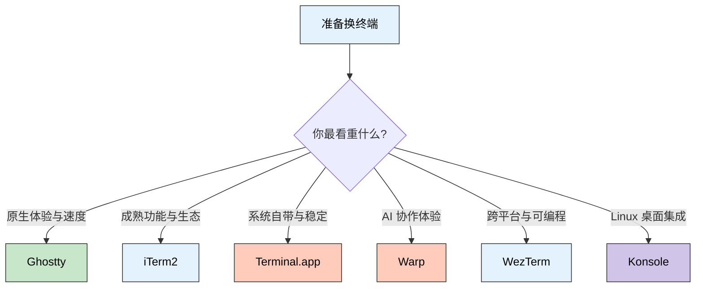

> **一句话定位**：这是一篇围绕一次真实 Ghostty 配置整理与迁移实践展开的终端迁移笔记，帮你判断是否值得从 `iTerm2` 切到 `Ghostty`。
>
> **核心理念**：终端迁移不该从零重来，而是把全局 Shell 环境和终端专属外观、Prompt 分层管理，先做到“可共存”，再决定“是否完全切换”。

---

## 3 分钟速览版

如果你已经长期使用 `iTerm2`，但开始被 `Ghostty` 的原生感、
速度感和更干净的界面吸引，最稳妥的迁移方式不是“今天立刻
全量切换”，而是：

- 保留原有开发环境变量和工具链配置
- 让 `Ghostty` 通过独立 `ZDOTDIR` 继承全局 `zsh`，再只在
  `Ghostty` 内覆盖 prompt
- 让 `Ghostty` 成为默认日常终端，`iTerm2` 继续做兜底工具

一句话建议：

- 你最在意原生体验、渲染手感和轻量感，优先试 `Ghostty`
- 你最依赖成熟功能、历史工作流和丰富配置，继续用 `iTerm2`
- 你只想稳定可用、不折腾，`Terminal.app` 仍然完全够用
- 你想要 AI 协作体验，可以看看 `Warp`
- 你追求跨平台、可编程和强配置，`WezTerm` 很有吸引力
- 你主要在 Linux / KDE 环境里工作，`Konsole` 依然很值得考虑



---

## 为什么我会认真考虑从 iTerm2 迁移到 Ghostty

### iTerm2 的问题不是“不好”，而是“太熟了”

`iTerm2` 依然是 macOS 上非常成熟的终端工具。它的分屏、搜索、
Profiles、触发器、Shell Integration 和大量细节功能，放到今天
依旧很强。问题在于，很多人和我一样，用久以后会出现两个感受：

- 功能很多，但日常真正高频用到的只有一部分
- 界面和交互已经足够成熟，却少了一点“现在就想打开它”的轻快感

换句话说，`iTerm2` 的短板不是能力不够，而是当你开始偏好更现代、
更轻的终端体验时，它会显得有点“重”。

### Ghostty 真正吸引我的点

`Ghostty` 吸引人的地方，不只是“新”，而是它把几个关键点放到了
一起：

- 原生感强，窗口、字体和系统整合体验很顺
- 界面更干净，适合把注意力放回命令本身
- 同时保留了 Tabs、Splits、主题切换等日常需要的能力
- 对现代终端能力支持更积极，适合配合 `Neovim`、`Zellij`
  这类工具使用

对我来说，这不是要证明 `Ghostty` 一定比 `iTerm2` 强，而是它更像
一个“默认打开不会有心理负担”的终端。

---

## Ghostty、iTerm2 和其他终端怎么选

先说明范围：这里不做“全网最全横评”，只聚焦 macOS 日常开发里最常
见的几类选择。

| 工具 | 优点 | 缺点 | 适合谁 |
|------|------|------|--------|
| `Ghostty` | 原生感好，界面简洁，速度体感好，支持分屏和现代终端能力 | 生态仍在长大，很多人还在形成自己的最佳实践 | 想要现代感与轻量体验的开发者 |
| `iTerm2` | 功能成熟，资料多，历史包袱少于“重新学一套” | 功能很多，配置面偏大，界面风格更像传统强工具 | 重度终端用户，依赖成熟特性的用户 |
| `Terminal.app` | 系统自带，稳定，零安装成本，适合基础 Shell 工作 | 高级能力较少，个性化和扩展空间有限 | 不想折腾、只求稳的人 |
| `Warp` | 命令组织和 AI 体验有特色，上手门槛低 | 工作流更“产品化”，不一定符合所有纯终端用户习惯 | 喜欢新交互、愿意拥抱 AI 辅助的用户 |
| `WezTerm` | 跨平台、可编程、配置能力强，对高级用户很友好 | 学习和调优成本更高，不是最轻松的上手路线 | 想深度定制终端的人 |
| `Konsole` | KDE 集成完善，标签页、分屏、Profile、配色等基础能力很成熟 | 更偏 Linux / KDE 语境，在 macOS 迁移讨论里参考价值有限 | 长期在 KDE 桌面下工作的开发者 |

如果只做一个简单判断，我会这样归纳：

- `Ghostty` 更像“现代 macOS 终端”
- `iTerm2` 更像“全能老兵”
- `Terminal.app` 更像“稳定基础设施”
- `Warp` 更像“重新设计过的人机界面”
- `WezTerm` 更像“终端工程师的乐园”
- `Konsole` 更像“Linux / KDE 世界里的稳健老将”

---

## 真正值得迁移的，不是终端本身，而是配置边界

这次我最终整理出来的关键，不是继续在全局 `~/.zshrc` 里堆
`TERM_PROGRAM` 判断，而是把“全局开发环境”和“Ghostty 专属外观 /
Prompt”彻底拆开。

更稳妥的边界应该是：

1. 全局 `~/.zprofile` 和 `~/.zshrc` 继续负责 `PATH`、`conda`、
   `SDKMAN`、`gcloud`、`Oh My Zsh` 插件等开发环境
2. `Ghostty` 只通过 `shell.ghostty` 注入自己的 shell 入口
3. `shell/.zprofile` 先继承全局 `~/.zprofile`
4. `shell/.zshrc` 再继承全局 `~/.zshrc`，最后只覆盖 Ghostty 内部的
   prompt

入口配置本身其实很小：

```ini
# shell.ghostty
command = /bin/zsh
env = ZDOTDIR=~/.config/ghostty/shell
env = CONDA_CHANGEPS1=false
```

而 Ghostty 专属 shell 目录的职责也很清晰：

- `shell/.zprofile` 保留登录 shell 该有的全局环境初始化
- `shell/.zshrc` 先继承你原本的 `~/.zshrc`
- 然后只在 Ghostty 内覆盖 prompt
- 当前 prompt 是参考 `oh-my-zsh` 的 `steeef` 风格做成的两段式版本
- `CONDA_CHANGEPS1=false` 让 `(base)` 在 Ghostty 里保持隐藏

这套结构的意义在于：

- `iTerm2` 和其他 zsh 会话继续使用原来的全局逻辑
- `Ghostty` 只接管它真正该接管的部分
- 插件、补全和工具链初始化仍然统一生效
- 你可以双终端并行过渡，而不是为了迁移去重写整套 shell

---

## Ghostty 快捷键怎么补，尤其是分屏

如果你从 `iTerm2` 迁移到 `Ghostty`，最值得尽快补上的不是主题，
而是分屏相关的快捷键。

原因很简单：`Ghostty` 的分屏能力本身已经够日常开发使用，但它更像
是一个“动作优先”的终端。你需要先决定自己常用哪些动作，再把它们
绑到一套顺手的按键上。

对大多数 macOS 开发者来说，我建议优先覆盖这几类高频操作：

- 新建右侧分屏
- 新建下方分屏
- 在不同分屏之间快速切换
- 临时放大当前分屏
- 把分屏重新均分
- 微调分屏宽高

如果你习惯了 `iTerm2` 的分屏工作流，一套足够顺手、迁移成本也不高的
`Ghostty` 配置可以从这里开始：

```ini
# 新建分屏
keybind = cmd+d=new_split:right
keybind = cmd+shift+d=new_split:down

# 在分屏之间移动
keybind = cmd+alt+h=goto_split:left
keybind = cmd+alt+j=goto_split:down
keybind = cmd+alt+k=goto_split:up
keybind = cmd+alt+l=goto_split:right

# 放大当前分屏 / 重新均分
keybind = cmd+alt+enter=toggle_split_zoom
keybind = cmd+alt+e=equalize_splits

# 调整分屏尺寸
keybind = cmd+ctrl+h=resize_split:left,20
keybind = cmd+ctrl+j=resize_split:down,20
keybind = cmd+ctrl+k=resize_split:up,20
keybind = cmd+ctrl+l=resize_split:right,20

# 额外建议：鼠标移到哪个 pane 就聚焦哪个
focus-follows-mouse = true

# 切换 pane 时保留 zoom 状态，适合多分屏工作流
split-preserve-zoom = navigation
```

这套键位的好处是很直接：

- `cmd + d` / `cmd + shift + d` 负责“先把布局搭起来”
- `cmd + alt + h j k l` 负责“像在编辑器里一样切 pane”
- `cmd + alt + enter` 用来临时专注某一个 pane
- `cmd + ctrl + h j k l` 负责细调尺寸，不需要动鼠标拖边界

如果你不想一次性改太多，我建议先只配前六个动作：

- `new_split:right`
- `new_split:down`
- `goto_split:left`
- `goto_split:right`
- `goto_split:up`
- `goto_split:down`

只要这几个动作顺手了，`Ghostty` 的分屏体验就已经能覆盖大部分日常
开发场景。后面的放大、均分和 resize，可以在你真的开始长期使用后再
慢慢补齐。

顺手再记两个官方常用快捷键：

- 搜索：macOS 默认是 `cmd+f`
- 查找下一个 / 上一个：默认是 `cmd+g` / `shift+cmd+g`

如果你想查看自己当前版本的默认键位，也可以直接运行：

```bash
ghostty +list-keybinds --default
```

这一步很有价值，因为 `Ghostty` 的最佳实践往往不是“背默认快捷键”，
而是先确认有哪些可用动作，再把它们整理成你自己的工作流。

### 如果你在 Ghostty 里高频使用 Claude Code

这一类 AI 终端工作流，最容易踩的坑不是“快捷键不够多”，而是
`Option`、`Cmd` 和终端自身菜单快捷键之间的语义没有先理清。

在 macOS 上，如果你希望 `Ghostty` 里的 `Claude Code` 正常识别
`Option/Alt` 快捷键，第一步通常不是改 Claude，而是先让 `Ghostty`
把 `Option` 视为真正的 `Alt/Meta`：

```ini
# local.ghostty
macos-option-as-alt = true
```

这样做的直接收益是：`Option+P`、`Option+T` 不会再退化成 `pi`、
`dagger` 之类的特殊字符输入，而是能被终端程序当成 `Alt+...`
快捷键来识别。

接着要记住 Claude Code 当前这几个键的语义：

- `Option/Alt+P` 打开或切换 `model picker`
- `Option/Alt+T` 切换 extended thinking
- effort 的 `low`、`medium`、`high`、`max` 不是直接绑在 `Alt+P`
  上，而是通过 `/effort` 命令，或者先打开 `/model` 再在 picker 里调

如果你已经习惯了 Windows 上的 `Alt+P`，又希望在 macOS 上额外保留
一个不影响 `Cmd+T` 这类原生窗口快捷键的别名，一个很稳的补法是：

```ini
# local.ghostty
keybind = cmd+key_p=esc:p
```

这里有两个细节值得记住：

- 用 `key_p` 而不是裸 `p`，是为了按物理键匹配，减少键盘布局差异的
  干扰
- 这类“只为当前机器补 AI 工作流手感”的兼容项，优先写进
  `local.ghostty`，不要为了临时实验再额外造一个顶层 `config` 入口

这样整理后的结果是：`Option` 负责把终端语义校准到 `Alt/Meta`，
`Cmd+P` 只作为一个额外的 model picker 别名，Ghostty 自己的窗口级
快捷键则尽量保持不动。

---

## 迁移时最容易踩的几个坑

### 1. 把“环境变量”和“界面偏好”混在一起

像 `PATH`、`conda`、`SDKMAN`、代理、`gcloud`、`Volta`
这类配置，本质上属于开发环境，不应该跟某个终端绑死。

真正应该按终端区分的，通常只有：

- 主题
- Prompt
- 少量终端专属行为

### 2. 只为 Ghostty 写配置，结果把 iTerm2 用废了

很多迁移失败，不是因为 `Ghostty` 不好用，而是因为配置改成了
“只适配新终端”。这样一来，老工作流被破坏，切换成本立刻升高。

更好的方式是让两个终端共存一段时间：

- 日常开发先用 `Ghostty`
- 旧工作流暂时保留在 `iTerm2`
- 等一两周后再决定是否完全迁移

### 3. 重复初始化 Shell 组件

迁移过程中，最容易出现的问题是：

- `compinit` 重复加载
- `conda init` 出现多份
- `Oh My Zsh` 被 `source` 多次

终端迁移不等于“把看到的新配置全部贴进去”。真正要做的是对比、
合并和去重。

---

## 这次补充出来的 Ghostty 配置认知

如果说前面讨论的是“该不该迁移”，那这次实际折腾下来，真正有价值的
提升其实是：我终于更清楚 Ghostty 该怎么配，哪些社区方案值得借，
哪些地方不能照抄。

### 1. Ghostty 配置路径不止一个，但最好只认一个真源

`Ghostty` 在 macOS 上既支持：

- `~/Library/Application Support/com.mitchellh.ghostty/`
- `~/.config/ghostty/`

如果你只是随便改一个文件，短期看起来也许能生效；但一旦开始做模块化、
加 `config-file`、或者把两个路径互相软链接，就很容易把自己绕进去。

我这次踩到的一个典型坑就是：

- 想把 `~/.config/ghostty/` 当成主配置根目录
- 又顺手把 `Application Support` 路径软链接回去
- 结果 Ghostty 很可能把两套默认路径都算进来
- 同一棵配置树被加载两次，最后直接报 `cycle detected`

更稳妥的做法是：

- 选一个目录当唯一配置真源
- 如果你已经决定用 XDG 结构，就让 `~/.config/ghostty/` 成为主路径
- 不要再把 `Application Support` 反向链接回同一套配置树

### 2. 更成熟的 Ghostty 主配置，不是“大而全”，而是“装配器”

Ghostty 很适合做模块化配置。比起把所有参数堆在一个 `config.ghostty`
里，更清晰的做法是让主配置只负责“装配”：

```ini
config-file = font.ghostty
config-file = ui.ghostty
config-file = behavior.ghostty
config-file = keybinds.ghostty
config-file = shell.ghostty
config-file = ?auto/theme.ghostty
config-file = ?local.ghostty
```

这一套结构的好处很直接：

- `font.ghostty` 只改字体
- `ui.ghostty` 只改玻璃感、padding、光标样式
- `behavior.ghostty` 只改窗口行为、quick terminal、复制策略
- `keybinds.ghostty` 只管快捷键
- `shell.ghostty` 只管 Ghostty 专属 shell 注入
- `auto/theme.ghostty` 单独给主题切换用
- `local.ghostty` 作为最高优先级的机器本地覆盖层

你以后回来看配置，或者让别的 agent 帮你改，也会比“在一个大文件里
找半天”省心很多。

### 3. 主题文件不会自己生效，它必须被主配置引用

这次还有一个特别容易误解的点：`auto/theme.ghostty` 这种主题文件，
本质上也是普通配置文件。它不会因为你把 `theme = Snazzy` 写进去就
自动生效，前提还是主配置要明确加载它。

最稳的写法就是：

```ini
config-file = ?auto/theme.ghostty
```

这里的 `?` 很有用，它表示“文件不存在也不要报错”。这样你既可以保留
模块化结构，也方便以后用 Ghostty 的主题工具或其他脚本去改主题文件，
而不用每次去碰主配置。

### 4. Prompt 属于 Shell，不属于 Ghostty 皮肤

很多人刚迁移时都会直觉地以为：

- 主题归 Ghostty 管
- 字体归 Ghostty 管
- Prompt 也应该归 Ghostty 管

但实际上，像 `(base) ➜ _posts git:(hexo) ✗` 这种提示符，不是 Ghostty
窗口皮肤的一部分，而是 `zsh`、`conda`、`Oh My Zsh` 这些 Shell 组件
一起渲染出来的。

如果你想做到“只在 Ghostty 里改 prompt，又不碰全局 `~/.zshrc`”，
更成熟的思路不是继续堆判断，而是让 Ghostty 单独使用一套 `ZDOTDIR`：

```ini
command = /bin/zsh
env = ZDOTDIR=~/.config/ghostty/shell
env = CONDA_CHANGEPS1=false
```

然后在 `shell/.zshrc` 里：

- 先继承原来的 `~/.zshrc`
- 再只覆盖 Ghostty 里的 prompt
- 顺手隐藏 Conda 对提示符的注入

这样得到的效果是：

- `Ghostty` 有自己的 prompt 风格
- `iTerm2` 和其他 shell 会话不受影响
- `(base)` 不再出现在 Ghostty 里
- 你不需要为了一个终端去重构整个全局 zsh

### 5. 借社区模板时，应该“提纯”，不要整份照抄

这次我们参考的那份社区 gist，真正值得借的不是整套文件，而是其中几种
思路：

- `config-file = ?auto/theme.ghostty` 这种主题独立方式
- `window-save-state = always`
- `window-padding-x/y`
- quick terminal 的整体思路
- 更明确的初始窗口尺寸

但像下面这些，就不适合直接拿来：

- 强行把 Ghostty 启动流程绑到 `bash + startup.sh`
- 关闭 `clipboard-paste-protection`
- 把更新通道切到 `tip`
- 硬编码一个你本机未必真的能用的字体

也就是说，成熟配置的关键不是“抄到最多”，而是“知道哪些是作者个人
习惯，哪些是可以迁移为自己工作流的结构性经验”。

### 6. 一个特别值得启用的 Ghostty 能力：quick terminal

如果要从这次对话里挑一个最值得立刻保留的配置，我会选 quick terminal。

它非常适合替代很多人过去在 `iTerm2` 里对“热键窗口”的依赖。比较稳的
起步方案可以是：

```ini
quick-terminal-position = top
quick-terminal-screen = main
quick-terminal-autohide = true
keybind = global:super+grave_accent=toggle_quick_terminal
```

这套配置的价值在于：

- `Cmd+\`` 可以像系统级快捷入口一样直接叫出终端
- 用完自动隐藏，不会把桌面长期占住
- 保持 Ghostty 作为“默认日常终端”的轻量感
- 很接近社区里高频提到的实用玩法

如果你迁移到 Ghostty 后只保留一个“立刻能提升体感”的能力，quick
terminal 很值得排在前面。

---

## 最终推荐配置清单

如果你不想把上面的思路自己重新拆一遍，这里给一份我现在更愿意长期维护、
也更适合公开分享的 `Ghostty` 配置结构。

它的目标不是“参数越多越好”，而是：

- 主配置尽量稳定
- 主题、字体、行为、快捷键分层管理
- Prompt 只在 `Ghostty` 内生效
- quick terminal 开箱即用
- macOS 上保持轻玻璃风格

推荐目录结构：

```text
~/.config/ghostty/
├── AGENTS.md
├── config.ghostty
├── font.ghostty
├── ui.ghostty
├── behavior.ghostty
├── keybinds.ghostty
├── shell.ghostty
├── local.ghostty
├── auto/
│   └── theme.ghostty
└── shell/
    ├── .zprofile
    └── .zshrc
```

### 1. 主配置：只做装配

```ini
config-file = font.ghostty
config-file = ui.ghostty
config-file = behavior.ghostty
config-file = keybinds.ghostty
config-file = shell.ghostty
config-file = ?auto/theme.ghostty
config-file = ?local.ghostty
```

这层只负责定义加载顺序，不直接堆参数。这样以后：

- 想换主题，不碰主配置
- 想临时试参数，只改 `local.ghostty`
- 想让其他人或 agent 帮你维护，也更容易定位问题

### 2. 字体与界面：够稳、够清晰、够耐看

当前这套比较适合日常编码的基础项可以是：

```ini
# font.ghostty
font-family = Menlo
font-size = 14.5
font-feature = -calt,-liga,-dlig
adjust-cell-height = 8%
adjust-underline-position = 1
```

```ini
# ui.ghostty
window-padding-x = 10
window-padding-y = 8
window-padding-balance = true
background-opacity = 0.96
background-blur = true
macos-titlebar-style = transparent
cursor-style = block
cursor-style-blink = false
unfocused-split-opacity = 0.92
```

这组配置的实际意图是：

- 保留系统上最稳的字体基线
- 不强行硬切 `MesloLGS Nerd Font Mono`，因为这台 Mac 上实测仍会回退到 `Menlo`
- 关掉容易让代码阅读变花的 ligature
- 给窗口留一点呼吸感
- 让 Ghostty 在 macOS 上看起来更像现代原生终端，而不是一块死黑背景

### 3. 行为与快捷键：把高频体验补齐

```ini
# behavior.ghostty
window-save-state = always
shell-integration = detect
copy-on-select = true
confirm-close-surface = true
mouse-hide-while-typing = true
window-width = 150
window-height = 40
quick-terminal-position = top
quick-terminal-screen = main
quick-terminal-autohide = true
```

```ini
# keybinds.ghostty
keybind = super+shift+r=reload_config
keybind = global:super+grave_accent=toggle_quick_terminal
```

如果只说“体感提升”，这一组里最值的是两件事：

- `window-save-state = always`，让 Ghostty 更像一套长期工作环境
- `Cmd+\`` 直接唤起 quick terminal，把它变成真正的热键终端

### 4. 主题与 Shell：一边独立，一边隔离

主题文件建议单独放：

```ini
# auto/theme.ghostty
theme = Snazzy
```

Ghostty 专属 shell 建议只做两件事：

```ini
# shell.ghostty
command = /bin/zsh
env = ZDOTDIR=~/.config/ghostty/shell
env = CONDA_CHANGEPS1=false
```

这套结构解决的是两个现实问题：

- 主题切换应该是独立动作，不该和主配置绑死
- Prompt 属于 shell 层，不该为了 Ghostty 去污染全局 `~/.zshrc`
- 登录 shell 相关环境仍然可以通过 `shell/.zprofile` 先继承全局配置

也就是说，`Ghostty` 只负责：

- 用单独的 `ZDOTDIR` 进入自己的 shell 启动目录
- 先继承原来的登录环境和交互环境
- 最后覆盖成 Ghostty 专属 prompt
- 把参考 `steeef` 的两段式 prompt 限定在 Ghostty 内部

而 `iTerm2`、普通 shell 会话和其他终端，仍然可以继续用原来的那套
全局 `zsh` 逻辑。

如果你只想从这篇文章里抄一套能长期用的骨架，我会推荐的就是这一版：

- 一个装配器式的 `config.ghostty`
- 一个独立的 `theme.ghostty`
- 一个只给 Ghostty 用的 shell 入口
- 一个开箱即用的 quick terminal

它不极端，也不炫技，但很适合长期维护。

### 5. 配置验证别只盯着 `+validate-config`

在我这台 macOS 上，`ghostty +validate-config` 有时只会返回
`SentryInitFailed`。这并不等于配置语法有问题，也不该被直接解读成
“这套模块化配置没生效”。

更实用的辅助判断方式是看 `+show-config` 是否已经正确解析出关键项。
例如你至少应该能在输出里看到：

- `theme = Snazzy`
- `font-family = Menlo`
- `command = /bin/zsh`
- `env = ZDOTDIR=~/.config/ghostty/shell`
- `window-save-state = always`

如果当前 shell 里没有把 `ghostty` 放进 `PATH`，直接用 app bundle 内的
可执行文件也可以：

```bash
/Applications/Ghostty.app/Contents/MacOS/ghostty +show-config \
  | rg -e '^(theme|font-family|command|window-save-state) =' -e '^env = ZDOTDIR='
```

这一步不是为了追求“零噪音输出”，而是为了确认：主配置、主题文件、
shell 注入和核心行为项到底有没有被 Ghostty 真正吃进去。

---

## 我的选择建议

如果你和我一样，本质上是在做 macOS 本地开发，我会给出很务实的建议。

### 适合优先切到 Ghostty 的情况

- 你喜欢更现代、更轻的终端界面
- 你并没有深度依赖 `iTerm2` 的冷门高级特性
- 你希望默认终端更干净，减少视觉干扰

### 适合继续留在 iTerm2 的情况

- 你已经围绕 `iTerm2` 建好了非常顺手的工作流
- 你大量依赖 Profiles、复杂热键、历史配置和各种集成功能
- 你现在最在意的是“稳定复用”，不是“重新选择”

### 其他工具怎么看

- `Terminal.app` 很适合作为永远可用的系统保底终端
- `Warp` 值得把它当成另一种交互范式，而不是传统终端替代品
- `WezTerm` 很强，但它更适合愿意投资时间做深度定制的人
- `Konsole` 更适合 KDE / Linux 主力环境，优点是桌面集成和传统终端能力
  都很成熟，但它不是这篇 macOS 迁移场景里的主角

所以我的实际结论不是“`Ghostty` 全面胜出”，而是：

`Ghostty` 很适合成为新的默认终端，
`iTerm2` 很适合继续作为成熟工作流的后备方案。

---

## 总结

从 `iTerm2` 到 `Ghostty`，真正的变化不是你换了一个图标，而是你开始
重新定义“终端该承担什么职责”。

如果你想要的是：

- 更轻的日常体验
- 更少的界面负担
- 保留同一套 `Zsh` 开发环境

那就很值得试一次 `Ghostty`。

但如果你已经在 `iTerm2` 上形成了高度稳定、几乎零摩擦的工作流，
也完全没有必要为了“新”而迁移。

最好的迁移方式，不是二选一，而是先共存，再收敛。先把配置做好，
终端选择反而会变成一件低风险的小事。

---

## 参考资料

- [Ghostty Docs - About](https://ghostty.org/docs/about)
- [Ghostty Docs - Configuration](https://ghostty.org/docs/config)
- [Ghostty Docs - Configuration Reference](https://ghostty.org/docs/config/reference)
- [Ghostty Docs - Keybindings](https://ghostty.org/docs/config/keybind)
- [Ghostty Docs - Keybinding Action Reference](https://ghostty.org/docs/config/keybind/reference)
- [Claude Code Docs - Interactive Mode](https://code.claude.com/docs/en/interactive-mode)
- [Claude Code Docs - Terminal Config](https://code.claude.com/docs/en/terminal-config)
- [Claude Code Docs - Model Configuration](https://code.claude.com/docs/en/model-config)
- [Claude Code Docs - Customize Keyboard Shortcuts](https://code.claude.com/docs/en/keybindings)
- [iTerm2 Features](https://iterm2.com/features.html)
- [Apple Terminal User Guide](https://support.apple.com/en-gu/guide/terminal/trml2df0220c/mac)
- [Warp Documentation](https://docs.warp.dev/)
- [WezTerm Documentation](https://wezterm.org/)
- [Konsole Documentation](https://docs.kde.org/stable5/en/konsole/konsole/)

---

## 更新记录

| 版本 | 日期 | 说明 |
|------|------|------|
| v1.0 | 2026-04-01 | 初始版本 |
| v1.1 | 2026-04-01 | 补充 Ghostty 快捷键与分屏配置建议 |
| v1.2 | 2026-04-01 | 补充 Ghostty 配置路径、模块化装配、Ghostty 专属 prompt 与 quick terminal 实践认知 |
| v1.3 | 2026-04-01 | 新增一套可长期维护的 Ghostty 最终推荐配置清单 |
| v1.4 | 2026-04-01 | 校准迁移叙述为 ZDOTDIR 隔离方案，并补充 `+show-config` 验证说明 |
| v1.5 | 2026-04-02 | 在终端对比中补充 `Konsole` 的定位、优缺点与适用场景 |
| v1.6 | 2026-04-02 | 补充 Ghostty 中 Claude Code 的 Option/Meta、Cmd+P 与 effort 规则 |
